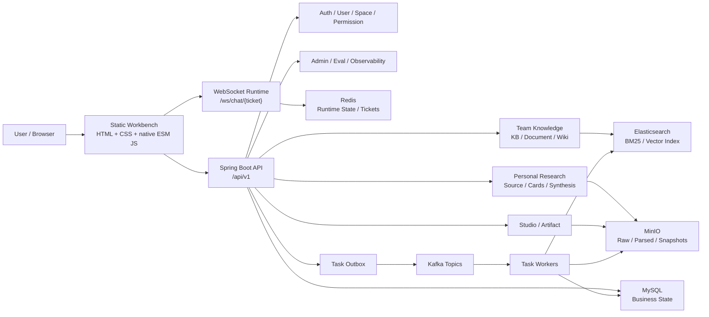

# NoteWeave

[](https://openjdk.org/projects/jdk/17/)
[](https://spring.io/projects/spring-boot)
[](src/main/resources/static)
[](docker-compose.yml)

NoteWeave 是一个面向团队知识协作与个人研究沉淀的 AI 知识工作台。它把团队知识库、RAG 问答、Wiki、个人研究资料、卡片化知识、Artifact 生成和长期记忆放进同一套 Space / Permission / Task / Evidence 底座里。

简单说：NoteWeave 想解决的是“知识从资料进入系统、被检索引用、生成成果，再沉淀为长期知识”的完整闭环。

## Highlights

- 统一工作台：基于 `Global Rail / Context Rail / Main Canvas / Inspector` 的静态前端工作台，覆盖 Chat、Wiki、Graph、Artifact、Memory 和 Admin。
- 团队知识闭环：知识库上传、断点续传、文档解析、Chunk 索引、RAG 问答、Citation 证据回溯、团队 Wiki 发布。
- 个人研究闭环：ResearchProject、Source 导入、Article / Concept / Synthesis Card、方法论匹配、Artifact 生成与沉淀。
- 可追踪 Evidence：Message、Artifact、Card、Wiki 都通过 citation 关系表保留来源、chunk、页码、offset、snapshot。
- 可靠异步任务：统一 `task / task_attempt / task_event / task_outbox`，通过 Kafka Worker 执行上传、解析、索引、生成、评测和清理任务。
- 流式 Chat Runtime：WebSocket ticket、`chat.delta`、`chat.completed`、stop、resume、DRAFT 生命周期和短期运行态恢复。
- 运维与评测：Admin 任务、健康检查、RAG Eval、LLM 调用日志、RetrievalTrace、AuditLog。
- 本地可验收：Docker Compose 一键启动 MySQL、Redis、MinIO、Elasticsearch、Kafka，并内置中文演示数据。

## What You Can Build With It

| 场景 | 能力 |
|---|---|
| 团队知识问答 | 上传资料到团队知识库，解析入索引后用 Chat 提问，并在 Inspector 查看引用证据。 |
| 团队 Wiki 沉淀 | 将稳定结论发布为 WikiPage，保留版本、关系、图谱节点与搜索索引。 |
| 个人研究整理 | 为研究项目导入文件、URL 或文本，编译为 ArticleCard / ConceptCard。 |
| 成果生成 | 基于团队或个人上下文生成 Report、Study Guide、Comparison、Work Prep 等 Artifact。 |
| 证据审计 | 从回答、成果、卡片追溯到 Citation、DocumentChunk、Source 或 ArtifactVersion。 |
| 工作台运营 | 查看任务状态、失败原因、健康组件、检索 Trace、LLM 日志和评测结果。 |

## Architecture



## Product Model

NoteWeave 的核心抽象是 `Space`。

- `PERSONAL Space`：个人研究、Source、Card、Artifact、UserMemory。
- `TEAM Space`：团队知识库、团队 Chat、团队 Wiki、团队 Artifact、SpaceMemory。
- `SpaceMember.role`：`OWNER / EDITOR / VIEWER`，控制团队空间内资源访问。
- `users.system_role`：`USER / ADMIN`，只用于系统后台权限，不和团队 OWNER 混用。

核心知识流：

```text
Team Document -> DocumentChunk -> Retrieval -> Citation -> Chat Answer
Chat / Artifact -> Wiki Draft -> WikiPageVersion -> WIKI_INDEX -> Team Graph

Personal Source -> ArticleCard / ConceptCard -> Artifact Generation
Artifact -> user confirmation -> SynthesisCard -> Personal Knowledge
```

## Feature Map

### Workbench Frontend

- 静态前端：`src/main/resources/static/index.html`
- 样式入口：`src/main/resources/static/app.css`
- 应用逻辑：`src/main/resources/static/js/app.js`
- API client：`src/main/resources/static/js/api.js`
- 不依赖 React / Vue / TypeScript / bundler。

当前工作台结构：

```text
[Global Rail] [Context Rail] [Main Canvas] [Inspector]
```

已接入的主要路由：

```text
/login
/register
/spaces
/spaces/:spaceId/workbench/chat
/spaces/:spaceId/wiki
/spaces/:spaceId/graph
/spaces/:spaceId/artifacts
/spaces/:spaceId/memory
/admin/tasks
/admin/health
/admin/evaluation
/admin/logs
```

### Backend Capabilities

- Auth：注册、登录、刷新 token、退出、当前用户。
- Space：团队空间、个人空间、成员与权限。
- Upload：分片上传、断点续传、秒传、取消、过期清理。
- Document：解析、切片、索引、搜索调试。
- RAG Chat：HTTP 问答、WebSocket 流式问答、停止、恢复、反馈。
- Citation：回答证据、Artifact 证据、Card 证据、Wiki 证据。
- Personal Research：项目、Source、ArticleCard、ConceptCard、SynthesisCard。
- Studio / Artifact：任务生成、版本、编辑、导出、沉淀到个人 Wiki。
- Wiki：草稿、发布、版本、搜索、关系、知识图谱。
- Memory：会话摘要、用户记忆、空间记忆、写入开关。
- Admin：任务、健康、清理、RAG Eval、Trace、LLM 日志、审计。

## Tech Stack

| Layer | Technology |
|---|---|
| Backend | Java 17, Spring Boot 3.3, Spring MVC, WebFlux, WebSocket |
| Security | Spring Security, JWT, refresh token session |
| Persistence | MySQL 8.4, Spring Data JPA, Flyway |
| Search | Elasticsearch 8.x |
| Object Storage | MinIO |
| Async Runtime | Kafka, Task Outbox, Worker |
| Runtime Cache | Redis |
| Parsing | Apache Tika |
| API Docs | springdoc-openapi |
| Frontend | Static HTML, native CSS, native ESM JavaScript |
| Tests | JUnit 5, Spring Boot Test, Testcontainers, Playwright smoke |

## Quick Start

### Prerequisites

- JDK 17+
- Maven 3.9+
- Docker Desktop or Docker Compose
- Node.js 18+ if you want to run browser smoke tests

If you use the full Docker path below, you do not need JDK or Maven installed locally.

### 1. Start The Full Stack With Docker

```powershell
Copy-Item .env.example .env
docker compose up -d --build
```

Default local ports:

| Service | Port |
|---|---:|
| MySQL | `13307` |
| Redis | `6380` |
| MinIO API | `19100` |
| MinIO Console | `19101` |
| Elasticsearch | `19200` |
| Kafka | `19092` |
| NoteWeave App | `18082` |

Open:

- App: [http://127.0.0.1:18082/login](http://127.0.0.1:18082/login)
- Swagger UI: [http://127.0.0.1:18082/swagger-ui.html](http://127.0.0.1:18082/swagger-ui.html)
- Health: [http://127.0.0.1:18082/actuator/health](http://127.0.0.1:18082/actuator/health)

### 2. Start Middleware Only For Local Development

```powershell
Copy-Item .env.example .env
docker compose up -d mysql redis minio minio-init elasticsearch kafka kafka-init
```

### 3. Start NoteWeave Locally

```powershell
$env:SPRING_PROFILES_ACTIVE="dev"
$env:SERVER_PORT="18082"
$env:NOTEWEAVE_LLM_STUB_ENABLED="true"
$env:EMBEDDING_STUB_ENABLED="true"
$env:EMBEDDING_ENABLED="false"
.\mvnw.cmd spring-boot:run
```

Open:

- App: [http://127.0.0.1:18082/login](http://127.0.0.1:18082/login)
- Swagger UI: [http://127.0.0.1:18082/swagger-ui.html](http://127.0.0.1:18082/swagger-ui.html)
- Health: [http://127.0.0.1:18082/actuator/health](http://127.0.0.1:18082/actuator/health)

### 4. Login With Demo Accounts

| Account | Password | Role |
|---|---|---|
| `admin` | `NoteWeave123!` | System admin, team owner |
| `alice` | `NoteWeave123!` | Personal owner, team editor |
| `bob` | `NoteWeave123!` | Team viewer |

Seeded demo data includes:

- Team space: `产品策略协作台`
- Team wiki: `研究协作原则`
- Team knowledge bases: `AI 产品研究资料库`, `发布准备台`
- Personal projects: `三季度新手引导阻力研究`, `竞品表述跟踪`
- Artifact: `三季度新手引导建议简报`

## Configuration

Most local defaults are already aligned with `docker-compose.yml`. Override with environment variables when needed:

```text
SERVER_PORT
DB_URL
DB_USERNAME
DB_PASSWORD
REDIS_HOST
REDIS_PORT
MINIO_ENDPOINT
MINIO_BUCKET
MINIO_TEST_BUCKET
ES_URIS
KAFKA_BOOTSTRAP_SERVERS
NOTEWEAVE_LLM_STUB_ENABLED
EMBEDDING_STUB_ENABLED
EMBEDDING_ENABLED
```

Helpful local setup files:

- Copy `.env.example` to `.env` for Docker and local runtime defaults.
- Copy `.env.embedding.example` to `.env.embedding` when you want a separate embedding provider config file.
- Use `.\mvnw.cmd` on Windows or `./mvnw` on macOS/Linux if Maven is not installed globally.

External model providers are optional in local development. Use stub mode when you only need to validate product flows.

## Testing

Run backend tests:

```powershell
mvn test
```

Compile without tests:

```powershell
mvn -DskipTests compile
```

Run browser smoke tests:

```powershell
cd tools/playwright-smoke
npm install
npm run install:browsers
npm run smoke
```

Useful manual acceptance path:

1. Login as `admin`.
2. Enter `产品策略协作台`.
3. Open Chat Workbench and send a WebSocket message.
4. Switch sessions from Context Rail.
5. Open Wiki and inspect relations / graph card.
6. Open `/spaces/47/graph` and click a graph node.
7. Use a seeded citation session to verify Citation Inspector.

## Repository Layout

```text
.
├── docs/                         # Contracts, phase docs, UI/UX plans
├── src/main/java/com/noteweave   # Spring Boot application
├── src/main/resources/db         # Flyway migrations
├── src/main/resources/static     # Static HTML/CSS/ESM frontend
├── src/test                      # Unit and integration tests
├── tools/playwright-smoke        # Browser smoke runner
├── docker-compose.yml            # Local middleware stack
└── pom.xml                       # Maven build
```

Important backend packages:

```text
auth / user / space / permission
task / storage / team / chat / citation
artifact / personal / memory / graph / admin
```

## API Surface

All business APIs use:

```text
/api/v1
```

Representative endpoints:

```http
POST /api/v1/auth/login
GET  /api/v1/spaces
GET  /api/v1/spaces/{spaceId}/chat-sessions
POST /api/v1/chat/ws-ticket
GET  /api/v1/chat/messages/{messageId}/citations
GET  /api/v1/team/spaces/{spaceId}/wiki-pages
GET  /api/v1/team/wiki-pages/{pageId}/relations
GET  /api/v1/spaces/{spaceId}/knowledge-graph
GET  /api/v1/spaces/{spaceId}/knowledge-graph/nodes/{nodeId}
GET  /api/v1/admin/health
```

WebSocket:

```text
/ws/chat/{ticket}
```

Runtime events:

```text
chat.connected
chat.started
chat.delta
chat.completed
chat.stopped
chat.failed
chat.restored
session.state.updated
```

## Development Principles

- Contract first: API prefix, response shape, task model, permission model and evidence model are defined before implementation.
- TDD by phase: write failing tests, implement the smallest slice, then refactor.
- Docker-only middleware: local development uses Docker Compose, integration tests use Testcontainers.
- Evidence is relational: citations are stored in relation tables, not only JSON payloads.
- Artifact and Wiki are separate: generated output becomes long-term knowledge only after explicit user confirmation.
- Frontend stays lightweight: static HTML, CSS and native ESM JavaScript until the project contract changes.

## Documentation

- [Project status](docs/PROJECT_STATUS.md)
- [Implementation contract](docs/CONTRACT.md)
- [Docker middleware contract](docs/DOCKER_MIDDLEWARE.md)
- [Implementation breakdown](docs/implementation_breakdown.md)
- [Database and API blueprint](docs/features/database_api_blueprint.md)
- [Frontend workspace phase](docs/features/phase_16_frontend_workspace.md)
- [Workbench refactor plan](docs/uiux/NOTEWEAVE_WORKBENCH_FRONTEND_REFACTOR_PLAN.md)
- [Startup guide](NOTEWEAVE_启动指南.md)
- [Acceptance guide](NOTEWEAVE_验收说明.md)

## Status

This repository is an active product prototype / engineering workbench. Core backend phases, the static frontend workbench shell, Chat Workbench, Wiki Workbench and Graph Inspector are implemented and locally verifiable. Some advanced roadmap items remain intentionally deferred, including Quiz, external source auto-discovery, complex real-time co-editing and commercial billing.
