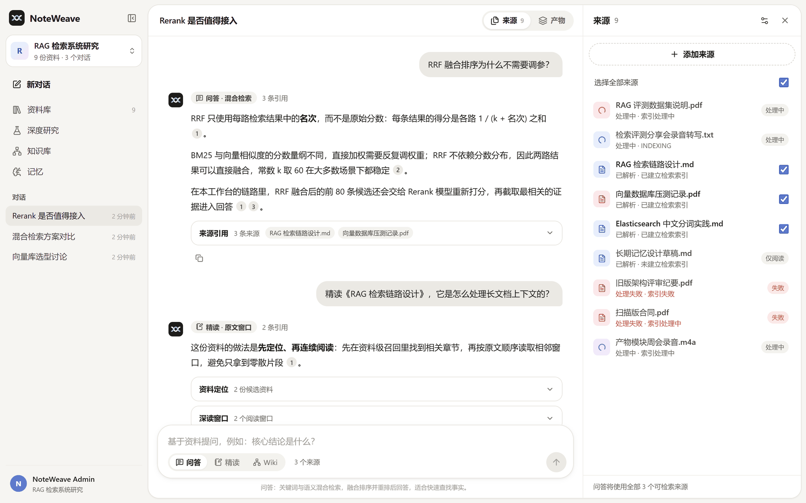

# NoteWeave v2

NoteWeave 是一个面向个人资料研究与长期知识沉淀的 AI 工作台。资料、对话、知识页、研究任务、产物和长期记忆都按 Workspace 隔离；Java Backend 持有全部业务状态与判定，两个 Python Worker 负责研究执行和内容生成。


## 核心能力

| 能力 | 做了什么 |
| --- | --- |
| 深度研究 Deep Research | 把研究过程表示为研究表（Table-as-State）：行是研究对象，列是待验证字段，每个格子独立追踪候选、证据与判定。子任务并行执行，经 Verifier 校验，缺口和冲突触发局部重规划与受限反证；每一波写入检查点，支持断点恢复；最终报告附逐条引用审计。 |
| 问答 / 精读 / Wiki | 问答走 BM25 + 向量召回 + RRF 融合 + Rerank；精读按资料级召回并读取连续原文窗口；Wiki 维护页面关系、反链与来源回链，概念由大模型挑选并定期清理。三条链路都输出带引用的回答。 |
| 资料异步流水线 | 分片上传后，解析、切片、向量化、索引拆成四个 Kafka 阶段；各阶段幂等，失败进入死信并回写状态，索引失败自动退避重试；单文件支持 128 MB，音视频资料自动转写。 |
| 产物框架 | 产物类型由 Skill 目录声明，Java Host 负责编排、校验和版本管理，Python Worker 负责生成与导出；通过系统 MCP 接入 B站字幕、抓帧、画面 OCR 与语音转写，支持视频摘要、知识博客、面试问答、PPTX 和 PDF 讲义。 |
| Context 与 Memory | 长对话按话题切分窗口并做大模型增量摘要；从对话中提取记忆候选，经来源可信度、预期效用、风险、冲突四项门控后晋升；记忆只影响表达方式，事实只来自资料证据。 |

## 运行效果

以下截图使用前端开发模式自带的演示数据（`frontend/src/dev`，在 `frontend/.env.local` 中设置 `VITE_NOTEWEAVE_MOCK=1` 开启），界面与真实环境一致。

<table>
  <tr>
    <td width="50%"><br><sub>问答与精读：回答逐句标注引用，可展开资料定位、阅读窗口和摘录证据</sub></td>
    <td width="50%"><br><sub>深度研究报告：结论、关键差异和尚未确认的问题，引用可回溯到原文</sub></td>
  </tr>
  <tr>
    <td><br><sub>研究表（Table-as-State）：逐格展示已验证、冲突、待修复和缺证据</sub></td>
    <td><br><sub>资料库：每份资料的解析、切片、向量化、索引进度与失败重试</sub></td>
  </tr>
  <tr>
    <td><br><sub>知识库：知识页分类、关系图谱与来源引用统计</sub></td>
    <td><br><sub>产物工作室：基于资料或音视频生成多种产物，视频学习入口与产物进度</sub></td>
  </tr>
  <tr>
    <td><br><sub>记忆：待确认候选展示四项门控检查结果，记忆只影响表达方式</sub></td>
    <td></td>
  </tr>
</table>

## 架构说明

### 资料异步流水线


上传接口只负责接收分片、校验格式和摘要，随后立即返回。解析、切片、向量化和索引各自消费一个 topic，阶段之间只传递资料快照 ID，大对象通过 MinIO 交接，因此大文件处理不会占用业务请求线程。音视频资料在解析阶段交给 Artifact Worker 转写，回调后继续后续阶段。

### 深度研究闭环


Backend 是研究状态的唯一来源：规划研究表、分发子任务、合并候选、验证、判定完成和写检查点都在 Java 侧完成，Research Worker 只领取子任务并提交候选与证据。研究子任务按任务 ID 分布到 Kafka 分区，Worker 容器内的多个消费进程并行处理（由 `NOTEWEAVE_RESEARCH_AGENT_MAX_CONCURRENCY` 控制）。完成判定只在模型或检索服务不可用时给出失败；证据不足属于业务结果，系统会输出列出已核验事实和未解决原因的报告。

### 视频学习


所有视频产物都基于同一份冻结素材生成。知识规划由大模型给出大纲和原文引句，再由代码组装成完整结构，引句不在字幕原文中的观点会被丢弃；Backend 发布版本前会复核产物与冻结素材是否一致。

## 技术栈

| 组件 | 实现 |
| --- | --- |
| Backend | Java 17、Spring Boot 3.3、Spring JDBC、Flyway（迁移到 `V130`） |
| Frontend | React 19、TypeScript 5、Vite 5，Nginx 托管 |
| Research Worker | Python 3.12、Pydantic、kafka-python |
| Artifact Worker | Python 3.12、FastAPI、faster-whisper、yt-dlp、XeLaTeX、python-pptx |
| 存储与中间件 | MySQL 8.4、Redis 7.2、Kafka、MinIO、Elasticsearch 8.15 |
| 外部服务 | OpenAI 兼容大模型、Embedding、Rerank、Serper 联网检索 |

Backend 与 Worker 之间的通信方式：研究子任务、产物任务和视频素材采集都由 Backend 写入 Outbox，再投递到 Kafka；Worker 通过带令牌和签名的内部 HTTP 接口回调结果；音视频资料转写由 Backend 直接调用 Artifact Worker 的 HTTP 接口。Worker 不直接写 Java 业务表。

## Docker 启动

在仓库根目录复制环境变量示例：

```powershell
Copy-Item .env.example .env
```

至少替换 `.env` 中的数据库、Redis、Kafka、Elasticsearch、MinIO 密码、内部服务令牌和 Bootstrap 账号密码，再按需填写大模型与检索服务的配置。然后启动完整应用：

```powershell
docker compose --profile app up --build -d
docker compose --profile app ps
```

浏览器入口是 `http://localhost:3000`，前端由 Nginx 托管，同源 `/api` 请求转发到 Backend（容器端口 `8081`）。Artifact Worker 的容器内控制面端口是 `18092`。不带 `--profile app` 的 `docker compose up -d` 只启动 MySQL、Redis、Kafka、MinIO 和 Elasticsearch。

### Provider 配置

聊天问答、深度研究和产物生成分别读取各自的大模型配置，不共用同一组密钥变量：

| 用途 | 主要变量 |
| --- | --- |
| 聊天问答 | `NOTEWEAVE_LLM_ENDPOINT`、`NOTEWEAVE_LLM_API_KEY`、`NOTEWEAVE_LLM_MODEL` |
| 深度研究 | `NOTEWEAVE_RESEARCH_LLM_BASE_URL`、`NOTEWEAVE_RESEARCH_LLM_API_KEY`、`NOTEWEAVE_RESEARCH_LLM_MODEL` |
| 产物生成 | `NOTEWEAVE_ARTIFACT_LLM_BASE_URL`、`NOTEWEAVE_ARTIFACT_LLM_API_KEY`、`NOTEWEAVE_ARTIFACT_LLM_MODEL` |
| 向量与重排 | `NOTEWEAVE_EMBEDDING_*`、`NOTEWEAVE_RERANK_*` |

对应密钥为空时应用仍能启动，相关生成会明确失败或降级。其他常用开关：

- `NOTEWEAVE_RESEARCH_AGENT_MAX_CONCURRENCY`：研究 Worker 并行消费进程数。
- `NOTEWEAVE_RESEARCH_CHECKPOINT_HYDRATION_V2`：开启后，研究可从检查点恢复并复用已验证的格子。
- `NOTEWEAVE_VIDEO_LEARNING_ENABLED`：开启 B站视频学习入口。

完整演示前可以检查配置：

```powershell
.\scripts\smoke-compose-provider-readiness.ps1 -EnvFile .env -RequireFullDemo
```

## 本地开发

Backend：

```powershell
.\mvnw.cmd -f backend\pom.xml spring-boot:run
```

Frontend：

```powershell
Set-Location frontend
corepack enable
pnpm install --frozen-lockfile
pnpm dev
```

Python Worker 的环境与启动命令见 [workers/README.md](./workers/README.md)。修改产物目录时只改 `reference/artifact-skill-catalog-v2.json`，再运行 `python scripts/sync-artifact-skill-catalog.py` 同步到 Backend 和 Worker。

## 测试

```powershell
# Backend 全量测试
.\mvnw.cmd -f backend\pom.xml test

# Frontend 单元测试、类型检查与构建
Set-Location frontend
pnpm test
pnpm build

# Worker 测试
.\workers\scripts\test-workers.ps1
```

真实浏览器 E2E 需要先启动完整 Compose 环境，不使用 Mock Server，会创建真实 Workspace、上传资料并观察任务事件：

```powershell
Set-Location frontend
corepack pnpm e2e
```

## 目录

| 目录 | 内容 |
| --- | --- |
| `backend` | Java 主系统、Flyway 迁移和后端测试 |
| `frontend` | React 工作台、组件测试和 Playwright E2E |
| `workers/research-worker` | 深度研究执行面 |
| `workers/artifact-worker` | 产物生成执行面与系统 MCP |
| `reference` | 产物 Skill 目录等跨语言共享定义 |
| `scripts` | 运行、评测、Smoke 和同步脚本 |
| `docs` | 长期技术文档，入口见 [文档中心](./docs/README.md)，架构图位于 `docs/images` |
