<div align="center">

# NoteWeave

**面向个人资料研究与长期知识沉淀的 AI 工作台**

带引用的问答与精读、验证驱动的深度研究、从资料和 B站视频生成学习产物，并把对话中的偏好沉淀为长期记忆。


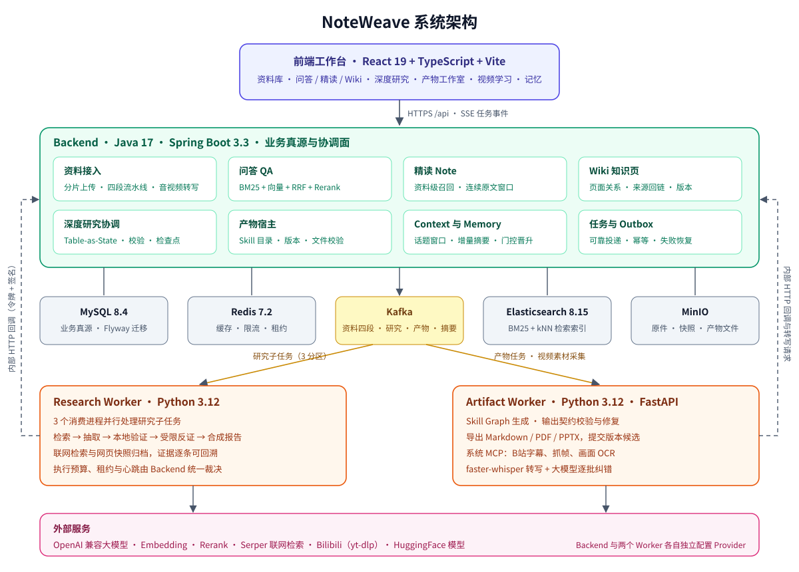

</div>

> 本文所有界面截图均来自本地真实运行环境：真实上传的资料、真实的模型调用、联网检索和 MCP 工具结果，没有使用演示数据。

## 目录

- [系统概览](#系统概览)
- [一、验证驱动、可恢复的 Deep Research Agent](#一验证驱动可恢复的-deep-research-agent)
- [二、任务感知的问答 / 精读 / Wiki 知识链路](#二任务感知的问答--精读--wiki-知识链路)
- [三、资料异步处理流水线](#三资料异步处理流水线)
- [四、Schema 驱动的产物生成框架](#四schema-驱动的产物生成框架)
- [五、Context 与长期 Memory](#五context-与长期-memory)
- [技术栈与项目规模](#技术栈与项目规模)
- [快速开始](#快速开始)
- [本地开发与测试](#本地开发与测试)
- [目录结构与延伸阅读](#目录结构与延伸阅读)

## 系统概览

| 组件 | 职责 |
| --- | --- |
| **Backend**（Java） | 唯一的业务真源：Workspace 隔离与权限、资料版本、研究表与全部判定、产物版本、记忆门控、配额与限流。跨进程任务先写 Outbox，再投递 Kafka。 |
| **Research Worker**（Python） | 无状态执行面：领取研究子任务，完成联网检索、网页快照、原文抽取和本地校验，只提交候选与证据。 |
| **Artifact Worker**（Python） | 按 Skill 目录生成产物并导出 PPTX、PDF；内置系统 MCP 服务端，负责字幕、抓帧、OCR 与转写。 |
| **Frontend**（React） | 三栏工作台：导航与对话列表、对话与研究、来源与产物面板；通过 SSE 接收回答流和任务事件。 |
| **存储与中间件** | MySQL 保存真源与审计账本；Elasticsearch 承担 BM25 与向量检索；MinIO 存放大文件和产物；Redis 负责配额限流、热点缓存和回答流的跨实例转发；Kafka 承载各阶段任务。 |

模型调用统一使用 OpenAI 官方 SDK（Java 与 Python），可接入任意兼容 OpenAI 协议的服务；Agent 编排没有使用框架，由 Backend 的状态机驱动，模型在每一步只产出结构化 JSON，便于验证、审计和恢复。

## 一、验证驱动、可恢复的 Deep Research Agent

**要解决的问题**：开放研究容易漂移，证据不足时模型倾向于编造结论，长任务中断后只能从头再来。

- **研究表（Table-as-State）**：行是研究对象，列是待验证字段，每个格子独立追踪候选、证据与判定，研究状态全部落在 Backend 的表里。
- **规划、执行、验证闭环**：子任务经 Kafka 分区并行执行，Verifier 逐格校验；缺口与冲突触发局部重规划和受限反证，每格修复次数有上限。
- **检查点恢复**：每一波结束写入账本快照并带内容摘要，恢复时校验摘要，把已验证的格子带入新任务，只重做缺口。
- **诚实的完成判定**：只有模型或检索服务不可用才判失败；证据不足属于业务结果，报告会列出已核验事实和每格未解决的原因。

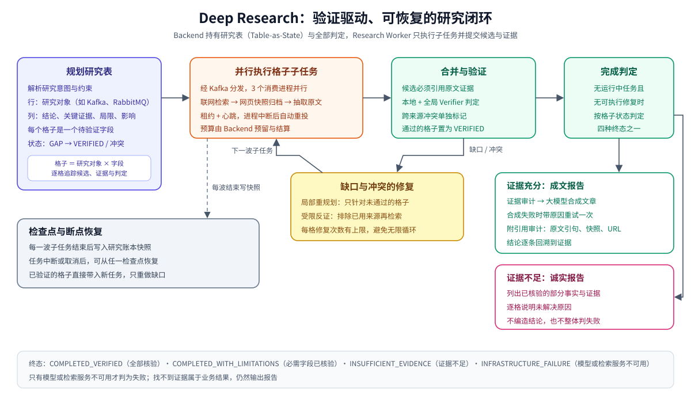

<table>
  <tr>
    <td width="50%">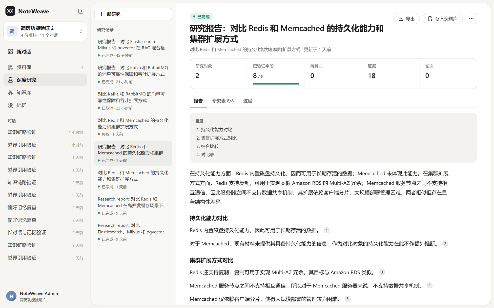<br><sub><b>研究报告</b>：Redis 与 Memcached 对比，8 个字段全部核验，18 条证据，结论逐句带引用编号</sub></td>
    <td width="50%">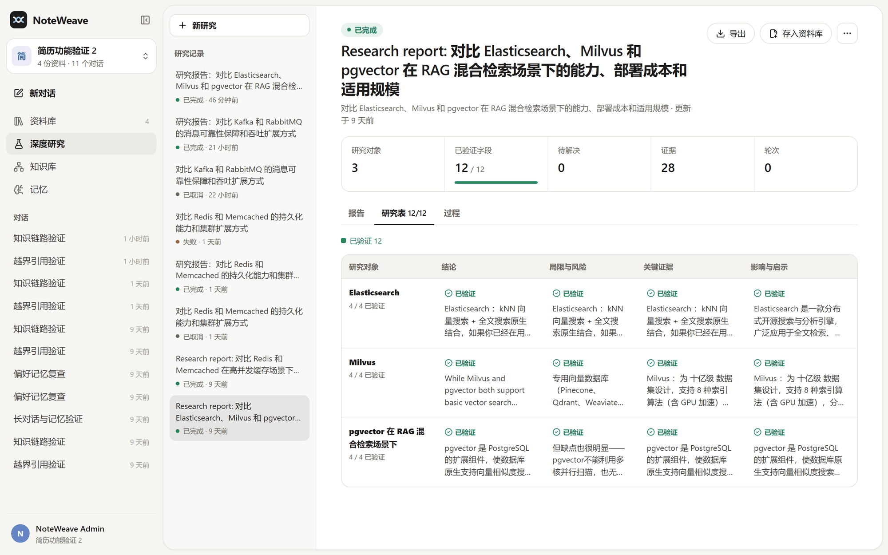<br><sub><b>研究表</b>：Elasticsearch / Milvus / pgvector 三个对象 × 四个字段，12 格全部已验证，28 条证据</sub></td>
  </tr>
</table>

## 二、任务感知的问答 / 精读 / Wiki 知识链路

**要解决的问题**：单一 RAG 链路无法同时满足快速事实查询、长文档连续阅读和跨资料知识整合。

- **问答**：Elasticsearch 同时做 BM25 与 kNN 召回，RRF 按名次融合，召回不足时扩展查询，再交给 Rerank 精排。
- **精读**：先做资料级召回确定相关资料，再为候选窗口打分并按原文顺序读取连续窗口，避免只拿到零散片段。
- **Wiki**：资料解析后沉淀为知识页，页面之间维护链接、反向链接与来源回链；回答沿知识网络展开，图遍历受预算约束。
- 三种模式共用证据预算与范围校验，只能引用本工作台、所选资料范围内的证据。

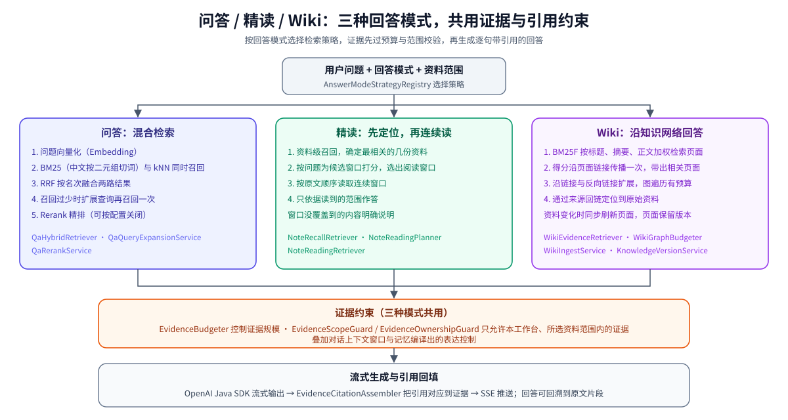

<table>
  <tr>
    <td width="50%">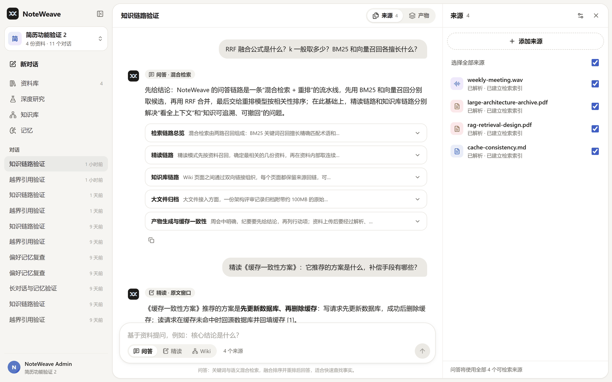<br><sub><b>问答</b>：混合检索回答 RRF 与两路召回的问题，先给结论，再按要点分节展开</sub></td>
    <td width="50%">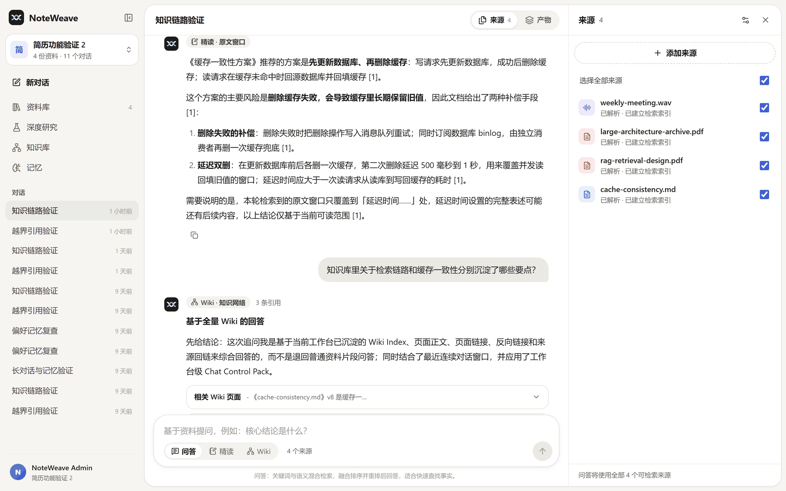<br><sub><b>精读</b>：读取《缓存一致性方案》的原文窗口作答，并说明窗口只覆盖到哪里</sub></td>
  </tr>
  <tr>
    <td colspan="2">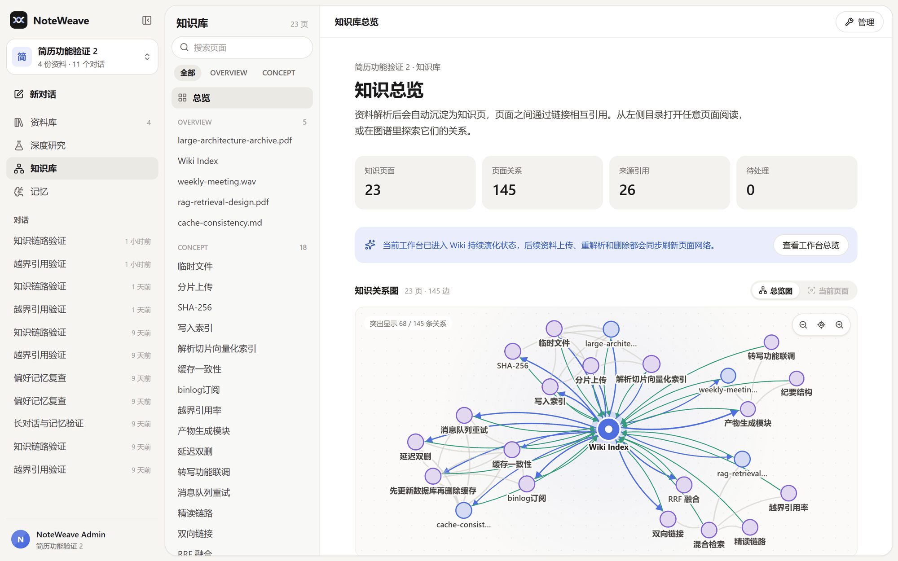<br><sub><b>知识库</b>：4 份资料沉淀出 23 个知识页、145 条页面关系，关系图可交互浏览</sub></td>
  </tr>
</table>

## 三、资料异步处理流水线

**要解决的问题**：大文件同步处理会阻塞请求，资料链路长，任一阶段失败都难以定位和恢复。

- 分片上传后，解析、切片、向量化、索引拆成四个 Kafka 阶段，阶段之间只传递资料快照 ID，大对象通过 MinIO 交接。
- 各阶段按幂等键去重，失败进入死信并回写状态，索引失败自动退避重试；单文件支持 128 MB。
- 音视频资料在解析阶段交给 Artifact Worker 的 MCP 转写工具，转写结果再由大模型逐批校对识别错误。

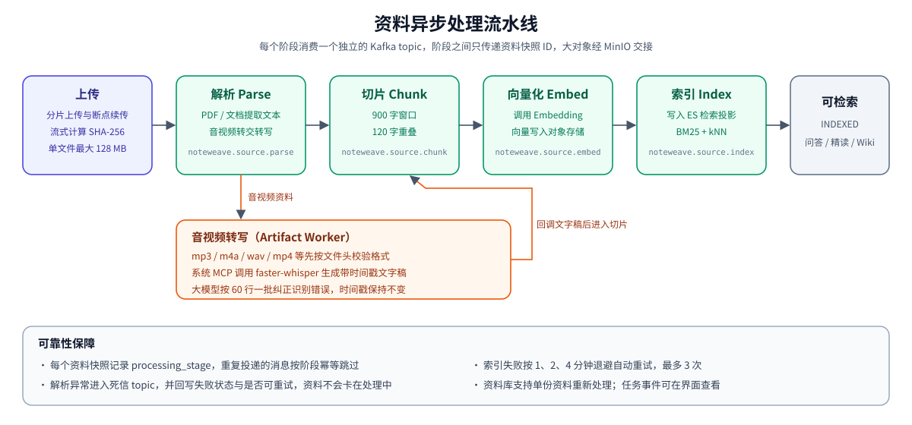

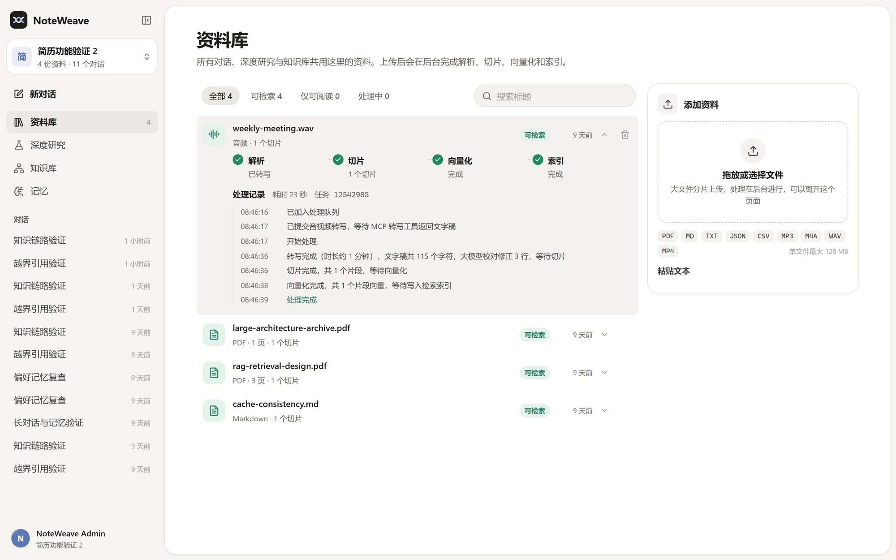
<sub><b>资料库</b>：一段会议录音的处理记录，依次经过 MCP 转写（大模型校对修正 3 行）、切片、向量化、索引，全程 23 秒</sub>

## 四、Schema 驱动的产物生成框架

**要解决的问题**：报告、测验、导图、讲义等产物各写一套 Prompt 和流程，难以复用，结果也无法校验。

- **Skill 目录声明产物**：输入、输出契约、所需能力和导出格式都写在目录里，新增产物类型不改编排代码。
- **Java Host + Python Worker 分层**：Host 负责创建任务、冻结输入、复核契约与证据覆盖、管理版本；Worker 负责生成与导出。
- **系统 MCP 接入外部能力**：基于官方 MCP Python SDK，提供 B站字幕、音频转写、抓帧、画面 OCR 和 PDF 编译，参数按 inputSchema 校验。
- **视频学习**：一次采集视频素材并冻结，生成视频摘要、知识博客、面试问答、学习 PPTX 和 PDF 讲义；每个观点必须引用字幕原文，Host 发布前复核产物与冻结素材是否一致。

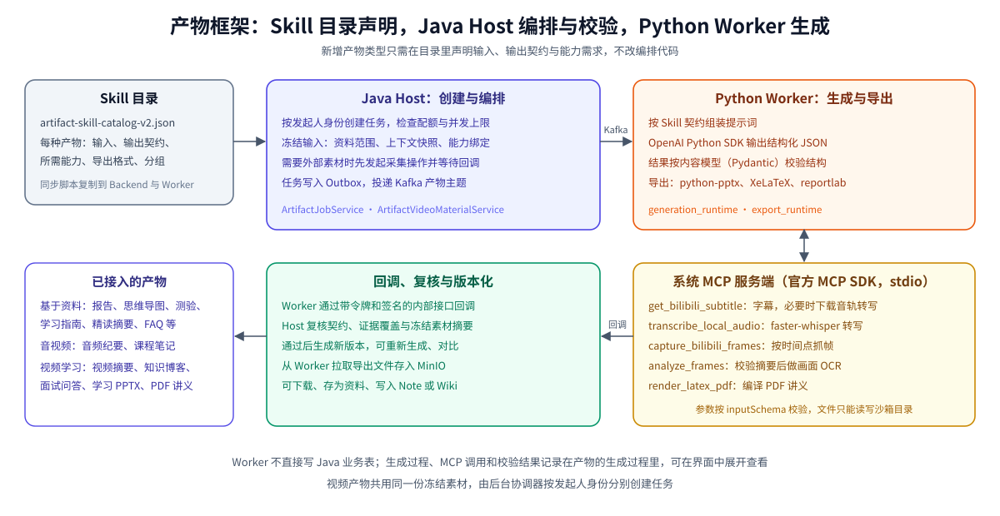

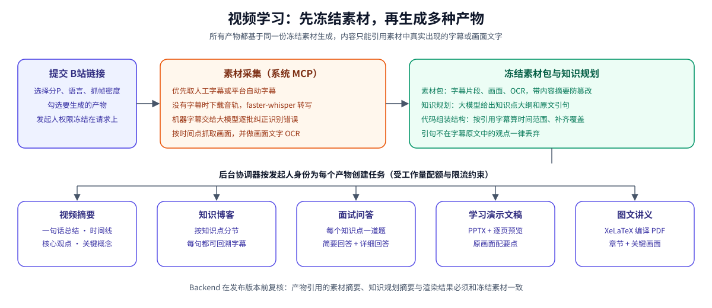

<table>
  <tr>
    <td width="50%">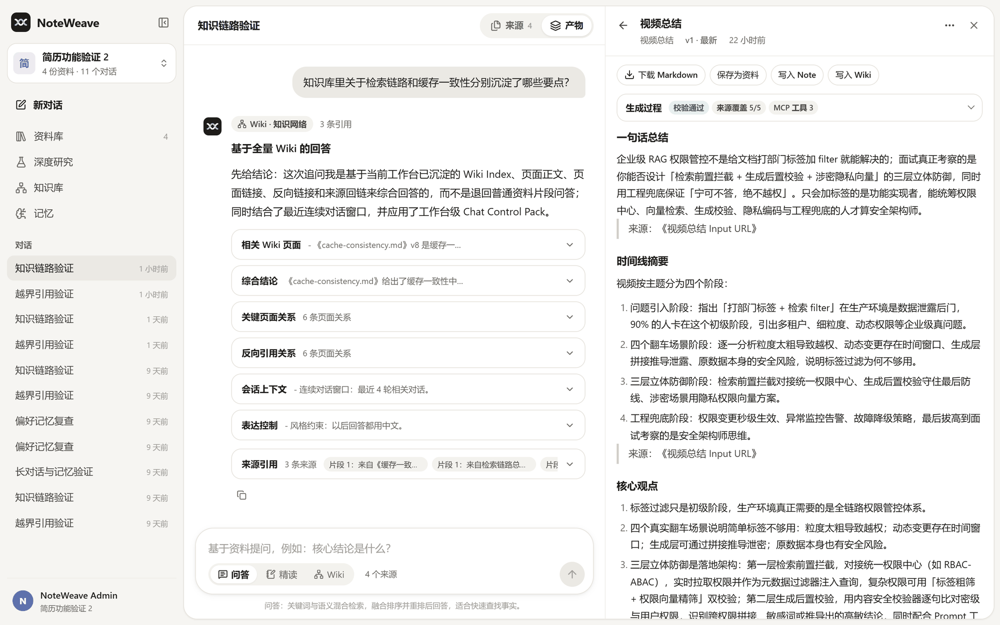<br><sub><b>视频摘要</b>：生成过程显示校验通过、来源覆盖 5/5、调用 MCP 工具 3 个</sub></td>
    <td width="50%">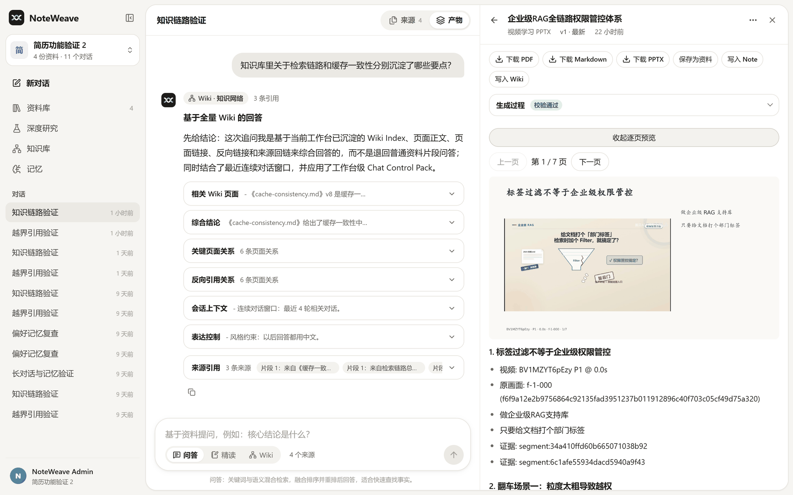<br><sub><b>学习 PPTX</b>：逐页预览，每页配视频原画面，并标注视频时间点与字幕证据</sub></td>
  </tr>
  <tr>
    <td width="50%">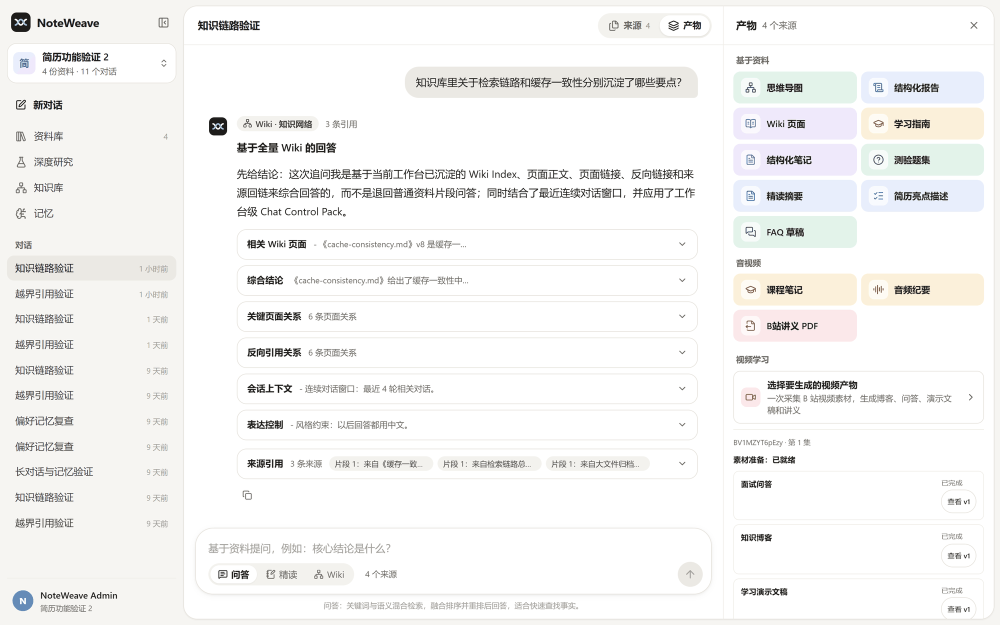<br><sub><b>产物面板</b>：产物按输入类型分组，同一视频的面试问答、知识博客、学习演示文稿均已完成</sub></td>
    <td width="50%">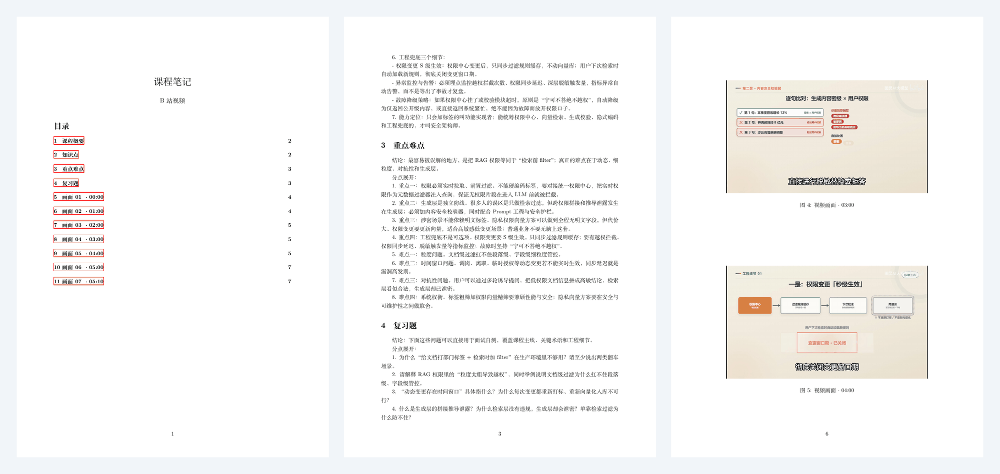<br><sub><b>PDF 讲义</b>：XeLaTeX 编译的课程笔记，包含目录、知识点、复习题和带时间点的视频画面</sub></td>
  </tr>
</table>

## 五、Context 与长期 Memory

**要解决的问题**：长对话上下文不断膨胀，用户偏好无法沉淀，自动记忆又容易把错误内容带进后续回答。

- **上下文编译**：长对话按话题切分，每个话题由大模型增量更新摘要，回答时在 Token 预算内选取相关轮次与摘要。
- **记忆门控**：从对话中提取偏好与禁忌作为候选，经来源可信度、预期效用、风险、冲突四项门控；全部通过才自动生效，否则进入待确认。
- **记忆只控制表达**：生效记忆编译为表达控制（语气、结构、避免的写法），事实与引用始终来自资料证据；使用效果变差的记忆会回到待确认。

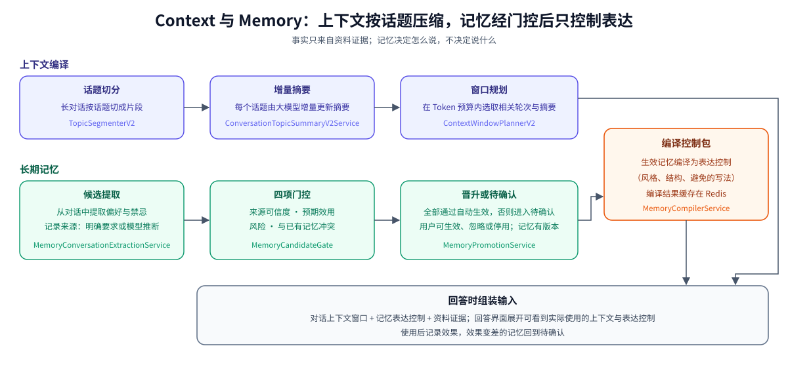

<table>
  <tr>
    <td width="50%">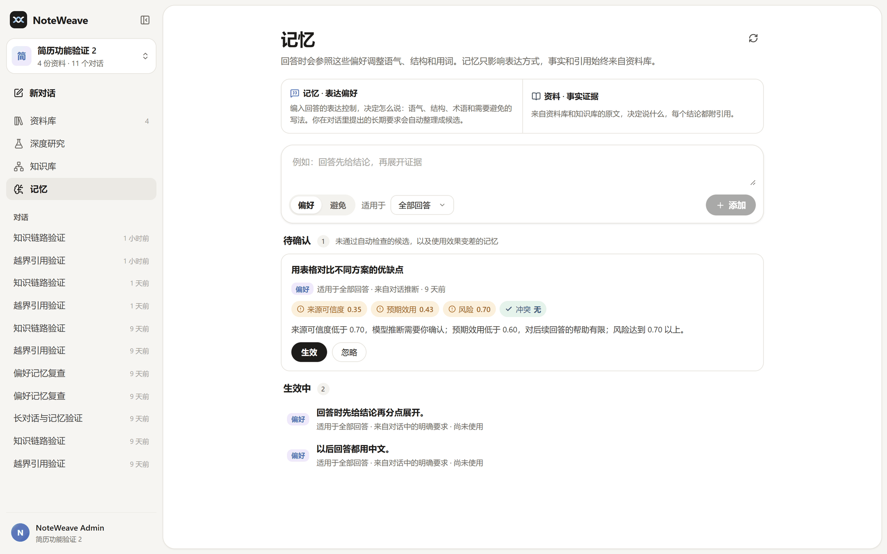<br><sub><b>记忆</b>：一条模型推断的候选未通过门控（来源可信度 0.35、预期效用 0.43、风险 0.70），等待确认；两条明确要求已生效</sub></td>
    <td width="50%">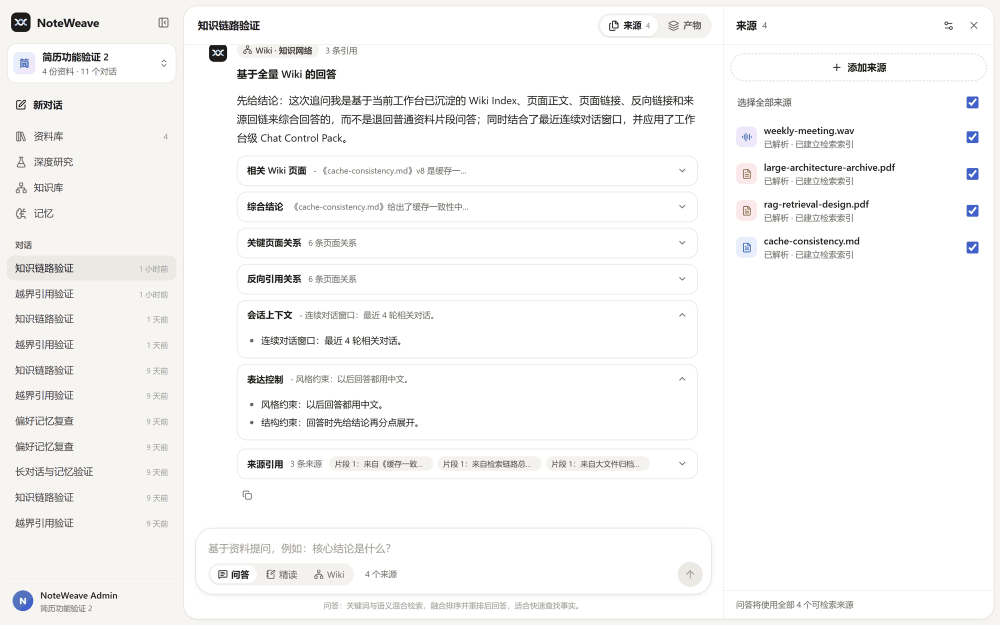<br><sub><b>回答时实际使用的上下文</b>：最近 4 轮相关对话，以及由两条生效记忆编译出的风格与结构约束</sub></td>
  </tr>
</table>

## 技术栈与项目规模

| 组件 | 实现 |
| --- | --- |
| Backend | Java 17、Spring Boot 3.3、Spring JDBC、Flyway、OpenAI Java SDK |
| Frontend | React 19、TypeScript 5、Vite 5，Nginx 托管 |
| Research Worker | Python 3.12、Pydantic、kafka-python、OpenAI Python SDK |
| Artifact Worker | Python 3.12、FastAPI、OpenAI Python SDK、MCP Python SDK、faster-whisper、yt-dlp、XeLaTeX、python-pptx |
| 存储与中间件 | MySQL 8.4、Redis 7.2、Kafka、MinIO、Elasticsearch 8.15 |
| 外部服务 | OpenAI 兼容大模型、Embedding、Rerank、Serper 联网检索 |

| 模块 | 源码规模 | 自动化测试 |
| --- | --- | --- |
| Backend | 约 7.5 万行 Java，113 个 Flyway 迁移 | 1200 个测试 |
| Research Worker | 约 2.6 万行 Python | 672 个测试 |
| Artifact Worker | 约 2.1 万行 Python | 387 个测试 |
| Frontend | 约 4.4 万行 TypeScript | 290 个组件与单元测试，另有真实环境 Playwright E2E |

## 快速开始

需要 Docker 与 Docker Compose。在仓库根目录复制环境变量示例：

```powershell
Copy-Item .env.example .env
```

至少替换 `.env` 中的数据库、Redis、Kafka、Elasticsearch、MinIO 密码、内部服务令牌和 Bootstrap 账号密码，再填写大模型与检索服务配置。然后启动完整应用：

```powershell
docker compose --profile app up --build -d
docker compose --profile app ps
```

浏览器打开 `http://localhost:3000`，用 Bootstrap 账号登录。前端由 Nginx 托管，同源 `/api` 请求转发到 Backend（容器端口 `8081`）。不带 `--profile app` 时只启动 MySQL、Redis、Kafka、MinIO 和 Elasticsearch。

聊天问答、深度研究和产物生成分别读取各自的大模型配置，可以接入不同的服务：

| 用途 | 主要变量 |
| --- | --- |
| 聊天问答 | `NOTEWEAVE_LLM_ENDPOINT`、`NOTEWEAVE_LLM_API_KEY`、`NOTEWEAVE_LLM_MODEL` |
| 深度研究 | `NOTEWEAVE_RESEARCH_LLM_BASE_URL`、`NOTEWEAVE_RESEARCH_LLM_API_KEY`、`NOTEWEAVE_RESEARCH_LLM_MODEL` |
| 产物生成 | `NOTEWEAVE_ARTIFACT_LLM_BASE_URL`、`NOTEWEAVE_ARTIFACT_LLM_API_KEY`、`NOTEWEAVE_ARTIFACT_LLM_MODEL` |
| 向量与重排 | `NOTEWEAVE_EMBEDDING_*`、`NOTEWEAVE_RERANK_*` |
| 联网检索 | `NOTEWEAVE_RESEARCH_SEARCH_*` |

其他常用开关：`NOTEWEAVE_RESEARCH_AGENT_MAX_CONCURRENCY`（研究 Worker 并行消费进程数）、`NOTEWEAVE_RESEARCH_CHECKPOINT_HYDRATION_V2`（从检查点恢复并复用已验证的格子）、`NOTEWEAVE_VIDEO_LEARNING_ENABLED`（开启 B站视频学习入口）。完整演示前可以检查配置是否齐全：

```powershell
.\scripts\smoke-compose-provider-readiness.ps1 -EnvFile .env -RequireFullDemo
```

## 本地开发与测试

```powershell
# Backend
.\mvnw.cmd -f backend\pom.xml spring-boot:run

# Frontend
Set-Location frontend
corepack enable
pnpm install --frozen-lockfile
pnpm dev
```

只想看界面时，在 `frontend/.env.local` 写入 `VITE_NOTEWEAVE_MOCK=1`，前端会使用内置的演示数据，不需要启动后端。Python Worker 的环境与启动方式见 [workers/README.md](./workers/README.md)。修改产物目录时只改 `reference/artifact-skill-catalog-v2.json`，再运行 `python scripts/sync-artifact-skill-catalog.py` 同步到 Backend 和 Worker。

```powershell
# Backend 全量测试
.\mvnw.cmd -f backend\pom.xml test

# Frontend 单元测试、类型检查与构建
Set-Location frontend
pnpm test
pnpm build

# Worker 测试
.\workers\scripts\test-workers.ps1

# 真实浏览器 E2E（需要先启动完整 Compose 环境）
Set-Location frontend
corepack pnpm e2e
```

## 目录结构与延伸阅读

```text
NoteWeave
├── backend                  Java 主系统、Flyway 迁移和后端测试
├── frontend                 React 工作台、演示数据、组件测试和 Playwright E2E
├── workers
│   ├── research-worker      深度研究执行面
│   └── artifact-worker      产物生成与导出
│       └── mcp_servers      系统 MCP 服务端（字幕、抓帧、OCR、转写、PDF 渲染）
├── reference                产物 Skill 目录等跨语言共享定义
├── scripts                  运行、评测、Smoke 和同步脚本
└── docs                     设计文档与架构图
```

| 主题 | 文档 |
| --- | --- |
| 领域模型、系统拓扑与全链路 | [系统架构设计](./docs/系统架构设计.md) |
| 各能力的演化过程与技术取舍 | [系统设计演化与技术取舍](./docs/系统设计演化与技术取舍.md) |
| 深度研究 | [Research Agent 架构](./docs/DeepResearch-ResearchAgent架构文档.md) |
| 问答、精读与 Wiki | [问答 RAG 链路设计](./docs/问答RAG链路设计.md)、[Note 链路设计](./docs/Note链路设计.md)、[Wiki 模式设计](./docs/Wiki模式设计.md) |
| 资料上传、解析与检索投影 | [资料基础设施详细设计](./docs/资料基础设施详细设计.md) |
| 产物框架 | [Artifact Skill 执行架构](./docs/Artifact-Skill执行架构.md) |
| 记忆 | [Memory 机制详细设计](./docs/Memory机制详细设计.md) |
| 接口与事件 | [API 与事件契约](./docs/API与事件契约-v2.md) |

完整文档入口见 [文档中心](./docs/README.md)。
