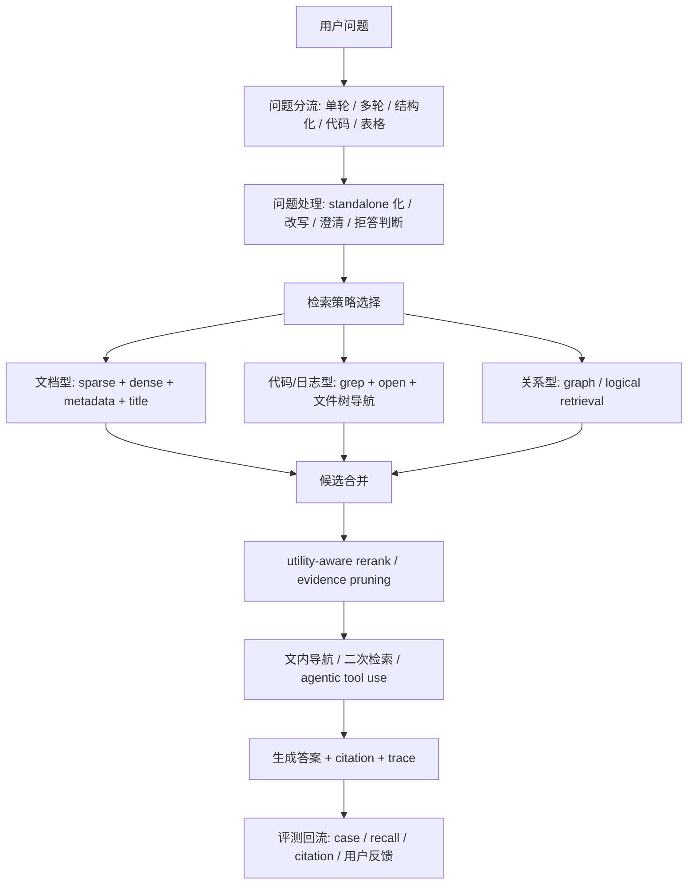

# 2026 RAG 流程优化综述与 linux.do 观点总结

更新时间：2026-06-07

补充说明：如果你想看按 RAG 全流程展开、偏“知识讲解与设计指南”的版本，请优先阅读 [RAG全流程知识讲解与设计指南.md](/D:/java-projects/NoteWeave/docs/RAG全流程知识讲解与设计指南.md)。

## 1. 文档目的

这份文档做两件事：

1. 总结 [linux.do 这条讨论](https://linux.do/t/topic/2187051/16) 里提到的核心观点。
2. 结合截至 2026-06-07 能查到的 2026 年资料，整理 RAG 在不同流程节点上的最新优化方向。

这里重点关注“流程级优化”，而不是只罗列模型名词。也就是说，关注的是：

- 问题进入系统前怎么改写
- 文档怎么切
- 怎么召回
- 怎么重排
- 什么时候该走 Agentic RAG
- 什么时候干脆不该走传统向量 RAG

---

## 2. linux.do 帖子里提到的核心观点

结合原帖与后续回复，可以把主要观点概括成下面几条。

### 2.1 RAG 不是一个点，而是一条链路

帖子把 RAG 拆成了一条完整流水线：

- 问题预处理
- 分块
- 向量化
- Top-K 召回
- 关键词检索
- 多路召回
- rerank 重排序
- 提示词拼接
- 引用与来源回传

这个视角很重要。它意味着 RAG 质量差时，不能只怪“大模型不行”或者“embedding 不行”，而是要按链路分段排查。

### 2.2 “问题重写”对 retrieval 影响很大

链接定位到的第 16 楼明确提到：问题重写很像传统搜索里的“搜索词改写”，对检索结果影响很大，而且一般都会做。

后续回复进一步把它解释成两类动作：

- 把用户表述不清的问题改得更清楚
- 生成多个语义等价但词面不同的查询，以提升召回覆盖

这本质上就是今天常说的：

- query rewrite
- query expansion
- multi-query retrieval
- decontextualization

### 2.3 向量检索不是万能的

帖子和回复里都反复强调了一个非常实用的观点：对代码、日志、小规模长文本、结构化材料来说，向量检索不一定是最优。

典型替代方案包括：

- `grep` / `ripgrep` 这类精确检索
- 基于文件树、章节树、PageIndex 的显式导航
- 让 agent 自己调用 `search / find / open / summarize`

也就是说，RAG 的“默认解”并不总是“先切块，再 embedding，再向量召回”。

### 2.4 混合检索是工程常态

帖子把混合检索说得很清楚：数据库的检索方式不是多选一，而是组合用。

常见组合是：

- 向量召回负责语义相近
- BM25 负责术语、编号、专有名词
- 元数据过滤负责空间收缩
- 标题召回负责结构信号
- rerank 负责最终排序

这是非常典型的生产思路。

### 2.5 rerank 往往最有效，但也最吃延迟

帖子对 rerank 的评价很直接：效果往往最好，但很耗时。

这背后反映的是一个经典取舍：

- 不加 rerank：快，但前排证据质量不稳定
- 加 rerank：更准，但链路延迟和成本显著上升

因此 rerank 适不适合，要看业务场景是否允许更高时延。

### 2.6 GraphRAG 有价值，但不是所有库都值得做

帖子认为图谱检索适合：

- 实体关系强
- 别名多
- 依赖关系明显
- 条款、流程、故障链强关联

但建设成本高，因此不应该把 GraphRAG 当成默认方案。

### 2.7 真实企业里，RAG 评测体系往往并不成熟

讨论里还有一个很现实的观点：很多企业并没有完整的 RAG 评估与优化体系，最后只能依赖用户反馈。

这说明：

- “能跑”不等于“可优化”
- 没有 trace、指标、case 集，后续调优会非常痛苦

### 2.8 趋势正在从“固定 RAG”走向“Agentic harness”

回复里提到一个趋势：越来越多系统不再把检索流程完全写死，而是给模型接上 MCP、skills、search/find/open 等工具，让模型在运行时自己决策。

这和 2026 年很多新论文的方向是吻合的：重点从“把单次召回做得更强”，逐渐转向“让模型多步找证据、进入文内导航、再决定下一步”。

---

## 3. 帖子观点和 2026 年研究是否一致

结论是：**大方向一致，而且帖子里的很多工程直觉，已经被 2026 年的研究进一步细化了。**

不过 2026 年的资料也补充了两个重要修正：

1. 问题重写确实重要，但不是所有场景都稳定收益。
2. 传统“单次召回 + 拼接上下文”的 RAG 正在被更强的流程控制取代，尤其是 agentic、多步检索、文内导航、逻辑检索。

---

## 4. 截至 2026-06-07 的 RAG 流程优化图谱

下面按流程节点来整理。

### 4.1 问题进入前：Query Rewrite / Query Expansion / Clarify

#### 4.1.1 问题重写已经从“润色输入”升级为“面向证据的检索控制”

[HCQR, 2026-03-19](https://arxiv.org/abs/2603.19008) 提出 Hypothesis-Conditioned Query Rewriting，不再只生成一个更通顺的问题，而是围绕候选答案生成三类定向查询：

- 支持假设
- 区分竞争答案
- 验证关键线索

它在 MedQA 和 MMLU-Med 上相对简单单查询 RAG 有明显提升。这个工作说明：

- 重写不应只追求“像人话”
- 更重要的是让检索目标更贴近“找判别性证据”

#### 4.1.2 Query rewrite 的训练目标开始和 retrieval、response 联动

[MSPA-CQR, 2026-04-08](https://arxiv.org/abs/2604.06771) 不再把 query rewrite 当作独立任务优化，而是同时考虑三类反馈：

- rewrite 本身是否自洽
- retrieval 结果是否更好
- response 是否更好

这个结论很关键：**问题重写的好坏，最终应该由下游效果定义，而不是由“改写句子好不好看”定义。**

#### 4.1.3 2026 年最新进展开始关注“把强 rewrite 蒸馏成低成本一阶段检索”

截至当前能查到的较新资料里，[2026-06-03 的这篇工作](https://arxiv.org/abs/2606.04650) 讨论了对话搜索中的 LLM query rewriting 蒸馏问题。结论是：

- 在 KLD 蒸馏目标上加入对比损失，可以提升精度导向指标
- 长对话会让稀疏检索表达变得不够稀疏，影响效率
- 通过正则化可以在几乎不明显伤害效果的前提下把 FLOPS 降到约一半

这代表一个很现实的生产方向：

- 线上不一定每次都跑大模型做 rewrite
- 可以先用大模型产出 teacher signal，再蒸馏出便宜的一阶段检索器

#### 4.1.4 但 query expansion 并不总是赚

[From BM25 to Corrective RAG, 2026-04-02](https://arxiv.org/abs/2604.01733) 在金融文本与表格问答上做了 10 种策略对比，发现：

- HyDE
- multi-query
- adaptive retrieval

对精确数值类问题帮助有限，而 contextual retrieval 更稳定。

这点非常值得记住：**如果问题本质是精确匹配数值、条款、表格字段，盲目多查询扩展不一定有收益。**

#### 4.1.5 多轮对话里，问题往往根本不是“standalone”

[MTRAG-UN, 2026-02-26](https://arxiv.org/abs/2602.23184) 明确指出，多轮 RAG 在下面几类问题上仍然很难：

- 无法回答的问题
- 信息不足的问题
- 非独立可理解的问题
- 回答不清楚的问题

所以多轮系统里，query rewrite 之外还必须有：

- standalone 化
- 缺信息检测
- 澄清提问
- 拒答 / 暂不作答

#### 4.1.6 这一段的工程结论

- Query rewrite 应该服务 retrieval，而不是只做输入润色。
- 对单轮复杂问题，优先考虑“多目标重写”而不是“生成几个近义问法”。
- 对多轮问题，必须先判断是否 standalone。
- 对精确数值和强结构问题，不要默认 multi-query 一定有效。
- 如果线上成本敏感，可以考虑“离线 teacher，在线 student”的 rewrite 蒸馏路线。

---

### 4.2 建库前：Chunking / Segmentation / Index Design

#### 4.2.1 “一刀切分块”正在过时

[Adaptive Chunking, 2026-03-26](https://arxiv.org/abs/2603.25333) 明确指出，RAG 效果高度依赖 chunking，而 one-size-fits-all 的切法通常无法兼顾不同文档结构。

它提出按文档特征动态选择切块策略，并用一组内生指标评估切块质量。实验中，在不改模型和 prompt 的前提下：

- correctness 从 62%-64% 提升到 72%
- 成功回答问题数量提升超过 30%

#### 4.2.2 这意味着什么

切块不应该只看“字符数 500 / overlap 100”这种静态参数，而应该考虑：

- 文档类型：API 文档、论文、法规、表格说明、FAQ、聊天记录
- 结构边界：标题、章节、表格、代码块、列表、引用
- 证据完整性：引用片段能否自解释

#### 4.2.3 这一段的工程结论

- 分块是强一等公民，不是预处理小细节。
- 切块策略至少要按文档类型分流。
- 如果系统强调 citation，切块必须优先保证证据闭合，而不是只追求 embedding 友好。

---

### 4.3 首段召回：Sparse / Dense / Hybrid / Contextual Retrieval

#### 4.3.1 Hybrid + rerank 依然是 2026 年最稳的主流组合

[From BM25 to Corrective RAG, 2026-04-02](https://arxiv.org/abs/2604.01733) 的核心发现之一是：

- 两阶段 pipeline
- 第一阶段 hybrid retrieval
- 第二阶段 neural reranking

在 text-and-table 金融问答里表现最好。

这与工程实践高度一致：第一阶段负责不漏，第二阶段负责排前。

#### 4.3.2 BM25 仍然很强，甚至可能强过 dense

同一篇 benchmark 还指出：在金融文档场景里，BM25 超过了先进 dense retrieval。

这件事再次说明：

- 专业术语、数字、表格字段、产品编号多的场景
- “精确命中”经常比“语义接近”更关键

所以 dense 不是默认上位替代。

#### 4.3.3 对话场景和长上下文场景，首段召回已经不只是“搜一下”

从 [MTRAG-UN](https://arxiv.org/abs/2602.23184)、[AgenticRAG, 2026-05-07](https://arxiv.org/abs/2605.05538)、[Rethinking Agentic RAG, 2026-05-26](https://arxiv.org/abs/2605.27123) 可以看出：

- 首段召回越来越像“找到起点”
- 后续还需要继续查、继续收缩范围、继续进文内导航

也就是说，第一阶段 retrieval 的目标正从“直接找全证据”变成“给后续工具链找到正确入口”。

#### 4.3.4 这一段的工程结论

- 默认推荐 sparse + dense + metadata filter 的组合，而不是只押单路向量。
- 表格、财务、法规、代码、日志等强词面场景，要优先保住 BM25。
- 一阶段召回的设计目标是“高 recall 的好起点”，不要强求一次召回完成全部任务。

---

### 4.4 二阶段筛选：Rerank / Utility Ranking / Evidence Selection

#### 4.4.1 rerank 仍然是最直接的质量杠杆之一

这点和帖子观点完全一致，2026 年研究只是在说：**不仅要 rerank，而且要按“对生成是否有用”来排。**

[LURE-RAG, 2026-01-27](https://arxiv.org/abs/2601.19535) 指出传统检索常按 relevance 排，但 relevance 不等于 utility。于是它使用轻量 LambdaMART reranker，直接学习“哪些候选对最终生成更有用”。

结果是：

- 接近强 dense neural baseline 的效果
- 训练和推理成本更低

#### 4.4.2 rerank 开始直接对齐 LLM 的生成反馈

[RRPO, 2026-04-02](https://arxiv.org/abs/2604.02091) 进一步把 reranking 当成一个受 LLM 反馈驱动的决策问题，用强化学习去优化“上下文效用”。

这说明一个方向：

- rerank 不该只追 IR 指标
- 更该追“给模型这几个证据后，答案是否更准”

#### 4.4.3 这一段的工程结论

- 如果资源有限，先做轻量 utility-driven rerank，性价比通常最高。
- 如果已经有较成熟的评测闭环，再考虑用生成反馈训练 reranker。
- rerank 的目标函数最好从“相关”升级到“能不能帮助回答”。

---

### 4.5 从“单次 RAG”到“多步找证据”：Agentic Retrieval / In-document Navigation

#### 4.5.1 2026 年一个非常明显的趋势：单次召回不再是终局

[AgenticRAG, 2026-05-07](https://arxiv.org/abs/2605.05538) 给出了很强的证据。它把 reasoning LLM 接到现有企业搜索之上，给模型暴露：

- search
- find
- open
- summarize

几类工具，让模型自己迭代检索、文内定位、分析证据。

它最重要的 ablation 结论是：

- 从 single-shot retrieval 切到 agentic tool use，是最大的收益来源
- 文内导航和 multi-query 也有帮助，但不是最大的那一个

#### 4.5.2 Agentic RAG 不一定要求更复杂的后端

[Rethinking Agentic RAG, 2026-05-26](https://arxiv.org/abs/2605.27123) 更进一步，提出一个很有意思的观点：

- 不一定要把后端越做越重
- 可以让 LLM 生成逻辑表达式、结构化检索意图
- 后端只要提供轻量但可控的 inverted-index interface

它的实验表明，这种方式能接近强 hybrid baseline，同时降低构建和服务成本，并减少幻觉。

#### 4.5.3 代码和超长文本场景，显式工具可能比传统语义检索更强

[Coding Agents are Effective Long-Context Processors, 2026-03-20](https://arxiv.org/abs/2603.20432) 的结论和帖子里关于 `grep` / 文件系统导航的直觉非常一致：

- 对超长上下文、海量语料、代码类任务
- 让 agent 用原生工具处理长文本
- 可能比单纯依赖 latent attention 或单次语义检索更有效

论文在多个 benchmark 上报告了平均 17.3% 的领先。

#### 4.5.4 这一段的工程结论

- 对复杂任务，不要把 RAG 只理解成“retrieve once, answer once”。
- 应该把检索能力做成工具集合，让模型逐步收集证据。
- 对代码、日志、配置、目录树类知识，优先暴露 `search / grep / open / locate` 能力。

---

### 4.6 结构关系强的场景：GraphRAG / Logical Retrieval

#### 4.6.1 GraphRAG 更适合“关系本身就是答案”的问题

[Graphs RAG at Scale, 2026-03-21](https://arxiv.org/abs/2603.22340) 聚焦复杂、未知、半结构化搜索空间，认为传统 embedding-based RAG 在这些任务上会吃亏。

它强调的收益点包括：

- 不需要预先指定固定文档数
- 半结构化数据可转为 RDF / LPG
- text-to-Cypher 可以把自然语言问题转成图查询

#### 4.6.2 这和帖子里的判断基本一致

也就是：

- 图检索确实有价值
- 但它更适合实体、依赖、条款、流程、知识关联强的领域
- 不该默认套在所有知识库上

#### 4.6.3 这一段的工程结论

- 关系性问题多时，考虑 graph / logical retrieval。
- 普通 FAQ、通用知识文档、弱关系语料，不必强上 GraphRAG。

---

## 5. 2026 年最值得记住的五个结论

### 5.1 Query rewrite 重要，但不能神化

它在对话、多跳、歧义问题里非常重要；但在精确数值、强结构、强词面匹配任务里，收益未必稳定。

### 5.2 Chunking 是高杠杆位

很多系统性能差，不一定是模型弱，而是 chunking 方式把证据切坏了。

### 5.3 Hybrid retrieval 仍然是生产默认值

截至 2026-06-07，公开资料依然强烈支持：

- sparse
- dense
- metadata filter
- rerank

这套组合。

### 5.4 下一代优化重点不是“更强的单次召回”，而是“更强的流程控制”

也就是：

- 多步检索
- 文内导航
- 工具调用
- 结构化检索意图
- retrieval trace

### 5.5 有些任务根本不该硬套传统向量 RAG

代码库、日志、配置、目录树、强结构表格、有明显路径可导航的长文档，经常更适合：

- `grep` / 搜索
- 文件系统浏览
- agentic 工具链
- 逻辑检索

---

## 6. 一个更接近 2026 的推荐 RAG 流程

下面给一版更贴近 2026 实践的流程。

这个流程和传统 RAG 最大的区别在于三点：

1. 先分流，再检索，而不是所有问题都走一条链。
2. 一次召回不够时，允许继续文内导航或二次检索。
3. 最终要把 trace 和 citation 留下来，否则无法系统调优。

---

## 7. 如果要落到项目里，优先级应该怎么排

如果只想做最有性价比的升级，可以按下面顺序。

### P0：先补“能观察”

- retrieval trace
- 查询改写前后记录
- 各路召回结果记录
- rerank 前后排序记录
- citation 命中率

没有这些，后面优化几乎只能靠猜。

### P1：补 query-side 优化

- standalone 化
- 简单 query rewrite
- metadata / title / keyword route
- 无答案或信息不足检测

### P2：补文档侧优化

- 按文档类型切块
- 对表格、代码块、标题边界做特殊处理
- 让 chunk 更适合 citation 回传

### P3：补两阶段检索

- hybrid recall
- 轻量 rerank
- evidence 去重与长度控制

### P4：补 agentic retrieval

- search
- find
- open
- summarize

让模型可以继续查，而不是第一轮召回失败就直接瞎答。

### P5：最后再考虑 GraphRAG

只有当业务问题天然依赖实体关系、链路关系、条款依赖时，再投入图谱路线。

---

## 8. 对原帖观点的最终评价

如果只看工程直觉，原帖的判断总体是靠谱的，尤其是下面这些点：

- 问题重写很重要
- 混合检索是常态
- rerank 效果强但贵
- 图检索有用但不能滥用
- 向量检索不是万能
- Agentic 化正在成为趋势

而 2026 年最新资料给出的补充是：

- 问题重写要以“下游证据效用”为目标来设计
- chunking 的收益比很多人想的更大
- 单次 RAG 正在被“多步检索 + 文内导航 + 逻辑检索”替代
- 对某些场景，`grep`、稀疏检索、逻辑查询、agentic navigation 可能比纯 dense RAG 更优

---

## 9. 参考资料

### 9.1 讨论帖

- linux.do 讨论串：[`〖实践分享〗如何手搓一个RAG`](https://linux.do/t/topic/2187051)
- 用户指定楼层：[`/16`](https://linux.do/t/topic/2187051/16)

### 9.2 2026 年资料

- [LURE-RAG: Lightweight Utility-driven Reranking for Efficient RAG, 2026-01-27](https://arxiv.org/abs/2601.19535)
- [MTRAG-UN: A Benchmark for Open Challenges in Multi-Turn RAG Conversations, 2026-02-26](https://arxiv.org/abs/2602.23184)
- [Hypothesis-Conditioned Query Rewriting for Decision-Useful Retrieval, 2026-03-19](https://arxiv.org/abs/2603.19008)
- [Coding Agents are Effective Long-Context Processors, 2026-03-20](https://arxiv.org/abs/2603.20432)
- [Graphs RAG at Scale, 2026-03-21](https://arxiv.org/abs/2603.22340)
- [Adaptive Chunking: Optimizing Chunking-Method Selection for RAG, 2026-03-26](https://arxiv.org/abs/2603.25333)
- [Optimizing RAG Rerankers with LLM Feedback via Reinforcement Learning, 2026-04-02](https://arxiv.org/abs/2604.02091)
- [From BM25 to Corrective RAG: Benchmarking Retrieval Strategies for Text-and-Table Documents, 2026-04-02](https://arxiv.org/abs/2604.01733)
- [Multi-Faceted Self-Consistent Preference Alignment for Query Rewriting in Conversational Search, 2026-04-08](https://arxiv.org/abs/2604.06771)
- [AgenticRAG: Agentic Retrieval for Enterprise Knowledge Bases, 2026-05-07](https://arxiv.org/abs/2605.05538)
- [Rethinking Agentic RAG: Toward LLM-Driven Logical Retrieval Beyond Embeddings, 2026-05-26](https://arxiv.org/abs/2605.27123)
- [Improving the Efficiency and Effectiveness of LLM Knowledge Distillation for Conversational Search, 2026-06-03](https://arxiv.org/abs/2606.04650)
