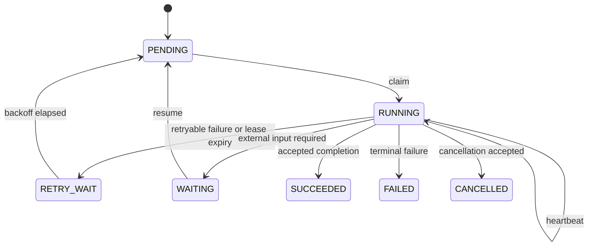

# NoteWeave v2 数据、状态、API 与可靠性契约

本文统一维护 HTTP、事件、状态、事务、异步执行、可观测性、灾备和公共安全边界。Controller、Service/DTO、Flyway、配置和自动化测试是 `[当前实现]` 的证据；未落入这些证据面的内容标为 `[目标设计]`。

## 全局契约

- 用户 API 根路径为 `/api/v2`，服务间与运维接口为 `/internal`。
- JSON 字段使用 `snake_case`；错误返回稳定业务 `code`，调用方不能只按 HTTP 状态判断。
- Workspace 资源的读取与更新必须在 SQL 或已校验的父资源关联中再次限制 Workspace。
- 创建型请求使用 Client Request ID 或稳定业务键。重复请求返回原 Receipt、原资源或明确冲突。
- SSE 使用持久化事件序号恢复。连接断开不是业务失败，终态不能只保存在 Emitter 中。
- 外部内容和模型输出是不可信候选。服务端在执行工具、写回和下载时重新鉴权。

## 数据真源与投影

`[当前实现]` MySQL 表域按所有权分为：

| 表域 | 代表对象 | 事务职责 |
| --- | --- | --- |
| Identity / Workspace | `users`、`user_session`、`workspace`、`workspace_member` | 身份、成员、角色、ACL Version |
| Source / Upload | `file_object`、`document_upload`、`upload_chunk`、`source*`、`source_cleanup_task` | 上传、不可变版本、解析、切片、删除意图 |
| Conversation / Answer | `conversation*`、`turn_submission`、`run_input_snapshot`、`answer_run*` | Turn 幂等、输入冻结、回答状态、事件和证据 |
| Knowledge / Wiki | `knowledge_*`、Wiki 关系与日志 | 页面版本、引用、链接、反链与治理 |
| Memory | `memory_*` | Candidate、Review、Version、Canonical Runtime、Outcome |
| Research | `research_*` | Run、Matrix、Cell、Evidence、Task、Budget、Checkpoint、Stage、Role Result |
| Artifact | `artifact_*` | Job、Run、Version、File、输入快照、写回 |
| Shared Runtime | `task*`、Outbox、Callback Receipt、审计 | 调度、租约、幂等回调、持久化事件 |

`[当前实现]` Flyway 仓库从 `V001` 演进到 `V104`，版本存在跳号。`V095-V104` 增加 Task Event Stream 索引、上传清理索引、Research Evidence Validation、Matrix Plan、Run Stage、Checkpoint Hydration、Role Result、Discovery Proposal、Feature Flag Snapshot 和 Completion Replay Observation。环境是否执行到最高版本，以该环境的 `flyway_schema_history` 为准。

`[目标设计]` Elasticsearch、向量索引、Redis 缓存、Wiki 图、Memory Pack 和评测副本使用 `projection_version`、`source_snapshot_id`、`acl_version` 和 `release_bundle_id` 标识来源。投影不接收用户直接写入，只消费真源变化；重建完成后经过质量回执再切换 Alias 或版本指针。

## 事务与一致性边界

一个 MySQL 本地事务可以原子保证业务状态、唯一键、版本条件和 Outbox 同时写入，不能原子保证 Kafka、MinIO、Elasticsearch 或外部 Provider 已完成。跨组件使用“本地提交 + 可重试传播 + 幂等收口 + 对账”。

### Outbox、Kafka ACK、Callback 与业务终态分别保证什么

| 机制 | 保证 | 不保证 |
| --- | --- | --- |
| Transactional Outbox | 业务变更与“需要发送”同事务存在 | 消息已经离开数据库 |
| Dispatcher Claim / Publish | 某个 Claim Owner 尝试投递，发送成功可记录 | Broker 接受后消费者已经处理 |
| Kafka Producer ACK | Broker 按配置接收并复制记录 | 下游业务成功、跨分区全局顺序 |
| Consumer Offset ACK | 该 Consumer Group 不再正常重读旧 Offset | 外部副作用一定成功、业务结果唯一 |
| Worker Callback | Worker 提交了一个带执行身份和摘要的结果 | Callback 一次到达、结果一定被接受 |
| Callback Receipt | 相同回调可幂等重放，异 Payload 被识别 | Worker 真实执行是否符合业务规则 |
| 业务终态 | 主服务在真源中接受结果并完成状态转换 | 所有缓存、索引和客户端已经同步看到 |

因此 Kafka ACK 不能替代业务终态，Callback `200` 也不能替代 Version 发布。业务成功只由 MySQL 中受状态机、Lease、Fencing、版本和 Payload Digest 保护的提交决定。

### Dispatcher 崩溃窗口

```text
READY -> PROCESSING(claim_token, lease_until) -> SENT
                                      \-> RETRY_WAIT -> READY
                                      \-> DEAD_LETTER
```

发送前崩溃会在 Claim Lease 到期后重领；发送后、标记 `SENT` 前崩溃会重复发送。消费者必须以业务幂等键去重。Dead Letter Redrive 创建新的尝试和审计记录，不改写历史失败。

`[目标设计]` Outbox Batch 和扫描间隔由数据库扫描成本、目标发布延迟与故障恢复窗口共同决定。初值按 `batch_size <= 可用连接数 × 单次发送吞吐 × 扫描周期` 估算；观察最老未发布年龄、Claim 冲突、事务时长和重试放大。最老年龄超过能力 SLO 时停止放量，恢复需连续两个观察窗口低于恢复阈值。

## 通用 Task、Lease 与 Fencing

`[当前实现]` 通用 Task 保存用户任务状态、用户级重驱记录、事件、Outbox 和 Callback Receipt 关联；Research 领域 Task 另外保存 ExecutionAttempt、Lease Epoch、Fencing Token、不变快照和 Canonical Digest。这里的用户级重驱不等于基础设施 ExecutionAttempt，两者必须用不同身份和指标统计。



状态名以具体表和服务为准，图表达公共语义，不要求所有业务对象复用同一枚举。

### Lease 过期与旧 Worker 写回

新 Owner Claim 时递增 `lease_epoch` 和 `fencing_token`。拥有业务写权限的 Progress、Checkpoint、Complete 与 Fail 请求必须匹配领域 Task、Attempt、Owner、Epoch/Token 和输入摘要；其中 Completion 还要校验 Completion Idempotency Key 与 Payload Digest。旧 Worker 即使在网络恢复后拿着有效身份令牌，也会因 Fencing Token 过期被拒绝；拒绝次数进入 Metric 和审计。只读输入接口仍校验当前 Owner 和 Scope，但不要求不存在的 Completion Key。

Lease TTL 需要覆盖正常 Heartbeat 抖动，又不能让崩溃任务长期占位。`[目标设计]` 初值使用 `max(3 × heartbeat_interval, provider_p99 + callback_p99 + safety_margin)`，再用模拟网络延迟、进程终止和 Provider 长尾调优。TTL 过短会频繁接管，过长会延迟恢复。停止放量条件是接管时间、旧写拒绝或重复外部调用超过阈值；恢复要求一个滞回窗口内回到基线。

`[当前实现]` 名称里都带 Lease 或 Timeout，不代表它们属于一个统一计时器：

| 保护层 | 当前值 | 保护对象与边界 |
|---|---:|---|
| 普通 Outbox Claim | 60 秒 | 短 Kafka 发布的领取恢复；Tick 1 秒、Batch 50 |
| Research Command Dispatch | Tick 1 秒、Batch 25 | Research 命令扫描批次，不复用普通 Outbox Batch 50 |
| Research Task | Lease 60 秒、Heartbeat 15 秒 | Worker 执行所有权与旧写 Fencing |
| Artifact Delivery | Lease 70 分钟 | Outbox 到 Kafka 后的长任务 Callback 所有权；`artifact-command.v1` 携带当前 Delivery Token，Worker 完成协议后手动提交 Offset |
| Answer Stream | Lease 150 秒、每 45 秒续租 | 多实例回答生成 Owner，不是浏览器连接寿命 |
| SSE Emitter | 120 秒 | 单次 HTTP 推送对象生命周期 |
| Answer/Conversation Follow | 125 秒 | 一次等待持久化事件的调用预算 |
| Redis Answer Stream | TTL 600 秒 | 多实例短期事件桥接；业务终态仍在 MySQL |

因此不能把这些数值相加为端到端 SLA，也不能说所有 Worker 共用 60 秒 Lease。每层到期只触发本层的断开、接管、重领或回源语义，最终提交仍由状态、Owner、Fencing 和版本条件仲裁。

### Worker 成功但 Callback 丢失

Worker 在本地或外部存储先保存 `completion_id`、Payload Digest 和外部 Receipt，再重试同一个 Callback。服务端第一次接受时写 Callback Receipt 与业务终态，后续同摘要返回原结果；异摘要返回冲突。若 Worker 崩溃，Reconciler 扫描超过 Callback Unknown Age 的 Task，通过 Worker Result API、对象 Manifest 或 Provider Receipt 查询。无法确认时保持 `UNKNOWN` 或人工接管，不能把超时直接改成 `FAILED` 后盲目重跑非幂等动作。

## Checkpoint 与外部调用回执

Checkpoint 保存业务可恢复边界，不等于把每个内部事件做 Event Sourcing。

`[当前实现]` Research Checkpoint 包含序列、高水位、计划/实体版本、预算与持久化状态；`V100` 增加 Hydration 语义，恢复时复制不可变 Ledger 状态，不复制 Active Lease、Outbox 和执行中 Reservation。

`[目标设计]` 每个搜索、模型或工具调用使用稳定 `operation_key = run + stage + logical_step + input_digest + provider_version`。调用前记录 `INTENT`，完成后保存 `RECEIPT`、响应摘要、计费与安全审计。恢复时：

1. 已有成功 Receipt，直接复用归档结果。
2. 状态为 `IN_FLIGHT` 且 Provider 支持查询，先按 Provider Request ID 查询。
3. Provider 支持幂等键，重试同一键。
4. Provider 不可查询且动作非幂等，进入 `UNKNOWN` 和人工对账。
5. 只有确定未执行或操作可幂等时才重新调用。

Checkpoint 过细会放大写入和兼容成本，过粗会重复昂贵 I/O。边界放在外部副作用之后、阶段屏障、人工暂停和预算结算点。

## Answer、Research 与 Artifact 状态

### AnswerRun

`[当前实现]` Turn 提交先写 `turn_submission`、消息、输入快照和 `answer_run`，再异步生成 `answer_event`。终态为完成、取消或失败语义；事件序号单调，SSE 使用 `after` 或 `Last-Event-ID` 恢复。

`[当前实现]` AnswerRun 的面试统一口径是 `PREPARING -> RETRIEVING -> GENERATING -> FINALIZING -> COMPLETED`，失败和取消从运行态进入各自终态；旧入口出现的 `CREATED` 只按兼容映射解释，不另建一套状态机。`stream_owner` 与 150 秒 Answer Lease 只保护生成提交权，不等于 SSE 连接寿命，SSE Emitter 仍是 120 秒的传输对象。

### Research Run

Research 除通用运行状态外，还包含 Matrix/Cell 状态、Run Stage、Verification、Repair、Synthesis 和 Checkpoint。证据不足、来源冲突和等待修复是业务状态，不能折叠为 `FAILED`。`[当前实现]` 旧 Hydration 接口通过 Descendant Run 关联原 Checkpoint，且不覆盖原 Run；`[目标设计]` 基础设施恢复保持 ResearchRun 稳定，只创建关联旧 Checkpoint 的新 ExecutionAttempt，用户改变目标或主动 Fork 时才创建新 Run。

### Artifact Job

Artifact 同时区分 Job、Task/Run、Version 和 File。Worker 执行成功只产生候选。`[目标设计]` 内容 Contract 通过后，Host 先创建不可见的 `DELIVERY_PENDING` Version，并冻结全部必需文件 Manifest；文件全部通过 Contract 并达到 `READY` 后，Version 才晋升为可发布的 `READY`。`WAITING` 表示缺少外部输入或审批。`ROLLBACK` 是命令，不是 Version 状态：它创建触发类型为 Rollback 的新 ArtifactRun，并追加带 `restored_from_version_id` 的新 Version；Current Head 只从旧 Head 单调推进到这个新 Version，不把指针倒拨到历史行，也不删除中间版本。

## Provider 失败与结果未知

| 场景 | 分类 | 动作 |
| --- | --- | --- |
| 连接建立失败 | 可重试，通常未执行 | 指数退避、抖动、有限尝试 |
| 读超时 | 结果未知 | 查询 Request ID 或复用幂等键 |
| `429` / 限流 | 可重试或降级 | 遵守 `Retry-After`，降低并发，切换受允许 Provider |
| 配额耗尽 | 不应快速重试 | 阻止新任务、降级或等待配额恢复 |
| `4xx` Schema/权限 | 终态或需修复 | 不重试相同请求，记录稳定原因 |
| 流中断/损坏 JSON | 部分结果不可发布 | 丢弃未通过 Schema/Validator 的候选 |
| Provider 返回成功但 Callback 失败 | 本地结果未知 | 按 Receipt 对账，不重复非幂等副作用 |

`[目标设计]` Retry Budget 按整个 Run 计算，避免 HTTP Client、Worker、Task 和 Outbox 各自重试造成乘法放大。Provider 熔断只阻止新调用，不改变已经接受的业务事实。高风险写操作不做隐式 Provider 切换，因为不同 Provider 的工具和安全边界可能不同。

## 准入控制、排队与资源耦合

`[当前实现]` `WorkloadQuotaService` 使用 Redis Lua 原子执行令牌桶和并发 Lease。速率维度为 Workspace、Actor 指纹和 Workload，令牌桶容量为 20、补充速率为 20/分钟；并发维度为 Workspace 与 Workload，每个组合的并发上限为 4，Lease 为 300 秒。这里的 4 是租户工作负载级保护值，不是所有 Workspace 共享的全局并发上限。生产默认关闭本地降级，Redis 不可用时配额检查 Fail Closed。Answer I/O、SSE Dispatch、SSE Connection、Redis Bridge 和 Artifact Dispatch 还各有有界线程池与 `AbortPolicy`。这些机制分别保护入口和执行器，尚未形成统一的全链路 Admission Controller。

`[目标设计]` 准入决策按全局、能力、Workspace、Actor、热点 Source、Provider 和高成本 Skill 多维取最严格结果，并在原因码中说明真正限制资源。公平性不能只看全局吞吐，至少要防止单 Workspace 占满 Provider、后台 Research 挤压交互式 QA，以及大量小任务长期饿死高成本但已批准的 Artifact。可采用每 Workspace 配额、分层 Token Bucket、按截止时间与年龄提升优先级，但不能靠一个无限队列制造表面成功。

同步 QA 只允许短等待，超过排队或截止时间预算后快速拒绝、降级或返回可重试原因；Research、Artifact 与资料处理可以持久排队，但必须限制 Queue Length、Oldest Age、Per-workspace Share、Deadline 和 Reserved Capacity。任务进入队列不代表已经获得线程、数据库连接或 Provider 配额，Worker Claim 后仍需二次准入，避免排队期间资源状态变化。

初始容量模型使用 Little 定律估计平均在途量 `L = arrival_rate × service_time`，数据库连接初值可估为 `required_connections = target_qps × average_connection_hold_time`。两个公式都只提供起点，最终准入上限取线程池、Hikari、Provider、Worker/Callback、对象带宽和成本预算的最小容量，并由压测验证。数据库连接持有时间要拆成获取等待、SQL 执行和业务/网络时间，不能用整个请求延迟代替。

限流先以 Count-only/Shadow 模式记录决策、原因和受影响切片，再从低风险 Workspace 灰度执行。触发需要连续违约窗口，恢复阈值低于触发阈值，并设置最短降级时长、半开探测和分阶段放量。Provider 熔断恢复时只放少量探测流量，不能在单次成功后立即恢复全部并发。

公共指标至少包括 Admission Granted/Rejected、原因码分布、Queue Length/Oldest Age、Workspace Share、Starvation Age、各执行器 Active/Queue/Rejected、Hikari Pending、Provider 429、Lease Occupancy 和 Cost per Successful Task。诊断时按同一 Trace/Run 关联这些信号，但 SLO 仍由全量 Metric 计算。

## Source 变化传播

```text
MySQL Source Version / ACL Version / Tombstone commit
  -> Outbox
  -> cache invalidation
  -> full-text and vector projection update/delete
  -> Wiki relation and backlink reconciliation
  -> Memory candidate/revision invalidation
  -> evaluation-copy quarantine/delete
  -> Artifact dependency stale marker
  -> reconciliation receipt
```

更新产生新版本，删除产生 Tombstone，权限变化递增 ACL Version。消费者按 Source + Snapshot + Projection Type + Target Version 幂等。乱序到达时只接受不旧于当前目标版本的事件；重复事件返回已处理 Receipt。投影 Ready 只能由全部必需分片成功并通过质量门禁后设置。

缓存 TTL 不承担删除正确性。主动失效失败时，读取路径比较 ACL/Source Version；涉及撤销事实或高风险权限时 Fail Closed。

## HTTP API 索引

### 身份与 Workspace

| 方法 | 路径 | 用途 |
| --- | --- | --- |
| POST | `/api/v2/auth/register`、`/login`、`/refresh`、`/logout` | 身份与会话 |
| GET | `/api/v2/auth/session` | 当前会话 |
| POST/GET | `/api/v2/workspaces` | 创建与查询 Workspace |
| GET/PUT | `/api/v2/workspaces/{workspaceId}/wiki-settings` | Wiki 设置 |
| GET/PUT | `/api/v2/workspaces/{workspaceId}/retrieval-settings` | 检索设置 |
| GET/PUT/DELETE | `/api/v2/workspaces/{workspaceId}/members...` | 成员与角色 |

### Source、Knowledge 与 Wiki

| 方法 | 路径 | 用途 |
| --- | --- | --- |
| POST | `/api/v2/workspaces/{workspaceId}/uploads` | 创建分块上传 |
| PUT | `/api/v2/uploads/{uploadId}/chunks/{chunkIndex}` | 写入分块 |
| POST | `/api/v2/uploads/{uploadId}/complete` | 完成上传并推进解析 |
| GET/DELETE | `/api/v2/workspaces/{workspaceId}/sources...` | 查询或删除资料 |
| POST/GET | `/api/v2/workspaces/{workspaceId}/knowledge-items` | 创建或查询知识项 |
| GET/POST/PATCH/DELETE | `/api/v2/knowledge-items/{itemId}...` | 详情、版本、标题、删除 |
| GET/POST | `/api/v2/workspaces/{workspaceId}/wiki-*`、`/wiki/*` | 首页、索引、搜索、图、统计、问题、日志、重建和修复 |

### Conversation、Answer 与 Inspector

| 方法 | 路径 | 用途 |
| --- | --- | --- |
| POST/GET | `/api/v2/workspaces/{workspaceId}/conversations` | 创建和查询会话 |
| GET | `/api/v2/workspaces/{workspaceId}/conversations/{conversationId}/messages` | 消息列表 |
| GET | `/api/v2/workspaces/{workspaceId}/conversations/{conversationId}/turn-submissions/{clientRequestId}` | Turn 幂等查询 |
| GET | `/api/v2/workspaces/{workspaceId}/conversations/{conversationId}/events` | 会话 SSE |
| POST | `/api/v2/conversations/{conversationId}/messages` | 幂等提交 Turn |
| POST | `/api/v2/messages/{messageId}/source-draft` | Note 草稿 |
| POST | `/api/v2/messages/{messageId}/save-as-source` | Note 写回资料 |
| GET | `/api/v2/workspaces/{workspaceId}/answer-runs/{runId}` | 运行详情 |
| GET | `/api/v2/workspaces/{workspaceId}/answer-runs/{runId}/evidence` | Evidence Manifest |
| GET | `/api/v2/workspaces/{workspaceId}/answer-runs/{runId}/events` | 回答 SSE |
| DELETE | `/api/v2/workspaces/{workspaceId}/answer-runs/{runId}` | 取消回答 |
| GET | `/api/v2/workspaces/{workspaceId}/runs/{executionKind}/{runId}/input-snapshot` | 运行输入快照 |
| GET | `/api/v2/workspaces/{workspaceId}/context-inspector/runs/{executionKind}/{runId}` | 上下文检查 |
| GET | `/api/v2/workspaces/{workspaceId}/run-replay/{executionKind}/{runId}` | 运行回放 |

### Research、Memory、Artifact、Task 与 Retrieval

`[当前实现]` 用户 API 以 Controller 为准：

| 方法 | 路径 | 用途 |
| --- | --- | --- |
| POST/GET | `/api/v2/workspaces/{workspaceId}/research-runs` | 创建与列表 |
| GET | `/api/v2/workspaces/{workspaceId}/research-runs/{researchRunId}` | 详情 |
| GET | `/api/v2/workspaces/{workspaceId}/research-runs/{researchRunId}/evidence` | Evidence Manifest |
| GET | `/api/v2/workspaces/{workspaceId}/research-runs/{researchRunId}/collection` | 资料集合 |
| GET | `/api/v2/workspaces/{workspaceId}/research-runs/{researchRunId}/checkpoints...` | Checkpoint |
| POST | `/api/v2/workspaces/{workspaceId}/research-runs/{researchRunId}/resume-from-checkpoint/{checkpointNo}` | 从 Checkpoint 恢复 |
| POST | `/api/v2/workspaces/{workspaceId}/research-runs/{researchRunId}/save-report-as-source` | 报告写回资料 |
| POST/GET | `/api/v2/workspaces/{workspaceId}/memory/...` | Signal、Promotion、Review、Revision、Revoke、Outcome、Control Pack |
| GET | `/api/v2/workspaces/{workspaceId}/memory/inspector` | Memory Inspector |
| GET | `/api/v2/skills` | Skill Catalog |
| POST/GET | `/api/v2/workspaces/{workspaceId}/artifact-jobs` | 创建与列表 |
| GET | `/api/v2/workspaces/{workspaceId}/artifact-jobs/{artifactJobId}` | 详情 |
| GET/POST | `/api/v2/workspaces/{workspaceId}/artifact-jobs/{artifactJobId}/versions...` | 版本、比较、再生成、回滚、写回、导出 |
| GET | `/api/v2/tasks/{taskId}` | 通用任务 |
| GET | `/api/v2/tasks/{taskId}/events` | 任务 SSE |
| GET | `/api/v2/tasks/{taskId}/event-history` | 任务事件历史 |
| GET | `/api/v2/workspaces/{workspaceId}/retrieval-indexes` | 投影状态 |
| POST | `/api/v2/workspaces/{workspaceId}/retrieval-indexes/rebuild` | 重建投影 |
| GET | `/api/v2/workspaces/{workspaceId}/retrieval-indexes/release-gate` | 发布门禁 |
| POST | `/api/v2/workspaces/{workspaceId}/retrieval-indexes/quality-receipts` | 质量回执 |

Research Worker 走 Kafka `noteweave.research.agent.command` 与 `/internal/research-agent*`；Artifact Worker 走 `/internal/worker/artifact-tasks`、`/internal/worker/tasks` 与 Artifact Outbox。DTO 以 Controller 和契约测试为准。

## Worker 最小契约

所有 `/internal` 请求共享的最小 Envelope 只有服务间认证、Request ID、Schema Version、领域 Run/Task 身份和 Workspace Scope。执行期端点再按写权限分层：输入读取校验当前 Owner、Attempt、Epoch 和 Scope；Heartbeat/Progress 校验 Owner、Attempt、Epoch、Fencing 与单调序号；Checkpoint、Complete 和 Fail 额外携带输入摘要；Complete 使用 Completion Idempotency Key、Payload Digest 和结果 Receipt；Fail 才携带可重试分类；Resume 使用 Wait Receipt、恢复条件摘要和新的执行代际。不存在的字段不能为了统一 DTO 填空字符串。Artifact Worker 使用输入读取、Heartbeat、Progress、Complete、Fail、Resume 与 Outbox 运维接口；Research 命令通过 `noteweave.research.agent.command` 投递，并通过受保护的 Research Internal Interface 完成 Claim、Checkpoint、预算、External Snapshot 和 Completion。

Worker 不直接写 Java 业务表。Kafka Payload 中的 Role、Workspace 和权限信息只能帮助路由，权威输入来自 Claim 后读取并校验的服务端 Snapshot。

## OpenTelemetry 与运行指标

`[目标设计]` 同一异步消息使用四段语义：业务事务创建 `Producer` Span，Broker 发送为 `Publish`，消费者拉取为 `Receive`，业务处理为 `Process`。同步父子关系仍存在且 Trace Context 可安全传播时使用 Parent；批处理、延迟消费、重放、Fan-in 或一个处理依赖多个上游时使用 Span Link，避免伪造单一父链。

Head Sampling 在入口按风险、租户和请求类型决定，成本低但看不到最终错误；Tail Sampling 在 Collector 看到完整 Trace 后保留错误、长尾和罕见状态，代价是缓冲内存和决策延迟。Trace 只用于样本化诊断，SLO 使用全量 Counter/Histogram Metric，不能从采样 Trace 计算成功率。

Collector Exporter Queue 满、重试超时或 Collector 崩溃会丢数据。`[行业参考]` OpenTelemetry Collector 官方文档建议使用 Sending Queue、指数退避和可选 File Storage WAL，并监控 Queue Size/Capacity 与 Send Failed。持久队列仍不等于业务队列，磁盘耗尽和下游长期不可用会丢数据。

### 必须观测的公共指标

| 指标 | 口径 | 超阈值动作 |
| --- | --- | --- |
| Kafka Consumer Lag / Oldest Message Age | 按 Topic、Partition、Consumer Group | 降低生产速率、扩 Consumer、检查 Poison Message |
| Retry Amplification | 总尝试数 / 初始任务数 | 停止放量，定位多层重试 |
| Outbox Oldest Unpublished Age | 当前时间减最老 READY/PROCESSING 创建时间 | 检查 Claim、Publisher、Broker |
| Lease Takeover Time | 原 Lease 失效到新 Owner 成功 Claim | 调整 TTL/Heartbeat，检查调度饥饿 |
| Stale Write Rejection | Fencing 拒绝数 | 检查网络抖动、重复 Worker 和 TTL |
| Callback Unknown Outcome Age | 最老未对账结果年龄 | 启动 Reconciler，暂停非幂等重试 |
| Projection Lag / Rebuild Duration | 真源版本到可查询版本，完整重建耗时 | 降级到真源可支持路径或暂停索引发布 |
| MinIO Integrity / Missing Rate | Manifest 校验失败或缺失对象 / 应存在对象 | 阻止发布，按真源和备份修复 |
| Provider P95/P99 / Rate Limit | 按 Provider、Model、能力和风险切片 | 降并发、熔断、预算降级 |
| Cost per Successful Task | 成功任务的 Provider、计算、存储和重试成本 / 成功任务数 | 降预算、切 Bundle、停止低收益步骤 |

Metric Label 禁止原始 User ID、Source ID、Run ID、URL、Prompt 或 Error Message。高基数标识进入结构化日志或 Trace，并通过受控检索关联。

## SLO、错误预算与容量级别

`[目标设计]` SLO 按能力定义，示例目标不能写成已达成：

| 能力 | SLI | 目标示例 | RTO / RPO 示例 |
| --- | --- | --- | --- |
| Workspace 读与鉴权 | 正确响应 / 合法请求 | 月度 99.9% | 30 min / 5 min |
| Source 接入 | 在目标时限进入 Ready / 接受上传 | 日度 99% | 2 h / 15 min |
| QA | 在延迟预算内交付正确终态 / 可服务请求 | 月度 99.5% | 1 h / 15 min |
| Research | 在预算内完成或给出可恢复终态 / 启动 Run | 周度 98% | 4 h / 30 min |
| Artifact | 产生通过校验 Version 或明确失败 / 启动 Job | 周度 98% | 4 h / 30 min |
| Memory 撤销 | 撤销时限内所有 Pack 不再引用 / 撤销事件 | 日度 99.9% | 1 h / 0 到 5 min |

`[生产待验证]` 上表只有目标示例，最终数字需基于业务容忍、备份能力、Provider 合同和演练结果确定。

Burn Rate 使用已消耗错误预算 / 同期允许预算。短窗和长窗同时超阈值时暂停发布；依次执行降级、限流、回滚 Bundle 或切断高风险能力。恢复需要错误率回落、积压清空、未知结果对账和连续滞回窗口通过，不能只看单点恢复。

## 灾备与跨组件恢复顺序

`[目标设计]` 恢复遵循事实依赖：

1. 冻结写入并确认故障边界，保留审计与恢复时间点。
2. 恢复 MySQL 到选定 RPO，校验 Flyway、业务版本、Outbox、Lease 和 Receipt。
3. 恢复 MinIO 对象并用 Manifest/Digest 找出缺失或多余对象。
4. 恢复 Kafka；以 MySQL Outbox 和业务终态确定从哪里重投，不能盲信旧 Offset。
5. 重建 Elasticsearch、向量、Wiki 图和其他 Projection，再通过质量回执切换。
6. 清空或按 Version 预热 Redis，禁止把旧缓存导回真源。
7. 恢复 Worker，先 Reconcile Active/Unknown Task，再开放新任务。
8. 对账缺失、重复、旧写拒绝、未知结果和撤销传播，最后恢复流量。

Kafka 先于 MySQL 恢复会让消费者缺少权威状态；Redis 和 Elasticsearch 先恢复可能把旧权限或旧事实重新暴露。备份成功不是恢复证据，必须定期从备份建立隔离环境并完成跨组件对账。

## 安全与隐私公共契约

`[目标设计]` 直接和间接 Prompt Injection、恶意附件/网页/工具返回、Tool Description 和 Skill Metadata 投毒统一按不可信输入处理。内容区与 System Instruction 分离，工具结果经过 Schema、大小、类型和来源校验。模型只能提出 Tool Intent，服务端按当前用户、Workspace、Source/Run Scope、工具版本、参数摘要、审批和有效期执行。

网络层使用 Provider Registry 和域名允许列表，禁止任意 URL；每次重定向重新校验协议、Host、IP 和端口，阻止 Loopback、私网、Link-local、DNS Rebinding 和凭据跨域转发。密钥不进入 Prompt、Trace、Log、Metric 或 Baggage。

Tool/Skill 注册保存版本、来源、签名或摘要、审计人、允许 Schema 和变更记录。审批绑定精确 Artifact Version、工具、参数摘要、作用域和过期时间。ACL 或 Policy 服务故障时，高风险写操作 Fail Closed。

## 迁移、兼容、灰度与回滚

Flyway 文件一经应用不改名、不重排、不复用版本。新增列先可空或带安全默认值，代码按 Expand/Contract 顺序兼容新旧 Schema；大表回填与索引构建拆成可观察任务。H2 只能辅助契约回归，MySQL 8.4 的锁、执行计划和 Online DDL 需要独立验证。

发布顺序为 Schema Expand、双版本兼容代码、Shadow 写/读、数据回填与对账、新 Bundle 灰度、旧路径排空、Contract。应用回滚不等于数据库回滚；破坏性 Schema 变化使用补偿迁移或前向修复。

`[目标设计]` 灰度记录 Bundle、流量比例、Workspace/风险切片、观察窗口、停止阈值、恢复阈值和回滚指针。任何指标只在同一工作负载和版本下比较。

## 测试分别证明什么

- 领域单元测试证明单个规则与错误分类。
- 状态机和 Property-Based 测试证明任意合法序列不违反终态、版本和 Fencing 不变量。
- API/事件契约测试证明字段、错误码、兼容和重复投递语义。
- Repository/MySQL 集成测试证明 SQL、唯一键、锁、受影响行数和迁移。
- Kafka/Outbox/ACK/Callback 集成测试证明崩溃窗口与最终收口。
- Provider Adapter 契约测试证明超时、限流、损坏响应和结果未知分类。
- 固定快照回放证明同一 Bundle 对同一输入的回归差异。
- 混沌与恢复演练证明进程终止、网络延迟、组件故障和备份恢复下的对账能力。

质量指标和发布门禁见 [质量、测试与发布门禁](./测试与评测/NoteWeave-评测指标报告.md)。

## 当前证据边界

`[当前实现]` Controller、迁移和测试已经覆盖用户 API、内部 Worker 回调、Task/Outbox、SSE、Projection、Research 与 Artifact 的核心契约；默认配置可以关闭 LLM、Embedding、Rerank 和部分 Provider。

`[生产待验证]` OpenTelemetry 全链路、持久 Collector Queue、能力级 SLO、跨组件备份恢复、真实 Burn Rate 自动化和跨可用区部署属于目标设计，不能从当前 Compose 或单元测试推断已经完成。
