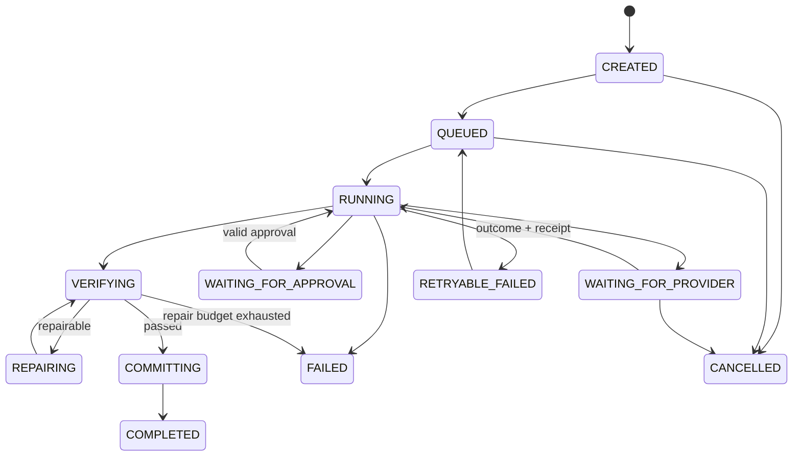

# Artifact Skill 执行架构

> 本文是 Artifact、Skill Catalog、Skill Graph 与 Artifact Worker 的权威设计。公共 Task、Outbox、Lease、Fencing、Callback、灾备与安全契约见 [API 与事件契约](./API与事件契约-v2.md)。真实格式边界、学校案例、产物质量指标和面试追问见 [Artifact Agent 面试专项](./简历亮点八股/23-Artifact-Agent产物生成演进案例指标与Ownership答辩.md)；请求/快照/结果/版本/文件/审批/写回的代码级边界与已知缺口见 [契约级数据模型与面试官下钻](./简历亮点八股/24-Artifact-Agent契约级数据模型与面试官下钻.md)。

## 1. 业务问题、产物与非目标

Artifact 把 Workspace 中的 Source、Note、Wiki、Research Report 和用户约束转换为可下载、可比较、可回滚、可写回的结构化产物。用户得到的不是一次模型回复，而是一个带输入快照、生成运行、校验记录、不可变版本、文件摘要和来源关系的 Release Bundle 成员。

典型产物包括报告、FAQ、测验、学习指南、Wiki 页面、结构化笔记、视频摘要、音频纪要、课程笔记、简历亮点和 PDF。不同产物共享可靠性与治理边界，但不共享一套含糊的“万能 Prompt”。

非目标如下：

- 不允许用户或模型提交任意生产 Action、任意 MCP Server 或任意代码。
- 不把对象存储中的文件视为业务真源。
- 不承诺模型一次生成即可通过结构、引用、安全和业务验证。
- 不让 Worker 绕过主服务直接修改 Source、Wiki 或 Memory。
- 不把本地 Compose 联调结果解释为生产吞吐、成功率或质量收益。

## 2. 事实边界与当前能力

`[当前实现]` 主服务通过 `/api/v2/skills` 暴露系统 Skill Catalog，通过 Artifact Job API 支持创建、查询、版本列表与详情、再生成、比较、回滚、保存为 Source、writeback 和 PDF 导出。迁移中已存在 `artifact_job`、`artifact_version`、`artifact_file`、`artifact_run_input_snapshot`、Artifact Outbox 和 Callback Receipt 相关结构，最高迁移基线为 `V104`。

`[当前实现]` Java 控制面负责 Workspace ACL、输入快照、Job/Task/Outbox 状态、版本与最终写回；Python Worker 负责 Skill Catalog 校验、Skill Graph 编译、获取材料、执行、Verifier、局部 Repair、等待外部能力和导出。内置注册表包含版本化 Skill、输出契约、修复策略与能力绑定；高风险能力可以要求批准。

`[当前实现]` Artifact LLM 默认超时 60 秒，MCP 进程超时默认 3600 秒且配置范围为 1 至 21600 秒；主服务连接 Worker 的连接超时默认 3 秒、读取超时默认 30 秒。这些是代码和配置事实，不是推荐的生产最优值。

`[当前实现]` Worker 测试覆盖 Callback 幂等键、等待与恢复、Provider Outcome Ready、重启后恢复、损坏状态隔离、文件状态原子替换、Verifier/Repair、Skill-first 选择和生产环境禁用 Debug 路由。当前文件型 Worker Repository 只适合单实例或开发联调，不能提供生产数据库的一致性、并发 Claim 和灾备保证。

`[当前实现]` 其余已知缺口：普通 Source 只带第一段样本文本，不是全文；再生成仍复用旧输入快照；Worker 与 Host 的 Version ID 未统一；能力审批仍是 Worker 内存队列和 debug 接口；PDF 导出与 Writeback Request 可能早于最终 Verifier；Host 写回创建新 Note/Wiki 但没有目标 Revision 条件。

`[目标设计]` 将 Skill Catalog、Skill Graph、Provider Binding、Validator、Prompt、模型、索引和写回策略一起纳入 Release Bundle，任一组成发生变化都生成新发布版本，不对进行中的 Run 原地替换。

## 3. 统一领域模型与真源

| 对象 | 含义 | 真源与不变量 |
|---|---|---|
| Skill Definition | 能力名称、输入/输出 Schema、版本、风险级别和预算 | 受签名发布目录管理，不可由模型原地修改 |
| Skill Graph | 节点、依赖、等待点、验证与修复路径 | 编译后生成稳定 `graph_digest` |
| Artifact Job | 用户一次生成意图 | 绑定 Workspace、Owner、目标类型和当前状态 |
| Artifact Run | 一次不可变的生成、再生成或回滚请求 | 绑定触发类型、本轮输入快照、Release Bundle、交付 Contract 和预留 Version ID |
| Execution Attempt | Worker 接管、进程恢复或基础设施重试的一代执行 | 绑定 Owner、Lease、Epoch、Fencing Token 和恢复 Checkpoint，不改变 Run 语义 |
| Input Snapshot | 用户要求、Source/Note/Wiki/Research 版本、Memory Revision 与参数 | 不可变；重试和恢复必须读取同一快照 |
| Operation Receipt | 搜索、下载、模型、MCP、导出等外部副作用的调用与结果 | 以 `operation_key` 去重，保存未知结果对账信息 |
| Artifact Version | 一次通过提交门禁的不可变逻辑产物 | 再生成不覆盖旧版本 |
| Artifact File | 文件 Metadata、Digest、Storage Key、Mime、Size | MySQL Metadata 是真源，MinIO 对象是受校验载荷 |
| Writeback Receipt | 写回目标、期望版本、内容摘要和结果 | 条件写入，不允许盲覆盖 |

`[目标设计]` MySQL 保存 Job、Run、Version、File Metadata、审批、Receipt 和写回关系。MinIO 保存二进制对象。检索条目、预览、缓存和导出索引都是可重建投影。对象存在但 Metadata 不存在时进入孤儿清理；Metadata 存在但对象缺失时标记 `FILE_MISSING` 并阻止交付，不能静默返回空文件。

## 4. 从初版到生产级方案

| 阶段 | 方案 | 暴露的 Bad Case | 修复与新问题 |
|---|---|---|---|
| V0 单次生成 | 一个 Prompt 直接返回 Markdown 或文件 | 输出格式漂移、无版本、失败后全量重跑 | 引入 Job、Version 和输入快照，但不同产物逻辑仍散落 |
| V1 Action 分支 | 按产物类型写固定 Action | Action 与 Prompt、Validator 耦合，扩展要改主流程 | 引入 Skill Catalog；目录若可任意注册，又会产生供应链风险 |
| V2 Skill-first | Skill 定义输入、输出、能力与策略 | 选择正确仍不等于执行可靠；长工具阻塞 | 编译 Skill Graph，将获取、执行、验证、修复和等待拆成节点 |
| V3 可恢复执行 | Task、Outbox、Checkpoint、Callback | Worker 已成功但 Callback 丢失会得到未知结果；Lease 过期可能旧写 | 加入 Operation Receipt、Callback Receipt、Heartbeat、Fencing 和对账 |
| V4 版本化交付 | Version、File Digest、Compare、Rollback、Writeback | 旧 Source 版本写回可能覆盖新内容；回滚可能只改指针不校验文件 | 条件写回、目标版本绑定、对象校验和回滚前门禁 |
| V5 Release Bundle | 绑定 Skill/Graph/Prompt/Model/Schema/Validator/Provider Policy | 发布组件组合爆炸、回放成本增加 | 只支持经过验证的组合，按风险灰度并保留旧 Bundle |

## 5. Skill 注册、选择与发布

### 5.1 注册契约

`[目标设计]` 一个可发布 Skill 至少包含：

- 稳定 `skill_key`、语义版本、发布者、来源、签名与变更审计；
- 输入 Schema、输出 Schema、允许的 Artifact Type 和最大输入/输出规模；
- Skill Graph、节点幂等规则、超时、重试、预算和可恢复性；
- Provider/MCP 能力允许列表、网络出口策略和风险等级；
- Prompt、模型能力要求、Validator 与 Repair Policy；
- 是否允许文件生成、外部写入、Source/Wiki 写回及其审批策略；
- 兼容范围、灰度条件、回滚版本和测试证据。

Tool Description、Skill Metadata 和样例都属于不可信供应链输入。注册服务不接受描述中的指令作为系统策略；它只解析结构化字段，校验签名、Schema、能力允许列表、域名和依赖版本，并对差异执行安全审查。描述中出现“忽略审批”“读取所有 Workspace”或隐藏 URL 时必须拒绝发布。

### 5.2 选择流程

`[当前实现]` 显式 `skill_key` 可绑定内置 Skill；缺少 Action 时可以按 Skill-first 请求解析到兼容 Action。未知 Skill 或无可用 LLM/Source 内容时 Fail Closed。

`[目标设计]` 选择顺序为：用户显式选择且有权限的 Skill，产品场景固定映射，受约束分类器建议，最后拒绝或要求用户确认。模型只提出 `skill_key` 和理由，服务端重新检查 Workspace、Artifact Type、输入 Schema、发布状态、风险级别、Provider 可用性和预算。

选择决策记录候选集、目录版本、策略版本和原因码。离线指标使用 Top-1/Top-K 选择准确率，并按 Workspace、输入语言、产物类型、短长输入和高风险能力切片；线上不能以“最终生成成功”反推选择一定正确。

### 5.3 从用户请求到 Skill 候选

`[当前实现]` 当前产品优先让用户或固定场景提交显式 `skill_key`。`ArtifactSkillCatalogService` 负责别名归一化、Catalog 查找、允许字段、类型、枚举和必填输入校验，未知 Skill 与缺少必填字段会返回稳定业务错误。这是一条确定性选择与校验链路，不等于已经实现自然语言多意图识别或自动澄清。

`[目标设计]` 自然语言入口若加入 Skill 推荐，只能生成 `IntentDecision` 候选：原始输入引用、目标 Artifact Type、候选 Skill 集、已提取参数、缺失参数、置信等级、澄清原因、Catalog/Policy Version 和 Decision Digest。服务端随后执行确定性检查：Catalog 中是否存在且已发布、Artifact Type 是否兼容、参数是否完整合法、当前用户和 Workspace 是否有权、对象状态是否允许、Provider 是否可用、预算是否足够、高风险能力是否已经批准。任一检查失败都不能由模型置信度覆盖。

缺失 `url`、语言或写回目标等必填参数时，只询问能够解除阻塞的最少问题。一个请求同时要求报告和 PDF 时，如果两个 Skill 可以共享同一 Input Snapshot 且依赖明确，可以创建父 Job 与两个可独立恢复的子 Run；否则要求用户确认优先产物。不能把多个产物塞进单一输出 Schema，再用最终文件存在推断路由正确。

选择评测要区分 Top-1、Top-K、Missing-slot Rate、Clarification Precision/Recall、Wrong-route Rate 和高风险错选率。生成失败可能来自 Provider、Validator 或 File Commit，不能算作路由错误；生成成功也可能用了错误 Skill，仍要由 Gold Decision 或人工审核判断。

## 6. 授权与执行门禁

授权分四层：

1. 创建 Job 时验证用户、Workspace、Source/Note/Wiki/Research 对象和所选 Skill 的可见性。
2. 编译 Graph 时将能力收敛为最小 Provider、最小 Scope、最大预算和明确出口域名。
3. 每个副作用节点执行前重新鉴权，不信任模型或旧 Checkpoint 中的授权结论。
4. 提交 Version、导出或写回时再次验证当前 Owner、Fencing Token、审批和目标版本。

`[目标设计]` 审批绑定 `job_id + run_id + input_snapshot_digest + skill_version + capability + normalized_parameters_digest + target_scope + expiry`。任何参数、目标、版本或能力变化都使审批失效。高风险策略服务不可用时 Fail Closed；只读生成可选择排队或降级到无外部工具的 Skill。

模型不能控制任意 URL。抓取类能力只接收逻辑资源或经策略归一化的 URL，执行层做 Scheme、端口、域名允许列表、DNS 解析、私网与 Loopback 拒绝、重定向逐跳复核、响应大小限制和凭据不跨域转发。API Key、Token、Cookie 不进入 Prompt、Trace、Baggage 或 Artifact 文件。

## 7. 执行图、状态机与恢复

Artifact Job 表示用户意图，Artifact Run 表示一次明确的生成、再生成或追加式回滚请求，Execution Attempt 表示 Worker 接管和基础设施恢复，Task 表示可调度工作，Version 表示已提交结果。`[当前实现]` `artifact_job_run` 仍混合了业务请求和执行尝试；`[目标设计]` 才把二者拆开，避免一次 Worker 重启被计成用户再生成。Job 不能与普通聊天 Run 或 Research Run 共用简单状态：Artifact 有等待 Provider、文件校验、导出和条件写回，Research 则有 Stage Barrier、Evidence Ledger 与候选合并。

### 7.1 正常路径

1. 主服务冻结输入快照和 Release Bundle，事务内创建 Job、Artifact Run、Task、预留 Version ID 与 Outbox。
2. Dispatcher 发布任务；Scheduler 创建 Execution Attempt，Worker Claim 后取得 Lease Epoch 与 Fencing Token。
3. Worker 编译 Graph，逐节点读取 Checkpoint 与 Operation Receipt。
4. 获取材料、调用模型或工具、生成中间结构，Verifier 校验后只修复失败部分。
5. Worker 只返回内容 Candidate、引用和 Trace；主服务验证 Callback、Lease、Payload Digest 与内容 Contract。
6. 内容通过后，主服务创建不可见的 `DELIVERY_PENDING` Version 并冻结全部必需文件 Manifest；Delivery Attempt 物化和校验文件，全部文件 READY 后才晋升 Version，并按用户动作创建条件写回 Proposal。

### 7.2 异常与恢复矩阵

| 异常 | 判断 | 恢复 | 不允许的做法 |
|---|---|---|---|
| Outbox 已写但未发布 | 最老未发布年龄增长 | Dispatcher 重扫并按事件 ID 去重 | 把事务提交当 Kafka 已投递 |
| Worker 崩溃 | Lease 到期且无 Heartbeat | 新 Worker 接管，旧 Worker 写回被 Fencing 拒绝 | 仅靠进程内锁 |
| Provider 超时 | Receipt 为 `DISPATCHED` 且结果未知 | 先查询 Provider 或等待回调；无查询能力时进入人工对账 | 立即无脑重试高成本或非幂等调用 |
| Worker 成功、Callback 丢失 | Worker 有完成 Receipt，主服务仍 Running | Callback 重投或主服务按任务/结果摘要拉取并对账 | 将 Callback HTTP 失败改写为生成失败 |
| 回调重复或乱序 | Callback ID/Payload Digest 重复或版本落后 | 返回已有结果；拒绝旧 Epoch 与状态回退 | 重复创建 Version |
| 文件上传后提交失败 | 对象存在、Version 未提交 | 以 Upload Session/Manifest 对账，重试提交或清理孤儿 | 仅按对象名猜测归属 |
| 验证失败 | Validator 给出可修复原因码 | 在修复预算内局部 Repair，再次全量验证 | 无限自我修复或绕过 Validator |
| 写回版本冲突 | 目标当前版本不等于期望版本 | 保留 Artifact Version，要求重新比较、合并或确认 | Last Write Wins 覆盖用户修改 |

### 7.3 Checkpoint 与外部副作用

每个副作用使用稳定 `operation_key = hash(run_id, node_id, normalized_input, attempt_semantics)`。Checkpoint 只记录编排进度，Receipt 才记录外部调用状态。恢复时按以下顺序决策：已有成功结果直接复用；已派发但未知先查询或等待；确定未派发才调用；确定失败且可重试才创建新 Attempt。这样避免恢复时重复搜索、重复扣费、重复导出或重复写回。

## 8. 验证、版本、写回与回滚

验证至少分为：Schema、结构完整性、文件可打开性、Mime/大小/Digest、引用存在性、Workspace 权限、危险内容、产物特有规则和发布兼容性。模型自评不能替代确定性 Validator；LLM Judge 只能作为质量信号，不能单独批准高风险写回。

`[目标设计]` Repair 默认只重建失败节点或章节。每次 Repair 记录原因、输入摘要、修改范围和次数；超过预算进入 `VALIDATION_FAILED`，保留中间结果供诊断但不对外交付。

版本与写回规则：

- 再生成创建新 Run 和新 Version，不覆盖旧 Version。
- 回滚创建新的 Head 变更或恢复版本，保留完整历史，不物理篡改旧内容。
- 文件必须绑定 Manifest 和 Digest；导出格式变化形成独立 File Revision。
- 写回必须绑定 Artifact Version、目标对象、期望目标版本和审批摘要。
- Source、Note 或 Wiki 已变化时返回冲突，不自动把旧 Artifact 写入新 Head。
- 撤销 Source 权限或删除输入后，Artifact 保留审计 Metadata，但下载、索引与衍生产物按保留策略失效或重建。

## 9. 参数、容量与降级

| 参数 | 当前事实或目标初值 | 推导、失败模式与调优 |
|---|---|---|
| Worker HTTP 连接/读取超时 | `[当前实现]` 3 秒 / 30 秒 | 只约束控制面 HTTP，不应覆盖长任务总耗时；过短放大误判，过长拖慢故障发现 |
| Artifact LLM 超时 | `[当前实现]` 60 秒 | 按产物类型和 Provider P99 切片；超时增加会提高占用与未知结果年龄 |
| MCP 进程超时 | `[当前实现]` 3600 秒，范围 1 至 21600 秒 | 长媒体处理需要更长预算，但必须转为等待态并有 Heartbeat，不能占住请求线程 |
| Repair 次数 | `[目标设计]` 每失败节点初值 2 次 | 用验证通过率与成本曲线选择；过小降低可恢复率，过大造成成本和尾延迟失控 |
| 产物大小 | `[目标设计]` 按 Skill 声明并低于存储/下载上限 | 超限在生成和上传两处 Fail Fast；不能仅依赖 Web Server 总请求限制 |
| Callback 未知窗口 | `[目标设计]` 取 Provider 查询能力、Callback P99 和任务 RTO 的较小安全边界 | 超阈值进入对账队列；恢复要求连续一个滞回窗口无积压 |
| 并发 | `[目标设计]` 按 CPU、内存、Provider 配额、对象带宽和数据库连接共同限流 | 单独提高 Worker 数会放大下游限流、重试和连接池争用 |

参数实验必须记录数据集、机器、Provider、Skill/Graph/Prompt/Model/Validator 版本、输入输出规模与时间窗。停止放量条件包括验证失败率、未知结果年龄、重复外部调用、写回冲突、危险调用漏拦截或单位成功任务成本超过阈值；恢复要求修复后在固定回放和一个灰度滞回窗口内回到基线。

降级顺序为：关闭非必要外部能力，切换为只使用 Workspace Snapshot 的 Skill，降低并发与输出规模，暂停自动写回，最后暂停高风险 Artifact 创建。降级不允许跳过权限、版本或验证门禁。

## 10. 指标、测试、灰度与回滚

Artifact 关键指标的完整契约见 [评测指标报告](./测试与评测/NoteWeave-评测指标报告.md)。本模块至少关注：Skill Top-1 选择准确率、固定接纳 ArtifactRun Cohort 的严格完成率、ExecutionAttempt 恢复率、Validator First-pass/Final Pass、Repair Yield、File Ready Rate、Callback 未知结果年龄、重复外部调用率、写回冲突率、危险能力阻断率、P95/P99 时延和单位成功 ArtifactRun 成本。ArtifactJob 是长期意图，不能作为生成成功率分母。

测试分层：

- 单元与属性测试：Skill Schema、状态转移、幂等键、版本比较、Fencing 和 Validator。
- 契约与集成测试：主服务与 Worker、Outbox/Kafka、Callback 重复乱序、MinIO 对象与 Metadata、Provider Adapter。
- 固定快照回放：同一 Bundle 与输入的结构、引用和文件摘要差异。
- 故障注入：Worker Kill、网络延迟、Callback 丢失、Provider 超时、对象缺失、数据库提交失败和 Collector 故障。
- 安全红队：Prompt Injection、恶意附件、Skill Metadata 投毒、SSRF、审批重放和跨 Workspace 引用。
- 浏览器 E2E：创建、等待、恢复、版本比较、导出、回滚和冲突写回。

`[生产待验证]` 质量、成本、容量与恢复阈值需在真实 Provider、真实文件分布和持续时间窗中验证。灰度按 Skill Version 和 Workspace Allowlist 进行，进行中 Run 固定旧 Bundle；回滚停止新流量、保留旧 Bundle、Drain 或取消不兼容 Run，再恢复旧目录指针。数据库和对象格式变更必须满足向前兼容，不能靠回滚代码删除新数据。

## 11. 技术取舍与迁移条件

- 不直接引入 Temporal：现有 Task、Outbox、Checkpoint 和 Callback 已覆盖当前边界。等待信号、跨日 Timer、历史兼容和人工干预分支增长到状态机难以验证时，再以单个 Skill Graph 试点迁移；代价是 Workflow History 兼容、Activity 幂等和新的运维面。
- 不把 LangGraph Checkpoint 当业务真源：它适合图状态恢复，但 Job、Version、审批、ACL、Receipt 和写回仍需控制面真源。
- 不把 MCP Tool 等同于 Skill：MCP 解决能力发现和调用协议，不解决对象级授权、预算、版本、审批与产物提交。
- 不采用任意自主多 Agent：Artifact 更看重可复现、可校验和可回滚。只有产物可自然分区、合并规则确定且并行收益超过协调成本时，才增加受控并行节点。
- 不让对象存储承担版本真源：对象 Key 无法表达 Owner、Head、审批、输入快照和条件写回。

## 12. 面试入口

面试主回答与追问见 [Agent 与 Artifact 一体化手册](./简历亮点八股/32-Agent执行与Artifact产物一体化面试手册.md)；学校案例与契约下钻见 [演进案例](./简历亮点八股/23-Artifact-Agent产物生成演进案例指标与Ownership答辩.md)、[契约级数据模型](./简历亮点八股/24-Artifact-Agent契约级数据模型与面试官下钻.md)。

## 13. 行业参考

`[行业参考]` Durable Execution 强调可恢复状态与幂等副作用；LangGraph 强调 Checkpoint/Interrupt；MCP 规定工具交互和传输授权边界，但不提供 NoteWeave 的 Workspace 对象授权与审批语义。详细来源和迁移复杂度见 [Artifact 业界演化研究](./research/Artifact业界演化研究.md)。外部方案只能证明设计方向合理，不能证明本项目已获得生产效果。

## 14. 开发专用 Debug 路由

`[当前实现]` Debug 路由默认关闭，生产必须保持不可用。耐久任务入口是 Kafka `noteweave.artifact.job`；HTTP 只用于控制、Provider 回调和只读诊断。注册路由：

- `/debug/run-task`
- `/debug/artifact-skills`
- `/debug/style-profiles`
- `/debug/skill-definitions`
- `/debug/skill-graphs`
- `/debug/register-custom-skill-definition`
- `/debug/reset-custom-skill-definitions`
- `/debug/register-custom-skill-graph`
- `/debug/reset-custom-skill-graphs`
- `/debug/custom-mcp-servers`
- `/debug/custom-mcp-blueprints`
- `/debug/capability-bindings`
- `/debug/register-custom-mcp-server`
- `/debug/reset-custom-mcp-servers`
- `/debug/register-custom-style-profile`
- `/debug/reset-custom-style-profiles`
- `/debug/register-custom-prompt-recipe`
- `/debug/reset-custom-prompt-recipes`
- `/debug/custom-artifact-config-store`
- `/debug/prompt-recipes`
- `/debug/capability-providers`
- `/debug/capability-provider-detail`
- `/debug/capability-provider-discovery`
- `/debug/capability-provider-health`
- `/debug/run-capability-provider-discovery`
- `/debug/run-capability-provider-health-checks`
- `/debug/capability-mappings`
- `/debug/capability-mapping-detail`
- `/debug/capability-approval-requests`
- `/debug/capability-approval-request-detail`
- `/debug/approve-capability-request`
- `/debug/artifact-repository-backend`
- `/debug/waiting-tasks`
- `/debug/waiting-task-detail`
- `/debug/wake-waiting-task`
- `/debug/acquisition-operations`
- `/debug/acquisition-operation-detail`
- `/debug/acquisition-callback-receipts`
- `/debug/acquisition-callback-receipt-detail`
- `/debug/reset-acquisition-runtime`
- `/debug/dispatch-acquisition-operation`
- `/debug/ack-acquisition-operation`
- `/debug/artifact-versions`
- `/debug/artifact-version-detail`
- `/debug/retrieval-entries`
- `/debug/retrieval-entry-detail`
- `/debug/artifact-rollback`
- `/debug/writeback-requests`
- `/debug/writeback-request-detail`
- `/debug/writeback-receipts`
- `/debug/writeback-receipt-detail`
- `/debug/execute-writeback-request`
- `/debug/dispatch-writeback-request`
- `/debug/ack-writeback-request`
- `/debug/reset-writeback-runtime`
