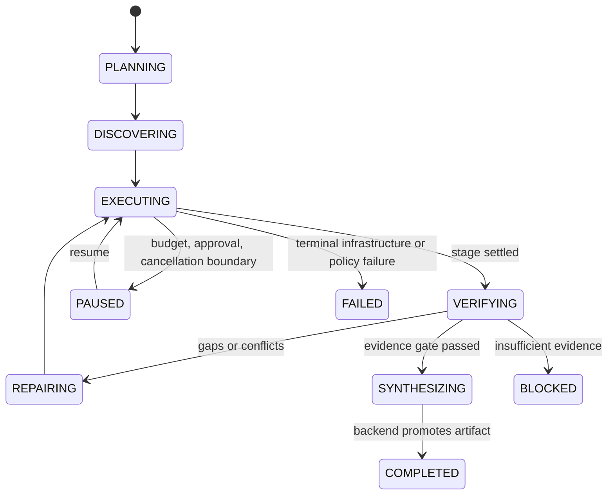

# Deep Research：可恢复的证据生产线

## 业务问题与非目标

Deep Research 处理开放式问题，需要搜索、读取、抽取、比较、验证冲突、补查并生成带引用报告。单次模型调用或无限 ReAct Loop 无法稳定说明做过哪些步骤、哪些证据已经确认、何时停止、崩溃后从哪里继续。

Research 不追求角色数量，也不让 Worker 直接决定业务终态。多 Agent 只有在并行探索、独立候选或审计能带来可测收益时才启用；模型不能自行扩大 Workspace、来源、工具、预算或发布权限。

## 用户操作与最终产物

用户提交研究问题、资料范围、来源策略、输出规格和预算，看到 Plan、Stage、进度、证据、冲突、Checkpoint 与最终报告。报告关联 Research Artifact、Claim-Evidence Manifest、运行版本和限制说明，可以保存为 Source 或交给 Artifact 继续加工。

```text
Brief and Scope
  -> Intent / Matrix Plan
  -> Discovery
  -> Cell Task Scheduling
  -> Search / Read / Extract
  -> Candidate and Evidence Qualification
  -> Local / Global Verification
  -> Conflict / Repair / Replan
  -> Synthesis Candidate
  -> Backend Validation and Artifact Promotion
```

`[当前实现]` Java 保存 Research Run、Matrix/Row/Cell、Task、Evidence、Candidate、Budget、Checkpoint、Stage、Role Result、Discovery Proposal、Artifact 与 Completion Replay Observation；Kafka 分发 Research Agent Command；Python Worker 按不可变 Task Snapshot 执行并回调。

## 演化与 Bad Case

| 阶段 | 方案 | Bad Case | 修复与新问题 |
| --- | --- | --- | --- |
| V0 单次生成 | Prompt 问题并要求长文 | 引用伪造、无法补查、超时后结果未知 | 显式 Search/Read/Evidence；步骤和成本增加 |
| V1 ReAct Loop | 模型循环选工具 | 状态藏在对话里，停止漂移，恢复会重复调用 | Plan/Cell/Checkpoint；Schema 兼容变复杂 |
| V2 固定四格研究表 | Subject + Answer/Evidence/Limitation/Implication | 比较、时间线、多实体问题表达僵硬 | Intent Matrix v2 与 80 Cell 上限；Planner 需要评测 |
| V3 全 Run 屏障 | 任一 Active Task 时不调度新任务 | 慢 Cell 阻塞独立工作 | Runnable Work Refill + Stage Barrier；并发竞争增多 |
| V4 词面 Evidence 校验 | Citation Span + Lexical Overlap | 数字、单位、年份和比较方向矛盾仍可能通过 | Typed Claim Validator + Evidence Qualification |
| V5 Context Restart | 从旧 Checkpoint 新建 Run 并重新 Bootstrap | 已完成搜索和 Cell 重做，恢复卖点被高估 | Hydrated Ledger Resume + 外部 Receipt；快照更大 |
| V6 Backend Renderer | 确定性表格成文 | 表达有限，但证据可控 | 受控 Synthesis Candidate + Backend Guard；新增模型成本 |
| 目标系统 | 版本化角色、工具、证据、评测、灰度和反馈闭环 | 运维与策略面扩大 | Feature Flag Snapshot、Bundle、Shadow 和自动回滚 |

`[行业参考]` OpenAI Deep Research 强调异步研究、可干预和引用；LangGraph 把 Checkpointer 与跨 Thread Store 分开；Temporal 以历史重放承载持久执行；AutoGen/CrewAI 提供多 Agent 或 Flow 抽象。NoteWeave 采用可恢复和显式工作流思想，但保留 MySQL Canonical Ledger、Workspace/Evidence 与自己的业务状态机。

## 领域对象与状态

### 为什么 Research 不复用聊天状态

AnswerRun 只需管理检索、生成、事件和终态；Research 还要管理 Matrix Revision、Cell 状态、来源范围、证据充分性、候选仲裁、Stage Barrier、Budget、Checkpoint、Repair 和 Synthesis。将这些塞进 `RUNNING/FAILED/COMPLETED` 会丢掉可恢复决策。



Cell 语义状态至少区分 GAP、候选存在、验证通过、冲突、需修复、冻结和 Stale；Task 状态仍使用 Claim/Lease/Fencing 的公共模型。Run 终态不能抹平 Cell 与 Evidence 的最终状态。

### Canonical Ledger 与 Worker 候选

Java 主服务拥有 Canonical Ledger。Worker 输出 Candidate、Evidence、Audit Result 或 Synthesis Candidate，不直接更新 Cell Current Value。Completion Committer 校验 Task、Lease Epoch、Fencing Token、Snapshot Digest、Cell Expected Version、Evidence Scope 和 Payload Digest，再原子保存业务结果、预算结算、Receipt 与 Task 终态。

`[当前实现]` Java/Python 使用 Canonical JSON、NFC Key Collision 拒绝和 Digest 契约；跨语言相同输入需要得到相同字节与摘要。

## Matrix、计划与有界调度

`[当前实现]` Intent Matrix v2 可以按研究意图生成稳定 Row/Column/Cell、Plan Revision 与 Digest，限制 1 到 20 行、2 到 8 列、默认最多 80 Cell。旧 Static v1 仍可通过 Feature Flag 保留。

Planner 只定义要验证的单元，不写事实答案。超出上限产生 `PLAN_BOUNDED`，不能静默裁剪。Wide Discovery 只提交 Entity/Dimension/Query/Source Lead Proposal，Backend 按 Scope、Lineage、Budget、Plan Revision 与 Entity Set Version 接受或拒绝。

Runnable Work Refill 在 Run Lock 和 Stage Barrier 下只为依赖满足、未绑定的 GAP/STALE Cell 创建 Task。稳定 Task Key、Budget Reservation 和 Outbox 唯一键防止两个 Coordinator 重复调度。最终化前确认 Required Stage Settled、无 Active Required Task、无 Open Blocker。

### Plan 与 Replan 的可验证合同

`[当前实现]` Research 已有结构化 `ResearchIntent`、确定性 Matrix Plan、Plan Revision、Plan Digest、80 Cell 上限、深度档位和搜索/循环预算。Planner 可以把目标、约束、时间范围与交付格式编译成 Row、Column、Required Finding 和 Stop Contract。当前证据不足以说明所有 Replan 都已按统一偏差类型、回滚范围和质量指标持久化，因此以下完整合同属于 `[目标设计]`。

Plan 不是自然语言步骤列表，而是 `Goal + Frozen Context + Constraints + Dependency + Step + Checkpoint + Stop Contract`。Replan 只能修改完成路径，不能暗中降低 Research Intent 的必填字段、来源边界、时间范围或交付标准。每次 Replan 先把偏差归入可审计原因：输入理解错误、上下文变化、约束冲突、策略边际收益耗尽、工具或 Provider 失败、证据冲突。没有可观测偏差时不允许仅因模型“想换一种方式”而重规划。

回滚按影响范围选择当前步骤、当前 Stage、局部依赖子图或全局重编译。新 Plan Revision 生效时，旧 Revision 尚未 Claim 的 Task 取消，正在执行的 Task 由 Plan Revision 与 Fencing 拒绝晚到写回；与失效假设无关且已通过验证的 Evidence 保留，只撤销受影响 Cell、派生 Claim 和下游 Synthesis。全局重启是最后选项，不能用来掩盖依赖建模不完整。

持久化内容只保存决策摘要，不保存完整 Chain-of-Thought：观察到的事实、偏差类型、Evidence/Receipt 引用、候选修复、选择理由、受影响 Cell、预算变化和新 Plan Digest。计划质量至少看必填目标覆盖率、依赖合法率、Checkpoint 完整率、有效 Replan 率、回滚距离、重复外部动作率，以及 Replan 前后的完成率、单位成功成本和尾延迟。单看 Replan 次数无法判断系统是否更聪明，次数下降也可能是失去纠偏能力。

## 搜索、读取与证据归档

外部搜索结果、网页、Workspace Window 和 Tool Output 都是不可信输入。工具调用前使用服务端 Permit 固化 Workspace、Run、Task、Lease、Role、Source Policy、域名和预算；网络层限制协议、域名、重定向、私网/Loopback、DNS Rebinding、响应大小、媒体类型和凭据转发。

`[当前实现]` External Snapshot Archive、Source Identity、Content Digest 和 Evidence Manifest 提供归档边界；Worker 的 Search/Read Adapter、SSRF/HTTP Security 测试和 Claim Fact Validator 提供受控执行面。

`[目标设计]` 网页每次读取保存 URL Canonical Form、Fetch Time、HTTP Metadata、Content Digest、提取器版本和不可变文本快照。报告引用 Snapshot，不引用一份会变化的在线正文。链接失效时，历史报告仍能按保留政策展示归档摘要；新研究重新抓取并标记内容变化。

## Evidence Qualification 与冲突处理

Evidence Qualification 分三层：

1. 身份与范围：Evidence 属于 Run/Cell，Source Snapshot 在允许 Workspace/Source Policy 中，Archive 和 Digest 有效。
2. 语义支持：Citation Span 与 Claim 关系明确，空 Quote、未知 Provenance 和错误 Relation 拒绝。
3. 来源独立性：高风险 Claim 需要多个独立来源；同注册域、同 Lineage 或同上游转载不能重复计数。

`[当前实现]` `V097` 建立 Research Evidence Validation；Typed Claim Validator 检查数字、百分比、常见单位、年份/日期、比较方向和否定。确定性矛盾不能被 LLM 判断覆盖。Global Verifier 从 Canonical Facts 独立重算，不复制 Local Result；两者不一致保留 `VERIFIER_DISAGREEMENT` 并阻止无条件成文。

### 来源冲突

| 情况 | 状态 | 动作 |
| --- | --- | --- |
| 两个高质量独立来源结论相反 | `CONFLICT` | 保留双方 Claim/Evidence，补查时间、定义、范围和权威性 |
| 单一低质量来源反对多个权威来源 | `QUALIFIED_WITH_DISSENT` | 报告异议和来源等级，不做简单投票 |
| 证据不足 | `GAP` / `BLOCKED` | 扩 Evidence Horizon 或拒绝结论 |
| 网页内容变化 | `STALE_EVIDENCE` | 新 Snapshot 与旧 Digest 对比，重新验证受影响 Claim |
| Citation 失效但归档存在 | `LINK_DEGRADED` | 保留归档引用，标记在线链接失效 |
| Claim 与 Citation 数字/单位矛盾 | `CONTRADICTED` | 阻止合并，创建定向 Repair |

候选仲裁按 Authority、独立来源、Lineage、时效、直接性和冲突状态判断，不用 Last Write Wins 或简单多数票。高风险 Cell 可以要求独立 Candidate Quorum；Quorum 分歧生成有限 Counterfactual Repair，不无限自我辩论。

## Checkpoint Hydration 与避免重复外部调用

`[当前实现]` `V100` 引入 Hydration。Checkpoint Snapshot 包含 Matrix Plan/Digest、Row/Cell 状态与版本、Accepted Evidence Digest/Lineage、Open Verification/Repair、Stage/Barrier、Budget Summary 和 Task/Candidate/Merge High-water Mark。旧恢复入口会创建 Descendant Run，复制不可变语义状态，不复制 Active Lease、Task、Outbox、Execution、Reservation 和 Receipt；这能实现恢复，却会把基础设施故障误计为新的业务 Run，因此不能作为推荐口径。

`[目标设计]` ResearchRun 保持用户意图身份稳定，Plan 使用 Run 级 Revision 链。Worker 接管、进程重启和 Provider 故障恢复只从 Checkpoint 创建新的 ExecutionAttempt，记录恢复来源、本代配置和新增消费，不自动重编译 Plan，也不重置 Run 总预算。用户改变目标、资料范围、交付标准或主动 Fork 时才创建新 ResearchRun。

只为 GAP、STALE 和 Open Repair 生成新 Fenced Task。旧格式保留 `CONTEXT_RESTART` 语义；要求 Hydration 遇到旧格式时必须失败，不能静默降级。

`[目标设计]` 每个 Search/Read/Model/Tool Step 使用 Operation Key 和外部 Receipt。Checkpoint 恢复先复用已确认 Receipt，`IN_FLIGHT` 先查询 Provider；支持幂等键时用同一键重试；非幂等且不可查询时进入 Unknown Outcome 和人工对账。

Checkpoint 太频繁会放大数据库写、快照大小和兼容成本；太稀疏会重复昂贵调用。边界放在外部调用回执后、Wave/Stage 结束、预算结算和人工暂停点。

## Role、能力与 Synthesis

Profile 存在不代表角色可运行。权威 Role Registry 记录 Schedulable、Executor、Snapshot Schema、Completion Handler、Mutation Authority、Tool Set 和 Feature Flag。

| Role | 当前边界 | 写权限 |
| --- | --- | --- |
| `DEEP_CELL` | 主 Cell 搜索、读取和候选 | 只提交 Candidate |
| `COUNTERFACTUAL` | 受限反证或 Repair | 只提交 Repair Candidate |
| `EVIDENCE_AUDIT` | Feature-gated | 只提交 Audit Result |
| `SYNTHESIS` | Feature-gated | 只提交 Artifact Candidate |
| `WIDE_DISCOVERY` | Shadow/Proposal | 只提交 Scope Proposal |
| Local/Global Verifier | 内部组件 | 无直接业务写权限 |

Worker Router 只按已 Claim 且 Digest 校验通过的 Snapshot Role 选择 Executor，Kafka Payload 中 Role 仅作诊断。Role Tool Set 与 Snapshot Policy 取交集，未知角色在任何 Provider 调用前失败。

Synthesis 只在 Stage Settled、Evidence Audit 通过、无 Open Repair 且 Ledger Digest 固定时执行。Worker 禁止新增搜索和修改 Cell，只输出 Claim 到 Cell、Citation 到 Evidence、Limitations 和 Input Digest。Backend 再校验所有事实句和 Citation，通过后 Promote Artifact；确定性 Renderer 保留为失败降级和最低 Citation Completeness Oracle。

## 幂等、并发、乱序和结果未知

Task Snapshot 不可变，Task Key、Idempotency Key、Lease Epoch、Fencing Token、Cell Expected Version 和 Completion Digest 共同防止重复结果。Completion Response 丢失时 Worker 重放同 Payload，服务端返回原 Receipt；不同 Payload 使用同 Completion Key 被拒绝。

Kafka 只保证分区内顺序。Task 和 Completion 到达顺序由数据库状态机判断；旧 Plan Revision、Entity Set Version、Checkpoint Seq 或 Fencing Token 不能覆盖新状态。Candidate Merge 使用 Cell CAS，失败后重新读取 Canonical Ledger，不盲目覆盖。

Provider 超时、限流、配额耗尽和部分流结果分别记录。Search、Read 和 LLM 的 Retry Budget 在 Run 级汇总，防止 Adapter、Worker、Task 和 Kafka 重试相乘。

## 参数与容量

| 参数 | 初始约束 | 过小 | 过大 | 观察指标 |
| --- | --- | --- | --- | --- |
| Max Steps / Waves | 输出复杂度与预算 | 证据缺口未补齐 | 成本、循环和长尾 | Field Coverage、Marginal Gain、Cost |
| Search/Read Budget | 来源广度与 Provider 配额 | 冲突/多样性不足 | 重复来源和限流 | Diversity、Conflict Discovery、429 |
| Matrix Cell Limit | 计划表达能力 | 问题被过度压缩 | Task 爆炸 | Required Coverage、Task Count |
| Replan Count / Accepted Rate | 应对可观测偏差 | 无法纠偏 | 目标漂移或无效改计划 | Reason、Accepted Plan Change、Cost |
| Rollback Distance | 清除失效依赖 | 保留错误下游 | 大范围重做已验证工作 | Invalidated Cell/Stage、Recovery Cost |
| Duplicate External Action Rate | 避免重复搜索和 Provider 调用 | 可能漏掉必要重试 | 重复计费与长尾放大 | Operation Receipt、Input Digest |
| Candidate Quorum | 高风险独立性 | 单点误判 | 成本和无法收敛 | Disagreement、Merge Pass |
| Lease / Heartbeat | Provider P99 与恢复时间 | 误接管 | 故障恢复慢 | Takeover Time、Stale Reject |
| Checkpoint Interval | 可接受重复工作 | 恢复重复调用 | 写放大和快照大 | Recovery Cost、DB Write |
| Synthesis Token | 报告规格 | 结论缺失 | 成本和无依据扩写 | Claim Coverage、Unsupported Rate |

`[当前实现]` Research Command Dispatch 调度批次为 25；Rollout Window 15 分钟，最小 Task 样本 10，Terminal/Delivery Failure 上限各 0.20，Rejected Merge 上限 0.30；Wide Discovery Precision Threshold 0.90；Research Tool Permit 限流桶容量为 10，补充速率为 10/分钟，并在 Provider、Workspace、Run + Role 三个维度同时扣减。这里的限流与 WorkloadQuota 的 20/分钟入口速率是两套不同保护，不能合并成一个“Research 并发”数字。它们是配置保护值，不是生产最优。

`[目标设计]` 参数实验固定 Gold Set、Provider/Mock、Bundle、Source Snapshot 和故障脚本。边际 Evidence Gain 低于阈值、预算耗尽、Required WorkItem 通过类型化验收或风险门禁触发时停止；比较型任务中的 WorkItem 才对应 Required Cell。失败率、拒绝合并、未知结果、成本或 P99 超阈值停止灰度；连续滞回窗口和回放通过后恢复。

## 评测指标

| 指标 | 分子 / 分母 | 说明 |
| --- | --- | --- |
| Required WorkItem Completion | 通过类型化验收的 Required WorkItem / Required WorkItem | 全 Research 的计划完成度，按类型宏平均 |
| Matrix Cell Coverage | 通过最终校验的 Required Cell / Required Cell | 只用于比较型任务的结构完整性 |
| Citation Support | 有直接合格 Evidence 支持、且已经带引用的可核验 Claim / 带引用的可核验 Claim | 引用支撑；全部应引用 Claim 的覆盖率另称 Citation Completeness |
| Conflict Evidence Discovery | 正确识别的冲突样本 / Gold 冲突样本 | 是否主动发现冲突 |
| Source Quality / Diversity / Freshness | 按来源评分、独立域/Lineage 与年龄统计 | 不合成无解释总分 |
| Unsupported Conclusion Rate | 无合格 Evidence 的结论 / 可核验结论 | 硬门禁 |
| Strict Accepted Run Completion Rate | 统一观察截止前产生合格终态的 ResearchRun / 固定已接纳 ResearchRun Cohort | 取消、失败和超期未完成留在分母并分列，按任务类型和风险切片 |
| Recovery Success Rate | 故障后 Canonical State 与期望一致的恢复 / 注入恢复 | 不只看进程重启 |
| Duplicate External Call Rate | 恢复后重复昂贵调用 / 已有成功 Receipt 调用 | Checkpoint 质量 |
| Verifier Disagreement | Local/Global 不一致 Cell / 双重验证 Cell | 审计与阈值调优 |
| Cost per Successful Research | 固定 Cohort 的模型、搜索、抓取、重试和失败成本 / 同 Cohort 成功 ResearchRun | 失败成本也分摊，避免只统计成功路径 |

评测还需 Bootstrap 置信区间、双人标注分歧与 Cohen's Kappa、LLM Judge 与人工金标一致率、近重复泄漏和输入/模型/检索/知识新鲜度漂移。完整口径见 [评测文档](./测试与评测/NoteWeave-评测指标报告.md)。

## 安全与权限

直接/间接 Prompt Injection、恶意网页、附件、搜索摘要、Tool Result 和 Role/Skill Metadata 都不能改变系统权限。模型提出 Intent，服务端执行时重验 User、Workspace、Run、Task、Lease、Role、Tool Version、Source Policy、URL、预算和 Approval。

审批绑定精确 Plan/Artifact Version、工具、参数摘要、Scope 和过期时间。API Key、Token、Cookie 不进入 Prompt、Trace 或 Baggage。高风险写回和外部副作用在 ACL/Policy 不可用时 Fail Closed。Synthesis 与 Discovery 默认没有业务写权限。

## 为什么不用相近技术

| 方案 | 当前没有直接采用 | 迁移条件 |
| --- | --- | --- |
| LangGraph 全量持久化 | 仍需 Workspace/Evidence/MySQL 账本，双状态源增加一致性 | 图频繁变化、子图复用收益可测且能统一迁移历史 |
| Temporal | 当前已有状态机、Outbox、Lease、Checkpoint；引入需活动幂等和运维平台 | 跨天 Timer/HITL/补偿数量显著增加，现有编排维护成本过高 |
| 自主多 Agent | 角色越多越难控制成本、权限、停止和候选合并 | 独立评测证明并行/仲裁净收益，Sandbox 与责任边界成熟 |
| Event Sourcing 全量重放 | 外部 Provider 不可纯重放，事件 Schema 长期兼容成本高 | 审计/时间旅行成为主要需求且能治理 Event Evolution |
| Last Write Wins / Majority Vote | 无法处理来源权威、转载和时间范围 | 不采用；继续使用 Evidence-aware 仲裁 |

## 测试、灰度与回滚

- Canonical JSON、Typed Claim、Evidence Qualification、Matrix、Runnable Refill、Stage Barrier、Hydration、Role Router 和 Synthesis Guard 单测。
- 状态机/Property 测试生成 Claim、Lease Expire、Duplicate Delivery、CAS Conflict 和 Cancellation 序列，验证终态与 Fence 不变量。
- Kafka/Outbox/Callback 集成测试覆盖 Crash、Lease Expiry、Completion Response Loss、Poison Message 和 DLQ。
- 固定 Gold 测试覆盖证据不足、数字/单位/日期矛盾、来源冲突、网页变化和 Citation 失效。
- `DISTRIBUTED_DETERMINISTIC` 走真实 Run API、MySQL、Outbox、Kafka、Worker 与持久化观察；真实 Provider 结果单独分类。
- Feature Flag 对新 Run 固化 Snapshot；先 Shadow，再小流量 Gating；关闭开关后停止创建新角色任务，旧任务排空。
- 回滚切旧 Bundle/Flag，历史 Completion、Evidence、Digest、Checkpoint 和 Artifact 不回写。

`[已测-模拟]` 历史测试计数、确定性回放与 `NO_SUPPORTED_CANDIDATE` 失败屏障见 [质量、测试与发布门禁](./测试与评测/NoteWeave-评测指标报告.md)。Fault Harness 覆盖 Worker Crash、Lease Expiry、Duplicate Delivery、Completion Response Loss、Quorum Disagreement、Audit Blocker 和 Hydrated Resume，只有注入命令成功才可记为已应用。

`[生产待验证]` Real Provider Benchmark、真实来源覆盖、长期成本、持续 SLO、公网 Live Canary 和生产安全红队尚未完成。

## 面试入口

面试主回答与追问见 [Research Agent 一体化手册](./简历亮点八股/30-Research-Agent一体化面试手册.md)。
