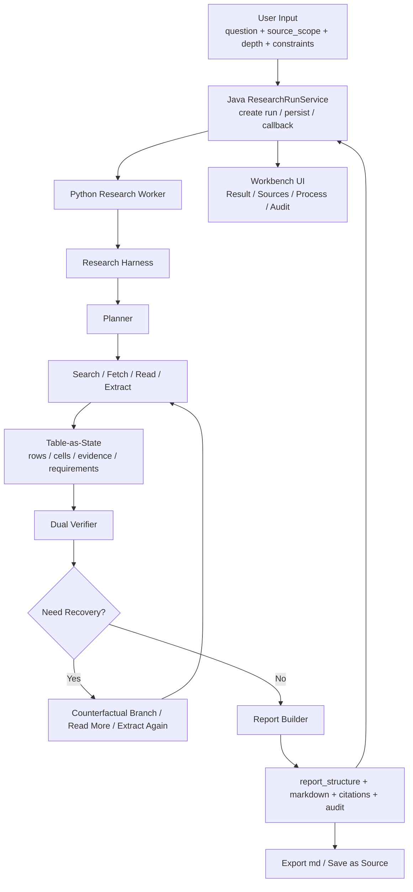

# Deep Research Research Agent 架构文档

> **实现状态声明（最终复审，2026-07-12）**：本文主体目标已在当前代码中按单进程、有界顺序执行边界落地，包括 schema-first `Table-as-State`、独立 Local/Global Verifier、可执行/可裁决反证恢复、运行中 durable checkpoint/resume 与混合 citation support 审核。不得扩写为真正并行 branch runtime、通用 NLI 或 DeepWideSearch 官方成绩；能力事实以 `ResearchAgent-Capability-Coverage.md` 和 `ResearchWorker-Repair-Plan.md` 为准。

## 1. 文档定位

这份文档只回答 `Research Agent` 本身的问题，不讨论泛工作台总架构，也不重复阶段计划里的过程记录。

它的用途有四个：

1. 作为 `Deep Research` 的正式架构说明书
2. 作为后续实现和展示层迭代的边界约束
3. 作为项目讲解、简历亮点、答辩口径的统一底稿
4. 作为成本评估与产品定价建议的设计依据

这份文档以当前已经落地的真实实现为准，核心证据来自：

- `workers/research-worker/app/harness.py`
- `workers/research-worker/app/loop_runtime.py`
- `workers/research-worker/app/state.py`
- `workers/research-worker/app/verifier.py`
- `workers/research-worker/app/search_adapters.py`
- `workers/research-worker/app/fetch_adapters.py`
- `workers/research-worker/app/reporter.py`
- `backend/src/main/java/com/noteweave/research/ResearchRunController.java`
- `backend/src/main/java/com/noteweave/research/ResearchRunService.java`
- `frontend/src/App.tsx`

---

## 2. 产品边界

### 2.1 功能定位

`Deep Research` 是与工作台绑定的独立研究功能，不是聊天、Note、Wiki 的升级模式。

它解决的是复杂开放式研究任务里的三个核心问题：

1. 状态易漂移
2. 路径易跑偏
3. 结果难验证

因此它的交付物不是“一段长回答”，而是一个可验证、可展示、可回流的正式研究成果包：

1. `final_report_markdown`
2. `report_structure`
3. `citations / provenance_bindings`
4. `process summary`
5. `audit summary`
6. `research_artifact_candidate`
7. 可选写回工作台的研究报告来源

### 2.2 唯一任务入口

研究任务只由用户显式输入发起，和上下文无关。

允许用户提供的输入包括：

1. `question`
2. `research_goal`
3. `deliverable_format`
4. `time_range`
5. `constraints`
6. `depth`
7. `source_scope`
8. 是否启用外部搜索

不再采用以下入口定义：

1. 从 `Ask` 升级
2. 从 `Note` 上下文隐式发起
3. 从 `Wiki` 上下文隐式发起
4. 自动继承聊天历史作为研究输入

### 2.3 与工作台的关系

工作台只承担三类职责：

1. 作为 `Research Run` 的承载容器
2. 作为报告、来源、过程和审计的展示层
3. 作为研究成果回流资料池的落点

也就是说，工作台绑定的是 `run` 和 `artifact`，不是研究输入来源本身。

---

## 3. 设计目标与非目标

### 3.1 设计目标

1. 把开放式研究组织成受控的 `Closed-Loop Research`
2. 让研究状态从“隐式 prompt 记忆”迁移到显式结构化状态
3. 让系统在发现证据冲突时具备可解释的纠偏能力
4. 让输出天然带来源基础，而不是后补 citation
5. 让最终结果既能前端展示，也能导出为 `md`，还能回流为工作台资料

### 3.2 核心设计轴：研究深度与研究宽度

对于复杂开放式研究任务，系统不是只追求“答得更长”，而是要同时把研究做深、做宽。

这里的 `宽度` 指的是：

1. 候选查询不能只有一条问法，而要形成 `query family`
2. 候选来源不能只押注单一路径，而要允许不同来源类型并存
3. 系统要能在发现 coverage 不足时扩 `source_scope`
4. 系统要能在冲突出现时挑战已有路径，而不是只会顺着当前证据继续写

这里的 `深度` 指的是：

1. 命中结果后不能直接写答案，而要继续 `Fetch -> Read -> Extract`
2. 证据不能只停留在文本印象，而要落到 `evidence / row / cell / requirement`
3. 写作资格不能靠模型主观感觉，而要通过 `Dual Verifier` 判定
4. 即使允许收口，也要区分正式收口和 `WRITE_WITH_GUARDRAILS`

两者缺一不可：

1. 只有宽度没有深度，系统会“搜很多、看起来很全”，但证据基础不稳
2. 只有深度没有宽度，系统会“读得很细”，但容易过早锁死在错误路径
3. 真正的 Deep Research 不是单纯扩搜索，也不是单纯深挖单页，而是受控地同时做宽度探索和深度收敛

本系统对应的落点是：

1. `Research Harness` 负责把“先扩、再收、必要时纠偏”的主链稳定组织起来
2. `Table-as-State` 负责把宽度覆盖和深度完成度都沉淀成显式状态
3. `Dual Verifier` 负责决定当前是继续扩、继续深挖，还是允许收口
4. `反证分支` 负责在宽度探索失真或深度收敛偏航时做有界纠偏

### 3.3 非目标

1. 不做重型通用多智能体平台
2. 不做过度复杂的过程回放播放器
3. 不追求无限长链路自治，而是追求可控和可讲清
4. 不把主界面做成 verifier 字段堆叠页
5. 不为了显得更复杂而复制超出当前边界的系统复杂度

---

## 4. 总体架构

### 4.1 分层

系统可以拆成五层：

1. `Task Entry Layer`
2. `Research Harness Layer`
3. `Tool Orchestration Layer`
4. `State / Verification Layer`
5. `Report / Delivery Layer`

### 4.2 运行边界

前端不直接编排研究主链。

前端负责：

1. 创建任务
2. 拉取列表和详情
3. 展示主结果
4. 打开详情弹窗
5. 导出报告
6. 执行 `save-report-as-source`

Java backend 负责：

1. `Research Run` 生命周期
2. `task / checkpoint / detail / history` 契约
3. 持久化 worker 回调结果
4. 向前端提供结构化响应

Python worker 负责：

1. 真正的研究编排
2. 工具调用
3. 状态沉淀
4. verifier 闭环
5. 报告生成

---

## 5. 端到端主链路

### 5.1 创建研究任务

入口在 backend 的：

- `ResearchRunController#createResearchRun`
- `ResearchRunService#createRun`

创建时冻结：

1. `question`
2. `research_intent`
3. `source_scope`
4. `profile_key`
5. 控制包

### 5.2 Worker 主循环

worker 主链当前是：

`Planner -> Search -> Fetch -> Read -> Extract -> Table-as-State -> Verify -> Branch -> Report`

其中关键组织器是：

- `harness.py`
- `loop_runtime.py`
- `research_tools.py`

### 5.3 结束条件

循环并不是“搜完就写”，而是受 `LoopDecision` 控制：

1. `SYNTHESIZE_REPORT`
2. `WRITE_WITH_GUARDRAILS`
3. `COUNTERFACTUAL_RECHECK`
4. `READ_MORE`
5. `EXTRACT_AGAIN`
6. `EXPAND_SOURCE_SCOPE`

这正是 `Closed-Loop Research` 的核心。

### 5.4 研究成果交付

worker 结束后输出的核心对象包括：

1. `report_structure`
2. `final_report_markdown`
3. `citations`
4. `research_artifact_candidate`
5. `research_checkpoint_candidate`
6. `audit_summaries`
7. `toolbox_summary`
8. `counterfactual_summary`

backend 将这些对象透传并重组为：

1. `ResearchRunSummaryResponse`
2. `ResearchRunDetailResponse`
3. `ResearchCheckpointResponse`
4. `SaveResearchReportSourceResponse`

---

## 6. 五个核心架构抽象

### 6.1 Research Harness

`Research Harness` 是整个研究系统的组织器，不是单纯 trace 容器。

它负责：

1. 编译研究计划
2. 组织循环轮次
3. 汇总控制态
4. 生成 `audit_summaries`
5. 生成 `toolbox_summary`
6. 统一产出可消费的运行摘要

它对应的真实实现中心在：

- `workers/research-worker/app/harness.py`

这部分是项目亮点的第一层，因为它把一个“可能失控的开放式任务”收束成了一个可控的运行框架。

### 6.2 Closed-Loop Research

`Closed-Loop Research` 的含义是：

1. 搜索不是一次性的
2. 阅读不是一次性的
3. 验证失败不会直接硬写报告
4. 系统会根据 verifier 的结论继续补证、纠偏或带护栏收口

关键实现中心在：

- `workers/research-worker/app/loop_runtime.py`

闭环的价值不是“多循环”本身，而是让研究、读取、验证、修正形成因果链。

### 6.3 Table-as-State

`Table-as-State` 是本系统最关键的内核抽象。

系统没有把状态托管给 prompt 和记忆，而是显式沉淀为研究表状态，包括：

1. row
2. cell
3. evidence
4. requirement progress
5. verifier decision
6. branch state

对应实现中心在：

- `workers/research-worker/app/state.py`
- `workers/research-worker/app/models.py`

这让研究任务的状态具有三个优势：

1. 可累积
2. 可验证
3. 可恢复

### 6.4 Dual Verifier

`Dual Verifier` 是这套系统的第二个关键内核。

它分为两层：

1. `Local Verifier`
2. `Global Verifier`

职责分工是：

1. `Local Verifier` 检查当前 search/read/evidence/ledger 是否成立
2. `Global Verifier` 决定是否允许 final write，还是只能 guarded write，或必须继续 recovery

对应实现中心在：

- `workers/research-worker/app/verifier.py`
- `workers/research-worker/app/verifier_gate_policy.py`

这层设计直接解决“结果难验证”的问题，因为系统最终不是“模型觉得差不多”，而是“verifier 判定允许收口”。

### 6.5 反证分支

`反证分支` 不是为了让系统看起来更智能，而是为了处理真正的冲突证据。

当系统遇到以下情况时，会优先考虑开启 `COUNTERFACTUAL_RECHECK`：

1. evidence 明确冲突
2. 冲突型 requirement 未完成
3. 当前路径存在明显偏航风险

对应实现中心在：

- `workers/research-worker/app/branch.py`
- `workers/research-worker/app/loop_runtime.py`
- `workers/research-worker/app/search_adapters.py`
- `workers/research-worker/app/fetch_adapters.py`

这让系统具备“反证驱动纠偏”能力，而不是在冲突面前做平均化总结。

---

## 7. 工具层设计

### 7.1 Search

搜索层不是简单单查询，而是按 `query family` 编排。

当前已经落地的族包括：

1. `direct`
2. `source_scoped`
3. `intent`
4. `deliverable`
5. `time_range`
6. `constraints`
7. `coverage_gap`
8. `deep_focus`
9. `triangulation`
10. `verified_evidence`
11. `direct_evidence`
12. `counterfactual`

对应实现中心：

- `workers/research-worker/app/planner.py`
- `workers/research-worker/app/search_adapters.py`

### 7.2 Fetch

抓取层采用统一归一化，而不是让前端或报告层直接面对不同来源的原始数据。

当前已落地两类 adapter：

1. `WorkspaceFetchAdapter`
2. `UrlFetchAdapter`

抓取对象会统一沉淀：

1. `fetch_status`
2. `fetch_method`
3. `content_origin`
4. `transport_chain`
5. `transport_resolution`
6. `snapshot_archive_ready`

对应实现中心：

- `workers/research-worker/app/fetch_adapters.py`

### 7.3 Read

读取层的目标不是“读全文”，而是“打开 verifier 可消费的 read window”。

所以 read 输出强调：

1. `read_focus`
2. `read_strategy`
3. `target_requirement_ids`
4. `target_columns`
5. `snapshot_status`

这让后续 extract 和 verify 有明确输入边界。

### 7.4 Extract

抽取层把搜索命中和读窗整理成 evidence cards，再沉淀为 ledger rows。

抽取失败并不会直接终止任务，而会进入：

1. `EXTRACT_AGAIN`
2. `READ_MORE`

### 7.5 Verify

验证层不是“给个分数”，而是输出：

1. decision records
2. warnings
3. recovery actions
4. intent completion contract
5. research intent alignment

这使 verifier 不只是判定器，还是 recovery 的驱动器。

---

## 8. 状态层与数据契约

### 8.1 运行态真源

当前系统的运行态真源已经不是一段 markdown，而是结构化对象组合：

1. `state_ledger`
2. `branch_decisions`
3. `local_verifier`
4. `global_verifier`
5. `loop_rounds`
6. `loop_decision`
7. `counterfactual_summary`

### 8.2 报告态真源

报告态真源是：

1. `report_structure`
2. `research_artifact_candidate`
3. `final_report_markdown`

其中 `report_structure` 已经覆盖：

1. `research_question`
2. `research_intent`
3. `verified_findings`
4. `source_foundation`
5. `closed_loop_state`
6. `conflict_and_counterfactual_review`
7. `recovery_status`
8. `next_actions`
9. `intent_completion_contract`
10. `research_intent_alignment`
11. `provenance_bindings`

对应实现中心：

- `workers/research-worker/app/reporter.py`

### 8.3 后端 API 契约

backend 目前已提供明确的 `Research Run` 契约：

1. `GET /api/v2/workspaces/{workspaceId}/research-runs`
2. `POST /api/v2/workspaces/{workspaceId}/research-runs`
3. `GET /api/v2/workspaces/{workspaceId}/research-runs/{researchRunId}`
4. `GET /api/v2/workspaces/{workspaceId}/research-runs/{researchRunId}/checkpoints`
5. `GET /api/v2/workspaces/{workspaceId}/research-runs/{researchRunId}/checkpoints/{checkpointNo}`
6. `POST /api/v2/workspaces/{workspaceId}/research-runs/{researchRunId}/resume-from-checkpoint/{checkpointNo}`
7. `POST /api/v2/workspaces/{workspaceId}/research-runs/{researchRunId}/save-report-as-source`

这说明 `Research Agent` 已经不是一次性后端调用，而是显式对象化的 run 系统。

---

## 9. Research Report 设计

### 9.1 报告不是普通答案

我们的 `Deep Research` 输出目标是研究报告，而不是单段 answer。

因此报告设计强调四件事：

1. 明确研究问题
2. 明确已验证发现
3. 明确来源基础
4. 明确冲突与纠偏过程

### 9.2 来源优先

报告里最重要的不是“风险和后续动作”，而是来源基础。

所以 `reporter.py` 里专门构建了：

1. `source_foundation`
2. `provenance_bindings`
3. `source_refs`
4. `quality_mix_label`
5. `fetch_foundation_label`
6. `orchestration_foundation_label`

这和用户强调的“重点是来源”完全一致。

### 9.3 Artifact 设计

研究成果最终会同时落两种形态：

1. 前端展示对象
2. 可导出 / 可回流对象

统一通过：

- `build_research_artifact_candidate`

来组织。

这一步把 `report_structure`、`closed_loop_state`、`citations`、`markdown` 统一打包，保证展示和写回不是两套逻辑。

---

## 10. 展示层设计

### 10.1 展示原则

展示层不应该把复杂性平铺到主界面，而应该把复杂性压到详情层。

当前展示原则固定为：

1. 主界面先展示结论、报告、来源
2. 详情弹窗第一层展示 `process`
3. 详情弹窗第二层展示 `audit`

### 10.2 主界面

主界面聚焦：

1. `Research Report`
2. `Workspace Sources`
3. 导出 `md`
4. `save-report-as-source`

### 10.3 Process 层

`process` 层展示的是研究推进链：

1. search timeline
2. fetch timeline
3. read timeline
4. source evidence summary
5. round 级过程摘要

这对应用户希望“过程中来展示检索过程”的要求。

### 10.4 Audit 层

`audit` 层展示的是闭环控制链：

1. verifier gate / final loop decision
2. counterfactual branch summary
3. checkpoint / resume summary
4. harness control state

这里的价值不在于炫技，而在于证明系统确实做了 verifier-gated 研究闭环。

### 10.5 为什么不把 verifier-gated 摘要放主界面

因为主界面要服务“结果交付”，不是“内部运行解释”。

`verifier-gated` 摘要在这里的正确位置是：

1. 详情层的 `audit`
2. 报告中的 `closed_loop_state`
3. Demo 讲解中的亮点证据

而不是首页堆字段。

---

## 11. 成本与价格设计

这一部分分成两层：

1. 内部运行成本模型
2. 产品化定价建议

### 11.1 内部运行成本模型

对 `Research Agent` 来说，单次运行成本主要来自五项：

1. 搜索成本
2. 抓取成本
3. 读取与保留成本
4. LLM 抽取与验证成本
5. 报告生成成本

可以抽象为：

`Run Cost = Search + Fetch + Read Retention + Verify + Report + Recovery Overhead`

### 11.2 成本驱动项

最影响成本的不是“问题有多长”，而是下面这些结构化变量：

1. `depth`
2. `search_query_budget`
3. `global_search_limit`
4. `per_query_result_limit`
5. `tool_response_retention_budget`
6. `max_loop_rounds`
7. `branch_budget`
8. 是否启用外部搜索
9. 是否触发 `COUNTERFACTUAL_RECHECK`

这些变量已经真实存在于：

- `workers/research-worker/app/planner.py`

### 11.3 当前三档运行画像

为了避免把成本写死在某一家模型或搜索服务的实时单价上，建议内部统一使用 `cost points` 做运行预算核算。

可以把一次运行理解为：

- `1 search point` = 一组 query family 搜索与结果归一化
- `1 fetch point` = 一次可追踪 fetch / transport 尝试
- `1 verify point` = 一轮 extract + verifier 判定

在这个抽象下，当前三档运行画像可以写成：

| 档位 | 目标 | 搜索预算 | 结果保留 | 最大轮次 | 分支预算 | 内部成本画像 | 成本特征 |
| --- | --- | ---: | ---: | ---: | ---: | --- |
| `QUICK` | 快速受控结论 | 2 | 3 | 1 | 0 | `3 - 5 cost points` | 便宜、快、几乎不做反证 |
| `STANDARD` | 平衡覆盖与验证 | 5 | 5 | 2 | 1 | `8 - 14 cost points` | 默认档，兼顾展示与质量 |
| `DEEP` | 复杂开放式研究 | 8 | 7 | 3 | 2 | `16 - 28 cost points` | 成本最高，但最能体现 agent 亮点 |

### 11.4 成本控制策略

系统当前最有价值的地方，不是“能花很多资源”，而是“知道在哪里收预算”。

核心控费点有六个：

1. `source_scope` 优先
2. `query family budget` 限流
3. `per_query_result_limit` 限流
4. `max_loop_rounds` 限流
5. `branch_budget` 限流
6. `WRITE_WITH_GUARDRAILS` 收口

也就是说，`Dual Verifier` 不只是质量控制器，也是成本闸门。

### 11.5 为什么这套设计比“无限搜到满意”为好

因为开放式研究任务最容易出现两个成本黑洞：

1. 宽搜无限扩张
2. 冲突后无限反复补证

我们通过：

1. `Table-as-State`
2. `Dual Verifier`
3. `bounded counterfactual branch`
4. `checkpoint / resume`

把这两个黑洞都变成了有限状态问题。

### 11.6 产品化定价建议

如果后续要把 `Deep Research` 做成正式产品能力，建议不要直接按 token 对用户售卖，而是按“研究档位 + 可解释预算”售卖。

建议给用户看的价格层分两种：

1. `credits`
2. 人民币档位

建议口径：

| 产品档位 | 对应运行档位 | 适用场景 | 建议 credits | 建议单次售价 | 定价解释 |
| --- | --- | --- | ---: | ---: | --- |
| `Research Quick` | `QUICK` | 快速定向核查 | 1 | `¥3 - ¥9` | 适合轻量调研、事实核查、范围小 |
| `Research Standard` | `STANDARD` | 默认深度研究 | 3 | `¥15 - ¥39` | 适合大多数可展示研究任务 |
| `Research Deep` | `DEEP` | 复杂开放式课题 | 6 - 8 | `¥49 - ¥99` | 适合高价值、强验证、强来源要求的任务 |

这里的价格不是在反映“生成了多少字”，而是在反映：

1. 检索与抓取开销
2. verifier 闭环强度
3. 反证分支机会成本
4. 报告可交付程度

### 11.7 内部成本与售价的关系

建议内部采用下面这条简单规则：

`售价 = 基础运行成本 × 风险系数 × 交付价值系数`

其中：

1. `基础运行成本` 对应 `cost points`
2. `风险系数` 主要由外部搜索、抓取复杂度、反证分支概率决定
3. `交付价值系数` 主要由是否需要正式报告、可追溯来源、资料池回流决定

### 11.8 为什么定价按档位而不是按字数

因为真正贵的不是生成字数，而是：

1. 搜索和抓取次数
2. 读取保留窗口
3. verifier 循环次数
4. counterfactual branch 开销

所以对外讲“研究深度”和“验证强度”比讲“回答长度”更合理。

---

## 12. 与简历亮点和项目亮点的对齐

### 12.1 一句话亮点

可以把本项目压缩成一句话：

设计并实现面向复杂开放式任务的验证驱动 `Deep Research Agent`，通过 `Research Harness + Closed-Loop Research + Table-as-State + Dual Verifier + 反证分支` 将研究、读取、验证与修正组织成受控闭环，并交付可展示、可导出、可回流的正式研究报告。

### 12.2 五个关键词如何对应真实能力

| 关键词 | 架构含义 | 真实落点 |
| --- | --- | --- |
| `Research Harness` | 研究主链组织器 | `harness.py`、Gate1、worker regression |
| `Closed-Loop Research` | 研究不是一次写完，而是验证驱动循环 | `loop_runtime.py`、`runner.py` |
| `Table-as-State` | 状态真源从 prompt 迁到结构化表状态 | `state.py`、`models.py` |
| `Dual Verifier` | 本地和全局双层 gate 控制收口 | `verifier.py`、`verifier_gate_policy.py` |
| `反证分支` | 冲突证据触发有界纠偏 | `branch.py`、`search_adapters.py`、`fetch_adapters.py` |

### 12.3 面试讲解时最值得强调的三点

1. 这不是普通 RAG 问答，而是验证驱动研究闭环
2. 状态不是靠 prompt 记忆，而是靠 `Table-as-State`
3. 冲突不是靠语言平滑，而是靠 `反证分支` 纠偏

### 12.4 对项目展示最有价值的成果点

1. 独立 `Deep Research` 入口
2. 研究报告与来源优先展示
3. 过程层可看检索、抓取、读取
4. 审计层可看 verifier gate 与反证分支
5. 结果可导出 `md`
6. 结果可写回资料池并复用

---

## 13. 调研后做出的取舍

### 13.1 为什么不是普通 RAG

调研时我们优先对比过最直接的路线，也就是 `retrieve -> stuff context -> generate`。

它的优点是：

1. 实现快
2. 成本低
3. 对收敛型问题很有效

它的缺点是：

1. 研究状态主要藏在上下文里
2. 对冲突证据和路径纠偏支持不强
3. 很容易退化成“搜完就写”

所以最终没有采用普通 RAG 作为主架构，而是选择了 `Closed-Loop Research`。

### 13.2 为什么不是纯“边想边调工具”或纯“先规划后执行”

调研时也对比过：

1. 纯“边推理边调工具”
2. 纯“先规划后执行”

这类方案的优点是：

1. 分步推进自然
2. 工程落地成本较低
3. 对中短链任务比较友好

这类方案的问题是：

1. 长任务里的状态还是容易漂移
2. 计划在开放式研究中容易中途失效
3. 没有天然的 run 级完成度控制

所以最终采取的是：

1. 保留 `planning`
2. 保留工具驱动
3. 但把状态真源迁移到 `Table-as-State`
4. 把收口控制迁移到 `Dual Verifier`

### 13.3 为什么不是大规模搜索树或重型多 agent

调研时还对比过：

1. 大规模分支搜索
2. 更重的多 agent 协作

这些方案的优点是：

1. 探索空间更大
2. 角色分工更细
3. 理论上更接近通用复杂任务框架

但问题也很明显：

1. 成本快速上升
2. 状态同步复杂
3. 展示和讲解难度更大
4. 容易为了复杂而复杂

因此最终只保留了其中最有价值的一部分：

1. 在必要时做 `bounded counterfactual branch`
2. 而不是无边界扩展搜索树
3. 把复杂度收束在最能体现研究价值的闭环主链里

### 13.4 为什么不是图结构优先

调研时也考虑过用图结构做第一真源。

图结构的优点是：

1. 关系表达强
2. 适合 entity / citation / lineage 连接
3. 适合复杂多跳关系推理

但当前阶段我们更优先解决的是：

1. finding 是否 ready
2. requirement 是否完成
3. verifier 是否允许收口
4. checkpoint 是否可恢复

对于这些问题，表状态比图结构更直接。

所以最终选择是：

1. 先用 `Table-as-State` 做第一真源
2. 如后续需要更复杂的 source graph / citation graph，再叠加图结构

### 13.5 为什么工具层要分 Search / Fetch / Read

调研时也可以把网页能力做成一个大工具。

那样的优点是：

1. 开发更快
2. 调用更简单

但问题是：

1. 无法清晰做 query budget
2. 无法细粒度做 fetch fallback
3. 无法把 read focus 显式化
4. 过程展示会很弱

所以最终采取的是分层工具设计：

1. `Search` 负责去哪找
2. `Fetch` 负责怎么稳定拿
3. `Read` 负责围绕什么目标读

### 13.6 总体取舍原则

一句话概括：

不是追求最复杂的方法组合，而是围绕当前产品边界，选择最适合做成“可运行、可验证、可展示、可回流”的研究系统的方案。

---

## 14. 当前落地状态

截至 `2026-07-07`，这套架构不是停留在设计层，而是已经有完整落地证据：

1. Worker / Agent
   - `workers/scripts/run-gate1-smoke.ps1`
   - `workers/research-worker/tests/test_harness.py`
2. Backend
   - `Phase6ResearchArtifactContractTest`
3. Frontend
   - `npm --prefix frontend run build`
   - `npm --prefix frontend run ui:check`
4. Demo / Delivery Pack
   - `DeepResearch-P5B-demo-suite`
   - `DeepResearch-P5C-项目讲解稿`
   - `DeepResearch-P5C-亮点证据映射.json`
5. Final Aggregate
   - `scripts/verify-deepresearch-final-delivery.ps1`

这意味着它已经具备：

1. 可运行性
2. 可验证性
3. 可展示性
4. 可讲解性
5. 可交付性

---

## 15. 后续迭代纪律

后续任何继续完善 `Research Agent` 的实现，都应遵守以下顺序：

1. 先更新 `docs/阶段计划/阶段5B-ResearchAgent全量实现.md`
2. 再改代码或补文档
3. 始终优先保持五个关键词主线稳定
4. 展示层继续服从“结果优先，过程下沉，审计更下沉”
5. 工具层增强只围绕真实缺口，不为了炫技扩复杂度

---

## 16. 结论

`NoteWeave Deep Research` 的真正价值，不在于“也能回答复杂问题”，而在于把复杂开放式研究任务做成了一个有状态、有验证、有纠偏、有来源基础、可回流工作台的正式研究系统。

如果用一句更工程化的话总结：

`Deep Research` 的核心不是更长的答案，而是一个由 `Research Harness` 驱动、以 `Table-as-State` 为真源、由 `Dual Verifier` 控制闭环、并通过 `反证分支` 完成路径纠偏的 `Closed-Loop Research Agent`。
