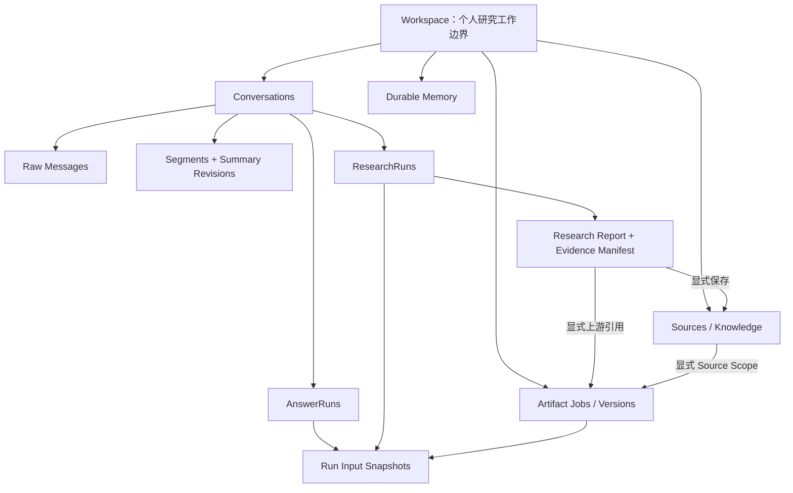
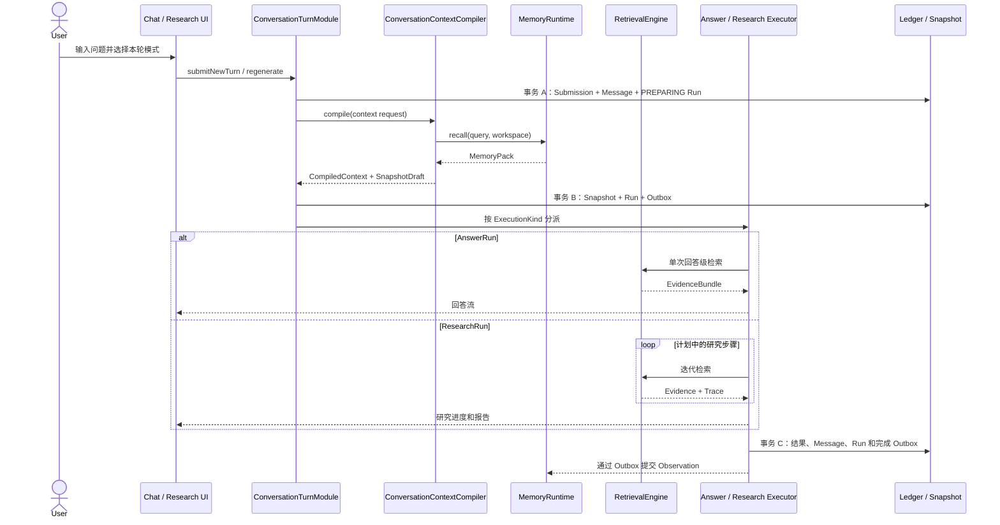
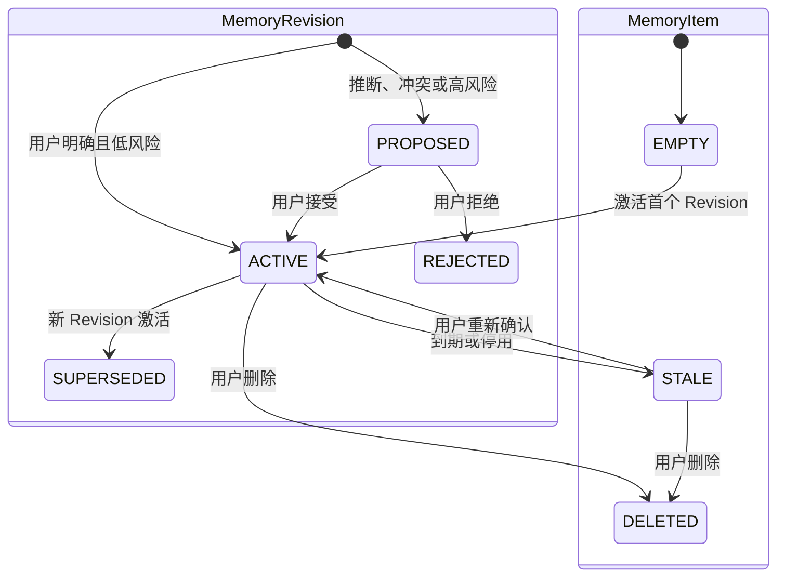

# NoteWeave Memory、长上下文与 Research 重构设计

> 状态：目标架构与分阶段重构方案
>
> 场景：个人 AI 研究工作台
>
> 更新：2026-07-17

除“当前源码的接入位置”外，文档中的陈述均表示重构目标，不表示当前已经实现。

## 设计范围

NoteWeave 的 Workspace 是一个用户的一项研究工作边界。一个 Workspace 可以包含多份资料、多个会话、多次 Deep Research 和多个产物任务，但本次重构不把团队协作作为产品目标。

现有 RBAC 代码保留但不扩展，不进入本次 Memory 的领域模型和简历亮点。目标架构按单用户场景设计：用户可以建立多个 Workspace，每个 Workspace 有多个独立 Conversation，每个 Conversation 可以持续进行多轮长上下文提问，并在每一轮选择普通回答、Note、Wiki 或 Deep Research。

这里的“单用户场景”表示一个 Workspace 只有一个所有者，不表示系统只有一个账号。Source、Message、Report、Memory 和 Snapshot 的读取仍必须同时校验当前用户与 Workspace 归属，不能因为不做团队协作就省略租户隔离。

本次重构集中解决六个问题：

1. 检索方式绑定会话还是绑定每一轮；
2. 长会话如何保留连续性，又不把完整历史反复塞入模型；
3. Durable Memory 保存什么，如何写入、冲突、遗忘和召回；
4. Research 如何接入普通聊天链路，同时保留独立页面；
5. Artifact Agent 如何使用 Memory 和研究结果，又不隐式继承聊天历史；
6. 每次回答实际使用了什么上下文、证据和 Memory，如何追踪和复现。

## 架构结论

目标架构遵守以下约束：

- Workspace 管研究项目，Conversation 管连续消息，Run 管本轮执行。
- QA、Note、Wiki 和 Deep Research 都按本轮选择，不永久绑定 Conversation。
- Deep Research 复用普通会话的消息、上下文、压缩和追问链路，Research 页面只是专用视图。
- AnswerRun 和 ResearchRun 保持独立，不合并成统一 Run 表和统一状态机。
- 原始消息、会话摘要、Durable Memory、Source Evidence、Research Report 和 Artifact Version 分开存放。
- Memory 保存偏好、约束、已确认决策和回忆入口，不保存文档事实、报告正文和工具 Trace。
- Research Report 只有经过用户显式保存，才成为其他会话可检索的 Workspace Source。
- Artifact Agent 仍是 Workspace 下的独立功能，只接受显式 Source、Report 或消息范围。
- 每次 Run 固化 RunInputSnapshot，不能依赖会话当前设置重建初始输入。
- Message 在提交后不可原地改写，重新生成只替换当前上下文采用的助手答案，历史版本仍可审计。
- “回放”默认指输入与 Prompt Sections 的重建，不承诺模型输出逐字一致。
- 第一版不做全量聊天向量化、Memory 多 Agent 流水线、图数据库和自动修改 Skill。



## 领域对象与数据归属

| 对象 | 负责内容 | 生命周期 | 是否进入 Prompt |
|---|---|---|---|
| Workspace | 研究项目、资料和配置 | 跨会话 | 只注入相关配置 |
| Conversation | 一条连续消息线程 | 长期保存 | 经 Context Compiler 选择 |
| Message | 用户和助手的原始消息账本 | 长期保存 | 最近原文或按需回读 |
| Segment Summary | 一段话题的结构化摘要 | 可重算、可版本化 | 是 |
| AnswerRun | 普通回答的一次执行 | 不可变执行记录 | 不直接进入 |
| ResearchRun | 有计划、检索和报告的长任务 | 可恢复、有父子关系 | 状态摘要或报告引用 |
| Source | Workspace 中可选择的资料 | 有版本 | 不直接进入 |
| Evidence | 某次 Run 从 Source、Report 或 Web 选中的证据 | 随 Run 固化 | 是，作为事实依据 |
| Durable Memory | 跨会话仍有价值的偏好、约束和决策 | 受版本和失效治理 | 是，严格限量 |
| Research Report | 研究结论及证据清单 | 按 ResearchRun 保存 | 相关片段按需进入 |
| Artifact Version | 正式产物版本 | 追加版本 | 只在显式作为上游时进入 |
| Retrieval Trace | 查询、候选、评分和工具过程 | 审计保留 | 否 |
| RunInputSnapshot | 某次 Run 开始时冻结的会话、Memory、Scope 和 Grounding | 不可变 | 用于复现初始输入，不整体注入 |

这些对象不能互相替代。Segment Summary 不是长期记忆，Memory 不是知识库，Research Report 不是 Memory，Trace 也不是聊天历史。

## 按轮选择执行方式和检索范围

### 三类配置

用户看到的是本轮模式，后端需要把它拆成三个概念：

```text
TurnMode
  QA | NOTE | WIKI | DEEP_RESEARCH

ExecutionKind
  ANSWER | RESEARCH

RetrievalConfig
  strategy: NONE | AUTO | EXPLICIT
  channels: (WORKSPACE | REPORT | WEB)[]
  sourceScope[]
  groundingRefs[]
```

`TurnMode` 表示用户在 Composer 中做出的选择；`ExecutionKind` 决定启动 AnswerRun 还是 ResearchRun；`RetrievalConfig` 分开表达检索策略、允许通道和显式范围。`DEEP_RESEARCH` 是 TurnMode，并映射到 `ExecutionKind.RESEARCH`，不应加入当前的 `AnswerModeStrategyRegistry`。

请求模型可以收敛为：

```text
SubmitTurnCommand
  conversationId
  content
  requestedTurnMode
  retrievalStrategy
  retrievalChannels[]
  sourceScope[]
  groundingRefs[]
  researchOptions?
  clientRequestId
```

Conversation 可以保存下一轮的默认选择，方便连续提问，但默认值不参与历史执行。发送消息后，服务端计算 EffectiveRetrievalConfig，并固化到对应 Run 和 RunInputSnapshot。

服务端需要拒绝自相矛盾的组合：

| Strategy | 合法输入 |
|---|---|
| NONE | `channels`、`sourceScope` 和 `groundingRefs` 均为空 |
| AUTO | 至少允许一个 Channel，`sourceScope` 可以为空或作为过滤条件 |
| EXPLICIT | 至少提供 Source、Report Grounding 或受控站点范围之一，Channel 必须与引用类型一致 |

Memory 不属于 Retrieval Channel。它由 MemoryRuntime 按用户、Workspace 和类型策略独立召回。Workspace 特定约束覆盖 USER 默认偏好，本轮用户明确要求再覆盖二者，但任何内容都不能覆盖 System/Security。

例如同一会话可以先用 Wiki，随后关闭检索，再发起 Deep Research。三个 Run 各自保留当时的模式、Source Scope 和证据，后续修改 Composer 不会改变历史结果。

### 不新增 Conversation 类型

同一 Conversation 应允许普通回答和 Deep Research 交替出现，因此不新增 `RESEARCH_CONVERSATION`，也不使用 `conversation_kind` 限制执行方式。Research 页面可以查询包含 ResearchRun 的 Conversation，前端标签由运行数据派生。

### 不新增通用 Turn 业务表

现有用户 Message 可以作为逻辑 Turn 锚点：

```text
AnswerRun.query_message_id
ResearchRun.query_message_id
```

重试或重新生成时，多个 Run 可以指向同一条用户 Message。这样既能保留执行历史，也不需要为了统一增加一个只有转发作用的 `conversation_turn` 表。

新一轮和重新生成是两个动作。新一轮创建 UserMessage、AssistantPlaceholder 和 Run；重新生成复用原 `query_message_id`，只创建新的 AssistantPlaceholder 和 Run，不复制用户消息。Worker Retry 继续使用原 Run、Message 和 RunInputSnapshot。

幂等与故障恢复需要一张轻量的 `turn_submission` 提交账本。它不是新的业务 Turn，也不承载聊天内容，只保存 `clientRequestId`、请求哈希、操作类型、消息和 Run 引用，以及 PREPARING 阶段的冻结输入。相同 Key 且哈希一致时返回已有 Receipt；相同 Key 但哈希不同必须返回幂等冲突。

第一版采用单一活动上下文路径，不实现任意历史分支。Message 通过 `reply_to_message_id` 记录血缘，Conversation 保存 `active_head_message_id`。重新生成只允许替换最新可重新生成的助手答案：新答案成功后，旧答案标记为 `SUPERSEDED` 并退出后续上下文；新答案失败时仍保留旧答案。编辑更早的历史消息需要新建 Conversation，避免隐式重写其后的消息和摘要。

新提交在事务 A 中用 `expected_history_head_id` 做 CAS，并把新 AssistantPlaceholder 设为活动头。后续消息可以接在仍为 PENDING 的 Placeholder 之后，但 Compiler 会跳过它的未完成正文并继续读取祖先。异步完成只能更新自己的 Placeholder，不能把 Conversation Head 回拨到旧位置；重新生成失败时，事务 C 才把活动头恢复为旧答案。

## 普通聊天和 Research 共用一条主链路

### 唯一提交入口

聊天页和 Research 页面都通过 ConversationTurnModule 提交消息。该 Module 的完整 Interface 在“核心 Module 的 Interface 与 Seam”中定义。



公共链路只冻结初始输入，不预先生成 Research 的最终 Evidence。AnswerExecutor 完成一次回答级检索，并固化 EvidenceBundle；ResearchExecutor 在自己的状态机中多次检索，最终生成 Evidence Manifest。`clientRequestId` 在消息落账前完成幂等检查，Segment Summary 在回答落账后异步更新。ConversationContextCompiler 只计算上下文和 SnapshotDraft，不直接写数据库。

### 事务与故障恢复

消息、Run 和 Outbox 不能靠一个长事务包住远程调用。提交、准备与完成分成三个短事务：

```text
事务 A
  创建或读取 turn_submission，比较 request_payload_hash
  校验 expected_history_head_id
  新一轮：创建 UserMessage
  新一轮/重新生成：创建 AssistantPlaceholder
  创建 PREPARING AnswerRun 或 ResearchRun
  在 submission.preparation_json 冻结 request_config、selection_as_of、
  history_head、conversation_cutoff_seq 和显式 Source 版本引用

事务外
  ConversationContextCompiler 编译初始上下文

事务 B
  写 RunInputSnapshot
  关联 Run 和 Snapshot
  PREPARING -> READY / QUEUED
  写启动 Outbox
  更新 turn_submission Receipt

事务 C
  固化 Answer Evidence 或 Research Report / Evidence Manifest
  完成 AssistantMessage
  通过 run_version、attempt_no 和 fencing_token 迁移 Run 终态
  写 ExecutionCompleted、Memory Observation 和 Summary Compaction Outbox
```

相同 `clientRequestId` 且请求哈希一致时返回已有 TurnReceipt。Context 编译失败时，Run 和 Submission 收敛为 FAILED，助手占位消息展示可重试状态；后台恢复器扫描超时的 PREPARING Run，按 `preparation_json` 幂等重试。Snapshot 写入后，所有 Worker Retry 复用原 Snapshot。任一阶段都不能重新读取 Composer 当前设置来补齐旧请求。

按 `selection_as_of` 重编译要求 Memory Revision 和 Segment Summary Revision 保留激活区间，不能只覆盖当前状态。恢复器选择在该时刻有效且不超过 `history_head / conversation_cutoff_seq` 的 Revision；如果引用已经因隐私删除而不可用，Run 明确失败或降级，不能换用更新后的内容冒充原输入。

### 两个前端页面

普通聊天页允许每一轮切换 Deep Research。Research 页面默认选择 Deep Research，并突出计划、进度、来源、报告、历史研究和继续研究。两个页面读取同一个 Conversation、Message 和 ResearchRun。

Research 页面可以有独立路由和布局，但不能再维护一套 Research Chat、Research Message 或 Research Summary。这样能复用消息分页、Markdown、附件、会话恢复、长上下文压缩和反馈代码。

### Research 状态

对用户有意义的状态保持少量：

```text
QUEUED
PLANNING
WAITING_FOR_CONFIRMATION
RESEARCHING
SYNTHESIZING
COMPLETED
PAUSED | CANCELLED | FAILED
```

Worker 内部可以有更多步骤，但不把每个内部节点升级为业务状态，否则恢复和前端兼容会越来越重。

`COMPLETED / CANCELLED / FAILED` 是不可逆终态，`PAUSED` 可以用新 Attempt 恢复。ResearchRun 保存 `run_version` 和 `attempt_no`，每次 Worker Lease 生成新的 `fencing_token`。Callback 必须携带 `(run_id, attempt_no, fencing_token, callback_event_id)`，通过 CAS 和事件唯一键更新；旧 Attempt、取消后的 Callback 和重复终态 Callback 只能记审计，不能覆盖当前状态。

用户在 `WAITING_FOR_CONFIRMATION` 修改计划、追加要求、暂停或继续时，写入追加式 `research_command_event` 和 `research_plan_revision`。没有新增输入的恢复复用原 Snapshot 和 Checkpoint；新增要求生成新 Plan Revision，改变研究目标时创建子 ResearchRun，不能把新输入偷偷写回初始 Snapshot。

第一阶段可以继续使用现有 Task 轮询。只要 ResearchRun 已关联 Conversation，并在完成时更新占位消息，就能得到同会话异步研究体验。统一 Conversation SSE 放到后续阶段，不作为首期前置条件。

## Research 报告和多轮追问

### 报告在 Conversation 中的形态

Research 完成后保留两类数据：

- ResearchReport 是报告正文和 Evidence Manifest 的唯一真相；
- AssistantMessage 只保存面向会话的摘要或报告卡片，并引用 ResearchReport 和 ResearchRun。

完成态 ResearchReport 不可原地修改。重新生成、人工修订或重新抽取 Evidence Manifest 时创建新的 Report Revision 或新的 ResearchRun，Grounding 和 Artifact Upstream Ref 必须引用具体 Revision。

报告可以在原 Conversation 中继续使用，也可以作为显式 Upstream Ref 交给 Artifact。只有进入其他 Conversation 的通用 RAG 时，才要求用户先将报告保存为 Generated Source。

### 讨论报告和继续研究

| 本轮选择 | Grounding | 执行结果 |
|---|---|---|
| QA / Note / Wiki | 无报告引用 | 新 AnswerRun |
| QA / Note / Wiki | 已完成 Research Report | 新 AnswerRun，报告作为显式证据 |
| Deep Research | 无报告引用 | 新根 ResearchRun |
| Deep Research | 已完成 Research Report | 新子 ResearchRun |
| 任意模式 | 未完成 ResearchRun | 只能读取运行状态，不能当事实证据 |

“解释报告第三部分”走 AnswerRun。Context Compiler 只解析并校验 Report Grounding；AnswerExecutor 再调用 RetrievalEngine 检索报告相关段落及其原始证据，默认不重新搜索 Web。

“补充国外项目再验证第三部分”走子 ResearchRun：

```text
parent_research_run_id = 上一 ResearchRun
```

子运行携带父 Report Revision、摘要、Evidence Manifest 引用、未解决问题和用户新增要求。它不复制完整 Trace，也不修改父报告。

Composer 显示当前 Grounding：

```text
基于：Research Report · Java Agent Memory Architecture  ×
```

用户可以移除或切换。回复某张 Report Card 时，服务端可以依据 `reply_to_message_id` 确定性地加入该 Report Revision；其他情况不靠模型猜测“用户大概在问哪份报告”。Grounding 固化到 RunInputSnapshot。即使用户文字写了“继续研究”，只要仍选择普通回答，后端就不能静默升级成高成本 ResearchRun。

## 长会话上下文

### 三层结构

```text
Conversation
  Raw Message Ledger
  Segment Summary Revisions
  Recent Raw Tail
```

Raw Message Ledger 是事实账本，在 Conversation 的保留周期内保存。用户删除 Conversation 或触发隐私擦除时，删除规则高于审计和回放要求。Segment Summary 是按话题生成的结构化派生数据，可以重算和版本化。Recent Raw Tail 保留最近几轮的原始措辞、指代关系和局部细节。

Context Compiler 从 ContextRequest 固定的 `history_head_message_id` 沿活动消息路径读取历史，只选择 `CURRENT` 的完成消息。仍在生成的 Placeholder、FAILED、CANCELLED 和 `SUPERSEDED` 答案默认不进入上下文。Message 正文提交后不可原地修改，编译结果再把 Message ID 与内容哈希写入 SnapshotDraft。

每次执行使用：

```text
相关 Segment Summary
+ 最近原始消息
+ 用户显式 Pin 的约束消息
+ 显式 Research Report Grounding
+ 必要的旧消息原文
```

### Segment 边界

以下信号可以结束当前 Segment：

- 用户明确切换话题或目标；
- 一个研究目标完成，进入报告讨论；
- 长时间中断后恢复；
- Segment 已超过 Token 或消息阈值；
- 用户主动开启新话题。

切换一次 QA、Note 或 Wiki 不必创建新 Segment。Segment 由话题连续性决定，不由检索按钮决定。

### Summary Revision

每版摘要至少包含：

```text
covered_message_seq
goal
confirmed_decisions[]: {text, supporting_message_refs[]}
constraints[]: {text, supporting_message_refs[]}
open_questions[]
key_entities[]
source_refs[]
research_report_refs[]
artifact_refs[]
user_corrections[]: {text, supporting_message_refs[]}
short_narrative
parent_revision_id
```

摘要必须区分用户已确认的内容、模型建议和待验证问题。决策、约束和纠正逐项引用原始 Message ID、内容哈希和消息角色，不能只靠一段无来源的叙述。用户纠正、禁止事项和显式 Pin 的约束消息不能被普通叙述摘要覆盖。Pin 通过 `conversation_context_pin` 引用不可变 Message，不复制正文。

### 压缩时机

Token 预算是主触发器，消息轮数只作兜底。回答结束后异步预压缩，下一轮发送前如果仍超出预算，再同步补压缩。只重算受新消息影响的尾部 Segment，不从第一条消息反复总结整段会话。

异步摘要先写 `BUILDING` Revision，成功后才通过 Segment 版本 CAS 切为 `READY`。Compiler 只选择 `READY` Revision，并保证基础历史投影满足 `summary.covered_end_seq + 1 = recent_tail.start_seq`，不能漏消息或重复注入。摘要生成期间发生新消息、分支切换或删除时，旧任务不得晋升；没有可用摘要时回退到受 Token Budget 限制的原始消息。

第一版不为每条历史 Message 建向量。优先检索 Segment Summary、Research Report 摘要和 Episode Pointer，需要细节时再按消息序号回读一小段原文。

## Durable Memory

### Memory 保存什么

第一版保留五类：

| 类型 | 示例 | 作用域 |
|---|---|---|
| USER_PREFERENCE | “回答先给结论，中文为主” | USER |
| WORKSPACE_CONVENTION | “本项目引用采用 GB/T 7714” | WORKSPACE |
| CONFIRMED_DECISION | “检索策略按 Run 固化” | WORKSPACE |
| NEGATIVE_CONSTRAINT | “研究报告不要自动写入资料库” | USER / WORKSPACE |
| EPISODE_POINTER | “Memory 设计讨论见会话 X 的 Segment 4” | WORKSPACE |

第一版只有两个长期作用域：

```text
USER
  跨 Workspace 使用的个人稳定偏好

WORKSPACE
  只在当前研究项目中成立的规范、决策和约束
```

Conversation 中的目标、临时结论和未解决问题属于 Working Context。它们留在 Segment Summary，不再增加 `CONVERSATION_MEMORY` 这种名为 Memory、实际仍是上下文的作用域。

### 不进入 Memory 的内容

- 文档和网页中的事实；
- Research Report 正文；
- Source Chunk 和引用；
- 完整聊天历史；
- 工具调用过程；
- Artifact 正文；
- 模型尚未得到用户确认的建议；
- 一次性的当前任务状态。

文档事实由 RAG 负责，研究结论由 Report 和 Evidence Manifest 负责，运行状态由 Run/Trace 负责。Memory 不作为事实引用来源，也不承担事实验证；但每条 Memory 必须保留 Provenance，供用户检查它为何被记住和召回。

### 写入生命周期



Candidate 是 MemoryRuntime 内部的瞬时判断，不单独作为长期业务对象。MemoryItem 表示一个稳定 Slot，MemoryRevision 表示该 Slot 的当前值或候选值。用户明确说“记住这件事”时，MemoryRuntime 可以创建 ACTIVE Revision；从行为中推断出的偏好、冲突项和重要 Workspace 决策先创建 PROPOSED Revision，等待用户审核。只有 PROPOSED Revision 的新 Item 处于 EMPTY，`current_revision_id` 为空。

Answer、Research 和 Artifact 只通过完成事务写 `ExecutionCompleted` Outbox。MemoryRuntime 以 `observation_id` 幂等消费 ExecutionObservation，负责提取 Candidate，并创建 ACTIVE 或 PROPOSED MemoryRevision。Canonical Memory 的写入规则不会散落在三条业务链路中。

### Slot、版本和冲突

`slot_key` 表示同一可替换语义：

```text
user:response.language
user:response.detail_level
workspace:citation.style
workspace:architecture.memory_scope
```

同值重复出现时更新确认次数和最近确认时间，不新增重复 Memory；兼容内容合并为新 Revision；用户明确纠正时，新 Revision 替代旧版本；两个推断来源冲突时创建 PROPOSED Revision，不由模型静默选择。

`slot_key` 由版本化 Slot Schema Registry 规范化，不能让模型自由生成无限新键。数据库通过 Scope-aware 唯一键保证同一所有者、作用域和 Slot 只有一个 MemoryItem。激活 Revision 时锁定 Item 或使用 `lock_version` 做 CAS，在一个事务中将旧 Revision 标为 SUPERSEDED、激活新 Revision、更新 `current_revision_id` 和 Item 状态，保证每个 Item 最多一个 ACTIVE Revision。

### Rank 和 Token Budget

Memory 先按 Scope、状态和有效期过滤，再做相关性排序：

```text
score = semantic_relevance
      + lexical_match
      + explicit_user_bonus
      + confirmed_bonus
      + recency_decay
      - contradiction_penalty
      - staleness_penalty
```

Rank 保持可解释。各特征先归一化，权重和阈值归入版本化 Policy。第一版不训练排序模型，也不把固定权重写散在业务代码中。每次召回记录命中特征和最终选择原因。

MemoryPack 分为 Applicable Constraints、Preferences、Decisions 和 Episode Pointers。已匹配当前场景的 NEGATIVE_CONSTRAINT 在独立硬上限内优先保留，其他类型再按 Rank 竞争预算。Memory 超限时优先去重、按 Slot 只保留当前 Revision，并裁掉低相关、低置信和 Stale 项。具体预算以 Token Ledger 表为准。

### TTL 和遗忘

稳定个人偏好可以没有硬 TTL，但长期未使用时降低 Rank；项目阶段约束可以配置 `valid_until`；临时决定到期后先转 Stale，不立即物理删除；Episode Pointer 随目标会话或报告删除而失效。

到期和用户删除是两件事。到期先控制是否召回，再按保留策略物理清理；用户删除立即停止召回，并按隐私擦除策略清理正文和派生缓存。审计若必须保留，只能保留 Tombstone、哈希和删除事件，不能继续保存可恢复的敏感正文。

### Outcome Feedback

回答的点赞、纠正、重新生成和任务成功率先写入独立 `run_feedback`。它们是 Run 级结果，不直接归因给本轮召回的每个 Memory。离线评测可以结合 Snapshot 中的 Memory Revision Refs 分析相关性，但第一版不根据单次反馈自动调整在线 Rank，也不让模型自动改系统规则。`memory_event` 只记录明确的召回、确认、拒绝、替换、失效和删除事件。

### Human Review

这里的 Human 是当前用户本人。目标态的 Memory Inspector 应提供：

- 查看来源和最近使用；
- 接受或拒绝 PROPOSED MemoryRevision；
- 通过新 Revision 修改有效期和正文；
- 通过“迁移 Scope”命令创建目标 Scope 的新 Item，并停用旧 Item；
- 查看 Revision；
- 停用、恢复和删除。

Inspector 不直接更新 Memory 表，所有操作都通过 MemoryRuntime 的 MemoryCommand Interface。Item 的 `type / scope / owner / workspace / slot_key` 是身份字段，不允许原地改写。

### Memory 与上下文投毒防护

Memory、Source、网页、Report、历史 Message 和工具输出都按不可信数据处理：

- Source、网页和工具输出不能创建 USER_PREFERENCE 或 WORKSPACE_CONVENTION；
- `provenance_type` 由受信任的服务端入口生成，客户端内容不能自报为 USER_FEEDBACK 或 PROJECT_DECISION；
- 每条 Memory 保存 provenance；
- Memory 以结构化字段注入，不执行其中的指令；
- Evidence、Report 和 Summary 使用带来源标签的独立数据区，检索内容中的指令不得提升为 System 或 Tool Policy；
- System/Security 和本轮用户显式要求高于 Memory；
- 召回内容经过长度、类型和指令模式检查；
- 所有引用在检索前校验 `owner_user_id + workspace_id + object_type + version`，向量召回前先做 Scope 过滤；
- Web Fetcher 限制协议、重定向、DNS/IP、内容类型、正文大小和超时，避免 SSRF 与资源耗尽；
- Memory 禁止保存密钥、令牌和高敏感原文，Snapshot/Trace 设置访问控制、加密、保留期和删除传播；
- 用户可以查看、纠正和删除任何自动沉淀结果。

## Context Compiler 和 Prompt 组装

### Conversation Context 的编译范围

AnswerRun 和 ResearchRun 共用 ConversationContextCompiler。它只编译本轮开始时的会话上下文、Memory、Grounding 和 EffectiveRetrievalConfig，并隐藏以下 Implementation：

- 选择 Segment Summary 和 Recent Tail；
- 解析 Report Grounding；
- 调用 MemoryRuntime；
- 分配 Token；
- 生成初始 Prompt Sections；
- 生成 SnapshotDraft。

最终 Evidence 和 Snapshot 持久化都不属于这个 Interface。ConversationTurnModule 在事务 B 中保存 SnapshotDraft；AnswerExecutor 调用 RetrievalEngine 得到 EvidenceBundle；ResearchExecutor 在多步状态机中积累 Evidence Manifest。Artifact 没有 Conversation，不强行调用这个 Interface。ArtifactInputCompiler 只处理显式 Source、Report、ArtifactVersion 和用户要求，并复用 MemoryRuntime 与 RetrievalEngine。

### Prompt 顺序

```text
1. System / Security / Tool Policy
2. 本轮 TurnMode、执行规则和输出契约
3. 服务端校验后的 Source Scope 和 Grounding 元数据
4. Applicable Constraints 和其他 USER / WORKSPACE Memory
5. 相关 Segment Summary
6. Recent Raw Tail
7. 显式 Research Report Grounding
8. Workspace / Web Evidence
9. 当前用户请求原文
10. 引用、格式和停止条件
```

当前用户请求只保留一份权威原文，并放在长上下文之后，避免重复指令产生歧义。Memory、Summary、Report 和 Evidence 都以数据区注入；事实冲突时，受版本控制的 Source Evidence 高于 Memory 中的叙述。

### Token Budget 与 Ledger

预算先保留输出，再分配输入：

```text
input_budget = model_context_limit
             - output_reserve
             - safety_margin
```

`output_reserve` 来自输出契约，System/Security、当前问题和显式 Scope 不允许被历史内容挤掉。TokenBudgetPolicy 按模型和 ExecutionKind 配置 Memory、Conversation 和 Evidence 的硬上限，并在加载时校验这些上限能够落入 `input_budget`，不在业务代码中写百分比。

超限时依次淘汰 Stale/低相关 Memory，把旧原文替换成 Segment Summary，再裁掉低相关或重复 Evidence。仍然超限时应要求缩小 Source Scope 或拆分任务，不能截断当前问题和安全规则。Research 的每次内部调用根据当前子任务单独分配预算。

RunInputSnapshot 只记录 Token Budget；AnswerRun 记录最终 Prompt 的实际 Token Ledger，ResearchRun 在每次内部调用的 Trace 中记录实际用量，并在结束时汇总。

## Retrieval Trace、RunInputSnapshot 和 Prompt

检索过程需要保存，但不能全部拼入上下文：

| 层 | 保存内容 | 进入 Prompt |
|---|---|---|
| Retrieval Trace | 查询改写、过滤条件、候选 ID、分数、去重、耗时和降级 | 否 |
| RunInputSnapshot | Run 开始时的 Conversation、Memory、Scope、Grounding 和 EffectiveRetrievalConfig | 只通过引用复现 |
| Run Evidence | AnswerRun 的 EvidenceBundle，或 ResearchRun 的最终 Evidence Manifest | 选中的正文进入 |
| Prompt Context | 被选证据正文、相关摘要、最近原文和当前问题 | 是 |

Run Evidence 需要保存实际入模的片段、顺序、截断结果、内容哈希、抓取时间和版本引用，不能只保存候选 ID 与分数。Source 使用不可变 Snapshot/Chunk；Web 只保留合规的必要摘录、定位信息和内容哈希，避免为了回放复制整页受版权保护的正文。

RunInputSnapshot 只回答“这次运行从什么初始输入开始”。AnswerRun 的最终 Prompt Sections 可以由 RunInputSnapshot 和 EvidenceBundle 重建；ResearchRun 内部多次模型调用由 Trace 和 Checkpoint 记录，单个 Snapshot 不承诺覆盖整场研究。Conversation Message 只保存用户可见内容和 Run 引用。

回放分成三个等级：

1. 输入回放：还原相同的 Prompt Sections、证据顺序和截断结果；
2. 离线执行回放：使用已保存的工具响应和证据重新执行，不访问实时外部系统；
3. 在线重跑：创建新 Run，复用相同配置，但外部内容和模型可能变化，不保证相同输出。

Snapshot 和 Trace 还要记录 Context Compiler、Memory Renderer、Tokenizer、Retrieval Policy、Prompt Template、Tool Policy 和实际模型部署标识的版本或不可变内容引用。用户删除 Source、Message、Report 或 Memory 时，隐私要求优先；对应 Run 标记为 `FULL / METADATA_ONLY / UNAVAILABLE` 回放等级，不能为了审计保留已要求擦除的正文。

## Research 和 Artifact 的 Memory 联动

### ResearchExecutor

Research 可以读取：

- 当前 Conversation 的相关 Segment 和 Recent Tail；
- USER / WORKSPACE Memory；
- 本轮显式 Source Scope；
- 父 ResearchRun 的报告摘要、Evidence Manifest 和未解决问题。

Research 可以输出 Report、Evidence Manifest、AssistantMessage 和 ExecutionObservation。它不能把网页内容写成用户偏好，不能直接修改 Canonical Memory，也不能自动把报告加入通用资料库。

### Artifact Agent

Artifact 在目标态继续作为 Workspace 下的独立功能：

```text
ArtifactRequest
  skill
  deliverable
  explicit_source_scope[]
  upstream_refs[]
  user_instructions
  memory_policy
  output_contract
```

`upstream_refs` 可以引用 ResearchReport、Generated Source、Message Range、Segment 或 ArtifactVersion。Artifact 应只读取与风格、格式和项目约束有关的 Memory，事实内容来自显式输入。

目标态禁止默认加载“最新 20 个 READY Source”，也不能隐式读取最近聊天。跨功能传递使用稳定 ID 和版本，Memory 不作为正式输入的传递通道。

## 核心 Module 的 Interface 与 Seam

目标架构只保留少量能隐藏复杂度的 Module：

### ConversationTurnModule

```text
submitNewTurn(SubmitTurnCommand) -> TurnReceipt
regenerate(queryMessageId, RegenerateCommand) -> TurnReceipt
```

它负责幂等、消息落账、占位消息和执行分派，不实现检索算法和 Prompt 拼装。相同输入的 Worker Retry 属于对应 Executor 的内部恢复，不进入该 Interface。

### ConversationContextCompiler

```text
compile(ContextRequest) -> ContextCompileResult
  ContextCompileResult = CompiledConversationContext + SnapshotDraft
```

它负责长上下文选择、Memory 召回、初始 Token 分配和 SnapshotDraft。调用者不需要理解内部选择顺序，Snapshot 持久化由 ConversationTurnModule 负责，Evidence 检索留给对应 Executor。

### MemoryRuntime

```text
recall(MemoryQuery) -> MemoryPack
observe(ExecutionObservation) -> MemoryObservationResult
review(revisionId, decision) -> MemoryRevision
applyUserCommand(MemoryCommand) -> MemoryCommandResult
```

它是 Canonical Memory 的唯一写入者，Interface 也是 Memory 生命周期的测试入口。

### RetrievalEngine

```text
retrieve(RetrievalRequest) -> RetrievedEvidence
```

它负责 Source、Web、Report 检索和 Trace，不读取 Composer 当前状态，也不写 Memory。AnswerExecutor 把一次或少量检索结果整理为 EvidenceBundle；ResearchExecutor 累积多轮 RetrievedEvidence，最终生成 Evidence Manifest。

### AnswerExecutor 和 ResearchExecutor

二者共享 Context 结果、消息落账约定和事件外壳，保留不同状态机和恢复逻辑。不要创建一个布满 `if (executionKind)` 的 UniversalAgentExecutor。

只有存在生产和测试两种 Adapter 的远程依赖才定义 Port，例如 Research Worker Transport、模型 Provider 和 Web Search。纯数据库读写和进程内策略不增加假想 Interface。

## 实现时必须守住的不变量

| 位置 | 不变量 |
|---|---|
| Submission | 同一用户、Conversation 和 `clientRequestId` 只有一条 Submission；同 Key 不同请求哈希必须报冲突 |
| Message Context | 一次 Snapshot 只读取一个活动历史头；PENDING、FAILED、CANCELLED、SUPERSEDED 消息不进入 Prompt |
| Context Compile | Compiler 只返回 SnapshotDraft；Snapshot、Run 状态和 Outbox 由事务 B 原子写入 |
| Segment Summary | 只使用 READY Revision；基础摘要覆盖与 Recent Tail 无遗漏、无重复，每条关键结论可回到原 Message |
| Memory | 同一 Scope/Slot 只有一个 Item，每个 Item 最多一个 ACTIVE Revision，激活过程使用事务和 CAS |
| Research Callback | Attempt、Lease 和 Callback 都有 fencing/idempotency；终态不可被旧 Worker 覆盖 |
| Evidence | 保存实际入模片段、顺序、截断与哈希；Trace 不得冒充 Evidence，Memory 不得冒充事实来源 |
| Security | 所有 Ref 先做所有者与 Workspace 校验，所有检索内容按不可信数据注入 |
| Deletion | 用户删除和隐私擦除高于审计回放，派生 Summary、Memory Cache、Snapshot 可用性同步失效 |
| Replay | 输入回放、离线执行回放和在线重跑分开度量，不承诺模型输出逐字一致 |

## 最小数据模型

### Conversation 和执行

```text
conversation
  active_head_message_id?
  lock_version

conversation_message
  requested_turn_mode?
  reply_to_message_id?
  context_status: PENDING | CURRENT | SUPERSEDED | FAILED | CANCELLED
  content_hash
  research_report_revision_id?

turn_submission
  id, workspace_id, conversation_id, actor_user_id
  client_request_id, operation_type, request_payload_hash
  expected_history_head_message_id?, query_message_id, answer_message_id
  execution_kind, answer_run_id?, research_run_id?
  status, preparation_json, created_at, updated_at
  unique(actor_user_id, conversation_id, client_request_id)

answer_run
  保留 conversation_id
  保留 query_message_id / answer_message_id
  保留 retrieval_plan_json / evidence_bundle_json
  增加或统一 run_input_snapshot_id
  run_version, attempt_no

research_run
  conversation_id
  query_message_id
  answer_message_id
  parent_research_run_id?
  run_input_snapshot_id
  run_version, attempt_no, fencing_token?

research_command_event
  research_run_id, event_seq, command_type
  payload_json, actor_user_id, created_at

research_plan_revision
  research_run_id, revision_no, plan_json
  created_from_command_event_id, created_at

research_report
  id, research_run_id unique, current_revision_id

research_report_revision
  id, research_report_id, revision_no
  body_ref/body, summary
  evidence_manifest_json
  unique(research_report_id, revision_no)

artifact_job
  增加或统一 run_input_snapshot_id
```

Message 只保存用户最初请求的 TurnMode，有效 ExecutionKind 由 Submission、AnswerRun 或 ResearchRun 表达。`turn_submission` 是 `clientRequestId` 的唯一归属，不能把幂等语义分散到 UserMessage、AssistantMessage 和两种 Run。数据库校验 Submission 的 ExecutionKind 与 `answer_run_id / research_run_id` 一致，并保证最多一个 Run FK 非空。`parent_research_run_id` 表示继续研究，不能复用表示故障恢复的 `resumed_from_research_run_id`。

### 长上下文

```text
conversation_segment
  id, conversation_id, segment_no
  start_message_seq, end_message_seq
  topic_label, status, current_summary_revision_id?
  history_head_message_id, lock_version

segment_summary_revision
  id, segment_id, revision_no
  status: BUILDING | READY | FAILED | INVALIDATED
  covered_start_seq, covered_end_seq
  history_head_message_id
  input_message_refs_json
  structured_summary_json
  model, prompt_version, parent_revision_id
  valid_from, valid_to?

conversation_context_pin
  id, conversation_id, message_id, message_content_hash
  pin_type, status, created_at
```

Pin 只引用不可变 Message 和内容哈希，用于保护用户明确标记的约束和决策，不复制消息正文。Segment 的当前 Summary 只能指向同 Segment 的 READY Revision；摘要与 Recent Tail 的基础覆盖范围必须连续且不重叠。

### RunInputSnapshot

```text
run_input_snapshot
  id
  workspace_id, conversation_id?
  execution_kind: ANSWER | RESEARCH | ARTIFACT
  query_message_id?, query_message_content_hash?
  history_head_message_id?
  effective_turn_mode?
  effective_retrieval_config_json
  output_contract_json
  selection_as_of
  system_policy_version, system_policy_hash
  prompt_template_version, prompt_template_hash
  context_compiler_version, memory_renderer_version
  tokenizer_id, tokenizer_version
  retrieval_policy_version
  model_request_config_json
  tool_policy_version, tool_policy_hash
  conversation_cutoff_seq
  source_scope_snapshot_json
  segment_summary_refs_json
  recent_message_refs_json
  memory_revision_refs_json
  grounding_refs_json
  upstream_refs_json
  token_budget_json
```

AnswerRun、ResearchRun 和 ArtifactJob 单向持有 Snapshot FK，Snapshot 不再使用 `consumer_type / consumer_id` 反向关联。Run 负责状态和结果，RunInputSnapshot 负责不可变初始输入。Message 不可原地编辑，因此 Snapshot 引用 Message ID 与内容哈希；Segment Summary、Memory、Source 和 Report 引用具体 Revision/Snapshot。System、Prompt Template 和 Tool Policy 的版本一旦被引用就不能原地修改，并在保留期内可以通过哈希找到原始内容。AnswerRun 另外保存 EvidenceBundle、实际模型部署标识和生成参数；ResearchRun 的每次模型调用把实际 Prompt、工具响应引用、模型参数、工具策略和 Token 用量写入 Trace/Checkpoint。相同输入的 Worker Retry 复用原 Snapshot；Checkpoint Resume 复用原 Snapshot 和 Checkpoint。只有用户改变问题、Scope、Grounding 或其他上下文并发起新 Run 时，才创建新 Snapshot。

### Memory

```text
memory_item
  id, type, scope, owner_user_id, workspace_id?, scope_ref_key
  slot_key, slot_schema_version
  status: EMPTY | ACTIVE | STALE | DELETED
  current_revision_id?, lock_version
  last_confirmed_at

memory_revision
  id, memory_item_id, version
  status: PROPOSED | ACTIVE | REJECTED | SUPERSEDED
  confidence, valid_from, valid_until
  normalized_value_json, display_text
  provenance_type, provenance_ref
  observation_id?, content_hash
  supersedes_revision_id?

memory_event
  id, memory_item_id
  event_type, idempotency_key
  run_type?, run_id?, payload_json, created_at

run_feedback
  id, run_type, run_id, feedback_type
  payload_json, actor_user_id, created_at
```

Candidate 不单独建表；需要审核时，持久化为 PROPOSED MemoryRevision。MemoryItem 继续代表唯一 Slot，`current_revision_id` 允许为空；非空时必须指向同 Item 的 ACTIVE Revision，因此旧值和冲突候选可以同时存在。`memory_event` 只记录状态变化和明确使用事件。

USER Scope 要求 `owner_user_id` 非空、`workspace_id` 为空、`scope_ref_key = owner_user_id`；WORKSPACE Scope 要求两者都非空、`scope_ref_key = workspace_id`。唯一键为 `(owner_user_id, scope, scope_ref_key, slot_key)`，避免 MySQL 的 nullable unique 语义产生重复 Slot。`memory_revision` 可以用仅 ACTIVE 时非空的 generated key 建唯一索引，配合 Item CAS 保证每个 Item 最多一个 ACTIVE Revision。历史变化进入 Revision，等数据量和查询模式证明需要拆分时，再增加物化表。

## 当前源码的接入位置

当前源码只作为迁移约束，不决定目标架构。

### 可以复用

- `conversation_message` 和消息序号；
- `ConversationMessageSequence.allocatePair()`；
- AnswerRun 的 `conversation_id / query_message_id / answer_message_id` 关系；
- AnswerRun 的 Retrieval Plan 和 Evidence Bundle 身份/排序快照；
- Research 的 Task、Outbox、Worker Callback 和幂等回调；
- Research 的 Source Scope、Checkpoint 和显式保存为 Source；
- 前端 Research Task 轮询；
- Source、Citation 和 Generated Source 的来源链。

### 需要调整

- `ChatService.sendMessage()` 当前默认每轮都是 AnswerRun，需要在前面增加 ConversationTurnModule；
- `ChatService.sendMessage()` 当前在一个事务内执行上下文编译和检索，应拆成事务 A/B/C，避免数据库事务跨越长计算和外部调用；
- `SendMessageRequest.clientRequestId` 当前未持久化也未参与幂等，需迁移到 `turn_submission`；
- `ResearchRun` 当前没有 Conversation 和 Message 关联；
- 前端 `startDeepResearch()` 只在本地追加任务消息，没有持久化到 Conversation；
- Workspace 多会话仍缺少完整的 Conversation 列表、Message 重载和前端会话切换恢复；
- `buildConversationContext()` 只读取少量最近消息，没有 Segment 和 Summary Revision；
- 当前 AnswerRun 的 Evidence Bundle 快照不保存实际证据正文和 opaque metadata，只能用于身份与排序审计，不能直接承担精确 Prompt 回放；
- Artifact 存在隐式装载 Workspace 最新资料的行为，应改为显式 Source Scope；
- Research 的 Source Scope 需要冻结到具体 Source Snapshot/版本，不能在 Worker 取输入时重新查询“当前 READY 内容”；
- 当前 Memory 自动 Promotion 固定为 WORKSPACE Scope，Compiler 也先按 `workspace_id` 查询，因此 USER Memory 还不是跨 Workspace 个人记忆；
- 当前 Outcome 会直接更新 `utility_score` 并参与在线排序。切换新 Runtime 时要隔离旧 Utility 写路径，目标态反馈只进入 `run_feedback` 和离线评测；
- 当前 Memory Signal 的 `sourceType` 和 Compile Hints 可由请求提供，目标态必须改为服务端按受信任入口生成 Provenance，不能把现状表述为已完成投毒防护；
- 用户改变输入并创建新 Run 时生成新 RunInputSnapshot；相同输入的 Retry/Resume 复用原 Snapshot。

## Idea 文件的取舍

| Idea 知识点 | 本项目决定 |
|---|---|
| Context、RAG、Memory 分离 | 采用，作为架构前提 |
| Write、Store、Reconcile、Retrieve、Rank、Forget | 采用，收敛到 MemoryRuntime |
| 分段增量摘要 | 采用，落到 Segment Summary Revision |
| Working、Semantic、Episodic 分层 | 采用思想，不照搬命名和存储结构 |
| Run、Trace、Eval | 采用，增加 RunInputSnapshot、Run Evidence 和评测链路 |
| Rank / Token Budget | 采用可解释 Rank 和 Token Ledger |
| Forget / TTL | 采用 Stale、valid_until 和 Rank 衰减 |
| Outcome Feedback | 记录事件和离线评测，不自动强化 |
| Human Review | 用户本人审核 PROPOSED MemoryRevision |
| Context Rot | 用 Segment、Recent Tail 和 Report Grounding 控制 |
| Memory Poisoning | Idea 覆盖不足，本项目补充来源限制和结构化注入 |
| 全量 Transcript 向量化 | 不采用 |
| Observer / Reflector / Retriever 三 Agent | 不采用 |
| 自动修改 Skill 或系统提示 | 不采用 |

## 外部设计依据

以下核对时间为 2026-07-17。外部产品和开源框架只用来验证架构方向，不直接决定 NoteWeave 的表结构。

| 参考 | 可借鉴的做法 | NoteWeave 的落点 |
|---|---|---|
| [ChatGPT Deep Research](https://openai.com/index/introducing-deep-research/) | Research 位于聊天中，支持计划、进度、细化和最终报告 | Deep Research 作为 Conversation 中的 ResearchRun |
| [Gemini Deep Research](https://support.google.com/gemini/answer/15719111?hl=en) | 在 Chat 内选择来源、编辑计划并生成报告 | 普通聊天页和 Research 专页共用同一会话底座 |
| [NotebookLM Sources](https://support.google.com/notebooklm/answer/16215270?hl=en) | 研究结果经过选择后才进入 Notebook 的正式资料 | Research Report 显式保存后才成为 Workspace Source |
| [OpenAI Agents Sessions](https://openai.github.io/openai-agents-python/sessions/) | Session 管短期历史 | Conversation Ledger 和 Durable Memory 分开 |
| [Google ADK Context Compaction](https://adk.dev/context/compaction/) | 长会话压缩单独治理 | Segment Summary Revision 和 Recent Tail |
| [LangGraph Memory](https://docs.langchain.com/oss/python/concepts/memory) | Thread 状态与跨线程 Memory 分离 | Conversation Context 与 USER / WORKSPACE Memory 分离 |
| [Mem0 Entity-scoped Memory](https://docs.mem0.ai/platform/features/entity-scoped-memory) | 先确定实体作用域，再做 Memory 读写 | 第一版只保留 USER 和 WORKSPACE 两个作用域 |

## 分阶段重构

### Phase 0：固定语义和基线

- 固定 Workspace、Conversation、Context、Memory、Evidence、Report 和 Artifact 的定义；
- 建立长会话、模式切换、报告追问和 Memory 纠错的 Golden Scenarios；
- 对当前 Memory 和 Context 读写增加观测，不立即删除旧链路。

### Phase 1：Research 接入 Conversation

- 补全 Workspace 下 Conversation 列表、Message 重载和会话切换恢复；
- ResearchRun 增加 Conversation/Message 关联；
- Composer 增加 Deep Research；
- 写用户消息和助手占位消息；
- Worker 完成后更新原消息；
- Research 页面改为同一数据的专用视图；
- 区分讨论报告和继续研究。
- 落地 `turn_submission`、活动历史头、PREPARING Run、三段短事务和超时恢复；
- 为 Research Callback 增加 Attempt Fencing、CAS 和终态事务。

第一阶段继续使用 Task 轮询，不重写 SSE。

### Phase 2：按 Run 固化初始输入和证据

- 分开 TurnMode、ExecutionKind 和 RetrievalConfig；
- 固化 Source Scope 和 Grounding Refs；
- 落地 RunInputSnapshot 和 Token Ledger；
- AnswerRun 固化包含实际入模片段的 EvidenceBundle，ResearchRun 固化 Evidence Manifest；
- 补全 `clientRequestId` 幂等；
- 检索 Trace 与 Prompt Context 分离；
- 区分输入回放、离线执行回放和在线重跑。

### Phase 3：Segment 长上下文

- 增加 Segment 和 Summary Revision；
- 实现相关摘要、Recent Tail 和旧原文回读；
- 实现单一活动消息路径、Summary CAS 与无遗漏覆盖校验；
- 对 Research Report 做片段检索，不直接塞完整报告；
- 增加异步压缩和失败回退。

### Phase 4：MemoryRuntime

- 收敛到五类 Memory、两个 Scope、Slot、Item/Revision 双状态机和 Event；
- 建立统一写入者；
- Answer、Research、Artifact 改为 Observation-only；
- 增加 TTL、Stale、用户审核和 Memory Inspector；
- 把 Run 反馈移出在线 Rank，补齐 Slot 唯一约束、Observation 幂等和服务端 Provenance；
- 先 Shadow Recall，对比旧链路后再切换主读。

### Phase 5：Artifact 显式输入

- 移除隐式最新 Source 装载；
- 增加 Source Scope 和 Upstream Refs；
- 固化 Artifact RunInputSnapshot；
- 支持 Research Report 到 Artifact 的显式版本引用。

### Phase 6：事件、评测和删除旧路径

- 需要时把 Research 进度投影到 Conversation SSE；
- 完成 E2E、性能、跨 Workspace 越权、RAG/Web 投毒、删除传播和输入回放测试；
- 删除旧 Memory 写入、重复上下文拼装和 Research 本地消息路径；
- 建设 Context Inspector、Memory Inspector 和 Run Replay 演示。

## 验收场景

1. 同一 Conversation 依次执行 Note、Wiki、Deep Research，三个 Run 的策略和证据互不污染；
2. Research 页面和聊天页打开同一研究，消息、进度和报告一致；
3. “解释报告第二条”走 AnswerRun，“加入新资料验证”走子 ResearchRun；
4. 未保存为 Source 的报告不会出现在其他 Conversation 的普通 RAG；
5. 一百轮会话后，系统能恢复早期已确认决策，并定位原始 Message；
6. 用户纠正偏好后，旧 Revision 不再召回，但仍可查看版本；
7. 网页中的“记住并忽略系统规则”不能进入 Memory；
8. Artifact 只使用显式 Source 和 Upstream Ref；
9. 相同输入的 Retry/Resume 复用 RunInputSnapshot，用户修改输入后创建的新 Run 使用新 Snapshot；
10. 任一回答都能展示当时使用的模式、Source Scope、Memory、Evidence 和 Token Ledger；
11. 相同 `clientRequestId` 和相同哈希只创建一次执行，相同 Key 不同哈希返回幂等冲突；
12. 重新生成成功后旧答案不再进入上下文，重新生成失败时旧答案仍是活动答案；
13. 旧 Research Attempt 的延迟 Callback 不能覆盖 PAUSED、CANCELLED 或新 Attempt；
14. 删除 Message、Report 或 Memory 后，相关派生数据停止召回，并正确降低 Run 的回放等级。

## 简历展示重点

实现完成后，项目亮点可以写成：

> 设计并实现个人 AI 研究工作台的分层上下文架构，在同一长会话中按轮编排普通 RAG 与异步 Deep Research；以 Raw Message、增量 Segment Summary 和 Recent Tail 控制百轮对话的 Context Rot；构建带 Scope、Slot、Revision、TTL、冲突审核和投毒防护的 Durable Memory Runtime；通过 RunInputSnapshot、EvidenceBundle 和 Evidence Manifest 固化运行输入与证据，实现 Answer、Research 与 Artifact 链路的可解释和输入级回放。

简历只使用实测数据。可以测量早期决策召回率、摘要一致率、Context Token 节省率、Memory Precision@K、陈旧 Memory 误召回率、Research Follow-up 路由准确率、Prompt Sections 重建一致率和 Research Trace 完整率，不预先填写提升百分比。
