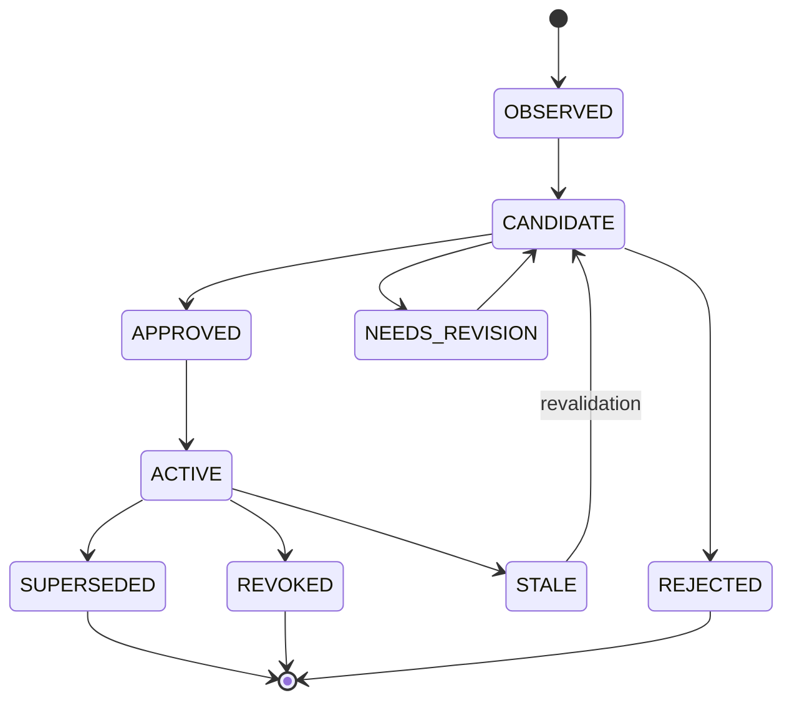

# Memory 机制详细设计

> 本文是 Signal、Candidate、Review、Revision、Revoke、Control Pack 与 Outcome 的权威设计。Memory 不是聊天存档，也不是 Evidence 的替代品。

## 1. 业务问题、产物与非目标

Memory 解决的是跨运行复用稳定偏好、约束、工作方式和经审核事实的问题。它的最终产物不是一段永久文本，而是一个可追溯、可版本化、可撤销、按运行类型编译的 Control Pack。Chat、Research 和 Artifact 只读取当前有效 Revision 中与当前 Scope、预算和任务相关的条目。

Memory 的非目标：

- 不保存全部聊天并自动塞回 Prompt。
- 不把 Source、Research Evidence 或 Wiki 页面复制成第二份事实真源。
- 不把相似度高等同于可信、可见或仍然有效。
- 不允许模型根据一次结果直接改写长期记忆。
- 不承诺召回更多就能提升回答质量或降低 Token 成本。

## 2. 当前事实与目标边界

`[当前实现]` 迁移包含两代数据模型：`memory_signal`、`memory_candidate`、`memory_outcome`、`memory_usage_log` 等候选与反馈结构；`memory_object`、`memory_version`、`memory_review_decision` 等对象与审核结构；`V080` 创建 `memory_item`、`memory_runtime_revision`、`memory_event` 等 canonical runtime，`V082` 将 Compiler 切换到该运行时。当前最高迁移基线为 `V104`。

`[当前实现]` `/api/v2/workspaces/{workspaceId}/memory` 下提供 Signal、Promotion、Chat/Artifact/Research Control Pack、Shadow Recall、Observation、Review、Revision Review、Object Version、Revoke、Outcome 和 Review Decision 等能力；Runtime Inspector 提供 Workspace 级检查面。

`[当前实现]` 编译结果缓存默认开启，TTL 180 秒、Jitter 30 秒。它们是配置事实，不是撤销传播 SLO；撤销不能只等待 TTL 自然过期。

`[当前实现]` 测试覆盖 Workspace 归属、Signal/Promotion、审核、Revision、Revoke、Control Pack 与运行类型等契约。没有本轮新执行结果时，只能说明存在测试保护，不能声称当前分支零失败。

`[目标设计]` Memory 将审核后的条目、编译策略、运行 Revision、Release Bundle 和使用 Outcome 形成闭环，并把缓存、检索与向量表示保持为可重建投影。

## 3. Evidence 与 Memory 的信任域

| 维度 | Evidence | Memory |
|---|---|---|
| 目的 | 支撑某个 Claim，允许读者回到来源验证 | 约束或辅助后续运行 |
| 典型内容 | Quote、Source Snapshot、网页归档、定位信息 | 用户偏好、稳定约束、经审核事实、工作方式 |
| 真源关系 | 绑定不可变 Source/External Snapshot | 绑定 Signal 来源和审核 Revision，不复制来源真相 |
| 时效性 | 由来源版本、抓取时间和引用状态决定 | 由 Valid From/To、TTL、冲突和 Revoke 决定 |
| 使用门槛 | Claim 必须有合适 Evidence 支撑 | 只有当前有效且 Scope 匹配的条目可编译 |
| 失败后果 | 事实不可验证或引用错误 | 错误长期污染后续运行 |

Memory 可以记住“用户希望报告先给结论”，但不能把一次 Research 生成的结论无审核地记成事实。需要复用的事实应保存对 Source/Wiki/Evidence 的稳定引用与版本条件；引用失效时 Memory 条目进入 `STALE` 或待复核，而不是继续把旧文本注入上下文。

## 4. 领域模型与不变量

| 对象 | 含义 | 核心不变量 |
|---|---|---|
| Signal | 用户明确输入、纠正、执行观察或系统事件 | 带 Workspace、Actor、Source、时间与去重键 |
| Candidate | 从 Signal 抽取的待审核条目 | 不得直接进入正式 Control Pack |
| Review Decision | 批准、拒绝、要求修订或标记冲突 | 绑定 Candidate/Revision、Policy Version 和 Reviewer |
| Memory Item | 稳定逻辑身份 | 内容变化不覆盖历史 Version |
| Memory Version | 某次有效内容、Scope、有效期和来源绑定 | 不可变，存在明确 Head |
| Runtime Revision | 某一时刻可用 Memory 集合及编译策略版本 | 可重放、确定性、单调递增 |
| Control Pack | 面向一次 Chat/Research/Artifact Run 的编译结果 | 绑定 Revision、Scope、预算和 Digest |
| Usage Log | 哪条 Memory 被哪个 Run 采用 | 仅记录标识与摘要，不泄露敏感内容 |
| Outcome | 采用、修改、忽略、冲突、负反馈等结果 | 只生成新 Signal，不直接篡改 Memory |
| Revoke Event | 撤销、过期、删除或 ACL 变化 | 触发新 Revision 与投影失效 |

MySQL 是条目、Version、Review、Revision、Revoke 和 Outcome 的业务真源。向量索引、全文索引、Compiled Pack Cache 和统计副本都是投影。投影损坏时可以从 MySQL 重建；投影内容与当前 Revision 或 ACL 不一致时，读取路径必须拒绝旧结果。

## 5. 从初版到受控闭环

| 阶段 | 简单方案 | Bad Case | 修复与新问题 |
|---|---|---|---|
| V0 会话拼接 | 把历史对话截断后放入 Prompt | Token 膨胀、旧错误反复出现、跨任务噪声 | 分离 Conversation/Checkpoint 与长期 Memory |
| V1 自动摘要 | 定期生成一段用户画像 | 摘要覆盖细节，错误无法定位或撤销 | 引入 Signal、Candidate 与稳定 Item ID |
| V2 自动写入 | 模型抽取事实后直接保存 | Prompt Injection、误抽取和一次性偏好长期污染 | 加入策略、人工/规则 Review 和敏感字段门禁 |
| V3 版本化 | Item/Version、冲突与有效期 | 召回结果仍可能跨运行类型或越权 | 引入 Scope、Runtime Revision 与类型化 Control Pack |
| V4 反馈闭环 | 记录 Usage 与 Outcome | 系统若自动学习可能形成错误强化 | Outcome 只生成新 Candidate，重新走审核 |
| V5 确定性编译 | Bundle 固定 Revision、策略、Token 预算与排序 | Cache 和索引撤销传播有延迟 | Revoke Event、读时校验、主动失效与对账 |

## 6. 生命周期与状态机

### 6.1 正常路径

1. 用户明确保存、纠正反馈、Run Observation 或系统治理事件形成 Signal。
2. Extractor 生成结构化 Candidate，带来源、类型、Scope、置信度、敏感级别与有效期建议。
3. 策略先做去重、冲突、敏感字段、Workspace 与来源可信度检查，再进入人工或规则 Review。
4. 批准后创建或追加 Memory Version，Compiler 生成新的 Runtime Revision。
5. Run 创建时按类型、权限、有效期、相关性和 Token 预算编译 Control Pack，并固化 Digest。
6. Run 结束记录 Usage 与 Outcome。Outcome 若提示错误或冲突，只生成新 Candidate。

### 6.2 异常与恢复

| 异常 | 处理 | 恢复条件 |
|---|---|---|
| 重复 Signal | 以来源 ID、规范化内容摘要和时间窗去重 | 返回已有 Signal/Candidate，不重复审核 |
| 同一事实冲突 | 标记 `CONFLICTED`，同时保留来源与时间 | Reviewer 决定替换、并存、缩小 Scope 或拒绝 |
| Review 并发 | 使用 Candidate/Item Version 条件更新 | 失败方重新读取新 Head，不覆盖先提交结果 |
| Compiler 中断 | Revision 在单事务或两阶段 Manifest 下发布 | 未完成 Revision 不成为 Active Head |
| 缓存命中旧 Pack | 校验 Revision、ACL Epoch 和 Revoke Watermark | 主动失效并重新编译 |
| Source 删除或 ACL 变化 | 发布 Tombstone/Revoke Event | 所有引用条目转为 Stale/Revoke，索引和 Cache 对账完成 |
| Outcome 写入失败 | Run 结果不回滚，Outcome 走独立 Outbox 重试 | 幂等写入后进入候选队列 |
| 编译策略故障 | 保留上一稳定 Revision，停止发布新 Pack | 固定回放通过且灰度窗口回到基线 |

## 7. 候选、审核与污染防护

### 7.1 哪些内容可以进入 Candidate

高价值 Signal 包括用户明确偏好、反复稳定的格式要求、用户纠正、持续目标、Workspace 治理约束和经验证事实的引用。低价值或高风险输入包括临时情绪、模型推测、第三方网页指令、认证材料、完整隐私原文、一次性任务细节和无法定位来源的结论。

候选策略同时考虑：明确性、稳定性、未来复用价值、来源可信度、敏感级别、冲突、时效和可撤销性。置信度只用于排队和辅助审核，不赋予写入权限。

### 7.2 污染防线

1. 网页、附件、Tool Output 和模型中间文本默认不能创建用户长期 Memory。
2. 直接 Prompt Injection 与间接 Prompt Injection 在抽取前后都做规则和模型双通道检测。
3. 密钥、Token、Cookie、身份证明、支付信息和高敏原文拒绝进入 Candidate、Prompt、Trace 与 Baggage。
4. 跨 Workspace 候选即使文本相同也不能合并；去重键必须包含 Workspace 和 Owner Scope。
5. 自动批准只适用于低风险、用户明确、Schema 可确定性验证的偏好，策略服务故障时 Fail Closed。
6. Memory 不授予工具权限。即使条目记录“允许导出”，执行时仍由服务端重新鉴权与审批。
7. Negative Outcome、用户纠正和 Evidence 失效触发复核，不允许系统自行把新答案覆盖成真相。

## 8. 确定性 Control Pack 编译

Compiler 的输入为 `workspace_id`、`user_id`、运行类型、对象 Scope、Runtime Revision、ACL Epoch、任务查询、Token 预算、策略版本和 Release Bundle。相同输入必须生成相同条目顺序、裁剪结果和 Digest。

编译顺序：

1. 只读取 Active Head，排除 Rejected、Revoked、Expired、Stale 与 Superseded。
2. 应用 Workspace、用户、运行类型、对象和敏感级别过滤。
3. 先加入小型强约束，再对候选做相关性、时效、置信度和冲突惩罚排序。
4. 对同一逻辑 Item 只保留当前有效 Version，对互斥条目拒绝自动并存。
5. 按确定性 Token 估算裁剪，输出 Item ID、Version、来源摘要与使用限制。
6. 写入 Compiled Pack Cache，Key 包含 Revision、ACL Epoch、Run Type、Query Digest 与 Policy Version。

Shadow Recall 使用同一候选集生成对照 Pack，但不进入正式 Prompt，只记录离线比较数据。这样可以评估新召回或排序策略，而不把实验结果直接暴露给用户。

## 9. 撤销、删除与传播

撤销分三类：运行时撤销使新 Run 立即不可见；合规删除清理允许删除的正文与投影；审计保留只保存最小化 ID、摘要、时间和决策，不保留可恢复敏感内容。

`[目标设计]` Revoke 事务更新 Item/Version 状态并写 Outbox。消费者主动失效 Compiled Pack Cache、全文/向量索引、Memory 评测副本和下游候选；Read Path 同时校验 Revoke Watermark，防止事件延迟期间读到旧 Pack。Source 删除、权限变化或 Evidence 失效通过依赖关系触发相同流程。

撤销传播完成的判据不是“发出事件”，而是：MySQL Head 不可见、Cache Key 失效、索引文档删除或版本落后被拒绝、评测副本清理、对账无残留。旧 Run 为审计可保留当时的 Item ID/Version/Digest，但后续回放必须显示该条目已撤销，不能重新注入正文。

## 10. 参数与调优

| 参数 | 当前事实或目标初值 | 推导与失败模式 |
|---|---|---|
| Compiled Pack Cache TTL/Jitter | `[当前实现]` 180/30 秒 | 只减轻读负载；TTL 过长扩大陈旧窗口，撤销仍需主动失效与读时水位校验 |
| Candidate 阈值 | `[目标设计]` 不设跨类型统一值 | 在偏好、事实引用、约束等类型上分别用 Precision-Recall 和人工成本选择 |
| 自动批准 | `[目标设计]` 仅低风险明确偏好，默认关闭 | 开启前要求危险错误注入率和撤销残留率达到门槛 |
| Control Pack 预算 | `[目标设计]` 占模型输入预算的固定上限并按 Run Type 分配 | 过小遗漏关键约束，过大挤压 Evidence 与任务输入 |
| 撤销传播 | `[目标设计]` 以能力 SLO 定义，不用 Cache TTL 代替 | 超阈值停止自动编译并触发对账；连续一个滞回窗口无残留后恢复 |
| 冲突并存上限 | `[目标设计]` 同一逻辑事实默认 1 个 Active Head | 多时点事实用 Valid From/To 表达，不能靠相似向量随机选一个 |

参数实验记录数据集、Workspace/用户/运行类型切片、Policy/Extractor/Embedding/Reranker/Compiler 版本、Token 预算和观察窗口。Candidate 阈值要同时观察审核通过率、漏记率、错误注入率和人工审核量，不能只优化接受率。

## 11. 指标、测试、灰度与回滚

完整指标契约见 [评测指标报告](./测试与评测/NoteWeave-评测指标报告.md)。Memory 至少关注：Candidate 审核通过率、错误注入率、撤销残留率、冲突发现率、Control Pack 命中率、有效采用率、人工修改率、负反馈率、编译确定性、编译 P95/P99、Pack Token 占用和单位有效记忆成本。

测试体系：

- 领域与属性测试：状态机合法转移、去重、版本单调、同输入同 Digest、已撤销条目永不进入新 Pack。
- Repository/数据库集成：并发 Review、Revision 发布、Revoke Outbox、ACL Epoch 与读时校验。
- 契约测试：Chat/Artifact/Research Control Pack 的 Scope 与 Schema 隔离。
- 固定回放：Candidate 抽取、冲突处理、排序、预算裁剪和 Shadow Recall 对照。
- 安全红队：恶意 Source、间接 Prompt Injection、敏感字段、跨 Workspace 文本碰撞和工具授权诱导。
- 故障注入：Compiler Kill、Cache/Redis 故障、Outbox 延迟、索引删除失败和乱序 Revoke。
- E2E：创建 Signal、审核、Revision、使用记录、纠正、撤销和 Inspector 验证。

`[生产待验证]` 候选阈值、人工成本、用户采纳、长期污染、知识新鲜度和真实 Token 收益必须在真实用户与持续时间窗中验证。灰度按 Workspace Allowlist 和 Policy Version 进行，先 Shadow Recall，再只读提示，最后才允许低风险自动批准。回滚将新 Compiler 停止发布、恢复旧策略与稳定 Revision；已产生的新 Version 不删除，只停止成为 Active Head。

## 12. 技术取舍与迁移条件

- 不用 LangGraph Checkpoint 代替 Memory：Checkpoint 解决单线程运行恢复，缺少跨运行审核、Scope、有效期与撤销。
- 不直接接入黑盒自动记忆服务：可以借鉴抽取、去重和搜索，但对象级 ACL、Evidence 绑定、Revision 与审计必须留在 NoteWeave 控制面。
- 不以向量数据库作为 Memory 真源：相似度不能表达 Head、冲突、撤销、权限和确定性编译；向量仅是可重建召回投影。
- 不默认建立完整时间知识图谱：关系查询和有效期复杂到平面 Item 难以表达，且图投影收益在固定回放中明确时再引入；MySQL 仍保存治理真源。
- 不把所有 Memory 常驻 Prompt：只允许小型稳定约束进入固定 Pack，其余按任务召回，降低 Token 成本与越权面。

## 13. 面试入口

面试主回答与追问见 [Context 与 Memory 一体化手册](./简历亮点八股/34-Context与Memory一体化面试手册.md)。

## 14. 行业参考

`[行业参考]` Mem0 提供提取、更新、删除与 Scope 搜索思路；Zep 强调时间变化和失效；LangGraph Persistence 适合短期状态与恢复。它们不能证明 NoteWeave 已具备生产效果，也不能替代 Workspace ACL 和审核。详细对照、适用前提与迁移复杂度见 [Memory 业界演化研究](./research/Memory业界演化研究.md)。
