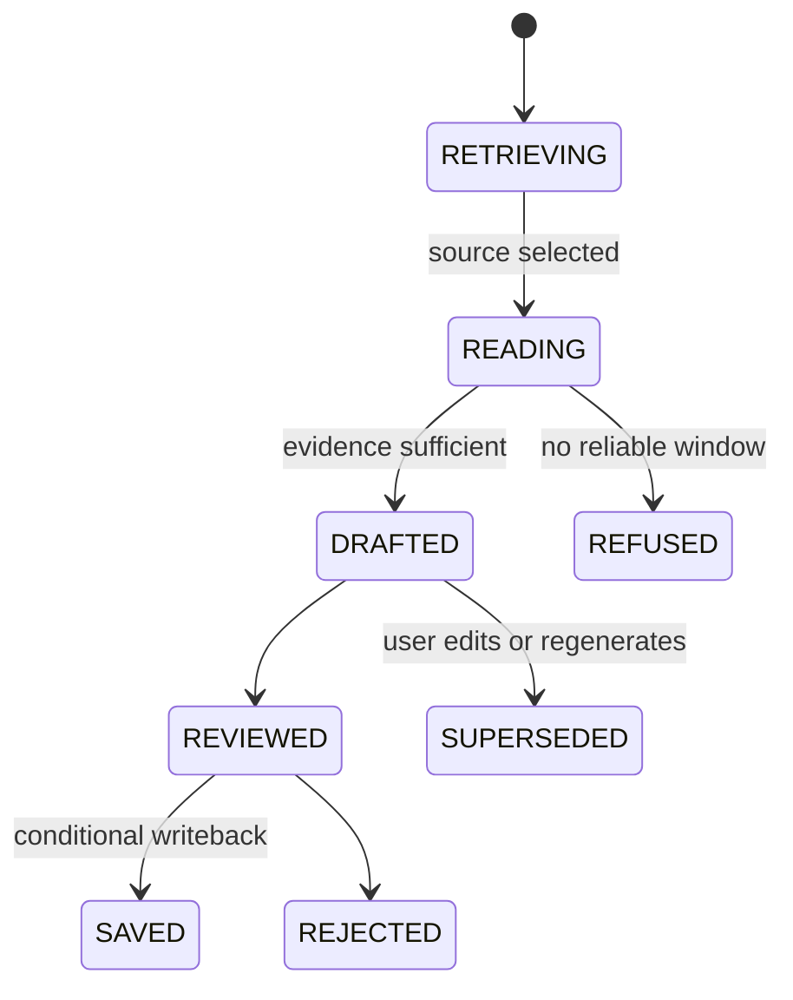

# Note：资料定位、连续阅读与可审阅写回

## 业务问题与非目标

用户整理笔记时通常先想起“一份资料或某个章节”，再需要打开附近原文、组织证据、生成中性草稿并决定是否写回。直接用 Chunk Top K 回答会把不同资料片段混在一起，也会切断标题、段落和上下文。

Note 不自动把所有聊天保存成知识，不替用户发布 Wiki 页面，也不让模型覆盖已有 Source。它的最终产物是带来源、可编辑、可拒绝并能条件写回的新草稿或 Source Version。

## 用户链路

```text
Question / Topic
  -> Source Recall
  -> Anchor Selection
  -> Reading Plan
  -> Continuous Windows
  -> Evidence Bundle
  -> Neutral Draft
  -> User Review
  -> Save as Source / Reject / Edit
```

`[当前实现]` Note 与 QA/Wiki 共用 Conversation/Turn 提交，以 `answer_mode` 选择策略；`NoteRecallRetriever`、`NoteReadingRetriever`、`NoteEvidenceRetriever` 和 `NoteNeutralMarkdownRewriter` 负责召回、阅读窗口、证据和草稿；`ChatController` 提供 Source Draft 与 Save-as-Source 接口。

## 演化与 Bad Case

| 阶段 | 方案 | Bad Case | 修复 |
| --- | --- | --- | --- |
| V0 保存聊天答案 | 一键把 Answer 复制成 Note | 混入对话语气、无原文定位、无法判断谁确认过 | 先生成 Draft，保存前人工审阅 |
| V1 Chunk Top K | 直接取最相关片段 | 多份资料碎片混排，原文上下文断裂 | 先 Source 粗排，再选 Anchor |
| V2 Anchor 单点 | 返回命中 Chunk | 定义在上一段，限定条件在下一段 | 扩展连续 Reading Window |
| V3 全文塞入 Prompt | 选中 Source 后传全部正文 | 大文档超预算，关键信息被稀释 | Reading Plan、窗口角色和字符预算 |
| V4 自动写回 | 模型结果直接覆盖资料 | 并发覆盖、恶意内容和错误事实进入资料池 | 条件写回、新 Version、重新鉴权和幂等键 |
| 目标系统 | Draft、Evidence、Review、Version 和后续投影闭环 | 用户编辑后 Citation 可能失配 | 段落级 Provenance、Diff 和发布校验 |

`[行业参考]` Obsidian 使用文件、标题和 Block 作为可定位链接，并维护反链；Outline 的 Revision History 支持查看差异和非破坏恢复；BookStack 将角色与内容级权限组合。NoteWeave 采用稳定位置、版本和非破坏写回，但不复制这些产品的文件格式或协作模型。

## 数据真源与状态

草稿关联 Conversation Message、AnswerRun、Evidence Manifest、Source/Snapshot 和 Draft Digest。保存后产生新 Source 或 Version；Draft 本身不是资料真源。

`[当前实现]` Note 回答仍走 AnswerRun（`PREPARING -> RETRIEVING -> GENERATING -> FINALIZING`）。下图是资料定位到写回的产品语义，不是另一套数据库状态枚举。



`[目标设计]` 用户编辑 Draft 后生成新的 Draft Revision，并重新计算 Claim-Citation Mapping。保存绑定精确 Draft Revision、Source Target、Expected Version 和 Idempotency Key。

## 两阶段检索

### Source Recall

第一阶段按标题、标签、摘要、生成来源、Metadata、关键词与可选语义信号对 Source 排序。Source 必须属于 Workspace、当前可见、具有可读 Snapshot，并优先选择 Window 已就绪的版本。

`[当前实现]` Source 候选最多取 8；Rerank 前最多 40，Rerank Top N 16；Tag 解析最多 8；Relation Graph 使用标签等关系扩展。当前数值是实现配置，不是最佳值。

### Anchor 与 Reading Window

第二阶段只在选中的 Source 内定位 Anchor，再按 Reading Role 扩展前后窗口。窗口按 Source/Snapshot、Chunk No、Window No 和 Location 保持顺序；不同 Source 之间不拼接成假连续正文。

`[当前实现]` Reading Window 候选最多 24，Rerank 后最多 8。候选记录 `read_role`、`anchor_window_no` 和 `read_objective`，用于区分命中、定义、条件和上下文。

`[目标设计]` Window Planner 根据标题边界、段落、列表、表格和 Token Budget 调整范围。需要跨 Source 对比时，先保持每个 Source 内连续，再在 Evidence Bundle 层并列，不做字符级交错。

## 正常、异常与恢复

正常情况下，Turn 固化输入和 Note Retrieval Plan，Source Recall 返回候选，批量校验 Ownership 后构建 Reading Plan；Window Retriever 按 Anchor 取连续原文，Evidence Selection 去重并保留位置；生成器输出中性草稿和 Citation；用户修改或确认后，写回接口重新检查 Message、Workspace、Draft Revision 和目标版本。

异常路径：

- Source 命中但 Window 未就绪，返回明确降级或等待状态，不用摘要冒充原文。
- Rerank 关闭时保留确定性排序并记录降级，不把它算作 Rerank 成功。
- Relation Expansion 只提供候选，最终仍做 Workspace/版本校验和预算限制。
- 草稿生成成功但保存超时，客户端按 Idempotency Key 查询，不重复创建 Source。
- 目标 Source 在审阅期间产生新版本，Expected Version 不匹配时返回冲突，让用户比较后另建版本。
- 原 Source 被删除或权限收回，未保存 Draft 失去发布资格；历史 Draft 保留受控审计摘要。
- SSE 断线从 AnswerRun 事件恢复，Draft 保存结果从 MySQL 查询。

恢复时复用冻结的 Source/Snapshot/Window 与生成 Receipt。未确认的模型结果不进入 Draft Revision；写回属于独立事务，不因 AnswerRun 完成自动重试。

## 幂等、并发、缓存与安全

Source Recall 和 Reading Window 使用同一 Run Snapshot，防止前后阶段看到不同版本。批量 Hydration 的 SQL 带 Workspace；缓存 Key 包含 Workspace、ACL Version、Source Catalog Version 和 Snapshot。

保存操作的唯一边界是 Draft Revision + Target + Operation Type。相同摘要重复请求返回原 Version；不同摘要使用同一键返回冲突。模型只能提出“保存这个 Draft”的意图，服务端按当前用户重新校验，不能使用生成时权限替代执行时权限。

恶意 Source 中的 Prompt Injection 只能作为 Evidence 文本。System Prompt 明确区分指令与引用内容；Draft Validator 阻止工具命令、隐藏元数据和未授权链接进入写回。高风险写回需要人工确认。

## 参数与失败模式

| 参数 | 初值来源 | 过小 | 过大 | 主要观察 |
| --- | --- | --- | --- | --- |
| Source Top K | `[当前实现]` 8 | 正确资料漏召回 | 跨资料噪声和窗口成本 | Source Hit@K、P95 |
| Source Rerank 40/16 | `[当前实现]` | 精排前漏掉候选 | Provider 成本上升 | Hit@K、Rerank P99、成本 |
| Window Candidate 24 | `[当前实现]` | 定义/限定条件缺失 | 近重复和内存增加 | Window Recall、候选字符 |
| Window Top N 8 | `[当前实现]` | 连续性不足 | Prompt 稀释 | Continuity、Citation Completeness、Claim-Evidence Coverage |
| 前后窗口半径 | `[目标设计]` 按结构推导 | 断上下文 | 引入无关章节 | Window Continuity、Precision |
| Draft 字符/Token 预算 | `[目标设计]` 按产物规格 | 关键证据缺失 | 成本和编辑负担 | Adoption、Edit Rate、Cost |

调优固定 Source Snapshot、Query Set、Parser、Window Schema、Rerank Model 和 Prompt。停止条件包括 Scope Violation、Source Hit 明显回退、Window Continuity 下降、Citation Accuracy 下降或 P99/成本超预算。恢复需固定回放与 Shadow 流量同时通过，并保留滞回窗口。

## 指标

| 指标 | 分子 / 分母 | 说明 |
| --- | --- | --- |
| Source Hit@K | Top K 包含 Gold Source 的 Query / 全部 Gold Query | 粗排能否找到资料 |
| Anchor Accuracy | Anchor 位于标注范围的 Query / 有 Anchor 标注 Query | 定位正确性 |
| Reading Window Continuity | 完整覆盖标注连续区间的返回 / 有窗口标注样本 | 是否保留上下文 |
| Citation Accuracy / Completeness | 与 QA 同一口径：分别判断引用是否支撑绑定 Claim、应引用 Claim 是否至少有一个有效引用 | 草稿的引用准确性与责任完整性 |
| Claim-Evidence Coverage | 被完整 Evidence 支持的原子 Claim / 全部可核验原子 Claim | 防止“有引用但证据只支持半句话” |
| Draft Adoption Rate | 被用户保存的 Draft / 展示给用户的 Draft | 需要真实用户 |
| Human Edit Rate | 保存前发生实质编辑的 Draft / 已保存 Draft | 高低都需结合质量解释 |
| Takeover Rate | 用户放弃生成并手工完成 / 启动 Note 任务 | 识别工作流失效 |
| Writeback Conflict Rate | 版本冲突写回 / 写回尝试 | 并发与审阅时长信号 |

所有指标记录时间窗、Dataset、Bundle、文件类型、长度、语言、Workspace 风险和数据来源。Adoption、Edit、Takeover 属于 `[生产待验证]`，不能用测试点击代替。

## 为什么不复用 QA 或 Wiki 策略

QA 以最小证据集合回答一个问题，Note 以 Source 和连续原文支持阅读与草稿；Wiki 以当前页面版本和链接关系支持知识导航。共用 Chunk 索引与 Evidence DTO 可以减少实现重复，但排序目标、预算和产物不同。

不直接用全文加载，因为长资料成本和 Lost-in-the-middle 不可控；不直接用 GraphRAG，因为 Note 的首要问题是 Source/Window 连续性；不自动写 Memory，因为未经审阅的草稿会污染后续上下文。

## 测试、灰度与回滚

- Source Rank、Relation Expansion、Reading Planner 和 Window Rerank 单测。
- Workspace、Snapshot、Window 顺序和版本冲突集成测试。
- 固定长文回放覆盖定义在前、限定在后、表格跨窗口、同名 Source 与错误标签。
- Prompt Injection 红队验证恶意 Source 不能触发工具或绕过写回审批。
- Playwright E2E 走真实上传、Note 回答、Citation、编辑和 Save-as-Source。
- 灰度按 Note Strategy Bundle 分配新 Run；写回 Schema 变化先双读，回滚不删除新 Draft Revision。

`[当前实现]` Note Reading、Rerank、Conversation Context、Draft 与 Save-as-Source 测试提供当前验证面。

`[生产待验证]` 长期用户编辑/采纳、协同编辑、离线同步和复杂格式窗口质量仍需真实使用数据。

## 面试入口

面试主回答与追问见 [场景化 RAG 一体化手册](./简历亮点八股/31-场景化RAG一体化面试手册.md)。
