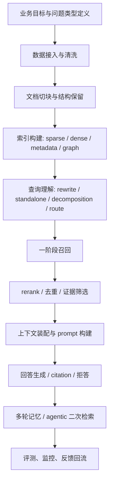

# RAG 全流程知识讲解与设计指南

更新时间：2026-06-07

## 1. 这份文档想解决什么问题

很多人提到 RAG，脑子里只有一句话：

```text
切块 -> embedding -> 向量检索 -> 拼到 prompt -> 让模型回答
```

这个理解对入门够用，但对真正设计系统远远不够。真实的 RAG 不是一个点，而是一条链路；每个环节都可以有不同设计，每种设计背后都有适用前提、收益和代价。

这份文档不追求“讲几个名词”，而是按 RAG 的不同环节，把下面这些问题讲清楚：

- 这个环节为什么存在
- 常见有哪些做法
- 不同做法分别适合什么场景
- 为什么大厂产品会把某些能力做成标配
- 哪些是论文里常见但工程里不一定划算的
- 什么时候不该硬套传统向量 RAG

文档以 2026-06-07 之前可查到的资料为准，综合论文与业界产品实践来整理。用户最早给的 [linux.do 讨论帖](https://linux.do/t/topic/2187051/16) 里的很多观点，会在文中被吸收进更完整的流程框架里。

---

## 2. 先建立一个正确心智模型

### 2.1 RAG 不是“检索增强生成”，而是“检索系统 + 上下文装配 + 受约束生成”

如果把 RAG 只理解成“把搜到的文本塞给模型”，就很容易陷入两个误区：

- 误区一：把所有问题都交给向量检索
- 误区二：把所有优化都交给模型能力

更准确地说，RAG 做的是三件事：

1. 从外部知识中找到候选证据。
2. 把候选证据压缩成模型真正能用的上下文。
3. 让模型在这些证据约束下回答，并尽量可解释、可追溯。

这三件事分别对应不同的工程问题：

- 找不找得到
- 找到的东西是不是对的
- 找对了之后模型会不会用

### 2.2 一个更完整的 RAG 流程图



如果只做中间的一小段，例如“只做向量召回”，那通常不是完整 RAG，而只是 RAG 里的一个检索组件。

---

## 3. 第零步：先定义你到底要解决什么问题

这是最容易被忽略、但决定后面 80% 设计的环节。

### 3.1 不同问题类型，应该走不同检索链

从问题类型上，至少要先区分：

- FAQ 型：问题短、答案短、匹配稳定
- 文档问答型：需要定位某一段说明
- 复杂多跳型：需要跨文档或跨段落拼证据
- 表格/报表型：答案依赖数值、列名、单位
- 代码/日志/配置型：强词面、强路径、强精确匹配
- 关系推理型：依赖实体关系、流程链、依赖链
- 高风险回答型：医疗、法务、金融、合规

如果不做这个分类，后面就很容易把所有问题都送进同一套“向量 top-k”里，最后系统看起来什么都支持，实际上什么都不稳定。

### 3.2 设计 RAG 前最该问的几个问题

- 回答是否必须带引用？
- 错答和漏答哪个代价更高？
- 允许的时延是多少？
- 数据是否频繁变化？
- 是否存在严格权限边界？
- 用户问的是“查事实”，还是“做综合分析”？
- 是否允许系统先澄清、再回答？

例如：

- 客服 FAQ 场景更在意低延迟和稳定命中。
- 合同审查更在意证据闭合和拒答能力。
- 研发代码库问答更适合 `search / grep / open`，不一定适合纯向量库。

### 3.3 为什么大厂产品越来越强调“route”和“agentic retrieval”

现代 RAG 在工程上通常会同时面对这些挑战：

- query understanding
- multi-source data access
- token constraints
- response time expectations

并把“agentic retrieval”作为从传统单查询 RAG 进化出来的方案，强调：

- LLM 做 query planning
- 并行子查询
- structured grounding output

说到底，**先分流，再检索，已经成了主流思路。**

面试里如果被问“为什么现在都在讲 route 和 agentic retrieval”，可以直接答：

- 因为问题类型已经分化得很明显了，单条固定检索链很难同时兼顾 FAQ、文档问答、代码检索、多跳推理和高风险场景，所以系统越来越像“先判断问题类型，再选择检索与执行路径”。

---

## 4. 第一环节：数据接入、清洗与知识建模

很多系统效果差，不是检索差，而是进库前就把知识“弄坏了”。

### 4.1 这个环节在做什么

目标是把原始资料变成“后续可检索、可引用、可更新”的知识对象。

常见数据源包括：

- PDF
- Office 文档
- 网页
- Wiki
- 数据库
- 工单
- 聊天记录
- 代码仓库
- 表格和报表
- 多模态资料

### 4.2 设计这个环节时最重要的几个角度

#### 4.2.1 结构要不要保留

很多人只抽纯文本，但工程上通常还要保留：

- 标题层级
- 页码
- 表格边界
- 代码块边界
- 图表说明
- 来源 URL / 文件路径
- 文档版本
- 时间戳
- 权限标签

原因很简单：

- 检索时这些结构本身就是信号
- 引用回传时需要可定位
- 权限过滤时需要 metadata
- 后续调试时需要 traceability

#### 4.2.2 规范化比“抽文本”更重要

规范化通常包括：

- OCR / layout 解析
- 去模板噪音
- 标题和正文分离
- 表格转结构化文本
- 代码语言识别
- 多语言处理
- 文档去重与版本归并

如果这一步没做好，后面再高级的 retrieval 也只能在脏数据上打补丁。

#### 4.2.3 元数据不是附属品，而是检索的一部分

元数据常见字段：

- 文档类型
- 业务域
- 部门 / 空间 / 项目
- 时间范围
- 作者
- 安全级别
- 语言
- 标签
- 生效版本

在企业知识库里，metadata filtering 通常已经不是可选增强，而是主链路能力；常见做法既包括显式 filter，也包括基于 schema 自动生成过滤条件。


#### 4.2.4 更新策略决定“答案是不是最新的”

企业里一个非常现实的问题是：

- 文档会变
- 制度会更新
- Wiki 会修订
- 数据会过期

所以知识接入不只是“导一次库”，还要设计更新策略。

常见做法：

##### 做法 A：全量重建

优点：

- 简单
- 一致性强

缺点：

- 成本高
- 大库刷新慢

##### 做法 B：增量更新

只重建变化过的文档、chunk 和索引。

优点：

- 成本更可控
- 更适合企业日常运行

缺点：

- 需要更细的版本管理
- 容易出现旧索引残留

##### 做法 C：快照 + 流式补丁

做法：

- 定期做全量快照
- 平时按事件做小更新

优点：

- 兼顾稳定和时效

缺点：

- 架构更复杂

知识更新策略通常要根据数据变更频率来设计：

- incremental updates
- partial updates
- real-time updates
- versioning

### 4.3 这一环节的常见做法

#### 做法 A：纯文本抽取

优点：

- 快
- 简单
- 成本低

缺点：

- 丢结构
- 引用难
- 表格和代码效果差

适合：

- 原型
- FAQ
- 纯段落型知识库

#### 做法 B：布局感知解析

优点：

- 保留章节、段落、页码、表格边界
- 更适合 citation
- 后续 chunking 更稳

缺点：

- 成本更高
- 解析链更复杂

很多成熟系统都会提供基于 Document Layout 的结构化 chunking 管道。

#### 做法 C：领域建模后再入库

比如把原始内容先转为：

- FAQ 对
- 条款对象
- API endpoint 对象
- 代码 symbol / file / function 对象
- 图谱实体和关系

优点：

- 检索目标更稳定
- 便于 route
- 可做结构化回答

缺点：

- 建模成本高
- 泛化差

适合：

- 合同
- 制度
- API 文档
- 故障知识库

### 4.4 工程判断

如果你的系统：

- 需要 citation
- 需要权限过滤
- 需要后续评测
- 需要处理表格或复杂文档

那数据接入绝不能只停留在“抽出一坨文本”。

---

## 5. 第二环节：Chunking，也就是切块

chunking 是 RAG 里最容易被简化成“500 tokens + overlap 100”的环节，但它其实是高杠杆位。

### 5.1 为什么一定要切块

因为：

- embedding 模型有上下文窗口
- 检索通常在 chunk 级别发生
- 模型最终可用上下文有限
- citation 通常也回到 chunk 或其父对象

切块的本质，是把“大文档”转换成“适合被检索和被引用的证据单元”。

### 5.2 chunk 到底应该服务谁

这是 chunking 的核心问题。一个 chunk 同时要服务三件事：

- 检索：要容易被搜到
- 生成：要能单独讲明白
- 引用：要能回到原文位置

这三者经常冲突。

例如：

- 切太小：容易命中，但上下文不完整
- 切太大：语义完整，但 embedding 被稀释，召回不精确

判断一个 chunk 切得好不好，可以先问自己一句：

- 如果一段 chunk 脱离上下文后，人还能看懂，它通常也更适合模型使用

### 5.3 常见切块方式

#### 5.3.1 固定长度切块

做法：

- 每 N tokens 一块
- 配 overlap

优点：

- 简单
- 吞吐高
- 易实现

缺点：

- 常把句子、段落、表格切坏
- 与文档结构无关

适合：

- 原型
- 结构比较松散的连续文本

#### 5.3.2 按段落 / 标题 / layout 切块

做法：

- 以文档结构为边界
- 在结构块内再做 token 约束

优点：

- 更符合语义边界
- 更适合 citation
- 更适合后续文内导航

缺点：

- 解析链更复杂
- 对解析质量依赖高

业界常见的 layout-aware chunking、semantic chunking、hierarchical chunking，本质上都在往这条路靠。

#### 5.3.3 层级切块

做法：

- 子块用于检索
- 父块用于提供上下文

优点：

- 兼顾小粒度匹配和大粒度阅读
- 对复杂长文档很有用

缺点：

- 索引更复杂
- 返回数量可能和请求数量不一致

层级切块的典型做法是：系统先检索 child chunk，再在返回时替换为 parent chunk，以提供更完整上下文。

#### 5.3.4 语义切块

做法：

- 让模型或规则识别语义断点
- 保持语义连贯单元

优点：

- 更自然
- 往往比固定切块更适合检索

缺点：

- 计算成本更高
- 参数不容易拍脑袋定

#### 5.3.5 不切块

有些资料根本不适合切。

例如：

- 本来就很短的文档
- 单页 FAQ
- 单条制度摘要
- 强结构对象

有些系统甚至会明确支持 `NONE`，但同时提醒：

- 如果不切块，可能失去页码级引用与相关 metadata 行为

这也说明“不切块”不是偷懒，而是一种明确设计。

### 5.4 2026 年这块最重要的新认识

[Adaptive Chunking, 2026-03-26](https://arxiv.org/abs/2603.25333) 的核心结论非常值得记住：

- chunking 不是固定参数选择题
- 应该按文档特征动态选择切块策略

这跟企业产品路线非常一致：

- layout-aware chunking
- fixed / hierarchical / semantic / none 这类多策略切块
- chunk 本身即使切得合理，也可能“失去局部上下文”

### 5.5 chunking 的几个设计视角

#### 视角一：按文档类型切

- 法规 / 合同：按条款或标题层级切
- API 文档：按接口或方法切
- 论文：按章节、段落、图表说明切
- 表格：按表格整体或行组切
- 代码：按文件、类、函数或 symbol 切

#### 视角二：按回答粒度切

如果用户问题通常只需要一句答案，就不要把 3000 tokens 大段塞进一个 chunk。

#### 视角三：按引用需要切

如果系统必须“指出答案出自第几页第几段”，切块就必须尽量稳定映射原文位置。

#### 视角四：按后续检索方式切

- 纯向量检索偏好语义闭合块
- BM25 偏好词项密度清晰块
- parent-child 检索偏好双层块

### 5.6 一个非常实用的判断

chunking 没有“最佳默认值”，只有“是否适合当前知识形态”。

所以工程上更靠谱的做法是：

- 先按文档类型分流
- 给不同类型设置不同 chunk policy
- 再用评测集验证

如果面试官追问“chunking 为什么重要”，一句话可以先讲成：

- 因为 chunk 就是系统的最小证据单元，切得不对，后面的 embedding、召回、rerank、引用几乎都会一起受影响。

---

## 6. 第三环节：索引与表示层设计

切块之后，不代表就可以直接搜了。你还得决定：这些知识到底以什么形式被索引和检索。

### 6.1 稀疏索引：BM25 / lexical retrieval

优点：

- 对专有名词、编号、错误码、条款号很强
- 易解释
- 低时延

缺点：

- 对语义改写不敏感
- 同义表达覆盖差

非常适合：

- 法规
- 医疗术语
- 报表指标
- 代码符号
- 日志
- 工单编号

一个很典型的例子是：像 `TS-999` 这种错误码，BM25 经常比 embedding 更可靠。

### 6.2 稠密索引：embedding / vector retrieval

优点：

- 对近义表达、语义相似问题更好
- 对自然语言问题更友好

缺点：

- 可能错过精确词面
- 解释性弱
- 对 chunk 质量很敏感

#### 6.2.1 选 embedding，不只是看榜单

工程上至少要看这些维度：

- 领域适配：通用模型还是医学、金融、代码专用模型
- 多语言能力
- 向量维度
- 成本和吞吐
- 延迟
- 是否支持长输入
- 是否方便版本迁移

很多团队只关注“哪个 embedding 分数更高”，但企业里更实际的问题常常是：

- 模型升级后老向量怎么办
- 维度变化后索引怎么迁移
- 是否需要双索引灰度切换

所以 embedding 模型、向量维度、索引 schema 最好绑定版本。

### 6.3 混合索引：hybrid retrieval

这是今天最主流也最稳妥的生产方案。

原因不是“看起来高级”，而是 sparse 和 dense 恰好互补：

- sparse 负责精确命中
- dense 负责语义扩展
- metadata filter 负责收缩空间

如果把这些系统放在一起看，会发现大家最后都走到了这个方向：

- hybrid + semantic ranking
- hybrid search + RRF
- contextual BM25 + contextual embeddings 联用


### 6.4 元数据索引

很多企业系统真正“救命”的不是更强 embedding，而是更强 metadata。

例如：

- 只搜当前租户
- 只搜当前项目
- 只搜 2025 年后的制度
- 只搜生效版本
- 只搜英文资料

如果没有 metadata filter，语义搜得再准，也可能返回“不该给当前用户看的东西”。

### 6.5 标题、摘要、sample question 索引

这是一个很有价值、但很多入门资料不太强调的点。

这里可以顺手记一个很实用的优化思路：

- 为每个 chunk 生成 sample question
- 检索时让用户问题去匹配“这个 chunk 最擅长回答什么问题”

这个思路很强，因为它让检索从“找相似文本”更接近“找会回答这个问题的证据”。

### 6.6 上下文化索引：Contextual Embeddings / Contextual BM25

上下文化检索真正有启发的地方在于：

- 不是只切 chunk
- 还要把 chunk 所属文档、章节、上下文，浓缩成对该 chunk 的说明，再一起参与 embedding 和 BM25

这个做法解决的问题是：

- 小 chunk 在脱离原文后可能不自解释

所以你可以把它理解为：

- “不是重写 query，而是重写 chunk”

### 6.7 图谱索引：GraphRAG

当问题依赖“关系”时，图谱层就不是锦上添花，而是检索主干。

适合：

- 组织架构
- 供应链关系
- 系统依赖
- 法律条款引用关系
- 故障传播链
- 实体别名和多跳关系

不适合：

- 单纯 FAQ
- 普通说明文档
- 弱连接知识

2026 年企业侧也在把 GraphRAG 产品化：

- 托管化的 GraphRAG 能力
- 图数据库与向量检索结合的架构


### 6.8 这一环节的核心判断

不是“向量库要不要上”，而是：

- 这类知识最该以什么信号被找回来？

常见答案可能是：

- 词项
- 语义
- metadata
- 章节结构
- 父子层级
- 图关系
- 文件路径

如果面试里被问“索引设计你们怎么想”，可以先用一句总括：

- 我们不是先问要不要上向量库，而是先问这类知识最该靠什么信号被找回来，然后再决定是 sparse、dense、metadata、graph，还是它们的组合。

---

## 7. 第四环节：查询理解与查询改写

用户的问题，通常不是一个“可以直接检索”的问题。

### 7.1 为什么要做 query understanding

因为用户会这样问：

- “它这个限制现在还在吗？”
- “上次那个报错怎么处理来着？”
- “帮我看下 2025 新版规范里这里有没有改”

这些问题至少可能存在：

- 指代不清
- 依赖上文
- 术语不匹配
- 范围没说清
- 需要拆成多个子问题

### 7.2 这个环节常见做法

#### 7.2.1 standalone 化

把多轮对话中的省略问法改写成独立可检索问题。

例如：

```text
原问题：那它现在支持吗？
standalone：现代 RAG 里，agentic retrieval 是否已经成为被广泛推荐的方案？
```

多轮 RAG 场景里，这一步几乎是刚需。

[MTRAG-UN, 2026-02-26](https://arxiv.org/abs/2602.23184) 也说明了多轮 RAG 的开放难点之一，就是很多问题本身并不是 standalone。

#### 7.2.2 query rewrite

把用户问题改写成更适合检索的表述。

这又分两种：

- 可读性改写：去歧义、补全主语、规范术语
- 检索导向改写：为了更容易召回证据而改写

2026 年更值得关注的是后者。

[HCQR, 2026-03-19](https://arxiv.org/abs/2603.19008) 的思想是：

- 不只生成“更通顺”的问题
- 而是生成更有助于找支持证据、区分竞争答案、验证细节的查询

#### 7.2.3 query expansion / multi-query

做法：

- 为原问题生成多个不同表述
- 并行检索后融合

优点：

- 提升 recall

缺点：

- 增加成本和噪音

而且并不是所有场景都值。[From BM25 to Corrective RAG, 2026-04-02](https://arxiv.org/abs/2604.01733) 就显示，在金融文本和表格问答里，multi-query 和 HyDE 不一定稳定占优。

#### 7.2.4 query decomposition

把复杂问题拆成多个子问题。

例如：

```text
“比较 A 和 B 在权限模型、索引刷新和 RAG 评测上的差异”
```

可以拆成三路：

- A/B 的权限模型
- A/B 的索引刷新
- A/B 的评测体系

这类 agentic retrieval 的典型方向是：LLM 先规划 subqueries，再并行执行。

#### 7.2.5 route

查询路由，意思是决定：

- 该搜哪个知识库
- 该走哪种检索器
- 该不该直接调用工具而不是向量搜索

这是今天非常重要的设计点。

### 7.3 什么时候应该澄清，而不是硬搜

如果问题存在下面几种情况，强行检索通常不划算：

- 指代对象不明确
- 时间范围不明确
- 候选对象太多
- 问的是主观判断，但语料只支持客观事实

好的 RAG 不只是“能答”，还要知道什么时候该先问一句。

### 7.4 什么时候应该生成 metadata filter

这是很多企业系统非常实用的一步。

例如用户问：

- “2025 年后的合同模板”
- “财务部的采购制度”
- “仅限华东区域的 SOP”

这时 query understanding 的目标，不只是改写句子，而是生成：

- 时间 filter
- 部门 filter
- 地域 filter

更进一步的做法是让模型基于 metadata schema 自动生成过滤条件。

### 7.5 这一环节最重要的工程结论

- query rewrite 的目标不是句子好看，而是证据更好找
- 多轮问题先 standalone 化
- 复杂问题先拆再查
- 有明确约束时优先生成 filter
- 信息不够时要允许澄清或拒答

面试里这一段可以很快概括成：

- query rewrite 不是把问题改得更好看，而是把问题改得更适合检索；如果问题本身不完整，就先 standalone、拆解、加 filter，必要时先澄清。

---

## 8. 第五环节：一阶段召回

一阶段召回的目标不是“把答案直接找全”，而是“高召回地找到一批值得进一步判断的候选证据”。

### 8.1 常见召回方式

#### 8.1.1 BM25 / keyword search

适合：

- 专业名词
- 编号
- 产品名
- 错误码
- API 名

#### 8.1.2 dense vector search

适合：

- 自然语言表达差异较大
- 用户问题和文档措辞不一致
- 需要语义泛化

#### 8.1.3 hybrid retrieval

最常见方案。

常见融合方法：

- 加权融合
- RRF
- 先 union 再 rerank

很多混合检索系统会直接把 RRF 的 `alpha` 这类参数开放出来，说明它已经是生产级能力。

#### 8.1.4 title / summary / sample-question retrieval

有时先搜标题、摘要、预生成问题，比直接搜正文更稳。

#### 8.1.5 parent-child retrieval

先用子块命中，再回到父块。

#### 8.1.6 graph retrieval

通过实体和关系找证据，而不是只靠文本相似度。

### 8.2 top-k 怎么想

不是越大越好。

太小：

- recall 不够

太大：

- rerank 成本上升
- prompt 被噪音挤满

一阶段 top-k 的本质是给二阶段和上下文装配“留多少候选空间”。

### 8.3 为什么很多团队最终都回到 hybrid

因为只靠 single-mode retrieval 很难兼顾：

- 术语精度
- 语义泛化
- 复杂文档结构

2026 年的公开资料依旧强烈支持这件事：

- hybrid + semantic ranker
- hybrid + RRF + reranking
- contextual embeddings + contextual BM25
- 金融文本 benchmark：hybrid + rerank 最稳

### 8.4 什么时候纯向量很容易翻车

- 错误码 / 单号 / 零件号
- 具体条款编号
- 精确数值
- 表头或列名
- 文件路径
- 代码 symbol

这也是为什么 linux.do 讨论里强调：

- `grep`
- 关键词检索
- 路径导航

并不是“低级方案”，而是更贴合问题结构的方案。

### 8.5 一阶段召回的好坏怎么判断

看它有没有把“正确证据”放进候选集合，而不是看最终答案好不好。

因为一阶段召回本来就不是最终判官。

---

## 9. 第六环节：rerank、去重和证据筛选

很多 RAG 真正的质量跃迁，发生在这里。

### 9.1 为什么需要 rerank

因为一阶段召回往往偏 recall 导向，结果里会有：

- 主题相关但不回答问题的片段
- 来自同一文档的重复片段
- 只在词面上相似的噪音

rerank 的作用，是从“可能相关”中找出“真正最有用”的证据。

### 9.2 两阶段检索为什么是主流

这件事拆开看，其实就是一个很朴素的工程逻辑：

- retriever 快
- reranker 准

所以工程上通常：

1. 先用快的方法从大库里捞一批候选
2. 再用慢但准的方法精排

### 9.3 常见 rerank 方式

#### 9.3.1 cross-encoder / semantic reranker

输入：

- query
- candidate chunk

输出：

- 更精细的 relevance score

优点：

- 通常比 bi-encoder 更准

缺点：

- 慢

很多产品化系统都已经把这类能力做成标准组件。


#### 9.3.2 utility-aware rerank

这类方法的目标不是“看起来相关”，而是“对最终回答有没有用”。

[LURE-RAG, 2026-01-27](https://arxiv.org/abs/2601.19535) 非常典型。

这个方向比传统 relevance-only rerank 更贴近真实 RAG 目标。

#### 9.3.3 LLM rerank

直接让大模型判断哪些证据最值得保留。

优点：

- 某些复杂任务效果很好

缺点：

- 更贵
- 更慢
- 结果稳定性依赖模型

工程上也常把 ranking API 和 LLM reranker 区分成两种不同延迟和成本级别的能力。

### 9.4 rerank 之后不该立刻结束

真实系统里，通常还要做几步证据后处理：

- 去重
- 相邻 chunk 合并
- 同文档限流
- 多样性控制
- 长度裁剪
- 父块替换子块

这是因为：

- 你不是要“最相似的十段”
- 你要“最能支持回答的一组证据”

### 9.5 一个常见误区

很多人以为：

```text
rerank = 让顺序更好一点
```

其实更准确地说：

```text
rerank = 决定哪些证据能进入最终上下文
```

这对最终回答质量影响非常大。

如果面试官问“rerank 的价值到底是什么”，可以直接说：

- 一阶段召回解决的是别漏，rerank 解决的是别乱，真正进入 prompt 的证据质量往往主要靠 rerank 决定。

---

## 10. 第七环节：上下文装配与 Prompt 构建

检索结束，不代表 RAG 结束。很多系统明明搜对了，但模型还是答不好，问题常出在上下文装配。

### 10.1 这个环节到底在做什么

把证据变成模型能消费的输入。

包括：

- 证据顺序
- 证据格式
- 是否带标题
- 是否带来源
- 是否带页码
- 是否带 chunk 摘要
- 是否分组
- 是否先压缩再送模型

### 10.2 常见装配方式

#### 10.2.1 平铺拼接

最简单：

```text
[Chunk1]
[Chunk2]
[Chunk3]
```

优点：

- 实现简单

缺点：

- 容易乱
- 模型不容易知道每段作用

#### 10.2.2 带结构标签拼接

例如：

```text
来源：制度A，第12页，章节 3.2
内容：...
```

优点：

- 模型更容易理解来源
- 后续 citation 更稳定

#### 10.2.3 按文档分组拼接

适合：

- 同一文档内多段证据
- 需要保留局部上下文

#### 10.2.4 先压缩、再回答

两步：

1. 先让模型或规则把大量候选证据压成摘要
2. 再基于摘要回答

适合：

- 多文档综合
- 超长上下文

缺点：

- 引入额外压缩误差

### 10.3 这里最常见的几个设计问题

#### 问题一：上下文顺序怎么排

常见方式：

- 按 rerank 分数
- 按文档归组
- 按时间顺序
- 按主证据 / 辅证据分层

#### 问题二：需要带原文还是摘要

- 原文更忠实
- 摘要更省 token

#### 问题三：同一文档多段要不要合并

如果问题需要连续语义，合并更好。

如果问题只需命中局部术语，不合并更好。

#### 问题四：证据中要不要带 metadata

通常应该带至少这些：

- title
- source
- page / section
- date / version

### 10.4 Prompt 的目标是什么

不是让模型“尽量会答”，而是让模型：

- 只基于证据回答
- 证据不足时说不足
- 给出引用
- 尽量不要把外部常识和内部知识混在一起

这决定了提示词里常见的约束包括：

- 仅根据给定资料回答
- 不确定时明确说明
- 引用来源编号
- 回答后附证据

面试里如果被问“prompt 在 RAG 里起什么作用”，可以直接讲：

- prompt 在这里不是为了炫技巧，而是把模型锁回证据边界里，让它知道该怎么使用上下文、什么时候拒答、怎么输出引用。

---

## 11. 第八环节：回答生成、引用、拒答与后处理

RAG 的终点不是“生成一段文字”，而是“生成一个可信回答对象”。

### 11.1 这个环节通常应该输出什么

不要只输出：

- answer_text

更完整的输出通常包括：

- answer
- citations
- supporting chunks
- confidence / groundedness signal
- insufficiency reason
- retrieval trace id

### 11.2 为什么 citation 很重要

citation 的作用不是“好看”，而是：

- 让用户验证
- 让系统可审计
- 让评测可回溯
- 让失败样本可调优

成熟知识库系统通常会把 citation/page metadata 作为体验的一部分；如果选择 no chunking，某些页码级引用能力往往会受影响。

### 11.3 拒答能力为什么是 RAG 的一部分

很多系统把拒答看成模型安全问题，但实际上它首先是检索问题：

- 没找到证据
- 找到的证据互相矛盾
- 问题超出知识边界
- 检索到的是相关话题，不是答案证据

如果系统没有“证据不足时停止”的能力，RAG 最后会退化成“带一点检索外观的幻觉生成”。

### 11.4 回答后的常见后处理

- 引用编号对齐
- 答案格式标准化
- groundedness / consistency 检查
- 敏感信息过滤
- 答案摘要
- 人类可读化

### 11.5 一个特别实用的原则

对企业场景，宁可：

- 少答一点
- 慢一点
- 多带一点证据

也不要：

- 流畅但不受约束地胡答

如果面试里被问“你们更在意什么”，一句话就够：

- 企业 RAG 里我们通常优先保真实性、可追溯性和拒答能力，而不是优先保回答听起来很顺。

---

## 12. 第九环节：多轮对话、记忆与 Agentic RAG

这部分是 2025-2026 很明显的演进方向。

### 12.1 为什么固定单轮 RAG 越来越不够

因为真实问题常常不是：

```text
问一次 -> 查一次 -> 回一次
```

而是：

```text
先理解问题 -> 查第一个入口 -> 文内定位 -> 继续查 -> 再决定回答
```

### 12.2 Agentic RAG 在做什么

它通常给模型开放的是一组检索工具，而不是一个单一 retrieval API：

- search
- find
- open
- browse section
- summarize document
- compare evidence

[AgenticRAG, 2026-05-07](https://arxiv.org/abs/2605.05538) 的一个关键结论是：

- 从 single-shot retrieval 变成 tool-using retrieval，是收益最大的变化之一

### 12.3 为什么代码、日志、文件系统更适合 agentic 工具链

因为这类知识的天然结构不是“语义块集合”，而是：

- 目录树
- 文件路径
- symbol 引用关系
- 调用链
- 报错行
- stack trace

此时更自然的动作是：

- 搜文件名
- 搜关键字
- 打开目标文件
- 在局部上下文里继续查

而不是先把整个仓库切成几百万个 embedding chunk。

[Coding Agents are Effective Long-Context Processors, 2026-03-20](https://arxiv.org/abs/2603.20432) 和 linux.do 讨论里关于 `grep`、文件树导航的直觉，本质上是同一件事。

### 12.4 Agentic 不等于后端一定更重

[Rethinking Agentic RAG, 2026-05-26](https://arxiv.org/abs/2605.27123) 提出的观点很值得记住：

- 可以让 LLM 负责逻辑检索意图表达
- 后端提供轻量、可控的索引和操作接口

这意味着“agentic”不一定是“堆更多复杂服务”，也可能是：

- 把检索能力拆成可调用的原子工具

### 12.5 多轮记忆与 RAG 的关系

多轮系统通常至少要有：

- 近期消息记忆
- standalone 化
- 可选的长期用户偏好
- 会话级检索 trace

但要注意：

- memory 不等于 retrieval
- 用户偏好不应该污染事实知识检索

所以通常会把：

- 会话记忆
- 长期记忆
- 外部知识库

分成不同层。

### 12.6 工程上怎么优化上下文记忆

这一块很容易被说成一句空话：

```text
给系统加 memory
```

但工程上真正要解决的是四个问题：

- 记什么
- 什么时候写
- 什么时候读
- 怎么在不爆 token 和不引入脏记忆的前提下保持连续性

#### 12.6.1 先分层，不要把所有“记忆”放进一个桶里

最稳妥的做法通常是分层：

##### 第一层：短期会话记忆

内容：

- 最近几轮对话
- 当前任务状态
- 当前工具调用结果
- 当前草稿和中间结论

特点：

- 生命周期短
- 更新频繁
- 更像运行时状态，而不是长期知识

##### 第二层：会话摘要记忆

内容：

- 这个会话前面已经确认过什么
- 当前目标是什么
- 已做过哪些尝试
- 哪些约束已经被用户明确要求

特点：

- 用来替代“把全部历史消息原样塞回去”
- 是长会话控 token 的核心手段

##### 第三层：长期用户记忆

内容：

- 用户稳定偏好
- 用户长期项目背景
- 用户常用术语映射
- 用户经常重复的格式要求

特点：

- 跨会话存在
- 不应该混入瞬时任务细节

##### 第四层：工作空间 / 组织级记忆

内容：

- 团队约定
- 组织政策
- 项目规范
- 常见流程

特点：

- 通常需要更强权限控制
- 很多场景下应尽量只读

一种很清晰的分层方式是：短期记忆是 thread-scoped state，长期记忆是跨线程 store；并且支持后台 consolidation，把近期对话归并为更稳定的长期记忆。

#### 12.6.2 记忆不应该“每轮都写”

这是最常见的工程错误之一。

如果每轮都写长期记忆，通常会带来：

- 噪音过多
- 互相矛盾的记忆
- 瞬时情绪或临时要求被误当成长期偏好
- 存储膨胀

更合理的 write policy 是“有门槛地写”。

适合写入长期记忆的内容：

- 明确且稳定的用户偏好
- 经过确认的事实
- 跨会话仍然有价值的项目背景
- 反复出现的业务规则

不适合直接写入长期记忆的内容：

- 一次性闲聊
- 尚未确认的猜测
- 可能很快过时的中间状态
- 涉及隐私但未明确允许持久化的内容

一个实用策略是把写入动作分成三类：

- `must_write`：明确、稳定、跨会话高价值
- `maybe_write`：先进入候选池，稍后 consolidation
- `drop`：只保留在当前会话，不持久化

#### 12.6.3 会话越长，越要从“原文记忆”切到“摘要记忆”

长会话里，最贵的不是生成，而是反复把很长的历史上下文重新送进模型。

典型做法有三种：

##### 做法 A：滑动窗口

只保留最近 N 轮。

优点：

- 简单
- 快

缺点：

- 早期重要决策容易丢

##### 做法 B：滚动摘要

保留最近几轮原始消息，同时把更早内容压成摘要。

优点：

- 在成本和连续性之间平衡得最好

缺点：

- 摘要质量会影响后续回答

##### 做法 C：结构化状态

不是总结成自由文本，而是维护结构化字段，比如：

- 当前目标
- 已确认约束
- 已完成步骤
- 待办事项
- 风险点

优点：

- 可控性强
- 适合 agent 工作流

缺点：

- 设计成本高

很多工程系统最后会把 B 和 C 结合：

- 原始近邻对话保留若干轮
- 更早消息转摘要
- 关键任务状态单独结构化保存

#### 12.6.4 优化上下文记忆的核心，不是“塞更多”，而是“只塞最该塞的”

每次请求都应该做 memory selection，而不是无脑全量注入。

一个比较稳的 read policy 通常同时考虑：

- recency：最近是否提过
- salience：对当前任务是否关键
- scope：是线程级、用户级，还是组织级
- trust：这条记忆置信度如何
- freshness：是否已经过时

例如：

- 当前任务状态优先读取线程级记忆
- 用户格式偏好读取用户级记忆
- 合规规则读取组织级只读记忆

不应该把这些不同层的记忆无差别混在一起。

#### 12.6.5 记忆也要做检索，而不是全量加载

很多人把“memory”理解成把一堆历史文本直接塞回 prompt，但当记忆量变大后，更合理的做法是：

- 对长期记忆建立单独索引
- 按 query / task 检索相关记忆
- 再把检索到的少量记忆注入上下文

这其实就是“memory RAG”。

适合做检索的长期记忆包括：

- 用户偏好
- 过往方案经验
- 常见故障模式
- 历史任务结论

不太适合检索式读取的则是：

- 当前回合 scratchpad
- 尚未完成的中间工具状态

#### 12.6.6 工程上怎么避免记忆污染

记忆一旦污染，比普通检索错召回更麻烦，因为它会持续影响后续会话。

常见治理办法：

##### 做法 A：给记忆打来源和时间戳

至少保存：

- 来源会话
- 写入时间
- 写入原因
- 最后确认时间

##### 做法 B：引入置信度和可覆盖规则

例如：

- 用户显式更正 > 旧记忆
- 更新时间新的 > 更新时间旧的
- 组织规则 > 用户偏好

##### 做法 C：区分只读记忆与可写记忆

这点在组织级政策和团队规范上尤其重要。

这里有个很重要的治理原则：organization memory 往往应该是 read-only，不然共享记忆很容易被误写，甚至被 prompt injection 污染。

#### 12.6.7 上下文记忆优化，本质上也是 token 和延迟优化

记忆工程和成本优化其实是同一件事。

典型手段包括：

- 静态系统提示前置，动态内容后置
- 会话历史摘要化
- 工具结果只保留关键字段
- 大块证据二次压缩
- 重复 instructions 通过缓存复用

这块近两年一个特别实用的方向是 prompt / context caching。

这块可以记一个很实用的原则：

- 把静态、重复度高的内容放在 prompt 前缀
- 把变化内容放在后面
- 这样更容易命中 prompt cache，降低时延和输入成本

另一个常见方向是 context caching，把长而稳定的上下文缓存起来，避免每次都重复发送。

这意味着在工程上，比较好的 prompt 结构往往是：

1. 稳定前缀
2. 相对稳定的工具说明 / 规则
3. 变化较慢的会话摘要
4. 当前用户问题
5. 当前动态检索结果

而不是每次都把所有部分重新打乱拼接。

#### 12.6.8 后台 consolidation 往往比“热路径即写即总结”更稳

很多系统一开始喜欢在主请求里同步做：

- 总结
- 写记忆
- 归并旧记忆

这样会带来两个问题：

- 主链路时延上升
- 记忆质量受当前回合噪音影响

更成熟的做法是：

- 主链路只记录事件和候选记忆
- 后台定时或延迟触发 consolidation
- 由专门流程归并、去重、纠错、压缩

有些 agent 框架甚至会把这件事单独做成 background consolidation agent。

这很像数据仓库里的：

- 在线写入
- 离线整理

#### 12.6.9 工程上常用的一套“记忆上下文预算分配法”

工程上还有个很实用的办法，就是给上下文预算做配额，而不是谁内容多谁占满。

例如一条请求的上下文预算可以粗略切成：

- 20%：系统提示和规则
- 20%：短期会话记忆
- 15%：会话摘要 / 任务状态
- 35%：外部检索证据
- 10%：长期记忆与用户偏好

这不是固定标准，但能防止某一类内容把其他关键信息全挤掉。

#### 12.6.10 一套比较稳的上下文记忆工程方案

如果要给出一套实用默认值，可以是：

1. 最近 6-12 轮保留原始消息。
2. 更早消息滚动摘要。
3. 当前任务状态单独结构化保存。
4. 长期记忆分成用户偏好、项目背景、组织规则三层。
5. 长期记忆按需检索，不全量注入。
6. 只对稳定事实和偏好做持久化写回。
7. 使用后台 consolidation 清理和合并记忆。
8. 对系统前缀、规则和稳定摘要使用 prompt/context caching 思路。

如果面试官追问“上下文记忆你们怎么优化”，最短口径可以是：

- 分层存、按需读、有门槛写、长会话做摘要、长期记忆做检索、稳定前缀做缓存，这样才能同时控制连续性、成本和污染风险。

### 12.7 上下文记忆相关的常见面试点

如果面试官追问“你们怎么做上下文记忆优化”，一个比较完整的回答框架可以是：

#### 回答框架一：从目标说

目标不是让模型“记得越多越好”，而是：

- 保持任务连续性
- 控制 token 成本
- 避免旧信息污染
- 在多轮对话里保住关键约束

#### 回答框架二：从架构说

把记忆拆成：

- 短期线程记忆
- 会话摘要
- 长期用户记忆
- 组织级只读记忆

再分别设计：

- 写入策略
- 读取策略
- TTL / 更新策略

#### 回答框架三：从优化手段说

- 滑动窗口
- 滚动摘要
- 结构化状态
- 长期记忆检索
- prompt caching
- 后台 consolidation

#### 回答框架四：从风险治理说

- 防止错误记忆长期留存
- 防止敏感信息被不该持久化
- 防止用户偏好和事实知识混淆
- 防止组织级共享记忆被误写

#### 回答框架五：从指标说

可以监控：

- 每轮注入 token 数
- 摘要压缩率
- 长期记忆命中率
- 错误记忆纠正率
- 多轮任务成功率
- 延迟和成本变化

这样回答时，就不会只停留在“我们做了 conversation history”这种很浅的层面。

---

## 13. 第十环节：评测、监控与运营

没有评测，RAG 优化基本只能靠体感。

### 13.1 为什么 RAG 特别需要评测

因为失败可以出现在任何环节：

- 数据解析错
- chunking 错
- query rewrite 错
- recall 不够
- rerank 不准
- prompt 装配错
- 模型没按证据用

如果只看最终回答好不好，很难知道问题到底出在哪里。

### 13.2 至少要分成三类指标

#### 13.2.1 检索层指标

- recall@k
- MRR / NDCG
- hit rate
- filter precision

#### 13.2.2 生成层指标

- groundedness
- correctness
- citation accuracy
- refusal quality

#### 13.2.3 系统层指标

- 时延
- 成本
- 超时率
- 空结果率
- 用户反馈率

### 13.3 golden dataset 为什么重要

一个比较成熟的评测集设计，是除了标准答案外，还要带上：

- 问题变体
- metadata
- source links
- question type

这很重要，因为你调优的不只是一个模型，而是一整条链路。

### 13.4 企业里最容易缺的不是模型，而是 trace

最该记录的包括：

- 原始 query
- rewrite 后 query
- route 结果
- filter 条件
- 各路召回结果
- rerank 前后排序
- 最终上下文
- 最终 citation
- 用户反馈

这里有句话很形象：

- 不要等客户先告诉你系统错了

### 13.5 评测不只为了“分数高”

更重要的是支持这些动作：

- 定位哪一环在掉点
- 做 A/B
- 按问题类型分桶
- 找出“错答比漏答更危险”的样本
- 指导 chunking 和 route 策略优化

面试里如果被问“RAG 评测最重要的作用是什么”，可以先答：

- 不是为了出一个总分，而是为了定位到底是数据、切块、召回、排序还是生成出了问题，不然优化基本只能靠猜。

RAG 评测实践里还经常会强调：

- 没有透明、自动化的评测框架，RAG 很容易出现 silent failures

---

## 14. 业界产品化路线反映出的共识

这一节不再按厂商拆着看，而是直接讲这些产品路线最后收敛出来的共同判断。

### 14.1 现在几乎没人把 RAG 简化成“只做向量检索”

现在更常见的做法，是把 RAG 看成一条完整链路，而不是一个向量检索接口。

通常会一起出现的能力包括：

- classic RAG 与 agentic retrieval 两条路线并存
- hybrid retrieval
- semantic ranker / rerank
- layout-aware chunking
- integrated vectorization
- query planning / subquery

翻成更直白的话，就是：

- 检索不是单一路径
- chunking 和 rerank 都是核心能力
- 现代 RAG 需要 route、planning 和多步执行

### 14.2 chunking 已经从“参数配置”变成“策略系统”

今天更像样的系统，通常都会提供一组 chunk policy，而不是只暴露一个固定长度参数。

典型策略包括：

- fixed
- semantic
- hierarchical
- layout-aware
- none

这其实说明了三件事：

- chunking 不是固定参数，而是策略集合
- 不同文档类型通常对应不同切块策略
- metadata 和结构信息会直接参与后续检索

### 14.3 检索通常是多阶段、多信号协同

现在的主流形态已经很少是“单路 top-k”，更多是多阶段检索。

常见组合包括：

- sparse + dense
- metadata filter
- ranking API / LLM reranker
- parent-child / 文档级补全
- graph / logical retrieval 作为补充

如果换个角度理解：

- 多阶段检索是生产默认形态
- ranking 已经是独立能力
- graph 与 vector 会并存，而不是互相替代

### 14.4 记忆、缓存、评测都在逐渐进入主链路

很多成熟系统已经不再把这些能力看作外围增强，而是主系统的一部分。

常见方向包括：

- 会话摘要和长期记忆
- context / prompt caching
- contextual retrieval
- trace
- golden dataset
- retrieval / generation 分层评测

这背后其实就是一个共识：

- 好 RAG 不是只靠检索模型，而是靠整条系统链路。

### 14.5 这些产品化路线最终落到什么共识

把这些路线放在一起看，最后会收敛到几条非常稳定的判断：

- RAG 已经从“向量检索增强生成”演变成“多信号证据系统”
- chunking 都被提升到了产品级能力
- hybrid retrieval 基本是共识
- rerank 已经是主链路，而不是高级选配
- metadata filtering 是企业必需
- agentic / GraphRAG 正在从研究进入产品

如果要把这一节压成一句特别适合面试的话，可以直接说：

- 现在主流系统对 RAG 的理解，已经从“向量检索增强生成”升级成了“多信号检索、分层筛选、受约束生成、可观测可优化”的整链路系统。

---

## 15. 场景化推荐：不同问题适合什么 RAG 流程

### 15.1 FAQ / 客服知识库

推荐：

- 结构化抽取
- 中小 chunk
- sparse + dense hybrid
- 轻量 rerank
- 强 metadata filter

原因：

- 问法变化多，但答案相对固定
- 低延迟要求高

### 15.2 制度 / 合同 / 合规

推荐：

- layout-aware parsing
- 条款级或标题级 chunking
- BM25 + metadata filter + rerank
- citation 强制开启
- 证据不足时拒答

原因：

- 精确性和可追溯性比流畅更重要

### 15.3 表格 / 财报 / 指标问答

推荐：

- 保留表格结构
- 不要过度依赖 multi-query
- 强 lexical / metadata / contextual retrieval
- 必要时先转结构化对象

原因：

- 数值和列名匹配非常关键

### 15.4 代码库 / 日志 / 配置

推荐：

- 文件树 + grep + open
- symbol / path aware retrieval
- agentic navigation
- 可选少量向量检索作入口

原因：

- 强路径、强精确匹配、强局部上下文

### 15.5 多文档综合分析

推荐：

- query decomposition
- hybrid recall
- rerank
- 文档级分组
- 先压缩后生成

原因：

- 目标不是找到一段话，而是综合多处证据

### 15.6 实体关系、多跳链路

推荐：

- graph / logical retrieval
- vector 作为补充

原因：

- 答案来自关系，不只是来自相似文本

---

## 16. 一些常见误区

### 误区一：embedding 模型越强，RAG 就越强

不对。chunking、route、filter、rerank 往往更影响最终效果。

### 误区二：top-k 调大就能解决召回问题

不对。top-k 太大只会把噪音一起放大。

### 误区三：RAG 的主要瓶颈在生成，不在检索

很多时候恰恰相反。模型只是最后一棒，前面证据错了，它再强也没法稳定救。

### 误区四：GraphRAG 更先进，所以默认更好

不对。只有关系结构真的是主信号时，它才值回建设成本。

### 误区五：长上下文模型出来了，就不需要 RAG

不对。长上下文不等于：

- 有最新企业私有知识
- 有权限过滤
- 有引用链
- 有低成本检索

### 误区六：RAG 就等于向量数据库

不对。RAG 是一整条信息获取和上下文控制流程，向量库只是其中一种实现部件。

---

## 17. 把 linux.do 帖子里的观点放回整个流程中

如果把最初那条 [linux.do 讨论](https://linux.do/t/topic/2187051/16) 放回这份流程图里，它最有价值的地方其实不是某个单点结论，而是它抓住了几个非常正确的工程直觉：

- RAG 是链路，不是单点
- query rewrite 很重要
- 向量检索不是万能的
- hybrid 是常态
- rerank 常常最值钱，但也最贵
- GraphRAG 不是默认解
- 企业里常常缺完整评测链
- 趋势正从固定单次 RAG 转向 agentic harness

而 2026 年的资料进一步把这些直觉系统化了：

- query rewrite 要为 retrieval 和 answer utility 服务
- chunking 是高杠杆位
- metadata filtering 是企业级必需
- rerank 是生产主链，不是可选增强
- agentic retrieval 和 logical retrieval 正在进入主舞台

所以可以说，帖子里的直觉是对的，但工程落地时必须把它们拆回每个环节去设计。

---

## 18. RAG 高频八股与回答框架

这一节故意写得更“八股”一点，方便面试、分享和口头表达。

### 18.1 什么是 RAG

最常见的说法是：

RAG 是 Retrieval-Augmented Generation，也就是先从外部知识中检索证据，再把证据装配进模型上下文，让模型在证据约束下生成回答。它解决的核心问题是：模型参数里的知识不够新、不够专、不可控，而业务知识往往在外部系统里。

面试里再补一句会更完整：

- RAG 本质上不是一个模型技巧，而是一条“外部知识获取 + 上下文控制 + 受约束生成”的系统链路。

### 18.2 RAG 和微调的区别

最常见的说法是：

- RAG 主要解决“知识更新”和“证据引用”问题。
- 微调主要解决“输出风格”“任务格式”“行为偏好”问题。

更完整一点：

- 当知识变化快、要引用来源、要权限过滤时，更适合 RAG。
- 当任务模式稳定、知识不需要频繁更新、重点是行为对齐时，更适合微调。
- 很多企业最终是“RAG + 少量微调”并用，而不是二选一。

### 18.3 为什么 RAG 不等于向量数据库

最常见的说法是：

向量库只是 dense retrieval 的一个基础设施，而 RAG 至少还包括：

- 数据清洗
- chunking
- metadata 设计
- query 理解
- hybrid retrieval
- rerank
- 上下文装配
- citation
- 评测

所以“有向量库”不等于“有好 RAG”。

### 18.4 为什么 hybrid retrieval 经常比纯向量更稳

最常见的说法是：

因为 BM25 和 dense retrieval 解决的是不同问题：

- BM25 擅长专有名词、编号、错误码、条款号
- dense 擅长语义相近和表达改写

把两者结合，通常既能保 precision，又能保 recall。

### 18.5 chunking 为什么这么重要

最常见的说法是：

因为检索和引用通常都发生在 chunk 粒度上。chunk 太小会导致语义不完整，chunk 太大又会导致召回不精确、上下文成本高。所以 chunking 实际上是在定义“系统的最小证据单元”。

### 18.6 为什么很多系统加了 RAG 还是幻觉

最常见的说法是：

常见原因不是“模型太笨”，而是：

- 没检索到对的证据
- 检索到了但排序不对
- 上下文装配混乱
- 没有证据不足时拒答
- prompt 没约束模型只基于证据回答

所以 RAG 不是“加检索就自然不会幻觉”。

### 18.7 rerank 的价值是什么

最常见的说法是：

一阶段召回更多是“尽量别漏”，rerank 则负责“把真正有用的证据排到前面”。在很多生产系统里，rerank 是从“能用”到“好用”的关键一步。

### 18.8 metadata filtering 为什么是企业必需

最常见的说法是：

因为企业知识不是一个公共语料池，而是带权限、租户、时间、生效版本、部门边界的。没有 metadata filter，就算语义检索很准，也可能检索到不该返回的内容。

### 18.9 长上下文模型出来后，为什么 RAG 还不会消失

最常见的说法是：

因为长上下文解决的是“模型一次能看更多”，但不自动解决：

- 外部知识实时更新
- 权限控制
- 来源引用
- 成本控制
- 大规模语料快速定位

所以长上下文会改变 RAG 形态，但不会替代 RAG。

### 18.10 GraphRAG 适合什么，不适合什么

最常见的说法是：

GraphRAG 适合关系本身就是答案线索的场景，比如：

- 实体关系
- 依赖链
- 组织结构
- 规则引用链

但对普通 FAQ、一般说明文档、弱关系语料，GraphRAG 往往建设成本大于收益。

### 18.11 RAG 评测最该看什么

最常见的说法是：

至少分三层看：

- 检索层：有没有把正确证据召回
- 生成层：回答是否真的基于证据
- 系统层：延迟、成本、空结果率、用户反馈

如果只看最终回答分数，很难知道是哪一环出了问题。

### 18.12 memory 和 retrieval 的区别是什么

最常见的说法是：

- retrieval 是从外部知识库里找和当前问题相关的证据
- memory 是保存跨轮或跨会话的上下文、偏好和持续状态

最容易出错的地方是把两者混在一起，导致：

- 偏好污染事实
- 历史状态污染当前检索

所以工程上通常会把 memory 和 retrieval 分层管理。

### 18.13 一个面试里很顺手的总结口径

如果要一句话总结：

RAG 的核心不是“让模型多看点资料”，而是把“外部知识获取、证据筛选、上下文控制、受约束回答、可追踪评测”做成一条稳定工程链。

---

## 19. 如果只记住十句话

1. RAG 不是“向量检索 + prompt”，而是一整条证据获取与装配链。
2. 先定义问题类型，再决定检索流程。
3. 脏数据和坏切块，后面很难补救。
4. chunking 的目标是做“可检索、可理解、可引用”的证据单元。
5. sparse 和 dense 不是对立关系，hybrid 才是企业默认值。
6. metadata 不是装饰，而是企业检索的重要主信号。
7. query rewrite 的目标不是句子好看，而是更容易找对证据。
8. rerank 往往是最直接的质量杠杆。
9. 复杂任务越来越适合 agentic、多步、文内导航式 retrieval。
10. 没有评测和 trace，RAG 优化基本靠猜。

---

## 20. 参考资料

### 20.1 讨论帖

- [linux.do: 如何手搓一个 RAG](https://linux.do/t/topic/2187051)
- [用户指定楼层 /16](https://linux.do/t/topic/2187051/16)

### 20.2 企业官方资料

- [Microsoft: Build advanced retrieval-augmented generation systems](https://learn.microsoft.com/en-us/azure/developer/ai/advanced-retrieval-augmented-generation)
- [Azure AI Search: Retrieval-augmented generation overview](https://learn.microsoft.com/en-us/azure/search/retrieval-augmented-generation-overview)
- [Azure AI Search: Hybrid search overview](https://learn.microsoft.com/en-us/azure/search/hybrid-search-overview)
- [Azure AI Search: Semantic ranking overview](https://learn.microsoft.com/en-us/azure/search/semantic-search-overview)
- [Azure AI Search: Chunk and vectorize by document layout](https://learn.microsoft.com/en-us/azure/search/search-how-to-semantic-chunking)
- [Amazon Bedrock: How content chunking works for knowledge bases](https://docs.aws.amazon.com/bedrock/latest/userguide/kb-chunking.html)
- [Amazon Bedrock: Improve relevance with a reranker model](https://docs.aws.amazon.com/bedrock/latest/userguide/rerank.html)
- [Amazon Bedrock: RetrievalFilter API](https://docs.aws.amazon.com/bedrock/latest/APIReference/API_RetrievalFilter.html)
- [Amazon Bedrock: Configure and customize queries and response generation](https://docs.aws.amazon.com/bedrock/latest/userguide/kb-test-config.html)
- [Amazon Bedrock: Build a knowledge base with Neptune GraphRAG](https://docs.aws.amazon.com/bedrock/latest/userguide/knowledge-base-build-graphs.html)
- [Google Cloud: Generative AI with RAG](https://docs.cloud.google.com/architecture/rag-reference-architectures)
- [Google Cloud: About hybrid search](https://docs.cloud.google.com/gemini-enterprise-agent-platform/build/vector-search/about-hybrid-search)
- [Google Cloud: Reranking for Vertex AI RAG Engine](https://docs.cloud.google.com/vertex-ai/generative-ai/docs/rag-engine/retrieval-and-ranking)
- [Google Cloud: Optimizing RAG retrieval](https://cloud.google.com/blog/products/ai-machine-learning/optimizing-rag-retrieval)
- [Google Cloud: GraphRAG infrastructure with Vertex AI and Spanner Graph](https://docs.cloud.google.com/architecture/gen-ai-graphrag-spanner)
- [OpenAI: Prompt caching](https://platform.openai.com/docs/guides/prompt-caching)
- [OpenAI: Latency optimization](https://platform.openai.com/docs/guides/latency-optimization)
- [Google AI for Developers: Context caching](https://ai.google.dev/gemini-api/docs/caching)
- [Anthropic: Contextual Retrieval](https://www.anthropic.com/engineering/contextual-retrieval)
- [Pinecone: Chunking strategies for LLM applications](https://www.pinecone.io/learn/chunking-strategies/)
- [Pinecone: Rerankers and two-stage retrieval](https://www.pinecone.io/learn/series/rag/rerankers/)
- [Pinecone: RAG evaluation](https://www.pinecone.io/learn/series/vector-databases-in-production-for-busy-engineers/rag-evaluation/)
- [LangChain: Memory overview](https://docs.langchain.com/oss/python/concepts/memory)
- [LangChain: Deep Agents long-term memory](https://docs.langchain.com/oss/python/deepagents/long-term-memory)

### 20.3 2026 年重点论文与研究

- [LURE-RAG: Lightweight Utility-driven Reranking for Efficient RAG, 2026-01-27](https://arxiv.org/abs/2601.19535)
- [MTRAG-UN: A Benchmark for Open Challenges in Multi-Turn RAG Conversations, 2026-02-26](https://arxiv.org/abs/2602.23184)
- [Hypothesis-Conditioned Query Rewriting for Decision-Useful Retrieval, 2026-03-19](https://arxiv.org/abs/2603.19008)
- [Coding Agents are Effective Long-Context Processors, 2026-03-20](https://arxiv.org/abs/2603.20432)
- [Graphs RAG at Scale, 2026-03-21](https://arxiv.org/abs/2603.22340)
- [Adaptive Chunking: Optimizing Chunking-Method Selection for RAG, 2026-03-26](https://arxiv.org/abs/2603.25333)
- [Optimizing RAG Rerankers with LLM Feedback via Reinforcement Learning, 2026-04-02](https://arxiv.org/abs/2604.02091)
- [From BM25 to Corrective RAG: Benchmarking Retrieval Strategies for Text-and-Table Documents, 2026-04-02](https://arxiv.org/abs/2604.01733)
- [Multi-Faceted Self-Consistent Preference Alignment for Query Rewriting in Conversational Search, 2026-04-08](https://arxiv.org/abs/2604.06771)
- [AgenticRAG: Agentic Retrieval for Enterprise Knowledge Bases, 2026-05-07](https://arxiv.org/abs/2605.05538)
- [Rethinking Agentic RAG: Toward LLM-Driven Logical Retrieval Beyond Embeddings, 2026-05-26](https://arxiv.org/abs/2605.27123)
- [Improving the Efficiency and Effectiveness of LLM Knowledge Distillation for Conversational Search, 2026-06-03](https://arxiv.org/abs/2606.04650)
