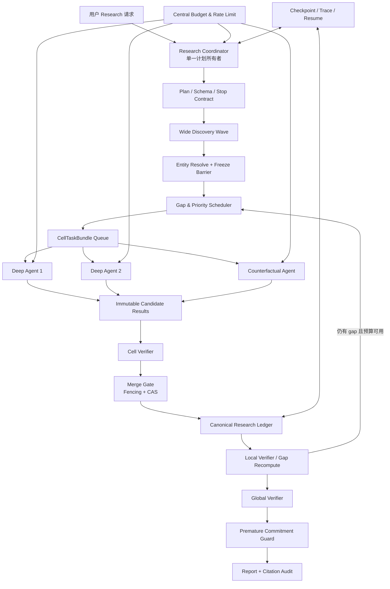
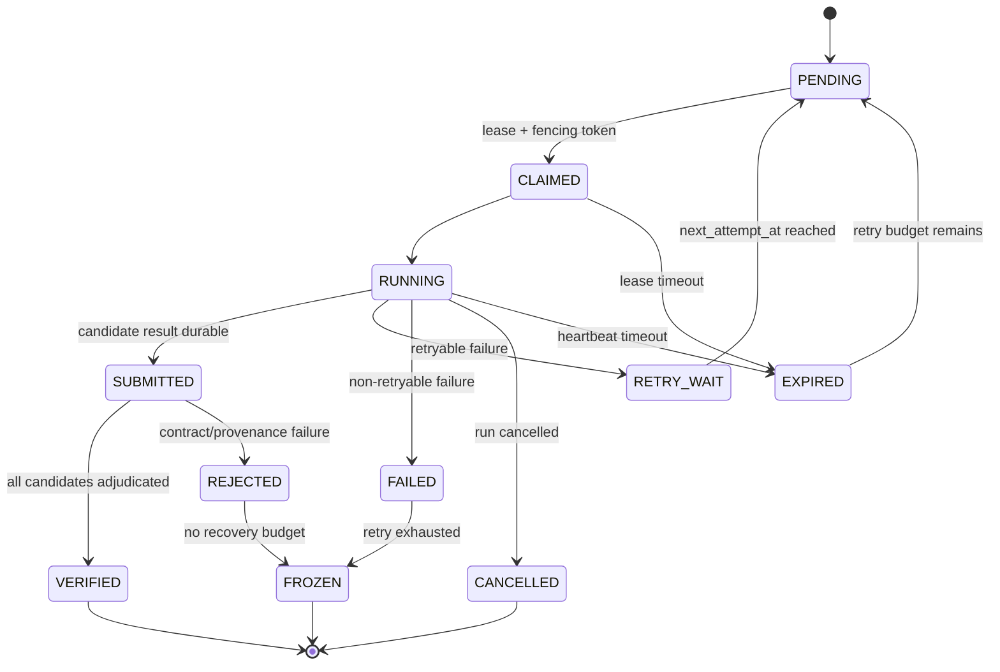

# Research Agent 受控多 Agent 并行架构与改造方案

> 文档状态：CURRENT（MA0-MA6 代码与 deterministic evidence 已完成；真实 Provider A/B 与生产 SLO 待外部证明）  
> 权威等级：L2（现行改造方案）  
> 最后核对日期：2026-07-18
>
> 当前事实基线：`INCREMENTAL_V1` 是自动受控多 Worker 链路的唯一启用条件；创建 Run 会直接初始化 canonical matrix 并进入 Coordinator，不再写旧 `noteweave.research.run` outbox。旧 canary/manual dispatch/双 allowlist 及其死配置已删除，旧 Worker callback 对增量 Run fail-closed。MA4A-J、MA5 分布式 quorum fan-out/blind merge/repair 闭环和 MA6 健康门均已完成 deterministic + MySQL 证据；真实 provider 四轮 A/B 与生产 SLO 尚未证明。
> 适用范围：`workers/research-worker`、Backend Research 持久化/Worker Callback、Kafka、MySQL、Redis 配额与观测链路  
> 参考项目：`reference/Marco-DeepResearch/.../Table-as-Search`、`DeepWideSearch`、`Marco-Agent-DeepResearch`、`reference/MiroFlow`

## 1. 结论先行

NoteWeave 可以引入类似 Table-as-Search 的多 Agent 并行机制，而且现有的 `Table-as-State + Cell/Local/Global Verifier + Adaptive Evidence Horizon + Counterfactual Recovery + Checkpoint/Resume` 比一个纯共享表写入系统更适合构建**受控的并行研究执行面**。

推荐目标不是自由式 Agent 群聊，也不是让多个 Agent 同时修改研究计划和最终状态，而是：

> **Single-Writer Coordinator + Parallel Cell-Task Agents + Immutable Candidate Results + Verifier-Gated CAS Merge**

中文可表述为：

> **单一计划所有者 + 并行字段任务 Agent + 不可变候选结果 + 验证门控原子合并**。

核心边界：

1. `Coordinator` 独占研究意图、schema、entity freeze、plan revision、全局预算和停止决策。
2. Agent 只领取明确的 `CellTaskBundle`，不能修改 schema、创建正式 entity、直接把 cell 标成 VERIFIED 或生成最终报告。
3. Agent 产出不可变 `CandidateResult`，必须包含证据、来源、预算消耗和终止原因。
4. 独立 `Cell Verifier + Merge Gate` 才能把候选合入 canonical ledger。
5. 合并使用 `plan_revision + entity_set_version + cell_version + fencing_token` 做 CAS；过期 Agent 的迟到结果只能进入审计，不能覆盖新状态。
6. Local/Global Verifier、Premature Commitment Guard、Citation Audit 与最终合成继续单点收口。
7. 当前已演进为 Kafka/MySQL lease 驱动的多进程执行；高风险 cell 额外采用两个独立 durable slot，并由服务端盲验汇合。

截至 2026-07-18，本文的架构主链不再只是目标设计：MA4A-J、MA5Q 和 MA6 已落地，正常创建入口也已接入该链路。可复核结果为 Backend MySQL 8.4 Research 聚合 `202 tests, 0 failures, 0 errors, 1 skipped`（环境门控 Redis integration）、LockMatrix `13/13`、Research Worker `361/361`。真实 Provider 凭证仍未配置，因此这些证据只证明契约、并发一致性、恢复、盲验和调度闭环，不证明真实质量、成本或 p95 改善。

当前 Agent completion 的权威证据边界仍是已解析的 workspace source。创建接口与前端会在未选择资料时 fail-fast，避免生成永远无法 citation-gated finalization 的 Run。Search Provider/网页来源虽然在旧工具箱中存在，但尚未进入 v2 原子 completion 的 URL/snapshot authority contract；在完成 SSRF、重定向、内容快照和来源域归一化之前，不把它写成分布式主链已支持能力。

这条路线吸收 TAS 的层级 Agent 与共享表思想、Marco 的预算/上下文治理、MiroFlow 的 Agent 工具权限与轨迹记录，同时保留 NoteWeave 已有的验证优势。

## 2. 为什么要引入，以及不能解决什么

### 2.1 预期收益

适合并行的 Research 任务通常具有以下结构：

- 多个已经冻结的业务实体；
- 每个实体存在多个互相独立的必填字段；
- 不同字段需要不同查询角度或来源；
- 存在需要独立来源验证的冲突字段；
- Search/Fetch/LLM 主要是 I/O 等待，具备并发缩短 wall-clock 的空间。

多 Agent 的主要收益应定义为：

1. **缩短关键路径**：多个独立 cell 不再等待整轮串行完成。
2. **隔离上下文**：每个 Agent 只读取目标实体、目标列、已有证据摘要和任务预算，减少长上下文污染。
3. **角色专业化**：Wide Discovery、Deep Completion、Counterfactual、Verifier 可使用不同模型和策略。
4. **提高独立性**：冲突搜索可以显式排除原来源和原候选，降低自证循环。
5. **更细的恢复粒度**：单个 Agent 超时只重领对应 bundle，不必重跑整轮 Search→Read→Extract。

### 2.2 不能自动保证的收益

多 Agent 不会自动提高答案正确率，也可能带来：

- 重复查询和成本放大；
- 多 Agent 对同一实体/列给出不兼容结果；
- provider 限流导致吞吐反而下降；
- 并发写入覆盖已验证状态；
- 过期任务在 plan replan 后迟到回写；
- 多个进程各自认为预算尚未耗尽；
- trace、checkpoint 和回调乱序；
- 相同来源被误判为“独立证据”。

因此发布判断必须基于顺序/并行 A/B：质量至少不下降，wall-clock 明显改善，成本放大在预算内，且不存在错误合并。

## 3. 参考项目代码核查结论

### 3.1 Table-as-Search 的真实并行语义

TAS 不是简单的“多个 Agent 一起聊天”。其代码体现了三层不同的并行：

| 层次 | 代码事实 | 对 NoteWeave 的启示 |
| --- | --- | --- |
| Main → Managed Agent | Main Agent 配置 `tabular_search_agent` 与 `deep_search_agent`，并设置 `max_tool_threads`；Main prompt 要求候选超过线程数时分批调用 Deep Agent | 以 Coordinator 分批派发 Agent，不把所有 gap 一次性打爆 |
| 单次 Managed Agent 调用 | 每次调用会复制独立 Agent memory/state，避免并发共享上下文；有全局 managed-agent 调用计数 | 每个执行实例必须隔离上下文，预算不能只依赖实例内计数 |
| Agent 内工具链 | Deep Agent prompt 明确 `DONOT parallel call other tools`，要求按 Search→Visit→Batch Update 顺序推进 | Agent 内保持顺序工具链；并行放在 bundle 之间，而不是同一 Agent 内无限 fan-out |
| 共享表 | MongoDB `DBTableCodeTool` 支持并发读写、schema 文档、批量 add/update | NoteWeave 应共享 ledger，但 Agent 不应直接写 canonical cell，应先写 candidate |
| benchmark 批处理 | Batch runner 用线程池并发多个样本；每个样本放独立进程，通过 terminate/kill 实现硬 timeout，并可跳过已完成样本 | “多任务并发”与“单任务内部多 Agent”分开治理；硬隔离可放到后期分布式阶段 |

需要特别指出的参考风险：TAS 的 `MemoryManagedToolCallingAgent` 会为调用创建副本，但实现中临时替换共享 `managed_agents` 字典引用；NoteWeave 不应复制这种依赖共享可变引用的并发方式，应让每个 `AgentExecution` 从工厂获得独立实例。

### 3.2 MiroFlow 的真实边界

MiroFlow 提供：

- Main/Sub-Agent 独立 ToolManager；
- Agent-specific prompt、tool blacklist 与 LLM 配置；
- Sub-Agent 独立会话、turn/tool-call budget、summary 与 trace；
- Agent 被暴露为 Main Agent 可调用工具。

但核查当前 orchestrator 后可以看到，主 Agent 和 Sub-Agent 的多 tool call 仍通过 `for` 循环顺序执行，并非自动 `asyncio.gather` 并发。因此应吸收的是权限隔离、会话隔离和 trace，不应把“async 函数”直接等同于并行执行。

### 3.3 Marco-Agent-DeepResearch 与 DeepWideSearch

- Marco 的 accuracy/efficiency profile、最大 LLM calls、context safety buffer、tool timeout、rollout count 可用于定义不同 Agent profile。
- DeepWideSearch 主要提供 entity/row/column/item、整表 exact success、rollout 与效率评测，不提供 NoteWeave 可直接复制的生产调度器。
- 并行上线必须同时测质量、延迟、token/cost、tool/provider failure，不允许只报告“并发度”。

## 4. NoteWeave 当前能力与并行前置条件

### 4.1 可以直接复用的能力

| 当前能力 | 可作为多 Agent 的控制点 |
| --- | --- |
| `ResearchSchema` 与 `(entity_id, column_key)` | Agent 任务的稳定目标键 |
| Entity Freeze / `entity_set_version` | 防止并发期间候选集合漂移 |
| Evidence Card 精确绑定 | Candidate Result 的事实输入 |
| Cell Verifier 四路判定 | Agent 结果进入 canonical state 的第一道门 |
| Local / Global Verifier | bundle wave 完成后的局部与全局收口 |
| Adaptive Evidence Horizon | task priority、目标窗口数与搜索深度输入 |
| Counterfactual Branch | 独立反证任务模板 |
| Stop Contract / LLM call / wall-clock budget | 调度 admission control 与终止条件 |
| Checkpoint / Resume / callback idempotency | wave 级恢复与投影 |
| Fetch 并发、rate limit、SSRF/injection guard | Agent 工具执行的底层安全能力 |
| 内部 exact-table evaluator | 顺序/并行 A/B 质量回归 |

### 4.2 当前必须先修的并行阻塞点

#### 阻塞 A：Backend 当前是最终快照“删除后重建”

`ResearchRunService.persistClosedLoopState` 当前会依次删除 `research_cell_evidence/source_evidence/research_cell/research_verifier_decision/research_row/research_branch`，然后从完整 result payload 重建。

这适合单 Worker 最终完成回调，但不适合多个 Agent 增量提交。若并行 Agent 复用该路径，会出现最后写入者覆盖其他 Agent 状态。

改造要求：

- Agent candidate 与 execution 必须写独立 append-only 表；
- canonical cell 使用版本化增量 update/CAS；
- 最终 completion 只能做一致性投影和归档，不再删除正在被执行面使用的 canonical 表；
- 旧的 rebuild 路径在兼容期只服务 `SEQUENTIAL_V1` run。

#### 阻塞 B：当前 cell 没有并发版本与 fencing token

`research_cell` 有状态、verdict 和 repair_count，但没有 `version`、`active_task_id`、`last_merge_id`。仅靠唯一 `cell_key` 不能阻止迟到写。

#### 阻塞 C：预算和限流主要是进程内状态

当前 `OpenAICompatibleLlmClient.call_records` 和 `FixedIntervalRateLimiter` 属于单进程对象。多进程 Agent 会各自拥有完整 64-call budget 和独立 RPS，看起来都没有超限，但合计会超限。

改造要求：

- Coordinator 在创建任务前原子预留 run/cell budget；
- Agent 只能使用下发额度；
- completion 根据实际 usage 结算并返还未使用额度；
- provider/workspace/user 级速率限制放 Redis；MySQL budget ledger 是最终审计真源。

#### 阻塞 D：当前 checkpoint 编号以 round 数推导

并行完成顺序不是任务创建顺序，多个 Agent 不能同时用相同 `checkpoint_no` 覆盖。需要从 round checkpoint 演进为单调 `checkpoint_seq`，并在 payload 中保留 `round_no/wave_no/event_seq`。

## 5. 目标架构



### 5.1 控制面和执行面分离

**控制面**：Backend + Coordinator。

- 创建/修订 plan；
- freeze entity set；
- 计算 gap 与 priority；
- 创建 bundle、预留预算、发出命令；
- 维护 lease、wave barrier、deadline 和 cancellation；
- 触发 verifier/merge/global gate；
- 写 checkpoint 和最终 completion。

**执行面**：Agent Executors。

- 根据 role/profile 执行受限 Search→Fetch→Read→Extract；
- 只读取任务允许的 ledger snapshot；
- 只提交 candidate/evidence/usage；
- 不拥有最终状态写权限。

### 5.2 角色定义

#### Research Coordinator

唯一可修改 plan 的角色。建议仍由确定性 Python 控制器承担，LLM 只作为 plan/replan 建议器。

#### Wide Discovery Agent

- 输入：question、schema、query family、source scope、candidate budget；
- 输出：`EntityCandidate + SourceCandidate + evidence hint`；
- 禁止：创建 canonical row；
- 收口：Entity Resolver 统一 canonicalize、dedupe、freeze。

#### Deep Cell Agent

- 输入：一个 `CellTaskBundle`；
- 工具链：顺序 Search→Fetch→Read→Extract；
- 输出：0..N 个 cell candidate；
- 禁止：把 candidate 直接标为 VERIFIED。

#### Counterfactual Agent

- 只处理 CONFLICTED/high-risk cell；
- 必须带 `excluded_source_ids/domains/evidence_ids`；
- 不能读取原结论的自由文本，只读取待验证 proposition 和原证据元数据，降低锚定；
- 新证据必须满足不同来源、新 discovery round 和同一 cell binding。

#### Cell Verifier

独立于生成候选的 Agent/规则模块。输入 candidate + snapshot-grounded evidence，输出四路 verdict；不得执行搜索。

#### Merge Gate

确定性组件。负责 schema/entity/version/fencing/budget/provenance 校验和 CAS，不调用 LLM。

#### Local / Global Verifier

继续沿用当前职责。Global Verifier 只能在 wave barrier 达成后运行，不与同一 wave 的 cell 写入并发。

## 6. 为什么任务粒度应是 CellTaskBundle

如果每个 `(entity,column)` 都启动一个 Agent，会产生严重的重复查询。例如同一论文的 `method/base_model/benchmark/result` 往往可从同一论文页或 README 一次读取。TAS 的 Deep Agent prompt 也强调先收集多个字段，再批量 update。

因此使用：

```text
CellTaskBundle =
  same entity
  + same branch
  + compatible query/source affinity
  + 1..3 target cells
  + one isolated Agent execution
```

默认 bundle 规则：

- 必须是同一 `entity_id + branch_id + plan_revision + entity_set_version`；
- 必填列优先；
- 相同 `source_hint/query_family` 的列聚合；
- 每个 bundle 最多 3 个 cell，避免上下文重新膨胀；
- CONFLICTED cell 单独进入 counterfactual bundle；
- 高风险核心结论默认单 cell + 双候选策略；
- VERIFIED/FROZEN cell 不创建任务，除非出现新冲突证据。

## 7. 核心数据契约

### 7.1 ResearchCellTaskBundle

```json
{
  "task_id": "rct-uuid",
  "research_run_id": "run-uuid",
  "wave_no": 2,
  "role": "DEEP_CELL",
  "entity_id": "entity-miroflow",
  "entity_set_version": 1,
  "plan_revision": 3,
  "branch_id": "branch-main",
  "target_cells": [
    {"cell_id": "entity-miroflow:architecture", "column_key": "architecture", "expected_version": 4},
    {"cell_id": "entity-miroflow:context", "column_key": "context", "expected_version": 2}
  ],
  "query_hints": ["MiroFlow architecture context management official docs"],
  "required_source_types": ["PRIMARY", "OFFICIAL_DOCUMENTATION"],
  "excluded_source_ids": [],
  "excluded_domains": [],
  "existing_evidence_summary": [],
  "budget": {
    "search_calls": 3,
    "fetch_calls": 5,
    "read_windows": 5,
    "llm_calls": 6,
    "input_tokens": 30000,
    "output_tokens": 5000,
    "wall_clock_seconds": 90
  },
  "profile_key": "DEEP_CELL_STANDARD",
  "lease_epoch": 1,
  "fencing_token": 1042,
  "idempotency_key": "run-uuid:wave-2:entity-miroflow:architecture-context:r3"
}
```

### 7.2 AgentExecutionResult

```json
{
  "execution_id": "exec-uuid",
  "task_id": "rct-uuid",
  "lease_epoch": 1,
  "fencing_token": 1042,
  "status": "SUBMITTED",
  "termination_reason": "TASK_CONTRACT_SATISFIED",
  "candidates": [
    {
      "candidate_id": "candidate-uuid",
      "cell_id": "entity-miroflow:architecture",
      "base_cell_version": 4,
      "value": "...",
      "evidence_ids": ["ev-1", "ev-2"],
      "confidence": 0.84,
      "source_diversity": 2,
      "agent_reason": "two independent primary sources"
    }
  ],
  "evidence_cards": [],
  "usage": {
    "search_calls": 2,
    "fetch_calls": 3,
    "llm_calls": 4,
    "input_tokens": 14000,
    "output_tokens": 1800,
    "estimated_cost": 0.0,
    "latency_ms": 31200
  },
  "trace_digest": "sha256..."
}
```

### 7.3 MergeDecision

```json
{
  "merge_id": "merge-uuid",
  "candidate_id": "candidate-uuid",
  "cell_id": "entity-miroflow:architecture",
  "decision": "ACCEPTED",
  "reason_code": "VERIFIED_AND_VERSION_MATCHED",
  "expected_cell_version": 4,
  "result_cell_version": 5,
  "verdict": "SUPPORTS",
  "evidence_ids": ["ev-1", "ev-2"],
  "merged_at": "2026-07-14T00:00:00Z"
}
```

## 8. 状态机

### 8.1 Bundle 状态机



### 8.2 Candidate 状态机

```text
PROPOSED
  -> VERIFYING
  -> ACCEPTED | REJECTED | CONFLICTED | STALE
```

- `STALE_PLAN_REVISION`：任务基于旧 plan；
- `STALE_ENTITY_SET_VERSION`：entity freeze 版本已变化；
- `STALE_CELL_VERSION`：其他 candidate 已先合并；
- `FENCING_TOKEN_EXPIRED`：lease 过期后旧 Agent 迟到；
- `SCHEMA_MISMATCH`：column 不在 schema；
- `PROVENANCE_INVALID`：证据不能回溯 snapshot span/hash；
- `BUDGET_CONTRACT_VIOLATED`：Agent 超出预留额度；
- `VERIFIER_REJECTED`：四路 verifier 非 SUPPORTS。

### 8.3 Wave 与 barrier

一个 wave 是由同一 ledger snapshot 生成的一组 bundle。

Wave terminal 条件：

- 所有 required bundle 进入 `VERIFIED/REJECTED/FROZEN/CANCELLED`；
- 没有 RUNNING/CLAIMED task；
- 所有 SUBMITTED candidate 已形成 MergeDecision；
- 所有 usage 已结算；
- checkpoint 已持久化。

只有 barrier 达成后才能：

- 重新计算 row readiness；
- 运行 Local Verifier；
- 生成下一 wave gap；
- 运行 Global Verifier；
- 修改 plan revision；
- 进入 report synthesis。

## 9. 调度算法

### 9.1 Gap 提取

只对以下 cell 生成任务：

- required 且 `EMPTY/CANDIDATE_READY/NEED_MORE_EVIDENCE`；
- `CONFLICTED`；
- Local/Global Verifier 明确返回 recovery target；
- Evidence Horizon 为 `EXPAND/EXPAND_COUNTERFACTUAL`；
- 非 FROZEN、未达到 retry、仍有全局预算。

### 9.2 Priority Score

推荐使用确定性评分，不让 LLM 决定线程优先级：

```text
priority =
  100 * required
  + 40 * conflict
  + 25 * intent_blocker
  + 20 * (1 - verdict_confidence)
  + 15 * single_source
  + 10 * freshness_risk
  - 12 * repair_count
  - 10 * estimated_cost_ratio
  - 8  * provider_saturation
```

具体权重必须通过 benchmark 调整；首版只要求排序稳定、可解释、可测试。

### 9.3 并发 admission control

同时满足以下条件才派发：

```text
active_run_agents < run_concurrency
active_workspace_agents < workspace_concurrency
active_provider_calls < provider_concurrency
reserved_budget + requested_budget <= run_budget
deadline_remaining >= task_minimum_time
```

建议默认：

| Profile | bundle 并发 | bundle 大小 | 适用场景 |
| --- | ---: | ---: | --- |
| QUICK | 1 | 1–2 | 不引入并行调度成本 |
| STANDARD | 2 | 1–3 | 默认生产配置 |
| DEEP | 4 | 1–3 | 多实体、多字段、预算充足 |
| CONFLICT | 2 | 1 | 主证据与独立反证 |

### 9.4 动态并发

并发度不能只按 CPU 设置。建议每个 wave 根据最近窗口自动降级：

- provider 429/503 增多：并发减半并延长 backoff；
- LLM p95 latency 上升但无错误：保持并发、减少 bundle token budget；
- duplicate query ratio 高：扩大 bundle 或启用同 run 查询缓存；
- stale merge ratio 高：缩小 wave、降低同 cell speculative execution；
- deadline 紧张：只派发 critical path required cells；
- cancellation requested：停止创建新任务，撤销 PENDING，允许 RUNNING cooperative stop。

### 9.5 Coordinator 调度伪代码

```python
while not run_terminal:
    assert_coordinator_lease(run_id)
    snapshot = load_consistent_ledger(run_id)

    if cancellation_requested(snapshot) or deadline_exhausted(snapshot):
        cancel_pending_tasks_and_release_budget(run_id)
        finalize_guarded(snapshot)
        break

    reconcile_expired_tasks_and_submitted_candidates(snapshot)

    if active_wave_exists(snapshot):
        if not wave_barrier_reached(snapshot.active_wave):
            renew_coordinator_lease_and_wait()
            continue
        checkpoint_wave(snapshot.active_wave)
        snapshot = recompute_local_and_global_verifiers(snapshot)

    if stop_contract_satisfied(snapshot):
        synthesize_from_verified_state(snapshot)
        break

    gaps = extract_recovery_gaps(snapshot)
    bundles = build_deterministic_bundles(gaps)
    admitted = reserve_budget_and_apply_concurrency_limits(bundles)

    if not admitted:
        finalize_guarded_or_handoff(snapshot)
        break

    create_wave_tasks_and_outbox_in_one_transaction(admitted)
```

关键要求：

- 每次循环读取同一个 committed snapshot/version，不能一边遍历一边接受 Agent 修改；
- `build_deterministic_bundles` 使用稳定排序和稳定 task key，Coordinator 重启不会生成语义重复任务；
- `reserve_budget` 先于 outbox publish；预算预留失败的 task 不得进入队列；
- wave 创建、task 插入、budget reservation、outbox 插入属于一个数据库事务；
- Coordinator 自身也必须有 lease/CAS，避免两个实例同时创建下一 wave。

## 10. 并发一致性与 Merge Gate

### 10.1 Single-Writer 的准确含义

不是只有一个进程写数据库，而是只有 `Merge Gate` 被授权改变 canonical cell。Agent 可以并发 append candidate/evidence/execution，但不能 update `research_cell.candidate_value/status/verdict`。

### 10.2 CAS 合并条件

候选接受前必须原子验证：

```sql
update research_cell
set candidate_value = ?,
    cell_status = ?,
    verdict = ?,
    evidence_refs_json = ?,
    version = version + 1,
    last_merge_id = ?,
    updated_at = current_timestamp
where id = ?
  and version = ?
  and entity_set_version = ?
  and plan_revision = ?;
```

影响行数为 0 时不得重试覆盖，应重新读取 cell：

- 新值等价且证据可合并：创建 `EVIDENCE_AUGMENTED` merge；
- 新值冲突：candidate 标记 `CONFLICTED`，触发 counterfactual；
- cell 已 VERIFIED 且新候选无新增强证据：`STALE/NO_MARGINAL_GAIN`；
- plan/entity 已变化：`STALE_*`，由 Coordinator 判断是否重建任务。

### 10.3 Fencing token

每次 claim 都分配单调递增 fencing token。即便旧 Agent 在 lease 超时后恢复，它提交的 token 小于当前 task token，Backend 必须拒绝。

不要只检查 `lease_until`：数据库提交时钟与 Agent 本地时钟可能不同，且过期 Agent 可能在新 Agent 已接管后迟到。

### 10.4 同一 cell 的 speculative execution

默认关闭。仅对高风险核心结论启用 `candidate_quorum=2`：

- 两个 Agent 使用独立 execution/context；
- 要求不同 provider/domain 或不同 primary source；
- 两个 Agent 都不能看到对方候选值；
- Verifier 比较后再合并；
- 不能把两个同域转载来源算作独立票。

## 11. 数据库改造建议

新增迁移建议从当前最新版本之后编号，实际施工时以仓库 Flyway 最新版本为准。

### 11.1 扩展 research_run / research_cell

```sql
alter table research_run
    add column execution_mode varchar(32) not null default 'SEQUENTIAL_V1',
    add column coordinator_version int not null default 0,
    add column plan_revision int not null default 0,
    add column active_wave_no int not null default 0,
    add column budget_version int not null default 0;

alter table research_cell
    add column version int not null default 0,
    add column entity_set_version int not null default 0,
    add column plan_revision int not null default 0,
    add column last_merge_id varchar(36) null;
```

### 11.2 research_agent_task

关键字段：

- `id/research_run_id/wave_no/role/entity_id/branch_key`；
- `target_cells_json/query_hints_json/source_policy_json`；
- `plan_revision/entity_set_version`；
- `status/priority/attempt_count/max_attempts/next_attempt_at`；
- `lease_owner/lease_until/lease_epoch/fencing_token`；
- `budget_reservation_id/deadline_at`；
- `idempotency_key` 唯一；
- `created_at/started_at/finished_at/updated_at`。

索引：

```text
(status, next_attempt_at, priority, created_at)
(research_run_id, wave_no, status)
(lease_until, status)
unique(research_run_id, idempotency_key)
```

### 11.3 research_agent_execution

每次领取/重试一条记录，不覆盖历史：

- worker/model/profile/prompt_version/tool_policy_version；
- lease_epoch/fencing_token；
- started/heartbeat/finished；
- termination_reason/error_class；
- usage/cost/latency；
- trace object key/hash。

### 11.4 research_cell_candidate

Append-only：

- candidate value、base_cell_version；
- evidence refs、source diversity；
- role/execution/task；
- status 与 verifier verdict；
- payload hash；
- unique `(task_id, candidate_key, payload_sha256)`。

### 11.5 research_cell_merge

Append-only decision：

- expected/result version；
- decision/reason_code；
- accepted evidence；
- verifier decision id；
- fencing token；
- merge timestamp。

### 11.6 research_budget_reservation

保存 requested/reserved/consumed/released，维度至少包括：

- LLM calls/tokens/cost；
- search/fetch/read；
- wall-clock slot；
- branch quota。

所有 reservation/settlement 通过 `budget_version` CAS，避免多个 Coordinator/Agent 重复消耗。

## 12. Kafka、lease 与交付语义

### 12.1 Topic 设计

推荐：

```text
noteweave.research.run                 # 现有：启动 Coordinator
noteweave.research.agent.command       # 新增：执行 bundle
noteweave.research.agent.result        # 可选：结果事件；真源仍在 MySQL
noteweave.research.agent.dlq           # 新增：不可恢复的 Agent command
```

Agent command 的 partition key 建议为 `research_run_id` 便于观察，但不能依赖同 partition 达成并行；并行来自 consumer group 多实例和 task claim。若同 run 需要更高并行，可用 `research_run_id:task_id` 作为 key，最终顺序由 MySQL CAS 管理。

### 12.2 推荐的可靠执行顺序

1. Coordinator 在一个事务中创建 task + budget reservation + outbox。
2. Outbox durable publish command。
3. Agent 收到消息后用 MySQL 原子 claim：`PENDING/EXPIRED -> CLAIMED`，获得 fencing token。
4. Agent 执行并 heartbeat；结果先写 candidate/execution，再 ACK Kafka。
5. Verifier/Merge Gate 消费 durable candidate 或由 Coordinator 拉取。
6. merge 成功或明确拒绝后更新 task terminal。
7. Wave barrier 达成，写 checkpoint_seq。

Kafka 消息是触发器，不是 task/candidate 真源。重复消息由 task idempotency 与 claim 状态吸收。

原子 claim 示例：

```sql
update research_agent_task
set status = 'CLAIMED',
    lease_owner = ?,
    lease_until = timestampadd(second, ?, current_timestamp),
    lease_epoch = lease_epoch + 1,
    fencing_token = fencing_token + 1,
    attempt_count = attempt_count + 1,
    started_at = coalesce(started_at, current_timestamp),
    updated_at = current_timestamp
where id = ?
  and research_run_id = ?
  and attempt_count < max_attempts
  and deadline_at > current_timestamp
  and (
      status in ('PENDING', 'RETRY_WAIT', 'EXPIRED')
      or (status in ('CLAIMED', 'RUNNING') and lease_until < current_timestamp)
  );
```

claim 成功后必须重新读取数据库返回的 `lease_epoch/fencing_token/task contract`。不得相信 Kafka message 中携带的旧 token；message 只提供 task ID 和 routing metadata。

提交 candidate 时的基本条件：

```text
task.status in CLAIMED/RUNNING
and lease_owner == worker_instance_id
and lease_epoch == request.lease_epoch
and fencing_token == request.fencing_token
and deadline/cancellation policy permits submit
and payload_sha256/idempotency key is valid
```

### 12.3 lease 参数

- 初始 lease：`max(2 * provider_timeout, 60s)`；
- heartbeat：lease 的 1/3；
- 每次续租必须匹配 `task_id + lease_owner + lease_epoch + fencing_token`；
- 进程失联后由 reaper 置 EXPIRED；
- task deadline 超过后不再重领；
- hard kill 只作为容器/进程隔离层，不代替合作式取消和状态持久化。

## 13. 预算、限流与模型配置

### 13.1 独立 Agent role 配置

延续 Worker 与主链路隔离，并在 Research 内新增 role profile：

```text
NOTEWEAVE_RESEARCH_AGENT_EXECUTION_MODE=SEQUENTIAL|LOCAL_PARALLEL|DISTRIBUTED
NOTEWEAVE_RESEARCH_AGENT_MAX_CONCURRENCY=4
NOTEWEAVE_RESEARCH_AGENT_BUNDLE_MAX_CELLS=3
NOTEWEAVE_RESEARCH_AGENT_LEASE_SECONDS=120
NOTEWEAVE_RESEARCH_AGENT_HEARTBEAT_SECONDS=30
NOTEWEAVE_RESEARCH_AGENT_ROLE_OPTIONS={...}
```

`ROLE_OPTIONS` 可覆盖：

- `wide_discovery`；
- `deep_cell`；
- `counterfactual`；
- `cell_verifier`；
- `global_verifier`。

每个 role 可配置 model、temperature、max_tokens、timeout、max_attempts、input/output cost。未配置时继承 Research Worker 默认，不读取 Backend/Artifact LLM 配置。

### 13.2 预算分配

建议先保留 20% 全局预算用于 verifier、counterfactual 和 report，80% 才能用于普通 Agent wave。禁止首轮把全部 token 分给 Wide/Deep Agent。

```text
run budget
  15% planning/wide discovery
  55% deep cell completion
  10% counterfactual reserve
  10% verifier reserve
  10% report/citation reserve
```

比例由 profile 调整，但 reserve 不得为 0。

### 13.3 分布式 rate limit

Redis token bucket key：

```text
rl:research:provider:{provider}
rl:research:workspace:{workspace_id}
rl:research:model:{model}
```

Redis 不可用时 fail-safe：

- 降低到本地并发 1；
- 不允许每个实例恢复完整 provider RPS；
- MySQL budget 仍限制总调用量。

### 13.4 Agent 内部执行循环

并行发生在 Agent/bundle 之间；单个 Agent 内保持可追踪的顺序工具循环：

```text
load immutable task contract
  -> inspect target cells and evidence summary
  -> choose one query from allowed query hints
  -> search under task/provider budget
  -> fetch/read selected sources
  -> extract evidence for exact target cells
  -> check marginal gain and remaining budget
  -> repeat or submit candidate batch
```

Agent 内停止条件：

- bundle 中目标 cell 已有满足 source policy 的候选；
- 没有新增来源/证据，连续两步 marginal gain 为 0；
- search/fetch/read/LLM 任一 task budget 用尽；
- task deadline/cancellation/lease lost；
- provider 返回确定性不可重试错误；
- 所有目标进入 NOT_ENOUGH_INFO，但已覆盖规定查询角度。

Agent 的 `final answer` 不是自然语言研究报告，而是严格的 `AgentExecutionResult`。即便没有找到答案，也必须提交 `NO_SUPPORTED_CANDIDATE + attempted_queries + failure reasons + usage`，让 Scheduler 决定换来源、换角色或冻结。

## 14. Checkpoint、Resume 与取消

### 14.1 新 checkpoint 内容

`research-checkpoint.v3` 至少包含：

- checkpoint_seq、round_no、wave_no；
- plan_revision、entity_set_version；
- canonical ledger hash；
- task status counts；
- terminal task IDs 与 active lease 摘要；
- candidate/merge high-water marks；
- budget reserved/consumed/released；
- provider throttle state 摘要；
- final/next scheduler decision；
- wall-clock consumed。

不要把完整 Agent prompt、网页正文或 secret 放入 checkpoint；正文继续通过 object snapshot/hash 引用。

### 14.2 Resume 算法

1. 读取最新 checkpoint 和 canonical tables。
2. 校验 ledger hash；不一致时以 canonical MySQL 状态为准并产生 audit warning。
3. 将过期 CLAIMED/RUNNING 任务转 EXPIRED。
4. 对已 durable SUBMITTED 但未 merge 的 candidate 重跑 verifier/merge，不重新搜索。
5. 对 PENDING/RETRY_WAIT 重新派发。
6. 对旧 plan/entity/cell version 的任务标 STALE，重新计算 gap。
7. 恢复 budget reservation，防止重启重复分配。

### 14.3 Cancel

- Coordinator CAS 将 run 标记 `CANCEL_REQUESTED`；
- 停止创建新 task；
- PENDING/RETRY_WAIT 直接 CANCELLED 并释放预算；
- RUNNING Agent 在 LLM/tool 边界检查取消；
- 超过 cancel grace 后 lease 不再续期；
- 已提交 candidate 可保留审计，但 cancellation 后默认不 merge；
- 最终 checkpoint 标注 incomplete/guarded，不生成 VERIFIED_COMPLETE。

## 15. 安全与能力隔离

### 15.1 Agent Capability Policy

每个角色使用 allowlist：

| Role | 允许能力 | 禁止能力 |
| --- | --- | --- |
| Wide | search、fetch/read、entity candidate submit | canonical entity/cell write、report |
| Deep | search、fetch/read、evidence/candidate submit | schema/plan 修改、VERIFIED write |
| Counterfactual | search、fetch/read、conflict candidate submit | 原来源复用、主结论覆盖 |
| Cell Verifier | read snapshot/evidence/candidate、verdict submit | web search、candidate 修改 |
| Merge Gate | canonical read/CAS、decision append | LLM、网络工具 |
| Global Verifier | ledger/decision read、global verdict | candidate/cell write、搜索 |

### 15.2 Prompt injection

现有 untrusted-content boundary 必须保持。外部网页只能进入 evidence data block，不能改变：

- role；
- tool allowlist；
- budget；
- target cells；
- excluded sources；
- callback URL；
- model/provider credentials。

### 15.3 Secret 与 trace

Agent execution trace 只保留：

- sanitized args 摘要/hash；
- result count/size/hash；
- model/provider/termination；
- evidence/snapshot IDs；
- timing/usage。

不得把 API key、Authorization、完整网页正文和未脱敏错误写入 Kafka result/DLQ/checkpoint。

## 16. 代码改造地图

### 16.1 Research Worker 新模块

```text
app/agent_contracts.py          # Task/Execution/Candidate/Merge typed models
app/agent_profiles.py           # role -> model/tool/budget policy
app/cell_task_planner.py        # gap extraction、bundle、priority
app/agent_scheduler.py          # local parallel wave scheduler
app/agent_executor.py           # isolated sequential tool loop
app/budget_client.py            # reserve/settle/release
app/candidate_verifier.py       # independent candidate verification
app/merge_gateway.py            # Backend CAS API client
app/agent_kafka_consumer.py     # distributed mode command consumer
app/agent_checkpoint.py         # v3 checkpoint projection
```

现有模块调整：

- `loop_runtime.py`：从“每轮完整执行所有工具”改为 coordinator state machine/wave driver；
- `research_tools.py`：拆出可复用的 Agent 工具步骤，不再直接构建整个 ledger；
- `llm_client.py`：接受外部 budget reservation，usage 结算；Agent 实例不共享 mutable call records；
- `search/fetch/read/extractor.py`：接受 task scope、deadline、excluded sources 和 cancellation；
- `state.py`：提供 deterministic candidate projection，但 canonical merge 移到 Backend；
- `cell_verifier.py`：支持 CandidateResult 输入并保持生成/验证模型隔离；
- `config.py`：新增 execution mode、role options、lease/concurrency/bundle 参数；
- `callback.py`：新增 task heartbeat/result/checkpoint v3，保留 run 级 completion。

### 16.2 Backend 新服务

```text
ResearchAgentTaskService        # create/claim/heartbeat/expire/terminal
ResearchBudgetService           # reserve/settle/release/CAS
ResearchCandidateService        # append candidate/evidence
ResearchCellMergeService        # deterministic validation + CAS
ResearchWaveService             # barrier/status/checkpoint sequence
ResearchAgentOutboxDispatcher   # command publish/redrive
```

现有 `ResearchRunService` 应逐步拆分：读取投影继续保留，增量执行写入迁移到上述服务；`persistClosedLoopState` 的 delete/rebuild 仅保留 legacy mode，最终删除。

### 16.3 API/事件建议

内部 API：

```text
POST /internal/research-runs/{runId}/agent-tasks/claim
POST /internal/research-agent-tasks/{taskId}/heartbeat
POST /internal/research-agent-tasks/{taskId}/submit
POST /internal/research-candidates/{candidateId}/verify
POST /internal/research-candidates/{candidateId}/merge
POST /internal/research-runs/{runId}/waves/{waveNo}/checkpoint
```

所有写接口必须有 execution identity、idempotency key、lease epoch 与 fencing token。

## 17. 迁移实施计划

### MA0：协议和基线冻结

目标：不并行，先让所有语义可测。

- 新增 typed Task/Candidate/Merge 模型；
- 给 cell 增加 version，建立 deterministic Merge Gate 单测；
- 建立顺序基线数据：质量、wall-clock、calls、tokens、成本、重复查询率；
- 加 execution mode feature flag，默认 `SEQUENTIAL`；
- 固定 current 210-test Research 回归为兼容门槛。

退出门槛：旧运行结果与新协议顺序执行语义等价，checkpoint 可恢复。

### MA1：本地 CellTaskBundle 顺序化

目标：用 bundle 重构现有 round，但仍 `max_concurrency=1`。

- Gap→bundle→AgentResult→Verifier→Merge 全链路落地；
- Agent 不再直接生成 canonical ledger；
- 记录 candidate/merge audit；
- 接入现有 Adaptive Horizon/Counterfactual target。

退出门槛：exact-table、cell F1、citation、branch 回归不下降；无 delete/rebuild 依赖。

### MA2：单进程受限并行

目标：在一个 Worker 内并行不同 bundle。

- 使用固定 `ThreadPoolExecutor` 或 asyncio task group；
- Agent 工厂创建完全隔离实例；
- 同 run 并发默认 2，DEEP 最大 4；
- 加 wave barrier、集中进程内 budget allocator；
- 加 deterministic reorder test，确保任意完成顺序得到相同 canonical state。

退出门槛：无数据竞态；p95 wall-clock 对多 cell 数据集改善至少 25%；质量非劣。

### MA3：Backend 增量状态与 CAS

目标：让持久化成为分布式执行真源。

- Flyway 新表/列；
- Task/Execution/Candidate/Merge/Budget 服务；
- checkpoint_seq v3；
- legacy/full snapshot dual-read，new run 使用 incremental write；
- 禁止多 Agent 调用完整 result rebuild。

退出门槛：重复、乱序、迟到、lease 丢失测试全部通过。

### MA4：Kafka 多进程 Agent

目标：横向扩容 execution plane。

- agent command/result/DLQ；
- claim/fencing/heartbeat/reaper；
- Redis provider/workspace rate limit；
- worker graceful shutdown/cancel；
- poison message durable DLQ。

退出门槛：kill -9、重复投递、网络分区模拟下无错误合并、无预算重复消耗。

### MA5：角色模型与高风险双候选

目标：增加质量，而不只追求速度。

- Wide/Deep/Counterfactual/Verifier 独立 profile；
- 核心 cell 可选 quorum=2；
- blind candidate verification；
- sequential/parallel/speculative A/B benchmark。

退出门槛：在真实 provider 上 exact-table 或关键质量指标提升，成本符合 profile 上限。

### MA6：生产灰度

- workspace/run 级 feature flag；
- 5% → 20% → 50% → 100% 灰度；
- 自动回退到 `SEQUENTIAL_V2`；
- 每阶段观察质量、成本、429、stale merge、lease expiry；
- rollback 只关闭新 task 创建，不删除 candidate/merge 审计数据。

## 18. 测试矩阵

### 18.1 单元测试

- bundle 聚合不跨 entity/branch/plan/entity-set；
- VERIFIED/FROZEN 不创建 task；
- priority 稳定、tie-break deterministic；
- budget reserve/settle/release 守恒；
- fencing token 过期拒绝；
- CAS 版本冲突不覆盖；
- candidate schema/provenance 校验；
- counterfactual source exclusion；
- role tool allowlist；
- checkpoint v3 编解码。

### 18.2 并发性质测试

1. 同一组 Candidate 按所有可能顺序到达，最终 canonical state 相同。
2. 相同消息重复 N 次，只产生一个 task/candidate/merge 语义结果。
3. 旧 Agent lease 过期、新 Agent 接管后，旧结果不能写入。
4. 两个不同 cell 可并行成功，不互相覆盖 evidence refs。
5. 同一 cell 不同值同时提交，最多一个 CAS ACCEPTED，另一个进入冲突/STALE。
6. cancellation 与 completion 竞态不产生 VERIFIED_COMPLETE 假终态。
7. checkpoint 与 candidate 提交竞态可通过 high-water mark 恢复。

### 18.3 故障注入

- Agent 在 Search/Fetch/LLM/submit 前后崩溃；
- Kafka 重复、乱序、暂时不可用；
- MySQL deadlock/timeout；
- Redis rate limiter 不可用；
- provider 429/401/500；
- callback ACK 丢失；
- verifier 超时；
- object storage 写入成功、DB insert 失败；
- Coordinator 双实例同时推进 wave；
- wall-clock/call/token 任一预算耗尽。

### 18.4 安全测试

- 外部内容尝试修改 task target/tool policy；
- SSRF/redirect/credential leak；
- Agent 伪造 fencing token/execution identity；
- 越权访问其他 workspace/run/cell；
- secret 出现在 trace/result/DLQ；
- 超大 candidate/evidence payload；
- 恶意重复 task 导致预算放大。

### 18.5 质量和性能 A/B

每个 case 至少运行顺序与并行各 4 次：

- Core Entity Accuracy；
- Column/Row/Cell F1；
- exact-table success；
- citation association/support；
- branch correction success；
- p50/p95 wall-clock；
- search/fetch/LLM calls；
- input/output tokens 与估算成本；
- duplicate query/source ratio；
- stale/rejected candidate ratio；
- lease expiry/retry/DLQ；
- provider 429/5xx。

## 19. 观测与 SLO

关键指标：

```text
research_agent_tasks_total{role,status,reason}
research_agent_active{run,workspace,provider}
research_agent_lease_expired_total
research_agent_candidate_total{verdict,merge_decision}
research_cell_cas_conflict_total{reason}
research_wave_duration_seconds
research_wave_parallelism_effective
research_budget_reserved/consumed/released
research_provider_requests_total{provider,status}
research_duplicate_query_ratio
research_stale_candidate_ratio
research_exact_table_success
```

建议首版 SLO：

- 错误 canonical merge：0；
- budget overspend：0；
- checkpoint 不可恢复：0；
- task 终态可解释率：100%；
- 多 cell case p95 wall-clock 改善：≥25%；
- exact-table success 非劣界：并行不低于顺序 2 个百分点以上；若下降超过阈值自动关闭并行；
- provider 429 比率不得因并行显著上升。

## 20. 运行开关与降载策略

自动运行只支持 `INCREMENTAL_V1`。`SEQUENTIAL_V1/SEQUENTIAL_V2/LOCAL_PARALLEL` 仅保留为离线 benchmark replay 的算法标签，不能由 API、Compose 或 Backend mode setter 启动。运行时降载不是切回旧写入链路，而是降低 Worker 并发、由 rollout guard 暂停新的 initial wave，并让已创建任务继续 recovery/terminal 收口。

不要回退到 legacy snapshot callback、跳过 verifier 或让 Agent 直接写 cell。所有降载都必须保持 `Candidate → Verifier → Merge Gate`，并保留 checkpoint、幂等和 recovery。

自动降级触发：

- stale/CAS conflict 超阈值；
- Redis/provider 不稳定；
- lease expiry 连续上升；
- budget service 异常；
- checkpoint v3 写入失败；
- 质量 canary 下降。

## 21. 不应采用的设计

1. 多个 Agent 共享同一个 mutable `ResearchToolbox/LLMClient/memory` 实例。
2. Agent 直接调用 `update research_cell` 或提交完整 ledger 覆盖快照。
3. 依赖 Kafka exactly-once 代替业务幂等和 CAS。
4. 用 Redis lock 代替 MySQL lease/fencing/version。
5. 每个 cell 无条件双 Agent，导致成本翻倍。
6. Schema/entity freeze 尚未完成就派发 Deep Agent。
7. 让 Global Verifier 与 active Agent 同时读取不断变化的 ledger 并直接给最终结论。
8. 把 Agent 数量、线程数或吞吐当作研究质量指标。
9. 没有真实 provider A/B 就宣称多 Agent 提高正确率。
10. 复制 TAS 的共享表自由 update，而忽略 NoteWeave 已有的 verifier/citation 真源约束。

## 22. 与 TAS 相比的最终定位

NoteWeave 可以形成如下差异化：

| 维度 | TAS 参考路线 | NoteWeave 目标路线 |
| --- | --- | --- |
| 状态介质 | Agent 可操作共享数据库表 | Canonical ledger + append-only candidate/merge audit |
| 并行单元 | Managed Agent/tool call、候选批次 | 受控 CellTaskBundle wave |
| 正式写入 | Agent batch update table | Agent 只提候选，Verifier + CAS 合并 |
| 冲突 | Agent 搜索/更新策略 | 独立 Counterfactual task + source exclusion + merge decision |
| 验证 | 任务 prompt 与 benchmark evaluator | Cell/Local/Global/Citation 多层 gate |
| 恢复 | DB table、批量 runner skip/timeout | lease/fencing、candidate durable、checkpoint high-water mark |
| 预算 | Agent/tool call counters | run/workspace/provider 集中 reservation + settlement |
| 边界 | 层级多 Agent 搜索系统 | Verification-Centric Controlled Multi-Agent Research Harness |

只有在 MA2–MA5 的真实 A/B 数据通过后，才可以声称 NoteWeave 在“验证治理”或“研究质量”上优于 TAS；在此之前只能说目标架构增加了更严格的候选隔离、合并和审计机制。

## 23. 最终验收清单

- [x] Agent 无 canonical ledger 写权限。
- [x] 每个 task 绑定 plan/entity/cell version 和 fencing token。
- [x] Candidate、Execution、Merge 均 append-only 且幂等。
- [x] Canonical cell 使用 CAS，迟到结果不可覆盖。
- [x] 全局预算通过 reservation/settlement 守恒。
- [x] provider 限流跨进程生效。
- [x] Wave barrier 后才运行 Global Verifier/Report。
- [x] Resume 不重复搜索已 durable SUBMITTED candidate。
- [x] Cancel 不产生假 VERIFIED_COMPLETE。
- [x] Checkpoint 可恢复 active tasks/high-water marks/budget。
- [x] 顺序/并行与 slot 任意完成顺序得到等价 canonical state。
- [x] Research Worker 全量回归、Backend contract、Flyway、Compose 通过。
- [x] Fake provider 与 MySQL LockMatrix 故障矩阵通过。
- [ ] 真实 provider 4-rollout A/B 完成。
- [ ] exact-table/citation/branch 质量非劣。
- [ ] wall-clock 达到预期改善且成本未超 profile。
- [x] 文档区分 deterministic 已实现能力与真实 Provider/生产证据。

## 24. 2026-07-15 核查记录、证据索引与实施状态

本节把“设计推断”“参考项目事实”和“当前工程已验证行为”刻意分开。它是后续施工、代码评审和简历表述的共同事实源；任何未列为通过的项目均不得写成已具备的生产能力。

### 24.1 核查方法与边界

1. **静态核查**：阅读 Research Worker 的协调、验证、限流和 LLM 记账代码；阅读 Backend 的闭环状态持久化与 checkpoint 路径；阅读仓库内 Table-as-Search、MiroFlow、Marco-DeepResearch/DeepWideSearch 的实现和提示词。
2. **定向执行**：运行 MA0/MA1 的 18 个测试，而不是假定新增文件即可工作。执行命令为：

   ```powershell
   python -m pytest workers/research-worker/tests/test_ma0_agent_contracts.py workers/research-worker/tests/test_ma0_merge_gate.py workers/research-worker/tests/test_ma1_cell_task_planner.py workers/research-worker/tests/test_ma1_sequential_candidate_executor.py -q
   ```

   最终结果为 **26 passed**（MA0/MA1/MA2 定向集）和 Research Worker **236 passed**。`SEQUENTIAL_V2` 已补齐证据索引、状态投影和跨轮版本继承；`LOCAL_PARALLEL` 额外验证了受限并发、深拷贝隔离、乱序稳定收集、失败/取消结果化与 verifier/merge 单写收口。
3. **没有进行的验证**：没有真实 LLM URL、API key、模型和搜索 provider 的端到端运行；没有多进程/Kafka/Redis/MySQL lease 压测；没有对外部 benchmark 作公平复跑。因此本文不把 Fake/mock 单测当作真实质量、成本或延迟证明。

### 24.2 参考实现的可复核事实

| 参考项 | 代码证据 | 已核实结论 | 对 NoteWeave 的取舍 |
| --- | --- | --- | --- |
| Table-as-Search | `reference/Marco-DeepResearch/Marco-DeepResearch-Family/Table-as-Search/prompts/widesearch_prompts/main_agent_prompt_v4.py:58,64,81-83,237` | 先完成候选 row 的广搜，再把“一个 row 的空 cell”交给一个 Deep Agent；Deep Agent 间要求并行。 | 借鉴 freeze 后的行/实体级并发，但进一步缩小为同实体的 `CellTaskBundle`，避免对同一页面的重复抓取。 |
| Table-as-Search | `.../prompts/deepsearch_prompts/main_agent_prompt_v3_multi_condition.py:130` 与 `.../run_widesearch_inference.py:425,749` | `max_tool_threads` 是有上限的批量并发，而非无限 fan-out。 | Scheduler 必须同时受 run、provider、workspace 和 role 配额控制，默认从 2 开始而不是照搬未设上限的线程池。 |
| Table-as-Search | `.../prompts/widesearch_prompts/tabular_search_prompt_v4.py:50`、`deep_search_prompt_v4.py:48` | 子 Agent 内部的工具步骤明确禁止并行调用。 | 并行单位应为 bundle；一个 bundle 内保持 `Search → Fetch → Read → Extract` 顺序，以保留因果 trace、限流和证据归属。 |
| Table-as-Search | `.../run_widesearch_inference.py:199-355` | `MemoryManagedToolCallingAgent` 会复制 Agent 状态，但实现还会临时替换 `managed_agents` 字典中的共享引用。 | 不复制该共享可变引用模式。每个 `AgentExecution` 必须从 factory 获得独立 toolbox、LLM 记账对象和取消句柄。 |
| MiroFlow | `reference/MiroFlow/src/tool/manager.py:66-80,131-149,193-198`；`reference/MiroFlow/src/logging/task_tracer.py:57-92` | 有 per-agent `ToolManager`、blacklist 和 sub-agent session/trace 记录。 | 采用角色能力 allowlist、独立 session/trace；但权限校验必须在服务端 task contract 再做一次，不能只依赖 prompt 或前端 ToolManager。 |
| MiroFlow | `reference/MiroFlow/src/llm/provider_client_base.py:224-226` 及工具调用循环 | 异步接口、多个 tool call 与多 agent 不是同义词；现有工具处理本身主要采用顺序循环。 | 不能仅把函数改为 `async` 就宣称多 Agent 并行；MA2 要有完成乱序、竞态和 wall-clock 的实测门槛。 |
| Marco / DeepWideSearch | `reference/Marco-DeepResearch` 的 rollout、profile、timeout、context 配置及表格任务提示词 | 可借鉴 profile、rollout、表格 exact-success 评估维度；其工程不是可直接嵌入 NoteWeave 的生产调度器。 | 保留 NoteWeave 的 Cell/Local/Global Verifier、citation audit、counterfactual recovery，并把并发收益放入同一评价框架。 |

### 24.3 当前工程的可复核阻塞点

| 主题 | 当前证据 | 风险 | 本方案中的处置 |
| --- | --- | --- | --- |
| Canonical 写入 | `backend/src/main/java/com/noteweave/research/ResearchRunService.java:1275-1280` 在 `persistClosedLoopState` 中删除 evidence/cell/verdict/row/branch 后整体重建。 | 两个 Agent 若分别上报完整快照，后到者会覆盖先到者。 | 多 Agent 模式改为 Candidate/Execution/Merge append-only；正式 cell merge 走版本检查和 CAS。旧的 delete/rebuild 只服务 `SEQUENTIAL_V1` 兼容路径。 |
| checkpoint 序号 | 同文件 `1614-1657` 按 `checkpoint_no` 写入和查重。 | 并发完成顺序不等于 round 顺序，多个执行者可能竞争同一编号。 | 采用单调 `checkpoint_seq`，payload 另存 `round_no/wave_no/event_seq`；仅 Coordinator 能发布 checkpoint。 |
| 预算与限流 | `workers/research-worker/app/llm_client.py:60,176-203` 用实例内 `call_records`；`workers/research-worker/app/rate_limit.py:7` 的限流器也是进程内对象。 | 多进程各自认为还有完整额度/RPS，会总体超支、触发 429。 | MA2 前由单进程 allocator 预留；MA3/MA4 改为后端预算账本和 Redis provider/workspace 限流，执行者只能消费下发额度。 |
| 调度语义 | `workers/research-worker/app/loop_runtime.py:156,233` 调用 `execute_round`；`research_tools.py:204` 在 round 中调用 `verify_cells`。 | 当前 round 是顺序闭环，直接在共享 `ResearchToolbox` 上加线程会共享 mutable 状态。 | 把任务化边界放在 extraction 之后，先完成 MA1；MA2 再使用独立 executor factory 和 wave barrier。 |
| V2/本地并行集成 | `research_tools.py` 的 `SEQUENTIAL_V2/LOCAL_PARALLEL` 分支、`local_parallel_scheduler.py` 与 MA1/MA2 测试。 | 当前并行范围只覆盖 post-extraction candidate proposal；不能误以为外部 provider 工具链已经并行。 | 保持 Verifier/Merge 的稳定单写和默认 V1；MA3 前不将 result 写入 Backend delete/rebuild 路径。 |

### 24.4 阶段实施的真实状态与下一道门

| 阶段 | 工作区状态 | 已通过的证据 | 不得越过的门槛 |
| --- | --- | --- | --- |
| MA0：任务契约与 Merge Gate | 已有 `agent_contracts.py`、`merge_gate.py` 及单测；默认配置仍为 `SEQUENTIAL_V1`。 | 本次定向集 11 个 MA0 测试通过。 | 只说明纯模型/纯函数已验证；它尚未替代 Backend 的持久化 CAS。 |
| MA1：顺序任务化 | 已完成：planner/executor、V2 bridge、V1 兼容和跨轮版本继承均已实现。 | MA1/MA0 定向与 Worker 全量回归通过。 | 仍只处理 post-extraction candidate；不代表工具链或后端持久化已任务化。 |
| MA2：单进程受限并发 | 已完成：`LOCAL_PARALLEL` 以隔离 snapshot 并发 proposal，结果按 task 输入顺序收集，Merge 仍单写。 | Scheduler/集成定向与 Worker 全量 `236 passed`；Compose、编译、diff 检查通过。 | 不得将其表述为真实 provider 并行、分布式多写者或 p95 改善；这些需要 MA3+ 与真实 A/B。 |
| MA3：增量持久化与 CAS | 已完成：cell CAS、append-only candidate/merge、task lease/execution、budget reservation、checkpoint high-water mark、`INCREMENTAL_V1` 写入隔离与审计投影已落地。 | Incremental 1/1、CAS 3/3、Task 2/2、Budget/Checkpoint 2/2、Phase6 32/32 联合回归通过。 | MA4 的 command transport、reaper、Redis 限流、Worker client 与真实工具执行完成前，不得称为分布式执行。 |
| MA4：分布式执行 | MA4A-J 已在简历项目、受控 fake-provider 证据范围完成。 | claim/lease/fencing、预算/限流、原子 completion、recovery/checkpoint/repair、原子 report 均有定向或隔离证据。 | 不等于真实 provider 质量、p95 或生产稳定性。 |
| MA5：角色质量与 A/B | role profile、high-risk 双 durable slot、Backend blind merge、可执行的 quorum=1 verifier-decision repair、成功后 decision RESOLVED、fair benchmark/archive、LLM 429/5xx ledger 已实现；simulated exact-table 失败样本已归档。正常 Run 自动 bootstrap canonical matrix，旧 callback 不能绕过 atomic finalizer。 | Backend MySQL Research 聚合 `202 tests, 0 failures, 0 errors, 1 skipped`、LockMatrix `13/13`、Worker `361/361`；Java/Python canonical Unicode 排序向量、deterministic report 转义、DLQ redaction 与 provider redirect fail-closed 回归已通过。 | 真实 provider 每 mode 四轮仍待完成；外部网页证据尚未纳入 v2 authority contract，不得声称质量或 p95 提升。 |
| MA6：运行治理 | 默认健康策略与数据库 guard 已实现；旧 canary/manual endpoint 已删除。 | policy/Coordinator 联合回归通过；仅暂停新的 initial wave，已有历史继续恢复收口。 | 没有生产样本和 SLO，不得称为生产灰度完成。 |

### 24.5 关键决策记录（ADR）

**ADR-01：选择 single writer，不选择共享表自由写入。**

- 背景：TAS 允许子 Agent 更新共享表，但 NoteWeave 既有 `VERIFIED`、citation 和 branch 审计语义；而且当前 Backend 的完成态写入是全量重建。
- 决策：Agent 只产出不可变 candidate；`Cell Verifier + Merge Gate` 是唯一进入 canonical ledger 的路径。
- 后果：增加候选与 merge 审计存储、一次验证延迟；换来迟到结果不可覆盖、重试幂等、可解释冲突处理和可回放性。

**ADR-02：选择 bundle 间并行、bundle 内顺序。**

- 背景：一个实体的相关列常复用同一来源；同一 Agent 内并行 search/read 还会破坏引用关系、增加 provider 限流压力。
- 决策：同 `entity_id + branch_id + plan_revision + entity_set_version`、且来源/查询亲和的 1～3 个 cell 构成一个 bundle；bundle 之间通过 wave 并发。
- 后果：并发度低于“一 cell 一 agent”，但减少重复查询，便于按 cell 确定 evidence ownership；高风险 cell 和 counterfactual 仍可强制单 cell、双候选。

**ADR-03：选择乐观版本 + fencing，不把 Redis 锁当作真相。**

- 背景：Redis 锁会过期，网络分区后的旧执行者仍可能提交结果；Kafka 也只保证至少一次投递。
- 决策：每个 target 捕获 `expected_cell_version`，claim 增加 `lease_epoch/fencing_token`；数据库 merge 同时校验 run、plan、entity set、cell version、lease/fencing 与 idempotency key。
- 后果：可能有合法但过时的候选被拒绝；它们仍保留审计并可由 Scheduler 决定是否重新验证，绝不覆盖较新的 canonical 状态。

**ADR-04：并发是一项可降载的执行策略，不是新的研究语义。**

- 决策：生产路径固定为 `INCREMENTAL_V1`；压力或健康门失败时暂停 initial wave、降低消费者并发，但不切换回旧 callback 写入模式。
- 后果：降载时不删除已写 candidate/merge，已有任务继续 recovery/terminal 收口；因此事故调查与恢复不丢失证据。

### 24.6 上线前的量化验收协议

每个 gold case 使用相同 question、source scope、schema、模型、最大预算和随机种子策略，分别运行 `SEQUENTIAL_V2` 与候选并发档位至少 4 次。报告应保留逐次原始数据，不只报告平均值。

| 类别 | 必报指标 | 放行判定 |
| --- | --- | --- |
| 正确性 | entity/column/row/cell F1、exact-table success、citation association/support、counterfactual branch correction | 关键质量不低于顺序基线 2 个百分点；任一关键 case 的错误 VERIFIED 为 0。 |
| 效率 | p50/p95 wall-clock、有效并发度、wave idle time、search/fetch/LLM 调用数 | 多 cell case 的 p95 至少改善 25%，且不是通过减少验证或 source policy 得到。 |
| 成本 | input/output token、估算费用、预算 reserve/consume/release 守恒、重复 query/source 比率 | 不超过角色 profile 上限；若成本增长，必须用质量收益解释并经显式批准。 |
| 可靠性 | stale/rejected merge、CAS conflict、lease expiry、retry、DLQ、429/5xx、checkpoint resume | 无错误 canonical merge、无超支；故障注入后可恢复且终态可解释。 |
| 安全 | 越权 task、伪造 token、prompt injection、SSRF、secret trace 扫描 | 全部阻断；trace/DLQ/checkpoint 无凭据和未脱敏正文。 |

在没有真实 provider 和上述 A/B 数据之前，对外表述只能是：**“已实现受控多 Worker 的任务、恢复、原子收口、角色/盲验和评测基础，真实质量提升仍待同条件验证。”**不得表述为“质量优于 TAS/MiroFlow/Marco/DeepWideSearch”或“生产高并发已上线”。

## 25. 推荐的第一批施工范围

第一批不要直接新建分布式 Agent 集群。建议只完成 MA0 + MA1：

1. 新建 `agent_contracts.py`、`cell_task_planner.py`、`candidate_verifier.py`。
2. 为 `research_cell` 增加 `version/plan_revision/entity_set_version/last_merge_id`。
3. 新建 candidate/merge/execution 三张 append-only 表。
4. 把当前单 Worker round 改造成 concurrency=1 的 TaskBundle→Candidate→Verifier→Merge。
5. 移除新模式对 `persistClosedLoopState` delete/rebuild 的依赖。
6. 建立顺序等价性、重复提交、版本冲突、迟到 candidate 和 checkpoint resume 测试。

这一步完成后，多 Agent 的关键难点——状态所有权、结果协议、验证和并发一致性——已经解决。后续把并发从 1 调到 2–4，属于可控的执行层扩展，而不是再重写一次研究语义。
