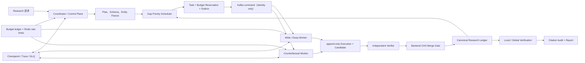
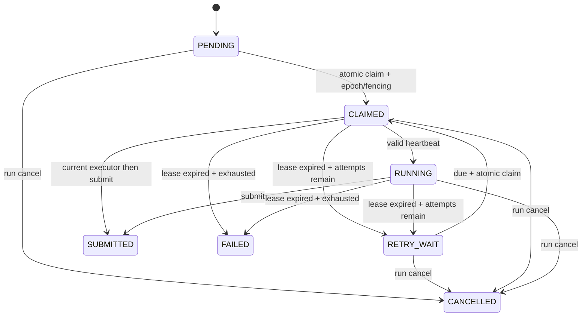

# Research Agent 多 Agent 架构深度设计与验证实施手册

> 文档状态：CURRENT / MA0-MA6 DETERMINISTIC EVIDENCE COMPLETE / REAL PROVIDER EVIDENCE PENDING
>
> 最后核查：2026-07-17
>
> 适用范围：`workers/research-worker`、Backend Research、Kafka、MySQL、Redis、部署与评测链路
>
> 关联文档：[受控多 Agent 并行架构与改造方案](ResearchAgent-受控多Agent并行架构与改造方案.md)、[MA4 分布式执行方案](ResearchAgent-MA4-Distributed-Execution-Plan.md)

## 1. 执行摘要

本项目应引入的不是自由协作、共享上下文且可任意写表的 Agent 群，而是一个**受控的并行研究执行面**：

> **单一 Coordinator 拥有计划和最终状态；多个受限角色 Agent 并行生成不可变候选；独立验证器判定；服务端 CAS Merge Gate 是唯一 canonical 写入口。**

其目标是把已冻结实体集中的独立信息缺口并行化，缩短 I/O 主导研究任务的关键路径，同时不牺牲证据归属、引用审计、预算约束、可恢复性和错误结果的可解释性。

当前 `INCREMENTAL_V1 Run → coordinator taskization → reservation/outbox → Kafka → 受限角色 Worker → workspace evidence/candidate → Backend verifier/CAS → execution/budget settlement → wave/checkpoint/repair → synthesis/finalization` 已闭合。MA5Q 还把 high-risk cell fan-out 为两个独立 durable slot，首候选只 staging，第二候选由服务端 blind verifier 决定单次 CAS；冲突 decision 会自动进入排除旧来源的 COUNTERFACTUAL repair。

这仍不是生产化分布式 Research 平台。当前证据证明 deterministic 契约、真实 MySQL 事务/锁序、恢复和调度闭环；没有真实 provider/external archive 四轮 A/B、长期 soak 或生产 SLO，因此不能声称质量、成本或 wall-clock 已优于参考项目。

## 2. 核查方法与证据边界

本手册基于本工作区代码和参考项目源码逐项检索，而不是根据 README 推断能力。代码行号会随改动漂移，路径和行为是可复核锚点。

| 范围 | 已核查证据 | 可以得出的结论 | 不可推出的结论 |
| --- | --- | --- | --- |
| NoteWeave Worker | `agent_contracts.py`、`agent_kafka_consumer.py`、`task_snapshot_contract.py`、`role_executor.py`、`deep_cell_executor.py` | 已有严格 command/claim/snapshot/result 驱动、隔离 DEEP_CELL 执行和 evidence/candidate 回传；fake E2E 已验证 | fake/workspace-only 链路不表示 external/LLM provider 已验证 |
| NoteWeave Backend | `ResearchAgent*Service`、V038–V044、`ResearchRunService` | 已有 append-only 审计、CAS、lease/reaper/cancel、预算 reservation/settlement、checkpoint、outbox/dispatcher、coordinator 和 ingress | 不能由局部服务和 R1–R4 推出 post-CAS crash、自动 Run 收口或生产 SLO |
| Table-as-Search | `run_widesearch_inference.py`、`run_*_batch_inference.py`、prompts | 有 Wide/Deep 层次、受限 `max_tool_threads`、benchmark 批处理并发 | 它的共享表并发写法不适合直接复制到带 VERIFIED 语义的 ledger |
| MiroFlow | `src/tool/manager.py`、`src/logging/task_tracer.py`、LLM provider 层 | per-agent 工具管理、黑名单、独立 trace/session 值得借鉴 | `async` 或多 tool call 不等于实际并行调度 |
| Marco / DeepWideSearch | `configs/profiles`、`marco/agent`、`DeepWideSearch/eval` | profile/budget/timeout、表格 depth/width/efficiency 指标值得借鉴 | 它们不是可直接嵌入本系统的生产级分布式调度器 |

本轮最终测试结果为 Backend MySQL 8.4 扩大 Research 聚合 `194 tests, 0 failures, 0 errors, 1 skipped`（skip 为环境门控 Redis integration）、MySQL LockMatrix `13/13`、Worker 全量 `359/359`。Compose 与 deterministic fake-provider 证据不代表真实 LLM/Search provider 已验证；第 4 节和第 15 节继续区分已经证明与尚未证明的能力。

## 3. 参考实现的真实含义与取舍

### 3.1 Table-as-Search（TAS）：并行的是受限的 agent invocation，不是无边界群聊

TAS 将 Wide Search 和 Deep Search 作为 managed agent 注册，配置 `max_tool_threads` 与各 agent 类型限额（`reference/Marco-DeepResearch/Marco-DeepResearch-Family/Table-as-Search/run_widesearch_inference.py`）。batch runner 另有 `--max-workers`，用于多个 benchmark 样本的并发。这两层不能混为一谈。

其 prompt 把任务划为“先找候选行，再补行内空 cell”，并明确 Deep Agent 的工具步骤应循序推进。这个分层与本项目的 `Entity Freeze → gap → CellTaskBundle` 高度匹配。

但 TAS 的自定义 `MemoryManagedToolCallingAgent` 为并发调用临时替换 `managed_agents` 字典引用（同文件约 339–355 行）。这说明其对象复制并非完整的无共享隔离。NoteWeave 不应复用该模式：每个 execution 必须从 factory 创建自己的 LLM client accounting、Toolbox、cancel token、trace 和只读 snapshot，绝不能临时修改共享 agent registry。

**吸收：** Wide/Deep 分层、有限 fan-out、同一实体的相关列批处理。

**拒绝：** 子 Agent 直写 canonical 表、共享可变 agent 引用、无服务器端版本约束。

### 3.2 MiroFlow：吸收能力边界和 trace，不误解为并发框架

MiroFlow `ToolManager` 支持 agent-specific tool collection、blacklist 和工具权限管理；`task_tracer` 记录运行过程。适合转化为本项目的 `RoleProfile + ToolPolicy + ExecutionTrace`。

其常规 tool-call 处理主要以循环驱动。异步接口只说明 I/O 可 await，无法证明同一 research run 的多任务被正确地并发、取消、限流、结算或合并。因此本项目要让**调度器**持有并发与背压，不能把“把函数改成 async”当作多 Agent 改造。

### 3.3 Marco：profile 是策略配置，不是授权边界

Marco 的 profiles 包含 accuracy/efficiency 取向、最大调用、context safety buffer、timeout/rollout 等概念。NoteWeave 应保留“角色 profile 决定预算与工具”的想法，但必须把它做成服务端签发的 task contract；Worker 环境变量只能提供 provider 凭证和默认模型，不能扩大 task 下发的 source scope、预算或可写资源。

### 3.4 DeepWideSearch：评测需要同时覆盖深度、宽度和效率

DeepWideSearch 将输出建模为表，评测包括 unique-column F1、row F1、exact success 和效率轴（见 `DeepWideSearch/README.md` 及 `eval/evaluation/evaluation.py`）。它提醒我们：多 Agent 的成功不能只看并发数或平均耗时。NoteWeave 需要额外保留 citation support、错误 VERIFIED 数、stale merge、预算守恒、429/5xx、恢复成功率和安全拒绝率。

## 4. 已实现事实、缺口与严禁误称

| 能力 | 代码事实 | 状态 | 对外表述 |
| --- | --- | --- | --- |
| 任务/候选/合并 typed contract | Worker `agent_contracts.py`、`merge_gate.py` | 已实现 | 已有受控候选合并基础 |
| 顺序 task 化 | `cell_task_planner.py`、`sequential_candidate_executor.py` | 已实现 | 可按 bundle 执行 candidate proposal |
| 本地受限并行 | `local_parallel_scheduler.py`、`research_tools.py` | 已实现 | 仅并行 post-extraction proposal，Merge 单写 |
| 增量持久化/CAS | V038、`ResearchAgentCellMergeService` | 已实现 | 服务端可校验版本/证据后合并 |
| 任务/lease/execution | V039、`ResearchAgentTaskService` | 已实现 | 可作为分布式执行真相源的基础 |
| 预算/检查点 | V040、`ResearchBudgetAndCheckpointService` | 已实现 | 已有 reservation 和单调 checkpoint 基础 |
| 新旧模式隔离 | V041、`ResearchRunService` | 已实现 | `INCREMENTAL_V1` 与 legacy rebuild 隔离 |
| command Outbox | V042、`ResearchAgentCommandOutboxService`、Dispatcher | 已实现 | 可为 ready agent task 发送最小命令 |
| lifecycle/delivery | V043、`ResearchAgentLifecycleService`、Scheduler、delivery failure projection | 已实现（MA4B 范围） | reaper/retry/cancel/redrive 可审计；尚无执行中 LeaseKeeper/drain |
| versioned TaskSnapshot | V044、`ResearchAgentTaskService`、`task_snapshot_contract.py` | 已实现 | claim 后可验证 server scope/digest；permit 仍需反查 authoritative lease |
| Worker command consumer | `agent_command_contract.py`、`agent_task_client.py`、`agent_kafka_consumer.py` | 已实现、默认关闭 | validate→claim→execute→submit→commit 与 DLQ 顺序已进入可运行服务 |
| DEEP_CELL executor | `role_executor.py`、`deep_cell_executor.py` | 已实现（受控范围） | 有隔离 Search→Fetch→Read→Extract；当前 E2E 只证明 fake/workspace evidence |
| evidence/candidate ingress | `ResearchAgentEvidenceIngestionService`、`ResearchAgentCandidateIngressService` | 已实现（workspace evidence） | Worker 不提交 merge verdict，Backend verifier/CAS；external evidence 归档未完成 |
| Redis permit/预算结算 | `ResearchAgentRateLimitService`、`ResearchBudgetAndCheckpointService` | 已实现（当前边界） | Redis 原子 bucket、默认 fail-closed、submit settle；可信 permit/per-call durable usage 留给 MA4H |
| Coordinator taskization/dispatch | `ResearchAgentTaskCoordinatorService`、自动 Coordinator scheduler/dispatcher | 已实现；`INCREMENTAL_V1` 是唯一启用条件 | Run→task/reservation/outbox、自动 wave/repair/checkpoint/finalization 已闭合；旧 canary/manual dispatch/双 allowlist 已删除 |
| 隔离多 Worker E2E | `scripts/ma4f`、R1–R4 保存结果 | 已验证（fake provider） | 证明受控多进程链路、写前 crash 和 replay；不证明 post-CAS crash/真实 provider |
| 真实 provider 对照评测 | 无可复核输出 | 未验证 | 不可称比 TAS 更快或质量更高 |

### 4.1 R1–R4 的窄证据

最终复核镜像为 Backend `sha256:878ea16952fe...`、Worker `sha256:e47a9ea804b3...`。隔离 fixture 无宿主端口，使用独立 network/volume、固定 workspace/run allowlist、空 LLM 配置和 deterministic fake provider。

| 轮次 | 可复核结果 | 只能证明 |
| --- | --- | --- |
| R1 单 Worker | 1 task/1 execution/1 evidence/1 candidate/1 accepted merge，cell `VERIFIED v1`，budget `SETTLED`，lag=0、DLQ=0 | 单实例 fake pipeline 基线 |
| R2 双 Worker | 8/8 task 唯一完成；Worker A=3、B=5；8 cell 均仅到 v1；4 partitions；lag=0、DLQ=0 | 两实例实际分工且无 canonical 双写 |
| R3 写前 crash | A claim 后在任何 permit/evidence/candidate 前退出；B 经 reaper 以 epoch/fence/attempt=2 接管；A 旧 fencing submit 返回 HTTP 400 / `RESEARCH_AGENT_TASK_STALE_LEASE`；lag=0、DLQ=0 | claim-before-write recovery；不含 CAS 后 crash |
| R4 replay | 二次 publish 为 0 且 topic offset 不变；同 group reset earliest 后 replay 1 条；前后 15 components/10 overall rows digest 均为 `d4e34c8791e3e9d00aa66708f11c91bbf001a58795652cf1a8f690f6a8a3d51f`；lag=0、DLQ=0 | 该链路重放幂等；不是端到端 exactly-once 宣称 |

R1–R4 均没有访问真实 LLM/Search provider，没有覆盖 external fetched evidence、真实 429/5xx、质量/成本或延迟改善，也没有覆盖 CAS 成功后 submit 前崩溃。

## 5. 目标架构



### 5.1 Control Plane（唯一权威）

Control Plane 位于 Backend/Coordinator，职责包括：

1. 生成或修订 plan、schema、query family，执行 entity canonicalization 与 freeze；
2. 计算缺口和优先级，生成不可变 `AgentTask`；
3. 原子预留 run/cell/role budget，决定 admission、wave barrier 和取消；
4. 维护 lease/fencing、checkpoint、Outbox、重试、DLQ 和审计投影；
5. 验证候选、执行 CAS merge、处理 conflict/recovery、完成报告。

它不应把“选什么 URL、读取的原文、模型回答正文”放进 Kafka command。命令只用于唤醒合格执行者；权威 scope 必须在 claim 后从服务端 snapshot 获取。

### 5.2 Data Plane（可横向扩缩、零 canonical 写权）

每个 Worker execution 只能：claim、读取自己的 immutable task snapshot、在 profile allowlist 内 Search→Fetch→Read→Extract、提交 candidate/evidence/usage/trace digest、按需 heartbeat。它不得：修改 schema/entity set/plan、直接写 `research_cell`、标 VERIFIED、生成最终报告、读取其他 workspace 或绕过预算。

### 5.3 单写并不意味着单线程

`Verifier → CAS Merge Gate → canonical ledger` 是单一**写入语义**，可在实现上串行 per-cell 或通过条件更新并发处理不同 cell。关键是每一条 canonical mutation 都经由同一套版本、lease、证据、幂等校验；不是强制整个系统只用一条线程。

## 6. 角色模型、最小权限和任务粒度

### 6.1 推荐初始角色

| 角色 | 适用输入 | 允许工具 | 输出 | 禁止事项 |
| --- | --- | --- | --- | --- |
| `WIDE_DISCOVERY` | 未冻结实体、候选来源不足 | search、轻量 read | entity/source candidate + evidence hint | 创建 canonical row、补最终 cell |
| `DEEP_CELL` | 已冻结实体的 1–3 个同源/同查询族 cell | search→fetch→read→extract | cell candidate + EvidenceCard | 写 ledger、改变 plan |
| `COUNTERFACTUAL` | CONFLICTED/high-risk cell | search/fetch/read，必须排除旧来源 | 支持或反驳 proposition 的独立候选 | 读取旧结论自由文本、复用排除来源 |
| `EVIDENCE_AUDIT` | 高风险或合并前候选 | read/claim validation；默认不 search | citation support/contradiction verdict | 产生业务事实或写表 |
| `SYNTHESIS` | 已通过全局验证的 ledger snapshot | 无外网或仅允许引用 hydration | report sections | 再定义事实、绕过 citation audit |

最小可行版本只需先启用 `DEEP_CELL`；Wide、Counterfactual、Audit 需随真实 executor 和评测逐步开启。不要为“角色数量”而拆分，角色必须对应不同输入、工具策略、输出契约或独立性约束。

### 6.2 `CellTaskBundle` 而不是“一 cell 一 Agent”

默认 bundle 应满足：同一 `research_run_id / entity_id / branch_id / plan_revision / entity_set_version`，1–3 个有相同 source affinity 或 query family 的 cell。这样一次读论文、官方文档或产品页可以填充相关字段，避免同一页面被数个 Agent 重复拉取。

以下情况强制缩小为单 cell：高风险结论、互斥值、需要反证、来源权限不同、预计正文超过 context 上限，或任一 cell 已在另一个 active task 中。

## 7. 权威数据模型和不变量

### 7.1 主键与版本

```text
CellKey = (research_run_id, entity_id, column_key, branch_id)
Task identity = task_id + lease_epoch + fencing_token
Merge identity = candidate_id + cell_id + expected_cell_version
Execution identity = task_id + execution_key
```

任何 canonical cell mutation 都必须同时满足：

```text
plan_revision == task.plan_revision
entity_set_version == task.entity_set_version
cell.version == candidate.base_cell_version
active_task_id == task_id
lease_epoch / fencing_token == authoritative current claim
candidate targets this exact cell
verdict == SUPPORTS
evidence bindings and source policy are valid
budget reservation is valid / settled exactly once
```

其中任一失败时：保留 execution/candidate/decision 审计，返回明确 reason code，**绝不覆盖新版本 cell**。

### 7.2 已实现的 claim snapshot 与剩余信任边界

V044 和 `ResearchAgentTaskService` 已在 claim 成功后返回服务端生成的只读 `research-agent-task-snapshot.v1`；Worker 用 strict Pydantic contract、本地 canonical SHA-256、task/lease/fencing 一致性在创建 executor 和调用工具前 fail-closed。核心字段为：

```json
{
  "schema_version": "research-agent-task-snapshot.v1",
  "task_id": "...",
  "research_run_id": "...",
  "workspace_id": "...",
  "role": "DEEP_CELL",
  "plan_revision": 3,
  "entity_set_version": 2,
  "branch_id": "main",
  "lease_epoch": 4,
  "fencing_token": 981,
  "target_cells": [{"cell_id":"...", "expected_version":7}],
  "query_policy": {"query":"..."},
  "source_policy": {"source_scope":[], "allow_external_search":false, "allow_external_fetch":false},
  "provider_key": "fake-canary",
  "budget": {"search_calls":3, "fetch_calls":5, "llm_calls":6, "wall_clock_seconds":90},
  "snapshot_digest": "sha256:..."
}
```

snapshot 中不得含 API key、完整 secret、未脱敏网页正文或其他 workspace 数据。Worker 将它视为上限，Backend 已在 evidence/candidate/submit 时复验 task/lease/fencing、target binding 与 source scope。

MA4H 已将 permit endpoint 收口为 `task_id + worker + lease_epoch + fencing_token + tool`：Backend 反查 authoritative snapshot 后自行派生 provider/workspace/run/role Redis keys，caller-supplied scope 会被 strict field contract 拒绝。

### 7.3 已拆分的结果契约与 completion 缺口

`ResearchAgentExecutionSubmission` 继续只承载 identity、usage、termination reason 和 trace digest；研究内容已经通过独立的 versioned evidence/candidate append endpoint 回传。当前 workspace-only 路径包含：

* 每个 candidate 的 cell binding、base version、规范化 value、confidence、reason；
* workspace source identity、逐字 quote/content digest 和服务端 source-scope 校验；
* task/worker/lease/fencing/execution/idempotency identity；
* Backend 计算最小 verifier verdict，再调用 CAS merge；Worker 不能直接提交 `SUPPORTS` 来写 cell；
* submit 时以 execution identity 结算聚合 usage，并取消尚未发布的 retry delivery。

历史顺序曾是 evidence/candidate/CAS 先发生，execution submit 后发生，因而存在 CAS 成功但 submit 未发生的窗口。MA4G 已以 immutable completion envelope 和单个 Backend transaction 将 execution/completion/evidence/candidate/merge/CAS/budget/task/outbox 一起收口；真实 MySQL G2 kill、G3 response-loss replay 与 G4 双 Worker replay 已验证该窗口不产生半提交、重复 version 或重复结算。external fetched evidence 仍必须在 MA5 先归档并建立 provenance，不能把任意 Worker 文本作为 evidence。

## 8. 状态机、投递与恢复

### 8.1 Task 生命周期

当前持久化 task 生命周期可概括为：



`VERIFYING/MERGED/REPAIR_PENDING` 当前主要体现在 append-only candidate/merge 与 cell 状态，不是完整 task/Run advancement 状态机。MA4I 才把 wave barrier、repair 和 checkpoint 推进接入 Coordinator；MA4J 再完成 synthesis/report/Run terminal 收口。

### 8.2 至少一次 Kafka 的正确用法

Kafka command 是唤醒信号，不是状态真相。正确流程为：

1. Backend 事务内创建 ready task、预算 reservation 和 agent outbox；
2. Dispatcher 发布最小 command，成功后标记 outbox `SENT`；失败可重试；
3. Consumer 先严格解析 command；解析失败写**持久化 DLQ**后再提交 offset；
4. Consumer 调 claim。若 task 已被其他 Worker claim、已完成或已取消，记录可观测事件并安全提交 offset；
5. 成功 claim 后验证 TaskSnapshot，创建隔离 executor；当前 DEEP_CELL 顺序申请 permit 并执行 Search→Fetch→Read→Extract，再 append evidence/candidate、由 Backend verifier/CAS，最后 submit execution；
6. 只有 submit 成功或 DLQ 写入成功后提交 Kafka offset；临时网络/5xx 不提交，让消息重投；
7. `execution_key`、lease/fencing、append idempotency 和 CAS 使已经覆盖的重投无害，不能依赖 exactly-once 幻觉；post-CAS/pre-submit 仍是 MA4G 缺口。

需要区分：schema/权限/越权是 poison message（DLQ）；429、临时 provider/网络错误是可重试；stale claim 或取消是正常竞态，不应再提交伪造失败 candidate。

### 8.3 取消、进程退出与 reaper

已实现：Cancel 的线性化点在 Backend，非终态 task 进入 `CANCELLED`，未发布 outbox 失效，reservation/cell binding 释放；reaper 只处理过期活跃 lease，按 attempt/backoff 进入 `RETRY_WAIT` 或 `FAILED`；旧 fencing 不能 heartbeat、append 或 submit；submit/offset 之间的重投按 execution identity 幂等。

MA4H 已实现周期性 LeaseKeeper、共享 cancel token、heartbeat stale/unavailable fail-closed 和 SIGTERM drain，并由 H1–H5 隔离 fixture 验证。真实长 Provider 的 cancellation 语义与生产网络 soak 仍未验证，不能从 fake-provider 证据外推。

## 9. 调度、并发控制与背压

### 9.1 多级并发

生产调度器必须同时控制以下多个维度：

| 层级 | 例子 | 初始限制 | 原因 |
| --- | --- | --- | --- |
| Run/Wave | 同一 run 可启动多少 bundle | 2 | 先验证质量、成本、冲突率 |
| Provider | 同一 provider 的 in-flight search/fetch/LLM | token bucket + semaphore | 防 429 与雪崩 |
| Workspace/User | 租户级总吞吐/成本 | 配额 + Redis bucket | 防一个 workspace 吞掉全局资源 |
| Role | `COUNTERFACTUAL`/audit 的并发 | 1 | 独立验证昂贵且不应压垮主研究 |
| Entity | 同一实体的 active bundle | 1，例外需显式声明 | 降低同页重复和语义冲突 |

当前 MA4C 已实现 provider、workspace、run+role 三组 Redis bucket 的单 Lua 原子扣减，Redis 不可用默认 fail-closed，容量耗尽记录低基数 `limited` 指标；MA4E 的 active cell binding 也能阻止同一 cell 被两个 active task 重复调度，MA4H 已完成 authoritative task/lease permit。简历项目不再增加独立 acquire/release role concurrency lease；并发由 durable taskization、cell binding 与 run+role bucket 联合约束。

### 9.2 优先级与 admission

MA4E 当前按实体和稳定 fingerprint 生成最多 3 个 cell 的 bundle，尚未实现完整 wave priority。MA4I 应实现确定性排序，避免让 LLM 直接决定调度：

```text
priority =
  mandatory_gap_weight
  + risk_weight * (conflict + citation_weakness)
  + report_dependency_weight
  + expected_reuse_weight
  - estimated_cost_weight
  - duplicate_source_penalty

admit only when:
  run not cancelled
  dependency/freeze barrier satisfied
  no incompatible active task
  budget reservation succeeds
  provider/workspace/run capacity is available
```

排序键需包含 `priority desc, wave asc, entity_id asc, task_id asc`，确保同一 snapshot 可复现。`Counterfactual` 不与原任务共享 source/evidence；它的 priority 由冲突严重度和最终报告影响决定。

### 9.3 Wave barrier 与早停

这是 MA4I 的目标语义，当前 Coordinator 尚不会在 task submit 后自动触发：同 wave 的 task 都到可解释终态或 deadline 后，重新运行 Local Verifier、写单调 checkpoint、重算缺口并决定下一 wave/repair。以下条件触发早停：必填 cell 已满足、citation audit 完成、没有 blocker、剩余预算低于最小 bundle reservation，或 deadline/cancel 到达。

## 10. 预算、计费和 Worker 自主配置

### 10.1 预算守恒

当前每个 coordinator task 在派发前 `reserve`；submit 以 `(task_id, execution_key)` 幂等 `settle(actual usage)`，cancel/retry-exhausted 释放 reservation。R1–R4 的每个完成 task 均只观察到一个 `SETTLED`；取消/重试耗尽的 release 由 Backend 定向测试覆盖。完整目标不变量为：

```text
reserved = consumed + released + still_reserved
consumed <= run_limit and consumed <= role/cell limit
same execution replay does not consume twice
```

当前是 execution 结束时聚合 usage，并没有 durable per-call usage，也没有完整记录已 settle reservation 的 unused 差额。MA4H 应补齐 per-call durable usage、unused release 和 crash/cancel 守恒；MA5 再校验真实 LLM token、search/fetch/read 调用、wall-clock、估算费用与 provider 账单。无法精确报价的 provider 也应记录调用数和估算方法版本。

### 10.2 Worker 可使用自己的模型配置，但不能自己扩大权限

现有 Worker 的 `Settings` 已使用独立环境变量 `NOTEWEAVE_RESEARCH_LLM_API_KEY`、`NOTEWEAVE_RESEARCH_LLM_BASE_URL`、`NOTEWEAVE_RESEARCH_LLM_MODEL` 等，与主链路隔离。生产应进一步使用每个 Worker deployment/role 的 secret 注入：

```text
research-worker-deep:   DEEP provider credential + approved model alias
research-worker-audit:  audit credential + approved model alias
research-worker-wide:   discovery provider credential + approved model alias
```

但“自己的配置”仅指 provider endpoint、credential、模型 alias、连接超时等运行时依赖。可调用工具、目标 cell、来源范围、最大 token/cost/时间必须由 claim snapshot 和服务端预算决定。日志、DLQ、checkpoint 和 prompt 不得打印 API key；endpoint 应有 allowlist/HTTPS 校验及 SSRF 防护。

## 11. 验证、Merge 与冲突恢复

当前 MA4D workspace path 已实现：Worker append 候选和逐字 evidence，不提交 merge verdict；Backend 验证 source/quote/task/lease/cell binding，计算最小结构化 verdict，再经 Merge Gate CAS 更新 cell；版本、lease、证据绑定错误或 frozen cell 会被拒绝并保留审计。R1–R4 证明该限定路径不会因双 Worker/replay 产生第二次 cell version。

完整目标仍包括：更独立的 `SUPPORTS / CONTRADICTS / INSUFFICIENT / UNSAFE` verifier；冲突、高风险或 citation weakness 自动创建带排除来源约束的 `COUNTERFACTUAL` task；Local/Global Verifier、Premature Commitment Guard 与 Citation Audit 控制报告生成。Coordinator 自动 repair 属于 MA4I，SYNTHESIS/report gate 属于 MA4J，真实 external evidence 独立性评测属于 MA5。

禁止以“多个 Agent 得出相同文字”当作独立证据。独立性至少以 source canonical ID、domain、publication lineage、discovery round 和 evidence content hash 判断；同一转载链只能计作一条证据谱系。

## 12. 可观测性、审计和运维

每个 trace 采用 `research_run_id / task_id / execution_id / candidate_id / merge_id / correlation_id` 串联。原文、prompt、认证头不入普通日志；保存脱敏 summary、content hash、工具元数据和权限判定。

生产前必须提供的指标：

* queue ready/claimed/running/expired/DLQ 深度，claim latency，lease heartbeat age；
* role/provider/workspace 的 in-flight、429/5xx、token bucket reject、retry/reaper 次数；
* budget reserve/consume/release、不守恒告警、重复 execution 幂等命中；
* candidate→verdict→merge 转化率、stale/CAS reject、错误 VERIFIED、counterfactual correction；
* p50/p95/p99 run 和 bundle wall-clock、wave idle time、重复 URL/来源率；
* secret scan、越权 snapshot/工具调用拒绝、SSRF/prompt-injection 阻断。

R1–R4 当前保存 task/outbox/execution/evidence/candidate/merge/cell/budget 和 Kafka lag/DLQ 摘要，但不等于上述生产指标已全部接入。告警不能只看服务 CPU：`stale merge` 突增可能表示 lease 太短或 reaper 过激；429 增加可能表示并发配置而非 provider 故障；budget 泄漏说明取消或 crash settlement 有漏洞。

## 13. 分阶段改造路线与定义完成（DoD）

| 阶段 | 目标 | 当前状态 | DoD / 放行门 |
| --- | --- | --- | --- |
| MA0 | 合约、feature flag、纯 Merge Gate | 完成 | 顺序语义不变；拒绝陈旧版本/错误证据 |
| MA1 | bundle 化顺序 candidate 路径 | 完成 | V1 兼容、跨轮版本继承、确定性结果 |
| MA2 | 单进程受限 proposal 并发 | 完成 | snapshot 深拷贝、稳定收集、单写 Merge；不声称工具并发 |
| MA3A–D | 增量持久化、CAS、task/lease、budget/checkpoint、投影 | 完成 | `INCREMENTAL_V1` 不走 delete/rebuild；审计可重放 |
| MA4A | command contract/outbox/client/consumer | 完成（限定范围） | 独立 transport、严格 validate/claim/submit/commit/DLQ；测试/transport 可显式关闭 |
| MA4B | reaper/cancel/DLQ/redrive | 完成（限定范围） | retry/backoff、cancel、delivery failure/redrive、旧 fencing 拒绝；LeaseKeeper/drain 转 MA4H |
| MA4C | Redis permit、reservation/settlement | 完成（限定范围） | 原子多维 bucket、默认 fail-closed、幂等 settlement/release；trusted permit/per-call usage 转 MA4H |
| MA4D | TaskSnapshot、DEEP_CELL、evidence/candidate/CAS | 完成（workspace/fake 范围） | 隔离执行与 Backend-only verdict/CAS；external archived evidence/真实 provider 转 MA5 |
| MA4E | Coordinator taskization | 完成 | Run→task/reservation/outbox 同事务、稳定 fingerprint；当前由自动 Coordinator 接管 |
| MA4F | Outbox 激活与隔离 E2E | 完成（fake-provider 证据范围） | R1–R4：单/双 Worker、写前 crash、replay digest/lag/DLQ 全部通过 |
| MA4G | 原子 completion/post-CAS crash | 已实现并验证（隔离 deterministic fake-provider + 真实 MySQL/Kafka） | LockMatrix；fresh/V044→V045 migration；G1 原子基线；G2 named-lock 精确 kill 与 DB-clock recovery；G3 response-loss byte replay；G4 双 Worker 16 task/32 cell offset replay。非真实 provider/非生产证明。 |
| MA4H | LeaseKeeper/cancel/drain/trusted permit | 完成（受控证据范围） | 长调用续租、lease/cancel fail-closed、SIGTERM drain、服务端 trusted permit 已验证 |
| MA4I | Run advancement/wave/checkpoint/repair | 完成（受控证据范围） | 自动 barrier/repair/checkpoint、DB-clock reaper 与模式互斥已验证 |
| MA4J | SYNTHESIS/report/Run+父 task 收口 | 完成（受控证据范围） | evidence-bound deterministic artifact、Run/父 task/trace 同事务收口已验证 |
| MA5 | 角色质量、分布式盲验与 provider A/B | 代码与 deterministic/MySQL 证据完成；外部证据待完成 | role profile、high-risk 双 durable slot、blind merge、冲突 repair、benchmark/archive/429/5xx ledger 已落地；真实 provider 四轮未完成 |
| MA6 | 运行治理/自动暂停 | 已实现代码门；生产证据待完成 | 默认健康门暂停新的 initial wave，已有增量历史继续 recovery/finalize；不声称生产 SLO |

每一个阶段都应先提交“范围、失败模型、红灯测试、数据迁移、回滚策略”的子计划，再写生产代码。不得把 `INCREMENTAL_V1` 的状态交给 legacy delete/rebuild 路径；没有真实 A/B 前不宣称质量或 p95 提升。

## 14. MA4G-J 实施记录与原验收顺序

### MA4G：原子 completion 与 post-CAS crash recovery

1. 先写故障模型：`evidence durable`、`candidate durable`、`CAS ACCEPTED`、`execution submit`、`budget settle`、`Kafka commit` 每两个步骤之间 kill/response loss。
2. 设计服务端 completion transaction 或 durable execution journal，使相同 execution identity 能查询并继续收口，而不是重跑旧 cell snapshot。
3. 对 candidate/merge/execution/budget/outbox 建立一致 idempotency identity；重复 completion 必须返回同 receipt。
4. 用 Compose 注入 CAS 成功后、submit 前 crash，断言 cell 只升一次、task 可终态、预算只结算一次、lag/DLQ 可解释。

### MA4H：LeaseKeeper、cancel/drain 与 trusted permit

1. 为每个 active execution 启动 lease/3 周期的 LeaseKeeper；heartbeat 返回 stale/cancel 时设置共享 cancel token，后续 provider 调用和 append 全部停止。
2. SIGTERM 停止 poll/claim，等待 active execution 在 grace 内完成原子 completion；超时由 reaper 恢复。
3. permit 请求携带 task/worker/epoch/fencing/tool identity，Backend 反查 authoritative TaskSnapshot 后构造 provider/workspace/run/role key，不接受 Worker 自报 scope。
4. 对长 provider timeout、heartbeat network partition、cancel race、lease loss 加 Compose 故障测试；可一并持久化 per-call usage 并释放 unused reservation。

### MA4I：Run advancement、wave/checkpoint/repair 与执行模式接管

1. 定义 wave barrier 和可解释终态；barrier 后运行 Local Verifier/gap analysis，并在同一推进协议中写单调 checkpoint。
2. 按依赖、风险、source reuse 和预算确定性生成下一 wave、`COUNTERFACTUAL` 或 repair task；重放不得创建重复 task/reservation/outbox。
3. 明确 `INCREMENTAL_V1` 对 `SEQUENTIAL_V1/V2`、`LOCAL_PARALLEL` 的接管、取消和回退线性化点，禁止同一 Run 双写。
4. 测试 coordinator crash、重复 advancement、部分 task failed/cancelled、budget exhausted 和 checkpoint resume。

### MA4J：SYNTHESIS、final report 与原子收口

1. SYNTHESIS 只读取通过 Global Verifier/Citation Audit 的 immutable ledger snapshot，不能再搜索或改事实。
2. report artifact 使用稳定 generation identity；重复生成返回同 artifact 或显式新 revision，不能静默覆盖。
3. 将 report durable、Run terminal、父 research task completion 做成可恢复的原子事务或 durable outbox 收口；任一失败都不能假完成。
4. 验证 report write/DB callback crash、父 task ACK 丢失、重复 finalize 和 citation gate 拒绝。

## 15. 关键测试矩阵

| 类别 | 当前证据 | 尚未闭合的门槛 |
| --- | --- | --- |
| Contract | strict command/snapshot/result、v1/v2 quorum/repair snapshot、extra field/identity/digest 拒绝进入 Worker `359/359` | MA5 external evidence/archive contract |
| Claim/fencing | 定向竞争、旧 fencing 拒绝、MA4H heartbeat/cancel/lease-loss 已验证 | 真实 provider 长调用与生产网络长期 soak |
| Submit/replay | execution/settlement 幂等、post-CAS crash 与 response-loss replay 已验证 | 生产 broker/network 长期 soak |
| CAS | stale/frozen/evidence binding、post-write crash、双 slot blind merge、冲突 repair 已验证 | 真实 provider 长期并发与生产 soak |
| Budget | reserve、submit settle、cancel/retry-exhausted release；R1–R4 唯一 settlement | MA4H durable per-call usage、settled unused release、真实 provider 对账 |
| Rate limit | Redis Lua 三 bucket 原子竞争、authoritative task/lease permit、limited/unavailable 指标和 fail-closed 定向测试 | MA5 真实 429/5xx 与生产容量调参 |
| DLQ/offset | poison/DLQ ACK/failure projection/commit 顺序定向测试；R1–R4 DLQ=0 | broker/network 故障长期 soak、生产 redrive 运维 |
| Recovery | R3 仅覆盖 claim 后、任何业务写前 crash；R4 覆盖消费重放 | MA4G 写后 crash；MA4H heartbeat partition/drain；MA4I/J coordinator/finalize crash |
| Run advancement | 自动 wave/checkpoint/repair 与 execution-mode 单写接管已验证 | 真实 provider 运行证据 |
| Finalization | evidence-bound artifact 与 Run/父 task 原子终态已验证 | 真实 provider 报告质量证据 |
| Security | server snapshot、workspace source/逐字 quote、旧 lease/scope 拒绝 | MA4H trusted permit；MA5 external archive、SSRF/injection/secret canary |
| Quality/performance | MA5 benchmark/archive 与 simulated 失败样本已生成；MA6 健康门已实现 | 真实 provider 至少四轮同条件 A/B；生产 SLO |

本轮代码级证据为 Backend MySQL 8.4 扩大 Research 聚合 `194 tests, 0 failures, 0 errors, 1 skipped`、Worker 全量 `359/359`；锁序证据为 MySQL 8.4.9 LockMatrix `13/13`。补充回归覆盖 Java/Python unsigned UTF-8 canonical key 顺序、deterministic report 排序/Markdown 转义和 Redis `limited` 指标。这些证据仍不能证明真实 provider 吞吐、延迟、外部限流、答案质量或生产稳定性。

## 16. 质量、效率与放量判定

本节是 MA5 真实 provider canary 与 MA6 放量门槛，不是 MA4F fake fixture 的验收结果。在相同 question、schema、source policy、模型、最大预算和随机策略下，保存每一次原始输出并至少运行四次顺序/并行对照。需要报告：

| 维度 | 指标 | 第一版门槛 |
| --- | --- | --- |
| 深度/宽度 | entity、column、row F1；exact table success | 关键质量不低于顺序基线 2 个百分点以上 |
| 证据 | citation association/support、错误 VERIFIED | 错误 VERIFIED = 0；关键引用不退化 |
| 效率 | p50/p95 wall-clock、有效并发、wave idle | 多 cell case p95 目标改善 ≥25%，否则不为并发而放量 |
| 成本 | token、provider/tool calls、估算费用、重复来源率 | 不超 profile 上限；成本上涨需有可量化质量收益 |
| 可靠性 | stale merge、lease expiry、DLQ、429/5xx、恢复成功率 | 无错误 canonical merge；故障后终态可解释 |
| 安全 | 越权、secret、SSRF、注入拦截 | 全部拒绝且无敏感正文泄漏 |

门槛未通过时自动保护为：暂停新的 initial wave；没有增量历史的后续 Run 可选择 `LOCAL_PARALLEL/SEQUENTIAL_V2`。已有 candidate/merge/checkpoint 的 Run 禁止切回 legacy，继续 recovery/finalize 且不删除审计数据。

## 17. 发布前可复核命令

以下命令须分开执行并保存每项退出码，避免长串命令超时后误报绿色。当前保存结果为 Backend `37/37`、Worker `273/273`：

```powershell
python -m pytest workers/research-worker/tests -q

.\mvnw.cmd -q -f backend/pom.xml '-Dtest=ResearchAgentCandidateIngressServiceTest,ResearchAgentCommandDispatchSchedulerTest,ResearchAgentCommandOutboxServiceTest,ResearchAgentLifecycleServiceTest,ResearchAgentTaskCoordinatorServiceTest,ResearchAgentTaskServiceTest' test

docker compose --profile app config --quiet
git diff --check
```

MA4F 的隔离 fixture 和 verifier 位于 `scripts/ma4f`；R1–R4 必须分别保存 Compose project、镜像 ID、数据库摘要、consumer-group lag 和 DLQ offset，不能只引用进程内 fake 测试。MA5 的真实 provider 验证必须使用独立凭证、显式预算上限、external evidence archive/provenance、脱敏 trace 和审批过的测试数据。

## 18. 不可妥协的架构决策（ADR）

1. **单一 canonical 写入口。** Agent 从不直写 `research_cell`；候选先 append-only，再验证和 CAS。
2. **bundle 间并行、bundle 内顺序。** 将并发放在独立研究单元之间，保留每个单元的因果 trace 和来源归属。
3. **lease + fencing + version，不以 Redis lock 或 Kafka exactly-once 代替正确性。**
4. **Kafka payload 最小化。** 命令不是权限凭证；scope 必须 claim 后由服务端读取。
5. **Worker provider 配置隔离，但任务授权集中。** 独立 API key 不等于独立预算/写权限。
6. **并发是可回退执行策略，不是新的研究语义。** 所有 mode 共享 Candidate→Verifier→Merge Gate。
7. **性能结论必须来自同条件真实对照。** mock/单测和“代码里有线程池”均不构成质量或 p95 改善证明。

## 19. 交付声明模板

当前准确表述应为：

> “Research Agent 已完成 MA4A–J、MA5Q 和 MA6 的受控证据范围，具备多 Worker、lease/fencing/CAS、自动 recovery/checkpoint/repair、high-risk 双候选盲验和 evidence-bound 原子报告收口。真实 provider 四轮 A/B 与生产 SLO 仍未证明。”

通过 MA4G–J、MA5 和 MA6 全部验收后，才可表述为：

> “系统在显式灰度范围内运行受控的 bundle 级并行研究：Agent 仅产生证据化候选，服务端以 lease/fencing/version/CAS 审核合并；顺序与并行对照、成本、可靠性和安全门槛均有可复核记录。”
