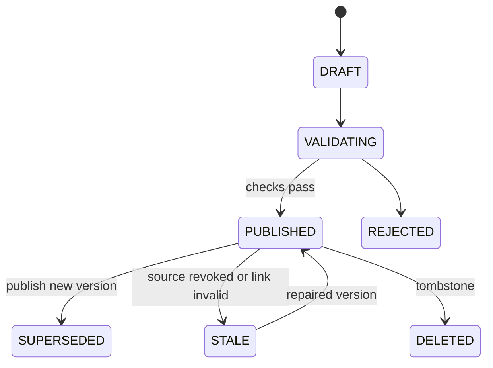

# Wiki：版本化知识、链接与治理

## 业务问题与非目标

Wiki 把用户确认过的知识组织成可导航页面。页面需要不可变版本、当前 Head、显式链接、反链、来源回链、搜索、关系图、治理状态和修复记录。检索能找到文本不代表知识已经被发布，也不代表旧版本仍可见。

Wiki 不把模型生成的回答自动当成页面真源，不用图数据库或 Elasticsearch 保存页面权威版本，也不允许自动修复绕过审批和 Workspace ACL。

## 用户操作与产物

用户可以创建知识项、追加版本、改标题、删除页面、查看首页/索引/搜索/关系图/统计/问题/日志，并触发受控链接重建、投影重建或自动修复。最终产物是一个当前有效 Page Version、来源引用、链接集合和治理状态。

```text
Source / Note / Research / Artifact
  -> Draft Knowledge Version
  -> Validate Citation and Links
  -> Publish Current Head
  -> Search / Link / Backlink / Graph Projection
  -> Issue Detection
  -> Review / Repair / New Version
```

`[当前实现]` `KnowledgeController`、`KnowledgeCommandService`、`KnowledgeVersionService`、`KnowledgeQueryService`、`KnowledgeGraphService`、`KnowledgeGovernanceService` 与 `WikiIngestService` 覆盖页面、版本、链接、查询和治理；相关迁移保存 Knowledge、Version、Citation、Link、Index、日志与任务状态。

## 演化与 Bad Case

| 阶段 | 方案 | Bad Case | 修复 |
| --- | --- | --- | --- |
| V0 保存一段正文 | 页面表原地更新 | 历史丢失、并发覆盖、旧引用失效 | 不可变 Version + Current Head |
| V1 文本内 Markdown Link | 每次读取临时解析链接 | 重命名断链、反链昂贵、删除残留 | 稳定 Page ID、Link/Backlink Projection |
| V2 全文搜索 | ES 命中即作为 Wiki 结果 | 旧版本或越权页面重新可见 | Workspace/Version Filter + Hydration 复核 |
| V3 自动建图 | 模型抽概念并直接写 Link | 幻觉关系、循环和跨租户污染 | Proposal、Validator、版本化 Link Set |
| V4 自动修复 | Issue 触发覆盖页面 | 无法审阅、修复引入新错误 | Draft Repair + Diff + 新 Version + 审计 |
| 目标系统 | Version、Source Backlink、治理和撤销闭环 | 投影与真源收敛复杂 | Rebuild Catalog、Quality Receipt、Reconciler |

`[行业参考]` Obsidian 区分 Link 与 Backlink，Outline 使用 Revision History 和 Workspace/Collection 权限，GitBook 使用页面树与发布边界，BookStack 展示层级与内容级权限。NoteWeave 采用稳定身份、非破坏版本和关系投影，但页面真源仍由 MySQL 领域模型持有。

## 数据模型与状态

`[当前实现]` Knowledge Item 用 `ACTIVE` 等可见性状态，Version 追加、Head 条件推进。下图是发布与治理语义，不是 Item 表上的 `DRAFT/VALIDATING/PUBLISHED` 枚举。



核心对象：

- Knowledge Item 提供稳定页面身份和 Workspace 归属。
- Knowledge Version 保存不可变标题/正文/摘要/来源与发布信息。
- Current Head 指向当前可见 Version，使用版本条件推进。
- Citation/Source Backlink 把页面 Claim 或段落关联到 Source Snapshot/Evidence。
- Link 保存源页面、目标页面、关系类型、来源版本和验证状态。
- Backlink、Graph、Search、Stats 和 Issue 是可重建 Projection。
- Wiki Log 保存发布、修复、重建、删除和审批审计。

旧 Version 保留历史解释力，但默认查询只返回当前有效 Head。页面删除产生 Tombstone，不能物理删掉 Head 后让 Projection 猜状态。

## 正常、异常与恢复

正常路径中，创建或写回操作先生成 Draft Version，校验 Workspace、Source Citation、链接目标、Schema 与正文安全；发布事务追加 Version 并通过 Expected Head Version 更新当前指针，同时写 Outbox。异步消费者更新搜索、Link/Backlink、Graph 和 Stats；读取时先用投影召回，再从 MySQL Hydrate 当前 Version 和权限。

异常路径：

- 两个用户基于同一 Head 发布，只有一个版本条件更新成功，另一个进入冲突比较。
- 链接目标不存在、已删除或跨 Workspace 时，校验失败或产生显式 Broken Link Issue。
- Source Citation 被撤销，页面进入 Stale/Issue 状态；不能静默删除句子或保留“已验证”标记。
- 搜索索引仍有旧版本时，Hydration 拒绝并记录 Stale Projection。
- Rebuild 中断保留旧 Alias，新的 Build 不可见；完成后经质量回执切换。
- Auto-fix 只生成候选 Diff，新 Version 仍经过相同校验和权限路径。
- 页面删除后，Link/Backlink、Graph、Cache、Search 与 Memory 候选异步清理，读取路径先由 Tombstone 阻断。

恢复时根据 Knowledge Item + Version + Projection Type 重放，不按旧搜索文档反向重建页面。Reconciler 比较 Head、Link Set Digest、Backlink Count、Index Version 和 Issue 状态，补齐缺失投影并隔离过期关系。

## 链接、反链与图谱边界

显式链接来自用户编辑或受控候选，目标使用稳定 Knowledge Item ID；显示标题可以变化。反链是 Link 的反向查询或投影，不单独接受写入。图谱将 Page/Concept 与 Link 组织为查询视图，Graph Node/Edge 不拥有正文与权限。

`[目标设计]` 图扩展有 `max_hops`、`max_nodes`、`max_edges` 和字符预算。每扩一跳都重新施加 Workspace、当前 Head、治理状态与 Source 可见性。环路按 Page/Version/Relation Identity 去重。关系置信度不能覆盖显式用户关系，模型抽取关系保持 Proposal 状态。

Wiki 的搜索与图谱结合方式是“候选并集 + 当前版本 Hydration + Evidence Assembly”，不把 PageRank 或图相邻直接当成事实支持。

## 幂等、并发、缓存与一致性

追加 Version 使用 Item + Version No 或 Operation Key 唯一约束；更新 Head 使用 Expected Version。重复 Ingest/Event 按 Source Version + Knowledge Version + Projection Type 收口。旧事件晚到只更新历史 Build，不改变当前 Head/Alias。

Page Version Cache Key 包含 Workspace、Item、Head Version 与 ACL Version。`[当前实现]` Wiki Page Version Cache 默认 TTL 600 秒、Jitter 120 秒；主动失效和版本比较承担正确性，TTL 只是异常兜底。

发布事务不等待 ES/Graph。页面可见状态与 Projection Ready 分开；读取可以在 Search 暂不可用时走明确的 MySQL/索引降级，但不能返回未经版本校验的旧投影。

## 参数推导

| 参数 | 太小 | 太大 | 观察指标 |
| --- | --- | --- | --- |
| Page Search K | Gold Page 漏召回 | 旧/弱相关页面 Hydration 增加 | Page Recall、P95 |
| Graph Hops | 多跳证据缺失 | 节点爆炸、弱关系污染 | Supporting Evidence F1、Node Count |
| Node/Edge Budget | 关系链被截断 | 延迟、Prompt 和可视化拥挤 | Expansion Precision、P99 |
| Link Rebuild Batch | 重建过慢 | DB/ES 写放大与锁等待 | Rebuild Duration、Pool Saturation |
| Cache TTL | 命中率低 | 陈旧权限/Head 风险窗口大 | Hit、Stale Reject、ACL Change Lag |
| Auto-fix Confidence | 候选过少 | 错误修复与人工负担 | Precision、Review Reject Rate |

参数对比固定 Wiki Dataset、Page/Link Version、Query Set 和 Bundle。Scope Violation、旧 Version 可见、Source Backlink 丢失或关键关系 Precision 回退是停止条件；修复版本需固定回放和 Shadow Build 同时通过。

## 指标

| 指标 | 分子 / 分母 | 用途 |
| --- | --- | --- |
| Page Version Correctness | 返回当前允许 Version 的页面 / 返回页面 | 硬正确性门禁 |
| Supporting Evidence Precision | 支持问题的返回证据 / 返回证据 | 图扩展噪声 |
| Supporting Evidence Recall | 返回的 Gold 证据 / 全部 Gold 证据 | 多跳覆盖 |
| Supporting Evidence F1 | Precision 与 Recall 调和均值 | 汇总关系质量 |
| Source Backlink Coverage | 有有效 Source/Evidence 回链的关键 Claim / 关键 Claim | 可追溯性 |
| Broken Link Rate | 无有效目标的当前 Link / 当前 Link | 治理健康 |
| Stale Projection Reject | Hydration 拒绝旧版本数 / 投影候选数 | 索引陈旧 |
| Rebuild Convergence | 与真源一致的页面/链接 / 应重建对象 | 重建完整性 |
| Auto-fix Acceptance | 审核接受的 Fix / 展示 Fix | 需要真实用户或受控标注 |

指标按 Workspace、页面类型、版本年龄、链接类型、风险和 Bundle 切片。生产采纳、治理成本和知识新鲜度属于 `[生产待验证]`。

## 为什么不用相近方案

| 方案 | 不直接采用 | 迁移条件 |
| --- | --- | --- |
| 文本文件作为唯一真源 | 多用户 ACL、事务、版本和跨对象审计困难 | 单用户本地产品可考虑 |
| 图数据库作为页面真源 | 正文版本、事务与 Source Evidence 仍需关系库 | 图查询规模/深度成为可测瓶颈时作为投影 |
| Elasticsearch 当前文档覆盖 | 旧版本和审计丢失，删除/权限难证明 | 不作为真源 |
| 自动抽取所有概念关系 | 误关系会长期污染导航和检索 | 有独立 Gold、审核和低误注入率后扩大自动接受 |
| Wiki 与 Note 合并 | Note 是草稿/阅读工作流，Wiki 是发布/治理对象 | 保持写回衔接，不合并状态机 |

## 安全、测试与发布

页面正文、外部 Source 和 Link Label 都是不可信内容。模型抽取链接或修复只产生 Proposal；服务端重验 Workspace、目标页面、当前 Version、Source 权限和审批。导出与链接预览不得让模型控制任意 URL。

- 单测覆盖 Version、Head CAS、Link/Backlink、治理 Issue 与 Auto-fix Proposal。
- Repository/MySQL 测试覆盖并发发布、当前版本查询和删除 Tombstone。
- Kafka/Ingest 测试覆盖重复、乱序、失败事务和旧版本事件。
- 固定 Wiki Gold 覆盖多跳、环路、Broken Link、跨 Workspace、旧版本和来源撤销。
- 重建演练在新 Index/Graph Version 上执行，质量回执通过后切换；回滚切旧 Alias/Bundle，不修改 Head。
- Playwright E2E 验证页面导航、版本、图谱、Issue、修复和来源回链。

`[当前实现]` Knowledge Command/Version/Query/Graph/Governance、Wiki Ingest Failure Transaction、Page Version Cache 和前端 Wiki 导航测试提供当前证据。

`[生产待验证]` 大规模图查询、协同编辑、长期知识新鲜度、自动修复采纳和跨区重建 RTO 尚无生产证据。

## 面试入口

面试主回答与追问见 [场景化 RAG 一体化手册](./简历亮点八股/31-场景化RAG一体化面试手册.md)。
