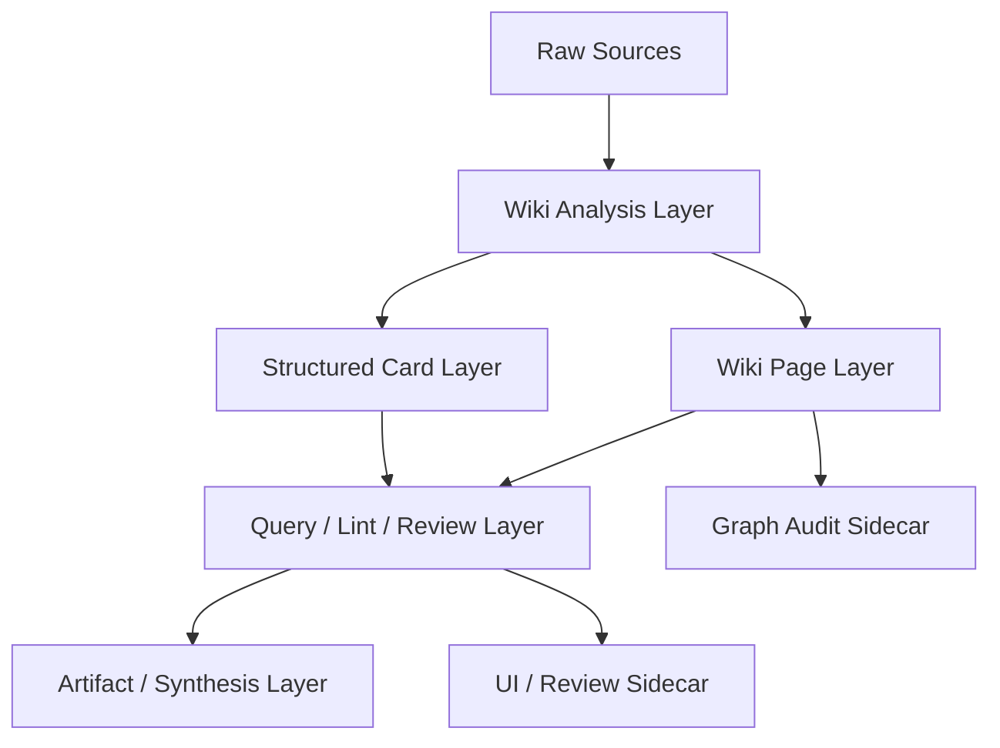

# NoteWeave 个人 Wiki-First 改造与 Sidecar 接入方案

更新时间：2026-05-20

## 1. 文档目标

本文档只讨论 NoteWeave 的个人用户侧方案改造，不展开团队知识库与前端界面。

目标是回答这几个问题：

1. 当前个人用户侧方案是什么，已经做到哪里。
2. 为什么它还不够“wiki-first”。
3. 参考 WeKnora 的 Wiki Mode，NoteWeave 个人侧应该如何改。
4. `graphify` 和 `nashsu/llm_wiki` 能不能接进来，应该作为什么角色接入。
5. 改造后的后端架构、数据模型、执行链路和实施顺序是什么。

本文档的核心结论是：

> NoteWeave 个人侧不应该继续只做“Source -> Card -> Artifact -> Synthesis”的生成链，而应该升级成“Persistent Wiki as Primary Knowledge Layer”的个人研究系统；`graphify` 适合做图谱审计 sidecar，`llm_wiki` 适合做 UI/graph/review sidecar，但二者都不应直接成为主写入权威。

---

## 2. 参考资料

### 2.1 当前仓库文档

- [docs/个人Wiki链路技术改造方案.md](/D:/java-projects/NoteWeave/docs/个人Wiki链路技术改造方案.md)
- [docs/PROJECT_STATUS.md](/D:/java-projects/NoteWeave/docs/PROJECT_STATUS.md)
- [docs/features/phase_11_personal_generation.md](/D:/java-projects/NoteWeave/docs/features/phase_11_personal_generation.md)
- [docs/features/phase_11_5_personal_artifact_distillation.md](/D:/java-projects/NoteWeave/docs/features/phase_11_5_personal_artifact_distillation.md)
- [docs/features/phase_12_long_term_memory.md](/D:/java-projects/NoteWeave/docs/features/phase_12_long_term_memory.md)

### 2.2 代码锚点

- [WikiCompilerService.java](/D:/java-projects/NoteWeave/src/main/java/com/noteweave/personal/compiler/service/WikiCompilerService.java)
- [EvidenceBacktraceService.java](/D:/java-projects/NoteWeave/src/main/java/com/noteweave/personal/compiler/service/EvidenceBacktraceService.java)
- [ResearchContextService.java](/D:/java-projects/NoteWeave/src/main/java/com/noteweave/personal/generation/service/ResearchContextService.java)
- [PersonalEvidenceService.java](/D:/java-projects/NoteWeave/src/main/java/com/noteweave/personal/generation/service/PersonalEvidenceService.java)
- [PersonalGenerationService.java](/D:/java-projects/NoteWeave/src/main/java/com/noteweave/personal/generation/service/PersonalGenerationService.java)
- [MethodologyMatcher.java](/D:/java-projects/NoteWeave/src/main/java/com/noteweave/personal/methodology/MethodologyMatcher.java)
- [PersonalArtifactDistillationService.java](/D:/java-projects/NoteWeave/src/main/java/com/noteweave/personal/distillation/service/PersonalArtifactDistillationService.java)
- [ConceptCard.java](/D:/java-projects/NoteWeave/src/main/java/com/noteweave/personal/card/model/ConceptCard.java)
- [SynthesisCard.java](/D:/java-projects/NoteWeave/src/main/java/com/noteweave/personal/card/model/SynthesisCard.java)

### 2.3 外部参考

- WeKnora：Wiki Mode、Wiki Browser、Knowledge Graph、异步任务队列、可观测性
- LLM Wiki：persistent wiki、purpose.md、index.md、log.md、review queue、deep research
- graphify：图谱编译、图谱报告、query-first graph access、graph-as-navigation

---

## 3. 当前个人用户侧方案

## 3.1 当前核心链路

当前个人侧主链路可以概括为：

```text
Source
  -> WikiCompiler
  -> ArticleCard / ConceptCard
  -> MethodologyMatcher
  -> PersonalGeneration
  -> Artifact
  -> Distill
  -> SynthesisCard
```

当前已经具备的关键能力：

- Source 导入
- URL 安全抓取
- Source 解析与编译
- ArticleCard 生成
- ConceptCard 生成与归并
- ConceptRelation
- MethodologyCard 匹配
- Personal Generation
- Artifact 持久化
- Artifact -> SynthesisCard 显式沉淀
- Citation / Evidence backtrace

## 3.2 当前方案的优点

当前方案有三个非常好的基础：

### 3.2.1 已经不是原始 RAG

NoteWeave 个人侧不是“每次都从 raw source 重新检索再回答”，而是已经有中间知识层：

- `ArticleCard`
- `ConceptCard`
- `MethodologyCard`
- `SynthesisCard`

这比普通 RAG 更接近 LLM Wiki 思路。

### 3.2.2 已经有可追溯证据

`EvidenceBacktraceService` 与 card citation 让知识层不是完全脱离原文的。

### 3.2.3 已经有显式沉淀边界

`Artifact` 默认不直接写回核心 Wiki，而是经用户确认后沉淀为 `SynthesisCard`。

这点非常重要，因为它避免了“临时生成污染长期知识库”。

## 3.3 当前方案不够 wiki-first 的地方

当前方案虽然已经有 Wiki 元素，但本质仍然偏：

```text
编译优先 + 生成优先
```

而不是：

```text
Persistent Wiki 优先 + Query against Wiki + Lint + Review + Deep Research
```

主要问题有六个。

### 3.3.1 Wiki 还不是第一知识层

当前个人侧的主入口更像：

- 研究项目
- 卡片
- 生成
- 成果

Wiki 还不是真正的“主知识层”，更像一组中间结构化卡片集合。

### 3.3.2 缺少持续维护的 Wiki 目录系统

当前还缺少类似 LLM Wiki 里的：

- `index.md`
- `log.md`
- `overview.md`
- `purpose.md`
- interlinked markdown pages

也就是说，当前系统有结构化知识实体，但还没有形成“可浏览、可维护、可持续演化的 wiki 文件层”。

### 3.3.3 缺少正式 Query / Ingest / Lint 三操作模型

Karpathy / LLM Wiki 的核心不是“生成卡片”，而是：

- Ingest
- Query
- Lint

当前 NoteWeave 个人侧：

- Ingest：有
- Query：弱
- Lint：几乎没有正式产品化

### 3.3.4 缺少知识维护日志

当前没有正式的“这次 ingest 更新了哪些知识页、为什么更新、冲突在哪里、哪些页面需要 review”的演化日志层。

### 3.3.5 缺少 review queue

当前是：

```text
Source -> compile -> cards
```

而不是：

```text
Source -> analysis -> page updates -> review items -> human approve / reject / defer
```

### 3.3.6 生成链重于 wiki 链

现在的重心在：

- 生成报告
- 生成学习指南
- 生成比较分析

而不是：

- 维护 overview
- 更新 concept pages
- 识别冲突
- 发现孤岛页
- 发现缺失概念

这会让系统更像“个人研究生成器”，而不是“个人知识编译器”。

---

## 4. WeKnora 的 Wiki Mode 值得借什么

根据 WeKnora 当前公开说明，它最有价值的不是它的 Agent，而是它把 Wiki Mode 提升成一等能力：

- Wiki Mode 用 agent 把 raw documents 蒸馏成 interlinked markdown wiki
- 有 Wiki Browser
- 有 Wiki Knowledge Graph
- 有 page-link graph / subgraph API
- 有异步任务队列
- 有 Langfuse observability
- 知识库类型里把 `Wiki` 作为正式 KB 类型

对个人用户侧最值得借的，是下面五点。

## 4.1 Wiki 是正式知识形态，不是附属产物

WeKnora 的 wiki 不是“附属导出格式”，而是正式知识层。

NoteWeave 应该借这一点，把个人侧核心知识层从：

```text
cards as intermediate data
```

升级为：

```text
wiki pages as maintained knowledge surface
cards as internal structured backing
```

也就是：

- 页面层是人和系统共同消费的 Wiki
- 卡片层是背后的结构化支持层

## 4.2 Wiki 图谱是一等能力

WeKnora 明确把 page-link graph 放进体系里。

对 NoteWeave 来说，这意味着：

- 个人侧不应只有 `ConceptRelation`
- 还应该有 `WikiPageLink`
- 还应该有 `WikiSubgraph`
- 还应该有 `Page -> Source -> Concept -> Synthesis` 的跨层关系

## 4.3 Wiki Mode 必须异步化

WeKnora 的 wiki ingest 支持大规模任务队列和死信处理，这说明：

- Wiki 编译不应只是同步小事务
- 它本质上是一个持续维护管线

对 NoteWeave 个人侧也是一样：

- Source ingest
- Wiki analysis
- Page update proposal
- Review queue
- Confirmed writeback

都应该进入异步任务系统。

## 4.4 Wiki 维护要有可观测性

WeKnora 把 Wiki pipeline 纳入 Langfuse 和任务追踪。

对 NoteWeave 的意义是：

- 每次 source ingest 不只记录 task success/fail
- 还应记录新增了哪些页面
- 更新了哪些页面
- 哪些关系是 inferred
- 哪些更新需要 review

## 4.5 Wiki 不等于 GraphRAG 主导

WeKnora 虽然支持图谱，但其 wiki 实现不是“所有查询都走 GraphRAG”。

这点很适合 NoteWeave：

- Wiki 是主知识层
- Graph 是辅助审计层和导航层
- Source 是证据层

---

## 5. LLM Wiki 模式值得借什么

`nashsu/llm_wiki` 更接近“个人 wiki-first 产品”的完整产品形态。

它最值得借的不是桌面 UI，而是底层工作方式。

## 5.1 三层结构

它明确保留了三层：

```text
Raw Sources -> Wiki -> Schema
```

这个结构非常适合 NoteWeave 个人侧。

对应到 NoteWeave：

```text
Source -> Wiki Pages / Cards -> Methodology / Rules / Purpose
```

## 5.2 三核心操作

LLM Wiki 的核心操作是：

- Ingest
- Query
- Lint

这三个动作比“compile cards / generate artifact”更接近真正的个人 wiki-first 系统。

## 5.3 index.md 与 log.md

LLM Wiki 强调：

- `index.md` 是内容目录
- `log.md` 是时间演化记录

这两个文件对于 NoteWeave 很重要，因为它们解决了两个大问题：

1. 知识入口
2. 演化可追溯性

## 5.4 purpose.md

LLM Wiki 加入了 `purpose.md`，用于定义：

- 研究目标
- 核心问题
- 范围
- 当前 thesis

这比纯 schema 更重要，因为个人研究不是只靠结构规则驱动，还需要方向性。

这很适合映射到 NoteWeave 的 `ResearchProject`。

## 5.5 Two-Step Ingest

LLM Wiki 把 ingest 分成两步：

1. Analysis
2. Generation

这非常值得借。

对 NoteWeave 来说，当前很多链路还是“读 source -> 直接产 card/page”。

更合理的改造是：

```text
Step 1: Analyze source
  -> entities
  -> claims
  -> contradictions
  -> link candidates
  -> missing pages

Step 2: Generate wiki update proposal
  -> update source summary page
  -> update concept/entity pages
  -> update overview/index/log
  -> emit review items
```

## 5.6 Review Queue

LLM Wiki 的 async review system 非常适合 NoteWeave。

这意味着个人 wiki 不应只有：

```text
自动写入
```

还应有：

```text
proposed update
review required
approve / reject / defer
```

## 5.7 Deep Research 只做补洞

LLM Wiki 的 deep research 是在知识缺口出现时触发，而不是默认工作模式。

这也非常适合 NoteWeave：

- Deep research 不是主链
- 它是补洞、补盲点、补冲突的 side procedure

---

## 6. graphify 和 llm_wiki 是否能接

结论先说：

## 6.1 graphify：能接，但只适合做图谱审计 sidecar

适合接。

但只适合做：

- 图谱审计
- 关系发现
- 孤岛页检测
- bridge node 检测
- surprising connection 提示
- graph report 输出

不适合做：

- 个人主检索
- 个人主写入
- 主知识真源

## 6.2 llm_wiki：能接，但只适合做 UI/graph/review sidecar

适合接。

但更适合做：

- Wiki 浏览
- Graph 浏览
- Review 队列
- Deep Research 工作台

不适合做：

- 直接变成 NoteWeave 的主知识库后端
- 替代现有 Source / Card / Artifact / Synthesis 领域模型

## 6.3 WeKnora：不建议整体接入，只建议吸收方案

不建议把 WeKnora 作为 sidecar 直接接到个人链路里。

原因：

- 它更像完整知识平台，不是轻 sidecar
- 会与 NoteWeave 现有领域模型和任务链重叠
- 接进去的复杂度太高

更适合：

- 学它的 wiki mode 思想
- 学它的 pipeline 和 observability
- 不作为运行时依赖接入

---

## 7. 改造目标：把个人侧升级成真正的 Persistent Wiki

改造后的个人侧目标不是：

```text
更强的 artifact generator
```

而是：

```text
一个以 persistent wiki 为核心、
以 cards 为结构化支撑、
以 source 为证据底座、
以 review / lint / graph audit 为维护机制的个人研究系统
```

一句话定义：

> Source 是事实层，Wiki Page 是主知识层，Card 是结构化支撑层，Artifact 是工作产物层，Synthesis 是稳定沉淀层，Graph/Review 是维护层。

---

## 8. 修改后的目标架构

## 8.1 新的五层结构



### L0 Raw Sources

- `Source`
- 原始文件
- 原始 URL 内容
- 原图 / 原表 / 原附件

### L1 Wiki Analysis Layer

- source analysis
- contradiction detection
- page update planning
- link recommendation
- review item generation

### L2 Wiki Page Layer

个人侧新增正式 Wiki 页面层：

- `overview.md`
- `index.md`
- `log.md`
- `purpose.md`
- `source summary pages`
- `concept pages`
- `entity pages`
- `comparison pages`
- `open question pages`

### L3 Structured Card Layer

继续保留：

- `ArticleCard`
- `ConceptCard`
- `MethodologyCard`
- `SynthesisCard`

但它们从“主知识入口”降为“结构化 backing layer”。

### L4 Query / Lint / Review Layer

新增正式三操作：

- Ingest
- Query
- Lint

以及：

- Review Queue
- Deep Research Proposal

### L5 Artifact / Synthesis Layer

保留：

- Artifact
- Distill
- SynthesisCard

但其角色变为：

```text
wiki exploration output
not primary wiki itself
```

---

## 9. 修改后的核心后端方案

## 9.1 新增 Wiki Page 层

### 9.1.1 目标

在个人侧新增正式 wiki 页面层，而不是只保留 card 层。

建议新增实体：

```text
PersonalWikiPage
PersonalWikiPageVersion
PersonalWikiPageLink
PersonalWikiIndex
PersonalWikiLogEntry
PersonalWikiReviewItem
```

### 9.1.2 页面类型建议

```text
OVERVIEW
INDEX
PURPOSE
SOURCE_SUMMARY
CONCEPT
ENTITY
TOPIC
COMPARISON
OPEN_QUESTION
SYNTHESIS
METHODOLOGY
```

### 9.1.3 为什么需要 Page 层而不只靠 Card

因为个人 wiki-first 系统要解决的不只是结构化抽取，还包括：

- 可浏览
- 可链接
- 可更新
- 可版本化
- 可审查
- 可被 LLM 当作主知识表面使用

Card 更适合做结构化内核，不适合单独承担这个“知识表面层”。

## 9.2 新增 Purpose / Index / Log 三核心文件

### 9.2.1 purpose

映射 `ResearchProject` 的方向性：

- 研究主题
- 当前问题域
- 目标结论
- 不关心什么
- 当前假设

建议新增：

```text
ResearchProjectPurpose
```

也可以直接作为特殊 wiki page。

### 9.2.2 index

内容目录，不是全文索引。

作用：

- 人类快速导航
- LLM Query 时先读 index 再读具体页

### 9.2.3 log

记录：

- ingest 了什么
- 更新了哪些页
- 哪些关系是 inferred
- 哪些需要 review
- 哪些问题待深挖

---

## 10. 修改后的 Ingest 流程

## 10.1 当前流程

当前更像：

```text
Source -> compile -> cards
```

## 10.2 目标流程

建议改成两阶段：

```text
Source
  -> SourceAnalysisTask
  -> WikiUpdateProposalTask
  -> ReviewQueue
  -> ApprovedWriteTask
  -> Page/Card/Link update
```

## 10.3 Step 1：SourceAnalysisTask

输出建议包括：

- source summary
- candidate concepts
- candidate entities
- claims
- contradictions
- related existing pages
- missing pages
- proposed links
- deep research suggestions

建议新增：

```text
SourceAnalysisDraft
SourceClaimDraft
SourceContradictionDraft
WikiUpdateProposalDraft
```

## 10.4 Step 2：WikiUpdateProposalTask

根据 analysis 生成：

- 新建哪些 page
- 更新哪些 page
- 更新 `index`
- 追加 `log`
- 产生哪些 `review item`

这个阶段不直接写核心 wiki，而是生成 proposal。

## 10.5 Step 3：ReviewQueue

审查项类型建议：

```text
CREATE_PAGE
MERGE_PAGE
FLAG_CONTRADICTION
DEEP_RESEARCH
IGNORE
```

## 10.6 Step 4：ApprovedWriteTask

只有通过 review 或满足自动批准条件的更新，才进入正式 page/card/link 写入。

---

## 11. 修改后的 Query 流程

## 11.1 当前情况

个人侧没有正式独立的 wiki-query 主链。

## 11.2 目标 Query 流程

```text
query
  -> classify
  -> read purpose
  -> read index
  -> select wiki pages
  -> if needed read cards
  -> if needed source evidence backtrace
  -> answer
  -> optionally file answer back into wiki
```

## 11.3 Query 的优先顺序

建议优先级：

1. `purpose`
2. `overview`
3. `index`
4. `wiki pages`
5. `cards`
6. `source evidence`

也就是说，回答默认先基于 persistent wiki，而不是先基于 raw source。

## 11.4 新增服务建议

```text
PersonalWikiQueryService
PersonalWikiNavigator
PersonalWikiAnswerService
PersonalWikiLintService
```

---

## 12. 修改后的 Lint 流程

Lint 在个人 wiki-first 里必须是一等能力。

## 12.1 Lint 目标

定期检查：

- orphan pages
- missing backlinks
- stale pages
- contradictory pages
- high-value concepts without page
- weakly supported claims
- duplicated concept pages

## 12.2 建议新增服务

```text
PersonalWikiLintService
PersonalWikiHealthService
PersonalWikiGapDetectionService
```

## 12.3 Lint 输出

建议输出为：

- review items
- graph audit findings
- deep research proposals
- page repair proposals

---

## 13. graphify sidecar 接入方案

## 13.1 适合接在哪一层

适合接在：

```text
Graph Audit Layer
```

不接在主检索链，也不接主写入链。

## 13.2 graphify 在 NoteWeave 中的定位

建议定位为：

```text
Personal Wiki Graph Audit Sidecar
```

职责：

- 编译 wiki pages + docs + sources 为图谱
- 生成 graph report
- 检测 god nodes
- 检测 surprising connections
- 检测 orphan pages
- 检测 bridge nodes
- 输出 suggested questions

## 13.3 接入方式建议

建议用“导出 + sidecar 运行 + 回收报告”的松耦合模式。

### Step 1

NoteWeave 导出一个审计快照目录：

```text
tmp/wiki-audit/{projectId}/
  raw/
  wiki/
  metadata.json
```

### Step 2

调用 graphify 生成：

```text
graphify-out/
  graph.json
  graph.html
  GRAPH_REPORT.md
```

### Step 3

NoteWeave 读取：

- `graph.json`
- `GRAPH_REPORT.md`

并转换为：

- `WikiGraphAuditReport`
- `WikiGraphInsight`
- `ReviewItem`

## 13.4 不建议直接让 graphify 写回

不建议：

- 让 graphify 直接改 NoteWeave 数据库
- 让 graphify 直接写个人 wiki 主页面

原因：

- 图谱工具适合发现问题，不适合成为写入真源
- 它的 inferred 关系需要审查

## 13.5 适用能力

可以先只接这几个：

- 孤岛页检测
- 弱连接检测
- bridge node 检测
- surprising connection 检测
- audit report 导入

---

## 14. llm_wiki sidecar 接入方案

## 14.1 适合接在哪一层

适合接在：

```text
Wiki UI / Graph / Review / Deep Research Workbench
```

而不是主存储层。

## 14.2 llm_wiki 在 NoteWeave 中的定位

建议定位为：

```text
Personal Wiki Companion Sidecar
```

作用：

- 展示个人 wiki
- 展示 graph
- 承载 review queue
- 承载 deep research 交互

## 14.3 推荐接入模式

建议接成“镜像工作区 + 回写 proposal”，不要接成“直接共用数据库”。

### 模式 A：文件镜像

NoteWeave 定期导出：

```text
wiki/
  index.md
  overview.md
  pages/
  log.md
  purpose.md
raw/
  sources/
```

llm_wiki 读取这套目录。

### 模式 B：proposal 回传

llm_wiki 的 review / deep research 结果不直接写回 NoteWeave，而是回传：

- update proposal
- review action
- suggested search query
- page patch

由 NoteWeave 审核后再写入。

## 14.4 不建议的做法

不建议：

- 让 llm_wiki 直接改 NoteWeave 主数据库
- 双方都作为主知识真源
- 双方同时维护一套独立 page id / relation id

原因：

- 容易造成双写冲突
- 很难做版本一致性

## 14.5 更适合做什么

最适合：

- 图谱浏览
- review 工作台
- deep research 辅助交互
- 人工浏览与修订体验

---

## 15. 修改后的数据模型建议

## 15.1 新增个人 Wiki Page 模型

### personal_wiki_page

```text
id
project_id
space_id
page_type
slug
title
summary
content_markdown
status
source_of_truth
created_at
updated_at
```

`source_of_truth` 建议值：

```text
NOTEWEAVE
IMPORTED
SIDECAR_PROPOSAL
```

### personal_wiki_page_version

```text
id
page_id
version_no
content_markdown
change_reason
proposal_id
created_at
```

### personal_wiki_page_link

```text
id
from_page_id
to_page_id
link_type
confidence
created_at
```

## 15.2 新增 Wiki 演化日志

### personal_wiki_log_entry

```text
id
project_id
entry_type
source_id
message
metadata_json
created_at
```

`entry_type`：

```text
INGEST
PAGE_CREATE
PAGE_UPDATE
LINK_CREATE
REVIEW_REQUIRED
DEEP_RESEARCH
LINT
```

## 15.3 新增 Review Queue

### personal_wiki_review_item

```text
id
project_id
item_type
proposal_json
status
priority
created_at
updated_at
```

`status`：

```text
PENDING
APPROVED
REJECTED
DEFERRED
EXECUTED
```

## 15.4 新增 Sidecar 审计表

### wiki_graph_audit_run

```text
id
project_id
tool_name
tool_version
status
report_path
graph_path
created_at
finished_at
```

### wiki_graph_audit_finding

```text
id
run_id
finding_type
title
description
severity
metadata_json
created_at
```

### sidecar_sync_job

```text
id
project_id
sidecar_type
direction
status
payload_path
result_path
created_at
finished_at
```

---

## 16. 对现有类的修改建议

## 16.1 WikiCompilerService

当前职责偏“编译 cards”。

建议升级为：

- 继续产出 `ArticleCard / ConceptCard`
- 同时产出 `SourceAnalysisDraft`
- 不再把 card 产出视为终点

## 16.2 ResearchContextService

当前更偏 generation context。

建议拆成：

- `PersonalWikiQueryContextService`
- `PersonalGenerationContextService`

不要让个人 Query 和 Artifact Generation 共用一个“全量项目上下文装配器”。

## 16.3 PersonalGenerationService

建议保留，但角色下降为：

```text
wiki exploration output generator
```

而不是个人研究系统的主入口。

## 16.4 PersonalArtifactDistillationService

建议保留。

但后续沉淀目标不应只限 `SynthesisCard`，还可以增加：

- 写回某个 `SYNTHESIS` 类型 wiki page
- 生成比较页 proposal
- 更新 overview proposal

## 16.5 ConceptCard / SynthesisCard

这两类卡片继续保留，但建议定位改为：

- `ConceptCard`：结构化概念 backing
- `SynthesisCard`：稳定结论 backing

而不是唯一知识浏览层。

---

## 17. 推荐的实施顺序

## 17.1 第一阶段：先把个人侧变成真正的 Wiki

优先做：

1. `PersonalWikiPage`
2. `PersonalWikiPageVersion`
3. `PersonalWikiPageLink`
4. `purpose / index / log`
5. `PersonalWikiQueryService`

这一阶段完成后，个人侧就从“卡片系统”升级成“有正式 wiki 页面层的系统”。

## 17.2 第二阶段：重做 ingest

优先做：

1. `SourceAnalysisTask`
2. `WikiUpdateProposalTask`
3. `ReviewQueue`
4. `ApprovedWriteTask`

这一阶段完成后，个人侧会从“自动编译”升级成“分析 -> proposal -> review -> writeback”。

## 17.3 第三阶段：补 Lint

优先做：

1. `PersonalWikiLintService`
2. orphan / contradiction / gap detection
3. review item 生产

## 17.4 第四阶段：接 graphify

只接：

1. 审计快照导出
2. graphify 执行
3. finding 导回

不做主写入。

## 17.5 第五阶段：接 llm_wiki

只接：

1. wiki 文件镜像
2. review proposal 回传
3. graph / review / deep research 工作台

---

## 18. 最终推荐方案

如果只给一个最务实的建议，我推荐：

## 18.1 主系统

NoteWeave 继续做主系统，掌握：

- Source
- Page
- Card
- Artifact
- Synthesis
- Review
- Task
- Trace

## 18.2 graphify

作为：

```text
图谱审计 sidecar
```

只产出：

- graph report
- graph findings
- graph json

## 18.3 llm_wiki

作为：

```text
UI / graph / review / deep research sidecar
```

只读主 wiki 镜像，回传 proposal。

## 18.4 WeKnora

作为：

```text
实现思路参考
```

不作为运行时系统接入。

---

## 19. 一句话总结

当前 NoteWeave 个人侧已经具备了“LLM Wiki 的胚胎”，但还没有完成最关键的跃迁：

```text
从结构化卡片系统
升级成持续维护的 persistent wiki 系统
```

正确的改造方向不是继续强化“生成器”，而是补齐：

- wiki page layer
- purpose/index/log
- ingest/query/lint
- review queue
- graph audit
- sidecar companion

最终形态应该是：

> NoteWeave 负责个人 wiki 的主知识真源和结构化内核，graphify 负责图谱审计，llm_wiki 负责 UI/graph/review companion，三者松耦合集成，而不是互相替代。

---

## 20. 建议的下一步

建议下一步直接写一份实施文档，标题可以是：

```text
Phase X: Personal Wiki Page Layer / Review Queue / Sidecar Audit
```

具体实现顺序建议：

1. 先落 `PersonalWikiPage` 领域模型和 API
2. 再落 `purpose/index/log`
3. 再落 `SourceAnalysisTask + WikiUpdateProposalTask`
4. 再落 `ReviewQueue`
5. 最后接 `graphify` 审计输出

如果沿着这个顺序做，NoteWeave 的个人用户侧会真正变成一个更接近 WeKnora Wiki Mode 和 LLM Wiki 理念、但仍保留你现有结构化优势的系统。
