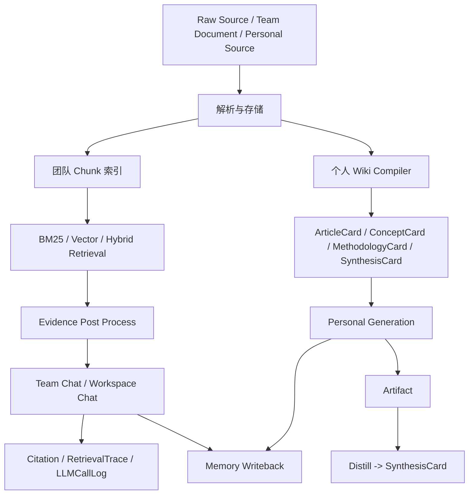
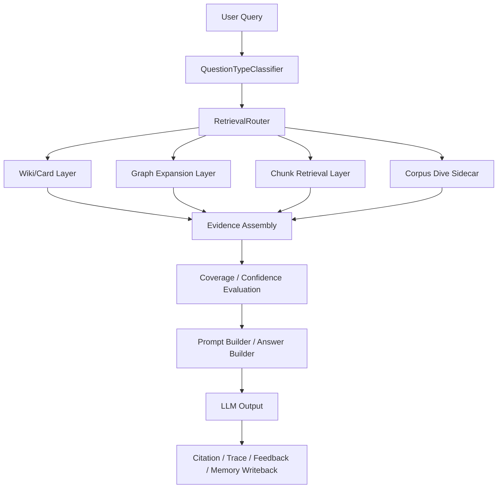

# NoteWeave 后端检索与 Wiki-First 改造方案

更新时间：2026-05-20

## 1. 文档目标

本文档用于系统整理 NoteWeave 当前后端方案，并给出一套可直接指导后续实现的改造蓝图。

本文档回答四个问题：

1. 当前 NoteWeave 后端已经实现了什么，架构边界是什么。
2. 当前方案在哪些地方已经足够好，哪些地方正在成为能力瓶颈。
3. 在不推翻现有路线的前提下，后端应该如何改造。
4. 改造后的目标架构、模块职责、数据模型、执行链路和实施顺序是什么。

本文档优先作为后端方案文档使用，不以界面展示为重点。

---

## 2. 相关现有文档与代码锚点

### 2.1 现有文档

建议与本文一起阅读：

- [docs/PROJECT_STATUS.md](/D:/java-projects/NoteWeave/docs/PROJECT_STATUS.md)
- [docs/CONTRACT.md](/D:/java-projects/NoteWeave/docs/CONTRACT.md)
- [docs/features/phase_4_team_rag_chat_citation.md](/D:/java-projects/NoteWeave/docs/features/phase_4_team_rag_chat_citation.md)
- [docs/features/phase_9_retrieval_enhancement_rrf.md](/D:/java-projects/NoteWeave/docs/features/phase_9_retrieval_enhancement_rrf.md)
- [docs/features/phase_12_long_term_memory.md](/D:/java-projects/NoteWeave/docs/features/phase_12_long_term_memory.md)
- [docs/features/phase_14_evaluation_observability.md](/D:/java-projects/NoteWeave/docs/features/phase_14_evaluation_observability.md)
- [docs/个人Wiki链路技术改造方案.md](/D:/java-projects/NoteWeave/docs/个人Wiki链路技术改造方案.md)

### 2.2 现有代码锚点

当前已经落地、与本文最相关的核心类：

- 团队检索
  - [RagProperties.java](/D:/java-projects/NoteWeave/src/main/java/com/noteweave/team/rag/config/RagProperties.java)
  - [Bm25Retriever.java](/D:/java-projects/NoteWeave/src/main/java/com/noteweave/team/rag/retriever/Bm25Retriever.java)
  - [VectorRetriever.java](/D:/java-projects/NoteWeave/src/main/java/com/noteweave/team/rag/retriever/VectorRetriever.java)
  - [HybridRetriever.java](/D:/java-projects/NoteWeave/src/main/java/com/noteweave/team/rag/retriever/HybridRetriever.java)
  - [WeightedReciprocalRankFusion.java](/D:/java-projects/NoteWeave/src/main/java/com/noteweave/team/rag/retriever/WeightedReciprocalRankFusion.java)
  - [EvidencePostProcessor.java](/D:/java-projects/NoteWeave/src/main/java/com/noteweave/team/rag/evidence/EvidencePostProcessor.java)
  - [TeamRagPromptBuilder.java](/D:/java-projects/NoteWeave/src/main/java/com/noteweave/team/rag/prompt/TeamRagPromptBuilder.java)

- 对话与 Trace
  - [TeamChatService.java](/D:/java-projects/NoteWeave/src/main/java/com/noteweave/chat/service/TeamChatService.java)
  - [RetrievalTraceService.java](/D:/java-projects/NoteWeave/src/main/java/com/noteweave/chat/service/RetrievalTraceService.java)
  - [RetrievalTrace.java](/D:/java-projects/NoteWeave/src/main/java/com/noteweave/chat/model/RetrievalTrace.java)
  - [RetrievalTraceItem.java](/D:/java-projects/NoteWeave/src/main/java/com/noteweave/chat/model/RetrievalTraceItem.java)
  - [ChatRuntimeService.java](/D:/java-projects/NoteWeave/src/main/java/com/noteweave/chat/runtime/service/ChatRuntimeService.java)
  - [ContextReadRouter.java](/D:/java-projects/NoteWeave/src/main/java/com/noteweave/chat/runtime/service/ContextReadRouter.java)

- 个人 Wiki 与生成
  - [WikiCompilerService.java](/D:/java-projects/NoteWeave/src/main/java/com/noteweave/personal/compiler/service/WikiCompilerService.java)
  - [EvidenceBacktraceService.java](/D:/java-projects/NoteWeave/src/main/java/com/noteweave/personal/compiler/service/EvidenceBacktraceService.java)
  - [ResearchContextService.java](/D:/java-projects/NoteWeave/src/main/java/com/noteweave/personal/generation/service/ResearchContextService.java)
  - [PersonalEvidenceService.java](/D:/java-projects/NoteWeave/src/main/java/com/noteweave/personal/generation/service/PersonalEvidenceService.java)
  - [PersonalGenerationService.java](/D:/java-projects/NoteWeave/src/main/java/com/noteweave/personal/generation/service/PersonalGenerationService.java)
  - [MethodologyMatcher.java](/D:/java-projects/NoteWeave/src/main/java/com/noteweave/personal/methodology/MethodologyMatcher.java)
  - [PersonalArtifactDistillationService.java](/D:/java-projects/NoteWeave/src/main/java/com/noteweave/personal/distillation/service/PersonalArtifactDistillationService.java)

- 记忆与长期上下文
  - [MemoryWritebackService.java](/D:/java-projects/NoteWeave/src/main/java/com/noteweave/memory/service/MemoryWritebackService.java)
  - [MemoryWritebackStrategy.java](/D:/java-projects/NoteWeave/src/main/java/com/noteweave/memory/service/MemoryWritebackStrategy.java)
  - [MemoryContextService.java](/D:/java-projects/NoteWeave/src/main/java/com/noteweave/memory/service/MemoryContextService.java)

---

## 3. 当前方案总览

### 3.1 当前产品后端分流

NoteWeave 当前并不是单一的“一个检索系统”，而是两条后端链路并存：

1. 团队知识空间
2. 个人研究工作台

当前总路线可以概括为：

```text
团队侧：Chunk-first / Hybrid-RAG / Citation-first
个人侧：Wiki-first / Card-first / Artifact-first / Distillation-first
```

### 3.2 当前总体架构



### 3.3 当前现状结论

按 [docs/PROJECT_STATUS.md](/D:/java-projects/NoteWeave/docs/PROJECT_STATUS.md) 与当前代码，以下能力已经实质存在：

- 团队文档上传、解析、切片、BM25 索引、向量召回、Hybrid Retrieval、Weighted RRF。
- 团队 Chat、Citation、RetrievalTrace、AnswerFeedback、WebSocket Runtime。
- 个人 Source 导入、WikiCompiler、ArticleCard / ConceptCard / SynthesisCard。
- Personal Generation 与 MethodologyMatcher。
- Artifact 与 Distillation 闭环。
- Long-term Memory 与 ContextReadRouter。

这意味着 NoteWeave 已经不是一个“从零开始设计的方案”，而是一个已经有清晰骨架、只差进一步升级检索层和回答层的系统。

---

## 4. 当前后端方案详细拆解

## 4.1 团队侧现有方案

### 4.1.1 数据流

```text
Document Upload
  -> Parse
  -> Chunk
  -> BM25 / Vector Index
  -> Team Chat Retrieval
  -> EvidencePostProcessor
  -> LLM Answer
  -> Citation / RetrievalTrace
```

### 4.1.2 当前优点

- 已经实现标准的 Hybrid Retrieval 主链路。
- 已经有 Citation 与 Trace，不是黑盒生成。
- 已经支持 WebSocket Runtime，可持续演进成长对话。
- 当前结构适合大多数“团队资料问答”场景。

### 4.1.3 当前限制

- 当前团队检索仍然偏“单轮 query -> topK -> 回答”。
- 虽然有 Trace，但还没有“按问题类型自动选检索策略”的路由层。
- WikiRetriever 在团队侧还是轻量位置，更多是高质量索引源，而非真正的研究层。
- 没有原始语料深挖层，复杂问题仍容易止步于 topK。

## 4.2 个人侧现有方案

### 4.2.1 数据流

```text
Source
  -> WikiCompiler
  -> ArticleCard / ConceptCard
  -> Methodology selection
  -> Personal Generation
  -> Artifact
  -> Distill
  -> SynthesisCard
```

### 4.2.2 当前优点

- 当前个人侧不是“原文堆 Prompt”，而是已经有结构化中间层。
- 已经有 Concept 归并、Evidence Backtrace、Synthesis 沉淀。
- 已经具备强于普通 RAG 的长期知识组织能力。

### 4.2.3 当前限制

- 当前个人链路更强在“生成”和“沉淀”，还不够强在“正式 answering”。
- `ResearchContextService` 仍偏向加载项目级上下文，而不是 query-aware narrowing。
- 还没有正式的 `wiki -> source backtracking -> insufficient material` 纠偏闭环。
- 没有把图结构正式纳入检索层。

## 4.3 记忆与可观测性现状

### 4.3.1 记忆层

当前已有：

- `SessionSummary`
- `SpaceMemory`
- `UserMemory`
- `ContextReadRouter`
- `MemoryWritebackStrategy`

这使得后续改造不必从零补“长期上下文”，而可以把它纳入检索路由的一部分。

### 4.3.2 可观测性

当前已有：

- `RetrievalTrace`
- `RetrievalTraceItem`
- `LLMCallLog`
- `AnswerFeedback`

这给后续“分层检索 + 多阶段回退 + corpus dive”提供了很好的审计基础。

---

## 5. 当前方案的主要问题

这里的“问题”不是现有方案错误，而是随着目标升级后，现有结构开始出现的瓶颈。

## 5.1 团队侧问题

### 5.1.1 缺少检索路由层

当前团队问答已经有：

- `Bm25Retriever`
- `VectorRetriever`
- `HybridRetriever`
- `WeightedReciprocalRankFusion`

但仍缺一层：

```text
Question -> classify -> choose retrieval mode -> retrieve -> answer
```

现在更像“无论什么问题，默认走同一套 Hybrid Retrieval”。

### 5.1.2 缺少深度问题的 bounded corpus dive

对于复杂问题，单次 topK 很容易不够。当前系统没有正式的：

- source backtracking
- archive/file-level dive
- query rewrite retry
- concept expansion

这意味着一旦 topK 没命中，系统只能回答“没找到”，而不是“向下钻一层再试试”。

## 5.2 个人侧问题

### 5.2.1 缺少正式 answering layer

当前个人侧重点是：

- 编译
- 生成
- 沉淀

而不是：

- 提问
- narrowing
- 纠偏
- 证据覆盖率评估
- traceable answering

这正是 [docs/个人Wiki链路技术改造方案.md](/D:/java-projects/NoteWeave/docs/个人Wiki链路技术改造方案.md) 已经指出的方向。

### 5.2.2 图结构还主要停留在知识组织层

当前已有：

- `ConceptCard`
- `ConceptRelation`
- `SynthesisConceptRelation`

但它们还没有正式进入“检索前扩展”和“回答候选构造”的核心路径。

## 5.3 系统级问题

### 5.3.1 当前两条链路还不够统一

团队侧偏：

```text
RAG Answering System
```

个人侧偏：

```text
Wiki-based Knowledge Building System
```

二者都合理，但缺少一个统一抽象：

```text
先选知识层
再选检索层
再选纠偏层
最后选输出层
```

### 5.3.2 Trace 已有，但还不够“回答驱动”

当前能记录“检索到了什么”，但未来还需要进一步记录：

- 为什么路由到这个 mode
- 为什么选了这些 card/source
- 哪些 evidence 最终进入回答
- 哪些结论证据不足
- 是否触发了 corpus dive
- budget 是否耗尽

---

## 6. 改造目标

本次改造不改变 NoteWeave 的总路线，目标不是把它做成开放式 autonomous agent，而是把它升级成：

```text
Wiki-first answering
+ graph-assisted retrieval
+ bounded source backtracking
+ corpus-dive sidecar
+ traceable outputs
+ explicit writeback
```

一句话概括：

> 从“团队 Hybrid RAG + 个人 Wiki 生成系统”，升级成“具备正式 answering layer 的分层知识检索与研究系统”。

---

## 7. 改造原则

## 7.1 不推翻现有团队/个人双链路

保留：

- 团队侧以 Chunk / RAG 为主
- 个人侧以 Wiki / Card 为主

但在更上层补统一的路由和纠偏能力。

## 7.2 不让 Graph 取代 Source

图结构应该作为：

- 扩 query
- 找邻域
- 发现缺口
- 支持 comparison

而不是替代 source evidence。

## 7.3 不让 corpus dive 成为默认路径

`grep / ripgrep-all / DCI-like direct corpus interaction` 只在高价值复杂问题触发，不应变成普通问答默认路径。

## 7.4 保持 traceable / bounded / reviewable

所有深度检索和纠偏都必须：

- 有 trace
- 有 budget
- 有选中的 evidence
- 有失败原因

---

## 8. 修改后的总体架构

## 8.1 目标架构概览



## 8.2 目标后端分层

改造后建议把后端知识检索分成五层：

### L0 元数据与权限层

负责：

- `spaceId`
- `knowledgeBaseId`
- `projectId`
- `sourceType`
- `document status`
- `activeIndexVersion`
- `owner/member permission`

### L1 稳定知识层

负责：

- `WikiPage`
- `ArticleCard`
- `ConceptCard`
- `MethodologyCard`
- `SynthesisCard`

### L2 图扩展层

负责：

- `ConceptRelation`
- `SynthesisConceptRelation`
- `Wiki link / page relation`
- `concept neighborhood`

### L3 原始证据层

负责：

- `DocumentChunk`
- `Source chunk`
- `BM25`
- `Vector`
- `RRF`

### L4 深度语料交互层

负责：

- `source backtracking`
- `query rewrite retry`
- `concept expansion retry`
- `ripgrep-all / corpus dive`

---

## 9. 修改后的方案详细设计

## 9.1 新增统一检索路由层

### 9.1.1 新增目标

新增一个显式的“问题分类与检索模式路由层”，把“所有 query 都走一个 retriever”升级为“根据问题类型选择最合适的知识层和证据层”。

### 9.1.2 建议新增枚举

```text
QuestionType
  FACT
  SUMMARY
  COMPARISON
  OPEN_RESEARCH

RetrievalMode
  FAST_RAG
  WIKI_FIRST
  WIKI_THEN_SOURCE
  GRAPH_EXPANDED
  CORPUS_DIVE
```

### 9.1.3 建议新增服务

```text
QuestionTypeClassifier
RetrievalRouter
RetrievalPlanBuilder
```

### 9.1.4 路由规则建议

#### FACT

```text
优先：ConceptCard / WikiPage / precise source chunk
必要时：BM25 boost
```

#### SUMMARY

```text
优先：SynthesisCard / ArticleCard / WikiPage
不足时：少量 source chunk 补充
```

#### COMPARISON

```text
优先：Graph 扩概念邻域
再做：多 source / 多 concept 对照检索
```

#### OPEN_RESEARCH

```text
优先：Wiki/Card narrowing
不够时：source backtracking
最后：bounded corpus dive
```

## 9.2 团队侧改造方案

### 9.2.1 保留现有主链路

保留现有：

- `Bm25Retriever`
- `VectorRetriever`
- `HybridRetriever`
- `WeightedReciprocalRankFusion`
- `EvidencePostProcessor`
- `TeamRagPromptBuilder`

这些不是要被替换，而是要被更上层的 router 编排。

### 9.2.2 新增团队检索路由

建议新增：

```text
com.noteweave.team.rag.routing
  TeamQuestionTypeClassifier
  TeamRetrievalRouter
  TeamRetrievalPlan
```

### 9.2.3 团队检索执行链

修改前：

```text
question -> HybridRetriever -> post-process -> answer
```

修改后：

```text
question
  -> classify
  -> build retrieval plan
  -> choose BM25 / Vector / Wiki / Graph expand / source retry
  -> assemble evidence
  -> evaluate coverage
  -> answer
```

### 9.2.4 团队侧新增 wiki-aware retrieval

当前团队侧 `WikiRetriever` 更像接口预留。改造后建议真正把 `WikiPage` 作为高权重知识层引入计划构造：

```text
FAQ / 标准流程 / 已发布方案
  -> 先查 WikiPage
  -> 不足再查 document chunk
```

这对团队常见问题非常有价值。

## 9.3 个人侧改造方案

### 9.3.1 目标

个人侧从：

```text
Wiki compile + generation
```

升级为：

```text
Wiki-aware answering + source-backed correction + traceable response + explicit writeback
```

### 9.3.2 建议新增服务

```text
PersonalAnswerService
PersonalAnswerQueryService
PersonalAnswerRetrievalService
PersonalAnswerRouter
PersonalAnswerTraceService
EvidenceCoverageService
```

### 9.3.3 个人提问接口建议

新增：

```http
POST /api/v1/personal/projects/{projectId}/ask
```

请求体建议：

```json
{
  "query": "某个概念和另一个概念的区别是什么？",
  "mode": "AUTO",
  "selectedSourceIds": [],
  "selectedCardIds": []
}
```

其中：

- `AUTO`
- `WIKI_ONLY`
- `WIKI_THEN_SOURCE`

### 9.3.4 个人 answering 目标链路

```text
query
  -> classify
  -> wiki/card narrowing
  -> evidence pack
  -> coverage evaluation
  -> if insufficient: source backtracking
  -> if still insufficient: material-insufficient response
  -> answer trace save
```

### 9.3.5 个人生成链路的影响

`PersonalGenerationService` 不应再默认读取“项目全量上下文”，而应逐步过渡为读取：

```text
retrieval-routed generation context
```

也就是说，生成和 answering 的底层选材逻辑应该逐步统一。

## 9.4 图增强检索方案

### 9.4.1 目标

把图从“知识组织层”升级成“检索增强层”。

### 9.4.2 建议新增服务

```text
ConceptNeighborhoodRetrievalService
GraphExpansionService
GraphEvidenceScorer
```

### 9.4.3 图的用途

图不负责直接回答，而负责：

- 补充 query 概念邻域
- 发现比较对象
- 给 source backtracking 提供候选方向
- 标记证据覆盖盲区

### 9.4.4 典型场景

例如用户问：

```text
Spring AOP 和动态代理在事务实现上有什么本质差异？
```

图扩展可帮助系统从：

- `Spring AOP`
- `Dynamic Proxy`
- `Transaction Interceptor`
- `Proxy Mode`
- `CGLIB`

这些邻域节点构造更合理的候选集合。

## 9.5 Source Backtracking 与 Corpus Dive 方案

### 9.5.1 目标

为复杂问题增加“下钻原始语料”的能力，但严格设定边界。

### 9.5.2 建议新增服务

```text
SourceBacktrackingService
QueryRewriteRetryService
CorpusDiveService
CorpusDiveBudgetService
CorpusDiveExecutor
```

### 9.5.3 典型执行顺序

```text
1. Wiki/Card 先检索
2. Coverage 评估不足
3. Query rewrite retry
4. Concept expansion retry
5. Source chunk backtracking
6. Corpus dive
7. 若仍不足 -> 明确返回材料不足
```

### 9.5.4 Budget 设计

必须记录并限制：

- 最大工具调用数
- 最大文件数
- 最大搜索时长
- 最大证据块数
- 最大 token 消耗

建议新增：

```text
corpus_dive_run
corpus_dive_run_item
```

### 9.5.5 与 ripgrep-all 的关系

`ripgrep-all` 更适合作为 sidecar adapter，而不是主检索实现。

建议定位：

```text
CorpusDiveAdapter
  PDF
  docx
  epub
  zip
  sqlite
  plain text
```

### 9.5.6 适用场景

只在以下场景触发：

- 高复杂度研究问题
- 用户明确要求原文级证据
- comparison 问题
- FAQ/Wiki 层覆盖不足
- 多文档边界条件问题

---

## 10. 修改后的数据模型建议

## 10.1 回答 Trace 模型

建议新增：

### answer_trace

```text
id
user_id
space_id
project_id
session_id
query
question_type
retrieval_mode
answer_text
coverage_score
confidence_score
status
created_at
```

### answer_trace_item

```text
id
trace_id
source_type
source_id
selected_reason
score
rank
used_in_final_answer
created_at
```

`source_type` 建议值：

```text
WIKI_PAGE
ARTICLE_CARD
CONCEPT_CARD
METHODOLOGY_CARD
SYNTHESIS_CARD
DOCUMENT_CHUNK
SOURCE_CHUNK
MEMORY_ITEM
CORPUS_DIVE_HIT
```

## 10.2 覆盖率模型

建议新增：

### evidence_coverage

```text
id
trace_id
coverage_score
confidence_score
insufficient_reason
missing_topics_json
created_at
```

### 10.3 corpus dive 模型

### corpus_dive_run

```text
id
trace_id
query
budget_limit
tool_calls
searched_files
status
latency_ms
created_at
```

### corpus_dive_run_item

```text
id
run_id
file_path
hit_type
snippet
score
selected
created_at
```

## 10.4 图扩展 trace 模型

如果后续需要更细审计，可增加：

### graph_expansion_trace

```text
id
trace_id
seed_node
expanded_nodes_json
reason
created_at
```

---

## 11. 修改后的模块拆分建议

## 11.1 建议新增包

```text
com.noteweave.retrieval.routing
com.noteweave.retrieval.coverage
com.noteweave.retrieval.backtracking
com.noteweave.retrieval.corpus
com.noteweave.graph.retrieval
com.noteweave.personal.answer
```

## 11.2 包职责建议

### com.noteweave.retrieval.routing

- `QuestionTypeClassifier`
- `RetrievalRouter`
- `RetrievalPlan`

### com.noteweave.retrieval.coverage

- `EvidenceCoverageService`
- `CoverageDecision`

### com.noteweave.retrieval.backtracking

- `SourceBacktrackingService`
- `QueryRewriteRetryService`

### com.noteweave.retrieval.corpus

- `CorpusDiveService`
- `CorpusDiveExecutor`
- `CorpusDiveBudgetService`
- `CorpusDiveAdapter`

### com.noteweave.graph.retrieval

- `ConceptNeighborhoodRetrievalService`
- `GraphExpansionService`

### com.noteweave.personal.answer

- `PersonalAnswerService`
- `PersonalAnswerRouter`
- `PersonalAnswerTraceService`

---

## 12. 关键执行链路对比

## 12.1 团队问答链路

### 修改前

```text
ask
  -> TeamChatService
  -> HybridRetriever
  -> EvidencePostProcessor
  -> TeamRagPromptBuilder
  -> LLM
```

### 修改后

```text
ask
  -> TeamQuestionTypeClassifier
  -> TeamRetrievalRouter
  -> Wiki / BM25 / Vector / Graph / Backtracking plan
  -> EvidencePostProcessor
  -> EvidenceCoverageService
  -> optional source retry / corpus dive
  -> TeamRagPromptBuilder
  -> LLM
  -> AnswerTrace / RetrievalTrace / Citation
```

## 12.2 个人问答链路

### 修改前

当前没有正式独立 answering 主链，只有 generation 主链。

### 修改后

```text
ask
  -> PersonalQuestionTypeClassifier
  -> PersonalAnswerRouter
  -> Synthesis / Concept / Article / Source narrowing
  -> EvidenceCoverageService
  -> optional source backtracking
  -> material-insufficient fallback or grounded answer
  -> AnswerTrace
```

## 12.3 个人生成链路

### 修改前

```text
ResearchContextService
  -> PersonalEvidenceService
  -> PersonalGenerationService
```

### 修改后

```text
RetrievalRouter
  -> RoutedGenerationContext
  -> PersonalEvidenceService
  -> PersonalGenerationService
```

这样生成与问答共享同一套“选材和证据控制”底层。

---

## 13. 对现有类的修改建议

## 13.1 团队侧

### TeamChatService

建议修改为：

- 不再直接决定始终走哪种 retrieval mode。
- 依赖 `TeamRetrievalRouter` 输出 `TeamRetrievalPlan`。
- 在回答前接入 `EvidenceCoverageService`。
- 在 coverage 低时触发有限次 retry/backtracking。

### HybridRetriever

建议保留，但降级为：

```text
一种可被 router 选择的 retrieval strategy
```

而不是所有问题的默认强绑定入口。

### EvidencePostProcessor

建议保留并增强：

- 支持来自不同知识层的 evidence block 统一归一化。
- 支持记录“最终被选中”和“仅候选未使用”。

## 13.2 个人侧

### ResearchContextService

建议修改：

- 从“项目全量上下文装配器”逐步演化为“按 retrieval plan 装配上下文”。

### PersonalEvidenceService

建议修改：

- 从“汇总证据”升级成“构建 answer/generation evidence pack”。
- 输出里增加 `coverage` 与 `selected_reason`。

### PersonalGenerationService

建议修改：

- 继续保留生成职责。
- 但上下文来源改为 router 输出，而不是全量 project dump。

### WikiCompilerService

建议保留，不作为本次重构重点。

它仍然是个人侧稳定知识层的核心生产者。

## 13.3 记忆侧

### ContextReadRouter

建议增强：

- 接入 `questionType` 和 `retrievalMode`。
- 允许复杂研究问题比普通问答加载更少历史对话、更多稳定 memory。

### MemoryWritebackService

建议增强：

- 对低 coverage deep-search 回答不要直接写入稳定 memory。
- 只对高 confidence 的最终回答或明确沉淀结果写入长期层。

---

## 14. 与外部方案的映射

## 14.1 对 WeKnora 的吸收

吸收的不是“全部 Agent”，而是：

- 快答 / 深研 / Wiki 模式的能力分层
- 任务编排
- 观察性
- 结构化知识界面背后的后端分层思想

不吸收的部分：

- 全开放 agent 自治
- 大量外部工具默认接入

## 14.2 对 LightRAG 的吸收

吸收：

- 图参与检索，不只参与展示
- 多级表示
- rerank / eval / observability 思维
- citation / trace 一体化

不吸收：

- 直接把全部逻辑替换成另一套 LightRAG 实现

## 14.3 对 ripgrep-all / DCI 的吸收

吸收：

- 原始文件深挖
- 多文件格式直接检索
- 作为复杂问题的 sidecar

不吸收：

- 把 direct corpus interaction 作为全部问题默认路径

---

## 15. 分阶段实施建议

## 15.1 第一阶段：先补正式 answering 层

优先级最高：

1. `QuestionTypeClassifier`
2. `RetrievalRouter`
3. `AnswerTrace`
4. `EvidenceCoverageService`

这一阶段完成后，NoteWeave 就不再只是“能检索 / 能生成”，而是“正式具备可路由、可解释的 answering 层”。

## 15.2 第二阶段：补纠偏与回溯

第二阶段做：

1. `SourceBacktrackingService`
2. `QueryRewriteRetryService`
3. `PersonalAnswerService`
4. `Team wiki-aware retrieval`

这一阶段完成后，系统会从“单轮 topK 系统”升级为“有纠偏能力的研究系统”。

## 15.3 第三阶段：补图增强检索

第三阶段做：

1. `ConceptNeighborhoodRetrievalService`
2. `GraphExpansionService`
3. comparison 问题专用计划

这一阶段完成后，图会真正进入检索层。

## 15.4 第四阶段：补 bounded corpus dive

第四阶段做：

1. `CorpusDiveService`
2. `CorpusDiveBudget`
3. `ripgrep-all adapter`
4. `corpus_dive_run` trace

这一阶段要非常克制，只对深度问题开放。

## 15.5 第五阶段：评测与策略收敛

第五阶段做：

1. answer trace 质量分析
2. coverage 指标分析
3. graph expansion 命中率
4. corpus dive 成本收益评估

---

## 16. 推荐的第一版落地范围

如果现在只做一版“收益最大、风险可控”的升级，我建议只实现下面这些：

### 必做

- `QuestionTypeClassifier`
- `RetrievalRouter`
- `EvidenceCoverageService`
- `AnswerTrace`

### 应做

- `PersonalAnswerService`
- `wiki -> source` backtracking

### 暂缓

- 完整图检索
- 完整 corpus dive
- 全开放 agent

---

## 17. 风险与取舍

## 17.1 风险：复杂度显著上升

一旦引入 router、coverage、backtracking、graph、corpus dive，链路会显著复杂。

控制方法：

- 分阶段做
- 每一层都落 trace
- 每一层都可开关

## 17.2 风险：图增强容易做成“看起来很强”

图的风险是展示效果很好，但回答提升不一定稳定。

控制方法：

- 先让图做 retrieval prior
- 不让图直接替代最终证据

## 17.3 风险：corpus dive 成本失控

direct corpus interaction 的最大问题不是概念错误，而是预算容易爆炸。

控制方法：

- 必须有限次
- 必须有限文件
- 必须有限时
- 必须记录命中收益

## 17.4 风险：Memory 污染

低覆盖率回答如果进入 Memory，会反向污染后续回答。

控制方法：

- 低 coverage 不写回
- deep-search 中间态不写回
- 只有稳定输出或显式确认结果才写回

---

## 18. 最终结论

当前 NoteWeave 的现有后端方案并不需要推翻。它已经有很好的基础：

- 团队侧已经有成熟的 Hybrid RAG 骨架。
- 个人侧已经有成熟的 Wiki/Card/Artifact/Synthesis 骨架。
- 记忆与可观测性也已经具备了后续升级基础。

真正需要做的，是补上一层：

```text
问题分类
-> 检索路由
-> 分层知识选择
-> 覆盖率评估
-> 有界纠偏
-> 可追溯回答
```

改造后的 NoteWeave，不应被定义为：

```text
又一个 RAG 系统
```

而应被定义为：

```text
一个 Wiki-first、graph-assisted、source-backed、traceable 的研究与知识系统
```

---

## 19. 建议的下一步实现清单

建议按以下顺序开工：

1. 新增 `QuestionTypeClassifier` 与 `RetrievalRouter`
2. 为团队问答接入 `TeamRetrievalPlan`
3. 为个人侧新增 `POST /api/v1/personal/projects/{projectId}/ask`
4. 增加 `answer_trace / answer_trace_item / evidence_coverage`
5. 改造 `ResearchContextService` 为 query-aware context assembly
6. 实现 `SourceBacktrackingService`
7. 最后再评估是否接入 `ripgrep-all` sidecar

如果把这份文档作为后续开发蓝图，建议下一份配套文档直接写成：

```text
Phase X: Retrieval Router / Personal Answering / Evidence Coverage
```

这样就能把“方案文档”直接收敛到下一阶段的可执行开发文档。
