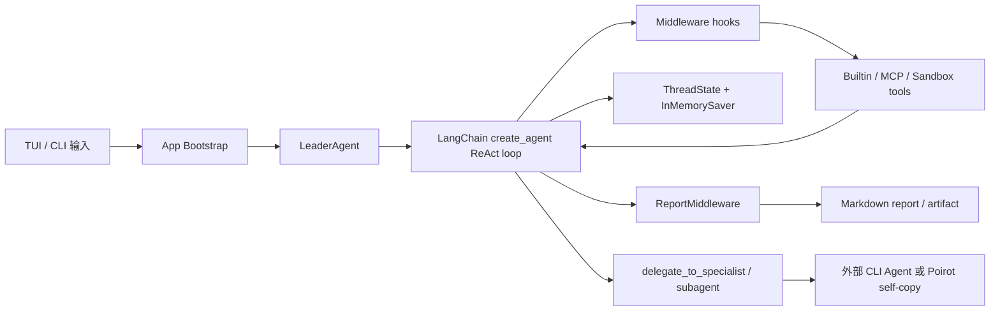
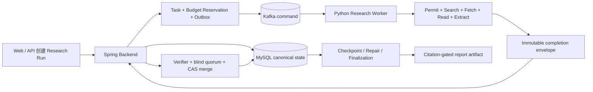

# Poirot 项目深度分析与 NoteWeave Research Agent 对比

> `[行业参考]` 本文的外部项目事实用于设计对照。NoteWeave 比较与建议属于 `[目标设计]`，不能替代当前源码、测试或生产证据。

> 调研日期：2026-07-29  
> 上游仓库：[`HezaoHezao/poirot`](https://github.com/HezaoHezao/poirot)  
> 源码基线：[`86bf279`](https://github.com/HezaoHezao/poirot/commit/86bf279ad90c180f0ba696755620dd7d6661465e)  
> 本地副本：[`reference/poirot`](../../reference/poirot)  
> 许可证：MIT  
> 对比对象：NoteWeave 的 Spring Backend、Python Research Worker、研究状态账本与分布式 Agent 执行链

## 结论

Poirot 和 NoteWeave Research Agent 都在做长程研究，但系统重心不同。

Poirot 是一个面向交互式研究的通用 Agent 内核。它用 LangChain `create_agent` 承载 ReAct 循环，把上下文治理、记忆、技能、沙箱、证据收集、反思、报告和多 Agent 委派拆成中间件。它最成熟的设计语言是“能力可插拔”：新增一项横切能力时，尽量不改 Leader Agent 主循环。

NoteWeave Research Agent 是一个面向结构化研究任务的服务端执行系统。它把研究问题编译为实体、行、单元格和证据任务，通过 Backend 维护任务、租约、预算、checkpoint、候选、验证和 CAS 合并，再由 Kafka Worker 执行 Search、Fetch、Read、Extract。它最强的部分是“结果可验证、执行可恢复”：模型和 Worker 不能直接改 canonical cell，报告只能消费已经通过验证的 durable ledger。

对 NoteWeave 最有价值的四项参考是：

- 把 Research Worker 的横切逻辑整理成显式 runtime hooks，降低 `runner.py`、`loop_runtime.py` 和执行器之间的耦合。
- 引入基于实际模型窗口的上下文预算，并把大体积工具结果外置，保留可追溯摘要。
- 把研究方法沉淀为可版本化的 skill/profile，但沿用 NoteWeave 的确定性评测和发布门，不让 LLM 自评直接改生产策略。
- 为不同 Agent runtime 建立统一 Specialist 接口，作为现有 Kafka task plane 的补充，不替代 durable task、lease、fencing 和 CAS。

不建议迁移到 Poirot 的整体运行模型。LangGraph 进程内 checkpoint、同步嵌套委派和启发式 URL 证据提取，不能替代 NoteWeave 已有的数据库真相、原子 completion、精确 cell-evidence binding 和分布式恢复。

## Poirot 的定位与规模

Poirot 自称 “A Deep Research Agent Kernel with Long-Term Memory”。从源码看，这个定位基本准确：它提供 TUI/CLI、ReAct Leader、MCP 工具、Docker/Local 沙箱、五层记忆、三层技能系统、多 Agent 委派和报告生成，适合单个用户在一个交互线程里持续研究、写文件和调用外部工具。

固定提交 `86bf279` 的静态规模如下：

| 项目 | 静态结果 | 说明 |
|---|---:|---|
| Git tracked files | 630 | `git ls-files` 统计 |
| Python files | 560 | 包含实现与测试 |
| Agent 实现 | 367 files / 33,726 lines | 排除 `backend/tests` 后的 Python/YAML/Markdown |
| 测试 | 244 files / 27,221 lines | 测试目录中的源码行 |
| 测试函数 | 2,721 | 按 `def test_` / `async def test_` 静态计数 |
| Middleware 文件 | 21 | `agents/middlewares/*_middleware.py` |
| 内建 Skill | 37 | core 12、research 11、software-development 8、creative 4、productivity 2 |

README 写的是 “2400+ tests” 和 “36 builtin skills”。当前提交的静态计数分别是 2,721 个测试函数和 37 个 `SKILL.md`，说明文档中的整数没有随仓库继续增长而更新。本次没有为 Poirot 新建环境并执行完整 pytest，因此这里只能确认测试资产的数量与覆盖面，不能把静态计数写成“本地全部通过”。

项目要求 Python 3.12+，核心依赖是 LangChain 1.x、LangGraph、Pydantic、MCP adapters、Rich、Textual 和 `ddgs`。Docker sandbox、Anthropic、Gemini、Ollama 都是可选依赖。[`pyproject.toml`](https://github.com/HezaoHezao/poirot/blob/86bf279ad90c180f0ba696755620dd7d6661465e/pyproject.toml)

## Poirot 的运行链路

Poirot 的核心是一个由模型驱动的 ReAct 循环，没有手工编写专用研究状态机。`make_lead_agent` 取得 researcher model 和工具集合，然后调用 LangChain `create_agent`，注入 `ThreadState`、checkpointer、system prompt 和中间件。[`leader/factory.py`](https://github.com/HezaoHezao/poirot/blob/86bf279ad90c180f0ba696755620dd7d6661465e/poirot/backend/agents/leader/factory.py)



`LeaderAgent` 本身很薄，只负责准备初始消息、设置 `thread_id`、`run_id`、递归上限和 runtime config，然后调用 `graph.ainvoke()`。Expert 模式从 `final_report` 取报告并保存 artifact，Default 模式只返回最后一条 AI 消息。[`leader/agent.py`](https://github.com/HezaoHezao/poirot/blob/86bf279ad90c180f0ba696755620dd7d6661465e/poirot/backend/agents/leader/agent.py)

这种架构把研究步骤的选择权留给 LLM。Default 模式允许模型直接回答、做一次搜索或多轮 ReAct；Expert 模式才强制 todo、充分性反思和自动报告。它适合开放问题和交互式探索，但研究过程的确定性弱于显式状态机。

## Poirot 的核心子系统

### Middleware 是主架构 seam

Poirot 把大多数横切行为放在 `before_agent`、`before_model`、`after_model`、`after_agent` 和 `wrap_tool_call` 等 hook 中。当前目录包含 21 个 middleware 文件，实际装配会根据配置和模式启用其中一部分：

- 上下文治理和标签化上下文；
- system context、skill suggestion、skill injection 和 skill metrics；
- title、run journal、MCP audit 和 sandbox；
- memory recall 与异步 consolidation；
- dangling tool-call 修复、tool-call ledger、multi-agent orchestration；
- evidence、stall detection、todo、reflection 和 report。

这让 Leader 的主体保持稳定。比如记忆召回只需要在 `before_model` 注入一条隐藏的 `HumanMessage`，证据归档只需要拦截搜索类工具，沙箱只需要包住工具调用，不必把这些分支写进 Agent 主循环。

装配顺序不是纯实现细节。上下文治理必须先于业务 prompt，memory recall 要放在 sandbox 之后、tool pairing 之前，ReportMiddleware 要等 Agent 停止后再综合 observations。Poirot 已经把这些顺序集中在 `_build_middlewares()`，比在多个 runner 中隐式调用更容易审查。

### 上下文治理按真实模型窗口决策

`DefaultStrategy` 维护一组上下文水位：40% 开始外置，50% 处理 thinking，60% 裁剪 observations，80% 总结，90% 停止新增工具调用，99% hard stop。窗口大小会穿透 `FallbackChatModel`，取得当前实际 provider 的 context window，而不是只读一个固定配置值。[`default/strategy.py`](https://github.com/HezaoHezao/poirot/blob/86bf279ad90c180f0ba696755620dd7d6661465e/poirot/backend/agents/context_engineering/strategies/default/strategy.py)

它同时使用两种手段：

- compaction 把较早消息归纳成摘要；
- externalization 把大体积内容写到线程目录，只把引用和摘要留在模型上下文。

NoteWeave 已经在 Search/Fetch/Read 阶段限制结果数、字节数和 read-window token，但“单次模型调用最终看到了多少上下文”还没有形成同样清楚的统一治理层。Poirot 的做法适合借到 LLM client 与 role executor 之间。

### 五层记忆与研究证据分开

Poirot 的长期记忆分为 schema/protocol、默认策略、store/retriever、recall middleware 和异步 consolidation。记忆类型包含 episodic、semantic、procedural，默认 Markdown store 以文件作为真相源，retriever 使用 BM25 等混合策略，命中后会回写访问次数和 strength。

设计上有两点值得保留：

- 原子 memory operations 不调用 LLM，LLM 只负责抽取和合并候选记忆。
- `ThreadState.recalled_memories` 只保存 id、score、strength，完整内容按调用注入，避免状态不断膨胀。

长期记忆不能直接当作研究 evidence。记忆会衰减、合并和重述，而 NoteWeave 的证据必须保留 snapshot、来源、quote、claim、relation 和 cell binding。更合适的接法是让记忆影响选题、偏好和 query planning；任何进入 canonical ledger 的事实仍要重新取得可追溯来源。

### 多 Agent 是 Leader 的工具能力

Poirot 提供两类委派：

- `delegate_to_specialist(goal, success_criteria)` 调用 pi、Codex 或 Claude Code 等外部 runtime。
- `delegate_to_subagent(goal)` 创建一个 Poirot self-copy。

Subagent 不继承父线程完整消息，只接收 goal 和 context summary；它继承同一个 sandbox id，且作为 leaf role 不能继续 spawn。外部 specialist 通过 MCP 连接同一个 Docker sandbox，产物最后汇总到 `ThreadState.orchestration`。[`multiagent/subagent.py`](https://github.com/HezaoHezao/poirot/blob/86bf279ad90c180f0ba696755620dd7d6661465e/poirot/backend/agents/multiagent/subagent.py)

Agent 选择仍由 Leader LLM 通过 tool call 决定，`OrchestrationMiddleware` 负责 metrics、错误转换和 artifact 汇总。当前 self-copy 契约是同步 spawn，适合单线程内的任务分工；它没有提供 NoteWeave 那种跨进程 durable task、lease、fencing、redelivery 和原子 merge。

### Skill 是可选择、可评测、可演化的过程知识

Poirot 明确区分 Skill 和 Tool。Skill 是注入 prompt 的方法知识，比如 source verification、deep research 或 systematic literature review；Tool 执行搜索、读取和文件操作。

基础层把 skill 与版本 DAG 存进 SQLite。`SkillSelector` 先过滤低有效率 skill，候选太多时再让 LLM 选择；LLM 失败则按历史 effective rate 排序。[`skill/selector.py`](https://github.com/HezaoHezao/poirot/blob/86bf279ad90c180f0ba696755620dd7d6661465e/poirot/backend/agents/skill/selector.py)

演化层执行 trigger、failure focus、LLM mutate、eval、score delta gate 和 create version。候选只有在评分高于 baseline 且没有 hard failure 时才进入新版本。[`skill/evolution/manager.py`](https://github.com/HezaoHezao/poirot/blob/86bf279ad90c180f0ba696755620dd7d6661465e/poirot/backend/agents/skill/evolution/manager.py)

这套机制的方向有价值，但当前 gate 的可信度取决于 eval bridge 提供的样本和分数。自动演化仍属于高风险能力，尤其是研究规范、来源策略和 verifier 规则。NoteWeave 可以借版本 DAG、选择指标和回退机制，不应让 LLM 生成的 skill 自动越过现有 gold-set、exact-table、citation 和错误 VERIFIED 门禁。

### Sandbox 同时处理隔离与产物持久化

Poirot 支持 Local 与 Docker provider。Docker 模式把 runtime、path translator 和 security guard 分开，并把 agent 写入限制在 `/mnt/poirot/user-data/`。`DockerPathGuard` 检查结构化写文件调用和 bash 绝对路径重定向，容器再提供第二层隔离。[`docker_path_guard.py`](https://github.com/HezaoHezao/poirot/blob/86bf279ad90c180f0ba696755620dd7d6661465e/poirot/backend/agents/sandbox/guards/docker_path_guard.py)

源码也明确写出了当前边界：guard 不解析 `cd` 后的相对路径，不检查 `tee`，只识别有限的重定向语法。它是一层实用约束，不是完整 shell policy parser。

NoteWeave Research Worker 的风险面不同。Worker 主要访问受控 HTTP、Backend internal API、Kafka 和研究工具，不需要任意 shell。现有 SSRF、IP pinning、content-type、size、prompt-injection 和 authoritative snapshot 策略更贴近研究采集。Poirot sandbox 更适合 NoteWeave 的 artifact/code specialist，不适合为了“架构统一”塞进每个 cell task。

### 证据与报告链路轻量，适合交互研究

`EvidenceMiddleware` 只拦截白名单中的搜索/浏览工具，从 `ToolMessage` 文本用正则抽 URL，截取前 800 字符形成 Observation，再写入 `sources` 与 `observations`。Source 按 URL 去重，Observation 关联当前 todo step。[`evidence_middleware.py`](https://github.com/HezaoHezao/poirot/blob/86bf279ad90c180f0ba696755620dd7d6661465e/poirot/backend/agents/middlewares/evidence_middleware.py)

`ReportMiddleware` 把 observations、sources 和 errors 交给 reporter model，prompt 要求每项事实标 `[source_id]`，并输出 Summary、Key Findings、Analysis、Sources 和 Information Gaps。[`report_middleware.py`](https://github.com/HezaoHezao/poirot/blob/86bf279ad90c180f0ba696755620dd7d6661465e/poirot/backend/agents/middlewares/report_middleware.py)

这条链能生成带来源的交互报告，但没有做到 NoteWeave 的 claim-level 校验：

- URL 来自工具文本正则，不是 provider 返回的结构化 source contract。
- Observation 只保留前 800 字符，缺少稳定 quote span、snapshot key 和 content hash。
- `ThreadState` 虽然定义了 Citation，但当前 evidence/report 主路径没有构造并验证 claim-citation association。
- Reporter 依靠 prompt 避免引用错配，没有独立 citation verifier 或 canonical evidence gate。

Poirot 的报告模型适合作为快速探索输出。需要对外发布、进入知识库或支持精确表格结论时，NoteWeave 的 Evidence Card、Cell Verifier、Global Verifier 和 citation audit 更可靠。

## Poirot 当前实现边界

### Thread checkpoint 不是进程级持久化

`get_checkpointer()` 当前返回全局 `InMemorySaver`。它能在同一进程里按 `thread_id` 续接 LangGraph state，进程退出后不会保留。[`runtime/checkpointer.py`](https://github.com/HezaoHezao/poirot/blob/86bf279ad90c180f0ba696755620dd7d6661465e/poirot/backend/agents/runtime/checkpointer.py)

Poirot 另有 run journal、artifact、memory store 和线程目录持久化，但这些不能自动重建完整 graph state。README 所说的长程会话能力需要区分“长期记忆保存在文件中”和“当前 ReAct 线程可在进程崩溃后精确恢复”。

### 能力丰富度高于默认开箱状态

记忆、技能演化、多 Agent、MCP 和 Docker sandbox 都需要环境变量、外部 runtime、镜像或可选依赖。部分 builtin skill 也在正文中说明原项目脚本未随 Poirot 一起提供，需要改用 `curl`、`gh` 或额外安装依赖。

因此项目更像一个模块齐全的 Agent kernel 和实验平台，开箱默认能力取决于 API key、Docker、MCP server、外部 CLI agent 和本机工具链。

### 自演化和同步委派更适合受控实验

Skill evolution 的 manager 当前按同步 cycle 运行，self-copy subagent 也是同步 spawn。它们便于测试与观测，但在高并发服务端场景会占住父调用，并把超时、取消、重试和成本控制压进嵌套调用栈。NoteWeave 已经有 durable task plane，不应退回这种执行方式。

## NoteWeave Research Agent 的架构

NoteWeave 把 Research 分成控制面和执行面。Spring Backend 是 canonical authority，Python Worker 只执行被授权的任务。



当前 Research Worker 已有 57 个实现文件、约 18,167 行；对应 Python tests 有 33 个文件、约 10,185 行和 331 个静态测试函数。Backend 的 `com.noteweave.research` 有 103 个主代码文件、约 12,030 行，定向测试另有 30 个文件、约 6,952 行。

### 研究状态以 entity、row、cell 和 evidence 为核心

`models.py` 定义 ResearchPlan、SearchHit、FetchedDocument、ReadWindow、EvidenceCard、StateRow、StateCell、VerifierDecision、IntentRequirement、StateLedger、LocalVerifierResult 和 GlobalVerifierResult。证据必须显式绑定 `entity_id + column_key`，required cell 全部通过后 row 才能 READY。[`models.py`](../../workers/research-worker/app/models.py)

这套模型让“搜到了一些资料”和“某个结论已经得到足够支持”成为两个不同状态。Poirot 的 observations 更接近研究笔记，NoteWeave 的 ledger 更接近可验证的数据产品。

### 研究循环是显式状态机

Worker 主链包含 Planning、Searching、Reading、Extracting、Verifying、Writing。每轮会计算 coverage、冲突、预算、恢复目标和 premature commitment guard，决定继续搜索、反事实复查、修复或提交。[`runner.py`](../../workers/research-worker/app/runner.py) [`loop_runtime.py`](../../workers/research-worker/app/loop_runtime.py)

这种显式阶段设计牺牲了一部分自由度，换来更稳定的 trace、预算统计、恢复语义和测试 seam。

### Backend 拥有任务与合并权

`ResearchAgentCoordinatorTickService` 根据 durable snapshot 决定 initial wave、repair、finalization 或失败。初始 wave 会经过 rollout guard；已有增量历史的 run 不允许退回 legacy 路径。[`ResearchAgentCoordinatorTickService.java`](../../backend/src/main/java/com/noteweave/research/ResearchAgentCoordinatorTickService.java)

`ResearchAgentTaskCoordinatorService` 在事务中创建 task、budget reservation 和 outbox。高风险 cell 会 fan-out 为两个独立 slot，分别使用 `DEEP_CELL` 和 `COUNTERFACTUAL` role，两个候选共享 quorum group，但有独立 task、lease、fencing、execution 和 budget。[`ResearchAgentTaskCoordinatorService.java`](../../backend/src/main/java/com/noteweave/research/ResearchAgentTaskCoordinatorService.java)

Worker 返回 immutable completion 后，Backend 才做 authoritative validation、blind verification 和 CAS。第一个高风险候选只能进入 durable staging；两个独立来源域得到一致结果后才允许改 canonical cell。当前实现边界见 [`DeepResearch-ResearchAgent架构文档.md`](../DeepResearch-ResearchAgent架构文档.md)。

### 可靠性来自数据库事务，不依赖 Agent 自律

NoteWeave 的运行正确性由 task status、lease epoch、fencing token、snapshot digest、append-only evidence/candidate、budget reservation、completion receipt 和 CAS 共同保证。Kafka 只负责至少一次唤醒。

当前 Research 执行面覆盖 taskization、outbox、Kafka、worker lease、atomic completion、checkpoint、repair、finalization 和报告 artifact。证据边界主要是 deterministic fake provider 与真实 MySQL/Kafka 隔离夹具；真实 provider 的质量、成本和延迟 A/B 仍未完成。当前架构见 [`DeepResearch-ResearchAgent架构文档.md`](../DeepResearch-ResearchAgent架构文档.md)。

## 逐项对比

| 维度 | Poirot | NoteWeave Research Agent | 判断 |
|---|---|---|---|
| 产品定位 | 交互式通用研究 Agent 内核 | 服务端结构化 Deep Research runtime | 面向场景不同 |
| 主控制流 | LLM 驱动 ReAct | 显式阶段、wave、cell task 和 verifier 状态机 | NoteWeave 更确定 |
| 扩展方式 | Middleware、Skill、Tool、MCP、Specialist | Python module、role profile、Java service、task snapshot | Poirot seam 更统一 |
| 研究状态 | Message、Todo、Observation、Source、Reflection | Entity、Row、Cell、Evidence、Candidate、Verifier、Checkpoint | NoteWeave 更细 |
| 证据采集 | 工具文本 URL 正则 + 800 字 Observation | snapshot、read window、quote、claim、relation、cell binding | NoteWeave 更强 |
| 引用验证 | Reporter prompt 约束 | association/support audit 与 section demotion | NoteWeave 更强 |
| 报告生成 | LLM 综合 observations | verified ledger 驱动结构化/确定性报告 | 适用场景不同 |
| 上下文治理 | 实际模型窗口、水位、摘要、外置 | 阶段预算和 read-window retention 为主 | Poirot 值得借鉴 |
| 长期记忆 | 五层 episodic/semantic/procedural memory | Research checkpoint、workspace source、报告回写 | Poirot 更完整，但语义不同 |
| Skill | 选择、指标、版本 DAG、演化、评测 | 固定 role/profile 和代码化策略 | Poirot 更灵活 |
| 多 Agent | Leader tool-call 委派，self-copy/外部 CLI | Backend task fan-out、Kafka Worker、quorum | NoteWeave 更耐故障 |
| 并发一致性 | Shared sandbox、结果回传 | lease/fencing、幂等 receipt、blind merge、CAS | NoteWeave 更强 |
| Checkpoint | LangGraph InMemorySaver | MySQL durable checkpoint 与 high-water mark | NoteWeave 更强 |
| 模型路由 | 多 provider fallback chain | per-purpose LLM policy、usage ledger、预算 | 可以互相借鉴 |
| 工具生态 | MCP 三种 transport、延迟加载、fallback | 受控 Search/Fetch/Read/Extract adapter | Poirot 更开放，NoteWeave 更收敛 |
| 安全 | Docker/Local sandbox + path guard | SSRF、IP pinning、prompt-injection、trusted permit、internal auth | 风险面不同 |
| 可观测性 | RunJournal、skill/memory/context events | progress/tool trace、DB lifecycle、budget/checkpoint/merge audit | NoteWeave 更偏服务端 |
| UI | Textual TUI + CLI | Web frontend + REST API | 产品形态不同 |
| 部署复杂度 | 单 Python 应用，可选 Docker/MCP/外部 Agent | Spring、Python Worker、MySQL、Redis、Kafka、MinIO、ES | Poirot 更轻 |
| 本地验证信号 | 2,721 个静态测试函数，未在本轮执行 | 项目文档记录 deterministic 与 MySQL/Kafka 回归，真实 provider 证据待补 | 两者都要保留证据边界 |

## NoteWeave 可以参考的设计

### P0：给 Research Worker 增加统一 runtime hook

当前 Worker 的 phase event、trace security、budget、cancellation、checkpoint、LLM usage、source profile 和 verifier 调用分散在 runner、loop runtime、role executor 和 adapter 中。可以先定义一个很小的 hook contract：

```python
class ResearchRuntimeHook(Protocol):
    def before_phase(self, context: PhaseContext) -> None: ...
    def after_phase(self, context: PhaseContext, result: object) -> None: ...
    def before_model(self, request: ModelRequest) -> ModelRequest: ...
    def after_model(self, request: ModelRequest, response: ModelResponse) -> None: ...
    def wrap_tool(self, call: ToolCall, next_call: Callable) -> ToolResult: ...
```

第一批只迁移纯横切能力：

- trace 与 secret redaction；
- token/cost usage ledger；
- cancellation 与 drain 检查；
- phase progress；
- context budget telemetry。

Planner、Evidence Ledger、Verifier、Merge Gate 和 checkpoint 状态转移仍保留显式调用。它们决定研究语义，不适合包装成看不见的副作用。

### P0：补一层真实模型上下文预算

Read Window 解决了“保留哪些网页片段”，还需要解决“某次 model call 到底装了多少 plan、ledger、evidence、history 和 tool output”。可以引入 `ModelContextEnvelope`：

```text
model purpose + provider/model
  -> resolve actual context window
  -> reserve output tokens
  -> allocate plan / evidence / history / tool-result budgets
  -> summarize or externalize overflow
  -> record model-visible manifest
```

外置内容要写 immutable artifact/snapshot，并把 hash、path、summary 和引用 id 写入 trace。不要只保存自然语言摘要，否则恢复后无法确认模型看到的原始内容。

### P1：把研究方法做成版本化 Skill Profile

NoteWeave 已有 `RoleProfileCatalog`，可以沿这个 seam 扩展，不必复制 Poirot 的整套 SQLite skill runtime。一个 Research Skill 至少包含：

- 适用的 intent、deliverable 和 source policy；
- query planning 规则；
- allowed tools 和预算上限；
- evidence 与 verifier 要求；
- report structure；
- benchmark cases 和最低门槛；
- version、parent version、status 和 rollback target。

初期只支持人工创建、人工启用和 deterministic evaluation。选择器可以用规则与历史指标，LLM 只给候选建议。任何版本发布都必须经过 NoteWeave 现有的 gold-set、citation support、exact-table、错误 VERIFIED、成本和稳定性门。

### P1：统一 Specialist Runtime 接口

Poirot 把 self-copy、Codex、Claude Code 和 pi 都适配为 specialist。NoteWeave 也可以为研究外的专门任务定义统一接口，例如代码仓库分析、数据计算、PDF 表格提取和 artifact 生成：

```text
SpecialistRequest
  goal
  immutable input refs
  allowed tools
  budget
  success criteria
  output contract

SpecialistResult
  status
  artifacts
  evidence refs
  usage
  failure class
```

适配器仍要落到 Backend task、snapshot、permit、completion 和 artifact contract。Leader 不能因为调用了外部 Agent 就绕过 durable authority。

### P1：把 Skill 评测接到现有 benchmark，而不是另建一套自评

Poirot 的 version DAG、effective rate、failure focus 和 score-delta gate 可以借鉴。评分源直接使用 NoteWeave 已有指标：

- entity/cell/row F1；
- exact-table 与 cell value accuracy；
- citation association/support；
- branch correction；
- unsupported claim 和错误 VERIFIED；
- token、cost、429/5xx、timeout；
- wall-clock 与有效并发；
- termination reason。

只有真实输入、固定 source snapshot 和可比较 manifest 才能晋级。LLM judge 可以作为补充维度，不能成为唯一 gate。

### P2：长期记忆只影响研究策略

NoteWeave 已有 Memory/Context 主线和 `save-report-as-source`。如果接入 Poirot 风格的 episodic、semantic、procedural memory，建议保持三条边界：

- 用户偏好、历史主题和研究方法可以进入 planning context。
- 历史研究报告可以作为 seed source，但必须保留 report/run/source provenance。
- 任何事实要进入新 run 的 verified ledger，都要重新绑定当前 evidence，不能因为“记忆里出现过”直接通过 verifier。

### P2：把沙箱留给需要执行代码的 Specialist

数据分析、代码执行、浏览器自动化和 artifact 构建适合独立 sandbox。普通 Search/Fetch/Read/Extract task 继续用最小权限 Worker、网络 allowlist、SSRF guard 和 trusted permit，避免每个 cell 都承担容器冷启动、镜像供应链和文件同步成本。

## 不建议照搬的部分

### 不用 LangGraph state 代替 canonical ledger

Poirot 的 `InMemorySaver` 适合交互线程，不能承担分布式 task ownership、原子 completion 和 crash recovery。即使后续换成 SqliteSaver，也不能自然替代 MySQL 中的 run、task、lease、candidate、merge、budget 和 checkpoint 事务。

### 不用 Observation 代替 Evidence Card

URL 加 800 字文本足够给 Reporter 提示，不足以验证某个 cell 的值。NoteWeave 应继续要求 snapshot、quote、claim、entity、column、relation、support score、source domain 和 evidence key。

### 不让运行中的 Worker 任意安装 MCP 或 Skill

Poirot 的动态生态适合个人 Agent。服务端 Research Worker 需要固定依赖、网络策略和可复现镜像。新 MCP、Skill 或外部 CLI runtime 应经过 registry、版本锁定、权限审查和 benchmark 后再部署。

### 不让自演化直接修改生产策略

Skill mutation 可以生成候选版本，不能自动发布。来源规则、verifier 门槛、预算和安全策略属于服务端 policy，必须人工审查并跑固定回归。

### 不用同步子 Agent 代替 Kafka task

同步 self-copy 很容易实现，但父调用会承担子 Agent 的超时、取消和资源占用。NoteWeave 已经解决了至少一次交付、lease takeover、fencing、幂等 replay 和 CAS，不应为了接口简洁丢掉这些能力。

## 推荐落地顺序

### 第一阶段：只整理 runtime seam

1. 定义 `ResearchRuntimeHook` 与 `ModelContextEnvelope`。
2. 迁移 trace、usage、cancellation、progress 和 context telemetry。
3. 为 hook 顺序、异常传播、重复执行和无副作用模式补契约测试。
4. 保持 planner、ledger、verifier 和 Backend API 行为不变。

验收重点是同一输入下的 candidate、evidence、merge 和 report digest 不变，新增 hook 不能改变 canonical 语义。

### 第二阶段：引入只读 Skill Profile

1. 从现有 `RoleProfileCatalog` 提取 profile schema。
2. 先做 `deep-research-default`、`github-repository-analysis`、`systematic-literature-review` 三个固定 profile。
3. 记录选择、应用、完成、fallback 和 benchmark score。
4. 只支持人工切换版本，不做自动 mutation。

这一步可以吸收 Poirot builtin research skills 的方法内容，但要修正其中对工具、脚本和 source contract 的假设。

### 第三阶段：做受控候选演化

1. 失败样本聚类产生 failure focus。
2. LLM 只生成候选 diff。
3. 用固定 manifest 执行 baseline/candidate 对照。
4. 质量不降、错误 VERIFIED 为零、成本不超预算后进入待审状态。
5. 人工批准后发布，保留一键 rollback target。

真实 provider 每种 mode 四轮 A/B 尚未完成前，这一阶段只能验证机制，不能声称策略质量提升。

### 第四阶段：扩展 Specialist 与 Memory

Specialist 先接低风险、结果容易验证的任务，比如代码仓库静态分析和数据计算。Memory 先用于 query planning 与用户偏好，不接 canonical verifier。两项都要复用现有 task、artifact、budget、trace 和权限边界。

## 最终判断

Poirot 最值得学的是模块边界。它把 Agent 主循环控制得很薄，记忆、技能、沙箱、上下文和委派都通过稳定 hook 接入，新增能力时不必继续扩大 Leader。

NoteWeave 不需要改成另一个 Poirot。现有 entity/cell/evidence ledger、dual verifier、Kafka task plane、lease/fencing、blind quorum、atomic completion 和 citation-gated report，是 Poirot 当前主路径没有覆盖的能力。更合适的方向是保留 NoteWeave 的研究正确性与分布式真相层，在 Python Worker 内吸收 Poirot 的 middleware、context governance、versioned skill 和 specialist adapter 设计。

## 一手源码索引

### Poirot

- [README](https://github.com/HezaoHezao/poirot/blob/86bf279ad90c180f0ba696755620dd7d6661465e/README.md)
- [使用说明](https://github.com/HezaoHezao/poirot/blob/86bf279ad90c180f0ba696755620dd7d6661465e/resource/USAGE.zh-CN.md)
- [Leader factory](https://github.com/HezaoHezao/poirot/blob/86bf279ad90c180f0ba696755620dd7d6661465e/poirot/backend/agents/leader/factory.py)
- [Leader agent](https://github.com/HezaoHezao/poirot/blob/86bf279ad90c180f0ba696755620dd7d6661465e/poirot/backend/agents/leader/agent.py)
- [Thread state](https://github.com/HezaoHezao/poirot/blob/86bf279ad90c180f0ba696755620dd7d6661465e/poirot/backend/agents/state/types.py)
- [State reducers](https://github.com/HezaoHezao/poirot/blob/86bf279ad90c180f0ba696755620dd7d6661465e/poirot/backend/agents/state/reducers.py)
- [Context strategy](https://github.com/HezaoHezao/poirot/blob/86bf279ad90c180f0ba696755620dd7d6661465e/poirot/backend/agents/context_engineering/strategies/default/strategy.py)
- [Evidence middleware](https://github.com/HezaoHezao/poirot/blob/86bf279ad90c180f0ba696755620dd7d6661465e/poirot/backend/agents/middlewares/evidence_middleware.py)
- [Report middleware](https://github.com/HezaoHezao/poirot/blob/86bf279ad90c180f0ba696755620dd7d6661465e/poirot/backend/agents/middlewares/report_middleware.py)
- [Skill selector](https://github.com/HezaoHezao/poirot/blob/86bf279ad90c180f0ba696755620dd7d6661465e/poirot/backend/agents/skill/selector.py)
- [Skill evolution manager](https://github.com/HezaoHezao/poirot/blob/86bf279ad90c180f0ba696755620dd7d6661465e/poirot/backend/agents/skill/evolution/manager.py)
- [Multi-Agent orchestration](https://github.com/HezaoHezao/poirot/blob/86bf279ad90c180f0ba696755620dd7d6661465e/poirot/backend/agents/multiagent/middleware.py)
- [Docker path guard](https://github.com/HezaoHezao/poirot/blob/86bf279ad90c180f0ba696755620dd7d6661465e/poirot/backend/agents/sandbox/guards/docker_path_guard.py)
- [LangGraph checkpointer](https://github.com/HezaoHezao/poirot/blob/86bf279ad90c180f0ba696755620dd7d6661465e/poirot/backend/agents/runtime/checkpointer.py)

### NoteWeave

- [Deep Research ResearchAgent 架构文档](../DeepResearch-ResearchAgent架构文档.md)
- [Research Worker models](../../workers/research-worker/app/models.py)
- [Research Worker runner](../../workers/research-worker/app/runner.py)
- [Research loop runtime](../../workers/research-worker/app/loop_runtime.py)
- [Role executor](../../workers/research-worker/app/role_executor.py)
- [Cell verifier](../../workers/research-worker/app/cell_verifier.py)
- [Citation verifier](../../workers/research-worker/app/citation_verifier.py)
- [Agent task consumer](../../workers/research-worker/app/agent_kafka_consumer.py)
- [Coordinator tick](../../backend/src/main/java/com/noteweave/research/ResearchAgentCoordinatorTickService.java)
- [Task coordinator](../../backend/src/main/java/com/noteweave/research/ResearchAgentTaskCoordinatorService.java)
- [Atomic completion service](../../backend/src/main/java/com/noteweave/research/ResearchAgentCompletionService.java)
- [Cell merge service](../../backend/src/main/java/com/noteweave/research/ResearchAgentCellMergeService.java)
- [Budget and checkpoint](../../backend/src/main/java/com/noteweave/research/ResearchBudgetAndCheckpointService.java)
- [Research Agent 当前架构](../DeepResearch-ResearchAgent架构文档.md)
