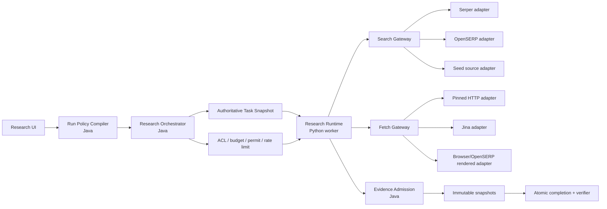

# Research Agent 网络研究与 Workspace 沉淀修复方案

> 基线日期：2026-07-18  
> 参考项目：[OpenSERP 项目深度分析](./OpenSERP-项目深度分析.md)、[Craft Agents OSS 项目深度分析](./Craft-Agents-项目深度分析.md)  
> 目标：构建类似 NotebookLM 研究能力的网络研究 Agent。用户必须先进入一个 Workspace，再从该 Workspace 的研究页或聊天中发起研究；Agent 结合研究问题、聊天上下文和可选资料，在公开网络上发现、抓取、筛选和验证来源，生成有引用的总结与报告，并把采纳的资料、研究笔记和报告沉淀回这个 Workspace。

## 1. 修改背景与结论

目前的实现不能简单描述为“Research Agent 只能搜索 Workspace”，但实际默认行为确实接近这一结果：

1. 前端不选择 Workspace 资料就不能创建 Research Run。
2. Java 创建 run 和 coordinator taskization 都要求至少一个 ready Workspace source。
3. Python worker 虽然是独立进程，但 task snapshot 携带 Workspace source samples；没有外部 provider key 时只运行 Workspace adapter。
4. 即使配置外部 provider，当前也是 Workspace + Web 混合，而且去重时无条件优先 Workspace hit。
5. 现有所谓 Workspace search 并未查询 Workspace 全文索引，只是在用户选中的 source title、summary 和单个 sample_text 上做轻量匹配。

因此，问题不是 Python worker 的部署位置，而是检索模式、任务权威和证据权威都被 `source_scope` 隐式控制。

这里必须区分两个不能混为一谈的概念：

1. **Workspace 归属是强制且唯一的。** Workspace 对应 NotebookLM 的 notebook，是一次 Research Run 的工作单位。Research 不能脱离 Workspace 创建，也不能在一次 run 中跨 Workspace；run、聊天上下文、权限、预算、任务、证据快照、报告、研究笔记和最终 Collection 都绑定发起时的同一个 `workspace_id`。
2. **Workspace sources 不是默认检索范围。** 进入某个 Workspace 只确定“研究属于哪里、使用谁的权限、成果保存到哪里”，不代表 Agent 默认只能检索该 Workspace 已有资料。已有资料只有在用户显式选择时才作为 seeds 或封闭语料参与研究。

因此，“Workspace 与搜索能力解耦”更准确的含义是：**不解除 Research 与 Workspace 的绑定，只解除 `workspace_id` 对检索语料范围的隐式控制。** 产品模型应表述为 `Workspace-bound, Web-capable Research`，而不是无 Workspace 的独立搜索 Agent。

正确修复不是删掉一处非空校验，而是明确“研究输入、网络调查、证据归档、报告生成、Workspace 沉淀”五个阶段，并引入显式的 evidence acquisition mode，贯通 UI、聊天、Run、task snapshot、adapter selection、permit、archive、completion 和 counterfactual repair。

推荐的产品语义是：

| 模式 | 外部 Web | Workspace seeds | 适用场景 |
|---|---:|---:|---|
| `WEB_ONLY` | 必须 | 禁止参与检索 | 默认 Deep Research、行业调研、项目调研、事实核查 |
| `WEB_PLUS_SEEDS` | 必须 | 可用作起点和对照 | 用户提供内部材料，同时要求外部补充和验证 |
| `SOURCES_ONLY` | 禁止 | 必须 | 私有资料总结、封闭语料审查、不能访问公网的任务 |

当前 Workspace 内的 Deep Research 页面和聊天 Deep Research 默认应为 `WEB_ONLY`。Workspace 继续作为 notebook 级工作单位，承担租户、ACL、配额、run/artifact 归属、聊天上下文、研究成果容器和凭据策略，但不再自动把“该 Workspace 已有 sources”解释为研究语料范围。

本次改造的核心决策如下：

| 决策 | 结论 |
|---|---|
| Research Agent 是什么 | 面向公开网络的研究、资料收集、证据验证、总结和报告 Agent |
| Workspace 是什么 | 类似 NotebookLM notebook 的唯一研究工作单位；是强制归属、权限与上下文边界，也是可选 seed 来源和成果沉淀容器 |
| 聊天是什么 | Research Brief 的上下文入口，不是默认事实证据 |
| 默认检索模式 | `WEB_ONLY` |
| 可选资料如何使用 | 显式选择 `WEB_PLUS_SEEDS` 或 `SOURCES_ONLY`，不能隐式混入 |
| 网络内容何时可信 | Fetch 后形成 immutable snapshot，并通过 Evidence Admission 后 |
| 搜索结果是否直接入库 | 否；只有实际采用/引用或用户选择的来源才提升到 Workspace |
| 最终产物 | Research Collection：来源、研究笔记、报告、引用和运行 provenance |
| OpenSERP/Craft/ref 的角色 | 提供局部新方法，不取代 NoteWeave 自己的研究领域模型 |

### 1.1 产品模型不是“一次搜索后回答”

推荐把一次研究建模为一个 `Research Collection`：

```text
研究问题或聊天上下文
  -> Research Brief
  -> Web discovery candidates
  -> fetched immutable snapshots
  -> admitted evidence set
  -> structured research notes
  -> cited report
  -> Workspace Research Collection
```

其中不同对象有不同生命周期：

| 对象 | 生命周期 | 是否进入 Workspace 资料库 |
|---|---|---:|
| Search candidate | 临时，只用于发现 | 否 |
| Fetched snapshot | run-scoped、不可变、可审计 | 默认否 |
| Admitted/cited source | 被报告或研究笔记实际采用 | 是，或由用户确认后提升 |
| Research note | claim、摘要、冲突、待验证问题 | 是 |
| Final report | 带引用的研究产物 | 是 |
| Research trace | 工具、预算、失败、verifier 记录 | 只进入审计层 |

不能把所有搜索命中自动写入 Workspace，否则很快会产生重复、低质量和未验证资料。推荐默认自动保留所有 immutable evidence snapshots，但只把报告实际引用的来源提升为 Workspace research sources；UI 再提供“保存其他候选来源”的操作。

### 1.2 本次改造不做什么

- 不重写整个 Research worker；优先复用现有 planner、ledger、verifier、lease/fencing、archive 和 completion。
- 不为了“多 Agent”而拆更多 Agent；只有 wide/deep/counterfactual 等任务确实需要独立状态和预算时才拆分。
- 不把 OpenSERP 变成新的核心领域模型；它只是 provider adapter。
- 不把聊天历史、search snippet 或模型 observation 直接当 evidence。
- 不自动把全部搜索候选写入 Workspace。
- 不让 provider 不可用时静默退回 Workspace-only，从而生成看似完成但没有网络研究的报告。
- 不把“报告生成成功”当作“研究可信”；citation、coverage、conflict 和 verifier 门禁继续保留。

### 1.3 改造前完成度与工作量判断

这不是从零建设。按 2026-07-19 工作树统计：

- Java Research 模块约 95 个生产文件、11,965 行，专项测试 29 个文件、186 个 `@Test`；
- Python research worker 约 59 个生产文件、18,192 行，专项测试 35 个文件、337 个 test function；
- 已具备 run/task、outbox、lease/fencing、checkpoint、search/fetch/read、external snapshot archive、evidence ledger、counterfactual、local/global verifier、atomic completion、citation manifest 和报告回写；
- 本轮抽测 search/fetch/deep-cell/archive client 共 70 项，全部通过；
- 当前 Surefire 报告中的 Research 相关 31 个 suite、253 项为 0 failure、0 error、10 skipped；全 Backend 636 项仍有 6 项非 Research failure，集中在早期 QA/Note/Wiki/Memory contract suite；
- 项目级审计扫描 1,346 个文件，测试/源码文件比约 23.9%，但未发现 CI workflow；`ResearchRunService`、`research_tools.py`、`reporter.py` 和前端 `App.tsx` 已是明显热点。

完成度应分层判断，不能只给一个百分比：

| 层面 | 改造前估计 | 判断 |
|---|---:|---|
| Research 执行与可靠性底座 | 75% 至 85% | 核心机制较完整，可直接复用 |
| Evidence、Verifier、Citation | 70% 至 80% | 明显强于多数参考项目，外部 evidence 链已存在 |
| 外部 Web research 可用性 | 45% 至 60% | adapters/archive 已有，但默认关闭且被 Workspace task 包裹 |
| 聊天驱动 Research | 30% 至 40% | 入口和结果卡已有，聊天上下文未进入实际规划 |
| Research Collection 与 Workspace 沉淀 | 25% 至 40% | 目前主要能保存最终报告，采用来源和 research notes 未形成 collection |
| 类 NotebookLM 的整体产品闭环 | 50% 至 60% | 后半段底座较强，前半段入口/发现和最后的资料沉淀缺口较大 |
| 生产发布准备度 | 50% 至 65% | Research 测试面可观，但整体仍有失败、无 CI、工作树改动很大 |

以上百分比是架构完成度估计，不是代码行完成率。当前最准确的描述是：**研究执行内核已完成大半，但产品入口、Web acquisition policy 和成果沉淀模型需要重构。**

工作量估计按一名熟悉现有代码的工程师计算：

| 范围 | 预计工作量 | 结果 |
|---|---:|---|
| P0 正确性修复 | 3 至 6 个工程日 | 修复 snapshot permit、risk/source 假设和关键回归测试 |
| P1 最短 Web-only 闭环 | 8 至 15 个工程日 | 无 seed 可从研究页/聊天完成外部研究和有引用报告 |
| P2 Provider registry + OpenSERP shadow | 6 至 12 个工程日 | provider 可替换、可降级、可观测 |
| P3 Tool Admission 与浏览器治理 | 8 至 15 个工程日 | query/URL/cost/domain 级准入和 browser fallback |
| P4 Web-aware verifier/counterfactual | 8 至 15 个工程日 | domain/source diversity、独立复核和 benchmark |
| P5 Research Collection | 12 至 20 个工程日 | adopted sources、notes、report、后续追问与增量研究 |

因此：

- 只做到正确的 Web-first MVP，即 P0 + P1，约 2 至 4 周；
- 做到可稳定内部使用，包括 P0 至 P3，约 5 至 8 周；
- 做到完整的类 NotebookLM 闭环，包括 P0 至 P5，约 8 至 14 周；
- 两至三人并行可以缩短日历时间，但 Java/Python 契约、migration 和端到端测试必须由同一架构 owner 统一，不能简单按人数线性折半。

当前工作树存在大量未提交改动，分支也领先远端。正式施工前应先建立可复现 baseline commit 和绿灯测试集合，否则很难区分本次 Research 改造与既有重构造成的回归。

## 2. 当前实现的真实链路

### 2.1 创建入口强制选择资料

前端 `startDeepResearch` 在 source 为空时直接返回，且请求模型只有 `source_scope_source_ids`，没有独立检索模式（[App.tsx](../../frontend/src/App.tsx#L796-L831)，[research/model.ts](../../frontend/src/features/research/model.ts#L9-L19)）。

Java 再次执行相同限制：

```text
resolveRequestedSourceScopeIds(...)
  -> empty
  -> RESEARCH_AGENT_SOURCE_SCOPE_REQUIRED
```

见 [ResearchRunService.java](../../backend/src/main/java/com/noteweave/research/ResearchRunService.java#L97-L101)。

### 2.2 Coordinator 把 Workspace source 当作任务成立条件

`ResearchAgentTaskCoordinatorService` 在普通 wave 和 counterfactual repair 中都先加载 Workspace source；为空就拒绝创建 task。任务 snapshot 的 `source_policy` 同时放入 source samples 和两个 external boolean（[ResearchAgentTaskCoordinatorService.java](../../backend/src/main/java/com/noteweave/research/ResearchAgentTaskCoordinatorService.java#L49-L97)）。

这造成三个问题：

- Web-only run 无法 taskize。
- 外部能力只是 Workspace task 的附加开关，不是独立 acquisition mode。
- counterfactual independence 只会按 Workspace source ID 分区，不能按 Web domain、URL、provider 或 snapshot 排除既有证据。

### 2.3 Python 的 Workspace search 不是 Workspace 全库检索

`run_workspace_search` 只遍历 task snapshot 中的 `source_scope`，根据 title、summary、sample_text 做字符串覆盖率评分（[search.py](../../workers/research-worker/app/search.py#L20-L70)）。它没有调用 Elasticsearch，也没有查询 Workspace 中未被选择的资料。

所以更准确的命名应该是 `SeedSourceSearchAdapter`，而不是 `WorkspaceSearchAdapter`。如果未来确实需要 Workspace 全库检索，应另建 `WorkspaceIndexSearchAdapter`，且只在用户显式选择的模式下启用。

### 2.4 外部链路已存在，但默认关闭且被 Workspace 包裹

已有能力包括：

- Serper-compatible 外部 search provider chain；
- Jina/HTTP fetch fallback；
- DNS 解析、公开 IP 检查、连接 pinning 和逐跳 redirect 校验；
- 外部 read window 归档到 `research_external_snapshot`；
- completion 只接受 `WORKSPACE` 或服务器确认的 `EXTERNAL_ARCHIVED` evidence；
- lease、fencing、atomic completion 和 evidence manifest。

但 Backend 的 `noteweave.research.agent.external-evidence-enabled` 默认是 `false`（[ResearchAgentExternalEvidencePolicy.java](../../backend/src/main/java/com/noteweave/research/ResearchAgentExternalEvidencePolicy.java#L6-L19)）。Deep cell executor 只有在 snapshot 同时允许 external search 和 fetch 时才构造默认外部 adapters，否则强制 Workspace-only（[deep_cell_executor.py](../../workers/research-worker/app/deep_cell_executor.py#L76-L90)）。

### 2.5 现有 Evidence authority 可以保留

外部 URL 内容在进入 atomic completion 前必须经 Backend 归档，并得到服务器生成的 snapshot key（[ResearchExternalSnapshotArchiveService.java](../../backend/src/main/java/com/noteweave/research/ResearchExternalSnapshotArchiveService.java#L34-L74)）。Completion 再从数据库加载归档内容，校验 source、quote 和 snapshot identity（[ResearchAgentCompletionCommitter.java](../../backend/src/main/java/com/noteweave/research/ResearchAgentCompletionCommitter.java#L432-L483)）。

这条链是正确方向，不应绕过。Web-first 改造应复用它，而不是让 search snippet 直接成为 citation。

### 2.6 另一个必须先修的 snapshot permit 风险

Coordinator 将新任务改为 `research-agent-task-snapshot.v2`，但 `ResearchAgentPermitService` 仍把 canonicalizer 的默认 `SCHEMA_VERSION`，即 v1，作为唯一允许值（[ResearchAgentPermitService.java](../../backend/src/main/java/com/noteweave/research/ResearchAgentPermitService.java#L18-L18)，[permit schema check](../../backend/src/main/java/com/noteweave/research/ResearchAgentPermitService.java#L97-L104)）。Completion 和 budget 模块已经显式支持 v1/v2，permit 没有同步。

应先增加 v2 permit 集成测试并修正为受支持版本集合，否则新的外部 search/fetch 可能在真实 v2 task 上被错误拒绝。

### 2.7 聊天入口已经存在，但上下文没有进入研究执行

聊天中选择 `DEEP_RESEARCH` 时，`ConversationTurnModule` 会创建 Research Run，但传给 `CreateResearchRunRequest` 的 question 仍只是当前消息 `command.content()`，可选资料仍来自 `command.sourceScope()`（[ConversationTurnModule.java](../../backend/src/main/java/com/noteweave/conversation/ConversationTurnModule.java#L347-L377)）。

系统也会创建 `run_input_snapshot`，保存 segment summary、recent message 和 memory revision 的引用（[RunInputSnapshotService.java](../../backend/src/main/java/com/noteweave/conversation/RunInputSnapshotService.java#L93-L128)，[context projection](../../backend/src/main/java/com/noteweave/conversation/RunInputSnapshotService.java#L174-L186)）。但是 Research coordinator 和 Python worker 没有消费这份 snapshot；它目前主要用于 replay/audit。

所以“从聊天发起”目前只完成了入口和结果回写，没有完成上下文驱动的研究。需要增加 `Research Brief Compiler`：

```text
latest user research request
+ frozen conversation prefix summary
+ recent message tail
+ explicit constraints and desired output
+ optional seed sources/attachments
-> immutable Research Brief
```

Research Brief 至少包含：

- `primary_question`：本轮明确研究问题；
- `background_context`：聊天中已经讨论的背景；
- `research_goal`：用户想做决策、学习、比较还是形成报告；
- `constraints`：时间、地区、对象、排除项、语言和深度；
- `known_assumptions`：聊天中出现但尚未验证的判断；
- `open_questions`：需要网络调查补齐的缺口；
- `deliverable`：摘要、对比表、完整报告或资料清单；
- `context_refs`：冻结的消息/摘要引用与 hash。

聊天内容是研究意图与背景，不自动成为事实证据。只有用户附件、显式 seed，或后续归档的网络页面才能进入 evidence authority。

## 3. 目标职责划分



### 3.1 Java 应负责

- Workspace ACL、租户与产物归属；
- 将用户输入编译成不可变 retrieval/evidence policy；
- task DAG、lease、fencing、budget、cancel 和 retry；
- 允许哪些 acquisition mode、provider alias、domain 和工具动作；
- 外部 snapshot 归档与 evidence authority；
- completion、citation、verifier 和 report commit。

### 3.2 Python worker 应负责

- query planning 和 recovery query；
- 按 task policy 选择 Search/Fetch/Browser adapter；
- provider 调用、结果归一、dedupe 和候选排序；
- fetch、read window、prompt-injection 标记和 evidence extraction；
- 将外部窗口提交 Backend 归档；
- 只提交已被服务器认可的 evidence reference。

### 3.3 Workspace 不再负责

- 默认搜索范围；
- 外部 provider 的启用与否；
- Web search 结果权威；
- 研究必须存在的先验语料。

### 3.4 Workspace 是研究成果的落点

一次完成的 Research Collection 应在 Workspace 中形成：

- 一个研究报告 artifact/source；
- 一组被报告实际引用的 Web source snapshots；
- 一组结构化 research notes，包括主要结论、冲突、限制和未决问题；
- report、notes、sources、conversation 和 research run 之间的 provenance links；
- 后续聊天可以继续追问、追加研究或从 checkpoint 恢复。

当前 `saveReportAsSource` 只把最终 Markdown 报告写成 `GENERATED_RESEARCH_REPORT` source（[ResearchRunService.java](../../backend/src/main/java/com/noteweave/research/ResearchRunService.java#L715-L766)）。需要新增 collection-level promotion，而不是只保存一个扁平报告文件。

建议新增的最小领域对象：

```text
research_collection
  id / workspace_id / research_run_id / conversation_id / title / status

research_collection_item
  collection_id / item_type(REPORT|SOURCE|NOTE) / ref_id / role / promotion_status

research_note
  collection_id / note_type / statement / evidence_refs / valid_at / stale_at / invalidated_at

research_source_promotion
  external_snapshot_id / workspace_source_id / promotion_status / promoted_at
```

第一阶段不必立即做复杂知识图谱，但 collection 和 provenance 必须先存在，否则报告、来源和后续追问仍是松散对象。

### 3.5 聊天与异步 Research Run 的关系

聊天中的 Deep Research 应创建独立、可恢复的异步 run，并在对话里放置进度卡和最终报告卡。两者通过引用关联，不共享可变执行状态。

关键规则：

- Run 创建时冻结 conversation cutoff；后续普通聊天消息不会悄悄改变正在运行的研究目标。
- 用户明确发送“调整研究范围、排除某网站、重点看某方面、停止研究”时，转成版本化 `ResearchControlCommand`。
- 已归档 evidence 不重写；调整目标后创建 plan revision 和新 task wave。
- 完成后的“继续研究”创建 child run，可把前一 collection 的 adopted sources/notes 作为可选 seeds，同时继续访问 Web。
- “基于这份报告回答”属于 collection QA；“再去网上核实”属于新的或恢复的 Research Run，不能混成同一个普通问答调用。

## 4. 需要建立的深模块

### 4.1 Run Policy Compiler

这是 Java 侧的第一个关键 seam。调用方只提交用户意图，模块返回服务器权威 policy。

```java
ResearchAcquisitionPolicy compile(
    String workspaceId,
    RetrievalMode mode,
    List<String> seedSourceIds,
    ResearchIntent intent
);
```

接口应隐藏：source readiness 校验、Workspace ACL、provider availability、默认预算、domain policy、locale、freshness、兼容旧请求和 feature flag。

核心不变量：

- `WEB_ONLY` 不得把 Workspace seed adapter 注入 worker。
- `WEB_PLUS_SEEDS` 至少有一个 seed，并允许外部 provider。
- `SOURCES_ONLY` 至少有一个 ready seed，并禁止外部网络工具。
- provider 不可用时显式失败，不得悄悄从 `WEB_ONLY` 降级为 Workspace-only。

### 4.1.1 Research Brief Compiler

独立研究页和聊天入口必须共用同一个小接口：

```java
ResearchBrief compile(ResearchEntryContext context);
```

`ResearchEntryContext` 可以来自 standalone form 或 conversation snapshot。模块内部负责上下文裁剪、summary + recent tail 组合、指代消解、约束抽取、未验证假设标注和 token budget。这样 planner 永远消费稳定的 `ResearchBrief`，不需要知道研究是从哪个 UI 发起的。

### 4.2 Search Gateway

Python 对 planner 暴露一个小接口：

```python
class SearchGateway:
    def search(self, request: SearchRequest) -> SearchBatch: ...
```

`SearchRequest` 只包含 queries、acquisition policy、budget、exclusions 和 run/task identity。Gateway 内部处理 provider routing、quota、partial success、dedupe、ranking 和 telemetry。

真实 adapters 至少有两个，因此这个 seam 是成立的：

- `SerperSearchAdapter`
- `OpenSerpSearchAdapter`
- `SeedSourceSearchAdapter`
- 测试用 `InMemorySearchAdapter`

必须拆出三个构造入口，不能继续用“默认 adapter 总是包含 Workspace”的方式：

```python
build_web_search_gateway(policy)
build_seed_search_gateway(policy)
build_hybrid_search_gateway(policy)
```

更理想的实现是一个 registry 根据 policy 选择 adapter，而不是让调用方知道构造细节。

### 4.3 Fetch Gateway

```python
class FetchGateway:
    def fetch(self, candidates: list[SearchCandidate], policy: FetchPolicy) -> FetchBatch: ...
```

内部 adapter 顺序建议：

1. pinned direct HTTP；
2. Jina reader；
3. OpenSERP raw extraction；
4. OpenSERP/browser rendered fallback。

OpenSERP 的价值主要在第 3、4 层，以及多引擎 discovery、typed partial failure、proxy/captcha 运行能力。它不应拥有 NoteWeave 的 evidence ledger 或 verifier。

### 4.4 Tool Admission

借鉴 Craft 的 pre-tool pipeline，将当前只按 `toolIdentity` 发 permit 的接口深化为按动作内容做准入：

```text
ToolActionRequest
  task_id / lease / fencing
  action: SEARCH | FETCH | BROWSER | ARCHIVE
  provider_alias
  query_digest or target_url
  expected_cost
  attempt
```

Java 返回 `ALLOW | BLOCK | MODIFY`，并附带 deadline、剩余预算、domain policy 和审计原因。

注意：Craft 的 pre-tool 思想值得借鉴，但不能照搬 `allow-all`。Research worker 应默认 deny，且 worker 不能自行扩大 task snapshot 中的 provider、domain 或预算。

### 4.5 Evidence Admission

将 Workspace evidence 和 Web evidence 的权威校验收敛到一个模块接口：

```java
AdmittedEvidence admit(EvidenceCandidate candidate, TaskAuthority authority);
```

内部可以暂时保留两种 adapter：

- `WorkspaceSnapshotEvidenceAdapter`
- `ExternalArchivedEvidenceAdapter`

调用 completion 的代码不应先假设 task 一定存在 Workspace sources。对于 `WEB_ONLY`，trusted seed map 可以为空，只要全部 evidence 都是有效的 `EXTERNAL_ARCHIVED`。

## 5. 新的运行契约

### 5.1 Create Research Run

建议请求增加：

```json
{
  "question": "...",
  "profile": "default",
  "entry_point": "CONVERSATION",
  "conversation_id": "optional",
  "context_snapshot_id": "optional",
  "retrieval_mode": "WEB_ONLY",
  "seed_source_ids": [],
  "web_policy": {
    "locale": "zh-CN",
    "time_range": "2025-2026",
    "allowed_domains": [],
    "blocked_domains": [],
    "preferred_provider": "AUTO"
  }
}
```

兼容期可以继续接收 `source_scope_source_ids`，但进入 policy compiler 后统一改名为 seeds。旧客户端未传 `retrieval_mode` 且 sources 非空时推断为 `SOURCES_ONLY`，避免改变旧行为。

从聊天发起时，`question` 保存用户当前指令，`context_snapshot_id` 指向冻结的对话投影；服务端据此生成 `research_brief_json`。不能让前端拼接整段聊天后作为一个巨型 question。

### 5.2 Research Run 持久化

建议新增 migration：

```text
research_run.retrieval_mode varchar(32) not null
research_run.retrieval_policy_json longtext not null
research_run.research_brief_json longtext not null
research_run.input_snapshot_id varchar(36) null
```

现有 `source_scope_json` 在第一阶段可继续保存 seed IDs，后续重命名或迁移为 `seed_scope_json`。不要继续让一个字段同时表达租户归属、允许来源和检索模式。

对话入口的 snapshot 应保存实际采用的 summary revision 和 recent message hashes；Research Brief 保存编译结果及 compiler version。这样既能复现，又不需要把聊天原文复制到所有 task。

### 5.3 Task snapshot v3

建议新建 v3，而不是继续扩张含义模糊的 `source_policy`：

```json
{
  "schema_version": "research-agent-task-snapshot.v3",
  "workspace_id": "owner only",
  "acquisition_policy": {
    "mode": "WEB_ONLY",
    "seed_sources": [],
    "search_providers": ["openserp", "serper"],
    "fetch_providers": ["http", "jina", "openserp"],
    "allow_browser": false,
    "locale": "zh-CN",
    "domain_allowlist": [],
    "domain_blocklist": [],
    "excluded_source_ids": [],
    "excluded_domains": [],
    "excluded_urls": []
  },
  "budget": {
    "search_calls": 4,
    "fetch_calls": 12,
    "browser_calls": 1
  }
}
```

Provider alias 不是密钥。真实凭据只存在 worker credential/config 模块中，snapshot 只声明服务器允许使用的逻辑 provider。

Task snapshot 还应携带 brief 的稳定引用或 task 所需的最小投影，例如 `primary_question`、当前 cell 的 research focus、constraints 和 brief digest。不要把完整聊天历史重复复制到每个 task。

### 5.4 明确失败，不做静默降级

| 情况 | 行为 |
|---|---|
| `WEB_ONLY` 但没有可用 Web provider | `RESEARCH_WEB_PROVIDER_UNAVAILABLE` |
| `WEB_PLUS_SEEDS` 只有 seeds、Web 不可用 | run 失败或等待，不退化成 `SOURCES_ONLY` |
| `SOURCES_ONLY` 没有 ready seed | `RESEARCH_SEED_SCOPE_REQUIRED` |
| URL 被 SSRF policy 阻止 | 记录 typed fetch failure，继续其他候选 |
| 搜索成功但内容无法归档 | 不允许进入 evidence/citation |
| provider 部分失败 | 保留其他 provider 结果和 typed partial errors |

## 6. 搜索与排序改造

### 6.1 删除 Workspace 固有优先级

当前 `_should_replace` 在重复结果中总是保留 Workspace hit。应改为统一排序特征：

- source authority；
- query relevance；
- freshness；
- primary/secondary source 类型；
- domain diversity；
- fetch/archive readiness；
- claim support；
- provider agreement，只作为候选优先级，不作为事实置信度。

Workspace seed 只是用户提供的输入，不天然比论文、官方文档、规范或项目源码更权威。

### 6.2 Search 与 Fetch 分开计费和失败

OpenSERP 支持 search 内嵌 extraction，但 NoteWeave 不应直接把它合并进核心契约。Search 返回 candidate，Fetch 生成 snapshot，两者分别有 budget、retry、telemetry 和错误类型。

### 6.3 OpenSERP 的推荐接入方式

第一阶段只接 `OpenSerpSearchAdapter`：

- 使用 dedicated engine 或小规模 mega search；
- 保存 engine occurrences 和 partial errors；
- cluster score 只用于候选排序；
- 不启用 request-supplied proxy URL；
- 通过内部 gateway 调用；
- image/commit 固定版本。

第二阶段再接 `OpenSerpFetchAdapter`：

- raw-first；
- JS-heavy 页面才 rendered；
- NoteWeave 自己执行 archive、hash、prompt-injection 和 citation location；
- 使用全局/per-run browser semaphore。

## 7. Counterfactual 与 verifier 改造

当前 counterfactual repair 通过排除 Workspace source IDs 寻找独立来源。Web-first 后应改成 evidence origin diversity：

```text
excluded_source_ids
excluded_snapshot_keys
excluded_urls
excluded_domains
preferred_source_classes
minimum_independent_domains
```

高风险和 quorum 也不能再由 `sourceCount >= 2` 推导。应根据以下信号决定：

- claim 类型和影响；
- verifier disagreement；
- 来源冲突；
- 单一 domain/provider 依赖；
- 时间敏感性；
- 用户要求的 assurance level。

对于高风险 Web claim，两个 candidate slot 应优先使用不同 domain/provider lane，而不是简单拆分 seed list。

## 8. 本地 ref 项目真正带来的增量

OpenSERP 和 Craft Agents 不是唯一参照，也不应该决定 NoteWeave 的产品形态。综合现有 `reference`，更有价值的是把各项目擅长的一段能力组合起来。

### 8.1 Marco DeepResearch：宽搜和深挖不是同一种任务

NoteWeave 已经吸收了 Table-as-Search、cell state 和 verifier，但下一步应更明确地区分：

- Wide discovery：快速发现候选实体、主题、观点和来源；
- Deep investigation：围绕一个候选补齐特定属性、claim 和反证；
- Coverage controller：依据未填 cell、来源覆盖和冲突决定继续搜索还是停止。

新增启发不是再复制一个多 agent 框架，而是让 Web discovery 先构建可见的研究地图，再把昂贵 fetch/LLM 预算投入最有价值的 gap。

### 8.2 ipvoov Craft-Agent：先澄清和侦察，再冻结计划

这个项目与 Craft Agents OSS 不是同一个项目。它的研究图包含 coordinator、background investigator、planner、human feedback、researcher 和 reporter。值得吸收三点：

1. 聊天问题含糊时，先形成 `clarified_research_topic`，但设置最大澄清轮数，避免一直追问。
2. Planner 前先做一轮低成本 background investigation，让计划建立在真实 Web landscape 上，而不是纯靠模型猜子题。
3. 计划可以经 human-in-the-loop 修改后再执行。

NoteWeave 可以实现为：`Research Brief -> reconnaissance -> proposed plan -> optional user edit -> execution`。对于用户要求“直接开始”的场景，跳过等待，但仍保留可回看的 plan revision。

### 8.3 MiroFlow：工具能力配置和完整 task trace

MiroFlow 将 search、reading、browser、code、vision、audio 等工具做成配置化 profile，并把 sub-agent 暴露为 tool；`TaskTracer` 持久化主/子 agent 消息、步骤、失败和最终结果。

NoteWeave 不必复制它的通用 agent loop，但可以借鉴：

- `Research Capability Profile`：不同研究类型声明允许的工具组合；
- provider/tool 配置与 planner 分离；
- 每个 subtask 有稳定 session/task identity；
- context limit、tool timeout、provider error 是结构化 trace，不是日志字符串；
- benchmark profile 和生产 profile 使用同一个 runtime contract。

### 8.4 WeKnora：Web 发现之后要有正式的知识提升流程

WeKnora 同时具备 Web search、URL import、知识库、自动 Wiki 和多来源接入。对 NoteWeave 最有价值的不是它的 ReAct loop，而是“Web 页面可以从外部候选提升成正式知识条目，再生成互联知识产物”的产品闭环。

因此 NoteWeave 应增加：

- `Promote cited sources to Workspace`；
- URL source 的解析、索引、版本和原始 snapshot 关联；
- Research Collection 内的 source/report/note 关系；
- 从研究报告生成 Wiki/知识页的后续动作，而不是在研究 worker 中直接写 Wiki。

### 8.5 Marginalia：研究成果应形成可失效、可复用的调查笔记

Marginalia 的 retrieval funnel 先查 prior investigation journal 和 metadata，再读原文；journal 引用的资料变化后会标记 stale，后续结论直接冲突时会 invalidated，但仍保留审计历史。

这对 NoteWeave 的长期价值很高：完成报告后不应只留下 Markdown，还应生成结构化 research notes；未来研究可召回这些 notes，但必须重新检查它们引用的 source snapshot 是否仍有效。旧报告结论不能永久作为当前事实。

### 8.6 A-MEM 与 PlugMem：保存可复用知识单元，不保存原始轨迹噪声

研究 trace 适合审计，不适合直接进入长期记忆。应从研究成果中提取：

- semantic notes：事实、概念、结论和适用时间；
- procedural notes：有效查询、可靠来源路径和验证方法；
- episodic references：指向原 Research Run，不把整段轨迹塞进 prompt。

这些 notes 需要 promotion gate、来源引用、有效期和后续反馈，不应自动把模型生成的所有总结提升为 Workspace knowledge。

### 8.7 OpenSERP 与 Craft Agents OSS：补基础设施和策略 seam

- OpenSERP 补多引擎 discovery、raw/rendered fetch、代理/captcha 和 typed partial failure；
- Craft Agents OSS 补 source 按需激活、backend/tool 解耦、pre-tool admission、session 恢复和 remote protocol；
- 两者都不提供 NoteWeave 需要的完整 evidence/verifier/report-to-workspace 模型。

### 8.8 Gemini、OpenAI Deep Research 与 NotebookLM：作为产品基准，不作为源码模板

这些商业产品的内部 planner、搜索调度、模型路由和 evidence implementation 没有完整开源，因此不能从 UI 行为反推确定架构。NoteWeave 应把它们当作产品验收参照：

- 没有上传资料时，也能从聊天或独立入口发起网络研究；
- 系统能把模糊上下文整理成研究目标，必要时澄清或展示计划；
- 用户能看到研究进度、来源和报告，而不是只等待一个不可解释的长回答；
- 网络资料与最终报告分开管理，来源可以进入一个可继续问答的研究集合；
- 报告有可追踪引用，后续可以围绕已有 collection 继续提问或追加研究。

这些是产品目标，不是对其内部实现的断言。本方案的实现依据仍以 NoteWeave 当前源码、公开 ref 源码和可测试的本地契约为准。

## 9. 分阶段实施

### 9.0 总体路线图

| 阶段 | 主要目标 | 核心交付物 | 进入下一阶段的门槛 |
|---|---|---|---|
| P0 | 修复现有执行正确性 | snapshot permit、risk policy、真实端到端测试 | v2 task 可完成 permit/archive/completion |
| P1 | 无资料也能网络研究 | Research Brief、`WEB_ONLY`、external-only evidence | 从聊天或研究页零 seed 完成有引用报告 |
| P2 | Provider 可替换和可测量 | Search/Fetch Gateway、registry、OpenSERP shadow | provider 切换不改 planner/evidence 模型 |
| P3 | 外部工具治理 | action-aware permit、域名/预算/浏览器策略 | 每次 search/fetch/browser 都可审计和阻断 |
| P4 | 提升研究可信度 | Web-aware counterfactual、来源多样性、benchmark | 报告质量由 evidence/citation 指标验证 |
| P5 | 沉淀到 Workspace | Research Collection、source promotion、research notes | 来源、笔记、报告可追溯并支持继续研究 |

实施原则：P0/P1 先修正确语义和最短闭环，不应等 OpenSERP、浏览器或复杂多 agent 全部完成后才开放 Web research。现有 Serper + HTTP/Jina + external archive 已足以完成第一条可验证链路。

### P0：修复现有正确性问题

1. `ResearchAgentPermitService` 显式支持 task snapshot v1/v2，并增加 coordinator v2 task 到 permit 的集成测试。
2. 为现有外部 archive completion 路径增加真正从 coordinator claim 到 permit、fetch、archive、completion 的端到端测试。
3. 将 `sourceCount >= 2` 的 high-risk 推导替换成显式 risk policy，至少先与 source 数量解耦。
4. 给现有 Workspace adapter 重命名或加注释，明确它是 selected seed snapshot matcher，不是 Workspace index retrieval。

### P1：打通 `WEB_ONLY`

1. API 增加 `retrieval_mode` 和 `seed_source_ids`。
2. 前端删除“至少选择一份资料”的启动限制，默认 `WEB_ONLY`。
3. 聊天入口用冻结的 conversation projection 编译 `ResearchBrief`，不再只传当前消息。
4. `ResearchRunService` 按 mode 校验，不再无条件要求 source。
5. Coordinator 允许空 seed scope，为 task 写入 acquisition mode 和 brief digest。
6. Python 按 mode 精确选择 adapters，`WEB_ONLY` 不构造 seed adapter。
7. Completion authority 允许 trusted Workspace map 为空，只接受 server-archived external evidence。
8. 外部 provider 不可用时显式失败，不回退到 Workspace。

### P2：建立 provider registry

1. 提取 `SearchGateway` 和 `FetchGateway`。
2. 将 Serper、HTTP、Jina 变成 registry adapters。
3. 接入 OpenSERP search adapter，做 shadow benchmark。
4. 将 provider attempts、partial errors、cost、latency、result adoption 写入 trace。
5. Worker 启动或 heartbeat 上报 provider capabilities，Java 不再只靠静态 boolean 猜测 worker 能力。

### P3：统一工具准入与外部抓取

1. Permit 请求增加 provider/query/url/cost/attempt。
2. 引入 domain/robots/rate/budget/prompt-injection admission。
3. OpenSERP raw/rendered 成为 Fetch Gateway fallback。
4. 增加每个 run 的 browser concurrency、网络字节和 archive size 限制。

### P4：Web-aware counterfactual 与质量评估

1. repair exclusions 扩展为 domain/URL/snapshot/provider。
2. verifier 加入 independent domain 和 source-class coverage。
3. 构建固定中英 research benchmark，对比 Serper、OpenSERP single、OpenSERP mega 和组合策略。
4. 用 evidence adoption、citation correctness、contradiction discovery 和最终报告质量决定 provider routing，而不是只看搜索命中率。

### P5：Research Collection 与 Workspace 沉淀

1. 建立 collection、report、research note、admitted source 的关系模型。
2. 完成报告时自动创建 collection，并将实际引用的外部 snapshots 提升为可索引 URL sources。
3. 保留 run-scoped snapshot 与 Workspace source version 的双向 provenance。
4. UI 展示“已采用来源、其他候选、研究笔记、报告、未决问题”，允许用户选择额外保存来源。
5. 后续聊天可基于 collection 继续追问或发起增量研究，但必须检查旧 notes 的 stale/invalidated 状态。

## 10. 文件级改造清单

| 层 | 主要文件 | 改造 |
|---|---|---|
| Frontend | `frontend/src/App.tsx` | 删除 source 必选；增加 retrieval mode；调整创建说明 |
| Frontend model | `frontend/src/features/research/model.ts` | 增加 `retrieval_mode`、`seed_source_ids`、web policy |
| Run API | `CreateResearchRunRequest.java` | 增加 mode/policy，兼容旧 source 字段 |
| Run creation | `ResearchRunService.java` | 按 mode 编译 policy；允许 Web-only |
| Chat research | `ConversationTurnModule.java`、`RunInputSnapshotService.java` | 冻结聊天上下文并编译 Research Brief |
| Bootstrap | `ResearchAgentRunBootstrapService.java` | high risk 与 sourceCount 解耦 |
| Coordinator | `ResearchAgentTaskCoordinatorService.java` | 允许空 seeds；写 acquisition policy；Web-aware repair |
| Snapshot | `ResearchAgentTaskSnapshotCanonicalizer.java` | 增加 v3 和 acquisition policy canonicalization |
| Permit | `ResearchAgentPermitService.java` | 先修 v2；后升级 action-aware admission |
| Worker model | `models.py` | 引入 RetrievalMode/AcquisitionPolicy；`source_scope` 迁移为 seeds |
| Planner | `planner.py` | source query family 仅在有 seeds 时出现；Web-only stop contract 不受 seed 数压制 |
| Search | `search_adapters.py` | 拆出 registry；删除 Workspace 固有优先；增加 OpenSERP adapter |
| Seed search | `search.py` | 重命名并明确只处理 seed snapshots |
| Fetch | `fetch_adapters.py` | registry、OpenSERP raw/rendered fallback、统一 typed errors |
| Executor | `deep_cell_executor.py` | bool `allow_external` 改为 mode/policy；Web-only 不注入 seed adapter |
| Archive | `ResearchExternalSnapshotArchiveService.java` | 保留权威归档；补大小、content type 和 provenance 字段视需要迁移 |
| Completion | `ResearchAgentCompletionCommitter.java` | 允许 external-only evidence authority；不要求 Workspace trusted map 非空 |
| Repair | `ResearchAgentGapProjectionService.java` | exclusions 扩展为 domain/URL/snapshot/provider |
| Promotion | `ResearchRunService.java`、source ingest 模块 | cited external snapshot 提升为 Workspace source；创建 Research Collection |

## 11. 测试矩阵

至少覆盖：

| Mode | Seeds | Web provider | 期望 |
|---|---:|---:|---|
| `WEB_ONLY` | 0 | 可用 | 只产生 external search/fetch/archive evidence |
| `WEB_ONLY` | >0 | 可用 | seeds 被忽略或请求被拒，不能隐式混入 |
| `WEB_ONLY` | 0 | 不可用 | 明确 provider unavailable |
| `WEB_PLUS_SEEDS` | >0 | 可用 | 两条 lane 都执行并统一排序 |
| `WEB_PLUS_SEEDS` | >0 | 不可用 | 不静默降级 |
| `SOURCES_ONLY` | >0 | 任意 | 不产生任何外部网络请求 |
| `SOURCES_ONLY` | 0 | 任意 | 创建阶段拒绝 |

还需要：

- v1/v2/v3 snapshot canonicalization 和 permit；
- external URL SSRF、redirect、DNS pinning corpus；
- search provider partial failure；
- snapshot archive replay/idempotency/conflict；
- external-only atomic completion；
- source/domain diversity counterfactual；
- cancellation、lease expiry、fencing 和 archive race；
- citation 必须引用 immutable snapshot，不得引用 snippet；
- provider budget exhaustion 和 browser concurrency。

## 12. 验收标准

改造完成至少满足：

1. 用户不上传、不选择任何 Workspace source，也能创建并完成 `WEB_ONLY` Research Run。
2. `WEB_ONLY` 的 task snapshot、trace 和测试能证明没有调用 seed/Workspace adapter。
3. 最终 citation 全部对应服务器持久化的 external snapshot；search snippet 不能直接成为 evidence。
4. `SOURCES_ONLY` 在有 Web credentials 的环境中仍不会发出外部请求。
5. `WEB_PLUS_SEEDS` 能显示每条 evidence 来自 seed 还是 external archive。
6. provider 缺失、SSRF block、partial failure、budget exhaustion 都是显式状态，不被伪装成“没有资料”。
7. counterfactual repair 能排除既有 domain/URL/snapshot，而不只排除 Workspace source ID。
8. OpenSERP 可以替换、降级或关闭，而不修改 planner、verifier 和 evidence domain model。
9. 从聊天发起时，Research Brief 能稳定复现所采用的上下文，而聊天内容本身不会被误当作外部事实证据。
10. 完成后 Workspace 中同时存在可追溯的报告、研究笔记和实际采用来源，而不是只有一份孤立 Markdown。

## 13. 最终建议

不要把改造目标设成“给现有 Workspace search 再接 OpenSERP”。那会继续保留错误的中心模型，只是多一个外部 adapter。

应将系统重心改成：

```text
Research Intent
  -> explicit acquisition policy
  -> provider-independent Search/Fetch gateways
  -> immutable evidence admission
  -> verifier/counterfactual/citation
```

OpenSERP 提供可自托管的多引擎 discovery 和 raw/rendered fetch 能力；Craft 提供 backend/tool/source/session 解耦和 pre-tool admission 的工程模型；NoteWeave 保留并深化自己的 Research Planner、任务租约、evidence ledger、atomic completion、verifier 和 provenance。

这样得到的才是独立 Research Agent：它属于某个 Workspace，但不被该 Workspace 的资料范围定义。
