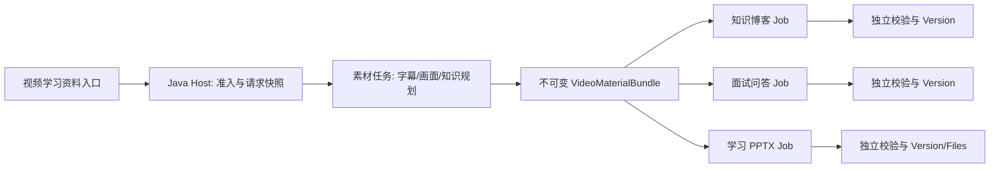

# bili-2-ppt 与 NoteWeave 产物能力升级评估及改造计划

> 2026-09-26 核对。上游固定在 [`5ebdd759`](https://github.com/ewkzcz/bili-2-ppt/tree/5ebdd759f9493855b82e49ab1d92319b272f906c)；原工作区的参考克隆位于 `reference/bili-2-ppt`。本文是方案评估，不代表下面的能力已接入 NoteWeave。

## 结论

最有价值的升级是把 B 站视频变成**可复用的、带时间与画面证据的学习资料包**，再从同一份资料包派生 PDF、学习文章、面试问答和 PPTX。优先补强现有 `bilibili_course_note_pdf`，之后再开放新产物。直接安装上游 Skill 不能代替 NoteWeave 的 Workspace 授权、异步任务、文件版本与验证契约。

## 当前实现与增量

| 能力 | NoteWeave 当前源码 | 上游可借鉴点 | 判断 |
| --- | --- | --- | --- |
| B 站链接与字幕 | `bilibili_course_note_pdf`、`video_summary`、`course_notes` 已在 Java/Python Catalog；系统 MCP 可取 B 站字幕，取不到可走 ASR | 手工字幕、网页 AI 字幕、本地 ASR 分级兜底；取到后立即纠错并统一术语 | 补强，不重复建字幕入口 |
| 画面证据 | 当前 `export_artifact_if_required` 只把标题、章节正文和 URL 交给 PDF 渲染器；没有把截图清单送进该导出路径 | 按时间采样、连续画面去重、保留最后完整帧、覆盖不足时局部补采 | 第一优先级；让“图文讲义”有可核验的图 |
| 知识组织 | 已有通用结构化笔记、学习指南、测验题和思维导图；各 Skill 没有共享视频知识树输入 | `notes.plan.json` 对齐定时字幕、术语、知识点和画面；新版可按时间段自动分派画面 | 建一个受 Schema 管理的中间资料包，多个交付物共用 |
| Markdown 学习材料 | 现有通用 Skill 能生成文本，但没有“知识博客文章”和三段式面试问答的固定格式 | `描述.md` frontmatter + `案例.md` 扩展模板，结构校验脚本 | 可先以两个新 Skill 或模板版本试点 |
| 演示文稿 | 当前 Catalog 无 PPTX Skill；既有调研把 `SLIDE_DECK` 放在下一阶段 | 原图版和原生图形版、逐步动画、模板设计语言、PPTX 结构与渲染校验 | 新增较大能力；先交付原图版，再评估图形版 |
| 可恢复与交付 | NoteWeave 已有 Artifact Job、Version、File、Verifier 与导出路径 | 上游按阶段保存清单并复用已有中间结果 | 复用现有控制面，不另建一套任务和文件真源 |

当前实现依据：[Java Skill Catalog](../../backend/src/main/java/com/noteweave/artifact/ArtifactSkillCatalogService.java)、[Python Skill Catalog](../../workers/artifact-worker/app/artifact_skill_catalog.py)、[系统 MCP 注册](../../workers/artifact-worker/app/system_mcp_registry.py)、[PDF 导出](../../workers/artifact-worker/app/export_runtime.py)、[既有演示文稿调研](./Artifact可视化产物与MCP-Skill集成调研.md)。

上游依据：[总流程](https://github.com/ewkzcz/bili-2-ppt/blob/5ebdd759f9493855b82e49ab1d92319b272f906c/SKILL.md)、[字幕纠错](https://github.com/ewkzcz/bili-2-ppt/blob/5ebdd759f9493855b82e49ab1d92319b272f906c/bili-subtitle-asr/references/subtitle-correction.md)、[画面采集与去重](https://github.com/ewkzcz/bili-2-ppt/blob/5ebdd759f9493855b82e49ab1d92319b272f906c/bili-keyframes/SKILL.md)、[时间段画面分派](https://github.com/ewkzcz/bili-2-ppt/blob/5ebdd759f9493855b82e49ab1d92319b272f906c/bili-knowledge-tree/scripts/assign_frames.py)、[文档模板](https://github.com/ewkzcz/bili-2-ppt/blob/5ebdd759f9493855b82e49ab1d92319b272f906c/bili-document-builder/SKILL.md)、[PPTX 交付与校验](https://github.com/ewkzcz/bili-2-ppt/blob/5ebdd759f9493855b82e49ab1d92319b272f906c/bili-pptx/SKILL.md)。

## 建议落地顺序

### 1. 先补视频资料包和 PDF 的画面链路

输入保留 B 站 URL、语言和用户约束；新增 `part`、画面密度与是否允许 ASR 等明确参数。一次获取后冻结 `VideoMaterialManifest`：视频/分集标识、字幕原文与纠错稿及来源、时间段、画面清单与去重关系、覆盖缺口、术语表、知识节点到字幕和画面的引用，以及每个文件的摘要。中间文件存在 Run Sandbox；版本和文件元数据仍由 Artifact 控制面管理。

从这份资料包生成 `bilibili_course_note_pdf`。每个含图章节的图必须有画面引用；没有对应画面的章节可以保留文字，但需记录覆盖缺口。验证字幕时间与画面所属分集、图片文件可读、引用存在、PDF 可打开和关键页可渲染。把字幕和画面获取拆成可恢复阶段，避免重新生成 PDF 时再次抓视频。

**验收**：同一输入重跑可复用资料包；一份有画面的测试视频生成的 PDF 中实际出现对应画面；断言不同分集或错误时间段的图无法通过验证；无字幕时能明确报告 ASR 路径或失败原因。

### 2. 从同一知识树派生学习文章和面试问答

新增 `knowledge_blog` 和 `interview_qa` 两种明确产物契约，或先在当前学习类 Skill 上建立版本化模板。共用知识节点、术语表和证据引用；面试问答固定“简要回答 / 详细问答 / 相关知识”。上游模板机制可借鉴，但模板必须作为发布版本的一部分，经服务端 Schema、大小和内容校验后才能进入生产运行。

**验收**：同一资料包生成两份文档，术语与关键结论一致；缺少证据的断言被标记为待核实；模板结构错误在提交 Artifact Version 前失败。

### 3. 新增视频学习 PPTX

新增 `video_learning_deck` Skill、页清单和 PPTX File Contract。先做“原图版”：按知识节点排页、每页绑定画面和文字证据，导出 PPTX 与逐页预览，校验页数、溢出、字体、文件可打开和画面引用。再加分步动画。最后单独试点“原生图形版”，并要求与原图版逐页对照人工抽检；不要把模型重绘结果自动当作已核实的视觉事实。

既有调研中的 Marp 适合快速得到可演示 PPTX，但普通导出的内容通常不可编辑；上游 `python-pptx` + OOXML 路线更接近“图形版可编辑”和逐步动画，代价是模板复刻、字体和跨环境渲染验证。产品应明确区分原图版与图形版的可编辑范围。

**验收**：一段固定视频得到页序、字幕要点和画面一致的 PPTX；逐页预览可读；动画与图形版分别通过结构校验和人工抽检后才对外标称可用。

## 集成边界与风险

- 上游主要是 Agent Skill 与本机浏览器工作流，不是现成的端到端服务。其浏览器会话脚本可能复制 `Local State`、`Cookies` 等登录配置到临时 profile；后台 CDP、登录态与临时目录不能直接搬进多用户 Worker。服务端应使用隔离浏览器、显式凭据策略、域名允许列表、受控存储和登录态副本清理。优先用无登录样本试点，需登录的素材再设计授权路径。[会话脚本](https://github.com/ewkzcz/bili-2-ppt/blob/5ebdd759f9493855b82e49ab1d92319b272f906c/scripts/browser_session.py)
- 上游知识树仍由 Agent 编写，脚本只在已有时间段上辅助分派画面；图形版是 Agent 对照截图绘制原生形状，并非自动 OCR 或矢量化。去重依赖画面相似度启发式，小幅文字变化可能漏掉。Markdown/PPTX 的脚本校验不能证明重绘或字幕纠错准确；需保留原字幕与纠错稿的差异、画面接触图和抽检记录。[画面分派](https://github.com/ewkzcz/bili-2-ppt/blob/5ebdd759f9493855b82e49ab1d92319b272f906c/bili-knowledge-tree/scripts/assign_frames.py)、[去重实现](https://github.com/ewkzcz/bili-2-ppt/blob/5ebdd759f9493855b82e49ab1d92319b272f906c/bili-keyframes/scripts/dedupe_frames.py)
- 多集长视频可能带来 ASR、截图、预览和 LLM 成本。资料包按阶段保存、按内容摘要复用，并给每阶段独立预算与失败原因。
- 上游一键环境配置可能安装依赖并下载大型 ASR 模型；服务端应在部署时固定依赖，运行中只执行能力检查和按需启用。[环境发现脚本](https://github.com/ewkzcz/bili-2-ppt/blob/5ebdd759f9493855b82e49ab1d92319b272f906c/scripts/discover_env.py)
- 上游代码为 [MIT](https://github.com/ewkzcz/bili-2-ppt/blob/5ebdd759f9493855b82e49ab1d92319b272f906c/LICENSE)。若复制代码或模板，保留许可与归属；视频画面、字幕的使用范围另按素材授权与平台规则处理。

## 详细改造计划：与简历主张保持一致

### 设计目标和事实基线

本轮只把知识博客、面试问答、学习 PPTX 作为三个**独立的 Artifact Skill**；产品界面提供一个“视频学习资料”入口，可勾选任意组合。三者共享一次素材获取和一版知识规划，但各自拥有 Job、Run、Verifier、Version 和文件结果。现有 `bilibili_course_note_pdf` 继续作为可选第四种交付物及回归样本。普通 `course_notes`、`quiz_pack` 和 `video_summary` 不改名、不改变已有请求语义。

简历中的“Schema 驱动”应落到输入、**中间资料包、各产物 IR、文件 Manifest** 四层可执行契约，而不只是 Catalog 列一个输入字段表。目前 Java 与 Python 分别维护 Skill 清单；Java 的 `ArtifactSkillDefinition` 只有 `inputSchema`，Worker 的 `output_contract` 是字符串列表；`verifier.py` 以章节、短语和几个特例检查。PDF 在 `runner.py` 中先导出后运行最终 Verifier。`artifact_file` 唯一键是 `(artifact_version_id, file_format)`，Host 下载是 PDF 专用接口。这些是实施前要修的实际扩展点，不能在完成之前写成已有的生产能力。依据：[Catalog](../../backend/src/main/java/com/noteweave/artifact/ArtifactSkillCatalogService.java)、[Worker 模型](../../workers/artifact-worker/app/models.py)、[Verifier](../../workers/artifact-worker/app/verifier.py)、[Runner](../../workers/artifact-worker/app/runner.py)、[文件迁移](../../backend/src/main/resources/db/migration/V023__productionize_artifact_files_and_outbox.sql)、[文件导出](../../backend/src/main/java/com/noteweave/artifact/ArtifactExportService.java)。

### 目标调用关系

Java Host 持有 Workspace 授权、发布目录、请求快照、任务/Outbox、素材包元数据、文件 Manifest、Version 和下载权；Python Worker 只执行已发布的 Graph、MCP 获取、结构化生成、局部修复、渲染和候选校验。素材包只在同一 Workspace、同一受控输入摘要下复用，不跨 Workspace 借用字幕、画面或 Cookie。父请求负责展示总进度，其状态由素材任务和子 Job 推导；任何一个子 Job 失败都不回滚其他已 READY 的产物。

简历提到的“MCP 接入音视频转写与内容理解”需要拆成可核对的能力：现有系统 MCP 注册只暴露 B 站字幕获取；本轮在 P2 增加受控的画面观察能力（例如 `ANALYZE_FRAME`），传入受权限约束的图片 File ID 和摘要，返回画面中实际可见的代码、图、表、文字及“不确定”标记。它只产观察候选，不自行决定知识树、下载任意 URL 或提交 Version；语音内容仍走现有字幕/ASR 路径。MCP 的输入输出都要落 Operation Receipt，Host/Worker 再把观察结果与字幕时间段对齐。这样“内容理解”有真实工具契约，也有可追溯的证据来源。[当前系统 MCP 注册](../../workers/artifact-worker/app/system_mcp_registry.py)

### 四份 Schema 与稳定接口

| 契约 | 最小字段与不变量 | 所属模块 |
| --- | --- | --- |
| `SkillDefinition v2` | `skill_key`、`version`、`input_schema`、`output_schema_ref`、`graph_key`、`prompt_recipe_id`、`required_file_roles`、能力允许列表、发布摘要 | Host 的发布 Catalog；Worker 核对同一摘要 |
| `VideoMaterialBundle v1` | `workspace_id`、BVID/分集、输入摘要、字幕来源和原文/纠错稿、带起止时间的段、画面 File ID/实际时间/摘要、去重及覆盖日志、知识节点与证据引用、缺口、素材版本 | Host 保存元数据和不可变文件；Worker 产候选 |
| `KnowledgePlan v1` | `section_id`、标题、术语、要点、`transcript_segment_ids[]`、`frame_ids[]`、`missing[]`；每个引用必须属于同一素材版本和分集 | 共享规划模块 |
| `ArtifactCandidate v2` | `skill_key`、`schema_version`、`material_bundle_id/version`、类型化内容 IR、证据边、`required_files[]`、运行/发布摘要 | Worker 返回候选，Host 验证后提交 |

`required_files[]` 每项包含 `role`（如 `PRIMARY_PPTX`、`SLIDE_PREVIEW`、`SOURCE_MD`）、`variant`、`sequence_no`、MIME、大小、SHA-256、受控暂存定位符；不能把 Worker 的绝对路径当成可下载文件。知识博客 IR 是章节与引用；面试问答 IR 是分类、问题、简答、详答、相关知识和引用；PPTX IR 是页清单、逐页文字、画面引用、布局/动画步骤。Markdown、PPTX、PNG 由这些 IR 渲染，用户看得见的文件从同一候选版本产生。

发布目录建议保留**一份机器可读的 Skill 定义源**，由构建流程打包给 Java/Python 并校验 digest；前端继续从 `GET /api/v2/skills` 取表单 Schema。Host 只支持明确列出的 JSON Schema 子集和文件角色，未知字段、能力或版本直接拒绝。不要把任意模板脚本、PPTX 代码或 MCP 描述文本当作可信发布策略。这个模块的外部接口保持为“按 key/version 解析并校验一个 Skill”，模板、Graph、Prompt 和 Renderer 的复杂性留在实现内部。

### 请求、持久化与恢复

建议新增 `POST /api/v2/workspaces/{workspaceId}/video-learning-bundles`，请求只含受控 URL/分集、语言、选中的 `knowledge_blog | interview_qa | video_learning_deck`、字幕/画面策略和明确的模板版本；响应返回父请求 ID、素材状态及每个选中产物的独立状态。`GET .../{bundleId}` 返回父请求、素材版本和子 Job 链接。旧 `POST .../artifact-jobs` 保持兼容，现有 PDF Skill 可继续单独创建。

新增父请求记录、不可变素材包元数据和父子 Job 关联。创建父请求时在 Host 校验 Workspace、URL、分集和用户能力，冻结选择与策略，事务内创建素材 Task 和 Outbox。**素材 READY 后**再用固定素材版本为三个产物各创建原有 `artifact_job`、`artifact_job_run`、输入快照、Task 和 Outbox；同一选项的重复调度以父请求 ID＋Skill Key 去重。这样子 Run 的快照不会指向尚未存在的素材版本。

再生成某一产物默认复用原素材版本，只创建该 Job 的新 Run/Version；用户要求重新抓视频时生成新的素材版本，并显式选择哪些产物随之再生成。生产过程中的 Bundle 不因模板或模型发布变更而漂移。Worker 超时属于未知结果，先查回执；素材阶段的副作用分别记录获取/ASR/采样/上传 Operation Receipt，恢复只重做尚未完成且允许重试的节点。

文件层先改为 `(artifact_version_id, role, variant, sequence_no)` 唯一，并为旧文件回填 `PRIMARY_MARKDOWN`、`PRIMARY_PDF` 角色；保留旧 PDF URL，增加按 `file_id` 下载和通用文件列表。PPTX 的逐页 PNG 不会再撞上当前“一种格式一个文件”的唯一键。Host 校验所有必需文件已上传、摘要相符、MIME 和文件可打开性后才对外显示版本。PDF/PPTX 导出需要移到最终内容验证之后；文件失败时保留可诊断候选，不把半成品标为 READY。现有 Worker 自分配 `version_id` 与 Host Version ID 的差异应在这一阶段收敛，由 Host 预留身份并在回调中校验。

### 按依赖推进的工作包

| 顺序 | 交付与主要修改点 | 完成门禁 |
| --- | --- | --- |
| P0 基线与样本 | 冻结 1 段短视频、1 段无字幕视频、1 个多分集样本及其许可状态；记录当前 PDF、视频摘要、课程笔记输出和运行状态；建立离线回放样本 | 能复现现有路径，记录真实耗时/文件/缺口，不用虚构收益数字 |
| P1 Schema 与文件底座 | 统一 Catalog 发布源与摘要；类型化 IR/文件 Manifest 验证；扩展 `artifact_file` 和下载接口；调整最终 Verifier 与导出顺序 | Java/Python 对同一非法输入和候选给出相同结果；旧 Skill、旧 PDF URL 和旧 Version 可用；缺一个必需文件不能 READY |
| P2 视频素材包 | 在受控 MCP 适配器中复用字幕获取，增加原文/纠错差异；独立画面采集、去重、补采与覆盖记录；类型化知识树；Host 保存不可变素材版本与文件摘要 | 断点恢复不重复已完成的 ASR/截图；跨分集画面和失效引用被拒；无字幕/无画面原因可见；只在同 Workspace 复用 |
| P3 两种文字产物 | 注册 `knowledge_blog`、`interview_qa`，用相同素材版本分别生成 IR、Markdown、Verifier 与 Version；实现局部 Repair | 两份材料术语/核心结论一致；每个实质断言有证据或明确缺口；任一失败不影响另一份 READY |
| P4 原图 PPTX | 注册 `video_learning_deck`，页清单、画面引用、固定模板、原图 PPTX 与逐页预览；扩展文件交付与前端预览 | PPTX 能被打开；页序与 IR 一致；未裁掉证据画面边缘；预览无明显溢出；独立重试不重抓素材 |
| P5 可选高级 PPTX | 在 P4 稳定后试点分步动画、第二模板、原生图形版；固定原图版作对照 | 动画步骤与页清单一致；图形版逐页核对数值、代码、箭头方向；人工抽检通过后再开放该选项 |
| P6 联调与灰度 | 一页三选 UI、父请求状态、独立失败/下载/再生成；固定样本回放、故障注入、灰度与回滚 | 旧 Artifact 不受影响；中断后父子状态可对账；文件丢失不可下载；灰度可按 Skill Version/Workspace 关闭新入口 |

P1 与 P2 是 P3/P4 的共同前置。P3 和 P4 在素材契约稳定后可分别开发，但各自验收。第一版不必把“3 份全选”作为默认：前端显式勾选，预计成本与是否需要画面在创建前显示。

代码落点按现有模块推进：Host 的 `ArtifactSkillCatalogService`、`ArtifactJobService`、`ArtifactExportService` 与新 Flyway 迁移负责准入、父子关联、快照和文件；Worker 的 `artifact_skill_catalog.py`、`registry.py`、`skill_graph.py`、`runner.py`、`verifier.py` 与 `mcp/` 负责执行；前端的 `artifactStudio.ts`、`ArtifactStudioGrid.tsx` 和创建动作负责一页三选与独立状态。新增视频素材模块应只向三个生成模块暴露“给定素材版本取得已验证的 KnowledgePlan 和证据文件”这个稳定接口，不让每个 Skill 重写字幕获取和画面分派。

### 分层验证、指标与发布口径

- **Host 契约**：输入 Schema、ACL、父子创建幂等、快照固定、Callback/Fencing、文件角色唯一键、旧数据回填与 PDF 兼容。构造重复回调、Worker 成功但文件缺失、素材 READY 后子任务创建一半等故障样本。
- **Worker 契约**：字幕原文和纠错稿对应、画面时段/分集匹配、知识树引用闭包、三种 IR Schema、局部 Repair 范围、PPTX 可打开及逐页渲染；外部 B 站调用以录制结果回放，不让测试依赖实时平台状态。
- **跨产物质量**：固定资料包计算术语一致率、证据覆盖率、跨产物结论冲突数、PPTX 页与画面匹配率；抽样人工核查字幕纠错和图形重绘。结构通过率与事实准确率分开报告。
- **运行指标**：以 Artifact Run 为完成率分母，分技能记录 First-pass/Final-pass Contract Pass、File Ready/Openable、局部 Repair Yield、P95 耗时、单位成功 Run 成本；素材复用率与重复 ASR/截图次数单列。用户价值另看打开、保留和有意义编辑，不把文件存在当成被采用。
- **灰度回滚**：按 Workspace 和 Skill Version 开放；新请求可停止，运行中固定原发布版本与素材版本。数据库迁移仅做向前兼容，旧文件角色保留；回滚关闭新路由和新 Skill，不删除已提交的 Version。

### 简历表述与实施证据

现有简历段落能覆盖“多类型产物、Java Host + Python Worker、MCP 接入、结构化产物”的方向，但实现阶段不要把目标设计说成已完成。P1 验收后才可具体主张“输入/输出/文件 Schema 统一”；P2 后才可主张“视频视觉证据与素材复用”；P3/P4 后才可主张“同一资料包派生博客、问答、PPTX”。每一条新增主张附代码、固定样本回放、运行 trace 和文件验收记录；收益只能使用实际测得的结果。

## 本分支范围

本分支完成上游核查、差距分析与上述实施计划。P0–P6 是后续实施工作包；当前没有把上游脚本注册为生产 Skill，也没有声称三个新产物或图形版已实现。
