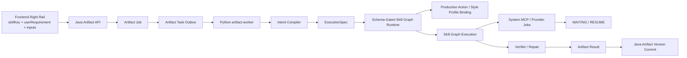

# 产物生成 Agent 独立模块施工文档

> 2026-07-11 收尾审计、已修复缺口、当前验证基线与剩余生产化事项统一记录在 `产物生成Agent需求审计与收尾改造.md`；本施工文档的历史进度段落应结合该文件阅读。

## 1. 文档定位

这份文档是当前产物生成重构的施工蓝图，用来回答三个问题：

1. 按现在的产品要求，独立模块应该长成什么样。
2. 当前代码基线已经做到哪一步，哪些已经不是纯设计。
3. 后续应该按什么顺序继续重构，避免系统再次变乱。

本文档对应的冻结目标是：

`Skill-first + System MCP only + Async Artifact Job + Python Runtime Brain`

本文档对应的内部亮点主语是：

`Controlled Agentic Graph Harness = Production Action + Style Profile + Skill Graph + Artifact Runtime + Capability Union Policy + Verifier / Repair`

## 2. 施工边界与非目标

### 2.1 当前模块边界

本轮重构把产物生成作为独立模块开发，不要求先深度融入旧主模块。

模块边界如下：

- 前端负责右侧栏 skill 入口与任务状态展示。
- Java 负责 `Artifact Job / Artifact Version` 业务壳和任务状态沉淀。
- Python `artifact-worker` 负责 skill runtime、provider 调度、verifier / repair。

### 2.2 非目标

本轮不做的事：

- 不把系统做成通用 Agent 平台。
- 不让用户自选 MCP。
- 不让前端暴露 action / graph / node 级配置。
- 不让 Java 成为第二个 runtime 大脑。

## 3. 当前冻结方案

### 3.1 前端产品形态

- 中间仍然是聊天主界面。
- 最右侧是一列 skill cards。
- 点击某个 skill 后，在右栏内展示轻量表单和运行状态。
- 主输入以 `userRequirement` 为主。
- `inputs` 由 `inputSchema` 驱动动态生成。
- `Source Scope / Style Profile / 输出长度 / 语言` 不做并排固定表单。

### 3.2 请求主语

前端发起任务时提交：

```json
{
  "skillKey": "resume_highlight",
  "userRequirement": "强调架构设计、异步任务编排和系统内置 MCP 集成，适合校招简历",
  "inputs": {}
}
```

对外主语固定为：

- `Skill`
- `Artifact Job`
- `Artifact Version`

### 3.3 system MCP only

- MCP 统一改为系统内置能力。
- 每个 skill 自动挂允许能力白名单。
- `bilibili-render-pdf` 被当作系统内置 capability service 接入。
- system MCP 由系统 registry 统一注册和运维，不再作为用户配置面的一部分。
- provider 能力允许异步执行，前端只消费 `RUNNING / WAITING / SUCCEEDED / FAILED`。

## 4. 目标架构



分层结论：

- 前端只知道功能和任务状态。
- Java 只知道 job、version、callback、outbox。
- Python 才知道 spec、plan、graph、provider、verifier。

## 5. 当前代码基线

这部分很重要，因为它决定了我们下一步不是“重新发明一套”，而是在已有基线上继续收口。

### 5.1 前端基线

当前已经形成的前端方向：

- 右侧栏已经围绕 `skillKey + userRequirement + inputs` 组织。
- skill 列表已改为从 `GET /api/v2/skills` 拉取。
- 右栏表单已经收口为纯 `inputSchema` 驱动，不再依赖 `supports_url_input` 或前端伪造 URL 字段。
- 运行状态已经开始显式区分 waiting 态。
- 右侧栏设计方向已经明确为“聊天主区 + 右栏产物列”，而不是复杂工作流画布。

### 5.2 Java 基线

当前已经形成的 Java 壳层能力：

- 已提供 `/api/v2/skills`。
- `/api/v2/skills` 的公开契约已收口为 schema-first，不再对外暴露 `supports_url_input`。
- `artifact_job.action_key` 已允许为空，`skill_key` 成为主语。
- Artifact job / version 的查询与创建路径已基本围绕 `skill_key`。
- Java `POST /artifact-jobs` 现在也开始正式执行 skill input schema gate：创建前会按 `input_schema` 校验必填键、拒绝未声明输入字段，并对声明为 `string` 的输入做类型校验，而不再只依赖前端表单或 worker 兜底。
- 已具备 artifact outbox dispatch 机制，并能把任务正式投递到 worker `run` 入口。
- 已新增 `noteweave.worker.artifact-base-url` 配置，用于指向独立 artifact-worker。
- waiting 态已有 `wait_context` 承载运行期等待信息。
- `wait_context` 对外已收口为 typed contract，只暴露 `status / provider_job / approval_request / wait_reason`，不再泄露原始 `payload`。
- Java 侧已具备正式控制面桥接：
  - `POST /internal/worker/artifact-tasks/{taskId}/resume`
  - `POST /internal/worker/artifact-callbacks/acquisition/ack`
- provider callback 如果返回失败，Java 已能把 waiting 中的 task / job 正式打回 `FAILED`，而不是继续卡死在等待态。

### 5.3 Python worker 基线

当前已经形成的 Python runtime 能力：

- 已具备 `ArtifactSkillDefinition`、`ExecutionSpec`、`ArtifactRuntimePlan` 这套 skill-first 骨架。
- `content_runtime` 已经能根据 `skillKey` 解析内部 action 绑定。
- `commit_artifact_result(...)` 已可从执行计划推导兼容 action 信息。
- `bilibili_course_note_pdf` 已走真实 async provider waiting 路径，而不是同步硬跑到底。
- worker 的 skill-facing debug surface 已收口为 schema-first，不再默认暴露 `default_action_key`、`requires_url_input`、`url_input_keys`。
- runtime schema gate 已从 URL 特判收口为通用 `input_schema.required` 校验，并保留 URL alias / source scope 的兼容兜底。
- 内置 skill catalog 的 URL 槽位定义已进一步回收到 `input_schema`：
  - `requires_url_input / url_input_keys` 不再作为 `ArtifactSkillDefinition` 持久字段传播；
  - worker 内部仍可从 schema 推导 URL alias，用于 `video_url / bilibili_url` 兼容输入与虚拟 source 构造。
- worker 已具备正式运行控制入口，而不是只靠 debug 路由：
  - `POST /tasks/{taskId}/run`
  - `POST /tasks/{taskId}/resume`
  - `POST /callbacks/acquisition/ack`

### 5.4 Formal callback 基线

现在已经形成的是一条“双正式入口”的 callback / resume 闭环：

- Java 面向主系统内控入口：
  - `POST /internal/worker/artifact-tasks/{taskId}/resume`
  - `POST /internal/worker/artifact-callbacks/acquisition/ack`
- Python worker 面向执行器入口：
  - `POST /tasks/{taskId}/run`
  - `POST /tasks/{taskId}/resume`
  - `POST /callbacks/acquisition/ack`

配套已具备：

- worker callback 编排模块
- waiting progress payload
- provider callback receipt 与 resume 协调逻辑

### 5.5 Wait payload 基线

waiting progress 目前已能带出结构化信息，而不是一条普通日志：

- `provider_job`
- `approval_request`
- `wait_reason`

对前端和 Java 的稳定暴露面只保留：

- `status`
- `provider_job`
- `approval_request`
- `wait_reason`

不会再继续透出内部原始 `payload` 动态 map。

对 provider waiting，至少包括：

- `server_id`
- `tool_name`
- `capability_name`
- `provider_job_id`
- `provider_receipt_id`
- `delivery_id`
- `adapter_callback_token`
- `callback_status`

当前 worker 的 waiting payload 已补齐 `provider_receipt_id` 与 `delivery_id`，能够更完整地喂给 Java `wait_context` 的 typed contract。

### 5.6 已验证的契约闭环

当前这条链路已经不是纯文档设计，至少下面几段闭环已经有针对性契约测试支撑：

- artifact outbox 能把 Java 任务正式 dispatch 到 worker。
- waiting 中的任务可以通过正式 `resume` 入口恢复并最终提交版本。
- provider 成功 callback 可以走 `ack -> resume -> complete` 闭环。
- provider 失败 callback 可以让 Java 正式把 task / job 标记为 `FAILED`。
- waiting progress 的 `wait_context` 能回传结构化 provider 信息，而不是只给前端一段自由文本。

### 5.7 ArtifactVersion runtime_trace 审计面基线

当前已经落地的不只是“任务能跑完”，还包括一层正式的运行时审计面。

`ArtifactVersion` 对外详情当前已经能稳定带出 typed `runtime_trace`，核心字段包括：

- `verification`
- `approval_trace`
- `capability_union_trace`
- `node_traces`
- `evidence_coverage`
- `writeback_preview`
- `output_contract_trace`
- `lifecycle_trace`
- `acquisition_callback_trace`

这层审计面的意义有三点：

- 把 `Controlled Agentic Graph Harness` 的 fancy 概念收口在版本详情里，而不是重新污染前端请求协议。
- 让 Java 外层接口不再只返回一坨动态 map，而是返回可联调、可测试、可前端消费的 typed contract。
- 让前端右栏不仅能显示“成功/失败”，还能显示 `Verifier / Approval / Policy / Contract / Lifecycle / Callback` 这类运行时摘要。

截至当前代码基线，Java 侧已经能把 worker 结果里的运行时审计字段稳定映射到版本详情；前端也已经开始消费这层 trace 摘要，而不是只看最终 markdown 内容。

### 5.8 artifact-worker debug 可观测面

当前 `artifact-worker` 仍保留一组 debug / registry / provider 观测入口，用于施工期核对 skill-first runtime、provider waiting 与 writeback 闭环。

这批 `/debug/*` 路由当前仍然有价值，但要坚持三个原则：

- 只把它们当施工观测面，不当产品功能面。
- user-facing 的 debug 输出也要逐步转成 skill-first 视角。
- `custom-mcp-*` 的存在不代表产品重新开放用户自定义 MCP。

当前真实注册的 debug 路由如下：

```text
/debug/ack-acquisition-operation
/debug/ack-writeback-request
/debug/acquisition-callback-receipt-detail
/debug/acquisition-callback-receipts
/debug/acquisition-operation-detail
/debug/acquisition-operations
/debug/approve-capability-request
/debug/artifact-repository-backend
/debug/artifact-rollback
/debug/artifact-skills
/debug/artifact-version-detail
/debug/artifact-versions
/debug/capability-approval-request-detail
/debug/capability-approval-requests
/debug/capability-bindings
/debug/capability-mapping-detail
/debug/capability-mappings
/debug/capability-provider-detail
/debug/capability-provider-discovery
/debug/capability-provider-health
/debug/capability-providers
/debug/custom-artifact-config-store
/debug/custom-mcp-blueprints
/debug/custom-mcp-servers
/debug/dispatch-acquisition-operation
/debug/dispatch-writeback-request
/debug/execute-writeback-request
/debug/prompt-recipes
/debug/register-custom-mcp-server
/debug/register-custom-prompt-recipe
/debug/register-custom-skill-definition
/debug/register-custom-skill-graph
/debug/register-custom-style-profile
/debug/reset-acquisition-runtime
/debug/reset-custom-mcp-servers
/debug/reset-custom-prompt-recipes
/debug/reset-custom-skill-definitions
/debug/reset-custom-skill-graphs
/debug/reset-custom-style-profiles
/debug/reset-writeback-runtime
/debug/retrieval-entries
/debug/retrieval-entry-detail
/debug/run-capability-provider-discovery
/debug/run-capability-provider-health-checks
/debug/run-task
/debug/skill-definitions
/debug/skill-graphs
/debug/style-profiles
/debug/waiting-task-detail
/debug/waiting-tasks
/debug/wake-waiting-task
/debug/writeback-receipt-detail
/debug/writeback-receipts
/debug/writeback-request-detail
/debug/writeback-requests
```

## 6. 当前正式主链路

### 6.1 创建与运行

```text
Frontend
-> POST /api/v2/workspaces/{workspaceId}/artifact-jobs

Java
-> 创建 ArtifactJob
-> 写入 task_outbox(READY)
-> dispatch 到 artifact-worker /tasks/{taskId}/run

Python
-> 拉取任务输入
-> SkillDefinition -> ExecutionSpec -> RuntimePlan
-> 执行 Skill Graph
-> 回调 progress / complete / fail
```

### 6.2 等待与恢复

```text
Python 执行 provider job
-> 回调 Java progress(WAITING_*)
-> Java 沉淀 wait_context
-> provider callback / host callback 到 worker ack
-> ack=SUCCESS 时 worker resume
-> ack=FAILED 时 Java 直接回写失败
-> worker 再次回调 Java progress/complete
-> Java 提交 ArtifactVersion 并完成 ArtifactJob
```

### 6.3 关键约束

- `WAITING_FOR_PROVIDER / WAITING_FOR_APPROVAL / WAITING_FOR_CAPABILITY` 只能写 progress，不能误写 complete。
- provider callback 不能在 worker 内部“偷偷跑完”，必须继续回写 Java 主系统。
- Java 与 Python 之间要形成正式控制面，而不是继续依赖 debug 路由。
- Java 不编 `RuntimePlan`，不决策 graph，不决策 capability 组合。

### 6.4 前后端联动最小事实

这一版后端联动要坚持四个最小事实：

- 前端只提交 `skillKey + userRequirement + inputs`，不提交 action、graph、node 或 MCP 选择。
- Java 只负责把这次请求沉淀成 `ArtifactJob`，并把原始 request、source scope snapshot 与 worker payload 投递给 Python。
- Python 才负责把 `skillKey` 解析成内部 `SkillDefinition -> Production Action -> Style Profile -> Skill Graph -> Capability Union Policy`。
- 同一个 `skillKey` 可以因为不同 `userRequirement` 编译出不同 `ExecutionSpec`，但不会直接改写 skill 模板本体。

## 7. Skill-first Runtime 的内部设计

### 7.1 SkillDefinition

系统内置 skill 定义负责声明：

- 用途
- 输入 schema
- 默认提示
- 默认 style / action / graph 绑定
- 允许使用的 system capabilities

### 7.2 Production Action

`Production Action` 是内部产物动作模板，不再是对外产品主语。

示例：

- `resume_highlight -> RESUME_HIGHLIGHT`
- `study_guide -> STUDY_GUIDE`
- `bilibili_course_note_pdf -> COURSE_NOTES_PDF`

### 7.3 Style Profile

`Style Profile` 是内部风格层，用于统一：

- 语气
- 结构
- 输出密度
- 受众导向
- 引用倾向

### 7.4 ExecutionSpec

`ExecutionSpec` 是把用户自然语言需求编译成结构化运行规格，而不是去直接改 skill 本体。

标准链路：

`userRequirement -> Intent Compiler -> ExecutionSpec -> Schema Gate -> RuntimePlan`

### 7.5 Skill Graph

skill 的优秀能力要沉淀成节点图，而不是 prompt 列表。

`resume_highlight` 建议图：

- `source_digest`
- `fact_extractor`
- `impact_normalizer`
- `bullet_writer`
- `resume_verifier`
- `local_repair`

`bilibili_course_note_pdf` 建议图：

- `video_source_resolver`
- `subtitle_fetch_or_transcribe`
- `chapter_structurer`
- `note_writer`
- `latex_builder`
- `pdf_exporter`
- `artifact_verifier`

### 7.6 Schema-Gated Skill Graph Runtime

这条链路的“fancy 但受控”核心在于：不是让模型自由展开规划，而是让模型只能在受控 schema 与受控子图里运行。

至少要校验：

- 输入是否命中 skill 支持的槽位
- 是否缺少必填输入
- 是否引用未注册 graph 节点
- 是否申请未授权 capability
- 是否与输出 contract 冲突

### 7.7 Capability Union Policy

`Capability Union Policy` 不是查“某个 tool 能不能用”，而是查“当前能力组合是否越界”。

它检查：

- 当前 `Skill`
- 当前 `Production Action`
- 当前 `Skill Graph`
- 当前 system MCP capabilities
- 当前 workspace 数据边界
- 当前 writeback target

## 8. system MCP 与 bilibili-render-pdf 施工口径

### 8.1 定位

`bilibili-render-pdf` 不再被当作孤立 skill 脚本，而是系统内置 capability service。

产品层仍然表现为：

- `bilibili_course_note_pdf`

运行时层表现为：

- `system-bilibili-render-pdf`

调度层表现为：

- provider job
- waiting
- ack
- resume

工程接入上可以复用 MCP server 的注册、发现和调用协议，但它归属于 system-managed registry，不再作为用户可配置能力出现。

### 8.2 推荐 capability 拆分

- `bilibili-source`
- `subtitle-fetch`
- `audio-transcribe`
- `frame-extract`
- `latex-render`
- `pdf-export`

### 8.3 provider runtime 组织建议

为了隔离依赖和环境风险，provider runtime 可以独立运行在单独的 conda 环境或容器里，但对主链路仍然表现为统一的 async provider：

- 有固定 provider id
- 有稳定 capability 列表
- 支持 health check
- 支持 callback receipt
- 支持 ack / resume

## 9. 后续重构切片

这一部分按照“先打通正式闭环，再逐步去旧口径”的顺序推进。

### 阶段 A：冻结对外协议（已完成）

目标：

- 所有前端请求稳定围绕 `skillKey + userRequirement + inputs`
- `/api/v2/skills` 成为唯一右栏配置来源
- `actionKey` 只保留兼容意义

当前已完成：

- 前端右栏已围绕 `skillKey + userRequirement + inputs` 组织。
- `/api/v2/skills` 已成为主要 skill 配置来源。
- 新建 artifact job 已允许 `action_key = null`。
- 前端右栏已改为纯 `inputSchema` 驱动，不再依赖 `supports_url_input`。
- `/api/v2/skills` 已移除 `supports_url_input` 对外暴露。
- worker 的 public skill-facing surface 已同步隐藏旧 URL 输入心智。

### 阶段 B：Java 收口为正式任务壳（首轮已完成，继续收紧）

目标：

- 统一 Java 的 artifact outbox dispatch、progress、complete、fail
- 增强 Java 对 waiting / resume 的状态沉淀
- 增加 Java 到 worker 的正式控制面桥接

当前已完成：

- artifact outbox dispatch 已落地。
- Java 到 worker 的 `resume` / `acquisition ack` 控制桥接已落地。
- provider failed callback 写回 `FAILED` 的行为已补齐。
- 等待态到完成态、等待态到失败态的关键契约测试已存在。
- `wait_context` 对外 contract 已收口为 typed structure。
- `ArtifactVersion` 外层详情已能 typed 暴露 `runtime_trace`。

当前剩余：

- 继续压缩 Java 侧 action-first 兼容痕迹。
- 继续把 callback receipt 与 provider job 的剩余动态 map 收窄成更稳定的 typed contract，并优先把 receipt 的关键审计字段外显到 Java / frontend。
- 把更多运行时审计字段继续从“能看见”推进到“前端稳定消费 + 测试稳定约束”。

### 阶段 C：Python runtime 继续收口（进行中）

目标：

- 强化 `Intent Compiler`
- 完善 `ExecutionSpec` schema gate
- 统一 RuntimePlan 生成逻辑
- 让 verifier / repair 成为默认路径，而不是特例

当前已完成：

- skill-first 请求已先编译为 `ExecutionSpec`，再进入 runtime plan。
- schema gate 已能校验 action / prompt recipe / graph 兼容性。
- schema gate 已新增 runtime node registry 边界：
  - custom graph 注册阶段会拒绝引用“存在 skill definition 但没有 registered runtime executor”的节点；
  - execution plan 构建阶段也会再次拒绝这类越界 node，避免 graph 绕过注册边界直接落到运行时。
- `wait_context` 的 provider / approval / wait_reason 已形成稳定 typed 对外结构。
- artifact skill 的 public skill surface 已收口为 schema-first。
- Python worker 已从“URL 特判”进一步收口到“通用 `input_schema.required` 槽位校验 + URL alias/source scope 兼容兜底”。

需要补齐的点：

- 更清晰的 skill graph 节点注册边界
- 更强的输出 contract 校验
- 对 waiting、repair、resume 的 trace 结构化记录
- 让 `resume_highlight` 的 spec 编译与 graph 绑定更清晰地体现“需求改 spec，不改 skill”

### 阶段 D：system MCP / provider 正式化（进行中）

目标：

- 把 `bilibili-render-pdf` 完整收口成 system capability service
- 让字幕、转写、渲染全部进入统一 provider 协议
- 为后续内置 skill 复用 capability 做好基础设施

当前已完成：

- `bilibili_course_note_pdf` 已进入真实 provider waiting / resume 主链路。
- 系统口径已冻结为 system MCP only，不再走用户自定义 MCP 接入。
- `bilibili-render-pdf` 已按 system capability service 的方向进入独立 worker/runtime 体系。

需要继续补齐的点：

- provider callback token/receipt 的剩余动态字段继续收口
- provider retry / redelivery 的对外叙事继续稳定化
- 更多内置 system capability 的统一接入

当前进展补充：

- worker 已新增统一 `provider_job_status`，把 provider 长任务 lifecycle 从 `callback_status` 里拆出来，收口为：
  - `WAITING_FOR_APPROVAL`
  - `WAITING_FOR_CAPABILITY`
  - `WAITING_FOR_PROVIDER`
  - `DISPATCHED`
  - `SUCCEEDED`
  - `FAILED`
  - `NOT_REQUIRED`
  - `PENDING_UPSTREAM`
- `wait_context.provider_job`、`acquisition_callback_trace.receipt`、`acquisition_callback_trace.operation` 已同步带出 `provider_job_status`。
- Java typed DTO、worker debug runtime、前端 narrative / trace detail 已统一消费该字段，`callback_status` 保留为低层 callback receipt 细节。
- provider health 已正式外显到统一 outward contract：
  - `wait_context.provider_job.provider_status`
  - `wait_context.provider_job.health_status`
  - `acquisition_callback_trace.operation.provider_status`
  - `acquisition_callback_trace.operation.health_status`
- 以上字段已补齐 worker / frontend / Java 三层 typed contract 与回归测试，provider runtime 的“可用性”和“任务状态”不再混在同一个字段里。
- callback receipt 也已继续 typed 化，外层稳定带出：
  - `request_id / task_id / source_id / operation_key`
  - `result_locator / completed_at / dispatch_count`
  - `error_code / error_message`
- 前端 callback detail 已开始消费这些 receipt 字段，用于展示 receipt scope、result locator、完成时间与错误信息，不再只依赖 operation 侧字段补叙事。

### 阶段 E：前端右栏 schema-only 收口（已完成）

目标：

- 右栏表单完全根据 `inputSchema` 生成
- 去掉 `supports_url_input` 这类历史兼容心智
- 把“聊天主区 + 右栏产物列”的交互固定下来

当前已完成：

- `artifactStudio.ts` 已改成纯 schema 驱动 field builder。
- `artifactStudio.test.ts` 已补齐围绕 schema 的契约测试。
- `App.tsx` 默认 skill 数据已去掉旧兼容字段。

### 阶段 F：去 action-first 残留（进行中）

目标：

- 对外接口和视图彻底 skill-first
- debug surface 不再默认引导 action-heavy 心智
- 历史兼容字段只留在最小范围

当前重点：

- 压缩 `actionKey`、`default_action_key` 一类旧兼容字段的剩余传播面。
- 把 action-first 心智继续限制在 Python 内部绑定层与历史数据兼容层。

当前新增进展：

- worker `ArtifactSkillDefinition` 已不再把 `default_action_key` 作为 skill 主模型字段持久传播。
- skill 到 action 的默认绑定已回收到 `action_compat / artifact_skill_catalog` 的独立 binding resolver。
- worker debug skill surface 不再需要显式 `pop("default_action_key")`，因为该字段已不再出现在 skill model dump 中。
- Java `ArtifactSkillDefinition` 也已去掉 `actionKey` 字段，默认 action 绑定改由 `ArtifactSkillCatalogService.resolveActionKey(...)` 内部承接。

### 阶段 G：输出契约与生命周期 trace（进行中）

目标：

- 给 verifier / repair 增加更强的输出 contract 校验结果
- 对 waiting、repair、resume、complete 形成统一 lifecycle trace
- 让 `ArtifactVersion.runtime_trace` 成为稳定的运行时审计出口

当前已完成：

- worker `result_payload` 已新增结构化 `verification`。
- worker `result_payload` 已新增结构化 `approval_trace`。
- worker `result_payload` 已新增结构化 `capability_union_trace`。
- worker `result_payload` 已新增结构化 `node_traces`。
- worker `result_payload` 已新增结构化 `evidence_coverage`。
- worker `result_payload` 已新增结构化 `writeback_preview`。
- worker `result_payload` 已新增结构化 `output_contract_trace`。
- worker `result_payload` 已新增结构化 `lifecycle_trace`。
- worker `result_payload` 已新增结构化 `acquisition_callback_trace`。
- `output_contract_trace` 已新增结构化 `repair_summary`，开始正式聚合：
  - `local repair` 数量
  - `node-level repair` 数量
  - 受影响 section / node
  - `local_repair_checks`
  - `node_repair_actions`
  - repair category counts
- Java `ArtifactRuntimeTraceResponse` -> `ArtifactOutputContractTraceResponse` 已同步补齐 `repair_summary` 强类型映射，避免控制面把该字段退回成松散 JSON。
- `ArtifactVersion.runtime_trace` 已同步持久化以上字段。
- resumed task 的 `lifecycle_trace` 已补入显式 `RESUMING` 步骤。
- 前端 artifact runtime detail 已继续展开 lifecycle 细节，不再只显示 `steps=PLANNING / RESUMING`：
  - 最新 step 的 `status / progress_percent / message`
  - resumed run 的 `resume_scope.matched_request_id / matched_operation_key / matched_source_id`
- 前端 `Verifier` detail 已不再只显示计数，开始继续展开：
  - `passed_checks`
  - `repaired_checks`
  - `failed_checks`
  - `warnings`
- 前端 `Nodes / Contract` detail 也已继续从“状态计数”推进到“可读审计说明”：
  - node 级 `output_summary`
  - contract 级 `local_repair_checks / node_repair_actions`
  - contract 级 `passed_checks / repaired_checks / failed_checks / warnings`
- provider callback receipt 已开始上浮到 resumed result 的 `acquisition_callback_trace`，并且 receipt 侧的关键审计字段已 typed 暴露。
- 已补齐围绕 completed / waiting / repository persistence 的契约测试。

需要补齐的点：

- callback receipt 的更细粒度聚合与前端展示继续完善
- repair 级别的更细粒度 trace 聚合
- 更清晰的 node trace 与 verifier trace 汇总方式
- 前端从“摘要消费”继续推进到“可展开查看版本审计详情”

## 10. TDD 施工顺序建议

后续继续开发时，建议按以下顺序推进，每一段都先补契约测试，再补实现：

1. 先补前端对 `runtime_trace` 的消费测试，继续把 `evidence_coverage / writeback_preview / node_traces` 变成稳定摘要或详情面。
2. 强化 verifier 输出 contract 测试，先明确结果 payload 里要有哪些结构化通过/失败证据。
3. 继续把 waiting、repair、resume、complete 的 lifecycle trace 打磨完整，尤其补齐 resume 细节。
4. callback receipt / provider job 状态模型已新增统一 `provider_job_status`，provider health 也已通过 `provider_status / health_status` 外显到 wait context 与 callback operation；callback receipt 关键审计字段也已 typed 化，下一步更多是继续完善 receipt 细粒度展示与 redelivery 叙事。
5. 继续压缩 action-first 兼容字段在 Java、worker debug surface 里的传播面。
6. 在外层协议彻底稳定后，再继续扩更多内置 skill。

这样做的好处是：

- 不会一边重构一边失去主链路信心。
- 每个阶段都能验证“这不是文档架构，而是真能跑的架构”。

## 11. V1 完成标准

这一轮独立模块的 V1 完成标准不是“全功能上线”，而是“把最小闭环做成真系统”。

完成标准：

- `resume_highlight` 能以独立模块方式跑通
- 右侧栏能通过 `skillKey + userRequirement + inputs` 发起任务
- Java 能创建 `ArtifactJob`、沉淀 waiting 态、最终提交 `ArtifactVersion`
- Python 能完成 `ExecutionSpec -> RuntimePlan -> Skill Graph -> Verifier / Repair`
- provider waiting / ack / resume 闭环可用
- `bilibili_course_note_pdf` 的 provider 模式与主链路兼容

当前判断：

- 主链路的“创建 job -> worker run -> waiting -> ack/resume -> version 提交”已经基本打通。
- skill-first 的外层协议已经基本收干净，尤其是 schema-only skill catalog、typed wait context、worker public skill surface 三块已经对齐。
- runtime_trace 已经成为正式的审计出口，但细粒度 trace 聚合和前端展开方式仍需继续做硬。
- 因此下一步优先级不是再扩更多花哨入口，而是把 runtime 审计面和 provider 契约继续做硬。

## 12. 简历亮点关键词

后续最值得沉淀的关键词如下：

- Controlled Agentic Graph Harness
- Schema-Gated Skill Graph Runtime
- Production Action
- Style Profile
- Skill Graph
- Capability Union Policy
- Artifact Job / Artifact Version
- Verifier / Repair

建议在简历或汇报里把 Python 侧亮点说成“受控 runtime 方法”，而不是“堆了很多 prompt”：

- 用 `Intent Compiler + ExecutionSpec` 承接用户需求编译。
- 用 `Schema-Gated Skill Graph Runtime` 承接受限执行。
- 用 `Capability Union Policy` 承接系统能力组合安全。
- 用 `Verifier / Repair + runtime_trace` 承接质量闭环与审计闭环。

推荐表述：

`重构 Skill-first 的受控式异步产物生成模块，以 Controlled Agentic Graph Harness 统一承接 Production Action、Style Profile、Skill Graph 和 Artifact Runtime；通过 Schema-Gated Skill Graph Runtime 约束执行计划，通过 Capability Union Policy 管理内置能力组合风险，并以 Artifact Job / Artifact Version、Verifier / Repair、runtime_trace 支撑异步长任务、结果版本化与局部修复。`

## 13. 结论

这次施工的关键，不是继续给旧后端缝更多链路，而是先把真正稳定的主链路定下来：

- 前端只暴露 skill 和最小需求输入。
- Java 只做 job / version / callback / outbox 业务壳。
- Python 成为唯一 runtime brain。
- system MCP 统一内置，provider 长任务统一纳入 waiting / resume。
- fancy 的 graph、schema gate、policy、verifier 全部保留在运行时内部。

只要这个边界守住，后续不管继续接更多内置 skill，还是继续把 bilibili、render、pdf 这类能力收编成 system capability，系统都不会再重新变回一坨混乱的“半产品、半脚本、半 Agent”拼装体。

## 14. 后端重构口径补充

这一节专门回答一个容易反复摇摆的问题：

到底是不是“Java 后端直接把东西全传给 Python 做算了”。

答案是：

- 是，运行时智能决策层面基本都应交给 Python。
- 但不是把 Java 弄成透明转发器，而是让 Java 稳定承担业务真源和任务控制面。

### 14.1 Java 必须保留的职责

Java 继续负责：

- workspace / user / permission 校验
- `ArtifactJob` 创建与状态维护
- `ArtifactVersion` 落库与查询
- source scope snapshot 固化
- task outbox 投递
- worker progress / complete / fail / waiting 回写
- `wait_context` 与 `runtime_trace` typed 对外暴露

换句话说，Java 负责“业务壳、状态机、持久化、控制面”。

### 14.2 Python 必须收口的职责

Python `artifact-worker` 统一负责：

- `skillKey -> SkillDefinition`
- `userRequirement + inputs + source snapshot -> ExecutionSpec`
- `ExecutionSpec -> RuntimePlan`
- `RuntimePlan -> Skill Graph`
- system capability / provider 调用
- `Verifier / Repair`
- waiting / ack / resume 的运行期编排

换句话说，Python 负责“运行时大脑、受控图执行、能力调度、质量闭环”。

### 14.3 Java 到 Python 的 payload 口径

Java 投递给 worker 的 payload 应冻结为“完整运行上下文”，而不是零散参数。

建议最小结构：

```json
{
  "artifactJob": {
    "jobId": 101,
    "taskId": 9801,
    "workspaceId": 7,
    "skillKey": "resume_highlight",
    "userRequirement": "强调架构设计、异步编排和 system MCP 集成，适合校招简历",
    "inputs": {}
  },
  "sourceScopeSnapshot": {
    "workspaceSourceIds": [11, 15, 19],
    "artifactVersionIds": [42],
    "capturedAt": "2026-07-07T11:00:00+08:00"
  },
  "controlPack": {
    "requestId": "artifact-job-101",
    "writebackMode": "ARTIFACT_VERSION",
    "runtimeMode": "ASYNC",
    "traceLevel": "STANDARD"
  }
}
```

这里最重要的约束是：

- Java 不传 `RuntimePlan`
- Java 不传“你应该怎么跑图”的结果
- Java 只传“这次任务的业务事实与边界”
- Python 收到后独立编译运行计划

### 14.4 为什么这样分层更适合后续重构

这样做有四个直接收益：

- Java 可以继续保持业务主系统的可控性，不被 runtime 细节污染。
- Python 可以大胆演进 `Intent Compiler / Skill Graph / Verifier / Repair`，而不需要每次都改 Java 协议。
- 前端、Java、Python 的主语终于一致，都会围绕 `skillKey -> ArtifactJob -> ArtifactVersion` 展开。
- 后续要接更多内置 skill 或 system capability 时，不需要再反复争论“能力写在 Java 还是 Python”。

## 15. 下一阶段执行计划（截至 2026-07-07）

从当前基线出发，接下来不建议再大开大合重做，而是按切片继续收硬。

### 15.1 第一优先级：前端把 runtime audit 从“最新结果”扩到“历史版本”

目标：

- 右栏“最近产物”基于真实 `artifactJobs` / `ArtifactVersion`
- 点击某个历史版本可查看对应 `runtime_trace`
- 摘要与详情共用同一套 trace builder

这一段的价值是把 `Controlled Agentic Graph Harness` 从“后端里有”变成“前端真能看到、真能演示、真能汇报”。

15.1 当前补充进度（2026-07-07）：

- 已补 `artifactHistorySelection.test.ts`，用 TDD 钉住“最新版本请求”与“历史项点击复用最新详情”的前端选择逻辑。
- `App.tsx` 已把“最新完成版本选择”从原本依赖接口返回顺序，收口为按 `updated_at` 选出最近完成的 `ArtifactVersion`，与“最近产物”列表排序保持一致。
- 点击历史版本时，如果目标就是当前已加载的最新版本，前端会直接复用本地详情而不是重复发起版本详情请求。
- 已新增 `artifactHistoryViewer.test.ts`，用 TDD 钉住“最近产物审计查看态”的三个规则：默认落在最新版本、切换到历史版本、无显式 key 时仍可稳定推导 active key。
- 前端 `artifactHistoryViewer.ts` 已把“最新版本 / 历史版本”的 audit viewer state 从 `App.tsx` 内联逻辑中抽离，统一负责：
  - active history key
  - preview 文案
  - runtime summary
  - runtime detail sections
  - `查看最新版本审计详情 / 查看历史版本审计详情` 的切换文案
- 现在右栏“最近产物”即使用户还没点“审计”，也会默认落在当前最新 `ArtifactVersion` 上，历史列表高亮和下方审计卡片终于使用同一条状态链路。
- 已新增 `artifactVersionAudit.test.ts`，用 TDD 钉住“版本审计展示视图模型”的公共规则：preview 归一化、runtime summary / detail sections 投影、空版本稳定返回。
- 前端 `artifactVersionAudit.ts` 已把 `ArtifactVersion` -> 审计展示视图的共享转换抽离出来，`最新结果` 卡片与 `最近产物` 下方的历史审计卡片现在共用同一套 preview / trace builder，不再各自手搓一遍。
- `App.tsx` 中与 `ArtifactVersion.runtime_trace` 展示相关的重复局部变量已进一步压缩，后续如果要继续把右栏拆成独立 panel 组件，可以直接复用这层 shared audit view，而不需要再从页面里反向抽数据规则。
- 已新增 `artifactSidebar.test.ts`，用 TDD 钉住 artifact 右栏 orchestration 层：`正在生成` run cards、`最新结果` audit view、`最近产物` history items / viewer 会从同一份 sidebar state 产出，而不是散落在页面里各自推导。
- 前端 `artifactSidebar.ts` 已开始承担 artifact 右栏的组合型 view-model 角色，统一收口：
  - artifact / research / workspace / wiki run card 拼装
  - latest artifact audit view
  - history item 列表
  - history viewer 选中态
- `App.tsx` 里原本同时维护 `artifactStudioRuns / latestArtifactAuditView / artifactStudioHistoryItems / artifactHistoryViewer` 的多段派生逻辑已被替换为单一 `artifactSidebarState`，右栏从“页面内联组装”进一步收口为“helper 驱动渲染”。

### 15.2 第二优先级：继续收紧 provider callback / receipt contract

目标：

- callback receipt 外层接口已完成第一轮 typed 化，下一步继续扩展 redelivery / retry 叙事
- provider job、delivery、receipt、callback status 形成稳定结构
- Java / worker / frontend 三侧对 waiting 主语保持一致

这一段的价值是让异步 provider 链路不再像“能跑通的脚本”，而像“正式的长任务控制协议”。

15.2 当前补充进度（2026-07-07）：

- 已补 `Phase6ResearchArtifactContractTest`，用 TDD 钉住 acquisition ack 外层响应与 `ArtifactVersion.runtime_trace` 都要稳定带出 `operation.dispatch_count`。
- Java `ArtifactAcquisitionOperationResponse` 与 `ArtifactAcquisitionOperationTraceResponse` 已新增 typed `providerDeliveryAttempts`，把 worker 内部已有的 `provider_delivery_attempts` 正式提升为外层 contract。
- 当前成功 / 失败 callback 合同都已验证 `provider_delivery_attempts[0].delivery_id / dispatch_count / ack_status`，为后续继续扩展 redelivery / retry history 打下基线。
- 已新增“第二次 provider delivery 恢复成功”的合同用例，验证 acquisition ack 外层响应与 `ArtifactVersion.runtime_trace` 都能稳定带出两次 `provider_delivery_attempts` 历史，并保留 `FAILED -> ACKNOWLEDGED` 的状态演进。
- `wait_context.provider_job` 已新增 typed `dispatch_count / previous_failed_delivery_count / has_previous_failed_delivery`，前端等待态叙事也已能显示“第几次投递 / 之前失败过几次”。
- 右栏“正在生成”卡片已新增 wait signal chips，用显式 `Delivery / Retry` 摘要展示 provider redelivery 状态，而不再只依赖一整行 wait narrative。
- Research detail、研究过程弹窗、工作台资料处理卡片也已复用同一套 wait signal chips，waiting 态的 retry / redelivery 信号不再只在右栏可见。
- waiting chips 现已继续外显 `provider_status / health_status / provider_job_status`，用户不展开 narrative 也能一眼看到 provider 是否健康、当前是否仍在 `DISPATCHED / PENDING_UPSTREAM`。
- `WAITING_FOR_APPROVAL / WAITING_FOR_CAPABILITY` 也已接入统一 wait chips，审批阻塞与能力缺失不再只能靠 narrative 文案识别。
- artifact runtime summary 的 `Callback` 摘要也已开始外显 `delivery / retry` 计数，用户不展开版本详情也能快速判断是否经历过 redelivery。
- `Callback` 摘要现已进一步补齐 `provider_status / health_status`、`provider_receipt_id` 以及成功 `result_locator` / 失败 `error_code` 的关键信号；不展开 detail 也能直接判断 provider 健康度、receipt 归属与成功/失败收据结果。
- artifact version runtime audit detail 已开始展开 `providerDeliveryAttempts` 历史，能直接看到 callback redelivery 的 `attempt# / dispatch / delivery / error/result`，而不再只看到最后一次 receipt。
- 前端右栏的 contract 审计详情已进一步展开 `outline_checks / phrase_checks / contract_checks / evidence_checks`，而不再只显示最终 `PASS/WARN` 与 repair 汇总；这样 `resume_verifier`、schema gate 和 evidence coverage 的命中结果可以直接在历史版本详情里看到。
- 前端同时兼容新旧 contract check 字段：优先消费 `contract_checks`，如遇历史版本仍只有 `action_checks` 也会自动回退读取，避免我们继续重构 outward contract 时把旧版本审计视图读坏。
- `wait_context.provider_job` 现已继续向 callback runtime trace 看齐：Java 外层 contract 新增 typed `providerDeliveryAttempts`，不再只暴露聚合后的 `dispatch_count / retry` 数字；等待态也能直接看见每次 delivery 的 `ack_status / delivery_id / callback_token / error_code / result_locator`。
- worker `WAITING_FOR_PROVIDER` progress payload 已补齐初始 `provider_delivery_attempts` 与 retry 汇总字段，Java `TaskService` 则会在显式计数缺失时，从 attempts 历史自动回推 `dispatch_count / previous_failed_delivery_count / has_previous_failed_delivery`，避免 waiting contract 继续依赖松散动态 map。
- 前端 `runStatus` helpers 已同步支持从 `provider_delivery_attempts` 反推 Delivery / Retry 摘要；即使 Java 只给出 attempts 列表、不再额外重复聚合计数，右栏 waiting narrative 与 signal chips 仍能稳定展示 redelivery 语义。
- artifact 右栏 `正在生成` run card 也已继续稳定消费这层 waiting contract：新增 wait detail lines，直接展示 `Request / Provider Job / Receipt / Latest Attempt / Previous Attempt`，把 provider redelivery 历史从“helper 里可算出”推进到“界面上可演示、测试里可约束”。
- 已补前端 TDD，显式钉住 `buildWaitContextDetailLines(...)` 与 `artifactSidebar` 在 provider waiting 场景下会把 `provider_delivery_attempts` 收口为稳定 detail lines；右栏等待卡片不再只显示 Delivery/Retry chips，而能直接带出最近一次投递与前一次失败的关键信号。
- research waiting contract 现也已和 artifact waiting contract 对齐：`Phase6ResearchArtifactContractTest` 已补齐 research `WAITING_FOR_PROVIDER` 场景，对 `server_id / tool_name / capability_name / provider_receipt_id / delivery_id / provider_status / health_status / provider_job_status / dispatch_count / previous_failed_delivery_count / provider_delivery_attempts` 做正式 HTTP 合同约束，避免两条异步链路再次出现“artifact 很完整、research 只有简版 wait_context”的漂移。
- 前端研究详情卡片、研究过程详情卡片和工作台资料处理卡片现在也已复用同一套 wait detail lines；因此 `provider_delivery_attempts` 不再只在 artifact 右栏可见，research / workspace 的等待态同样能直接展示当前投递、前次失败和 receipt/job 关联信息。

### 15.3 第三优先级：把 `resume_highlight` 的内部 graph 和 verifier 再做硬

目标：

- 强化 `ExecutionSpec` 编译结果
- 明确 `source_digest -> fact_extractor -> impact_normalizer -> bullet_writer -> verifier -> repair`
- 提高输出 contract 与 repair trace 的结构化程度

这一段的价值是让 V1 的简历亮点功能真正能体现：

- `Production Action`
- `Style Profile`
- `Skill Graph`
- `Verifier / Repair`

15.3 当前补充进度（2026-07-07）：

- `resume_highlight_v1` 已收口为显式 6 节点图：`workspace_material_digest -> resume_highlight_extractor -> resume_impact_normalizer -> resume_bullet_writer -> resume_verifier -> resume_local_repair`。
- `ExecutionSpec.notes` 已显式记录 resume graph binding，让“需求改 spec，不改 skill”在 worker outward contract 中可见。
- runtime node registry 已补齐 `resume_impact_normalizer / resume_verifier / resume_local_repair`，schema gate 会继续拒绝未注册节点。
- `resume_verifier` 会显式产出 bullet / focus point / required phrase 缺口报告，`resume_local_repair` 会把这些缺口收敛成 node-level repair trace，而不是只依赖最终全局 repair。
- 这条链路的 worker TDD 已补齐，覆盖 `activated_nodes`、`node_traces`、resume repair visibility 和 `output_contract_trace.repair_summary` 聚合。
- 前端 artifact version 审计详情也已开始展开 node-level `verification_checks / repair_actions`，并在 contract 区显式展示 `repair_categories`，让 Skill Graph 的 verifier / repair 收敛过程不再只表现为一个最终 PASS 状态。
- `output_contract_trace.repair_summary` 已继续细化为结构化 `local_repair_checks / node_repair_actions`，Java typed DTO、worker runtime trace 与前端 contract detail 已完成联动，右栏现在可以直接看见“本地修补了什么、哪个 node 做了什么修补”。

### 15.4 第四优先级：继续压缩 action-first 兼容残留

目标：

- 继续缩小 `actionKey` 在 Java / frontend / debug surface 的传播面
- 把 action 限定为 Python 内部绑定层概念

15.4 当前补充进度（2026-07-07）：

- Java skill catalog outward contract 已不再暴露 `actionKey`。
- Java `ArtifactWorkerInputPayload` record 已移除 `actionKey` 组件，worker input payload 结构本身不再保留该兼容字段。
- 已补 `ArtifactWorkerInputPayloadTest`，用 TDD 钉住 Java worker input payload 的 record 结构与序列化字段集合，防止 `actionKey` 回流。
- worker public skill/debug surface 已持续去掉 `default_action_key / action_key` 这类旧兼容字段。
- `/debug/run-task` 与 `/debug/wake-waiting-task` 的 result public view 也已开始显式裁掉 `job_snapshot.action_key` 与 `result_payload.execution_plan.action_key`，避免 debug 运行结果继续把旧 action-first 心智带回对外面。
- `/debug/waiting-tasks` 与 `/debug/waiting-task-detail` 也已对 `task_input.input_payload.action_key` 做 public sanitize，waiting 态调试视图不再因为 provider / capability 阻塞而回退成 action-first 口径。
- worker public sanitize 已进一步从“顶层字段裁剪”升级为“递归 trace 净化”：`/debug/run-task`、`/debug/artifact-versions`、`/debug/artifact-version-detail` 返回的 `runtime_trace / output_contract_trace` 中，`metadata.action_key` 一类嵌套旧字段也会统一移除，避免 verifier contract trace 继续把 internal production action 暴露给对外调试视图。
- 已补 worker TDD，显式钉住 `debug_run_task` 与 `debug_get_artifact_version_detail` 的嵌套 `runtime_trace` 不再包含 `action_key`，防止后续只顾顶层收口却把旧字段从 trace metadata 漏回去。
- Java `ArtifactJobService.readRuntimeTrace(...)` 现也已补上同类递归净化，`/api/v2/workspaces/*/artifact-jobs/*/versions/*` 对外返回的 `runtime_trace.output_contract_trace.*.metadata` 不再把 worker 内部 `action_key` 原样透传出来。
- 已补 `Phase6ResearchArtifactContractTest`，显式构造 `output_contract_trace.action_checks[].metadata.action_key` 的 worker 结果，并钉住 HTTP 合同与 `ArtifactVersionDetailResponse` DTO 都只保留业务相关字段（如 `bullet_count`），不再泄露 legacy action-first 标识。
- worker 产物正文 markdown 已继续从“调试说明页”收口为“用户产物页”：`Generation Goal` 不再直接带出 `Skill binding / Skill request resolved via / Prompt recipe / Skill graph / Schema gate` 这些内部实现细节，只保留 `Skill / Goal / Style profile / Writeback gate` 等对用户有意义的外层信息。
- `trace_summary` 也已从 `internal production action binding -> schema gate -> capability union policy` 这类实现导向文案，收口为更中性的 `resolve skill request -> execution spec planning -> skill graph runtime -> verifier / repair -> artifact version export`。
- 已补 worker TDD，显式钉住 `resume_highlight` 与 `quiz_pack` 生成结果不再把上述内部控制层字段写进正文 markdown，同时保留 `Schema-Gated Skill Graph Runtime / Capability Union Policy` 等真正属于产物内容本身的关键词表达。
- 本轮已继续收紧用户可见叙事：产物 markdown 与 `trace_summary` 不再直接把 internal action / binding / recipe / graph 作为对外主语，而是收口为 `Skill + Goal + Runtime Outcome` 这类更稳定的产品语义。
- worker legacy action catalog 已从公开 debug surface 中移出：原先的 `default-actions` public debug route 已改为 internal route，继续保留内部调试与 custom action reset 校验能力，但不再参与对外 debug route 文档集合。
- 已补 worker TDD，显式钉住 public debug route 集合中不再包含 legacy `default-actions`；同时 action catalog 仍可通过 internal 入口返回默认 / 自定义 action，用于兼容内部调试与回归验证。
- `resolve-action` 这类直接暴露 internal action resolver 主语的入口也已从 public debug surface 中移出，继续保留 internal 调试能力，但不再让 `/debug/*` 路由集合把 action resolver 当成对外主语。
- 已补 worker TDD，显式钉住 public debug route 集合中不再包含 legacy `resolve-action`；同时直接调用内部 resolver 调试函数仍可继续覆盖 action 兼容与 custom action 解析回归。
- `register-custom-action / reset-custom-actions` 这组直接把 action customization 当对外主语的入口也已移出 public debug surface，继续保留 internal 调试能力，但不再让外层 debug 路由把 action catalog customization 当成主叙事。
- 已补 worker TDD，显式钉住 public debug route 集合中不再包含 legacy custom action register/reset；custom action 的内部注册、回归验证与 reset 闭环仍通过 internal 路径与直接函数调用覆盖。
- public skill runtime catalogs 也已开始继续去 action-first 字段：`/debug/skill-graphs` 不再外露 `action_type`，`/debug/prompt-recipes` 不再外露 `supported_actions`，避免 public debug payload 继续把 internal action binding 当成外层主语。
- 已补 worker TDD，显式钉住 public `skill-graphs / prompt-recipes` catalog 返回中不再包含上述字段；内部注册响应和 registry 存储仍可保留这些绑定信息，供 runtime / 回归验证使用。
- custom skill runtime registration 的 public 返回也已继续同步收口：`register-custom-skill-graph` 的 response 不再外露 `action_type`，`register-custom-prompt-recipe` 的 response 不再外露 `supported_actions`，避免注册成功回包再次把 action binding 当成外层主语。
- 已补 worker TDD，显式钉住 custom graph / prompt recipe 注册响应、reset 前后的 public catalog 快照都不再包含这些字段；内部注册入库与 reset 回归链路保持不变。
- `custom-mcp-servers / custom-mcp-blueprints / capability-bindings` 这类 public debug payload 也已开始继续去 action-first gating 字段：custom MCP tool 不再外露 `allowed_actions / supported_actions`，capability binding 不再外露 `allowed_actions`，避免 capability / tool 组合关系继续把 action 作为外层理解入口。
- 已补 worker TDD，显式钉住 custom MCP 注册响应、custom MCP 列表 / blueprint 快照、capability binding catalog 都不再包含这些字段；内部 registry 校验与 capability gating 逻辑保持不变。
- `capability-providers / capability-provider-discovery / capability-provider-health / capability-mappings` 这组 public provider payload 也已继续去 action-first 字段：provider 与 mapping 侧不再外露 `supported_actions / action_basis`，避免 provider 候选和 capability 映射继续把 action gating 与 resolver 内部信号作为外层主语。
- 已补 worker TDD，显式钉住 provider list、provider discovery / health snapshot、capability mapping snapshot 与 discovery scan 结果中都不再包含 `supported_actions / action_basis`；内部 provider candidate catalog 与 resolver 逻辑保持不变。
- `capability_union_trace` 的 public outward contract 也已继续收口：`action_scope`、capability decision 下的 `action_basis / skill_graph_basis` 不再从 worker debug result、Java version detail 与前端 runtime trace 类型中对外暴露，Capability Union Policy 继续只保留 `skill_scope / capability_scope / route_basis / runtime_status` 这类产品语义。
- 已补 worker / Java 契约测试，显式钉住 `/debug/run-task` 与 `/api/v2/workspaces/*/artifact-jobs/*/versions/*` 对外结果都不再包含上述字段；同时 public sanitize 还一并递归裁掉 `requested_action_key / resolved_action_key / explicit_requested_action_key / effective_action_key`，避免 execution plan / action compatibility 兼容痕迹借由 debug result 回流到外层调试面。
- public debug/version 视图现已进一步把整块 `action_resolution` subtree 从 outward payload 中移除，而不只是删除内部的 `requested/resolved/effective` 字段；这样 `debug/run-task`、`debug/artifact-versions`、`debug/artifact-version-detail` 不会再把 action resolver 的 `reason_code / route_basis / candidate_scores` 当成外层调试主语。
- 已补 worker TDD，显式钉住 public debug run result、debug version list 和 debug version detail 都不再包含 `action_resolution`；同时 `/internal/resolve-action` 这类内部调试入口仍可继续保留 resolver 回归覆盖，不影响 Python 内部绑定与兼容判断能力。
- `output_contract_trace.action_checks` 这类仍带 action-first 语义的 outward 字段也已开始收口为 `contract_checks`：worker public sanitize 会把旧键重映射为 `contract_checks`，Java `ArtifactOutputContractTraceResponse` 与 `readRuntimeTrace(...)` 也同步按新字段输出，前端 runtime trace 类型则同时兼容 `contract_checks / action_checks`，保证历史版本读取不炸、新版本命名更贴近 verifier contract 语义。
- 已补 worker / Java 契约测试，显式钉住 `/debug/run-task`、`/debug/artifact-version-detail` 与 `/api/v2/workspaces/*/artifact-jobs/*/versions/*` 的公开结果只出现 `contract_checks`，不再把 `action_checks` 继续暴露成产品层词汇。
- Java `ArtifactJobService.createJob(...)` 也已继续补上 skill-first request contract 收口：`/api/v2/workspaces/*/artifact-jobs` 现会依据 skill `input_schema` 直接拒绝 `missing required / unknown key / string type mismatch`，例如 `bilibili_course_note_pdf` 缺少 `url`、或把 legacy `action_key` 混入 `inputs`，都会在落库前返回 400，而不是先写入 `ArtifactJob` 再把错误留给 worker schema gate。
- 已补 `Phase6ResearchArtifactContractTest`，显式钉住上述三类失败场景的 HTTP 契约，确保前端右栏、Java 控制面与 Python runtime 对“只接受 schema 声明输入”的理解保持一致。

这一段的价值是防止系统表面 skill-first、底层却仍然 action-first。

### 15.5 每阶段的统一完成定义

每个切片都按同一套完成定义推进：

1. 先补测试，明确契约。
2. 再补实现，跑通主链路。
3. 最后补文档，更新当前基线和剩余问题。

只有这样，后续这套架构才会越来越稳，而不是又回到“设计文档很 fancy，代码现场很混乱”的状态。

## 16. 2026-07-11 收尾状态

本轮已补齐：自动 HTTP outbox 调度与重试、source scope 冻结、callback 终态幂等、Java/Python Skill fixture 契约、真实 source 正文传递、可选 LLM generation、system Bilibili MCP 自动 callback/resume、waiting/acquisition 重启恢复、Artifact 保存为资料、Note/Wiki 写回、PDF 编译、统一 ObjectStorage file metadata、同 Job 版本再生成/比较/追加式回滚、owner-scoped lease、dead-letter/metrics/redrive、`/internal/*` 共享令牌认证和 debug 默认关闭。

当前自动化证据：Artifact Worker `192 passed`；Research Worker `83 passed / 61 skipped`；Java Backend 全量 `80 passed`；Frontend `40 passed` 且 production build 通过。精确完成边界见 `产物生成Agent需求审计与收尾改造.md` 第 5.3、7 节。
