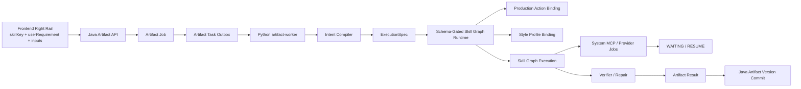

# 产物生成 Skill 优先重构设计

> 本文是现行架构设计基线；2026-07-11 的代码完成度、文档冲突清单与收尾验证见 `产物生成Agent需求审计与收尾改造.md`。

## 1. 文档定位

这份文档用于冻结当前产物生成链路的重构口径。目标不是继续给旧 Agent 架构打补丁，而是把整条链路重新收口成一个稳定、可扩展、可写进简历的独立模块。

本次重构的一句话定义：

`Skill-first + System MCP only + Async Artifact Job + Python Runtime Brain`

本次最值得强调的一句话亮点：

`Controlled Agentic Graph Harness = Production Action + Style Profile + Skill Graph + Artifact Runtime + Capability Union Policy + Verifier / Repair`

它回答四个核心问题：

1. 产品层到底向用户暴露什么。
2. Java 和 Python 应该如何重新切边界。
3. skill、graph、provider、verifier 这些 fancy 概念该放在哪一层。
4. 如何做成“受控产物系统”，而不是继续滑向失控通用 Agent 平台。

## 2. 冻结决策

### 2.1 产品形态

- 中间区域继续以聊天为主。
- 产物能力固定放在最右侧单列。
- 右侧栏展示的是系统内置 skill 列表，不做通用工作流编排器。
- 用户发起任务时提交的是 `skillKey + userRequirement + inputs`。
- `Source Scope / Style Profile / 输出长度 / 语言` 不再默认以并排强表单方式暴露。

### 2.2 对外主语

- 用户选择的是 `Skill`，不是 `Action`。
- 用户不再选择 `MCP`。
- 用户不需要理解 `Skill Graph / Node / Capability Policy / Verifier / Repair`。
- 对外稳定主语只有 `Skill / Artifact Job / Artifact Version`。

### 2.3 MCP 口径

- MCP 改为系统内置能力，不再作为用户可选项。
- 每个 skill 自动挂载其白名单内允许调用的 system MCP capabilities。
- `bilibili-render-pdf` 不再走“用户接入外部 MCP”的产品路径，而是系统内置 capability service。
- 系统接入层可以继续复用 MCP server 的注册、发现和调用协议，但 server 归属于 system-managed registry，不暴露给用户自行选择。
- 拉字幕、转写、PDF 编译这类长耗时动作统一允许异步 provider job 语义。

### 2.4 工程边界

- Java 负责 `Artifact Job / Artifact Version` 业务壳。
- Python `artifact-worker` 负责智能运行时主链路。
- Java 不编译 `ExecutionSpec`，不组装 `RuntimePlan`，不决定 graph 如何展开。
- Java 优先做鉴权、落库、快照、投递、回调和状态沉淀。
- Python 接收完整 skill request，并在内部完成 `Intent Compiler -> ExecutionSpec -> RuntimePlan -> Skill Graph -> Verifier / Repair`。

## 3. 为什么必须重构

当前系统最大的问题不是“功能不够”，而是“主语太乱”。

现状里混在一起的概念包括：

- 面向产品的功能按钮
- 面向运行时的 action
- 面向编排的 graph / node
- 面向能力调度的 MCP / provider
- 面向异步任务的 job / task / version

直接后果是：

- 前端看起来是在点功能，后端却还在围绕 `actionKey` 思考。
- Java 和 Python 同时理解一部分运行时语义，边界越来越乱。
- 想集成一个优秀 skill 时，不清楚应该落在产品层、runtime 层，还是 provider 层。
- 用户需求容易直接污染 skill 本体，系统越来越像 prompt 拼装器。

所以这次重构的重点不是“多做几个能力”，而是先重新排主语：

- 对外只有 `Skill / Artifact Job / Artifact Version`
- 对内才有 `Production Action / Style Profile / ExecutionSpec / RuntimePlan / Skill Graph / Capability Union Policy / Verifier / Repair`

## 4. 目标架构总览



这条链路的核心分层是：

- 前端只知道 `Skill Request`
- Java 只知道 `Artifact Job / Artifact Version`
- Python 才知道 `ExecutionSpec / RuntimePlan / Skill Graph`

## 5. 对外产品模型

### 5.1 SkillDefinition

`SkillDefinition` 是用户能感知到的功能定义，是右侧栏卡片的数据来源。

建议最小字段：

```json
{
  "skillKey": "resume_highlight",
  "displayName": "简历亮点描述",
  "description": "根据当前工作台资料生成可直接用于简历的项目亮点",
  "status": "ACTIVE",
  "inputSchema": {
    "type": "object"
  },
  "defaultInputHints": [
    "强调架构设计",
    "强调工程复杂度",
    "适合校招简历"
  ]
}
```

### 5.2 ArtifactJob

`ArtifactJob` 是一次异步产物任务，承载：

- 谁发起了任务
- 在哪个 workspace 下运行
- 选择了哪个 `skillKey`
- 用户给了什么 `userRequirement`
- 当前处于什么状态

### 5.3 ArtifactVersion

`ArtifactVersion` 是某次任务沉淀出的可回看版本，承载：

- 最终内容
- 结果摘要
- trace 摘要
- 版本号
- 与 job 的绑定关系

进一步地，`ArtifactVersion` 应该成为对外承接运行时 fancy 细节的唯一稳定落点。

建议把运行时细节统一收口到 `runtime_trace`，而不是把这些概念重新暴露成创建任务时的用户参数。当前最值得长期保留的 `runtime_trace` 结构包括：

- `verification`
- `approval_trace`
- `capability_union_trace`
- `node_traces`
- `evidence_coverage`
- `writeback_preview`
- `output_contract_trace`
- `lifecycle_trace`
- `acquisition_callback_trace`

这样可以同时满足三件事：

- 产品层仍然只讲 `Skill / Artifact Job / Artifact Version`
- 运行时层的 `Graph / Policy / Verifier / Repair / Callback` 仍有正式审计出口
- 前端可以先消费摘要，后续再逐步展开详细版本审计面

### 5.4 SkillRequest

前端对后端的最小请求模型固定为：

```json
{
  "skillKey": "resume_highlight",
  "userRequirement": "强调架构设计、异步任务和系统内置 MCP 集成，适合校招简历",
  "inputs": {}
}
```

关键约束：

- 请求主语是 `skillKey`
- 用户需求进入 `userRequirement`
- 结构化参数进入 `inputs`
- 前端不再需要理解 `actionKey`

## 6. 对内运行时模型

以下概念全部收口在 Python worker 内部，不直接暴露给产品层。

### 6.1 Production Action

`Production Action` 是 skill 内部绑定的生成动作模板，用来回答：

- 这类产物本质上在生成什么
- 默认输出形态是什么
- 倾向使用哪个 graph 模板
- 倾向使用哪些 style / capability

示例：

- `resume_highlight` 对应 `RESUME_HIGHLIGHT`
- `study_guide` 对应 `STUDY_GUIDE`
- `bilibili_course_note_pdf` 对应 `COURSE_NOTES_PDF`

### 6.2 Style Profile

`Style Profile` 是“怎么写”的配置层，用来约束：

- 语气
- 结构
- 输出密度
- 受众导向
- 引用倾向

它可以来自：

- skill 默认配置
- workspace 默认偏好
- `userRequirement` 编译结果
- 少量显式 `inputs`

### 6.3 ExecutionSpec

`ExecutionSpec` 是把用户自然语言需求编译后的结构化执行规格。

示例：

```json
{
  "skillKey": "resume_highlight",
  "goal": "生成校招简历可直接使用的项目亮点",
  "audience": "校招面试官",
  "focusPoints": [
    "架构设计",
    "异步任务编排",
    "系统内置 MCP 集成"
  ],
  "styleDirectives": [
    "动词开头",
    "强调结果",
    "尽量量化"
  ],
  "constraints": [
    "控制在 3 条以内",
    "避免空话"
  ],
  "outputShape": "bullet_list"
}
```

### 6.4 RuntimePlan

`RuntimePlan` 是本次运行的内部执行计划，至少包含：

- 绑定后的 `Production Action`
- 绑定后的 `Style Profile`
- 选中的 `Skill Graph`
- 允许调用的 system MCP capabilities
- verifier / repair 策略
- 输出 contract

### 6.5 Skill Graph

`Skill Graph` 是 skill 内部执行图，不是用户概念。

`resume_highlight` 可拆成：

- `source_digest`
- `fact_extractor`
- `impact_normalizer`
- `bullet_writer`
- `resume_verifier`
- `local_repair`

`bilibili_course_note_pdf` 可拆成：

- `video_source_resolver`
- `subtitle_fetch_or_transcribe`
- `chapter_structurer`
- `note_writer`
- `latex_builder`
- `pdf_exporter`
- `artifact_verifier`

### 6.6 Capability Union Policy

`Capability Union Policy` 检查的不是单个 tool 是否可用，而是当前能力组合是否越界。

它评估的对象包括：

- 当前 `Skill`
- 当前 `Production Action`
- 当前 `Skill Graph`
- 当前 system MCP capabilities
- 当前 workspace 数据作用域
- 当前 writeback target

它的价值是避免系统滑向“所有能力都能互相串起来”的通用 Agent 平台。

## 7. 端到端主链路

### 7.1 产品链路

```text
右侧栏选择 Skill
-> 输入需求
-> 创建 Artifact Job
-> 异步运行
-> 得到 Artifact Version
```

### 7.2 系统链路

```text
Frontend
-> POST /api/v2/workspaces/{workspaceId}/artifact-jobs { skillKey, userRequirement, inputs }

Java
-> 校验 workspace / 用户 / 基础权限
-> 创建 ArtifactJob
-> 组装 source scope snapshot / control pack / worker payload
-> 写入 task outbox
-> 调用 artifact-worker /tasks/{taskId}/run

Python
-> 解析 SkillDefinition
-> Intent Compiler 编译 ExecutionSpec
-> Schema Gate 校验 ExecutionSpec
-> 构建 RuntimePlan
-> 执行 Skill Graph
-> 按需调用 system MCP / provider job
-> Verifier / Repair
-> 回调 progress / complete / fail

Java
-> 持久化 ArtifactVersion
-> 更新 ArtifactJob 状态
-> 向前端暴露 job detail / latest version / runtime_trace
```

补充一个已经明确的收口原则：

- Java 不编 `RuntimePlan`
- Java 不决定调用哪些 MCP capability
- Java 不决定 skill graph 如何展开
- Java 只沉淀 `Artifact Job / Artifact Version / wait_context / runtime_trace`
- Python 才是唯一把 `skillKey + userRequirement + inputs` 编译成运行时执行计划的大脑

### 7.3 异步语义

所有长任务统一按异步语义设计：

- 前端提交后立刻得到 `ArtifactJob`
- 前端展示 `RUNNING / WAITING / SUCCEEDED / FAILED`
- Python 可以因为 provider 还在运行而进入等待态
- Java 负责沉淀状态，不要求同步等待最终结果

适用场景包括：

- 远程拉取 B 站字幕
- 无字幕时触发转写
- LaTeX / PDF 编译
- 较慢的 provider 回调

## 8. 前端联动设计

### 8.1 右侧栏交互原则

前端参考 NotebookLM 的产物区思路，但保持“聊天为主，右栏为辅”的结构：

- 中间仍然是聊天区
- 最右侧单列展示 skill cards
- skill 功能清单显式展示在右栏，用户通过点击某个 skill 进入该能力的参数面板
- 点击 skill 后展开轻量表单
- 主输入固定为 `userRequirement`
- 必填 `inputs` 由 `inputSchema` 动态生成
- 下方展示运行中的 job 和最近版本预览

### 8.2 不默认展开的高级项

以下内容不应平铺成主表单：

- `Source Scope`
- `Style Profile`
- `输出长度`
- `语言`

这些能力更适合通过三种方式进入运行时：

- skill 默认值
- workspace 默认值
- `Intent Compiler` 从 `userRequirement` 中提炼

### 8.3 前端最小契约

前端只需要稳定依赖以下接口：

```http
GET /api/v2/skills
POST /api/v2/workspaces/{workspaceId}/artifact-jobs
GET /api/v2/workspaces/{workspaceId}/artifact-jobs
GET /api/v2/workspaces/{workspaceId}/artifact-jobs/{jobId}
GET /api/v2/workspaces/{workspaceId}/artifact-jobs/{jobId}/versions
```

## 9. Java 与 Python 的职责切分

### 9.1 Java 只做业务壳

Java 负责：

- skill catalog 的对外可见性
- `ArtifactJob` 创建和状态维护
- `ArtifactVersion` 落库
- source scope snapshot
- worker 投递与回调处理
- `wait_context` 与 `runtime_trace` 的 typed 暴露

Java 不负责：

- 解析 skill 内部节点
- 选择 graph
- 动态拼装 prompt recipe
- 做 verifier / repair 决策

### 9.2 Python 是唯一运行时大脑

Python worker 负责：

- `skillKey -> SkillDefinition`
- `userRequirement -> ExecutionSpec`
- `ExecutionSpec -> RuntimePlan`
- `RuntimePlan -> Skill Graph Execution`
- system MCP / provider 调用
- `Verifier / Repair`
- waiting / resume / callback

一句话总结：

- `Java = Artifact Job / Artifact Version shell`
- `Python = Controlled Agentic Graph Harness`

### 9.3 `skillKey` 如何联动到运行时

这条映射链路要固定下来，避免前后端再次围绕不同主语开发：

- 前端只负责提交 `skillKey + userRequirement + inputs`
- Java 只负责校验、落 `ArtifactJob`、快照 source scope、投递 worker payload
- Python 根据 `skillKey` 解析 `SkillDefinition`
- `SkillDefinition` 在 Python 内部再绑定 `Production Action / Style Profile / Skill Graph / allowed capabilities`
- `userRequirement` 只参与本次 `ExecutionSpec` 编译，不会直接改写 skill 模板

因此“用户修改需求”本质上是“修改本次 spec”，不是“修改 skill 本体”。

### 9.4 为什么内部还要有 Skill Graph 节点

这里的节点不是产品主语，而是 Python runtime 的内部执行单元：

- 节点让 skill 的生成、校验、修复、调用能力这些步骤可以分开审计。
- 节点来自受控注册表，不是用户现场拼接。
- 节点参数来自 `ExecutionSpec`，不是直接让用户改图。
- 对外仍然只有 `skillKey`，不会退回到 `node-first`。

## 10. Skill 与 system MCP 的集成方式

### 10.1 设计原则

优秀 skill 的接入方式不应该是“直接塞一段 prompt”，而应该是：

1. 注册成系统内置 `SkillDefinition`
2. 绑定内部 `Production Action`
3. 绑定对应 `Skill Graph`
4. 声明允许使用的 system MCP capabilities
5. 统一走 artifact runtime、verifier 与异步 job/version 体系

### 10.2 bilibili-render-pdf 的定位

`bilibili-render-pdf` 应按 system MCP / provider service 接入，而不是散落成一组私有脚本。

推荐拆成两层：

- 产品层 skill：`bilibili_course_note_pdf`
- 能力层 capability service：`system-bilibili-render-pdf`

工程部署上，它可以使用独立的 provider runtime，例如单独的 conda 环境或容器，但调度语义仍统一纳入 artifact-worker 的 waiting / resume 协议。

推荐 capability 拆分：

- `bilibili-source`
- `subtitle-fetch`
- `audio-transcribe`
- `frame-extract`
- `latex-render`
- `pdf-export`

这样对用户的表达始终是“我在使用一个 B 站讲义 PDF 功能”，而不是“我在手工配一个 MCP 组合”。

### 10.3 system MCP 的要求

system MCP / provider 至少需要满足：

- 有固定 server id 或 provider id
- 有稳定 capability 列表
- 可被 skill 白名单绑定
- 可被 provider health / waiting / resume 机制接管
- 长耗时任务支持异步执行和结果回收

## 11. 用户需求如何精准修改 skill

这里最关键的原则是：

我们不是让用户“直接修改 skill 本体”，而是让用户“修改这次运行的 spec”。

### 11.1 SkillDefinition 是模板

`SkillDefinition` 负责声明：

- 这个功能的用途
- 支持哪些输入槽位
- 默认偏好的 style / action / graph
- 允许哪些能力

它本身不因为某次用户需求而被改写。

### 11.2 Intent Compiler 负责编译需求

`Intent Compiler` 把自然语言需求拆成结构化槽位，例如：

- 目标受众
- 强调点
- 风格倾向
- 输出约束
- 语言偏好
- 是否需要文件导出

### 11.3 Schema Gate 负责兜底

编译出来的 `ExecutionSpec` 在进入运行前必须通过 schema gate。

主要检查：

- 是否命中当前 skill 支持的槽位
- 是否缺失必填输入
- 是否要求了不允许的 capability 路径
- 是否出现了与输出 contract 冲突的要求

所以真正的链路是：

`userRequirement -> Intent Compiler -> ExecutionSpec -> Schema-Gated Skill Graph Runtime`

而不是：

`userRequirement -> 动态改 SkillDefinition`

### 11.4 用户需求到底如何精准“修改 skill”

更准确地说，用户需求修改的是“本次 skill 的运行实例”，主要体现在：

- 强调哪些事实
- 面向什么受众
- 要什么输出形式
- 能容忍什么长度和密度
- 是否需要导出型能力

而 skill 本体保持稳定，仍然负责定义：

- 默认 action
- 默认 graph
- 默认 style
- 允许 capabilities
- 输出 contract

## 12. 对外结果契约与运行时审计

### 12.1 wait_context

`ArtifactJob` 在等待态应该只稳定暴露：

- `status`
- `provider_job`
- `approval_request`
- `wait_reason`

这层 contract 要求：

- 不直接泄露 worker 原始动态 payload
- 允许前端准确展示 `WAITING_FOR_PROVIDER / WAITING_FOR_APPROVAL / WAITING_FOR_CAPABILITY`
- 允许 Java 作为业务壳稳定沉淀等待态

### 12.2 runtime_trace

`ArtifactVersion` 详情建议统一抽象为：

```json
{
  "versionId": 12,
  "skillKey": "resume_highlight",
  "contentMarkdown": "...",
  "runtimeTrace": {
    "verification": {},
    "approvalTrace": {},
    "capabilityUnionTrace": {},
    "nodeTraces": [],
    "evidenceCoverage": {},
    "writebackPreview": {},
    "outputContractTrace": {},
    "lifecycleTrace": {},
    "acquisitionCallbackTrace": {}
  }
}
```

这层结构的核心意义是：

- 把运行时复杂性放到“结果审计”里，而不是放到“请求协议”里
- 让前端先消费摘要，再逐步展开详细版本审计面
- 让 `Verifier / Policy / Callback / Lifecycle` 变成可测试、可回看、可汇报的正式资产

## 13. 推荐的首批内置 skill

### 13.1 V1 直接对外

- `resume_highlight`
- `study_guide`
- `quiz_pack`
- `wiki_page`
- `bilibili_course_note_pdf`

### 13.2 V1.5 继续内置但可暂不前台暴露

- `report_draft`
- `faq_draft`
- `structured_note`
- `video_summary`
- `audio_minutes`
- `course_notes`

## 14. 建议的数据模型

### 14.1 Java `artifact_job`

建议字段：

- `id`
- `workspace_id`
- `task_id`
- `skill_key`
- `user_requirement`
- `inputs_json`
- `source_scope_snapshot_json`
- `status`
- `progress_phase`
- `progress_message`
- `wait_context_json`
- `latest_version_no`
- `created_at`
- `updated_at`

### 14.2 Java `artifact_version`

建议字段：

- `id`
- `artifact_job_id`
- `skill_key`
- `version_no`
- `title`
- `content_markdown`
- `result_payload_json`
- `trace_summary`
- `citations_json`
- `created_at`

其中 `result_payload_json` 建议优先沉淀：

- `verification`
- `node_traces`
- `capability_union_trace`
- `approval_trace`
- `evidence_coverage`
- `writeback_preview`
- `output_contract_trace`
- `lifecycle_trace`
- `acquisition_callback_trace`

### 14.3 Python runtime 核心模块

建议长期保留的模块边界：

- `artifact_skill_catalog.py`
- `intent_compiler.py`
- `content_runtime.py`
- `skill_graph.py`
- `capability_resolver.py`
- `artifact_repository.py`
- `verifier.py`
- `repair.py`
- `callback.py`

## 15. 兼容层与收口策略

### 15.1 对外口径

对外必须坚定转成：

- `skillKey`
- `ArtifactJob`
- `ArtifactVersion`

### 15.2 对内兼容

历史上的 `actionKey` 可以暂时保留为内部兼容字段，但必须满足：

- 不再作为前端必填字段
- 不再作为 Java 对外主语
- 尽量只在 Python 内部绑定和历史数据兼容处出现

## 16. V1 完成标准

这一轮不是要把所有 skill 一次做完，而是要打通一个最小但完整的真闭环。

完成标准定义为：

- 独立模块方式跑通 `resume_highlight`
- 前端右侧栏能发起 skill-first 请求
- Java 能创建 `ArtifactJob` 并异步接 Python 结果
- Python 能完成 `ExecutionSpec -> RuntimePlan -> Skill Graph -> Verifier / Repair`
- provider 等待态能被正确沉淀与恢复
- 系统能沉淀 `ArtifactVersion`
- 对外主语已经稳定为 `Skill / Artifact Job / Artifact Version`

截至 2026-07-07 的当前判断：

- skill-first 外层协议已经基本对齐，尤其是前端 schema-only 右栏、Java `/api/v2/skills` 与 typed `wait_context`、worker 的 schema-first public skill surface 已经收口。
- Java 外层版本详情已经开始 typed 暴露 `runtime_trace`，前端也已经开始消费 `Verifier / Approval / Policy / Contract / Lifecycle / Callback` 这类摘要。
- 当前真正还需要继续打磨的是 runtime 内部审计面，包括更强的输出 contract 校验、waiting/repair/resume 的 lifecycle trace、`evidence_coverage / writeback_preview / node_traces` 的前端展开方式，以及 provider 状态模型统一。

## 17. 最值得强调的简历亮点

建议沉淀成稳定关键词：

- Controlled Agentic Graph Harness
- Schema-Gated Skill Graph Runtime
- Production Action
- Style Profile
- Skill Graph
- Capability Union Policy
- Artifact Job / Artifact Version
- Verifier / Repair

推荐表述：

`设计并重构 Skill-first 的受控式异步产物生成架构，以 Controlled Agentic Graph Harness 统一承接 Production Action、Style Profile、Skill Graph 与 Artifact Runtime，并通过 Schema-Gated Skill Graph Runtime 约束执行计划、通过 Capability Union Policy 管理内置能力组合风险，以 Artifact Job / Artifact Version、Verifier / Repair、runtime_trace 支撑异步长任务、结果版本化与可审计修复闭环。`

## 18. 结论

这次重构的关键不是再增加多少按钮，而是先把产物系统的主链路拉直。

最终稳定形态应该是：

- 产品上，用户只是在右侧栏选择一个 skill 并输入需求。
- 工程上，Java 只维护 job / version 业务壳。
- 智能运行时上，Python 用 `Controlled Agentic Graph Harness` 驱动 `Schema-Gated Skill Graph Runtime`。
- 能力控制上，system MCP 由 `Capability Union Policy` 统一约束。
- 稳定性上，依靠 `Verifier / Repair`、`wait_context`、`runtime_trace` 和异步 job/version 体系承接长任务与恢复。

这样既能把复杂度藏在系统内部，又能保留足够强的架构亮点和后续扩展空间。

## 19. Java 到 Python 的正式联动契约

这里再把一个容易争论的点冻结清楚：

前端发给 Java，Java 再把完整任务上下文交给 Python，但 Java 不替 Python 做 runtime 决策。

### 19.1 前端到 Java

前端提交：

```json
{
  "skillKey": "resume_highlight",
  "userRequirement": "强调架构设计、异步任务编排和 system MCP 集成，适合校招简历",
  "inputs": {}
}
```

### 19.2 Java 到 Python

Java 投递 worker 的 payload 建议固定为：

```json
{
  "artifactJob": {
    "jobId": 101,
    "taskId": 9801,
    "workspaceId": 7,
    "skillKey": "resume_highlight",
    "userRequirement": "强调架构设计、异步任务编排和 system MCP 集成，适合校招简历",
    "inputs": {}
  },
  "sourceScopeSnapshot": {
    "workspaceSourceIds": [11, 15, 19],
    "artifactVersionIds": [42]
  },
  "controlPack": {
    "writebackMode": "ARTIFACT_VERSION",
    "runtimeMode": "ASYNC",
    "traceLevel": "STANDARD"
  }
}
```

### 19.3 冻结原则

- Java 传“事实和边界”，不传“运行计划”
- Java 不编 `ExecutionSpec`
- Java 不产出 `RuntimePlan`
- Java 不决定 `Skill Graph`
- Python 才是唯一会把请求编译成运行时执行计划的大脑

这能保证：

- Java 继续保持主系统的业务真源角色
- Python 可以独立演进 skill graph 和 verifier 体系
- 前后端不会再次围绕 `actionKey` 和 runtime 细节反复打架

## 20. 当前推荐的继续重构方向

截至 2026-07-07，当前最值得继续做的不是再扩一堆新入口，而是继续把现有主链路做硬。

优先顺序建议：

1. 前端把历史 `ArtifactVersion` 的 `runtime_trace` 查看能力补全，让运行时审计面不只停留在“最新结果卡片”。
2. 继续 typed 化 provider callback / receipt / delivery contract，把 waiting 链路做成正式长任务协议。
3. 强化 `resume_highlight` 的 `ExecutionSpec -> Skill Graph -> Verifier / Repair` 内部结构，让 V1 的简历亮点功能更能体现 runtime 亮点。
4. 继续清理 action-first 残留，把 action 彻底收回 Python 内部绑定层。

这一轮的判断标准不再是“又多接了几个 skill”，而是：

- skill-first 主语有没有更稳
- Python runtime brain 有没有更完整
- `runtime_trace` 有没有更可演示
- provider waiting / resume 有没有更像正式协议

## 21. 2026-07-11 实施结论

上述四项继续重构方向均已完成主闭环：历史/最新版本均能查看 typed runtime audit；provider callback/delivery/waiting/resume 已形成正式协议并具备落盘恢复；`resume_highlight` 保持六节点 graph 与 verifier/repair；公开 Java/Frontend/Worker contract 已持续移除 action-first 字段。

本轮还补充了自动 outbox、可选真实 LLM、system Bilibili MCP、Artifact 保存为资料、Note/Wiki Java host writeback、统一对象存储 file metadata、同 Job 版本再生成/比较/追加式回滚、owner-scoped lease、dead-letter/metrics/redrive 和 `/internal/*` 服务认证。现行完成边界详见 `产物生成Agent需求审计与收尾改造.md`。
