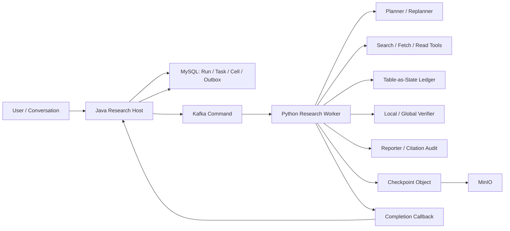

# Deep Research Agent：详细架构与具体设计

> 本文是实现结构和机制真源。完整的 Git 时间线、设计演进、相近框架比较和五分钟取舍主回答见 [Research Agent 演进、技术选择与 Trade-off 专项](16-Research-Agent演进与技术取舍专项.md)；完整学校案例、算法口径、消融实验和 AI 协作 Ownership 见[真实案例、消融实验与 Ownership 答辩](17-Research-Agent真实案例消融实验与Ownership答辩.md)。
>
> 面试使用顺序：先背[一体化面试手册](30-Research-Agent一体化面试手册.md)的 4 分钟主回答，再从本文选择一个机制深挖。状态、字段和跨服务语义若与本文冲突，以 [Research 契约级数据模型](25-Research-Agent契约级数据模型与面试官下钻.md)、[API 与事件契约](../API与事件契约-v2.md)和当前源码为准。本文中的方案推导不自动等于生产运行事实，指标仍按 `[已测-模拟]`、`[演练假设]` 和 `[生产待验证]` 区分。
>
> 本文以当前 Matrix/Cell 实现为主。面试推荐方案使用稳定 ResearchRun、独立 ExecutionAttempt 和 Typed WorkItem，Matrix 只负责多对象多维度比较；验证按 L0 确定性规则、L1 语义判断、L2 独立复核分级。统一裁决见[面试推荐架构与规模化演进裁决](43-面试推荐架构与规模化演进裁决.md)。

## 0. 从搜索循环到验证驱动 Research Agent

### 0.1 V0：先用 ReAct 验证“模型能不能自主研究”

最小实现是让模型在 Search、Read、Think、Write 之间循环。它的优势是代码少，对问题结构没有强假设，面对短路径探索时很灵活。早期用它验证工具可用性和研究体验是合理的。

问题在任务变长后出现：模型可能搜到一条资料就开始写结论，也可能对同一问题重复搜索；多个实体和字段混在对话轨迹里，无法准确回答“还缺什么”；新来源与旧来源冲突时，最后一次生成容易覆盖前面的判断；进程中断后，即使保存全部对话，也很难知道哪些字段已经验证。

### 0.2 V1：用 Plan-and-Execute 固定目标，但不固定所有动作

固定 Workflow 的优点是确定、易测试，适合步骤稳定的任务；自由 ReAct 的优点是能处理未知路径。Research 同时需要两者，因此系统把 Research Intent 作为稳定完成契约，把 Plan 作为可变执行策略。首次规划覆盖完整研究范围，只有出现来源失败、字段长期缺证或实体范围变化时才 Replan。

这一阶段解决了目标漂移，却没有解决状态表达。如果 Plan 的完成度仍藏在自然语言里，恢复和并发仍然不可靠。

### 0.3 V2：把研究过程从对话轨迹变成 Table-as-State

当前比较型实现把实体建模为 Row，把待研究属性建模为 Cell。每个 Cell 保存候选值、证据引用、冲突引用、状态和版本。搜索和阅读只产生 Candidate 与 Evidence，不能直接写最终报告。推荐领域模型把 Cell 提升为 `MATRIX_CELL` 类型的 WorkItem，并为开放调查、事实核验、时间线和来源审计提供各自类型，运行合同相同，验收语义不同。

选择 Cell 而不是整篇文档作为更新单位，是因为 Research 的缺口和冲突通常发生在字段级。选择结构化表而不是自由 JSON，是为了让完成度、优先级、并发冲突和恢复点都能由程序检查。代价是规划时必须先定义实体和字段，对完全开放、无法结构化的问题不如自由 ReAct 灵活。

### 0.4 V3：从单次采信演进为候选仲裁

候选合并比较过四个方向：Last Write Wins 最简单，但新结果不代表正确；Majority Vote 能吸收单点噪声，却会把同站转载误当成独立支持；Authority-first 对法规、官方文档等字段有效，但开放问题不总有唯一权威源；Independent Candidate Quorum 能同时检查候选值、来源身份和支持度，代价是需要更复杂的 Provenance 与归一化。

当前方案让候选先进入合并门，再写 Canonical Cell。合并时校验 Cell Version、Plan Revision、Lease Epoch、Fencing Token 和状态。冲突不能自动消解时返回 `VERIFIED_VALUE_CONFLICT` 并保留原值，不虚构 `CORRECTED` 或 `SCOPED` 状态。

### 0.5 V4：验证从“有引用”升级为局部与全局双门禁

有 URL 只能证明模型见过某个页面，不能证明原文支持当前结论。Local Verifier 检查单个 WorkItem 的直接支持、否定证据、来源身份和冲突；Global Verifier 检查整个 Intent 的必填字段、关键缺口、跨 WorkItem 一致性和报告引用覆盖。Local/Global 是验证责任，不强制对应两个模型调用。普通任务先跑 L0 确定性规则，再对争议 Claim 使用 L1 语义 Judge；高风险结论才增加 L2 独立来源、异构 Judge 或人工抽检。

Verifier 也可能误判，因此确定性规则和模型判断分层执行，低置信否决可以进入有限反证分支。系统用 Gap 优先级、预算和循环上限约束恢复，不做无界自我反思。

### 0.6 V5：长任务从“能跑完”升级为“能恢复且不会被旧结果覆盖”

只保存最终报告无法恢复；保存完整 Event Sourcing 日志能重建任意状态，但事件兼容、存储和回放治理成本过高。当前方案保存结构化 Checkpoint、任务快照、预算账本和完成回执，大状态放 MinIO，恢复前校验大小和 SHA-256。

Worker 通过 Lease 执行任务，Cell 用 CAS 合并，最终报告与 Manifest 原子提交。完成已落库但响应丢失时，重复请求返回原回执；旧 Worker 晚到时，版本和 Fencing 条件阻止它覆盖新状态。

### 0.7 功能点决策表

| 功能点 | 最小方案 | 候选方向 | 当前选择 | 选择依据与代价 |
|---|---|---|---|---|
| 任务目标 | 每轮 Prompt 重述 | 固定 Workflow、Intent + Plan | Intent 稳定，Plan 可版本化 | 兼顾目标稳定与动态探索，增加计划治理 |
| 研究状态 | 保存 Agent 对话 | 文档级状态、自由 JSON、字段表 | Typed WorkItem，Matrix 为比较型适配器 | 共享调度与版本合同，同时支持 Claim、Question、Timeline 和 Cell |
| 候选合并 | Last Write Wins | 多数票、权威优先、独立候选仲裁 | 来源可审计的候选仲裁 | 降低错误覆盖，增加归一化和 Provenance 成本 |
| 验证 | 最终模型自检 | 单层 Verifier、规则校验、双层验证 | L0 规则、L1 语义、L2 独立复核 | 按风险付出 Judge 成本，允许证据不足 |
| 循环停止 | 模型自行判断 | 固定轮次、预算耗尽、完成契约 | Stop Contract + Gap Priority | 防止过早收敛和无限循环，可能保守拒绝 |
| 并发 | 单 Worker 顺序执行 | 全并行、字段级并行、有界 Wave | 默认顺序 WorkItem + Fetch 并发，满足阈值才启用 Wave | 避免并发为 1 时维护空转 Barrier |
| 恢复 | 从头重跑 | 全事件回放、Checkpoint | Checkpoint + 审计记录 | 实现成本低于 Event Sourcing，历史重建粒度有限 |
| 最终写作 | 直接读搜索结果 | 读全部候选、只读 Canonical State | Verifier-Gated Synthesis | 防止未验证内容进入报告，可能牺牲信息丰富度 |

### 0.8 面试叙事顺序

先讲 ReAct 为什么适合原型，再讲长任务暴露的漂移、冲突和恢复问题；接着讲 Intent/Plan 与 Table-as-State；然后只挑候选仲裁、双层 Verifier、Checkpoint 三个机制展开；最后说明系统牺牲了一部分自由度和调用成本，换来可验证、可恢复和可审计。不要一上来背 Cell、Epoch、Quorum 等术语。

## 1. 设计目标与边界

### 1.1 目标

- 将开放式问题编译为可执行、可检查的研究计划。
- 让每条核心结论绑定到可回放的来源快照与原文证据。
- 允许资料不足、来源冲突和局部失败，不要求模型一次完成。
- 长任务可以中断恢复，重复消息和旧结果不会破坏新状态。
- 研究过程、最终报告和资源消耗都能评估。

### 1.2 非目标

- 不追求无限自主执行。
- 不把内部 Gold Set 表述为外部 Benchmark 成绩。
- 不实现无界并行分支搜索。
- 不保证所有开放问题都能得到确定答案。
- 不让模型绕过 Workspace、来源范围和权限边界。

## 2. 总体架构



Java Host 维护业务真源、权限、事务、任务状态和可靠投递。Python Worker 负责动态规划、工具调用、证据抽取、验证和报告生成。两者通过版本化命令与完成契约协作。

## 3. 核心领域对象

### 3.1 ResearchRun

代表一次研究任务，包含 Workspace、Conversation、Research Intent、运行状态、当前轮次、计划版本、检查点位置和最终报告引用。

建议状态：

```text
CREATED -> PLANNING -> RUNNING -> VERIFYING -> REPORTING -> COMPLETED
                         |            |             |
                         v            v             v
                      WAITING      RECOVERING      FAILED
```

终态必须幂等，完成、失败和取消之间不允许任意覆盖。

### 3.2 ResearchIntent

将用户自然语言转换为稳定契约：

- research_goal
- research_type
- entity_type
- required_columns
- source_scope
- constraints
- deliverable_format
- depth

Intent 不是最终 Plan。它描述“必须完成什么”，Plan 描述“当前准备怎么完成”。

### 3.3 ResearchPlan

包含全局阶段、查询族、工具范围、停止条件和检查点。Plan 有版本号，Replan 生成新版本并保留原因，不能覆盖历史。

### 3.4 State Ledger

Ledger 是 Worker 侧结构化研究状态，对应 Java 侧持久化的 Row、Cell、Evidence 和审计对象。核心结构可以抽象为：

```json
{
  "entity": "Alpha Research",
  "cells": {
    "problem": {
      "candidate": "...",
      "status": "VERIFIED",
      "supporting_evidence_ids": ["ev-1"],
      "conflicting_evidence_ids": [],
      "version": 3
    }
  }
}
```

### 3.5 Evidence

Evidence 不是 URL 字符串，而是带来源身份和内容定位的不可变记录：

- source_id / snapshot_id
- title / source_type
- excerpt / span
- content_hash
- fetched_at
- association target
- polarity

### 3.6 Checkpoint

Checkpoint 保存恢复所需的闭包：Plan 版本、Ledger、Evidence 引用、已执行动作、Verifier 结果、循环决策、预算快照和下一步恢复目标。数据库保存索引与摘要，大体积状态存入 MinIO。

## 4. 主执行链路

### 4.1 创建与投递

1. Java Host 校验 Workspace 权限和来源范围。
2. 在本地事务中创建 ResearchRun、顶层 Task 和 Outbox。
3. Dispatcher 通过 Lease/CAS 领取 Outbox 并发送 Kafka。
4. Worker 收到命令后校验任务 ID、交付编号和输入版本。

### 4.2 规划

Planner 从 Intent 生成全局 Plan，至少确定：

- 需要发现哪些实体。
- 每类实体要填写哪些字段。
- 哪些来源可用。
- 哪些字段属于高影响字段。
- 何时停止或允许带不确定性写作。

### 4.3 搜索与阅读

搜索不直接生成最终结论，而是生成 Source Candidate。Fetch 固化来源快照，Read 根据当前缺口选择阅读窗口，Extract 产出候选值和 Evidence Binding。

工具结果必须区分：

- 未找到结果。
- Provider 失败。
- 找到但不相关。
- 找到相关来源但没有直接证据。
- 找到支持或冲突证据。

### 4.4 Cell 合并

候选值不能直接覆盖 Canonical Cell。合并前检查 Cell Version、Lease Epoch、Evidence 身份和当前状态。旧 Worker 返回的结果即使内容正确，也不能覆盖更新版本。

### 4.5 验证与循环决策

Local Verifier 对 WorkItem 做支持度、冲突和来源检查。Global Verifier 基于当前 Ledger 重新计算 Intent Completion Contract。当前 Matrix 实现中 WorkItem 对应 Cell。两者表示局部和集合级责任，可以共享一次语义判断结果，但不能省略各自的不变量。循环决策可以是：

- CONTINUE_SEARCH
- EXPAND_READ_WINDOW
- REPLAN
- COUNTERFACTUAL_RECHECK
- WRITE_WITH_GUARDRAILS
- SYNTHESIZE_REPORT
- FAIL_WITH_REASON

### 4.6 报告生成

Reporter 只读取通过门禁的 Canonical State。对于 Partial 或 Conflicted Cell，必须带限制条件或不确定性。报告生成后执行 Citation Association 与 Support Audit，再提交 Java Host 原子完成。

## 5. Plan/Replan 控制模型

### 5.1 Full-Horizon Plan

首次规划覆盖完整研究地平线，让系统知道最终交付需要哪些阶段，避免只看当前一步。

### 5.2 Lazy Replanning

只有出现可观测偏差时才 Replan，例如关键来源失败、实体范围变化、字段长期缺证、冲突无法消解。局部问题优先局部调整，减少计划抖动。

### 5.3 Stop Contract

停止条件不能只写“模型认为够了”，至少考虑：

- 必填字段完成度。
- 高影响字段验证状态。
- 冲突是否处理。
- 来源覆盖是否满足约束。
- 下一轮是否仍有明确恢复目标。
- 是否达到循环和资源上限。

## 6. 验证模型

### 6.1 Local Verifier

输入是一个 Cell、候选值及其 Evidence Set。确定性检查先于语义判断：

1. 来源和快照是否存在。
2. Span 与 Hash 是否匹配。
3. Evidence 是否绑定当前 Cell。
4. 支持和冲突证据是否满足状态转换条件。
5. 语义 Judge 是否认为引用支持候选值。

### 6.2 Global Verifier

Global 不读取 Local 的一句结论作为真值，而是从 Ledger 重算：

- Entity Coverage
- Required Cell Completion
- Row Completeness
- Cross-cell Consistency
- Source Foundation
- Intent Alignment

### 6.3 Verifier-Gated Synthesis

Reporter 不拥有修改研究真源的权限。写作发现新结论时，只能提出候选，不能绕过 Verifier 写入报告。

## 7. 反证与恢复策略

### 7.1 触发条件

- 高影响结论只有一个来源。
- 存在明确冲突证据。
- 候选值置信度高但 Evidence Coverage 低。
- 多轮搜索结果高度同质。

### 7.2 有界执行

当前采用有界顺序恢复：每个冲突生成有限个 Recovery Target，限制查询族、阅读窗口和尝试次数。它能验证反证闭环，但不等同于并行 Tree Search。

### 7.3 冲突处理边界

Worker 内部 Ledger 与 Verifier 可以识别冲突并生成后续 Recovery Target；但当前权威 Canonical Merge 层采用 Fail Closed：如果候选与已 `VERIFIED` 值冲突，返回 `VERIFIED_VALUE_CONFLICT` 并保留原 Cell，不自动把 Cell 转为 `CONFLICTED`，也没有 `CORRECTED` / `SCOPED` 的持久化状态。冲突修复通过后续研究轮次重新生成可验证候选，或在 Guardrailed Report 中保留限制条件；不能把当前实现说成已具备自动口径拆分和 Canonical 值纠正状态机。

## 8. 并发与一致性

### 8.1 任务 Lease

Worker 领取任务后获得有期限 Lease。续租失败或 Epoch 过期时停止提交，防止暂停的旧 Worker 恢复后写入旧结果。

### 8.2 Cell CAS

Cell 合并使用版本或 Epoch 做 CAS。并发候选可以同时计算，但只有基于当前版本的提交能成功，失败方重新读取状态后决定放弃或重新验证。

### 8.3 原子完成

最终完成需要同时固化报告锚点、Evidence Manifest、任务终态和 Outbox 状态。服务端在数据库事务中提交这些业务状态，外部文件使用预先上传的不可变对象引用。

### 8.4 最终一致性

Kafka 命令、MinIO Checkpoint 和 MySQL 状态不使用分布式强事务。系统通过稳定 ID、Outbox、幂等回调、补偿扫描和可见状态实现最终一致。

## 9. 故障恢复矩阵

| 故障点 | 可见现象 | 恢复方式 | 防重手段 |
|---|---|---|---|
| Outbox 发送前宕机 | Task 停留待投递 | Lease 过期后重新领取 | Outbox ID |
| Kafka 重复消息 | Worker 收到相同命令 | 返回已有结果或跳过 | Command ID |
| Worker 执行中宕机 | Lease 到期 | 从最近 Checkpoint 重建 | Checkpoint No |
| 提交成功但响应丢失 | Host 已完成，Worker 重试 | 返回原完成结果 | Completion Anchor |
| 旧 Worker 晚到 | Epoch 已变化 | 拒绝合并 | Lease Epoch / CAS |
| Checkpoint 文件损坏 | 恢复读取失败 | 回退上一有效版本或失败 | Hash / Version |
| Provider 不可用 | 工具连续失败 | 降级来源范围或终止 | Failure Classification |

## 10. 可观测性

需要同时观察业务、执行和资源三层：

- 业务：Run 成功率、Guarded Write 比例、用户保存报告比例。
- 执行：Loop Round、Replan、Verifier 决策、Checkpoint、恢复次数。
- 证据：Entity/Cell/Row 完整度、Citation Association、Citation Support、冲突率。
- 可靠性：Outbox 重试、DLQ、Lease Lost、幂等重放、恢复耗时。
- 资源：搜索调用、LLM 调用、Token、成本和总耗时。

Trace 不记录密钥和不必要的资料全文。敏感内容优先记录 ID、Hash、计数和受控摘要。

## 11. 测试体系

### 11.1 单元测试

- Plan 和 Stop Contract 真值表。
- Cell 状态转换和 CAS。
- Local/Global Verifier 独立性。
- 引用关联与支持判断。
- 反证触发和次数边界。

### 11.2 契约测试

- Java 命令与 Python 输入 Schema。
- Completion Callback 的版本和幂等语义。
- Checkpoint 序列化与恢复兼容性。

### 11.3 故障注入

- 发送前、提交前、提交后响应前宕机。
- Lease 过期与双 Worker 竞争。
- Kafka 重复、乱序和 DLQ 重驱。
- MinIO 读取失败和旧 Checkpoint 回退。

### 11.4 Gold Set

内部 Gold Set 覆盖实体补全、冲突修正和混合来源 Provenance，评估 Entity、Cell、Row、Citation 和 Branch。它用于回归 Harness 行为，不代表外部真实 Provider 和开放网络场景的最终效果。

## 12. 技术取舍

| 方案 | 优点 | 问题 | 当前选择 |
|---|---|---|---|
| 自由 ReAct | 实现快、灵活 | 状态漂移、难恢复 | 只用于局部动作 |
| 固定 Workflow | 可预测 | 开放任务适配弱 | 固定控制协议，不固定研究路径 |
| 全量并行分支 | 搜索覆盖高 | 成本、合并和取消复杂 | 当前有界顺序反证 |
| 全部状态放 Prompt | 开发简单 | Token 高、无法 CAS | 外部化 Table-as-State |
| 只用 LLM Verifier | 语义能力强 | 结果不稳定 | 确定性校验加可选语义 Judge |
| 分布式强事务 | 理论一致 | 跨 Kafka/MinIO 不现实 | Outbox 与幂等补偿 |

## 13. 当前实现边界与后续演进

当前已具备 Table-as-State、全局规划和按需 Replan、Evidence-to-Cell Binding、Local/Global Verifier、有界顺序反证、逐轮 Checkpoint/Resume、Citation Audit、内部 Gold Set 和 Kafka Durable DLQ。

后续若要进入生产声明，还需要补充真实 Provider 长时间运行、扩大外部 Gold Set、并发与成本压测、Provider 级熔断降级，以及和公开 Deep Research Benchmark 的可复现实验。

## 14. Research Loop 的算法化描述

### 14.1 主循环伪代码

```text
state = load_or_initialize_checkpoint(run_id)

while true:
    gaps = find_required_gaps(state.ledger)
    conflicts = find_unresolved_conflicts(state.ledger)
    repeated = detect_repeated_actions(state.trace)

    decision = global_verifier(
        intent=state.intent,
        ledger=state.ledger,
        gaps=gaps,
        conflicts=conflicts,
        repeated=repeated
    )

    if decision in [SYNTHESIZE_REPORT, WRITE_WITH_GUARDRAILS]:
        break
    if decision == FAIL_WITH_REASON:
        fail_run(decision.reason)

    targets = recovery_planner(gaps, conflicts, state.plan)
    for target in bounded(targets):
        evidence = search_fetch_read_extract(target)
        candidate = bind_to_cell(evidence, target.cell_id)
        local_result = local_verifier(candidate)
        compare_and_merge(candidate, local_result)

    persist_checkpoint(state)

report = reporter(verified_projection(state.ledger))
audit(report, state.evidence)
commit_completion_idempotently(report)
```

这段伪代码体现四个不变量：Reporter 不读取未验证候选；Recovery Target 必须来自明确 Gap/Conflict；每轮落 Checkpoint；最终完成幂等。

### 14.2 Gap 优先级

不需要虚构复杂算法，可以使用可解释评分：

```text
priority(cell) = requirement_weight
               + criticality_weight
               + conflict_weight
               - evidence_sufficiency
               - repeated_attempt_penalty
```

必填高影响字段优先，已有充分证据的字段降权，重复失败的动作增加惩罚。这个评分只决定执行顺序，不直接决定结论真假。

## 15. Cell 合并门与真值表

### 15.1 当前权威合并状态

```text
EMPTY / CANDIDATE / NEED_MORE_EVIDENCE -> VERIFIED
                                          |
                                          +-- 同值独立支持：追加 Evidence / 版本递增
                                          +-- 异值冲突：REJECT(VERIFIED_VALUE_CONFLICT)，原值不变
```

Worker 内部研究 Ledger 可以记录冲突信号用于补查，但 Java 权威合并层当前只接受满足证据、版本和 Lease 门禁的候选，或以明确原因拒绝；不持久化 `CONFLICTED/CORRECTED/SCOPED` 自动转换。

### 15.2 合并真值表

| 当前状态 | 新证据 | Local 结果 | 权威合并动作 |
|---|---|---|---|
| EMPTY | 支持候选 A | PASS | 写入 A，进入 CANDIDATE/VERIFIED |
| VERIFIED A | 再次支持 A | PASS | 追加 Evidence，版本递增 |
| VERIFIED A | 支持 B 且与 A 冲突 | CONFLICT | `VERIFIED_VALUE_CONFLICT`，拒绝 B，A 保持不变 |
| 任意 | Version / Lease / Snapshot / Span 无效 | REJECT | 不进入 Canonical State |
| 存在未解决冲突 | 达到停止边界 | PARTIAL | 报告带限制条件，不自动修正 Canonical 值 |

## 16. Citation Support 的分层算法

第一层做身份与完整性检查：Source、Snapshot、Span、Hash 是否存在。第二层做 Association：引用是否属于当前 Claim/Cell。第三层做 Support：片段是否蕴含候选值。Support 可组合词法覆盖、极性检测和可选语义 Judge。

不能把词面重合当作语义支持。例如原文“方法 A 没有改善准确率”，候选却写“方法 A 改善准确率”，关键词高度重合，但极性相反。因此至少要检查否定词、比较方向和数值单位。

## 17. Checkpoint Schema 设计

```json
{
  "run_id": "...",
  "checkpoint_no": 7,
  "predecessor_checkpoint_no": 6,
  "plan_version": 3,
  "ledger_digest": "sha256:...",
  "evidence_manifest_ref": "...",
  "local_verifier_summary": {},
  "global_verifier_decision": "CONTINUE_SEARCH",
  "executed_action_keys": [],
  "recovery_targets": [],
  "created_at": "..."
}
```

`predecessor` 形成恢复链，Digest 防止对象损坏，Executed Action Key 用于重复动作检测。恢复时先校验 Run、Checkpoint 单调性和对象 Hash，再恢复 Ledger。

## 18. 调度与并发控制细节

### 18.1 Claim

Dispatcher 领取任务时执行条件更新：只有 `status=READY` 且 Lease 已过期的记录能被更新为当前 Owner。更新行数为 1 才获得执行权。

### 18.2 Renew

续租必须同时匹配 Task ID、Owner 和 Epoch。只按 Task ID 更新会让已经失去所有权的 Worker 延长新 Worker 的任务。

### 18.3 Commit

提交候选时检查 Cell Version 和 Task Epoch。CAS 失败不是系统异常，而是并发冲突信号，Worker 重新读取后判断该候选是否仍有价值。

## 19. 复杂度与容量估算

设实体数为 E、每个实体字段数为 C、平均每个 Cell 证据数为 K，则 Ledger 核心状态规模约为 `O(E × C × K)`。搜索成本主要由未完成 Cell 和恢复轮数决定，而不是报告字数。通过字段级缺口驱动，可以避免每轮对全部来源重新搜索。

实际容量还受 Provider Rate Limit、单次阅读窗口、Checkpoint 大小和 Kafka 积压影响。面试时应先给容量模型，再说明没有真实压测就不报 QPS。

## 20. 代码中的隐藏设计：候选仲裁而不是单次采信

同一个 Cell 不把 Worker 第一次返回的值直接写成结论，而是保留独立 Candidate Slot。候选只有在来源域、证据身份和生成上下文满足独立性约束后，才能参与一致性仲裁。两个独立候选给出相同值时形成 Quorum；同域资料的重复表述只能算佐证，不能伪装成两个独立来源。

这套设计处理的是 LLM 研究中的相关性错误：模型可能从同一个网页的转载、摘要和原文得到三条看似不同的证据，但它们共享同一信息源。如果只按 Evidence 数量投票，会把一次错误放大成多数意见。因此，仲裁看的是证据谱系和来源独立性，而不是简单计数。

候选冲突时不覆盖旧值，而是生成 Repair Signal，携带冲突字段、候选值、证据来源和需要补查的方向。Pending Receipt 保持不可变，直到所有 Candidate Slot 进入终态，Cell Binding 才能释放。这样可以避免较慢候选晚到后改写已经开始生成的报告。

失败语义采用 Fail Closed：无法证明独立性、候选槽位未收齐、相同值只来自同域资料时，Cell 仍保持 Pending 或 Partial。面试时可以把它概括为“基于来源独立性的候选仲裁”，再根据追问展开 Quorum、伪多数和冲突修复。

## 21. Adaptive Evidence Horizon 与提前收敛保护

Research Agent 的阅读范围不是固定 TopK。每个 Cell 维护 Evidence Horizon：已经得到高质量支持的 Cell 缩小后续搜索范围，把资源让给不确定字段；低覆盖、冲突或重试压力上升的 Cell 扩大阅读窗口，并允许进入反证方向。Checkpoint 同时保存 Plan 和 Horizon State，恢复后不会重新从默认范围开始。

这相当于把固定检索改成不确定性驱动的自适应采样。它与多臂老虎机并不完全相同，因为项目没有按收益概率在线学习，但共享“把更多资源分配给信息增益更高目标”的思想。这里更准确的工程表述是 Adaptive Evidence Horizon，而不是声称实现了某个在线学习算法。

系统还有 Premature Commitment Guard。只要 Required Frozen Cell 未完成，或仍有 Active Counterfactual Branch，Synthesis 就不能提前开始。运行达到终止边界时可以生成 Guardrailed Report，但必须保留缺失项、冲突项和来源限制。Web-only No Hit 不能被解释为“没有事实”，只能记录为 Evidence Abandonment，说明本轮没有找到足够证据。

有界执行需要区分两个层次：反证分支按受控顺序推进，避免分支爆炸；同一轮中互不依赖的 Fetch Hit 可以做 Bounded Concurrent Fetch，降低 I/O 等待。文档中不能把“没有无限并行分支”误写成“所有抓取都串行”。

## 22. Source Foundation 与可信度折损

Global Verifier 不只检查结论是否有引用，还汇总整份研究的 Source Foundation。来源被区分为工作区权威资料、外部权威资料、低信任来源和仅作为 Fallback 的来源。Provider Fallback 与 Transport Fallback 也进入 Trace，防止“主数据源失败后用了替代网页”在最终报告里看不出来。

当结论主要依赖低信任或外部兜底资料时，Completion Score 会折损，报告展示 Source Foundation Summary 与 Confidence。这里的 Confidence 不是模型随口给出的概率，而是由证据覆盖、来源等级、候选一致性、冲突状态和降级路径共同决定的可解释分数。

外部资料只有在正确 Lease 下归档后才能成为 Evidence。Tool Permit 从锁定的权威快照派生，校验 Owner、Epoch、Tool Identity 和 Workspace Scope；Rate-limit Scope 不接受调用方自行传入。归档资料还要匹配服务端保存的 External Snapshot，避免 Worker 用未经归档的文本完成研究。

网络接入层同时限制 SSRF、Loopback、DNS Rebinding 和跨端口重定向，重定向时不转发凭据。内容解码区分超限、损坏和编码问题，支持从响应头或页面元信息识别字符集。占位页、空仓库内容和疑似 Prompt Injection 会降低 Source Quality，Trace 中的密钥和内部路径必须脱敏。

## 23. 跨语言 Canonicalization 与不可变边界

Java Host 和 Python Worker 之间不能直接对“各自序列化后的 JSON”计算摘要，否则字段顺序、Unicode 归一化、浮点格式和空白差异都会制造假冲突。项目使用共享 Canonical Digest 规则：字符串做 NFC 归一化，对象键按无符号 UTF-8 字节序排列，JSON 使用紧凑编码，并对 Emoji、行分隔符和 Unicode 空白进行一致处理。

Canonicalizer 拒绝重复键、布尔值与数字混淆、不可接受的浮点表示，以及 NFC 后发生碰撞的键。输入先做 Raw Byte Limit，再解析与 Deep Freeze，防止“校验通过后对象又被修改”的 TOCTOU 问题。Digest Mismatch、Path-Body Mismatch 和非法 Schema 在查询业务数据库前就被拒绝，减少恶意请求对数据库的放大。

这部分可以引出 Canonical Serialization、Content-addressed Identity、TOCTOU、跨语言协议一致性和防御式解析。面试时不要只说“用了 Hash 保证一致”，Hash 只能检测字节差异，真正困难的是先定义唯一字节表示。

## 24. 原子完成、恢复回执与知识物化

Research Completion 不只更新任务状态。一次完成事务需要同时提交 Execution Aggregate、子任务、Cell、资源账本、任务终态、Outbox 和 Evidence Binding。相同 Completion 重放返回原 Receipt；相同幂等键但不同 Payload 视为冲突；Completion、Cancel 和直接释放在数据库状态机中线性化。

如果数据库提交成功，但 HTTP Response 返回前进程失败，调用方可以用稳定 Completion Identity 取回完全相同的 Receipt。Receipt Corruption、Physical Reservation Drift 和 Stable Key Conflict 均 Fail Closed，不能为了“继续跑”临时重建一个看似合理的结果。

Finalizer 生成 Citation-gated Evidence Manifest。只有通过引用支持审计的证据进入清单，幂等 Finalizer 可以补齐已完成任务缺失的 Manifest。验证通过的研究还可以物化为 Workspace 内的 Research Collection，供后续资料解析与检索使用；Markdown Table 按稳定 UTF-8 顺序输出并转义单元格，保证重放结果一致。

生产 Lease 决策统一使用 Database Clock，避免多机本地时钟漂移。Outbox 支持优先级调度、单消息失败隔离和退避；Run 已终态或离开对应运行模式后不再发布旧任务。Runtime Health Guard 只暂停初始波次，不阻塞恢复和清理，单个 Run 的调度异常也不能卡住其他 Run。

## 25. 从基础概念理解 Research Agent

### 25.1 LLM、Workflow 和 Agent 的区别

单次 LLM 调用可以理解为函数：给定 Prompt 和输入，返回一段输出。它没有长期任务状态，也不知道外部工具是否真的执行成功。

Workflow 把步骤提前写死，例如先检索，再读取，再生成。它的优点是确定、容易测试；缺点是遇到资料不足或冲突时，不会自己调整路径。

Agent 在运行时根据当前状态选择动作。它能补搜、重读或调用工具，但如果只有一段对话历史作为状态，决策会越来越依赖模型对长上下文的理解。自由度越高，可重复性和故障恢复越难。

NoteWeave 采用受控 Agent：动作集合仍由系统定义，模型负责生成 Plan、候选和修复建议，状态机决定动作是否合法、是否需要继续以及能否完成。这个选择介于固定 Workflow 和完全自由 Agent 之间。

| 方案 | 优点 | 主要问题 | 适用场景 |
|---|---|---|---|
| 单次 Prompt | 实现简单、延迟低 | 无法补查和恢复 | 简单摘要、短问答 |
| 固定 Workflow | 稳定、容易观测 | 对异常输入适应差 | 步骤明确的批处理 |
| 自由 ReAct | 灵活、适合探索 | 循环、漂移和审计困难 | 低风险探索任务 |
| 受控 Research Loop | 能动态补查，也能验证和恢复 | 状态与协议复杂 | 长研究、结构化报告 |

### 25.2 ReAct 为什么容易漂移

ReAct 把 Reasoning 和 Acting 交替进行。第 n 轮决策依赖前 n-1 轮的观察和模型总结。一旦早期把实体识别错了，后续搜索词、阅读范围和结论都会沿着错误方向发展。长历史还会带来 Context Rot，模型可能忽略早期约束，或重复已经执行的动作。

Research Plan 把目标先拆成显式结构，State Ledger 记录已完成动作，Stop Contract 检查循环边界。模型仍能根据缺口调整 Plan，但修改必须形成新的 Plan Revision，而不是悄悄改变目标。这相当于把隐含推理变成一部分可验证的业务状态。

### 25.3 Plan-and-Execute 的三种实现

第一种是 Full Plan：开始时生成完整步骤，之后严格执行。它容易审计，但早期信息不足时，后半段计划可能失效。

第二种是 Step-wise Plan：每完成一步再决定下一步。它适应性强，却接近自由 ReAct，容易重复和局部最优。

第三种是 Full-Horizon Plan 加 Lazy Replanning。项目先生成完整研究结构和初始动作，只在证据不足、实体变化、冲突或 Provider 降级时重规划受影响部分。它保留全局目标，又避免每一步都重新规划。

选择 Lazy Replanning 的原因是研究任务需要全局覆盖，但资料内容在执行前无法全部知道。代价是必须维护 Plan Revision、受影响 Cell 和重规划原因。

## 26. Table-as-State 的数据结构与算法

### 26.1 为什么用 Cell

以文档为状态单位时，只能知道“这份文档读过了”，不知道它支持了哪些结论。以 Claim 为单位时，比较类任务中的空缺字段不容易表示。Cell 同时绑定 Entity 和 Field，天然形成覆盖矩阵：

```text
CellKey = EntityId + FieldId + PlanRevision
```

调度器可以扫描 Required Cell，计算 Pending、Partial、Verified 和 Conflicted 数量。缺口优先级可以综合字段重要性、证据数量、冲突程度和重试压力。

### 26.2 Cell 更新为什么使用 CAS

Worker 读取 Cell Version 3 后开始抽取，期间另一个 Worker 可能已经把它更新为 Version 4。如果旧 Worker 直接写入，会覆盖较新的判断。条件更新要求：

```text
update cell
set value = ?, version = version + 1
where id = ? and version = 3 and lease_epoch = ?
```

受影响行数为 0 表示并发状态已经变化。Worker 重新读取后决定丢弃候选或参与仲裁。CAS 不会阻止重复计算，但能阻止旧结果覆盖；Lease 减少重复计算，Fencing Token 处理旧 Owner 晚到，三者解决的问题不同。

### 26.3 为什么不使用数据库悲观锁贯穿研究

研究任务可能持续数分钟，持有行锁会占用连接、阻塞其他任务，并在 Worker 崩溃后增加恢复成本。项目只在短事务的 Claim、仲裁和完成阶段使用数据库锁或条件更新，模型调用和网络抓取都在事务外执行。

悲观锁适合临界区短、冲突概率高的更新；乐观版本控制适合执行时间长、冲突可检测的任务。Research 明显属于后者。

## 27. 候选仲裁的原理与替代方案

### 27.1 Last Write Wins

最后写入者覆盖旧值，实现最简单，却无法区分新值更正确还是只是更晚。异步 Worker 的完成顺序与证据质量没有关系，因此不适合作为研究结论合并策略。

### 27.2 Majority Vote

多数投票假设候选之间具有一定独立性。同一文章的转载和摘要会破坏这个前提。简单计票还能被批量低质量来源压过单个权威来源。

### 27.3 Authority-first

固定优先选择官网或数据库，适合事实口径明确的字段，但官网也可能过期或只描述有利信息。研究比较仍需要交叉来源和时间约束。

### 27.4 Independent Candidate Quorum

项目综合来源独立性、证据身份、时间口径和候选值。一致的独立候选形成 Quorum；同源相同值只增加支持度；不同值进入 Conflict。它比 Last Write Wins 和简单投票复杂，但能解释结论为何被接受。

这套仲裁不是统计学意义上的真值发现算法，也没有根据大规模历史数据学习来源可靠度。当前实现适合来源数量有限、字段可验证的项目研究；来源规模更大时，可以演进为带来源先验和时间衰减的 Truth Discovery。

## 28. 验证算法的 Precision、Recall 与分层

Local Verifier 可以看作二分类或多分类判断器：一条 Evidence 是否支持一个 Cell。Precision 高表示被判定支持的证据大多真的支持，Recall 高表示真正支持的证据大多没有被漏掉。

研究系统更害怕 False Positive，因为错误证据一旦进入 Canonical State，会影响报告；但阈值过严又会让大量正确字段停留在 Partial。因此项目增加 Pending Repair，而不是一次判死。低置信样本继续补证，明确错误才 Reject。

Global Verifier 处理 Local 判断无法发现的问题：

- 每个 Cell 都有证据，但不同产品使用了不同年份的数据。
- 单条引用都正确，最终总结却把两个条件合并成更强结论。
- 所有字段都来自同一低信任来源。
- 表格正确，正文排序和表格数值矛盾。

分层验证的代价是重复计算和更高延迟。只做 Local 适合字段独立的抽取，只做 Global 容易让模型面对过长报告。项目选择两层，是因为字段正确和整体一致属于不同问题。

## 29. 自适应搜索与停止条件

固定 TopK 对所有字段分配相同阅读量。简单字段会浪费资源，困难字段又可能没有足够证据。Adaptive Evidence Horizon 根据 Cell 状态调整：

```text
Verified + High Source Quality  -> shrink
Partial + Low Coverage          -> expand
Conflicted                      -> counterfactual search
Repeated No Hit                 -> provider or query fallback
```

替代方案包括固定轮数、固定 Token、模型自行判断停止。固定边界稳定但不会区分任务难度；模型判断灵活却难以复现。项目使用 Stop Contract，把最大轮次、无新增证据、重复动作、必填覆盖、活动分支和可写状态共同作为终止条件。

停止不等于成功。`can_write` 与 `must_stop` 分开：可以继续且值得继续时进入下一轮；能写且应该停时生成正式报告；不能完整写但必须停时生成带限制的结果。这比单一 Completed/Failed 更符合研究任务。

## 30. Checkpoint、日志与 Event Sourcing 的选择

只保存完整快照，恢复快，但每轮写入大对象；只保存事件，写入轻，恢复时需要从头重放。完整 Event Sourcing 还要求所有状态变化都由事件推导，改造成本高。

项目保存结构化 Checkpoint 和 Audit Trace。Checkpoint 是恢复闭包，Trace 解释执行过程，当前状态仍由业务表保存。这种混合方式牺牲了从任意事件重建全部状态的能力，换来更简单的查询和恢复。

Checkpoint 必须包含版本与身份，不能只保存 Prompt：

- Plan Revision 与 Entity Set Version。
- Cell 状态和 Candidate 引用。
- Evidence Snapshot 身份。
- 当前 Horizon 与活动分支。
- 已执行动作和下一个恢复目标。
- Lease/Execution 身份以及可重放 Receipt。

## 31. 面试中的方案选择总结

选择当前方案的判断顺序是：

1. 结果需要字段级核验，所以用 Table-as-State，而不是只保存对话。
2. 资料内容不可预知，所以用 Lazy Replanning，而不是完全固定 Workflow。
3. 来源可能相关和冲突，所以用独立候选仲裁，而不是 Last Write Wins。
4. 单条正确不代表整体正确，所以用 Local/Global Verifier。
5. 任务持续时间长，所以用 Lease、Checkpoint 和幂等 Receipt，不持有长事务。
6. Java 与 Python 共同提交状态，所以先定义 Canonical Serialization，再使用 Digest。

方案适用于高价值、可结构化、需要审计的研究。短问题、低风险生成和强实时场景应选择更轻的链路。

## 32. 设计概念到生产代码的导航

| 设计概念 | 当前生产实现 | 关键不变量 | 主要测试 |
|---|---|---|---|
| Run 初始化与 Table-as-State | `ResearchAgentRunBootstrapService`、`ResearchAgentTaskCoordinatorService` | Branch、Row、Cell 先持久化，再生成任务 | `ResearchAgentAutomaticRunBootstrapTest`、`ResearchAgentTaskCoordinatorServiceTest` |
| Candidate 仲裁 | `ResearchAgentCellMergeService` | CandidateId 幂等，Cell Expected Version 防止旧结果覆盖 | `ResearchAgentCellMergeServiceTest`、`ResearchAgentMySqlLockMatrixIT` |
| Task Claim 与续租 | `ResearchAgentTaskService.claimTask()/heartbeat()` | Worker、Lease Epoch 与 Fencing Token 必须同时匹配 | `ResearchAgentTaskServiceTest`、`ResearchAgentLeaseClockArchitectureTest` |
| Checkpoint 与预算 | `ResearchBudgetAndCheckpointService`、`ResearchCheckpointIntegrity` | 预算预留和结算可重放，Checkpoint 有序且可校验 | `ResearchBudgetAndCheckpointServiceTest` |
| Coordinator 推进 | `ResearchAgentRunAdvancementService`、`ResearchAgentCoordinatorTickService` | AdvanceKey 幂等，Expected Checkpoint Seq 仲裁 | `ResearchAgentRunAdvancementServiceTest`、Coordinator Scheduler Test |
| Repair 停止 | `ResearchAgentGapProjectionService`、`ResearchAgentRepairStopPolicy` | 冻结 Cell、次数上限和相同原因防止无界修复 | `ResearchAgentRepairStopPolicyTest` |
| 完成提交 | `ResearchAgentCompletionService`、`ResearchAgentCompletionCommitter` | Canonical Payload、回放身份、预算释放与最终状态原子提交 | `ResearchAgentCompletionServiceTest`、Raw HTTP Contract Test |
| 外部证据安全 | Worker `fetch_adapters.py`、`ResearchExternalSnapshotArchiveService` | DNS 与连接固定在 Worker，Backend 归档再次校验来源 | `test_fetch_adapters.py`、`ResearchExternalSnapshotArchiveServiceTest` |

源码导航证明的是当前实现位置；如果并行分支、任务时长或 Worker 数量增长，再基于实际瓶颈讨论执行图和部署形态的调整，不把推测方案写成当前能力。

## 当前运行面

Java 侧先固化输入、预算和运行关联，再写 `research_agent_outbox`；Worker claim 后以 lease/fencing 约束 heartbeat 和 completion。checkpoint 恢复会建立新的运行关联旧 checkpoint，delivery failure 可 redrive。证据清单需要带 source identity、snapshot 和 digest，报告回写仍由 Java 校验 Workspace 和版本，不由 Worker 直接写业务表。
