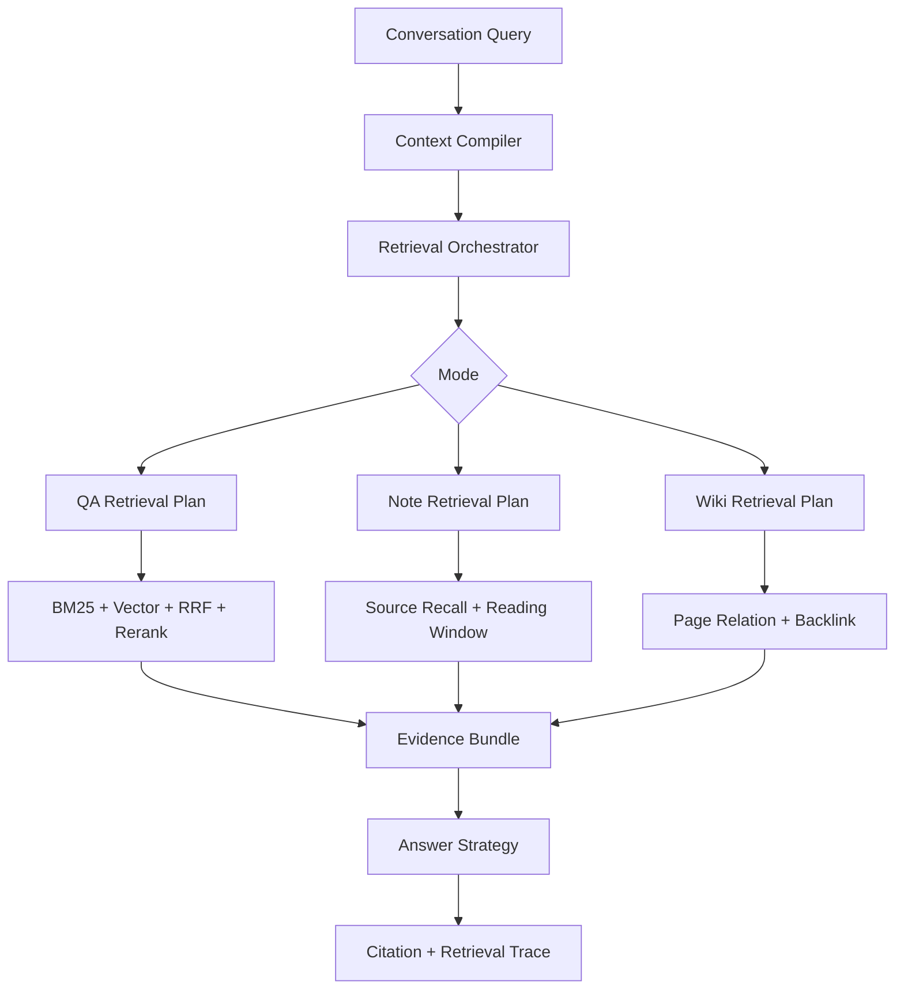

# 场景化 RAG：详细架构与具体设计

## 0. 从一条 TopK 检索到三条场景化 RAG

### 0.1 V0：单路关键词检索先建立可引用问答

最小方案是切分资料，用关键词检索 TopK Chunk，再把片段交给模型。它对明确术语、标题、数字和代码符号很稳定，成本低、容易解释，也是没有高质量 Embedding 和评测集时合理的起点。

它的缺点是用户换一种表达后召回下降，长资料中的同义表述和跨语言问题更明显。于是系统增加向量召回，但向量并没有替代 BM25，因为专有名词、短字符串和精确数字仍是词法检索的强项。

### 0.2 V1：从单路召回演进为 Hybrid Search

BM25 与向量的原始分数不在同一量纲。直接归一化加权实现简单，但分数分布会随查询、索引和模型变化；Learning to Rank 能学习更复杂的组合，需要更大、更稳定的标注数据；RRF 只依赖排名，适合当前数据规模和异构召回。

当前 QA 先做 BM25 与 Vector Recall，再用加权 RRF 合并稳定 Candidate ID。RRF 忽略原始分差，所以只作为候选融合；Cross-Encoder Rerank 在有限候选上重新判断 Query 与文本的联合相关性。Rerank 超时或失败时回退到 RRF 顺序，不把 Provider 故障伪装成“没有证据”。

### 0.3 V2：从通用 TopK 拆出 QA、Note、Wiki

早期可以让三种模式共用一条 Hybrid Search，只替换 Prompt。随着功能深入，候选对象不同的问题无法再靠 Prompt 解决：QA 需要直接支持答案的 Chunk；Note 需要先判断读哪份资料，再围绕锚点取连续原文；Wiki 需要页面身份、版本、关系和来源回链。

系统最终共享 RetrievalPlan、Scope、Provider、Evidence Bundle、Citation 和 Trace，只把召回、排序和预算策略分开。这个选择增加了维护和评测成本，但避免用一组 TopK、Chunk Size 和排序特征勉强覆盖三种目标。

### 0.4 V3：排序之后增加集合级 Evidence Selection

单个候选分数高，不代表整个证据集合好。同一来源的相邻 Chunk 容易占满 TopK，内容重复且缺少来源覆盖。Evidence Selection 在排序之后处理同源去重、直接支持、来源多样性、位置连续性和 Token Budget。

这一步也负责证据不足语义。系统宁可明确拒答或要求缩小问题，也不让模型用高相关但不直接支持的片段补全事实。

### 0.5 V4：索引从“写进去就能搜”演进为版本化投影

Embedding 模型、维度、Mapping 或 Chunk 策略变化后，旧索引不能静默复用。系统让 MySQL 保存 Source、Snapshot、Chunk 和 Projection 状态，MinIO 保存原文件，Elasticsearch 保存可重建投影。Index Version、Strategy Tuple 和 Alias 切换使回填与实验可回滚。

代价是资料从上传到可检索存在一致性窗口，需要区分投影未完成、Provider 降级和 ES 故障，并通过 Projection Lag、Shadow Replay 和 Release Gate 观测。

### 0.6 三条链路各自如何演进

| 链路 | V0 | 新问题 | 当前方案 | 主要代价 |
|---|---|---|---|---|
| QA | BM25 TopK | 同义表达漏召回，单路排序不稳 | BM25 + Vector + RRF + 有限 Rerank + Evidence Selection | 两路查询和 Provider 延迟 |
| Note | 全库 Chunk TopK | 片段脱离资料上下文，长文被切碎 | Source Recall -> Anchor Recall -> Reading Window | 两阶段检索更复杂 |
| Wiki | 普通 Chunk 检索 | 页面版本、关系和来源身份丢失 | 当前页版本 + 文本种子 + 受限关系读取 + Source Backlink | 不是完整 GraphRAG，关系能力受限 |

### 0.7 功能点决策表

| 功能点 | 可选方案 | 当前选择 | 为什么这样选 | Trade-off |
|---|---|---|---|---|
| 词法与语义 | BM25、Vector、Hybrid | Hybrid | 两类错误互补 | 查询成本上升 |
| 融合 | 分数相加、LTR、RRF | RRF | 当前缺少大规模标注，异构分数难校准 | 忽略原始分差 |
| 精排 | 全库 Cross-Encoder、候选精排、不精排 | 只精排融合候选 | 控制计算和时延 | 召回漏掉的候选无法补回 |
| Chunk | 固定小块、大块、语义切分 | 固定策略加章节与位置元数据 | 可重复、可评测，保留扩窗依据 | 仍需针对文档类型调参 |
| Note 阅读 | 全库窗口排序、先资料后窗口 | 两阶段 Cascade Retrieval | 先缩小资料，再保留原文语境 | 增加一次规划和查询 |
| Wiki 关系 | 无图、全 GraphRAG、受限图读取 | 受限图读取 | 利用已有链接，不虚构完整知识图谱 | 图信号较弱，不能替代文本证据 |
| Scope | 召回后过滤、查询前过滤 | ES 下推 + MySQL Ownership 二次校验 | 防泄漏也防索引脏数据 | 多一次 Hydration 校验 |
| 索引升级 | 原地覆盖、双写 Alias、停机重建 | 版本化投影与切换 | 可回滚、可复现实验 | 存储和回填成本 |
| 证据不足 | 继续生成、返回空、拒答 | 显式不足与受控拒答 | 不把相关性冒充支持度 | 用户体验更保守 |

### 0.8 面试叙事顺序

先从“为什么关键词和向量谁也替代不了谁”讲 Hybrid，再说明 RRF 与 Rerank 的分工；随后用 QA、Note、Wiki 对相关性的不同定义解释拆链路；最后补 Evidence Selection、Scope 和版本化投影。这样讲的是检索问题如何升级，不是把 BM25、HNSW、RRF、Cross-Encoder 名词排成清单。

## 1. 目标与非目标

目标是让 QA、Note、Wiki 获得各自适合的检索策略，同时共享权限、证据、引用、Provider 和观测基础设施。非目标是用一套 TopK 参数覆盖所有任务，也不把当前 Wiki 关系检索包装成完整 GraphRAG。

## 2. 总体架构



## 3. 统一检索契约

### 3.1 RetrievalPlan

计划包含 Mode、Query、Rewrite Query、Workspace、Source Scope、过滤条件、TopK、候选类型、降级策略和 Evidence Budget。计划必须固化，方便复现一次回答为什么选中这些证据。

### 3.2 Candidate

不同模式允许不同 Candidate：QA 使用 Chunk Candidate，Note 同时使用 Source Candidate 和 Reading Window，Wiki 使用 Page Context。统一字段只保留身份、来源、分数、位置和版本，不强迫三者拥有相同特征。

### 3.3 Evidence Bundle

最终交给模型的对象统一包含：

- evidence_id
- source_id / snapshot_id
- candidate_type
- excerpt / location
- retrieval_score / rerank_score
- citation identity
- direct_support flag
- selection reason

### 3.4 Retrieval Trace

记录计划、过滤、各路候选 ID、融合排名、Rerank、去重、最终选择、耗时和降级，不记录不必要的全文和密钥。

## 4. QA 详细链路

### 4.1 Scope Filter

所有召回必须带 Workspace 和用户选择的 Source Scope。过滤在查询阶段执行，不能先全局召回再在应用层删掉，否则可能发生数据泄漏，也会污染排序。

### 4.2 BM25 Recall

适合精确术语、标题、代码符号和数字。ES Query 可对 title、heading、content 设置不同 Boost，并结合 source type、snapshot status 等过滤。

### 4.3 Vector Recall

Embedding 对 Query 和 Chunk 生成向量，使用当前有效索引召回语义候选。Embedding Model、Dimensions、Index Version 必须绑定，模型变化后不能直接复用旧向量。

### 4.4 RRF Fusion

对每一路候选按排名计算倒数融合，重复 Candidate 按稳定 ID 合并。融合前不比较 BM25 与 Vector 原始分数。

### 4.5 Rerank

只对融合后的有限候选调用 Provider。当前配置支持批处理、超时和最多 3 次尝试。失败时返回融合顺序，并写明 degraded reason。

### 4.6 Evidence Selection

排序高不等于最终入选。选择阶段处理同源重复、来源覆盖、直接支持度和 Token Budget，防止一个来源的相邻 Chunk 占满上下文。

## 5. Note 详细链路

### 5.1 Source Recall

在资料级综合标题、摘要、元数据、查询覆盖和可选语义分数，先确定值得阅读的资料集合。该阶段解决“读哪份资料”。

### 5.2 Anchor Recall

在选中资料内找到和问题最相关的 Chunk 或 Window，作为阅读锚点。

### 5.3 Original-text Expansion

围绕锚点向前后扩展原文窗口，考虑章节边界、窗口距离和总预算。锚点是主要证据，相邻窗口提供语境，二者在 Evidence 中角色不同。

### 5.4 Note Rerank

可以先排 Source，再排 Reading Window，避免全库所有窗口一次进入昂贵 Rerank。Provider 失败时使用资料级和锚点原始排名。

## 6. Wiki 详细链路

### 6.1 Page Identity 与版本

检索只选择当前有效页面版本。回答固化 page version，避免页面更新后无法解释历史结果。

### 6.2 关系扩展

从文本命中的种子页面出发，按页面链接、索引关系和来源回链扩展有限邻域。关系只提供候选增强，不能绕过文本和证据相关性。

### 6.3 Source Backlink

Wiki 页面是知识组织结果，不是最终事实真源。Citation 应尽可能回到生成该页面的资料快照和片段；无法回链时降低为 Wiki 内部引用并明确来源等级。

## 7. 索引与投影

MySQL 保存 Source、Snapshot、Chunk 和 Projection 状态，MinIO 保存原文件与不可变快照，Elasticsearch 保存可重建检索投影。索引文档带 Workspace、Source、Snapshot、Chunk、位置、内容和向量版本。

投影采用事件驱动。只有解析和索引完成的 Snapshot 才进入可检索状态；旧版本撤回或重建时，通过 Projection 状态和索引别名控制切换。

## 8. 缓存与 Provider 治理

- 缓存适用于资料目录、Wiki 当前版本和编译后的 Memory Pack，不缓存越权结果。
- Embedding 和 Rerank 分别设置连接、批次、超时和重试。
- Provider 失败必须可降级，QA 可退到 BM25，Note 可退到元数据和原文锚点。
- 缓存 Key 必须包含 Workspace、版本和策略，避免跨空间污染。

## 9. 评测设计

### 9.1 Gold Case

每条 Case 至少包含 Mode、Workspace、Query、允许来源、相关 Evidence、期望 Citation、TopK 和是否拒答。

### 9.2 指标

| 层次 | 指标 | 说明 |
|---|---|---|
| 召回 | Recall@K | 相关证据是否进入候选 |
| 排序 | MRR / NDCG@K | 相关证据是否排在前面 |
| 引用 | Precision / Coverage | 引用是否正确且覆盖答案 |
| 安全 | Scope Violation | 是否出现越权来源 |
| 拒答 | Refusal Accuracy | 无证据时是否正确拒答 |
| 性能 | P50/P95 | 各阶段和总检索耗时 |

### 9.3 当前消融口径

内部确定性数据包含 3 条 QA 与 3 条 Note Case。仓库中的 `qa-note-ablation-report-v1.json` 固化了单路 33.3% 至 66.7%、融合变体 100%、Scope Violation 为 0 的**手工回归基线**；它用于约束报告 Schema 和防止口径漂移，不是由当前在线 Vector/RRF/Rerank 链路自动重算的实验结果。现有可执行 Replay 使用确定性 BM25 Baseline，因此不能把这些固化数字归因成融合链路的实测准确率。样本很小，也不外推为线上效果或公开 Benchmark 成绩。

## 10. 可靠性与降级矩阵

| 故障 | QA | Note | Wiki |
|---|---|---|---|
| Embedding 失败 | BM25 | 元数据/关键词 Source Recall | 文本页面召回 |
| Rerank 失败 | RRF 顺序 | Source/Window 原排序 | 文本加关系原排序 |
| ES 不可用 | 明确失败或受控 DB 兜底 | 限定已知资料读取 | 读取已知页面 |
| 投影未完成 | 排除该 Snapshot | 提示处理中 | 使用上一有效版本 |
| 证据不足 | 拒答 | 请求缩小资料或问题 | 输出缺少来源 |

## 11. 测试策略

- RRF 排名、去重和稳定性单测。
- Rerank 成功、超时、异常和降级单测。
- Workspace Scope 与非法来源契约测试。
- Note Source Recall 和 Reading Window 边界测试。
- Wiki 版本与来源回链测试。
- Projection 重试、补偿和重建测试。
- Gold Replay、Ablation 和 Quality Gate 测试。

## 12. 关键取舍

| 决策 | 原因 | 代价 |
|---|---|---|
| 三条专用链路 | 任务相关性定义不同 | 策略维护成本增加 |
| BM25 + Vector | 错误类型互补 | 两路查询成本 |
| RRF | 避免异构分数校准 | 忽略原始分差 |
| 分层 Note Retrieval | 保留资料和原文语境 | 两阶段延迟 |
| Wiki 来源回链 | 防止生成知识自证 | 需要版本与 Provenance |
| 最终统一 Evidence | 回答层接口稳定 | 需要设计公共最小契约 |

## 13. 代码定位

- QA 混合召回：`QaHybridRetriever`
- RRF：`QaRrfFusionService`
- Rerank：`QaRerankService`
- Note 资料召回：`NoteRecallRetriever`
- Note 原文窗口：`NoteReadingRetriever`
- 索引投影：`ElasticsearchRetrievalProjectionWriter`
- 评测：`RetrievalEvaluationCli`、Gold/Ablation JSON

## 14. QA 排序算法的具体实现

### 14.1 候选生成

QA 当前每个检索步骤候选上限为 12。Keyword 和 Vector 各自返回带稳定 Evidence ID 的 Ranked Hit，融合前先校验 Workspace、Snapshot 和 Source Scope。

### 14.2 加权 RRF 伪代码

```text
scores = Map<EvidenceId, Double>()

for channel in [vector, keyword]:
    for index, hit in enumerate(channel.hits):
        rank = index + 1
        scores[hit.id] += channel.weight / (60 + rank)

return sort_desc(scores)
```

同一 Evidence 被两路命中时分数累加，只出现一路时仍保留。稳定排序需要在分数相同时使用固定 Tie Breaker，例如 Evidence ID 或原始最优 Rank，否则回放结果可能抖动。

### 14.3 Rerank 失败语义

Rerank Outcome 不能只返回 List，还要说明 Provider 是否调用、是否降级、失败原因和实际模型。上层收到 Degraded Outcome 后继续使用 RRF 顺序，同时在 Retrieval Trace 中记录，不把“没有 Rerank”伪装成已成功精排。

## 15. Note Source Rank 的特征解释

资料级 Rank 可以组合标题命中、摘要命中、覆盖词数量、Query Coverage、Matched Fields、语义分数和资料新鲜度。不同特征先归一化，再按业务目标加权。标题强命中适合明确资料名，覆盖词适合多条件问题，语义分数适合改写表达。

项目当前重点不是宣称一个通用 Learning-to-Rank 模型，而是输出可解释特征，使消融能回答“为什么这份资料排在前面”。若以后积累点击和采纳数据，可以再训练 LTR。

## 16. Reading Window 算法

```text
1. 在候选 Source 内召回 Anchor Chunk。
2. 按 Anchor 分数排序并去除重叠锚点。
3. 以 Anchor 为中心向前后扩展 Window。
4. 遇到章节边界、预算上限或低相关区域时停止。
5. 标记 TARGET / CONTEXT 角色。
6. 对最终 Window 做可选 Rerank。
```

扩展窗口的核心不是把相邻 Chunk 全塞进去，而是保持 Location 连续并控制语境半径。答案引用优先落到 TARGET，CONTEXT 只辅助解释。

## 17. Query Rewrite 的结构化输出

建议 Rewrite 输出而不是一条自由文本：

```json
{
  "standalone_query": "...",
  "resolved_entities": [],
  "required_terms": [],
  "source_scope": [],
  "time_constraint": null,
  "confidence": 0.86
}
```

Compiler 校验专有名词和显式 Scope 没有丢失。低置信度时原 Query 和 Rewrite Query 可以同时召回，再通过融合降低改写错误风险。

## 18. 索引版本与重建

向量模型变化会改变 Dimension 和分布，切分策略变化会改变 Chunk Identity。重建不能原地覆盖当前索引，应该创建新 Index Version，完成 Backfill、质量门禁和完整性对账后再切换 Alias。失败时仍可读取旧版本。

Projection 的状态至少区分 Pending、Building、Ready、Failed、Retracted。只有 Ready 进入在线检索。这个设计把 ES 八股里的 Index Alias、Reindex、Mapping 不可变与项目资料功能连接起来。

## 19. RAG 评测计算示例

假设一个 Query 有两个相关证据 `A、B`，Top3 返回 `A、X、B`：

- Recall@3 = 2/2 = 1。
- Reciprocal Rank = 1/1 = 1，因为第一个相关结果排第 1。
- Precision@3 = 2/3。
- 如果最终只引用 A，则 Citation Coverage = 1/2。

MRR 更关注第一个正确结果，NDCG 能表达多个相关结果在不同位置的收益。QA 不能只看 Recall，因为把正确证据放到第 20 名通常无法进入上下文。

## 20. 性能容量模型

一次 QA 延迟可拆为：

```text
T_total = max(T_bm25, T_vector)
        + T_fusion
        + T_rerank
        + T_selection
        + T_generation
```

两路召回可以并行，Rerank 通常是主要新增延迟。优化顺序应先看各阶段 Trace，再决定减少候选、批处理、缓存还是降级，不能只盯总接口耗时。

## 21. 稳定策略元组与版本门禁

一次检索不仅绑定 Mode，还绑定 Strategy Profile、Policy Version、Prompt Version 和索引版本。新 Run 只接受一组稳定的 V2 Strategy Tuple；Plan Label 与实际 Policy Tuple 不一致、未知 Policy Version、运行中策略漂移时直接拒绝，不静默回退到旧逻辑。Workspace 中遗留设置也不能改变已经冻结的新 Run。

这解决的是“同一个问题重放时，代码没变但配置变了”的不可复现问题。策略版本进入 Retrieval Trace 和 Evidence Bundle，评测、线上回答与 Shadow Replay 才能使用同一解释口径。

## 22. QA 的词法锚点与一跳延续

向量召回对语义改写友好，但产品名、版本号、缩写和错误码更依赖词法精确匹配。QA 的 Lexical Relevance Policy 同时识别 Product + Version Anchor、Distinctive Identifier、汉字二元组和多特定词覆盖。跨语言问题中，中文语义词与英文产品标识分别保留，避免 Rewrite 把关键实体翻译丢失。

多轮追问只允许 First-section Continuation 一跳扩展。当前问题与 Topic Anchor 共同组成检索焦点，不能递归把更早主题不断带回。Low Coverage 或 No Anchor 时保持拒答，不因为“最近资料看起来相关”就输出答案。

## 23. Evidence Selection 的集合级约束

候选排序完成后，Evidence Selection 先为每个 Source 选择一条，再按全局分数补齐，过程中执行 Evidence ID 去重、字符上限和最终顺序稳定化。这样可以防止一个长文档的相邻 Chunk 占满上下文，同时保留最相关来源的优势。

Rerank 输入会清除 Markdown 标记和 URL 噪声。Provider 只返回部分 Candidate 时，已返回候选按 Provider 顺序排列，未返回候选保留在后面，不直接丢失；Provider Degradation 写入 Trace。在线 Selection 与统一 Evidence Budgeter 使用同一规则，避免评测和生产选择出不同 Bundle。

Citation 映射按 Prompt Evidence Order 生成，同一 Bundle 重放保持稳定。模型引用 Bundle 外证据、重复 Evidence ID 或重复 Prompt Ref 时直接拒绝，防止生成阶段伪造引用身份。

## 24. 归属校验与批量 Hydration

Workspace、Source、Snapshot 的 Scope Filter 在召回前下推，召回后还要做 Ownership Validation，校验 Passage、Knowledge Version 与 Snapshot 是否真的属于当前 Workspace。任一身份不匹配都 Fail Closed。

Provenance 采用批量 Hydration：一批 Passage 与 Knowledge Version 分别用固定次数的查询补齐归属和来源信息，而不是对每个 Hit 单独查库。测试覆盖 100 个 Hit 仍保持常数级 Ownership Query，避免 N+1 在 TopK 增大后拖垮数据库。

MySQL Fallback 默认关闭，主检索失败不会伪装成“零命中”。只有策略显式允许时才启用，并保留 Keyword Scoring 和 Source Diversity；未知单词、低相关词不能简单返回最近 Chunk。所有 Fallback 都要产生 Degradation Signal。

## 25. Note 链路中的两阶段图扩展

Note 的 Candidate Pool 不限制为最近若干资料。Source Rank 综合 Journal、Metadata、Relation 和 Verify Quota，Semantic Hit 还可以成为 Relation Expansion Seed。关系图从 Anchor 向外按权重传播，但 Reading Plan 将结果拆成 Primary、Adjacent 和 Secondary Window，控制阅读顺序与文本开销。

Tag Resolver 区分 Structured Facet 与 Unknown Text Fallback，避免把普通文本误当成结构化过滤条件。最终答案只渲染仍存在于 Evidence Bundle 的 Window，图扩展命中过但被预算器淘汰的内容不能偷偷进入 Prompt。Metadata 与 Window Hydration 采用批量查询，查询次数不随 Source 数线性增长。

Note 使用独立的 Source-level Alias，不与 QA 的 Chunk-level Alias 混用；投影只保存检索所需字段，不保存 Raw Full Text。这样既匹配资料级粗排，也减少 ES 中的敏感正文副本。

## 26. Wiki 的不可变版本与受限图读取

Wiki Page 使用 Immutable Knowledge Version 和 Latest Pointer。并发 Append 通过 Knowledge Item 行锁串行，引用顺序在新版本中保留。缓存命中后仍从数据库读取 Item State 与 Links，避免旧缓存把已删除页面或新断链关系重新暴露；Redis 故障、Identity 或 Schema 不匹配时回退数据库。

关系读取只做 One-hop Relation，并按 Citation Order 组织上下文。Ego Graph 使用 BFS，但分别限制 Expanded Nodes、Edges 和 Rendered Characters，防止高连接节点引发图爆炸。Broken Link Governance 会优先暴露断链，支持从不可变版本重建 Links，并对 Missing Page 进入受控修复。

Wiki 没有页面时不回退普通 RAG，因为“没有结构化知识页”和“普通资料里可能有相关段落”是不同语义。Ingest/Retract 被禁用时取消任务；业务失败写入 Failed Terminal，不让 Kafka 无限重投。即使业务事务回滚，也要通过独立终态写入保留失败事实。

## 27. 投影切换与可复现实验

检索投影采用 Dual Recall、Current Snapshot 和 Atomic Alias Switch。Catalog 在构建期间变化、Backfill 未完成、文档数量未验证时拒绝切换；Partial Projection Failure 会停用已写入文档，新 Snapshot Finalize 后才停用旧 Snapshot，Retry 前重新激活目标文档。向量维度和 Version Contract 不一致时不进入索引。

Release Gate 同时要求 Provider Ready、Dual Coverage、Completed Build 和 No Degraded Runs。Provider Health Probe 带短缓存，减少发布检查对下游的重复压力。

Gold Annotation 不是直接拿线上答案当真值，而是经历 Draft、脱敏、人工 Reviewed，并检查 Candidate Drift 与 Raw Content Drift。Shadow Replay 从线上 Trace 和 Bundle 导出内容无关的 Evaluation Receipt，在固定策略下重放相同候选数、字符限制、降级状态和指标。Quality Gate 同时支持绝对阈值与相对 Delta，并绑定 Versioned Policy。

## 28. RAG 基础：生成模型为什么需要检索

LLM 的参数保存的是训练期间形成的统计知识，不等于当前 Workspace 中的事实。它可能不知道用户刚上传的资料，也无法给出稳定的原文定位。RAG 在生成前把外部资料检索为 Evidence，使回答受到当前数据约束。

RAG 仍然可能出错，错误可以分成四层：

1. 召回错误：正确资料没有进入候选。
2. 排序错误：正确资料进入候选，但排名过低。
3. 选择错误：相关候选过多或重复，最终 Evidence Bundle 没选中关键段落。
4. 生成错误：证据正确，模型却误读或引用了 Bundle 外内容。

不同层需要不同指标和修复手段。只调 Prompt 无法修复召回缺失，只增加 TopK 又可能扩大上下文噪声。

## 29. BM25、向量检索和混合召回

### 29.1 从 TF-IDF 到 BM25

TF-IDF 用词频衡量词在文档中的重要程度，但词频线性增长不符合实际：一个词出现 20 次，不应比出现 10 次重要一倍。BM25 对词频做饱和，并用文档长度归一化：

```text
score(q, d) = Σ IDF(t) ×
              tf(t,d) × (k1 + 1)
              / (tf(t,d) + k1 × (1 - b + b × |d| / avgdl))
```

`k1` 控制词频饱和速度，`b` 控制文档长度归一化强度。BM25 对专有名词、版本号、代码标识和罕见词有效，缺点是无法理解“并发控制”和“限制同时运行任务”可能表达相近意思。

### 29.2 向量检索与双塔模型

Embedding 模型把 Query 和文档分别映射到向量空间，相似语义的向量距离更近。文档向量可以预计算，查询时只计算 Query 向量，再用 ANN 索引寻找近邻。

它擅长同义改写，却可能忽略细小但决定答案的字符差异，例如 V1 和 V2、允许和禁止、Java 17 和 Java 21。向量维度、模型版本和归一化方式必须成为索引契约，不能更换模型后继续使用旧向量。

### 29.3 HNSW 为什么快

精确 KNN 需要和全部向量比较，复杂度随文档数线性增长。HNSW 构建多层近邻图，上层边更稀疏，用于快速跳到目标区域；下层边更密集，用于局部精细搜索。

`efSearch` 越大，探索候选越多，Recall 通常更高，延迟也更大。`M` 增加每个节点邻居数，会提高索引内存和构建成本。ANN 的“近似”意味着可能漏掉真实最近邻，因此要用 Recall@K 和延迟一起调参。

### 29.4 为什么项目选择 Hybrid Search

只用 BM25 会漏掉自然语言改写，只用向量会弱化精确标识。Hybrid Search 用两种偏差不同的召回器扩大 Candidate Recall。代价是两路查询、融合逻辑和更多评测维度。当前 Workspace 资料同时包含自然语言、产品版本和技术标识，因此收益大于复杂度。

## 30. 融合方法的选择

### 30.1 分数直接相加

```text
score = α × bm25 + β × cosine
```

这种方法保留绝对分数，但两个分数量纲不同。即使做归一化，分布会随 Query 和候选集合变化，需要持续校准。

### 30.2 Learning to Rank

LTR 可以把 BM25、向量、来源质量和点击信号训练成排序模型，理论上效果更强。它需要足够的标注或行为数据，还要处理特征版本和训练偏差。当前项目没有大规模真实反馈，直接引入 LTR 会让模型复杂度超过数据基础。

### 30.3 Reciprocal Rank Fusion

RRF 对每路候选按名次累加：

```text
RRF(d) = Σ w_i / (k + rank_i(d))
```

`k` 越大，头部名次差异越平滑；权重控制某一路召回的先验贡献。项目采用 RRF，是因为它对分数尺度稳定、容易解释，也能在没有训练数据时工作。缺点是第 1 名比第 2 名到底强多少的信息被丢掉，所以后续仍需要 Rerank。

## 31. Bi-Encoder 与 Cross-Encoder

Embedding 检索通常是 Bi-Encoder。Query 和 Document 分开编码，文档向量可以缓存，适合大规模召回。Query 与 Document 的 Token 在编码时不直接交互，细粒度匹配能力有限。

Cross-Encoder 把 Query 和 Document 拼在一起输入模型，每层 Attention 都能比较两边 Token，相关性判断更准确，但每个 Pair 都要重新计算。

项目使用“Bi-Encoder 召回，Cross-Encoder 精排”的级联结构：

```text
全库 -> BM25/ANN -> 数十个 Candidate -> Cross-Encoder -> Evidence Selection
```

替代方案是只用高质量 Embedding，延迟低但精排能力弱；或者让 LLM Judge 排序，解释能力强但成本和稳定性更差。Cross-Encoder 在质量、吞吐和可批处理之间更平衡。

## 32. Chunking 的知识与 Trade-off

固定长度切分实现简单，但可能从句子或章节中间截断。按段落和标题切分保留结构，文档格式不规范时长度又会失控。语义切分可以根据句向量变化找主题边界，计算成本更高，阈值也需要评测。

Chunk 太小：

- 单段信息不完整。
- 引用缺少前提和结论。
- 候选数量增加，索引和去重压力变大。

Chunk 太大：

- 多个主题混在一个向量中。
- Rerank 和生成 Token 增加。
- 引用位置变宽，支持关系变模糊。

项目当前使用固定上限加重叠作为工程基线，并通过 Heading、Chunk No 和 Reading Window 恢复结构。更进一步可以采用标题优先切分，但必须在 Gold Set 上比较 Recall、引用定位和延迟，不能只凭文档看起来更整齐。

## 33. Evidence Selection 与集合优化

排序函数通常独立计算每条候选的相关性，最终上下文却是一个集合。集合需要同时考虑：

- Query Relevance。
- Source Coverage。
- 同源重复。
- 直接证据与背景证据的比例。
- 字符或 Token 上限。
- Citation Identity 稳定性。

MMR 会使用候选间相似度，在相关性和多样性之间优化：

```text
MMR = λ × relevance(candidate, query)
      - (1 - λ) × max similarity(candidate, selected)
```

项目没有声称实现完整 MMR，而是采用来源优先和 Evidence ID 去重。这种规则更容易解释和重放，代价是无法识别不同来源之间的语义重复。数据量和评测集扩大后，可以比较规则选择与 MMR。

## 34. QA、Note、Wiki 为什么不能只换 Prompt

### 34.1 QA

目标是直接回答，召回单位是 Chunk，排序重视问题相关性和支持强度。无足够证据时拒答。

### 34.2 Note

目标是深读资料，先选 Source，再定位 Anchor 和前后窗口。相关文段的上下文位置比跨来源覆盖更重要。

### 34.3 Wiki

目标是读取已经治理的知识页，召回单位是 Knowledge Version，关系和 Citation Order 属于知识结构。页面不存在时返回 No Page。

只换 Prompt 会让同一个 TopK 同时承担三种目标。QA 得到长篇上下文，Note 丢失章节连续性，Wiki 无法区分正式知识页和普通资料。拆策略增加维护成本，但共享底层契约后，新增复杂度主要集中在真正不同的排序和读取部分。

## 35. Scope、Ownership 与多租户安全

只在应用层过滤检索结果有两个问题。第一，越权候选会占据 ES TopK，合法候选进不来；第二，越权文本可能已经进入 Trace 或 Rerank Provider。

因此 Scope Filter 要下推到查询：

```text
workspace_id = current_workspace
source_id in allowed_sources
snapshot_status = READY
```

后置 Ownership Validation 仍然必要，因为 ES 是异步投影，可能存在脏文档、旧 Snapshot 或错误字段。MySQL 批量验证身份，不对每个 Hit 单独查询。前后两层分别解决候选质量和权威安全，不能互相替代。

## 36. 索引更新方法与 Alias

原地修改 Mapping 的能力有限，Embedding 版本变化还需要重算全部向量。直接删除旧索引再重建会产生不可用窗口。项目采用新版本索引、Backfill、验证和 Alias Switch：

```text
index_v1 <- current alias
build index_v2
dual validation
atomic alias switch
index_v2 <- current alias
```

Alias 切换快，但前提是 v2 完整。Catalog 在构建中变化、文档数量不符、部分投影失败或 Provider 不健康时拒绝切换。代价是重建期间需要双份存储和额外写入。

## 37. RAG 评测为什么必须分层

Recall@K 衡量相关资料有没有进入前 K，MRR 看第一个相关结果的位置，nDCG 处理多级相关性和排名折损。它们评价检索，不直接评价最终答案。

答案层还要看：

- Citation Support：引用是否支持对应陈述。
- Evidence Coverage：关键结论是否都有证据。
- Refusal Accuracy：资料不足时是否拒答。
- Scope Violation：是否出现越权证据。
- Degradation Fidelity：Provider 故障是否被正确记录。

端到端正确率下降时，Trace 要能定位是 Rewrite、Recall、Rerank、Selection 还是 Generation。没有分层指标，只能看到答案错了，却不知道应该改检索还是改 Prompt。

## 38. 当前方案的选择边界

选择三条场景化链路，是因为三种召回单位和失败语义已经不同。若产品只有几百份资料和一种简单问答，单一 BM25 或向量检索更经济；若拥有大量点击和人工排序数据，可以进一步采用 LTR；若知识关系成为主要查询入口，可以演进更完整的 GraphRAG。

当前方案优先保证可解释、可评测和多租户安全，没有把所有前沿方法都叠进来。面试时应说明每个方法解决的具体误差，而不是把 BM25、RRF、Rerank 和 Graph 一次性当作技术名词清单。

## 39. 设计概念到生产代码的导航

| 设计概念 | 当前生产实现 | 当前设置或不变量 | 主要测试 |
|---|---|---|---|
| 文档与查询 Embedding | `OpenAiCompatibleEmbeddingClient` | 默认关闭；维度默认 1024，返回数量和维度必须匹配配置 | `OpenAiCompatibleEmbeddingClientTest` |
| QA Hybrid 召回 | `QaHybridRetriever.retrieve()`、`ElasticsearchQaHybridSearchAdapter` | kNN 与 BM25 各召回，Scope 在 ES 前置过滤 | `ElasticsearchQaHybridSearchAdapterQueryTest` |
| RRF 与 Rerank | `QaRrfFusionService`、`QaRerankService` | RRF K 为 60；Rerank 不可用时标记 Degraded 并保留融合顺序 | `QaRrfFusionServiceTest`、`QaRerankServiceTest` |
| Evidence Selection | `QaEvidenceSelectionPolicy.selectFinalBundle()` | 最终 Bundle 同时受数量、来源多样性和文本预算约束 | `QaEvidenceSelectionPolicyTest` |
| Ownership 二次校验 | `RetrievalHydrator`、`JdbcEvidenceOwnershipAdapter` | ES 命中必须能在 MySQL 找到同 Workspace、Source 与 Snapshot 归属 | `JdbcEvidenceOwnershipAdapterTest` |
| 双 Projection | `SourceRetrievalProjectionService`、`SourceRetrievalProjectionFinalizer` | QA Chunk 与 Note Source 都 READY 后才 Finalize 当前 Snapshot | Coordinator、Compensation Test |
| 索引重建与 Alias | `RetrievalBackfillService.rebuildWorkspace()`、`RetrievalIndexManager.switchAliases()` | Build 覆盖完整且 Source Catalog 未漂移才切换 QA 与 Note Alias | `RetrievalBackfillServiceCatalogGateTest`、Live ES Integration Test |
| 分层评测 | `RetrievalBenchmarkReplay`、`RetrievalShadowComparator`、`RetrievalQualityGate` | 同一 Snapshot、Plan 和 Evidence Budget 才能比较 | Replay、Shadow Comparator、Quality Gate Test |

当前向量存储是 Elasticsearch 8.15.3 的 `dense_vector` 与 cosine kNN。链路代码完整，但 Compose 默认关闭 ES、Embedding 和 Rerank；首次启用还需要正确维度和历史 Rebuild。缺少 Rerank 时能降级运行，不能通过正式 Release Gate。
