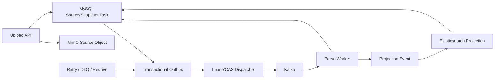

# 事件驱动资料底座：详细架构与具体设计

> 案例与答辩补充：完整上传故障故事、指标、理想压测和 Ownership 见[演进案例专项](20-事件驱动资料底座演进案例指标与Ownership答辩.md)。
>
> 面试使用顺序：先背[资料底座一体化手册](33-资料底座与异步投递一体化面试手册.md)，再用本文下钻 Outbox、Kafka、投影、删除和恢复。跨服务状态、幂等键、Lease、Callback 与灾备口径以 [API 与事件契约](../API与事件契约-v2.md)和当前源码为准。当前能声称的是持久化意图、至少一次投递和业务幂等收敛，不能声称跨 MySQL、Kafka、MinIO 与 Elasticsearch 的 Exactly-once，也不能把设计中的对账、备份恢复或合规删除当成已经完成的生产演练。
>
> 本文的 Consumer 状态机适用于解析和投影等有界步骤。Artifact 小时级命令的推荐方案是在 Consumer 中快速登记 Durable Execution 后提交 Offset，长任务由 Scheduler 和 Execution Lease 管理。索引重建推荐使用 Generation、Catalog Watermark 和 Change Log Catch-up。跨功能裁决见[面试推荐架构与规模化演进裁决](43-面试推荐架构与规模化演进裁决.md)。

## 0. 从同步上传到可恢复的事件驱动资料底座

### 0.1 V0：同步上传和解析为什么适合最早期

最小链路是在上传接口内完成文件保存、文本解析、切块和索引，然后返回成功。它的优势是调用关系直观，没有消息积压和最终一致性，调试时一条请求就能看到全部结果。对小文件、低并发和验证产品需求的原型，这个方案成本最低。

当文件变大、解析依赖外部库、Embedding 和 ES 写入变慢后，请求线程会被长时间占用。任一步骤失败，用户无法区分文件是否已保存、任务是否会继续、索引是否可用；简单重试整个接口还可能重复创建资料或切块。

### 0.2 V1：先拆异步任务，再处理双写问题

把解析放到 Worker 能释放 Web 线程，但“数据库提交成功后发送消息”存在崩溃窗口。反过来先发消息，Consumer 又可能读到尚未提交的 Source。直接双写的实现最短，却无法同时保证业务状态和任务命令。

系统在创建 Source、Snapshot、Task 时，同事务写入 Outbox。Dispatcher 领取 Outbox 后发送 Kafka。这样本地事务保证任务一定被记录，Kafka 只负责跨进程分发。发送成功而 Outbox 状态更新失败会产生重复，不会丢命令，因此消费端必须幂等。

### 0.3 V2：为什么选 Polling Outbox，而不是 XA、Kafka Transaction 或 CDC

XA 可以提供更强的跨资源协调，但部署、锁持有和故障恢复复杂，MinIO 与 Elasticsearch 仍无法自然纳入同一事务；Kafka Transaction 能原子提交 Kafka 记录和 Offset，不能自动原子提交任意 MySQL 业务事务；CDC 几乎不需要轮询业务库，吞吐和延迟更好，但要引入 Binlog 平台、事件路由和 Schema 演进治理。

当前规模下，Polling Outbox 最容易验证和运维。代价是持续扫描数据库并产生投递延迟。Dispatcher 因此使用批量 Claim、索引、有限退避和 Jitter；未来当 Outbox 扫描成为数据库瓶颈，再演进到 CDC，而不是提前引入一套额外平台。

### 0.4 V3：从“消息投递成功”演进为业务幂等状态机

Kafka 的 At-least-once 意味着 Consumer 成功后、Offset 提交前崩溃会重放消息。只做“先查有没有”存在并发窗口，两个 Consumer 可能同时通过检查。当前方案使用稳定业务幂等键、唯一约束、From Status 条件更新和终态不变量。

Dispatcher 侧除 Lease Owner 和 Lease Until 外，还使用 Claim Token。旧 Owner 在 Lease 过期后晚到，即使仍持有相同记录 ID，也不能确认新一轮 Claim。Consumer 则把消息接收、业务处理和终态提交分开，永久错误、冲突和可重试错误进入不同路径。

### 0.5 V4：从单个数据库扩展为多存储真源与投影

把文件存 MySQL BLOB 可以减少一个存储组件，但会放大事务日志、备份和复制；本地文件系统简单，却不适合多实例共享；MinIO 适合大对象和不可变版本，因此保存原文件和派生产物。MySQL 保存 Source、Snapshot、Task、Chunk 元数据和状态，是业务真源；Elasticsearch 只做可重建检索投影。

多存储之间不承诺强事务。系统通过状态机、Post-commit Cleanup、失败终态、补偿任务和对账收敛。删除操作先在数据库提交不可见状态，再删除外部对象；如果外部删除失败，持久化 Cleanup Task 重试，不能在事务提交前先删文件。

### 0.6 V5：从“失败重试”演进为可运营的恢复闭环

所有异常统一重试会放大永久错误和下游过载。系统区分 Transient、Throttled、Permanent、Conflict 和 Unknown，使用有界指数退避与 Jitter。超过次数后进入 Dead Letter，保留业务对象、原消息和失败原因；Redrive 仍走原状态机，不直接改终态。

可观测性不只看错误数，还看最老 Outbox 年龄、Consumer Lag、Projection Lag、幂等重放次数和死信恢复结果。数量不高但最老任务持续增长，往往比总积压更能说明 Dispatcher 卡死。

### 0.7 功能点决策表

| 功能点 | 最小方案 | 其他方向的优点 | 当前选择 | 收益与代价 |
|---|---|---|---|---|
| 上传响应 | 同步解析后返回 | 一致性直观、调试简单 | 接收持久化后异步解析 | 释放请求线程，但用户看到 Pending |
| 文件存储 | 本地盘或 DB BLOB | 组件少、可随事务备份 | MinIO 大对象 + MySQL 引用 | 适合多实例和版本，增加最终一致性 |
| 命令产生 | DB 提交后直接发 Kafka | 代码最少 | Transactional Outbox | 消息不丢，增加表扫描和延迟 |
| Outbox 驱动 | Polling、CDC | CDC 延迟低、减轻扫描 | 当前 Polling，保留 CDC 演进点 | 运维简单，数据库承担扫描 |
| 消息语义 | 尝试 Exactly-once | 重复更少 | At-least-once + 业务幂等 | 边界清楚，每个副作用都要设计幂等 |
| Claim | 仅状态字段、Lease、Lease + Token | Lease 可自动回收 | Lease + CAS + Claim Token | 防旧 Owner 晚到，状态字段更多 |
| 重试 | 固定间隔、指数退避、Broker 重试 | Broker 重试配置简单 | 业务分类 + 有界退避 + Jitter | 减少惊群，需要维护错误分类 |
| 死信 | 只记日志、Kafka DLQ、DB Dead Letter | Kafka DLQ 与消费链路接近 | 可关联业务对象的持久死信与 Redrive | 可运营，治理表和接口增加 |
| ES 一致性 | 同步双写、异步投影 | 同步结果即时可搜 | 异步可重建投影 | 主链路可靠，存在一致性窗口 |
| 删除 | 事务内删外部对象、提交后清理 | 前者表面原子 | Post-commit 持久 Cleanup | 不会回滚后丢文件，需要后台收敛 |

### 0.8 面试叙事顺序

先讲同步解析为什么在原型期合理，再用 DB 与 Kafka 双写失败引出 Outbox；接着说明为什么选择 At-least-once 与业务幂等，而不是宣传 Exactly-once；最后讲 MySQL、MinIO、ES 的真源边界、补偿与可观测性。Kafka 是解决分发和削峰的手段，不是故事起点。

## 1. 总体架构



## 2. 数据所有权

| 数据 | 权威存储 | 原因 |
|---|---|---|
| Source/Snapshot 状态 | MySQL | 需要事务、约束和状态机 |
| 原文件/派生文件 | MinIO | 大对象、不可变版本、Hash |
| 任务命令 | MySQL Outbox + Kafka | 前者保证产生，后者负责分发 |
| Chunk/Window 元数据 | MySQL | 可审计和关联业务对象 |
| 检索文档与向量 | Elasticsearch | 查询投影，可重建 |

## 3. 上传链路

1. 创建 Upload Session，返回 Upload ID 和分片约束。
2. 分片以 Upload ID + Chunk Index 幂等写入。
3. 完成时校验分片数量、大小和 Hash，合并并写入 MinIO。
4. 数据库事务创建 Source、Snapshot、Task 和 Outbox。
5. 返回资料已接收，解析状态为 Pending。

当前请求上限支持 128 MB 文件。这个数字是接入配置，不代表已完成极限吞吐压测。

## 4. Outbox 状态机

```text
READY -> CLAIMED -> SENT
  |         |
  |         v
  +------ RETRY_WAIT -> READY
              |
              v
         DEAD_LETTER -> READY(redrive)
```

Dispatcher 使用 Lease Owner、Lease Until 和 CAS Claim，防止多个实例同时发送同一条记录。发送成功后的状态更新失败会造成重复消息，但不会造成消息丢失，重复由 Consumer 幂等吸收。

## 5. 消费端状态机

Consumer 的基本顺序：校验 Schema 和业务身份，读取当前任务状态，尝试幂等 Claim，执行副作用，事务提交结果，再提交 Offset。非法状态、旧版本和永久错误进入明确失败路径。

该顺序要求单条业务步骤有界。分钟到小时级外部调用不能占着 Consumer Session：先在 MySQL 以 `command_id` 唯一约束登记 Durable Execution，事务提交后提交 Offset，Scheduler 再领取任务。这样 Kafka 负责传输接纳，Execution Lease 负责执行所有权，两种提交点不会混在一起。

## 6. 解析与索引投影

解析读取固定 Snapshot，而不是 Source 的可变当前路径。输出 Chunk 带 Snapshot ID、Chunk No、Heading、Location 和内容 Hash。Chunk 完成后发送 Retrieval Projection 事件，ES 文档带 Workspace、Source、Snapshot 和 Index Version。

索引成功后再更新 Projection Ready。检索只读取 Ready 版本。当前 Workspace 级重建在 Catalog 漂移时放弃并重试，适合小规模；推荐重建先冻结 Catalog Watermark，将期间的上传、更新和删除写入 Change Log，全量 Backfill 后 Catch-up 到发布水位，再校验并切换 Generation Alias。

## 7. 一致性不变量

- 没有 MySQL Snapshot 记录的对象不能进入业务可见状态。
- 一个 Snapshot + Chunk No 只能有一份 Canonical Chunk。
- 相同 Projection Version 的重复消息不能生成重复有效文档。
- 任务终态不能被旧消息改回 Running。
- Dead Letter 必须可定位原业务对象和原消息。
- ES 数据必须能够从 MySQL 与 MinIO 重建。

## 8. 并发模型

- Web 层只做接收、校验和持久化，释放请求线程。
- Dispatcher 按批次 Claim，批量发送，但 Claim 范围受数据库容量限制。
- Kafka 通过 Topic 和 Partition 横向扩展。
- Consumer 并发不能超过下游数据库、MinIO、ES 和模型 Provider 的容量。
- 热点 Workspace 由上层 Quota 限制，避免单租户占满 Worker。

## 9. 重试分类

| 类型 | 示例 | 动作 |
|---|---|---|
| Transient | 超时、连接重置、429 | 指数退避重试 |
| Throttled | 下游过载 | 延长退避、降低并发 |
| Permanent | 格式非法、Schema 不支持 | 直接失败或 DLQ |
| Conflict | 旧版本、状态不匹配 | 幂等成功或拒绝 |
| Unknown | 未分类异常 | 有限重试后 DLQ |

## 10. 补偿与对账

定期扫描 MySQL 状态和外部投影：Pending 超时是否缺任务、Completed 是否缺文件、Projection Ready 是否存在 ES 文档、Dead Letter 是否长期未处理。补偿只创建或恢复稳定 ID 对应的任务，不绕过原状态机。

## 11. 高可用设计

- Java Host 无状态多实例，业务状态落 MySQL。
- Dispatcher 通过 DB Lease 选取工作，不依赖固定主节点。
- Kafka Broker 和 Consumer Group 提供消息侧故障转移。
- Worker 丢失后任务由 Lease/重试重新分配。
- ES 投影可重建，不能成为唯一事实来源。

## 12. 可观测性与告警

| 指标 | 说明 | 告警思路 |
|---|---|---|
| outbox_ready | 待投递数量 | 持续增长告警 |
| oldest_ready_age | 最老等待时间 | 比数量更能发现卡死 |
| retry/dead_letter | 失败趋势 | 按 Topic 和原因分组 |
| consumer_lag | 消费积压 | 结合处理速率判断 |
| projection_lag | 资料到可检索延迟 | 用户体验指标 |
| idempotent_replay | 重复吸收次数 | 异常增长排查生产端 |
| redrive_success | 死信恢复 | 验证运维闭环 |

## 13. 测试

- Outbox Claim 竞争、Lease 过期和 Fencing。
- 发送成功但状态更新失败的重复投递。
- Consumer 成功但 Offset 未提交的重放。
- 幂等唯一约束和状态机非法跃迁。
- 退避上限、Dead Letter、Redrive。
- Source Projection 补偿和 ES 重建。
- MinIO、Kafka、MySQL 集成测试与故障注入。

## 14. 取舍

Polling Outbox 比 CDC 简单，但会增加数据库扫描；At-least-once 比端到端 Exactly-once 更现实，但要求完整幂等；ES 投影提升查询能力，但必须承担重建和版本治理。当前选择符合个人项目规模，也保留了向 CDC、更多分区和独立投影服务演进的空间。

## 15. Outbox Claim 算法

### 15.1 数据字段

```text
id, topic, message_key, payload_json,
status, attempt_count, next_attempt_at,
lease_owner, lease_until, last_error,
created_at, sent_at, dead_lettered_at
```

索引应覆盖 `topic + status + next_attempt_at + lease_until + created_at` 等扫描条件，避免 Dispatcher 每次全表扫描。

### 15.2 Claim 伪代码

```text
candidates = select READY/RETRY rows
             where next_attempt_at <= db_now
             and (lease_until is null or lease_until < db_now)
             order by created_at
             limit batch_size

for row in candidates:
    updated = update row
              set lease_owner = dispatcher_id,
                  lease_until = db_now + lease_ttl,
                  status = CLAIMED
              where id = row.id
                and old lease is expired
    if updated == 1:
        publish(row)
```

使用数据库时间而不是应用实例时间，避免多机时钟偏差。Publish 后更新 SENT 时仍要匹配 Owner，防止过期 Dispatcher 修改新 Owner 的状态。

## 16. Consumer 幂等算法

```text
begin transaction
  current = load task/source/projection for update

  if command_id already completed:
      return previous result

  if event.version < current.version:
      mark stale and return

  if state transition is illegal:
      reject or dead-letter

  apply business change
  insert completion anchor(command_id unique)
commit
ack kafka offset
```

唯一 Completion Anchor 让“处理成功但 ACK 丢失”的重放返回原结果。状态机校验让乱序旧消息无法倒退业务状态。

## 17. Kafka 容量推导

假设平均每条解析任务处理时间为 `T` 秒，每个 Consumer 同时处理一个任务，目标到达速率为 `λ` 条/秒，理论最小并行 Worker 数约为：

```text
workers >= λ × T / target_utilization
```

如果平均 2 秒一条、到达 20 条/秒、目标利用率 0.7，则需要约 58 个并行执行槽。这个只是排队模型，真实瓶颈还要看文件大小、下游 Provider 和数据库连接。Little's Law `L=λW` 也可以用来通过积压量估算等待时间。

## 18. 消息积压排查

1. 看 Lag 是所有 Partition 增长还是单 Partition 热点。
2. 比较生产速率和消费速率。
3. 查看 Consumer 是否频繁 Rebalance、GC 或 Provider 超时。
4. 看下游 MySQL、MinIO、ES 连接池与错误率。
5. 判断能否临时扩容 Consumer，Partition 是否足够。
6. 对可丢弃或可重建任务做分级，不盲目清 Topic。

项目中索引投影可重建，但 Source Parse 结果和业务状态不能随意跳过，积压处理策略要按消息类型区分。

## 19. MinIO 对象与数据库事务边界

对象存储无法加入 MySQL 本地事务。常用顺序是先把对象写到临时或不可见 Key，校验 Size/Hash 后提交数据库引用，再通过状态或生命周期清理孤儿对象。读取只接受数据库已提交且状态有效的 Object Key。

文件使用不可变 Key 可以避免覆盖竞争；新版本创建新 Snapshot/Object，当前版本指针在数据库事务里切换。

## 20. Elasticsearch 投影一致性

ES 写入使用稳定 Document ID，例如 Snapshot ID + Chunk No + Index Version，重复 Index 是覆盖同一投影。Projection 状态记录尝试次数和错误；完成后对账预期 Chunk 数与实际成功数，再把版本切到 Ready。

删除资料不能只删 MySQL 行，还要发 Retract 事件。即使 Retract 失败，在线 Query 仍通过 Workspace/Source 当前状态过滤，补偿任务最终清理 ES 文档。

## 21. DLQ Redrive 设计

Redrive 不是把 Payload 复制成新消息。运维或修复流程先查看 Failure Category，确认永久原因已消失，再把原 Outbox ID 的状态从 Dead Letter 改回 Ready，清理 Attempt/Next Attempt 并保留审计。这样仍能沿用原幂等键和业务身份。

## 22. 压测方案

压测分三层：上传 API 测快速接收与连接池；Kafka 链路测生产、消费和积压恢复；端到端测从上传到 Ready 的 P50/P95。输入要包含不同文件大小和格式，故障场景要覆盖 Kafka/ES/MinIO 限速。观察 QPS 之外，还要看错误率、Lag、Oldest Ready Age、数据库锁等待和恢复后是否收敛。

## 23. Claim Token 防止旧投递确认新任务

Outbox 记录不仅有状态和重试次数，还要有本次 Claim 的所有者与 Claim Token。Dispatcher 发布成功后的确认必须同时匹配 Outbox ID、Owner 和 Token。旧 Dispatcher 因暂停或网络抖动晚到时，即使持有相同 Outbox ID，也不能确认另一个实例刚领取的新 Claim。

这和 Fencing Token 的目标一致：Lease 过期只能让别人接管执行权，不能自动阻止旧持有者继续写。确认条件中加入单调变化的 Claim 身份，才真正关闭“旧结果覆盖新状态”的窗口。发布耗尽只允许从可重试状态进入 Dead Letter 一次，重复回调不重复产生告警和副作用。

## 24. 消费确认与业务终态分离

Kafka 消息格式错误、缺失 Task ID 时，异常必须逃出 Handler，Offset 不能被当作成功提交。业务目标不存在、资料已删除等永久错误则写入明确终态，再确认消息；已经完成的任务收到重复消息时直接确认，不重复执行。

这里区分三种语义：消息不可解析，交给 Kafka 重试或死信；消息可解析但业务不可执行，落业务 Failed/Cancelled；消息已处理，执行幂等短路。把三者都写成“捕获异常后 ACK”会造成静默数据丢失，把三者都抛异常又会造成永久毒消息无限重投。

Consumer 开始任务后还要再次检查 Source/Snapshot 状态。若并发删除发生在 Start 之后，运行中的任务转为 Cancelled，不能继续把解析结果投影为 Ready。

## 25. 版本化目录缓存与数据库回退

资料目录缓存 Key 同时包含 Workspace 和 Catalog Version，Value 还保存 Cache Schema Version。新增、删除或修改资料时先提升 Catalog Version，新请求自然读取新 Key；旧缓存等待 TTL 回收。Schema 或 Catalog Version 不匹配、Redis 异常、Redis 未配置时回退数据库，不把缓存异常伪装成空目录。

这种 Versioned Snapshot Cache 比逐条删除 Key 更适合资料目录，因为一次变更可能影响列表、标签和派生状态。Jitter 打散大量 Workspace 同时过期。缓存命中不扫描 Source 表，未命中只进行一次数据库加载并回填版本快照。

## 26. 删除链路的 Post-commit Cleanup

删除最后一个文件引用时，清理事件只能在数据库事务提交后发布。Listener 再删除 Elasticsearch 投影和无人引用的对象存储文件。如果事务回滚却提前清理外部资源，会留下数据库仍引用、文件已消失的不可恢复状态。

对象删除还要验证 Bucket/Key 边界，拒绝路径逃逸。ES 或对象存储清理失败不能回滚已经提交的业务删除，而是保留可重试 Cleanup Task。在线检索继续使用数据库状态过滤，确保清理窗口内已删除资料也不会被回答链路采用。

## 27. 上传入口的内容真实性校验

上传安全不只检查扩展名。元数据中的安全文本扩展名、声明 MIME 和实际处理类型必须匹配；合并后的内容必须是精确 UTF-8 文本。这样可以拒绝“扩展名是 Markdown，内容却是二进制或其他编码载荷”的伪装输入。

解析成功但 Elasticsearch 明确关闭时，Snapshot 暴露 Local-only Parsed 状态，而不是错误标记为完整 Ready。ES 调用失败则向上暴露真实失败，由检索策略决定降级，不能把 Provider 故障返回成空结果。

## 28. 失败终态的统一收口与可观测性

同步投影失败、Kafka 消费耗尽和 Dead Letter 都调用同一 Terminal Finalizer，统一更新 Source Snapshot、Projection 和 Task，保留 Provider Code。否则不同入口会产生“任务 Failed 但 Snapshot 仍 Indexing”的裂脑状态。

实时事件桥接也区分空数据与基础设施异常：Redis 读取失败不能返回空事件批次，发布失败要暴露 Local Mux Degradation。数据库 Gauge 直接统计 Backlog、Pending Source 和 Dead Letter 行数，让告警对应业务积压，而不只对应中间件连接是否存活。

## 29. 同步处理、异步任务与事件驱动

同步处理的调用链最短。HTTP 请求完成时，解析和索引也完成，用户得到强烈的一致性体验。问题是解析时间、文件大小和 Provider 延迟会占用 Web 线程、连接池和网关超时预算，任一步失败都会使整个请求重试。

异步任务把耗时工作放到后台。接口返回 Task ID，用户查询状态。若只把任务写入数据库再由 Worker 轮询，系统已经能够解耦，但缺少 Kafka 的削峰、分区和多消费者分发能力。

事件驱动通过消息传播状态变化。它提高并发和故障隔离，也引入重复、乱序、积压和最终一致性。项目选择事件驱动，不是因为 Kafka 更“高级”，而是资料解析、投影和后续清理都属于耗时且可重试的独立阶段。

## 30. Kafka 的存储模型与吞吐原理

Kafka Topic 被拆成 Partition，每个 Partition 是只追加日志。顺序写、页缓存和批量网络传输减少随机 I/O；Producer 可以把多条消息合并成 Batch，Consumer 按 Offset 顺序拉取，避免 Broker 为每个订阅者维护复杂队列状态。

同一 Consumer Group 中，一个 Partition 同时只分配给一个 Consumer，因此并发上限受 Partition 数限制：

```text
effective_consumers = min(partition_count, consumer_count)
```

增加 Consumer 超过 Partition 数不会提高吞吐。Partition 太多会增加元数据、文件句柄、Rebalance 和副本同步成本。分区数应根据峰值吞吐、单 Consumer 处理能力和未来扩容余量确定。

消息 Key 决定分区。使用 Source ID 可以保持同一资料事件的分区顺序，但 Kafka 只能保证 Partition 内顺序，不能保证多个 Topic 或外部数据库事务的全局顺序。Consumer 仍要检查 Snapshot Version 和业务状态。

## 31. Producer 可靠性参数

`acks=0` 延迟低，但 Broker 未确认，消息可能丢失；`acks=1` 等待 Leader 写入，Leader 尚未复制就故障仍可能丢；`acks=all` 等待 ISR 满足条件，可靠性高，延迟也更大。

Producer Idempotence 使用 Producer ID 和 Sequence Number，避免重试在 Kafka Partition 内产生重复记录。它不能阻止业务接口重复创建两个 Outbox，也不能让 ES 副作用只发生一次。

批量大小、Linger 和压缩提高吞吐，却增加等待时间和 CPU。资料解析属于后台任务，可以接受小幅批量等待，可靠性比最低延迟更重要。

## 32. Consumer、Offset 与 Rebalance

自动提交 Offset 可能在业务完成前确认消息，进程崩溃后任务永久丢失。手动提交允许在事务或幂等状态写入后确认，更适合业务任务。

先处理再提交会产生重复窗口：

```text
业务提交成功 -> 进程崩溃 -> Offset 未提交 -> 消息重新消费
```

这个窗口无法仅靠提交顺序消除，因此业务处理必须幂等。

Rebalance 发生时，Partition 从旧 Consumer 转给新 Consumer。旧 Consumer 若继续提交晚到结果，会产生并发冲突。项目通过 Task 状态、Snapshot Version 和稳定业务身份阻止旧结果覆盖。耗时任务还需要合理设置 Poll 与处理方式，避免因为长期不 Poll 被判定失活。

## 33. Transactional Outbox 的原理

错误的双写顺序有两种：

```text
DB commit -> Kafka publish
```

数据库成功后进程崩溃，消息丢失。

```text
Kafka publish -> DB commit
```

消息成功后数据库回滚，Consumer 看到不存在的业务对象。

Outbox 把“未来要发送的消息”作为业务数据的一部分：

```text
begin
  insert source
  insert task
  insert outbox
commit
```

只要数据库事务成功，发送意图就不会丢。Dispatcher 的发送与确认仍不是原子操作，所以可能重复，Consumer 必须幂等。Outbox 解决的是不丢失，不是天然 Exactly-once。

## 34. Polling、CDC 与 Transaction Log Tailing

| 方案 | 优点 | 代价 |
|---|---|---|
| Polling Outbox | 实现直观，可自定义 Claim 和优先级 | 有轮询延迟和数据库压力 |
| CDC | 延迟低，业务应用不主动扫描 | 依赖 Binlog 平台，运维复杂 |
| 直接 Broker 双写 | 代码少 | 存在不可关闭的丢失窗口 |
| XA/2PC | 理论原子提交 | 协调成本高，故障时可能阻塞 |

当前项目用 Polling Outbox，是因为吞吐规模可由索引和小批扫描承担，还需要对 Dead Letter、优先级和 Redrive 做业务化控制。若 Outbox 量达到数据库扫描瓶颈，再考虑 CDC。

## 35. 幂等、去重与状态机

去重只判断“见过这个 Message ID”，但第一次处理可能在中途失败。若过早写去重记录，重试会被错误跳过；若过晚写，副作用已经可能重复。

幂等状态机把业务状态作为判断：

```text
PENDING -> RUNNING -> COMPLETED
                  -> FAILED
                  -> CANCELLED
```

同一 Task 已 COMPLETED 时重复输入返回原结果；RUNNING 需要检查 Lease；FAILED 是否重试由 Failure Category 决定。唯一约束保证稳定业务键只创建一个逻辑任务，条件更新保证状态转换合法。

外部副作用也要有稳定身份。例如 ES 使用 Snapshot ID + Chunk No + Index Version 作为 Document ID，重复 Index 覆盖同一投影；对象存储使用不可变 Key，重复完成引用同一对象。

## 36. 重试算法与错误分类

固定间隔重试简单，但下游故障时所有任务同步打满。指数退避逐步降低请求频率：

```text
delay = min(maxDelay, base × 2^attempt)
```

若大量任务同一时间失败，它们仍会在相同延迟后同时重试，因此加入 Jitter：

```text
delay = exponentialDelay + random(0, jitter)
```

重试只适合暂时错误。参数非法、格式不支持、权限拒绝和业务对象已删除，再试也不会成功。错误分类错误会造成两种问题：永久错误浪费资源，暂时错误过早进入 Dead Letter。

## 37. Dead Letter 与补偿

DLQ 的作用不是“把错误消息藏起来”，而是隔离超过自动恢复能力的任务。Dead Letter 至少保存原业务 ID、Payload 摘要、失败分类、最后错误、尝试次数和时间。

Redrive 前要先修复根因。复用原业务身份可以继续利用幂等约束；复制成新消息会丢失历史尝试，也可能创建重复副作用。

补偿与重试不同。重试再次执行原动作，补偿执行一个新的业务动作修复不一致。例如 ES 投影失败可以重试 Index；数据库已删除但对象仍存在，需要 Cleanup 补偿。

## 38. 多存储一致性与 Saga 思想

Saga 把长事务拆成多个本地事务，每一步有后续动作或补偿。NoteWeave 没有实现通用 Saga Orchestrator，但资料链路使用相同思想：

```text
Create Snapshot
-> Parse
-> Project
-> Ready
```

每一步有独立状态和失败处理。不能回滚已经发送给外部系统的事实时，就通过 Cancel、Retract 或 Cleanup 收敛。

这种最终一致方案允许用户看到处理中状态。相比强分布式事务，它提高可用性和扩展性；代价是业务必须理解中间状态，并建设对账和补偿。

## 39. 高可靠、高可用和高并发

高可靠关注“不丢、不重错、能恢复”：Outbox、幂等、重试、DLQ、Hash 和对账属于这一类。

高可用关注“部分实例故障后还能服务”：无状态 API、多 Dispatcher 竞争 Claim、Consumer Group、可恢复 Lease 和降级属于这一类。

高并发关注“单位时间处理更多任务”：异步接口、Partition、批量、连接池和水平扩容属于这一类。

同一个设计可能同时影响多个目标，但不能混为一谈。例如增加 Consumer 提高吞吐，不会自动解决重复；Outbox 防止消息丢失，也不会自动降低延迟。

## 40. 为什么当前方案不追求全局 Exactly-once

跨 MySQL、Kafka、MinIO 和 Elasticsearch 的全局 Exactly-once 需要所有参与者共享事务协议，或由应用记录每个副作用的状态。前者复杂且可用性差，后者最终仍表现为幂等状态机。

项目把目标定义为：

- 业务发送意图不丢失。
- 消息允许重复。
- 重复处理不产生重复业务结果。
- 每个中间状态可查询。
- 自动恢复失败后可人工 Redrive。

这是更可验证的工程承诺。面试时不要用“保证消息绝对只消费一次”，而要说明重复窗口在哪里、如何用业务身份消除副作用。

## 41. 设计概念到生产代码的导航

| 设计概念 | 当前生产实现 | 关键状态或设置 | 主要测试 |
|---|---|---|---|
| 分片上传与完成 | `UploadService`、`UploadSecurityPolicy` | 上传会话、Chunk Index、完成状态分别校验；完成后才创建解析任务 | `UploadSecurityPolicyTest` |
| Source 与 Snapshot | `SourceParseService`、`DocumentChunker` | Source 是业务聚合，Snapshot 不可变，Chunk 绑定具体 Snapshot | Source Parse 集成测试 |
| Transactional Outbox | 业务 Service 与 `task_outbox` 本地事务，`DurableOutboxDispatcher` 事务外发布 | Outbox Tick 1 秒、Batch 50、Lease 60 秒、Max Attempts 5 | `DurableOutboxDispatcherTest`、`OutboxDispatchPolicyTest` |
| Kafka 消费与 DLT | `KafkaTaskConsumer`、`KafkaDeadLetterTaskRecovery` | Record Ack、自动提交关闭、有限重试后 DLT | `KafkaTaskConsumerTest`、Projection Failure Recovery Test |
| Projection 与补偿 | `SourceRetrievalProjectionCoordinator`、`SourceRetrievalProjectionFinalizer` | ES 写入成功不等于业务 READY，Finalize 失败会取消 Current 标记 | Coordinator、Compensation Test |
| 删除与对象清理 | `SourceDeletionCleanupListener` | Before Commit 写清理意图，After Commit 调度对象删除；Claim 带 Attempt 与 Lease | `SourceDeletionCleanupListenerTest` |
| 运行指标 | `OperationalMetricsBinder` | Outbox Status、Oldest Ready Age、Source Status、Projection Status | `OperationalMetricsBinderTest` |
| 重建 | `[当前实现]` `RetrievalBackfillService`、`RetrievalIndexBuildRepository` | 当前版本化物理索引、覆盖计数、Catalog Gate 和 Alias 切换可审计；推荐增加 Generation、Watermark 与 Change Log Catch-up | Build Repository、Catalog Gate、Live ES Test；推荐方案仍待迁移验证 |

当前传输采用 Polling Outbox 加 Kafka。设计中的不变量是 MySQL 真源、不可变 Snapshot、稳定幂等身份和可重建投影；当轮询负载、投影延迟或消息保留要求增长时，再根据指标演进传输方式和运行形态。

## 当前实现复核

`task_outbox`、`research_agent_outbox` 和 worker callback receipt 分别承担可靠投递、Research 命令和回调去重。claim 更新检查 lease owner、attempt 与版本，dead-letter 保留最后错误。MinIO/local storage 只保存对象，数据库保存 metadata 和清理意图；不能把跨存储操作描述成分布式强事务。
