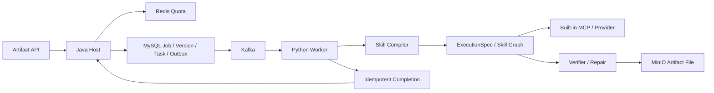

# 工程化 Agent 执行框架：详细架构与具体设计

> 案例与答辩补充：从 Compile 到受控写回的完整案例、Unknown Outcome、消融和 Ownership 见[演进案例专项](21-Agent执行框架演进案例消融与Ownership答辩.md)；真实产物能力、格式边界、质量指标和业务案例见 [Artifact Agent 专项](23-Artifact-Agent产物生成演进案例指标与Ownership答辩.md)。
>
> 面试使用顺序：先背[Agent 与 Artifact 一体化手册](32-Agent执行与Artifact产物一体化面试手册.md)，本文用于 Skill Compiler、Capability、Quota、MCP 和运行时细节。当前运行时是“编译期 DAG、运行期拓扑序线性执行”，不是完整并行 DAG 引擎；只有具备持久 Waiting Receipt 与唤醒入口的路径才能声称 Waiting/Resume；任意 Workspace 写回、外部 Provider Exactly-once 和所有 MCP 的安全沙箱仍属于 `[目标设计]` 或 `[生产待验证]`。

## 0. 从一次 Prompt 到受控 Agent 执行框架

### 0.1 V0：一次 Prompt 生成为什么很快达到上限

最小产物生成只需要输入资料、写一个 Prompt、调用模型并保存结果。它开发快，短文本没有复杂恢复要求时效果也足够。随着产物变成 PDF、课程笔记或带图片的长文，一次生成会同时承担资料获取、内容规划、工具调用、排版、校验和写回。任一步失败都要全量重做，模型也可能调用不应使用的能力。

### 0.2 V1：固定 Workflow 解决可重复，自由 Agent 保留动态能力

固定 Workflow 的优点是步骤明确、状态易观测、失败可定位；自由 Agent 的优点是能根据输入动态选择工具和路径。当前系统没有二选一，而是用 Skill 描述目标、输入输出 Schema、能力策略和图模板，再由 Compiler 生成冻结 ExecutionSpec。

Compiler 在执行前检查节点注册、Schema 兼容、依赖环和 Capability Policy。运行时按编译出的拓扑序线性执行。当前不是带 Ready Queue、条件边和节点级并行的完整 DAG 调度器，这个边界必须明确。它牺牲部分动态性，换来可审计、可重放和较低调度复杂度。

### 0.3 V2：Skill 从 Prompt 模板演进为可版本化执行契约

单纯 Prompt Template 只能约束文字，不知道输入是否合法、输出是否完成、需要哪些工具。SkillDefinition 增加 Action、Input/Output Schema、Style、Capability 和 Verification Policy；ExecutionSpec 固化本次选择的 Skill 版本、节点和能力。

重试或 Waiting 恢复时读取原 ExecutionSpec，不重新路由。否则 Skill 定义或 Provider 状态变化后，同一个 Version 会执行另一条路径，无法解释结果差异。

### 0.4 V3：工具接入从专用 Adapter 演进为 MCP，但能力仍由 Host 控制

每个工具写专用 HTTP Client 的优势是边界清晰、容易做细粒度安全；工具增多后，发现、参数 Schema、错误和 Trace 会重复建设。MCP 提供统一协议，适合把视频提取、渲染等能力接到 Skill Graph。

系统使用系统能力、Skill 允许能力和运行环境能力的交集，Prompt 不能扩大权限。当前 MCP 以系统注册、能力白名单、输入 Schema、内部认证和受控写回为边界，工具协议的复用不改变 Host 的权限与审计责任。

### 0.5 V4：长任务从限速演进为限速、限并发和租约恢复

只限制每秒请求数，无法阻止多个一小时任务同时占满 Worker；只限制并发，又无法吸收短时间突发。系统用 Redis Lua 令牌桶控制到达速率，用带 TTL 的 ZSET 并发租约控制昂贵任务同时运行数。

普通 Semaphore 计数在进程崩溃后可能永远不归还，租约可以过期回收并续期。Redis 故障时昂贵任务 Fail Closed，避免绕过配额拖垮 Provider。代价是 Redis 成为任务接入可用性的依赖，Host 还要处理 Acquire 成功但 DB 事务失败时的补偿释放。

### 0.6 V5：失败处理从全量重试演进为 Waiting、Resume 与局部 Repair

Provider 暂时不可用、能力等待和输出不合格不是同一种失败。只有已经实现持久等待记录、恢复条件和唤醒入口的能力，暂不可用时才进入 Waiting 并在恢复后沿用原 Spec；其余 Provider 路径仍按当前代码做有界重试、失败分类或终态投影。确定性或语义 Verifier 失败时生成结构化问题，只重做相关节点。

局部 Repair 节省成本，但可能修好一处又破坏整体，因此最终产物仍要过全局 Output Contract。Repair 次数有上限，不能让模型无限自我修正。

### 0.7 V6：跨服务写回从“Worker 直接改业务”演进为受控提交

Python Worker 直接写 Workspace 或业务表实现最短，却绕过 Java Host 的权限、审计和事务。当前 Worker 先写不可变产物对象，再回调受控 Bucket、Object Key、Hash、Version 和 Trace，由 Host 做归属校验与幂等终态提交。

完成已落库但响应丢失时返回已有 Version；旧 Delivery 晚到不能覆盖新任务。当前 Host Writeback 的部分调试路径仍是模拟能力，面试中只讲已经存在的受控回调和产物提交，不夸大为任意 Workspace 写回。

### 0.8 功能点决策表

| 功能点 | 候选方向 | 当前选择 | 为什么这样选 | Trade-off |
|---|---|---|---|---|
| 编排 | 一次 Prompt、固定 Workflow、自由 Agent | Skill 编译为受控执行序列 | 在多产物之间复用，又保持确定性 | 动态规划空间受限 |
| 契约 | 自然语言、DTO、JSON Schema | Schema + Skill + ExecutionSpec | 分开描述结构、业务能力和本次执行 | 版本管理更复杂 |
| 图模型 | 硬编码顺序、通用工作流引擎、编译期 DAG | 环检测与拓扑序，运行期线性 | 当前依赖关系不需要重型引擎 | 无条件边和节点并行 |
| 工具协议 | 专用 HTTP Adapter、Function Calling、MCP | 内置 MCP + Policy | 工具发现与 Trace 统一 | 安全治理成本高，不开放任意插件 |
| 能力选择 | Prompt 自选、单开关、策略交集 | 多信号路由 + Capability Intersection | 防止模型越权和 Provider 误切换 | 配置与审计对象增多 |
| 流量治理 | 固定窗口、漏桶、令牌桶 | Redis Lua 令牌桶 | 允许有限突发，原子扣减 | 依赖 Redis 时钟与可用性 |
| 并发治理 | JVM Semaphore、Redis 计数器、租约 | 可续期并发租约 | Worker 崩溃可回收 | 需要续租和丢租处理 |
| 能力不可用 | 立即失败、自动换 Provider、Waiting | 条件满足时 Waiting/Resume | 不把配置缺失伪装为模型失败 | 状态机和唤醒机制增加 |
| 输出质量 | 模型自检、全量重做、局部 Repair | 确定性/语义 Verifier + 局部 Repair + 最终门禁 | 降低重做成本且守住最终契约 | 多轮调用增加时延 |
| 业务写回 | Worker 直写、Host 代理提交 | 不可变对象 + Host 幂等提交 | 权限和事务集中 | 跨服务回调更复杂 |

### 0.9 面试叙事顺序

先从一次 Prompt 无法支撑长产物讲起，再比较固定 Workflow 和自由 Agent；用 Skill、Schema、ExecutionSpec 解释为什么选择受控中间路线；随后挑 MCP 权限、Redis 两类配额、Waiting/Repair 三个工程点；最后说明当前运行时以受控节点序列为主，复杂并行和扩展能力由任务规模与副作用边界触发。

## 1. 总体架构



## 2. 核心对象

### ArtifactJob

代表用户的一项持续生成需求，保存 Skill、Workspace、目标和当前状态。同一个 Job 可以追加多个 Version，避免修改历史产物。

### ArtifactVersion

一次具体执行和不可变结果，绑定输入快照、Skill 版本、ExecutionSpec、文件元数据、Verifier 结果和状态。

### SkillDefinition

包含 Action、Input Schema、Output Schema、Style Profile、Graph Template、Capability Policy 和 Verification Policy。

### ExecutionSpec

Compiler 输出的冻结执行契约。Worker 重试或恢复必须使用相同 Spec，不能重新读取已经变化的 Skill 定义冒充原执行。

## 3. 生命周期

```text
DRAFT -> QUEUED -> RUNNING -> VERIFYING -> COMPLETED
                    |            |
                    v            v
                 WAITING      REPAIRING
                    |            |
                    +-------> FAILED / CANCELLED
```

每次状态转换校验 From Status、Version 和 Owner。终态写入幂等，失败和取消不能被旧回调改成完成。

## 4. 推荐提交链路

1. Host 校验 Workspace 权限、Skill 和输入 Schema。
2. Redis Lua 检查令牌桶并获取并发租约。
3. MySQL 事务创建 Job、ArtifactRun、Input Snapshot、预留 Version ID 和 Command Outbox，不提前创建用户可见 Version。
4. Consumer 按 Command ID 幂等登记 Durable Execution，事务提交后提交 Kafka Offset。
5. Scheduler 创建 ExecutionAttempt，分配 Active Permit，并领取带 Epoch/Fencing Token 的 Domain Execution Lease，Worker 获取冻结输入。Permit 只表达资源占用，不与业务 Fencing 共用代次。
6. Worker 编译或读取 ExecutionSpec，执行 Skill Graph，只返回内容 Candidate、引用和 Trace。
7. 内容 Contract 通过后，Host 创建不可见的 `DELIVERY_PENDING` Version 与全部必需文件的 `PENDING` Manifest。DeliveryAttempt 再写 Staging、执行文件 Contract 并晋升对象；必需文件全部 `READY` 后，Version 才提升为用户可见的 `READY`，释放租约。

如果数据库事务失败，必须释放已获取租约；如果任务创建后 Host 崩溃，租约由续租与过期机制回收。当前实现仍是长 Kafka Delivery、回调后追加 Host Version 和 Worker 调试 Version ID，以上链路属于面试推荐的迁移目标。

## 5. Skill Graph

典型节点：Load Context、Acquire Sources、Generate Draft、Verify、Repair、Render File、Persist Result。边可以带 Schema 条件和有限重试，不允许模型直接指定任意类名或命令。

Compiler 校验：节点类型已注册、输入输出兼容、依赖无环或循环有明确上限、能力属于 Skill Policy、终点能产生声明的输出。

## 6. Capability Policy 与 MCP

历史模型中的 `Capability Union` 表示收集图中各节点声明的能力需求，不表示把权限做并集放大。一次运行的 Effective Capability 仍由系统能力、Skill 声明、Workspace Policy、用户审批、风险策略和运行环境取交集，不因 Prompt 提示扩大。每次 MCP 调用记录 Server、Tool、参数摘要、权限结果、耗时和状态，敏感参数脱敏。

内置 MCP 通过受信任配置加载。工具数量、调用并发或副作用范围扩大时，继续沿能力白名单、路径约束、凭据隔离和人工授权补充边界。

## 7. Redis Quota 设计

### 令牌桶

Lua 输入容量、补充速率、当前时间和消耗量，原子计算新增令牌并扣减。速率 Key 按 Workspace + Actor Fingerprint + Workload 分区，既隔离租户，也避免单个用户占满同一工作负载的入口配额；TTL 避免长期空 Key。

### 并发租约

使用 ZSET 保存 Lease Token 和到期时间。Acquire 先删除过期成员，再判断 ZCARD；Renew 只更新匹配 Token；Release 使用 ZREM。Token 必须唯一，防止 ABA。

### 为什么不是 Semaphore 计数器

普通 INCR/DECR 在 Worker 崩溃后可能永远不归还。带到期时间的租约能够自动回收，并支持续租和审计。

## 8. 可靠投递与完成

Outbox 提供命令不丢，Kafka 提供分发，Worker 通过 Delivery ID 幂等。Completion 以 Job ID + Version ID + Delivery No 为锚点；文件先写不可变对象，Host 只接收受控 Bucket、Object Key、Hash 和 Metadata。

旧 Worker 回调需要同时检查任务状态和交付版本。完成提交后响应丢失，重试返回已有 Version，不创建第二份产物。

## 9. Verifier/Repair

Verifier 分确定性与语义两层。确定性层检查 JSON Schema、必填章节、引用身份、文件 Hash 和大小；语义层检查内容覆盖和风格。Repair 输入是结构化失败项，只重做对应节点，次数超过上限进入 Failed。

## 10. 隔离与容量

- Workspace + Actor + Workload 令牌桶控制入口速率。
- Workspace + Workload 并发租约限制昂贵长任务。
- Worker Consumer 并行度受 Kafka 分区和 Provider 配额控制。
- Java 回答 IO、数据库和 Worker 调用分别设置池与超时。
- Research 和 Artifact 指标分开，避免一个 Workload 掩盖另一个。

## 11. 故障矩阵

| 故障 | 恢复 | 防护 |
|---|---|---|
| Redis Acquire 后 DB 失败 | 释放租约 | 补偿 finally |
| Host 创建任务后宕机 | Outbox 继续投递 | MySQL 真源 |
| Worker 宕机 | 任务和并发租约过期 | 重新投递 |
| MCP 超时 | 节点重试或降级 | Timeout/Policy |
| 文件写成功、回调失败 | 重试同 Version | Object Hash |
| 回调成功、响应丢失 | 返回已有终态 | Completion Anchor |
| Redis 不可用 | 拒绝昂贵任务 | Fail Closed |

## 12. 可观测性

记录 Job Queue Age、Running Count、Quota Reject、Lease Lost、Skill/Node Latency、MCP Error、Verifier Failure、Repair Count、Outbox Retry/DLQ、Artifact Completion 和文件写入失败。Trace 按 Job/Version/Node 串联。

## 13. 测试

- Skill Schema 和 Graph Compiler 单测。
- Capability Policy 越权测试。
- Redis Lua Acquire/Renew/Release 单测与集成测试。
- Job/Version 状态机和幂等回调测试。
- Worker Crash、重复消息、响应丢失故障注入。
- Verifier/Repair 次数边界和文件 Hash 测试。

## 14. 当前边界

当前实现是系统内置 Skill 与 MCP；配额参数是保护默认值，不是性能上限；水平扩展要依据外部 MySQL、Kafka、Redis、MinIO 和 Provider 的实际容量。

## 15. Skill Compiler 的具体算法

### 15.1 编译输入

```text
SkillDefinition
+ User Input
+ Workspace Capability Set
+ Runtime Capability Set
+ Policy Version
= ExecutionSpec
```

允许能力应取交集：

```text
effective_capabilities = skill_allowed
                       ∩ workspace_enabled
                       ∩ runtime_available
                       ∩ security_policy_allowed
```

任何一层都只能收紧，不能扩大。

### 15.2 编译步骤

1. 用 Input Schema 校验用户参数。
2. 展开 Skill Graph Template。
3. 解析节点依赖并检查未知节点。
4. 计算 Effective Capability。
5. 检查每个节点输入是否能由上游输出满足。
6. 检查环和受控循环上限。
7. 固化 Prompt/Policy/Skill Version。
8. 生成 Hash，作为重试和审计身份。

### 15.3 编译授权不是永久授权

ExecutionSpec 中的 Capability Set 是本次 Run 的能力上限和可复现输入，不是执行数分钟后仍然有效的授权票据。`[目标设计]` 每个高风险工具调用前，Host 或受信 Tool Gateway 重新求交集：

```text
invocation_capabilities = compiled_capabilities
                        ∩ current_workspace_acl
                        ∩ current_security_policy
                        ∩ unexpired_approval_scope
                        ∩ runtime_provider_health
```

执行时交集只能收紧，不能因为 Catalog 新增能力而自动扩大当前 Run。能力通过后仍需单独取得本次调用的 Budget Reservation，权限与额度不能互相代替。写工具先持久化 `OperationIntent`，审批绑定精确工具、目标、参数 Digest、Scope、Artifact/Plan Version 和过期时间；调用时任何 Digest、Epoch 或 Approval 状态变化都拒绝并要求新 Proposal。只读工具同样受输入有效性 Epoch 与 SSRF/数据域策略约束。这样同时保留“当时编译了什么”的可解释性和“现在是否仍可执行”的持续授权，避免长任务中的 TOCTOU。

## 16. Skill Graph 的编译与运行边界

编译阶段使用 DAG 语义解析依赖：检查未知节点和重复 Node ID，通过 Kahn 拓扑排序拒绝环，并把合法图固化为 `node_sequence`。当前运行时**不维护** `PENDING/READY/RUNNING` 节点状态机，也不做条件边或节点级并行调度；`execute_skill_graph` 按固化的拓扑序线性执行节点，并在每个节点后做验证与修复。

```text
compile:
    graph -> validate references -> reject cycle -> topological node_sequence
run:
    for node in node_sequence:
        execute -> verify -> repair -> merge state
```

因此准确口径是“编译期 DAG、运行期拓扑序线性执行”。若未来引入节点级并行，需要再补就绪状态机、条件边、Attempt/Graph Version fencing，以及并行节点写状态的合并规则。

## 17. Redis Lua 伪代码

### 17.1 Token Bucket

```lua
now = ARGV[1]
capacity = ARGV[2]
rate = ARGV[3]
cost = ARGV[4]

old_tokens, old_ts = HMGET(key, 'tokens', 'ts')
tokens = min(capacity, old_tokens + (now - old_ts) * rate)

if tokens < cost then
  return {0, tokens}
end

tokens = tokens - cost
HMSET(key, 'tokens', tokens, 'ts', now)
return {1, tokens}
```

真实脚本还要处理首次创建、单位换算、TTL 和参数非法。

### 17.2 Concurrency Lease

```lua
ZREMRANGEBYSCORE(key, '-inf', now)
if ZCARD(key) >= limit then return 0 end
ZADD(key, now + lease_ttl, lease_token)
return 1
```

Renew 需要先确认 Member 存在再更新 Score；Release 使用 `ZREM key lease_token`。

## 18. Acquire 与创建任务的一致性

Redis 和 MySQL 之间没有原子事务，存在 Acquire 成功但 DB 创建失败的窗口。处理顺序：

1. 获取 Token/Lease。
2. 尝试 MySQL 本地事务创建 Task。
3. 事务失败则 Best-effort Release。
4. Release 也失败时依赖 Lease TTL 自动回收。

反向顺序先创建 Task 再 Acquire，会出现任务已入库但永远拿不到资源，需要额外 WAITING_QUOTA 状态。当前选择前者，结合 TTL 限制泄漏。

## 19. Lease 续租时序

续租周期应明显小于 TTL，例如 TTL 的 1/3。太接近到期时间会被 GC、网络抖动或调度延迟击穿；太频繁会增加 Redis 压力。续租失败不能继续无限执行，应停止获取新节点并尽快终止或转 Waiting，防止失去配额后仍占用 Provider。

## 20. Worker 容量和线程池

Agent 任务多为外部 IO 加部分 CPU。提高线程数可以隐藏 IO 等待，但会同时增加模型请求、HTTP 连接和内存中的上下文。容量应联合考虑：

```text
effective_concurrency = min(
  kafka_partition_count,
  worker_execution_slots,
  provider_rate_limit,
  http_pool_capacity,
  workspace_quota_sum
)
```

任何一项更小都会成为瓶颈。盲目扩大 Consumer Thread 可能只把排队从 Kafka 搬到连接池。

## 21. Verifier/Repair 状态机

```text
GENERATED -> VALIDATING -> PASS -> PERSISTING
                    |
                    v
                  FAIL -> REPAIRING -> VALIDATING
                    |         |
                    |         v
                    +---- MAX_ATTEMPT -> FAILED
```

Repair Target 包含 Failure Code、JSON Path/Section、Expected Contract 和原节点输出引用。局部修复完成后重新跑确定性校验，不能仅相信 Repair 模型说“已修复”。

## 22. MCP 安全模型

MCP Tool 参数进入 Server 前依次经过 Schema、Capability、Workspace、路径和凭据校验。返回结果标记来源和信任等级，不能把 Tool 返回的文本当作系统指令。对文件工具做路径包含检查，对网络工具做域名/私网限制，对写操作保留人工确认与审计。

当前系统内置 MCP 降低了供应链风险，但不消除 Tool 本身错误或外部内容 Prompt Injection，仍需最小权限和结果隔离。

## 23. Capability Resolution 不是简单开关

Provider 选择同时考虑 Skill Graph 约束、Capability Mapping、候选发现状态、审批状态、健康状态和优先级。Preferred Provider 不健康时，可以切换到满足同一能力约束的 Approved Candidate；候选未发现或未经审批时进入 Waiting，而不是让模型临时换一个未知工具。

Capability Mapping Snapshot 记录映射来源和约束，保证任务恢复时知道“为什么选中这个 Provider”。健康检查和 Discovery Scan 更新候选状态后，可以自动唤醒真正受该能力阻塞的任务，不能把整个 Waiting Queue 全部重跑。

这套机制接近控制面与数据面的分离：控制面注册、发现、审批和映射能力，数据面只执行已经编译并授权的 Provider。面试时可用 Capability-aware Scheduling 概括；当能力数量、并发或 Provider 等待增长时，再细化调度与隔离策略。

## 24. Waiting、Resume 与编译结果复用

任务缺少外部能力时保存 Waiting Receipt，其中包含 Blocked Operation、Compiled Plan Checkpoint、输入快照和恢复目标。人工批准、Provider 恢复或异步 MCP 结果到达后，只恢复匹配 Request ID 的任务，并复用原 Compiled Plan，不重新让模型规划。

Waiting Store 使用 Claim-once 语义，进程在 Claim 后退出可以恢复；文件持久化采用单进程 Lease、临时文件写入与 Atomic Replace。原子替换失败保留上一版状态，损坏 JSON 被隔离到 Corrupt 文件而不是覆盖成空队列。重启时仍可重新分发等待中的 System MCP Operation。

Provider 已成功，但成功 ACK 的网络传输失败时，任务仍保持“Provider 成功、回执待重投”，不能改写成 Provider Failure。这个细节把业务结果和回调投递结果分开，避免错误重跑昂贵工具。

## 25. Skill 编译中的多信号路由

Action Resolver 不只按单个关键词匹配。候选可以同时使用 Generation Brief、Style Hint、Source Platform、Structure Keyword、Workspace Context 和 Route Hint，多信号候选优先于只命中 Route 的候选；相同优先级的关键词冲突在注册阶段拒绝。

Skill-first 请求会覆盖冲突的 Legacy Action，公共 Catalog 隐藏旧 Action Binding 字段，Java 与 Python 的 Skill Catalog 通过跨语言契约测试保持一致。Graph 注册时检查 Skill 引用、重复 Node ID、环依赖和未注册 Runtime Skill，运行前再验证 Required Schema Input。

混合来源会先规范化为 Canonical Content Object，再编译 Fusion Plan。URL 可以物化为 Virtual Source，视频文件按媒体类型路由到音频转写管线。这里的价值不是“支持很多格式”，而是通过中间表示隔离输入适配和生成图，类似编译器前端的 IR。

## 26. 局部修复与最终契约双门禁

Node-level Verifier 针对具体 JSON Path、章节或结构缺陷执行 Local Repair，修复后重新验证该节点。所有节点完成后，Final Contract 再检查跨节点约束，例如简历是否缺关键章节、Quiz 结构是否完整、Wiki 是否满足知识页结构、Evidence Coverage 是否达标。

Output Contract Trace 聚合每个节点的失败码、修复次数和最终状态。生成成功但证据覆盖不足仍视为失败，不能因为 Markdown 可读就提交。局部修复减少全量重生成造成的漂移，最终门禁则防止局部都合法但整体不完整。

## 27. 写回不是 Worker 直接改 Workspace

Execution Plan 先根据 Skill 和目标类型计算 Writeback Mode。Wiki Page 可以生成 Export File Preview，Structured Note 可以申请 Save-as-Source；未知模式、高风险 MCP Union 或不允许的目标在编译阶段拒绝。Worker 只注册 Writeback Request 并生成 Preview，Java Host 执行真正的 Workspace 写入。

Writeback 有独立 Request、Receipt、Attempt History 和 Redelivery 状态。Host 回调失败不会丢失已生成 Artifact，修复后可沿用原 Request 重投。下载导出文件和 MCP 本地路径都执行路径包含校验，阻止 Path Traversal。

## 28. 跨服务回调的失败分类

Java 到 Worker 的运行请求和 Worker 到 Java 的回调都使用内部认证，未配置密钥时正式路由 Fail Closed。终态回调必须有稳定幂等键，并绑定 Task 与 Worker Type；普通 Artifact 回调不能完成 Research Task。

输入拉取失败、模型生成失败、Provider 失败和回调投递失败属于不同 Failure Domain。输入传输失败不应伪装成执行失败，回调网络失败也不能把已完成任务改成 Failed。错误持久化前进行 Secret Redaction，并标记 Retryability。

外部响应和文本文件有大小上限，超大 HTTP 响应触发受控降级。携带凭据的请求不允许跨重定向转发，MCP 子进程有超时限制。调试路由默认关闭，正式路由先快速 ACK 再后台执行，并通过 Duplicate Guard 防止重复启动；后台启动失败后必须释放 Guard，允许后续恢复。

## 29. Schema、Skill 和 ExecutionSpec

### 29.1 JSON Schema 解决什么

普通参数校验常写成散落的 if 判断，只能验证字段是否为空。JSON Schema 可以表达类型、必填字段、枚举、数组元素、嵌套对象和附加字段策略。它既用于 API 校验，也可以约束模型结构化输出。

Schema 不能保证语义正确。例如 `score: 100` 类型合法，却可能超出业务范围；引用 ID 格式正确，也可能不属于当前 Evidence Bundle。因此项目把验证拆成：

1. Schema Validation，检查结构。
2. Domain Validation，检查业务范围和身份。
3. Capability Validation，检查能否调用。
4. Output Verification，检查生成质量和证据。

### 29.2 Skill 与 Prompt Template 的区别

Prompt Template 只描述模型该怎么写。Skill 还定义输入、输出、执行图、能力边界、风格、验证和写回策略。把这些全部塞进 Prompt，模型可以看到约束，却无法保证系统执行层遵守。

SkillDefinition 是声明，ExecutionSpec 是一次运行的编译结果。Skill 可以版本化复用，ExecutionSpec 绑定本次输入快照、Provider 和策略。二者类似源代码与可执行计划。

### 29.3 为什么需要中间表示

若每个产物直接从 HTTP 参数进入 Worker，各种来源适配、能力选择和生成逻辑会互相耦合。Canonical Content Object 统一文本、URL、媒体和 Workspace 资料，ExecutionSpec 统一后续节点。新增输入适配器不需要修改每个生成 Skill。

代价是多一次转换和更多 Schema。只有一个输入类型和一个产物时，中间表示可能过度设计；多来源、多产物时，它能减少组合爆炸。

## 30. DAG 调度与拓扑排序

有向无环图用节点表示任务，用边表示前置依赖。拓扑排序可以使用 Kahn 算法：

```text
1. 统计每个节点入度
2. 把入度为 0 的节点放入队列
3. 取出节点执行，减少后继节点入度
4. 新的入度 0 节点进入队列
5. 已处理节点数小于总数，说明存在环
```

时间复杂度是 `O(V + E)`。运行时还要区分拓扑可执行与资源可执行：节点依赖已经满足，不代表当前 Workspace 有配额，也不代表 Provider 健康。

替代方案是固定线性 Pipeline，实现简单却不能并行独立节点；状态机适合少量明确阶段，表达复杂依赖较笨重；DAG 适合多个可复用节点和分支合并。项目的 Skill 产物结构满足 DAG 特征。

## 31. Tool Calling、Function Calling 与 MCP

Function Calling 通常指模型按照 Schema 生成函数名和参数，宿主程序负责真正执行。Tool Calling 是更宽泛概念，工具可以是函数、搜索、代码执行或外部服务。

MCP 定义 Client、Server、Tool、Resource 和协议消息，让不同宿主以统一方式发现并调用工具。它解决接口标准化，不解决：

- 当前用户是否有权限。
- Tool 是否可信。
- 返回内容是否包含 Prompt Injection。
- 调用是否超出 Workspace。
- 写操作是否需要确认。

因此 Capability Policy 位于 Host/Worker 控制面。MCP Server 只能暴露候选能力，不能自行决定任务是否获准使用。

直接 HTTP Client 的优点是依赖少、调试简单，适合一个稳定 Provider；MCP 更适合多个可发现工具和统一协议，代价是增加 Server 生命周期、Schema 兼容和安全边界。

## 32. Capability Resolution 与策略交集

有效能力不是多个集合的并集，而是交集：

```text
effective =
  system_registered
  ∩ skill_allowed
  ∩ workspace_authorized
  ∩ runtime_available
```

并集会扩大权限。例如系统支持文件写入，并不代表一个只读摘要 Skill 可以写文件。模型请求也不能把能力集合扩大。

Provider Candidate 还要经过 Discovery、Approval、Health 和 Constraint 过滤。首选候选不可用时，Fallback 必须保持相同 Capability Contract。若能力暂时缺失，Waiting 比静默降级更准确；如果 Skill 明确允许弱能力替代，才进入 Fallback。

## 33. 限流算法比较

### 33.1 固定窗口

每个时间窗口计数，实现简单。窗口边界会出现双倍突发，例如前一秒末尾和后一秒开头各发送上限数量。

### 33.2 滑动窗口

记录更细时间片或所有请求时间，边界更平滑，存储和计算成本更高。

### 33.3 漏桶

请求以固定速率流出，输出平滑，突发会排队或丢弃。适合需要稳定下游速率的场景。

### 33.4 令牌桶

令牌按速率补充，桶容量允许有限突发。请求消耗令牌，无令牌时拒绝或等待。它兼顾平均速率和短时突发，适合模型 Provider 配额。

项目选择令牌桶，是因为用户交互可能短时间提交几个任务，不希望固定匀速排队；同时桶容量限制突发上限。并发租约另外控制长任务在途量。

## 34. Redis Lua 的原子性与边界

Redis 单线程执行一段 Lua 脚本，脚本运行期间其他命令不能插入，因此“读取余额、补充、判断、扣减”成为一个原子操作。若用客户端 `GET` 后 `SET`，两个实例可能同时看到足够令牌并同时通过。

Lua 原子不等于数据库事务：

- 脚本不能无限执行，否则阻塞 Redis。
- Redis 故障转移仍要考虑持久化和复制窗口。
- Redis Cluster 要求脚本访问的 Key 位于同一 Hash Slot。
- Lua 只保护 Redis 内状态，不能与 MySQL Job 创建原子提交。

项目先 Acquire 配额，再创建任务；若任务创建失败，需要释放或等待令牌自然恢复。严格业务记账仍在 MySQL，Redis 配额是短周期保护状态。

## 35. 分布式锁、Semaphore 与 Lease

分布式锁通常允许一个 Owner 进入临界区，适合互斥更新。Semaphore 允许最多 N 个持有者，更适合 Worker 并发限制。

普通计数器 `INCR/DECR` 容易因进程崩溃漏掉 `DECR`。Lease 为每个持有者保存 Token 和到期时间，清理过期 Token 后得到当前占用数。Release 必须匹配 Token，旧任务不能释放新任务的名额。

TTL 太短会让正常任务频繁续租，网络抖动后提前失去名额；TTL 太长会让崩溃任务长期占位。续租周期通常显著小于 TTL，并结合任务耗时和故障检测时间确定。

## 36. Waiting 与异步恢复

能力暂时不可用时有三种选择：

1. 立即失败，语义简单，但用户必须重新提交。
2. Worker 阻塞等待，占用线程和 Lease。
3. 持久化 Waiting State，释放执行资源，条件满足后恢复。

长等待可能来自人工审批、字幕获取或 Provider 恢复，第三种更合适。Waiting Record 必须保存恢复所需闭包，并有 Claim 防止多个实例同时恢复。损坏状态不能当作空队列，否则任务会静默丢失。

## 37. Verifier 与 Repair 策略

Self-reflection 让同一个模型阅读自己的输出并尝试修正，实现简单，但错误标准仍隐含在 Prompt 中。结构化 Verifier 输出 Failure Code、Path、Expected Contract 和 Evidence，使修复动作可以测试。

局部 Repair 的收益：

- 保留已正确节点。
- 降低 Token 和延迟。
- Failure Trace 更清楚。

代价：

- 输出必须能够拆分。
- 局部修改可能破坏跨节点一致性。
- 需要最终全局校验。

因此项目采用 Node-level Repair 加 Final Contract。超过最大修复次数后进入 Failed，不允许无限反思循环。

## 38. Java Host 与 Python Worker 的语言边界

Java 适合承载 Spring 生态、权限、事务、MySQL 状态机和 API；Python 适合模型 SDK、内容处理和 MCP 生态。按能力拆语言可以复用两边优势，但引入网络调用、Schema 演进和双端调试。

若全部使用 Java，部署简单，但部分 AI 工具需要额外适配；全部使用 Python，模型开发快，但要重建现有 Java 业务边界。当前方案把业务真源留在 Java，Python 只持有可恢复执行状态，并通过版本化协议交互。

跨语言边界必须包含：

- Schema Version。
- 稳定 Task 与 Delivery Identity。
- 输入快照。
- 回调幂等键。
- 错误分类和脱敏。
- 超时、重试和认证。

## 39. 为什么写回由 Host 完成

让 Worker 直接写文件最短，但 Worker 同时处理外部文本、模型输出和 MCP，属于较低信任执行面。Host 掌握 Workspace 权限、目标版本和资料状态，更适合执行最终 Mutation。

Worker 生成 Preview，用户或策略确认后产生 Writeback Request。Host 校验目标、Mode、路径和版本，再落文件或创建 Source。这个设计增加一次回调，却把生成能力与数据写权限分开。

## 40. 当前方案的适用边界

只有一个固定 Prompt、没有外部工具、执行在几秒内完成时，普通 Job Queue 足够。需要开放探索且结果不写入系统时，自由 Agent 更轻。Skill Graph 适合产物类型多、结构要求强、能力需要授权、运行时间长的场景。

选择方法时先看约束，再说技术：

- 输出能否结构化，决定是否适合局部 Repair。
- 节点是否有依赖和并行，决定是否需要 DAG。
- 工具是否跨来源，决定是否需要 MCP 和 Capability Policy。
- 任务是否昂贵且长，决定是否同时需要令牌桶与并发租约。
- Worker 是否可信写入，决定是否需要 Host Writeback Gate。

## 41. 设计概念到生产代码的导航

| 设计概念 | 当前生产实现 | 当前设置或不变量 | 主要测试 |
|---|---|---|---|
| Skill Catalog | `ArtifactSkillCatalogService.resolveSkill()/validateAndNormalizeInputs()` | Skill 定义版本化输入、输出与能力声明，不保存一次运行状态 | `ArtifactWorkerInputPayloadTest` |
| Job 与 Version | `ArtifactJobService.createJob()/regenerateVersion()/rollbackVersion()` | `[当前实现]` Regenerate 创建新 Version，Rollback 改变可见版本且不改写历史行；`[目标设计]` 采用追加式 Rollback Run 与新 Version，Head 不倒拨 | `Phase6ResearchArtifactContractTest` |
| Worker Input | `ArtifactJobService.getWorkerInput()`、`ArtifactWorkerInputPayload` | Worker 获得不可变任务、来源范围与输出 Contract | `ArtifactWorkerInputPayloadTest` |
| Outbox 派发 | 当前 `ArtifactOutboxDispatcherService`、`KafkaArtifactOutboxPublisher`、`ArtifactKafkaConsumerRuntime`；推荐增加 Durable Execution Registrar/Scheduler | 当前为单条拉取、手动提交、4200 秒 Max Poll 和 70 分钟 Delivery Lease；推荐在持久登记 Command 后提交 Offset，由独立 Execution Lease 管理小时级任务 | 当前测试只能证明旧协议；迁移验收需覆盖登记后宕机、消息重放和 Scheduler 接管 |
| Callback 与 Fencing | `WorkerTaskCallbackAuthenticator`、`WorkerTaskCallbackService.completeFromDelivery()` | Callback 必须匹配内部身份、任务状态、Worker 与当前交付代际 | `WorkerTaskCallbackAuthenticatorTest`、`WorkerTaskCallbackServiceTest` |
| 配额 | `WorkloadQuotaService` | Rate Key 为 Workspace、Actor、Workload；Concurrency Key 为 Workspace、Workload | Quota Service 与 Redis Integration Test |
| Capability 与审批 | Capability Catalog Port、Artifact Approval 与 Capability Union 决策 | 协议 Schema 不等于授权，Host 计算最终能力交集 | Capability Decision Contract Test |
| 受控写回 | `ArtifactJobService.saveVersionAsSource()/writeVersionToKnowledge()` | Worker 只能提交候选结果，Host 重新校验 Workspace、版本和副作用范围 | `Phase6ResearchArtifactContractTest` |

当前框架的核心边界是 Java Host 加独立 Python Worker，Host 保存权限、任务真源和写回协议，Worker 只执行编译并授权的输入。只有当 Skill 数量、等待分支、任务时长或工具副作用显著增加时，才重新评估执行图、编排和扩展边界。

## 当前运行事实

`[当前实现]` `artifact_job`、`artifact_job_run`、`artifact_version`、`artifact_file` 和 `artifact_run_input_snapshot` 固化 Job、混合的业务运行/执行尝试、版本、文件和输入。再生成、比较和回滚都以 Version 为边界；writeback 重新检查 Workspace、目标版本和 source/knowledge 当前版本。Outbox lease、callback receipt 和 dead-letter 防止旧交付代际直接覆盖当前状态。`[目标设计]` 将 `artifact_job_run` 拆成不可变 ArtifactRun 与 ExecutionAttempt，并采用追加式回滚，避免把 Worker 恢复计成用户再生成或让 Head 倒拨。
