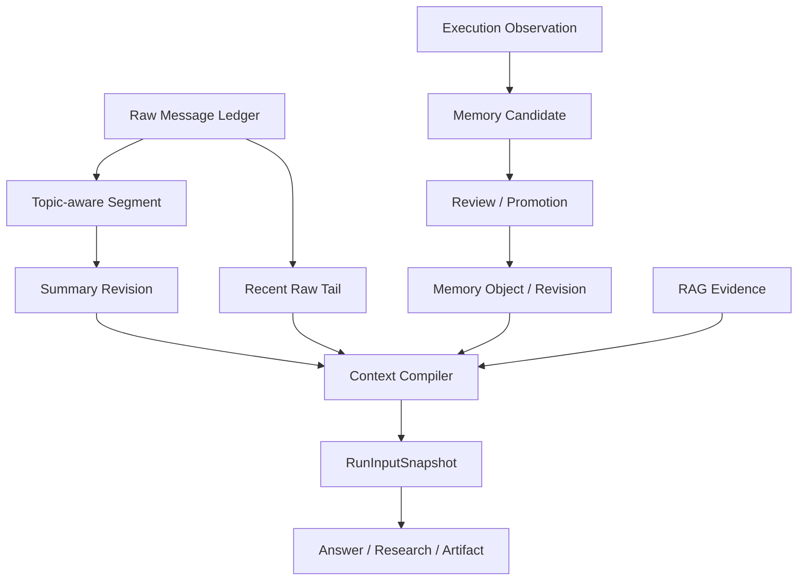

# Context Engineering 与 Memory：详细架构与具体设计

## 0. 从最近 N 条消息到可回放 Context 与门控 Memory

### 0.1 V0：最近 N 条消息是正确的起点

最小聊天系统把最近 N 条消息放入 Prompt。它不需要额外索引，尾部顺序天然连续，短会话下也最符合用户直觉。问题出现在长会话和主题切换后：固定窗口可能保留新但无关的闲聊，丢掉较早却仍在生效的约束；窗口大小增加又会带来成本和 Context Rot。

### 0.2 V1：摘要降低 Token，但自由覆盖会破坏历史

全量摘要每次从头计算，逻辑简单、全局一致性较好，成本随会话增长；增量摘要只处理新增部分，成本低，却容易累计误差。系统采用 Segment 和 Summary Revision：按连续主题分段，稳定段异步生成结构化摘要，活动尾部保留原文。

摘要构建时冻结 Segment Version。Promotion 时如果版本已经变化，旧 Revision 进入 Stale，不覆盖新历史。Ready 摘要才能替代对应消息；摘要未完成时回退有界 Raw Tail。代价是版本和可见性状态比“更新一行摘要”复杂。

### 0.3 V2：Context 编译从拼接字符串演进为预算化输入计划

系统消息、当前问题、近期原文、摘要、Memory 和 RAG Evidence 的信任等级与用途不同。简单按时间拼接无法保证关键任务契约，也无法解释某段内容为什么进入 Prompt。

Context Compiler 按安全策略、当前问题、Raw Tail、Memory、Summary 和 Evidence 分区编译，分别记 Token Ledger 和截断原因。超限时删除低优先级条目，不在一条 Memory 或证据中间截断，避免语义和 Provenance 失真。

### 0.4 V3：长期 Memory 从自动保存演进为 Candidate Promotion

自动把模型输出写入 Memory，个性化最快，但一次幻觉、注入或过时结论会持续影响后续任务；所有内容人工确认最安全，审核成本又过高；只做向量 Memory 易召回语义相近但 Scope、类型和有效期错误的内容。

当前方案让 Answer、Research、Artifact 只提交 Observation 或 Candidate。Memory Runtime 校验类型、USER/WORKSPACE Scope、敏感信息、Provenance、重复与冲突，再按风险进入审核或有限自动晋升。Canonical Memory 使用 Object、Revision 和 Latest Pointer，不原地覆盖历史。

### 0.5 V4：Memory 排序从相似度演进为可解释的预算选择

向量相似度适合语义匹配，却不能单独表达用户确认强度、任务类型、过期时间和历史效果。系统先做 Scope、Status 和有效期硬过滤，再结合 Key、任务相关性、确认强度、最近使用与 Outcome Utility 排序。

Memory Pack 是确定性编译结果，记录入选原因和 Revision Ref。Redis Cache Aside 降低重复编译成本，Key 包含 User、Workspace、Target、Policy Version 和指纹；版本事件触发失效，TTL 与 Jitter 限制漏失效和雪崩窗口。Redis 故障不能返回空 Pack 冒充“没有 Memory”，而要回源或明确降级。

### 0.6 V5：Memory 与 Evidence 从混合上下文演进为信任域隔离

用户偏好和历史观察可以影响表达方式，却不能成为资料事实。如果 Memory 进入 Source Recall、Evidence Rerank 或 Citation Candidate，模型以前生成的内容会反过来证明自己。

系统用架构边界保证 Memory 不进入 Retrieval 包，Prompt 中也使用独立 Section、预算和标签。资料中的指令不能晋升为 Memory Policy，生成结果必须经过 Promotion Gate。代价是个性化不能直接提高事实排名，但换来了可审计的证据链。

### 0.7 V6：重试从重新读取当前状态演进为 RunInputSnapshot

任务开始后，新消息、摘要晋升、Memory 修改和资料更新都可能发生。重试时重新编译会让同一个 Run 使用不同输入。RunInputSnapshot 冻结 Message、Summary Revision、Memory Revision、Evidence、Conversation Cutoff、Policy Version 和 Hash。

隐私删除后，引用的正文可能不再可用。系统将派生摘要清空或标 Stale，并把相关 Replay 降级或标记不可回放，不用最新内容替换历史。这牺牲完整回放率，换取删除语义的真实性。

### 0.8 功能点决策表

| 功能点 | 候选方向 | 当前选择 | 选择依据 | Trade-off |
|---|---|---|---|---|
| 短期上下文 | 最近 N 条、Token Window、主题窗口 | 主题 Segment + 连续 Raw Tail | 保留主题又不破坏尾部顺序 | 需要主题边界与降级策略 |
| 历史压缩 | 全量摘要、滚动覆盖、版本化增量摘要 | Summary Revision + Promotion CAS | 可追溯，旧构建不能覆盖新历史 | 状态模型更复杂 |
| 长期记忆 | 自动写入、全人工、风险门控 | Candidate + 分层 Promotion | 在个性化和污染风险之间取平衡 | 晋升延迟和审核成本 |
| Memory 模型 | 单行覆盖、Append-only Revision | Object + Revision + Latest Pointer | 支持冲突、回滚和审计 | 查询和更新步骤增多 |
| 召回 | 纯向量、关键词、规则与排序组合 | 硬过滤后多信号排序 | Scope 和有效期不能交给相似度 | 需要维护 Policy |
| Context Packing | 直接拼接、统一 TopK、分区预算 | 分区优先级 + Token Ledger | 信任和用途可解释 | 可能牺牲低优先级相关内容 |
| 缓存 | 无缓存、TTL、版本事件 + TTL | Cache Aside + 版本指纹 + TTL/Jitter | 降成本并限制陈旧窗口 | 失效链路和回源逻辑增加 |
| Evidence 关系 | 混合排序、仅 Prompt 标签、架构隔离 | 检索包零依赖 + Prompt 分区 | 防止自证闭环 | Memory 不能作为事实增强 |
| 可重复执行 | 每次重新编译、复制全文、引用快照 | RunInputSnapshot 引用冻结 | 控制存储且可解释输入 | 删除后只能降级重放 |
| 删除 | 软删、Tombstone、物理清理派生内容 | 停止召回 + 最小 Tombstone + 回放降级 | 隐私优先且保留必要审计 | 历史结果可能不再完整 |

### 0.9 面试叙事顺序

从最近 N 条在长会话中失效开始，依次引出 Segment、Summary Revision 和 Raw Tail；再说明长期 Memory 为什么不能自动写，也不能只靠向量相似度；最后用 Evidence Isolation 和 RunInputSnapshot 收住可信与可回放问题。不要把 Context、RAG 和 Memory 当成同一个“往 Prompt 里塞内容”的功能。

## 1. 总体架构



## 2. 数据分层

| 层 | 内容 | 真源 | 生命周期 |
|---|---|---|---|
| Raw Message | 用户与助手原始消息 | MySQL | 会话级，受删除策略约束 |
| Segment | 连续主题和消息范围 | MySQL | 随会话演进 |
| Summary Revision | Segment 的版本化压缩 | MySQL/对象引用 | 可回放 |
| Recent Tail | 尚未稳定压缩的近期原文 | 编译结果 | 单次 Run |
| Memory Object | 稳定记忆槽位 | MySQL | USER/WORKSPACE 长期 |
| Memory Revision | 记忆版本和审核状态 | MySQL | 可追溯 |
| Evidence | 资料事实证据 | Source/Snapshot/Chunk | 独立于 Memory |
| RunInputSnapshot | 一次执行实际输入引用 | MySQL | Run 级冻结 |

## 3. Conversation Ledger

消息按单调 Sequence 写入，提交 Run 时冻结 Conversation Cutoff Seq。后续新消息不能进入已经开始的 Run。删除消息后，依赖该消息的摘要和 Snapshot 标记降级或不可回放，不能用更新内容替换历史输入。

## 4. Segment 与摘要

### Segment

保存 Conversation、起止 Sequence、Topic Identity、Version 和状态。活动 Segment 可以追加消息，稳定 Segment 进入异步摘要。

### Summary Build

创建时冻结 Segment Version 和消息范围，通过 Kafka 异步生成。Promotion 时比较当前 Segment Version：一致则将 Revision 设为 Ready；不一致则设为 Stale，并为新版本重新构建。

### Incremental Compaction

只压缩越过阈值且主题稳定的消息，尾部保留原文。新消息只影响活动 Segment，历史 Ready Summary 不重新生成。Context Compiler 在 Summary 未 Ready 时使用有界 Raw Tail 兜底。

## 5. Memory 模型

### MemoryObject

稳定槽位，包含 Scope、Type、Key、Latest Version、状态和所有者。例如 USER:writing_style 或 WORKSPACE:terminology。

### MemoryRevision

包含 Canonical Statement、Provenance、Status、Version No、Supersedes、Valid From/Until、Review 信息和 Hash。Revision 状态可为 Proposed、Active、Rejected、Superseded、Stale、Deleted。

### ExecutionObservation

Answer、Research 和 Artifact 只提交观察，不直接修改 Canonical Memory。Observation 带幂等键、来源 Run、候选类型和用户信号，由 Memory Runtime 单点治理。

## 6. Promotion 流程

1. 从明确确认、纠正或稳定产物中提取 Candidate。
2. 校验 Candidate Type、Scope、敏感信息和 Provenance。
3. 查找同 Slot 的当前 Memory，判断重复、冲突或更新。
4. 进入 Review Queue，用户确认或拒绝。
5. 通过后创建新 Revision，并原子更新 Latest Version。
6. 发布 Memory Event，使编译缓存失效。

Artifact Worker 只能输出 Promotion Preview。Java Memory Runtime 才能创建 Canonical Revision。

## 7. Recall 与 Context Compilation

Memory Recall 先按 USER/WORKSPACE、Type、Status 和有效期过滤，再结合任务类型、Key 匹配、最近使用和用户确认强度排序。输出 Explainable Memory Pack，包含入选原因和版本引用。

Context Compiler 的优先级建议：

1. System 与安全策略。
2. 当前用户问题和任务契约。
3. 必要近期原文与活动主题。
4. 已确认约束和高相关 Memory。
5. 相关历史 Summary。
6. RAG Evidence。

Evidence 有独立预算和标签，实际排列可以按模型 Prompt 设计调整，但 Memory 不能提升为事实证据。

## 8. RunInputSnapshot

Snapshot 不一定复制所有正文，但必须冻结能够重建输入的身份：Message Ref、Segment Summary Revision Ref、Memory Revision Ref、Evidence Ref、Conversation Cutoff、Compiler Policy Version、Token Ledger 和内容 Hash。

重放时只读取当时有效版本。若隐私删除导致引用不可用，返回降级等级或明确失败，不能偷偷换成新版本。

## 9. Evidence Isolation

- Memory 不进入 Source Recall。
- Memory 不参与 Citation Candidate。
- Memory 不参加 Evidence Rerank。
- Prompt 中 Memory 与 Evidence 使用独立 Section 和信任标签。
- 检索资料中的指令不能晋升为 Memory Policy。
- 生成结果只有经过 Promotion Gate 才能形成 Memory。

## 10. 缓存一致性

Compiled Memory Pack 可按 User/Workspace/Target/Policy Version 缓存，并设置 TTL 与抖动。Memory Revision 晋升、替换、删除时发布失效事件。缓存失效失败时，版本化 Key 和短 TTL 限制陈旧窗口。

## 11. 并发控制

- Message Sequence 保证会话顺序。
- Summary Promotion 使用 Segment Version CAS。
- Memory Promotion 使用 Revision Version 与 Latest Pointer CAS。
- Observation 使用 Run ID + Type + Key 幂等。
- 编译固定 Selection As Of 和 Conversation Cutoff，避免读到执行后的新状态。

## 12. 删除与隐私

删除 Message、Report 或 Memory 后，相关派生摘要、候选、缓存和 Snapshot 标记必须停止在线召回。审计可保留最小 Tombstone 和 Hash，但不保留已要求删除的正文。跨 Scope 提升需要用户明确确认。

## 13. 可观测性

| 维度 | 指标 |
|---|---|
| Context | 编译 Token、压缩率、Summary 命中、Raw 回读、截断原因 |
| Segment | Build 延迟、Stale Promotion、重建次数 |
| Memory | Candidate、Review、Accept/Reject、Conflict、Stale、Recall |
| Replay | Snapshot 重建成功率、降级等级、Hash 不一致 |
| Safety | Scope Violation、Evidence Pollution、敏感信息拒绝 |

## 14. 测试

- Segment 切分、版本追加和 Summary Promotion CAS。
- Ready Summary 替换覆盖消息，Building/Stale 不进入 Snapshot。
- Conversation Cutoff 与新消息隔离。
- Memory Candidate 幂等、冲突、审核、替换和删除。
- USER/WORKSPACE Scope 隔离。
- Memory 不进入 Retrieval/Citation 的架构边界测试。
- RunInputSnapshot 冻结、重建和隐私删除降级。
- 缓存失效和版本 Key 测试。

## 15. 技术取舍

| 决策 | 收益 | 代价 |
|---|---|---|
| 原始消息保真 | 可回读、可重建 | 存储与隐私治理成本 |
| 增量 Summary Revision | 降低重复计算 | 版本模型更复杂 |
| 人工门控 Memory | 降低错误强化 | 写入速度较慢 |
| USER/WORKSPACE 双 Scope | 边界清楚 | 不覆盖更复杂组织模型 |
| Memory/Evidence 隔离 | 事实链可信 | 个性化不能直接改变检索事实 |
| Snapshot 引用冻结 | 可回放 | 删除后需要降级语义 |

## 16. 当前边界与演进

当前已实现 Conversation Segment、Summary Revision、RunInputSnapshot、Memory Candidate/Revision/Review、Scope 隔离和 Evidence 边界。后续需要用真实长会话数据补充 Token 节省率、摘要一致率、Memory Precision@K 和陈旧误召回率，再决定更复杂的自动晋升、TTL 和学习排序策略。

## 17. Topic-aware Window 编译算法

```text
input: conversation_id, cutoff_seq, current_query, mode, token_budget

recent = load messages <= cutoff_seq ordered by seq desc
active_topic = resolve topic from query + recent + task anchor
segments = load READY summaries relevant to active_topic
pins = load explicit user constraints
memory = compile governed memory pack

sections = [system, task, pins, recent_raw, segments, memory]
sections = deduplicate_by_provenance(sections)
sections = trim_by_priority_and_budget(sections)

snapshot = freeze references + policy version + token ledger
return snapshot
```

关键点是所有读取都受 `cutoff_seq` 和 `selection_as_of` 限制，避免同一次 Run 中看到后来写入的消息或 Memory。

## 18. Segment 切分方法

切分信号可以分硬信号和软信号：

- 硬信号：新 Conversation、显式切换任务、不同 Artifact/Research Run、用户明确“换个话题”。
- 软信号：实体集合变化、相邻消息语义相似度下降、时间间隔、Query Intent 变化。

硬信号可直接开新 Segment，软信号累计到阈值再切。切错的代价不同：过度切分导致上下文碎片，切分不足导致无关主题混合。因此低置信度时宁可保留近期 Raw Tail，等待更多证据。

## 19. Summary Revision 数据结构

```text
summary_revision(
  id, segment_id, revision_no, status,
  source_segment_version,
  covered_start_seq, covered_end_seq,
  summary_text, content_hash,
  ready_at, stale_at
)
```

Promotion 条件是当前 Segment Version 等于 `source_segment_version`，并且 Revision 仍为 Building。条件更新行数为 0 表示并发冲突或已被处理，不能无条件覆盖。

## 20. 摘要结构而不是自由段落

摘要建议拆成：主题、已确认事实、用户约束、决定、纠正、开放问题、实体引用和 Message Ref。结构化字段能让 Compiler 只选择相关部分，也能检测摘要是否丢了关键约束。

```json
{
  "topic": "简历亮点重写",
  "confirmed_constraints": [],
  "decisions": [],
  "corrections": [],
  "open_questions": [],
  "message_refs": []
}
```

## 21. Memory Candidate 去重与冲突算法

先用 `scope + type + normalized_key` 找到 Slot，再比较 Candidate 与 Active Revision：

```text
if semantic_equal and same polarity:
    DUPLICATE
elif same key and incompatible value:
    CONFLICT -> REVIEW
elif candidate narrows existing rule:
    SCOPED_REVISION
elif user explicitly corrects:
    SUPERSEDING_REVISION
else:
    NEW_CANDIDATE
```

语义比较可以用规则、Embedding 或 LLM Judge，但最终写入必须经过状态机和版本约束。模型判断不能直接 Update Canonical Memory。

## 22. Memory Pack 的预算算法

Memory 按硬过滤后排序，逐项装入独立预算：

```text
for item in ranked_memories:
    if item.tokens > remaining_budget:
        continue or compress(item)
    if conflicts_with_selected(item):
        keep higher governed version
    select(item)
```

不能让某个超长 Memory 占满预算。类型化 Pack 可分别限制 Preference、Constraint、Decision 和 Episode Pointer 数量，保证多样性。

## 23. Token Ledger

每次编译记录 System、Task、Recent Raw、Summary、Memory、Evidence 各 Section 的估算和实际 Token。Token Ledger 能回答“为什么早期消息没进本轮输入”，也为压缩率和成本优化提供数据。

估算器和模型实际 Tokenizer 可能有偏差，所以应保留安全余量，并记录模型与 Tokenizer Version。

## 24. Cache Key 与失效

```text
memory-pack:{userId}:{workspaceId}:{targetKey}:{policyVersion}:{latestRevisionClock}
```

把 Revision Clock 或 Version 放入 Key，可以让旧缓存自然失效；事件删除用于及时回收。TTL 处理漏失效，Jitter 防止同一时间大量重建。Cache Value 只存引用和受控文本，不存外部 Evidence。

## 25. 并发时序案例

用户提交消息 M10 后触发 Summary Build V3；在 Worker 完成前又提交 M11，使 Segment 升到 V4。V3 回调执行：

1. 查询 Segment 当前 Version=4。
2. 发现请求携带 Source Version=3。
3. 条件更新失败，将 Revision 标为 Stale。
4. 为 V4 创建新 Build。
5. Context Compiler 在 V4 Ready 前继续使用旧 Ready Summary + M10/M11 Raw Tail。

这个例子把乐观锁、异步任务、旧结果晚到和可用性降级串在一个功能里。

## 26. 评测集构建

长上下文 Case 应包含早期约束、中途纠正、话题切换和近期追问，验证 Constraint Recall、Correction Adoption 和 Topic Isolation。Memory Case 应包含重复候选、跨 Workspace 同名 Key、过期决策、显式纠正和恶意资料指令，验证 Precision@K、Scope Violation、Stale Recall 与 Poisoning Rejection。

Token 节省率只有在关键约束召回不下降时才有意义。不能为了写一个高压缩百分比，牺牲回答正确性和回放能力。

## 27. 不可变输入快照与连续 Raw Tail

每次 Answer 或 Research Run 创建一份不可变 RunInputSnapshot。快照不是“当前消息列表的引用”，而是固定 History Head、已就绪 Summary Revision、连续 Active Raw Tail、Retrieval Plan 和 Evidence Manifest 身份。后续消息、摘要晋升或资料删除不会悄悄改变历史 Run 的原始输入。

Raw Tail 必须有界且连续。不能为了省 Token 从尾部挑几条“看起来重要”的消息，因为被跳过的中间纠正可能改变后文语义。准备阶段失败后，恢复流程复用冻结的 Preparation 和原 Ledger ID；相同提交返回原 Receipt，相同幂等键但不同 Payload 返回冲突。

并发相同提交只有一个 Winner。Preparing Lease 未过期时拒绝恢复，过期后多个恢复者通过 Claim 竞争出一个 Owner。进程在 Prepare 与 Ready 之间退出，恢复仍沿用原 Ledger，避免产生两套输入身份。

## 28. Summary Promotion 的版本可见性

长对话只压缩旧 Active Prefix，最近连续尾部保持原文。Summary Build 完成后先进入 Ready Revision，再通过 Promotion 条件更新当前可见版本。Building Summary 不参与新快照；旧版本 Worker 晚到时被标记 Stale，不能覆盖新的 Segment Head。

Ready Summary 会替代它覆盖的原始消息，但不能与这些消息重复进入同一个 Snapshot。研究报告完成后也会触发下一段 Active Prefix 的异步摘要构建，使 Answer 与 Research 共用同一 Conversation Ledger。

这里可以引出 MVCC 的可见性思想：Revision 可以存在，但是否对新事务可见由 Current Pointer 决定。项目没有直接实现数据库 MVCC，而是在业务层复用了版本快照和条件晋升的思想。

## 29. Memory Candidate 的风险分层

Candidate Policy 同时评估 Confidence、Utility、Scope、来源和冲突。弱推断默认 Hold，不能因为模型语气肯定就写入长期记忆；低风险、用户明确表达的负向偏好可以在受控策略下通过，例如“以后不要使用某种格式”。存在冲突 Active Memory 时必须进入 Review。

等价语句先做规则归一化，再判断重复，避免“请用中文回答”和“回答时使用中文”生成两条 Memory。语义模型可辅助，但最终去重与晋升仍受版本状态机约束。

Memory Outcome 形成反馈闭环：被接受的结果提高 Utility，负向结果降低 Utility 并要求 Review，重复不良结果把 Memory 标记为 Stale。Utility 使用平滑更新，而不是一次反馈直接把分数改到极端，减少偶发评价造成的剧烈抖动。

## 30. Memory Pack 的确定性编译

编译器先做 Scope 隔离，再按 Scope Specificity、Utility、Freshness 和 Neighborhood 排序。Token 超限时按完整 Memory Object 截断，不能截取半条约束。Policy Version 和确定性 Token Estimate 进入编译结果，使相同输入得到相同 Pack。

Pack Cache Key 使用输入 Fingerprint，Value 保存 Schema Version 和 Fingerprint。任一不匹配回退 Compiler；Redis 故障或未配置只影响性能，不返回空 Memory。Utility 或 Revision 变化会改变 Fingerprint，从而自然失效旧 Pack。

能力适配器缺失时必须记录 Explicit Degradation，不能把“没有召回 Memory”解释成“用户没有 Memory”。这一点与 RAG 的 Provider Degradation 使用相同可靠性原则。

## 31. 删除后的回放降级

Answer Evidence Manifest 保存当时选中的 Excerpt 与 Content Hash，Research Completion 保存不可变 Final Evidence Manifest。资料或消息被删除后，历史 Run 仍保留身份、Hash 和删除事实，但正文被 Redact，Replay 状态降级；新 Snapshot 不再选择被删 Summary 或 Source。

这个设计同时满足两种要求：历史审计仍能解释“当时引用过什么身份”，隐私删除又不会保留可恢复正文。删除 Ready Summary 时，受它覆盖的更早回放也必须降级，不能因为摘要文本仍在历史快照中绕过删除。

## 32. 实时事件的有界重放与合并

Session Event Mux 在订阅 Live Event 前先完成 Replay Prime，避免终态事件先到导致订阅者关闭、历史 Delta 尚未补齐。客户端携带 Cursor 只重放其后的事件；Cursor 早于有界窗口时明确拒绝，要求客户端查询最终结果，不能假装从零继续。

Token Delta 在短窗口内 Coalesce 后发布，减少 Redis Pub/Sub 和网络小包。多实例 Mux 通过同一 Bridge 传播事件，不重复启动生成；Conversation-level Cursor 还能聚合同一会话下多个 Run。Redis 读取失败不能等价为空事件列表，发布失败必须暴露本地降级信号。

对话消息序号以原子方式分配连续的 User/Assistant Pair，并发提交不会产生重复或断裂序号。检测到非法 Sequence State 时记录指标，便于发现 Ledger 漂移。

## 33. Context Window 不等于 Memory

Context Window 是模型本次推理可见的 Token 范围，它是计算资源限制。Conversation History 是应用保存的历史消息。Memory 是应用选择跨任务保留并在未来召回的信息。三者不能混用。

把历史存在数据库里，不代表模型本次看见；把内容放进 Prompt，也不代表它会永久记住；模型支持更长 Context，也不代表应该把所有历史都发送。

长 Context 的主要代价包括：

- 输入 Token 增加，延迟和费用上升。
- 无关内容增加 Attention 干扰。
- 中间位置的信息更容易被忽略。
- 旧指令和当前目标发生冲突。
- 每次调用都重复传输相同历史。

因此 Context Engineering 的任务是选择、压缩、排序和隔离，而不是机械填满窗口。

## 34. Sliding Window、Summary 和 Retrieval

### 34.1 Sliding Window

只保留最近 N 条或最近 T 个 Token。实现简单、结果确定，适合局部连续对话。它会丢掉早期约束，也无法区分主题。

### 34.2 Summary Memory

把旧历史压成摘要，压缩率高，可以保留全局事件。摘要是有损的，模型可能漏掉否定、数字和例外；反复“摘要的摘要”还会累积误差。

### 34.3 Retrieval Memory

把历史片段或 Memory Embedding 后按当前问题召回。它能跨很长历史找相关内容，但依赖 Query 表达，可能找不到隐含约束，也可能召回语义相似但已经过期的信息。

### 34.4 Structured Memory

把偏好、约束、决策等保存为带类型、Scope 和版本的对象。查询和冲突治理清楚，前期需要定义 Schema，也不适合保存所有自由叙事。

项目组合使用：最近 Raw Tail 保证局部连续，Segment Summary 压缩旧对话，Canonical Memory 保存长期稳定约束。没有一种方法单独解决全部问题。

## 35. Topic Segmentation 的方法

固定消息数切段容易实现，但会从话题中间截断。按时间间隔切段适合聊天停顿，却不保证语义切换。Embedding 相似度可以检测相邻消息主题变化，阈值不稳定；LLM 分类理解更强，成本和延迟更高。

项目采用业务信号和主题感知相结合的方式。显式 Turn Mode、任务完成、研究报告回写和较强主题切换都可以形成边界。Segment 不是永久语义真理，而是压缩和恢复单位，因此判断应稳定、可版本化，不能每次编译随机重分段。

## 36. 增量摘要与全量摘要

全量摘要每次读取全部历史，能重新纠正旧摘要，成本随对话长度增长，也容易在相同输入上产生文字漂移。

增量摘要只处理新关闭的 Prefix，成本近似与新增消息相关。它依赖旧 Summary，错误可能累积。项目保留 Summary Revision、Covered Message Range 和 Raw Tail，使评测能够检查摘要覆盖，也能在必要时从原消息重建。

摘要应结构化保存：

```text
topic
decisions
constraints
open_questions
referenced_entities
covered_message_range
source_revision
```

自由段落可读性好，却不容易确认是否遗漏约束。结构化摘要适合 Compiler 选择，也便于针对字段评测。

## 37. Promotion 为什么类似 MVCC

异步 Summary Worker 从 Segment Version 3 开始生成，完成时 Segment 已到 Version 4。直接覆盖会让新消息看见基于旧历史的摘要。

项目创建不可变 Summary Revision，并在 Promotion 时执行条件更新：

```text
promote revision
where segment_id = ?
  and current_source_version = revision.source_version
```

Revision Ready 但未 Promotion 时不对新 Run 可见。这和 MVCC 的思想相似：多个版本可以存在，读取者根据快照和当前指针决定可见版本。它不是数据库隔离级别实现，而是业务层版本治理。

## 38. RunInputSnapshot 与可重复执行

若 Worker 每次需要上下文时都查询最新消息，运行期间可能出现：

```text
Plan 读取历史 H1
用户新增消息
Generate 读取历史 H2
Verifier 又读取摘要 H3
```

同一次运行的不同阶段看到不同世界，失败后无法复现。

RunInputSnapshot 把选择结果冻结。它保存引用和版本，正文可以按受控方式存放。Snapshot 的代价是旧 Run 不自动获得用户后续修正，但这是正确语义：新修正应创建新 Run，不能悄悄改变旧任务。

## 39. Memory 的类型与生命周期

Working Memory 服务当前任务，生命周期短；Episodic Memory 记录发生过的事件；Semantic Memory 保存稳定事实和规则；Preference Memory 保存用户偏好。

项目长期层重点保存偏好、约束和已确认决策，不把所有对话事实都自动永久化。每条 Memory 有：

- Canonical Statement。
- Type 与 Scope。
- Provenance。
- Version 与 Supersedes。
- Status。
- Valid From/Until。
- Utility 与 Outcome。
- Review 信息。

生命周期使用 Proposed、Active、Rejected、Superseded、Stale 和 Deleted。TTL 适合自然过期数据，Stale 表示当前不再推荐但保留历史，Deleted 表示正文不可继续使用。

## 40. Candidate Promotion 的替代方案

### 40.1 自动写入

每次模型识别到偏好就更新 Memory，体验即时，污染风险最高。模型推断、玩笑、临时要求和外部文本都可能变成长期规则。

### 40.2 全人工确认

安全性高，但每次都弹确认会打断使用，用户很快忽略。

### 40.3 风险分层门控

明确、低风险、可撤销的偏好可以按策略晋升；弱推断和冲突内容进入 Review；高风险规则要求确认。项目选择这种方式，在自动化和污染控制之间平衡。

风险不能只看 Confidence。一个高置信的错误 Workspace 级规则影响面很大，一个低风险的单次格式偏好即使判断错也容易修正。Policy 还要考虑 Scope 和副作用。

## 41. 去重、冲突与语义等价

字符串相等只能识别完全重复。规则归一化可以处理大小写、空白、固定同义表达和否定格式，确定性强；Embedding 可以识别更多改写，却可能把相似但不同的约束合并；LLM Judge 理解最强，但成本高且不稳定。

项目先用规则处理高确定性等价，再对剩余 Candidate 做受控语义判断。冲突不是删除其中一条，而是保留 Candidate 和 Active Revision，进入 Review 或创建新 Superseding Revision。

例如“回答使用中文”和“代码注释使用英文”并不冲突，因为 Target 不同；“所有回答使用中文”和“这个 Workspace 使用英文”需要结合 Scope Specificity 判断。冲突检测必须比较 Type、Scope、Target 和有效期。

## 42. Memory Rank 与 Context Packing

单一相关性排序会让新鲜但低价值信息压过长期规则。项目排序顺序强调硬过滤优先：

```text
1. User/Workspace Scope
2. Status 与有效期
3. Target/Neighborhood 匹配
4. Scope Specificity
5. Utility
6. Freshness
```

Token 超限时按完整对象选择。另一种方法是让 LLM 对全部 Memory 做二次选择，能理解复杂任务，却要先把全部候选送给模型，失去节省上下文的意义。当前确定性 Compiler 更容易缓存和回放。

## 43. Utility 的在线更新

固定 Utility 只能表达写入时判断。项目根据应用结果做平滑更新：

```text
new_utility = old_utility × (1 - α) + outcome_score × α
```

`α` 越大，响应新反馈越快，也更容易被单次异常影响；越小，分数稳定，但错误 Memory 需要更久才能降权。重复负向结果除降低 Utility 外，还可把状态转为 Stale。

Outcome Feedback 不能直接作为事实正确性的证明。用户不喜欢某个回答，可能是生成问题而不是 Memory 问题，因此负向结果先触发 Review，而不是自动删除。

## 44. Cache Aside 与 Fingerprint

Memory Pack 计算涉及查询、排序和 Token 估算，适合缓存。Cache Aside 流程是：

```text
read cache
miss -> compile from MySQL
write cache
return pack
```

Key 或 Value 必须包含 Policy Version、Revision Clock、Scope、Target 和 Utility Fingerprint。只按 User ID 缓存会把不同 Workspace 或不同策略混在一起。

Redis Failure 回退 Compiler，保证正确性。TTL 加 Jitter 防止大量 Pack 同时失效。热点击穿可以进一步使用互斥构建或逻辑过期，当前规模下版本化 Key 与短 TTL 已能满足恢复要求。

## 45. Evidence 与 Memory 的信任域

Evidence 回答“资料中有什么事实”，Memory 回答“用户希望系统如何工作”或“过去确认过什么”。如果 Memory 可以提高 Evidence Rank，主观偏好会改变事实来源；如果外部 Evidence 可以直接写 Memory，Prompt Injection 会获得长期影响。

因此 Compiler 把它们放在不同 Prompt Section，引用只能指向 Evidence Manifest。Memory 带 Provenance 供治理，不被渲染为事实 Citation。这个隔离类似权限系统中的不同信任域。

## 46. 删除、Tombstone 与回放

硬删除正文后，历史 Run 无法完整重放；保留所有副本又违反删除要求。项目选择删除优先：

- 正文和可恢复副本不可继续使用。
- 保留非敏感 Identity、Hash、Tombstone 和删除时间。
- 历史 Replay 标记 Degraded 或 Unavailable。
- 新 Snapshot 排除已删除内容。

Tombstone 防止旧异步任务或缓存把删除对象重新创建。它记录“这个身份已删除”，不是保存正文的替代位置。

## 47. 流式事件与断线重连

只订阅 Live Stream 会在连接建立前丢事件；先查历史再订阅，又存在查询和订阅之间的竞态。Mux 先建立可控的 Replay Prime，再衔接 Live，保证 Cursor 后事件有序。

Replay Window 有界，防止内存无限增长。Cursor 过旧时明确要求读取最终结果。Token Coalescing 把短时间内多个 Delta 合并，减少消息数量，代价是首字后更新稍微变粗。首 Token 延迟和整体吞吐需要分别观察。

## 48. 当前方法的选择边界

短对话可以只用 Sliding Window；少量固定用户设置可以用普通配置表；一次性批处理不需要 RunInputSnapshot；没有长期偏好的产品不应该为了“Memory”概念增加复杂度。

当前方案适合对话长、任务会异步恢复、不同 Workspace 有独立规则、Memory 可能冲突或删除的系统。回答面试题时，要把 Context Compression、Run Snapshot 和 Long-term Memory 分成三个问题，再解释它们如何组合。

## 49. 设计概念到生产代码的导航

| 设计概念 | 当前生产实现 | 关键不变量或设置 | 主要测试 |
|---|---|---|---|
| 消息顺序与 Context 投影 | `ConversationMessageSequence`、`ConversationContextProjectionService.compile()` | Message Seq 单调，Context 投影保留内容 Hash 与来源 | `ConversationMessageSequenceTest`、`ConversationTurnModuleContractTest` |
| Segment Summary | `ConversationSegmentBuildService`、`SegmentSummaryPromotionService.promote()` | Build 与 Promotion 分离，晋升校验当前 Segment 和 Revision | `ConversationTurnModuleContractTest` |
| RunInputSnapshot | `RunInputSnapshotService.recordAnswerSnapshot()/recordResearchSnapshot()` | Run 开始后固定消息、Summary、检索配置和版本 Manifest | `ConversationTurnModuleContractTest` |
| Memory Candidate | `MemoryCandidateService.buildCandidates()`、`MemoryCandidatePolicy` | 候选先分类与风险门控，不自动成为长期事实 | `MemoryCandidatePolicyTest` |
| Memory Revision | `MemoryVersionService.appendVersion()/revoke()` | Append Revision，不覆盖历史；读取显式选择当前可见版本 | `MemoryVersionServiceTest` |
| Memory Compiler | `MemoryCompilerService.compileChatControlPack()`、`MemoryCompilerPolicy` | 按 Workspace、Actor、Task Neighborhood、风险和 Token Budget 选择 | `MemoryCompilerServiceTest`、`MemoryCompilerPolicyTest` |
| 编译缓存 | `MemoryCompiledPackCache` | Key 含 Scope、请求、Policy 与 State Fingerprint；TTL 180 秒、Jitter 30 秒 | `MemoryCompiledPackCacheTest` |
| Outcome Feedback | `MemoryOutcomeService`、`MemoryOutcomePolicy` | 反馈更新 Utility 信号，不直接改写事实内容 | `MemoryOutcomePolicyTest` |

Memory 与 Evidence 属于不同信任域。当前 Memory 不参与资料召回、Evidence Rerank 或 Citation；向量 Memory 只适合先通过 `MemoryShadowRecallService` 观察候选，不应未经质量与删除验证直接写入 Prompt。
