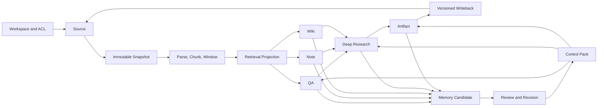
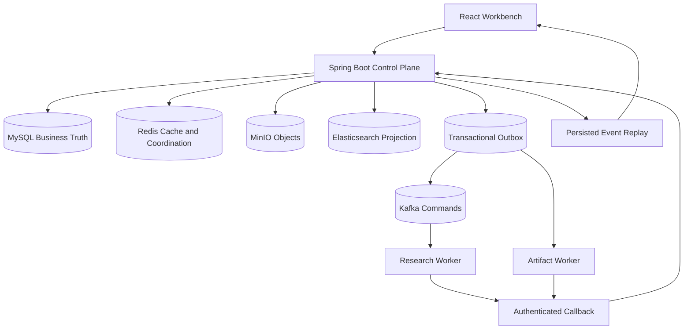

# NoteWeave v2 系统架构与统一领域模型

## 产品边界

NoteWeave 服务的核心场景是：用户在一个 Workspace 中接入资料，基于可追溯来源完成问答、阅读、知识维护和深度研究，再把确认过的结论转成产物或长期上下文。

系统不以“让 Agent 自由调用很多工具”为目标。模型负责生成候选意图和结构化结果，Java 主服务负责鉴权、状态推进、预算、持久化、审批、版本和最终写回。任何产生外部副作用的动作都需要服务端按执行时身份重新校验。

`[当前实现]` 浏览器访问 React 19 / TypeScript / Vite 工作台；Java 17 / Spring Boot 3.3.5 主服务通过 Spring JDBC 和 Flyway 访问 MySQL 8.4；Redis、Kafka、MinIO 与可选 Elasticsearch 提供缓存、消息、对象和检索能力；两个 Python 3.12 Worker 分别执行 Research 与 Artifact 长任务。

`[目标设计]` 生产部署可以把这些单元扩展为独立副本和托管基础设施，但不改变领域所有权。Java 主服务和 MySQL 仍拥有业务真源，Worker 不直接更新主业务表。

## 用户输入先编译为能力约束

`[当前实现]` 项目还没有一个覆盖所有能力的通用 Intent Router。QA 使用版本化的 Conversation Query Rewrite 与确定性低召回 Expansion；Research 使用结构化 `ResearchIntent`、Matrix Plan 和 Plan Digest；Artifact 由显式 `skill_key`、内置 Catalog 与输入 Schema 收口。Note、Wiki 仍由产品入口和 `answer_mode` 决定链路。这个现状说明各能力已经有局部输入合同，但不能声称系统已经完成统一意图识别、跨能力多意图拆分或置信度校准。

`[目标设计]` 共享入口只生成不可变的 Understanding Snapshot，不直接创建工具调用或业务终态：

```text
original_input + normalized_input + candidate_capability
  + entities_and_aliases + explicit_constraints + unresolved_references
  + missing_fields + ambiguity_reason + clarification_decision
  + policy_version + snapshot_digest
```

原始输入必须保留，规范化文本只用于检索、分类和参数提取。模型给出的能力候选、实体、别名与置信度都是候选事实，服务端仍按当前用户、Workspace、对象状态、输入 Schema、预算和审批做确定性校验。置信度也不能直接使用模型自报值，只有在冻结数据集上完成校准后，才能参与按风险分层的澄清阈值。

各能力从同一 Snapshot 编译自己的强类型输入：QA 得到 Retrieval Query Set 和 Source Scope；Research 得到不能被 Replan 降低的 Research Intent；Artifact 得到 Skill 候选、必填参数和风险级别。歧义若会改变 Workspace、能力类型、写回目标、外部副作用或费用边界，系统必须澄清；低风险检索歧义可以生成多个受限查询变体，但不能扩大 Source Scope。一个请求同时要求研究和生成产物时，先冻结共同输入，再创建有显式依赖的 ResearchRun 与 ArtifactJob/ArtifactRun，不能把多项意图塞进一个无法独立恢复的 Run。

## 全链路领域模型



### Workspace 是重复校验的安全边界

`[当前实现]` Workspace 关联成员、角色、ACL 版本、资料、会话、知识、检索设置、Research Run、Artifact Job 和 Memory。请求身份过滤器、Controller/Interceptor、Service、Repository 查询条件和缓存键都能看到 Workspace 上下文。

`[目标设计]` 隔离必须在以下层重复成立：

| 层 | 校验内容 | 失败策略 |
| --- | --- | --- |
| API Gateway / 请求身份 | Token、Session、用户状态、请求大小 | 拒绝请求 |
| Controller / Interceptor | 路径中的 Workspace 与当前成员关系 | `403` 或 `404`，不泄露资源存在性 |
| Application Service | 动作权限、资源归属、目标版本、运行范围 | 高风险写操作 Fail Closed |
| Repository / SQL | `workspace_id` 与父对象条件共同进入查询或更新 | 受影响行数为 0 时按不存在或冲突处理 |
| Cache | Workspace、ACL Version、Object Version 进入 Key | ACL 变更主动失效，短 TTL 只作兜底 |
| Kafka / Worker Snapshot | Workspace、Run、Task、Scope Digest 固化并签名或哈希 | Worker 只接受已 Claim 的服务端快照 |
| Search Index | 文档写入和查询都带 Workspace 与 Source Version Filter | 缺少 Filter 的查询不执行 |
| Object Storage | 服务端生成 Object Key 和短时授权 | 模型不能构造 Bucket、Key 或任意 URL |
| Trace / Metric | Workspace 只用受控低敏标识，禁止正文和密钥 | 高基数字段进日志或审计，不进 Metric Label |

仅在 Controller 检查 Workspace 不够。异步回调、缓存命中、索引查询和按全局 ID 读取都可能绕过请求路径，底层查询与执行快照仍要带作用域。

### Source 与 Snapshot 保持事实可追溯

Source 表示用户认知中的一份资料，Snapshot 表示某个不可变内容版本。解析出的 Chunk、Window、Embedding、全文索引文档和图关系都引用 Snapshot。运行引用具体版本，因此资料后来更新时，旧回答仍能解释当时看到了什么。

`[当前实现]` 上传、文件对象、Source、Snapshot、Chunk、Window、投影状态和清理任务均有迁移与服务落点。`source_catalog_version`、digest 和运行 Evidence Manifest 用于版本与证据关联。

`[目标设计]` Source 更新产生新 Snapshot，不原地改旧 Snapshot。删除和权限收回先写 Tombstone，再传播到检索、缓存、Wiki、Memory、评测副本和派生产物。保留审计元数据与清除正文是两个不同策略，必须受数据保留政策控制。

### Conversation、Run、Task 不是同一个对象

Conversation 组织交互历史，Run 表示一次有输入、状态、输出和终态的执行，Task 表示可被调度、领取和重试的工作单元。一个 Run 可以拥有多个 Task；Conversation 不拥有 Worker Lease。

| 对象 | 主要输入 | 状态关注点 | 最终产物 |
| --- | --- | --- | --- |
| AnswerRun | Turn、检索范围、Control Pack、Release Bundle | 低延迟生成、SSE、取消、Evidence | 带引用回答、Note 草稿或 Wiki 回答 |
| Research Run | Research Brief、Typed WorkItem、预算、来源策略；当前比较型实现使用 Matrix | 多阶段、冲突、Checkpoint、Repair、Synthesis | 研究报告和 Evidence Manifest |
| Artifact Job / Run | Job 保存用户意图，Run 冻结一次生成或再生成请求 | Skill Graph、Waiting、Verifier、Version | 文件、结构化产物、版本和写回 |
| 通用 Task | Target、Phase、状态、事件和 Result Ref | 用户查询、取消、等待和终态展示 | 用户可见任务投影 |
| Domain Execution / Attempt | 不可变执行快照、Owner、Lease、Epoch、Fencing Token | Claim、Heartbeat、Retry、Callback | 某一步的候选结果或失败回执 |

普通聊天、Research 和 Artifact 不能共用一套简单状态。聊天强调秒级流式和用户取消；Research 需要类型化 WorkItem、阶段推进、证据充分性和重规划；Artifact 需要产物版本、文件校验、等待外部输入与回滚。共享的是 Task Interface、Outbox、Execution Lease 抽象、Fencing 校验模式、Receipt 和观测原语，不是同一张领域任务表或业务终态。`[目标设计]` `RunLifecycle` 模块通过 Research/Artifact Adapter 隐藏领域状态到通用 Task 的映射，避免 Controller 和前端分别维护两套规则。

### Evidence、Version 与 Projection 分工

Evidence 记录结论依赖的 Source/Snapshot/Chunk/Window、网页归档、知识版本或审核对象。Version 记录同一知识页、Artifact 或 Memory 对象的不可变结果。Projection 为查询和交付优化，可以随时重建。

`[目标设计]` 一条事实被撤销时，系统先让权威 Version 失效，再异步删除或标记全文索引、向量索引、缓存、Memory Pack 和评测副本。已有 Artifact 不能静默改写，应标记其依赖版本已撤销并阻止继续发布；是否物理删除由保留政策决定。

## 部署单元与数据所有权



| 组件 | 拥有的数据 | 不负责什么 |
| --- | --- | --- |
| MySQL | Workspace、Source、Run、Task、Evidence、Version、Outbox、Receipt、审计 | 大对象正文和搜索相关性计算 |
| MinIO | Source 原文件、派生文件、Artifact 导出 | 业务可见性与版本选择 |
| Elasticsearch / 向量索引 | 可重建检索文档和向量 | 资料真源、ACL 真源、运行终态 |
| Redis | ACL/目录/版本缓存、配额、短期协调 | 长期业务状态和唯一审计记录 |
| Kafka | 有序分区内的异步命令 | 业务完成、跨 Topic 全局顺序、Exactly-once 业务结果 |
| Worker | 工具调用、候选生成、校验和文件处理 | 主业务表、最终权限和发布决策 |
| SSE | 增量交付和断线重连 | 事件持久化和业务终态 |

MySQL 是真源，因为状态推进、唯一约束、版本比较、Workspace 归属和审计需要同一个事务边界。Elasticsearch 和向量索引为检索优化，Memory Pack 为 Prompt 预算优化，Redis 为延迟优化；这些结果都可以由 MySQL 与对象内容重算。让投影反向成为真源会使删除、权限收回、版本冲突和灾备恢复无法判定哪一份数据权威。

## 三类用户链路

### QA、Note 与 Wiki 共用资料，不共用检索目标

`[当前实现]` 三者共用 Conversation/Turn 基础设施，并按 `answer_mode` 和 Workspace Retrieval Settings 选择策略。

- QA 优先覆盖直接回答问题的最小证据集合，关注 Recall、排序、引用准确和证据不足拒答。
- Note 先定位 Source 与 Anchor，再扩展连续 Reading Window，关注原文阅读连续性、草稿中立性和人工写回。
- Wiki 从当前有效页面版本出发，扩展显式链接、反链和来源回链，关注版本正确、关系预算和治理状态。
- Research 允许外部搜索、跨来源冲突与多轮计划，检索预算和停止条件远大于单轮回答。

把四者压成“向量 Top K + 不同 Prompt”会丢失 Source 粗排、连续窗口、页面版本、关系扩展、来源质量和研究停止条件。

### Research 是可恢复证据生产线

`[当前实现]` Java 侧持久化 Run、Matrix/Cell、Task、Evidence、Candidate、Budget、Checkpoint、Stage、Role Result 与 Completion Replay Observation。Research Worker 只消费命令和提交结构化结果。`V097-V104` 新能力多数由 Feature Flag 控制。

`[目标设计]` Research 先冻结 Brief、来源策略、预算和 Release Bundle，再执行 Discovery、Plan、Search、Read、Extract、Verify、Repair 与 Synthesis。证据不足或来源冲突产生可见状态，不用低置信文本填满报告。恢复从持久化 Checkpoint 和外部调用回执开始，已经确认的搜索或模型结果不重复调用。

### Artifact 是受控副作用流水线

`[当前实现]` 对外模型是系统 Skill、Artifact Job、Version、File、比较、回滚、导出和写回。Python Worker 编译内部 Action、Graph、Verifier 与 MCP Binding，Java 侧保存输入快照、Outbox、Task 和最终版本。

`[目标设计]` Skill 注册时固化来源、版本、输入输出 Schema、允许工具、风险等级、Verifier 和资源预算；选择时只返回候选，服务端再做 Workspace、用户、版本、参数摘要和审批校验。Worker 生成候选产物，内容 Contract 通过后 Host 创建不可见的 `DELIVERY_PENDING` Version 与完整必需文件 Manifest，全部文件达到 `READY` 后才提升为可交付 Version。写回必须绑定精确的 `READY` Version，不允许模型直接修改 Source 或 Wiki。

### Memory 是审核后的上下文编译

`[当前实现]` Memory 包含 Signal、Candidate、Review、Object/Version、Canonical Runtime、Control Pack、Outcome 和撤销接口。编译缓存由 Workspace、对象版本和策略指纹决定。

`[目标设计]` 候选先去重、冲突检测和风险分层，再由人工或低风险策略审核。通过的 Revision 不可变；撤销产生新事实并主动失效所有 Control Pack。Memory 只能影响偏好、过程和已审核事实，不能与 Source Evidence 混在同一重排池里伪装成外部证据。

## Release Bundle 防止运行中配置漂移

`[目标设计]` 每个 AnswerRun、ResearchRun 和 ArtifactRun 固化一个 Release Bundle；ArtifactJob 只保存长期用户意图，不承载某次执行配置：

```text
model + provider policy
prompt template + prompt digest
input/output schema
validator and safety policy
retrieval strategy + index alias/version
skill/catalog/graph version
tool registry version
feature flag snapshot
```

运行开始后不能悄悄读取新的 Prompt、Skill 或索引。灰度发布创建新 Bundle，仅分配给新 Run；旧 Run 排空或按兼容规则恢复。回滚切回旧 Bundle，不修改历史输入快照。索引切换使用新索引构建、质量回执、Alias 原子切换和旧索引保留窗口。

`[当前实现]` Run Input Snapshot、检索策略元组、Artifact Skill 信息、Research Feature Flag Snapshot 和多个 provider 配置已经提供部分基础，但还没有一个跨所有能力的统一 Release Bundle 对象。

## 正常、异常与恢复主线

| 阶段 | 正常路径 | 异常或结果未知 | 恢复动作 |
| --- | --- | --- | --- |
| 提交 | 本地事务写业务对象与 Outbox | 客户端超时但提交可能成功 | 用 Client Request ID 查询原结果 |
| 发布 | Dispatcher Claim 并发送 | 发送成功但未标记 `SENT` | 重发，消费者按业务键去重 |
| 消费 | Kafka ACK 在业务持久化之后 | Worker 崩溃或 Rebalance | 重投，Task Claim/Lease 收口 |
| 执行 | Heartbeat 续租并写 Checkpoint | Provider 超时、限流、结果未知 | 先查 Provider Receipt；无查询能力时使用幂等键或转人工 |
| 回调 | 校验 Task、Lease Epoch、Fencing Token、Payload Digest | Worker 成功但响应或 Callback 丢失 | Worker 重发；Reconciler 按未知结果年龄对账 |
| 发布结果 | 服务端原子保存终态、Evidence 和 Version | 旧 Worker 晚到 | Fencing 拒绝旧写，保留审计计数 |
| 交付 | SSE 从持久化事件增量发送 | 浏览器断线 | 按 `Last-Event-ID` 回放并补终态 |

公共可靠性细节、状态表和可观测性口径统一见 [API 与事件契约](./API与事件契约-v2.md)。

## 参数与容量从约束推导

`[当前实现]` 上传与切片保护参数见 [资料基础设施](./资料基础设施详细设计.md)；Quota、Lease 与执行器见 [API 与事件契约](./API与事件契约-v2.md)；Research 调度批次见 [Research Agent 架构](./DeepResearch-ResearchAgent架构文档.md)。除非特别标注，这些是代码或 `application.yml` 的保护初值，不是吞吐结论。根目录 Compose 可能覆盖它们，例如本地默认关闭 Elasticsearch、Embedding、Rerank 和 LLM，并打开 QA MySQL Fallback 与 Note 本地 Metadata Fallback。生产是否允许这些回退由 `ProductionConfigurationGuard` 再次约束。

`[目标设计]` 参数调整遵循同一套记录：约束、初值、对比值、工作负载、观察指标、失败模式、停止阈值、恢复阈值、滞回窗口、回滚方式和证据标签。Worker 并发受 Provider 配额、数据库连接、Kafka 分区和回调吞吐的最小值限制；RAG Top K 受 Recall 与 Rerank/Prompt 成本共同限制；Research 步数受边际证据增益和预算限制。

`[当前实现]` 入口配额与有界执行器见 [API 与事件契约](./API与事件契约-v2.md)。现有保护能拒绝部分入口过载，但尚未统一计算数据库连接、线程池、Provider、Worker、队列年龄与任务成本之间的端到端准入额度。

检索也遵循同一层次：Rerank 在在线路径上是可选的容错步骤，失败时可以退回 RRF 并显式记录 Degraded；`RetrievalReleaseGateService` 面向索引/策略发布，要求 Provider Ready 和无降级最终运行。不能把“请求仍然返回”解释成“正式版本已经通过质量门禁”。

`[目标设计]` 每类工作负载的可接受在途数取所有硬资源预算中的最小值，再预留故障与管理流量：

```text
admission_limit = min(
  executor_service_capacity,
  database_connection_budget / connections_held_per_task,
  provider_concurrency_or_rate_budget,
  worker_and_callback_capacity,
  cost_budget / expected_cost_per_inflight_task
) - safety_reserve
```

同步 QA 超出预算时应快速拒绝或显式降级；Research 与 Artifact 可以进入持久队列，但队列长度、最老年龄、Workspace 份额和截止时间必须有上限。调参先以 Count-only/Shadow 记录“本应拒绝”的决策，再逐步执行；触发阈值和恢复阈值分离，并要求连续窗口与半开探测，避免限流、降级和恢复反复振荡。

`[生产待验证]` 当前没有生产请求分布、真实 Provider 速率、长期成本账单和跨区延迟，不能从线程池与 Batch 值推导 QPS。

## 安全与隐私边界

Source、网页、附件、工具返回、Tool Description 和 Skill Metadata 都是不可信数据。模型输出是意图，不是授权。

`[目标设计]` 每次工具执行重新校验用户、Workspace、Source/Run、工具版本、参数摘要、目标域名、风险等级和审批有效期。审批绑定精确 Artifact Version 或操作摘要，不能复用于修改后的参数。网络访问只允许注册 Provider 和域名允许列表，限制重定向、私网地址、Loopback、DNS Rebinding、响应大小和内容类型。API Key、Token、Cookie 不进入 Prompt、Trace、Span Attribute 或 Baggage。

高风险写操作在 ACL、Policy 或审批服务不可用时 Fail Closed。低风险只读链路可以在明确的缓存版本和短时窗口内降级，但必须记录使用的 ACL Version。删除按数据最小化与保留策略传播到对象、索引、缓存、Memory 和评测副本。

`[行业参考]` OWASP LLM01:2025 将直接和间接 Prompt Injection 都列为核心风险，并明确 RAG 或 Fine-tuning 不能消除该风险；MCP 规范定义工具发现、调用和传输鉴权，不替代业务对象授权；NIST AI RMF 提供 Govern、Map、Measure、Manage 的持续风险治理框架。

## 生产目标与当前证据边界

`[目标设计]` 能力级 SLO、RTO、RPO 和单位成功任务成本分别定义，不能只给全站平均值。QA、Source 接入、Research、Artifact、Memory 撤销的可用性与恢复目标不同。错误预算 Burn Rate 驱动暂停发布、降级和恢复，灾备演练按 MySQL 真源、对象完整性、消息恢复、投影重建、缓存预热的顺序进行。

`[已测-模拟]` Research 历史验收数字、确定性回放与 `NO_SUPPORTED_CANDIDATE` 失败屏障见 [质量、测试与发布门禁](./测试与评测/NoteWeave-评测指标报告.md)。该记录证明当时版本的测试与失败门禁，不代表当前工作区或生产质量。

`[生产待验证]` 真实 Provider 质量、真实用户采纳率、持续 SLO、跨组件备份恢复、跨可用区切换、安全红队覆盖率和单位成功任务成本仍需生产或受控预发布环境验证。

## 为什么当前不直接迁移到相近方案

| 方案 | 没有直接采用的原因 | 何时值得迁移 |
| --- | --- | --- |
| Temporal | 当前已有 MySQL 状态机、Outbox、Lease、Checkpoint 和回调契约；双写迁移会增加历史兼容与运维面 | 跨天流程数量、定时器、人工暂停和补偿路径显著增加，现有调度代码成为主要维护成本 |
| LangGraph | 适合图式 Agent 编排和 Checkpointer，但不能取代 NoteWeave 的 Workspace、Evidence、Version 与 MySQL 业务账本 | 运行图频繁变化、需要图级可视化与大量可复用子图，并能接受独立持久化治理 |
| 纯向量 RAG | 无法稳定处理精确词、权限过滤、版本、新鲜度和 Source/Window 语义 | 仅用于语义相似发现，可作为混合召回一路，不作为唯一策略 |
| 完全自主多 Agent | 权限、成本、停止、证据一致性和恢复状态难以审计 | 有可信评测证明自治带来净收益，且 Tool Sandbox、预算和责任边界成熟 |
| Elasticsearch 作为真源 | 搜索索引面向查询和重建，事务、版本与跨域约束不足 | 不迁移；只可扩大投影职责 |

`[行业参考]` Temporal 的持久执行、LangGraph 的 Checkpointer/Store 分离、Elasticsearch 的全文/向量/混合检索、LlamaIndex 的摄取缓存与文档管理都支持这些取舍；外部方案只证明设计方向可行。
