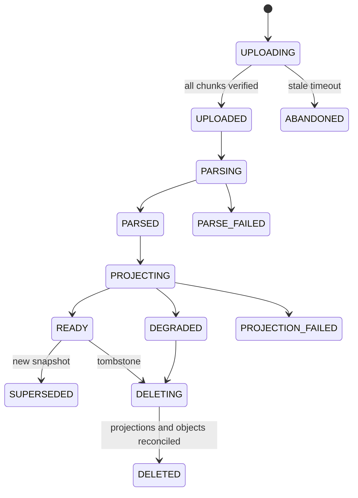

# Source、版本与检索投影设计

## 业务问题与非目标

用户需要把 PDF、DOCX、HTML 或 Markdown 资料接入 Workspace，并在后续回答、研究和产物中准确指出“哪一版资料的哪一段”支持了结论。资料接入必须处理大文件、重复上传、解析失败、索引延迟、版本更新、权限变化和删除传播。

Source 不负责回答问题，也不把 Elasticsearch 当作资料库。第一阶段不追求覆盖所有 OCR、版面、多模态与网页抓取格式；没有相应 Provider、配置和测试的解析能力不能写成当前实现。

## 用户操作与最终产物

```text
Create Upload
  -> PUT Chunks
  -> Complete
  -> File Object
  -> Source + immutable Snapshot
  -> Parse Assessment
  -> Chunk + Reading Window
  -> Retrieval Projection
  -> Ready / Degraded / Failed
```

用户最终看到 Source、版本、解析状态和可检索状态。下游拿到 Snapshot、Chunk、Window、位置与 digest，不读取一段失去来源身份的纯文本。

`[当前实现]` `UploadController` 提供创建、分块写入和完成接口，`SourceController` 提供列表与删除；文件可进入 Local/MinIO Adapter；MySQL 保存 `file_object`、`document_upload`、`upload_chunk`、`source*` 和 `source_cleanup_task`。上传上限 128 MB，默认 Chunk Size/Overlap 为 900/120。

## 从最小方案到目标方案

| 阶段 | 方案 | 暴露的 Bad Case | 修复与新代价 |
| --- | --- | --- | --- |
| V0 同步上传 | HTTP 收文件、同步解析、直接返回文本 | 大文件超时，进程崩溃后状态未知，重复请求产生重复资料 | 分块上传与持久化 Upload；增加临时对象清理 |
| V1 单版本 Source | 覆盖 `source.content` 并重新切片 | 旧回答无法解释，索引与正文可能指向不同版本 | 不可变 Snapshot 与 digest；增加版本和存储成本 |
| V2 单路索引 | 解析后直接写搜索引擎 | ES 故障拖垮上传，删除与权限变更难传播 | Outbox、Projection State 和异步重试；出现最终一致性窗口 |
| V3 固定切片 | 统一字符长度切 Chunk | 标题被切断、表格碎裂、Note 缺少连续阅读窗口 | 结构化 Chunk + Window + Location；解析器与 Schema 需版本化 |
| V4 可重建投影 | MySQL 持真源，搜索索引按版本构建 | 重建可能把旧版本重新切回当前 | Build Catalog、质量回执、Alias 切换和旧版本 Fence |
| 目标系统 | 版本、ACL、删除、评测副本和派生产物统一传播 | 多投影传播和对账复杂 | Tombstone、依赖清单、Reconciler、能力级 SLO |

`[行业参考]` LlamaIndex 摄取管线把 Transform、Cache、Document Management、异步与并行分开，并用 Document ID 做重复管理；Elasticsearch 提供全文、向量和混合检索；MinIO Versioning 使用不可变对象版本与 Delete Marker。NoteWeave 保留自己的业务 Snapshot 和 Tombstone，因为对象版本或搜索文档都不了解 Workspace、证据与发布状态。

## 状态机与数据真源

`[目标设计]` 下图是上传到 Ready/删除的语义状态。当前表字段以 Flyway 和 Service 为准，不能把图中每个名字当成已经落库的枚举值。



状态名表达目标语义，当前表字段以迁移和 Service 为准。业务真源是 MySQL 中的 Source、Snapshot、解析/投影状态、Tombstone 和清理任务；对象存储保存字节，索引保存可重建文档。

核心不变量：

- 同一个 Source 的 Snapshot 内容不可原地修改。
- `READY` 只指向当前有效 Snapshot 和目标 Projection Version。
- 任何检索结果必须同时满足 Workspace、Source 可见状态、Snapshot 当前/允许版本和 ACL Version。
- 删除先阻止新读取，再异步清理；缓存 TTL 不能替代撤销传播。
- 重建只能推进到目标版本，旧 Build 不能覆盖新 Alias。

## 正常、异常与恢复路径

### 正常路径

Upload 创建时固化 Workspace、文件名、媒体类型、总大小、分块策略和 Idempotency Key。每个 Chunk 校验索引、长度与摘要，Complete 校验总大小、Chunk 完整性和对象摘要。事务创建 Source/Snapshot、解析任务和 Outbox。解析器从对象存储读取，写 Parse Assessment、Chunk、Window 与位置；Projection Builder 按 Snapshot 构建索引，通过质量回执后标记 Ready。

### 异常路径

- Chunk 重复且摘要相同返回幂等成功，摘要不同返回冲突。
- Complete 超时后客户端按 Upload ID 查询，不重新创建 Upload。
- 文件类型声明与内容不符时拒绝或进入隔离，不让扩展名决定解析器。
- 对象写成功而数据库提交失败时，临时对象由 Stale Cleanup 回收。
- 解析器损坏、超时或内存超限进入稳定错误分类，不返回空文本成功。
- Elasticsearch 关闭、超时或零命中分别记录，不能都表示“无资料”。
- 新 Snapshot 发布期间，旧 Snapshot 仍可服务旧 Run；新 Run 只读已通过门禁的当前版本。

### 恢复路径

解析与投影以 Source/Snapshot/Parser Version/Projection Type 为幂等键。重试前读取真源状态；旧任务看到更高目标版本时停止。Reconciler 比较 Snapshot、Chunk Count、Projection Document Count、Alias Version 和 Object Manifest，补发缺失任务或隔离多余投影。

删除先在 MySQL 写不可见状态与清理任务，再删除全文/向量文档、Wiki 派生关系、缓存、Memory 引用和评测副本，最后处理对象。某一步失败保留 `DELETING` 与原因；对象 404 可按幂等成功，认证失败或 5xx 不能吞掉。

## 版本更新、权限变化与事实撤销

| 变化 | 真源动作 | 下游传播 |
| --- | --- | --- |
| 内容更新 | 新 Snapshot，旧 Snapshot `SUPERSEDED` | 构建新索引、切 Alias、标记依赖旧版本的 Artifact |
| Source 删除 | Tombstone + Cleanup Task | 索引删除、缓存失效、Memory/评测副本撤销、对象清理 |
| Workspace 成员移除 | ACL Version 递增 | ACL Cache 失效，查询按新版本过滤，外部授权撤销 |
| 标签/范围变化 | Catalog Version 递增 | Source 粗排与搜索过滤重新投影 |
| 事实撤销 | 新撤销 Version，不改历史 Evidence | 新 Run 不可引用，旧产物显示依赖失效状态 |

派生产物不能静默重写。Artifact Version 和 Research Report 保存依赖 Manifest；来源失效后标记 `STALE_DEPENDENCY` 或阻止发布，是否重新生成由用户或策略决定。

## 事务、并发、乱序与重复

HTTP Complete 只原子提交数据库状态和 Outbox，不等待 Kafka、Parser 或 ES。多个 Complete 使用 Upload 状态和唯一键收口。两个解析任务并发写同一 Snapshot 时，版本条件和唯一键只允许一个成为权威结果。

投影事件带 `source_id`、`snapshot_id`、`catalog_version`、`projection_type`、`target_index` 和 `event_id`。消费者按 Source 分区只能提供分区内顺序，最终仍比较目标版本；旧事件晚到时记录 Stale Drop，不做 Delete/Create 覆盖。

MinIO 与 MySQL 之间没有分布式事务。对象先写临时 Key，通过摘要后由数据库引用；数据库提交失败由清理任务回收，数据库成功但对象丢失由完整性扫描发现。任何补偿都保留原失败原因和重试次数。

## 切片、索引与缓存边界

Chunk 用于检索候选，Window 用于连续阅读和上下文补齐。Chunk Size 过小会提高召回粒度但丢上下文并增加索引/Embedding 成本；过大会稀释相关词并挤占 Prompt。Overlap 过小容易切断跨边界事实，过大会产生近重复和排序拥挤。

`[当前实现]` 默认 900/120 是本地配置基线。

`[目标设计]` 调优使用 400/80、700/100、900/120、1200/160 等候选，仅在同一 Dataset、Parser、Embedding、Index 和 Query Set 下比较 Recall@K、nDCG@K、Citation Completeness、Claim-Evidence Coverage、Window Continuity、索引字节数和单位查询成本。前者判断应引用 Claim 是否附有有效引用，后者判断证据是否完整支持 Claim，不能用一个含糊的 Coverage 同时表示两者。高价值分桶回退、索引放大或 P95 超预算时停止放量；连续两个窗口恢复并完成回归对账后再继续。

Source Catalog、ACL 和 Projection Status 可缓存，但 Key 必须包含 Workspace、Catalog/ACL Version 与对象版本。主动失效是正确性路径，TTL 只限制异常下的最长陈旧时间。撤销和权限收回的高风险读取发现版本未知时 Fail Closed。

## 为什么不用相近方案

| 方案 | 当前没有采用的原因 | 迁移条件 |
| --- | --- | --- |
| 文件直接存 MySQL BLOB | 大对象放大备份、Buffer Pool 与事务日志，难与派生文件分层 | 小对象、强事务且无需独立对象生命周期时才考虑 |
| Elasticsearch 作为 Source Store | 缺少业务事务、版本关系和删除审计的权威边界 | 不迁移，只扩大 Projection 能力 |
| 单独向量数据库 | 当前 ES + MySQL 已提供投影和过滤边界，引入后增加双索引对账 | 向量规模、ANN 延迟或多向量能力成为可测瓶颈 |
| 同步解析 | 请求延迟和崩溃窗口不可控 | 仅对很小文本的快速预览使用，不作为权威接入 |
| CDC 取代 Polling Outbox | 当前规模下增加日志连接器与运维成本 | Outbox 扫描成为瓶颈、事件种类稳定且有平台团队维护 CDC |
| 全量 GraphRAG | 摄取、社区构建和全局摘要成本高 | 跨文档全局问题占比高，局部 RAG 持续失败且评测证明收益 |

## 指标、阈值与动作

指标完整口径在 [质量、测试与发布门禁](./测试与评测/NoteWeave-评测指标报告.md) 维护。本模块必须至少切片到 Workspace、文件类型、大小、Parser Version 和 Projection Version。

| 指标 | 分子 / 分母或计算 | 目标设计动作 |
| --- | --- | --- |
| Upload Completion Rate | 完成且摘要通过的 Upload / 接受的 Upload | 下降时检查客户端中断、Chunk 冲突和对象错误 |
| Projection Ready P95 | Accepted 到目标投影 Ready 的时长分布 | 超 SLO 降低接入速率、扩 Consumer 或降级索引 |
| Final Convergence Rate | 窗口内最终与真源一致的 Snapshot / 应投影 Snapshot | 未收敛阻止索引发布 |
| Projection Lag | 当前时间减最老未投影版本创建时间 | 超阈值暂停新 Build，优先清积压 |
| Rebuild Duration | 完整重建开始到质量门禁通过 | 超 RTO 保留旧 Alias 并扩容或分批 |
| Object Integrity Failure | 摘要失败或缺失对象 / 应存在对象 | 任一高风险失败阻止发布并对账 |
| Deletion Propagation P95 | Tombstone 到所有强制消费者确认时长 | 超时 Fail Closed 并升级清理告警 |
| Downstream QA Recall@K | 正确证据召回 Query / Gold Query | Parser/Chunk 变更不得明显回退 |

所有阈值记录目标、基线、停止与恢复值。当前没有生产窗口时标 `[生产待验证]`，不能把 128 MB 上限或线程数当成吞吐结果。

## 测试、灰度与回滚

- 领域单测验证 Upload、Snapshot、Tombstone 与状态转换。
- Repository/MySQL 集成测试验证唯一键、并发 Complete、版本 Fence 和 Flyway。
- 对象存储契约测试覆盖重复写、非 404 错误、摘要和临时对象回收。
- Kafka/Outbox 集成测试覆盖发布前后崩溃、重复投递、Poison Message 和 DLQ。
- 固定文件回放覆盖 PDF、DOCX、HTML/Markdown、表格、损坏文件与超限文件。
- 故障注入覆盖 Parser 终止、Kafka 延迟、ES 不可用、MinIO 丢失和重建中断。
- 灰度按 Parser/Chunk/Projection Bundle 分配新 Source，不重解释历史 Snapshot；回滚 Alias 和 Bundle，保留新索引供分析。

`[当前实现]` `SourceRetrievalProjectionServiceCompensationTest`、`KafkaRetrievalProjectionFailureRecoveryTest`、`SourceDeletionCleanupListenerTest`、`MinioObjectStorageTest`、上传安全与清理测试提供现有验证面。

`[生产待验证]` 复杂 OCR/版面解析、目标规模重建、备份恢复和跨组件删除时限仍需受控环境与生产窗口验证。

## 面试入口

面试主回答与追问见 [资料底座一体化手册](./简历亮点八股/33-资料底座与异步投递一体化面试手册.md)。
