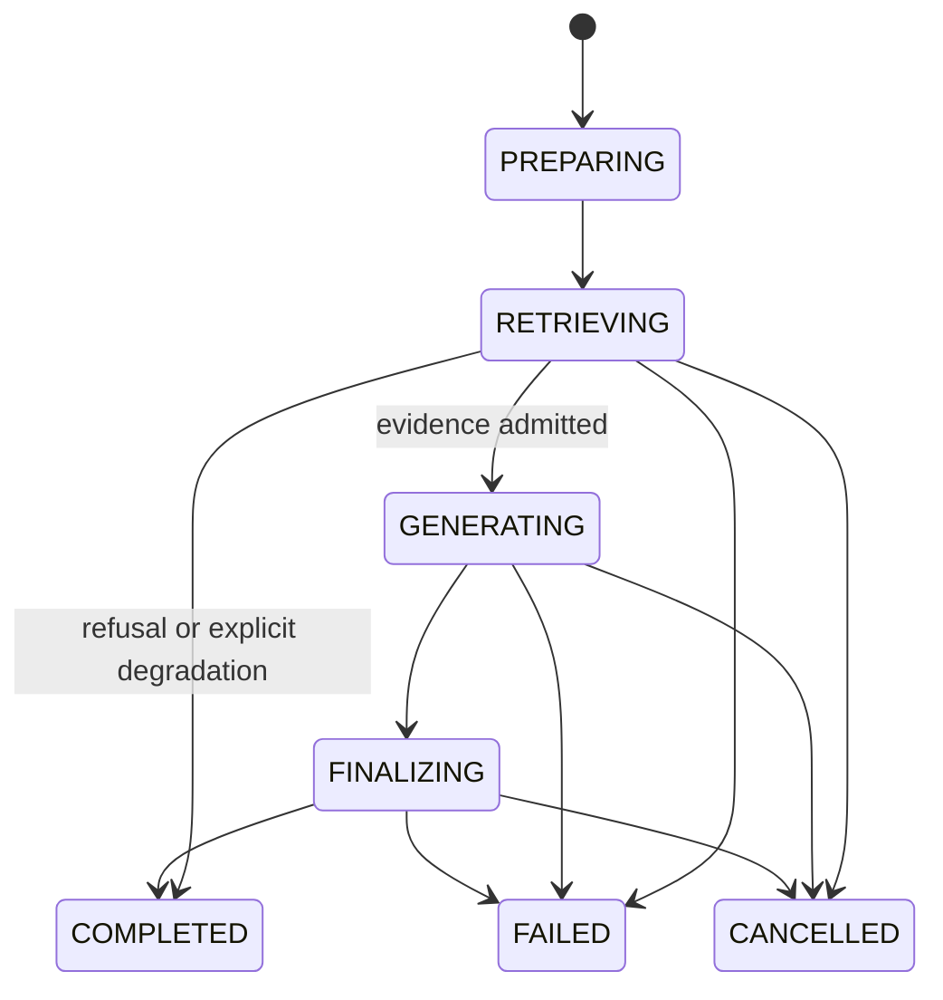

# QA：带引用回答与场景化 RAG

## 业务问题与非目标

QA 要在当前 Workspace 允许的资料中回答问题，并让用户能打开原文核对每个关键结论。高分文本不等于有效证据，候选还要满足版本、权限、相关性、来源多样性和上下文预算。

QA 不负责开放式网页研究，不在证据不足时继续搜索到无限步骤，也不把 Memory 偏好当作事实引用。跨来源冲突、复杂多跳和长报告交给 Research；连续阅读和草稿写回交给 Note；页面关系与治理交给 Wiki。

## 用户操作与产物

用户在 Conversation 中提交问题，得到流式回答、引用列表、来源片段、运行状态和可恢复事件。运行结束后，AnswerRun 保存 Evidence Manifest 与输入快照，资料更新后仍能解释旧回答使用的版本。

```text
Turn Submission
  -> Query Rewrite / Expansion
  -> Workspace and Snapshot Filter
  -> Keyword + Vector Recall
  -> Weighted RRF
  -> Rerank
  -> Evidence Relevance and Diversity Selection
  -> Answer / Refusal
  -> Citation Validation
  -> Persisted Events and Manifest
```

`[当前实现]` `ConversationTurnModule` 负责 Turn 幂等和输入落库，`ChatService` 异步执行；`QaHybridRetriever`、`QaRrfFusionService`、`QaRerankService`、`QaEvidenceRelevancePolicy` 和 `QaEvidenceSelectionPolicy` 提供检索与证据选择；AnswerRun Event 支持 SSE 游标恢复。

## Query Understanding 与检索查询合同

`[当前实现]` QA 已把用户原问题与检索表达分开。`qa-conversation-rewrite-v1` 保存多轮 Query Rewrite 版本，`QaQueryExpansionService` 在低召回路径中解析当前问题和主题锚点，生成最多 5 个确定性查询变体，并去除重复和常见问句前缀。它能证明原问题不会被 Expansion 覆盖，也能回放某个策略版本，但没有统一的实体别名表、指代置信度、澄清状态或跨能力 Intent Decision，不能把它描述成完整的自然语言理解系统。

`[目标设计]` QA 的理解结果至少保留以下字段：

| 字段 | 作用 | 失败时的处理 |
| --- | --- | --- |
| Original Query | 回答目标、审计和重放真值 | 永不被 Rewrite 覆盖 |
| Normalized Query Set | 检索用改写、关键词和主题锚点 | 单个变体失败不改变原问题 |
| Entity / Alias | 解析简称、术语和上下文实体 | 无法唯一解析时保留多个候选 |
| Explicit Constraint | 时间、Source、格式和否定约束 | Rewrite 不得删除或放宽 |
| Unresolved Reference | “它”“第二个”等未决指代 | 影响答案对象或 Scope 时澄清 |
| Clarification Decision | 是否继续、澄清或拒绝 | 保存原因码和策略版本 |

澄清不是统一低置信阈值。歧义只影响搜索措辞时，可以在原 Scope 内并行受限变体；歧义会改变 Workspace、Source、答案对象或后续写回时，必须先问清楚。多轮上下文中的实体和别名只能来自当前冻结的 Conversation Snapshot，不能从其他 Workspace 或未授权 Memory 猜测。生成器仍以 Original Query 和显式约束为回答目标，Normalized Query 只影响候选检索。

理解层单独评测槽位完整率、指代消解准确率、术语解析准确率、澄清 Precision/Recall 和错误检索路由率。最终答案正确不能反推 Rewrite 正确，因为 Rerank 或模型可能偶然补救；答案错误也不能直接归因于 Rewrite，需要沿 Query Variant、Candidate、Evidence 和 Claim 逐层定位。

## 演化与 Bad Case

| 阶段 | 方案 | Bad Case | 下一步修复 |
| --- | --- | --- | --- |
| V0 直接 Prompt | 把用户问题交给模型 | 幻觉、无法核对、资料边界不清 | 先检索再生成，返回 Source |
| V1 单路 Top K | BM25 或向量搜索前 K 个 Chunk | 精确编号和语义问法互相失配；单一 Source 占满候选 | Sparse + Dense，多路融合与来源去重 |
| V2 分数相加 | 直接归一化不同检索分数 | 不同 Provider 分数不可比，权重漂移 | RRF 只使用排名，再做 Rerank |
| V3 Rerank 后全塞 Prompt | Top N 直接拼接 | 重复片段挤占预算，相关不代表能支撑 Claim | Relevance Policy、Evidence Selection、字符预算 |
| V4 有引用回答 | 生成文本附 Citation | 引用存在但不支持 Claim，引用版本可能过时 | Manifest、Claim-Evidence Coverage、引用校验与拒答 |
| 目标系统 | Versioned Bundle + 离线/Shadow/在线门禁 | 模型、Prompt、索引或评测集漂移 | Release Bundle、质量回执、漂移监控与回滚 |

`[行业参考]` Elasticsearch 官方把全文、向量、Hybrid、Filter 和安全能力视为不同层；LangSmith 的 RAG 评测把 Correctness、Relevance、Groundedness 与 Retrieval Relevance 分开。NoteWeave 采用混合召回和分层评测，但 Evidence 所有权、Workspace 隔离和引用版本由自己的主服务保证。

## 状态、真源与版本

`[当前实现]` AnswerRun 状态与 [API 与事件契约](./API与事件契约-v2.md) 一致，不是 `PENDING/VALIDATING`：



引用校验发生在生成提交前，不单独形成一个名为 `VALIDATING` 的 Run 状态。旧入口可能出现 `CREATED`，只按兼容映射解释。

MySQL 中的 Turn、Run Input Snapshot、AnswerRun、Answer Event 和 Evidence Manifest 是运行真源。Elasticsearch 命中、Embedding、Rerank 分数和 Redis 实时桥接是运行过程或投影，不拥有终态。

Release Bundle 至少固化 Query Rewrite Version、Retrieval Plan、Strategy Profile、Relevance/Selection Policy、Embedding/Rerank/LLM Model、Prompt、Index Version 和 Feature Flag。`[当前实现]` `qa-weknora-hybrid-v1`、`qa-conversation-rewrite-v1`、`qa-low-recall-expansion-v1` 与 `qa-source-diverse-budget-v2` 已形成版本化策略元组的一部分。

## 正常、异常与恢复

### 正常路径

Turn 提交事务创建消息、上下文快照和 AnswerRun。Query Rewrite 只生成结构化检索查询，不改用户原问题。检索先施加 Workspace、Snapshot Status 和 Source Scope，再执行关键词与向量召回；RRF 合并排名，Rerank 调整语义次序；Evidence Policy 去除无法支撑问题的片段，Selection 优先保留不同 Source，并受条数和字符预算限制。生成器只使用选择后的 Evidence，输出 Citation 引用稳定 Evidence ID。

### 异常路径

- Client 重复提交同一 Request ID，返回已有 Run，不产生第二个 Answer。
- Embedding 或 Rerank 关闭时，只走明确允许的降级路径，并记录 `degraded` 与原因。
- Elasticsearch 零命中表示策略结果为空；Provider 关闭、超时、损坏响应和权限错误分别分类。
- 候选存在但不满足 Evidence Relevance，返回证据不足拒答，不能生成空引用成功。
- 资料在运行中更新，当前 Run 继续使用冻结 Snapshot；新 Run 使用新 Bundle/版本。
- SSE 断线按事件序号回放；终态从 AnswerRun 补发。
- 用户取消先更新持久状态，执行器在检索、Provider 和生成边界检查取消；晚到结果因状态条件被拒绝。

### 恢复与结果未知

模型或 Rerank 读超时属于结果未知。生成调用使用 Run + Step + Input Digest 的操作键；Provider 支持查询或幂等键时先对账。未完成的候选不进入 Answer Event 和 Manifest。进程重启从输入快照重新构建可重放步骤，已持久化 Evidence 和事件按版本复用。

## 检索与 Evidence 算法

### 多路召回和 Weighted RRF

RRF 对每一路排名贡献 `weight / (k + rank)`，避免直接比较 BM25、Cosine 和 Provider 分数。K 太小会让第一名支配融合，太大会压平头部差异。权重表达通道优先级，不等于概率。

`[当前实现]` QA 片段索引和 Note 资料索引的文本字段使用自定义分析器 `noteweave_cjk_text`：standard 分词后经过 `cjk_width`、`lowercase`、`cjk_bigram`，中文按相邻两字成词，英文和数字仍按单词切分。默认的 standard 分析器把中文切成单字，"缓存"与"存储"会因为共享一个字而互相命中，BM25 的排序基本失效。分析器属于索引结构，索引版本因此升为 `qa-chunk-index-v2` / `note-source-index-v2`；已有工作台需要调用 `POST /api/v2/workspaces/{workspaceId}/retrieval-indexes/rebuild` 重建索引并切换别名。

`[当前实现]` QA V2 策略：每步候选 12，关键词和向量各 Recall 60，Fusion Ceiling 100，Rerank Top N 40，RRF K 60，Vector/Keyword Weight 为 0.7/0.3。阈值当前为 0，后续由 Evidence Policy 收口。

这些数字只证明当前策略可以确定性回放。没有同数据集消融前，不能声称 0.7/0.3 或 K=60 最优。

### Evidence Selection

`[当前实现]` 最终 Evidence 最多 6 条、总字符最多 8000。第一轮每个 Source 取一条，第二轮按排序补满，重复 Evidence ID 不重复加入。Relevance Policy 处理显著标识、词项支持和相邻 Chunk 延续。

`[目标设计]` 选择目标同时考虑相关性、Claim 覆盖、来源质量/多样性、近重复、版本新鲜度和字符成本。生成后按 Claim 切分，计算每条 Claim 是否至少有一个直接支持 Evidence；无法支持的句子删除、改为不确定表达或触发拒答。

## 幂等、并发与一致性

Turn Submission 用 Client Request ID 和 Ledger 防重复；Answer Event 序号按 Run 单调。检索投影按 Snapshot 和 Index Version 查询，结果 Hydration 再以 Workspace 与 Source 当前可见性批量校验，防止索引陈旧造成越权。

Query Cache Key 包含 Workspace、ACL Version、Retrieval Strategy、Index Version、Normalized Query 和 Source Scope。权限或 Source 变化主动失效。Answer 本身不以模糊 Query Key 全局缓存，因为 Conversation Context、Memory Pack 和 Evidence Version 会改变结果。

同一 Conversation 并发 Turn 通过 Turn Ledger 和 Active History Head 确定顺序；每个 Run 的输入快照独立，晚完成的旧 Run 不能覆盖新消息或 Wiki/Source 版本。

## 参数推导与调优

| 参数 | 太小的失败模式 | 太大的失败模式 | 调优证据 |
| --- | --- | --- | --- |
| Recall K | Gold Evidence 进不了候选 | ES/Embedding 延迟和噪声上升 | Recall@K 曲线与候选 P95 |
| Fusion Ceiling | 融合前截断正确一路 | Rerank 输入与内存放大 | Recall、Rerank Cost、Tail Latency |
| RRF K | 头部一路垄断 | 排名差异被压平 | nDCG/MRR 与分桶 Bad Case |
| Channel Weight | 某类问法长期漏召回 | 另一通道贡献被淹没 | 精确词、语义改写、跨语言分桶 |
| Rerank Top N | 正确候选未进入精排 | Provider 成本和 P99 增长 | nDCG、P95/P99、单位成功成本 |
| Evidence Count | Claim 覆盖不足 | 重复、Prompt 稀释、成本上升 | Claim-Evidence Coverage 与 Faithfulness |
| Character Budget | 上下文被截断 | Token 成本和 Lost-in-the-middle | 引用覆盖、生成延迟、Token |

`[目标设计]` 固定 Dataset、Snapshot、Index、模型与 Prompt，对 BM25、Vector、RRF、Rerank 和 Evidence Selection 做逐层消融。新策略若 Scope Violation > 0、Citation Accuracy 低于门禁、关键分桶 Recall 明显回退或 P99/成本超预算，停止灰度。恢复需修复版本在固定回放和 Shadow 窗口同时通过。

## 指标与阈值动作

| 指标 | 分子 / 分母 | 主要用途 |
| --- | --- | --- |
| Hit@K | Top K 含至少一个 Gold 的 Query / Gold Query | 判断能否找到 |
| Recall@K | Top K 命中 Gold Evidence 数 / 全部 Gold Evidence 数 | 判断证据覆盖 |
| Precision@K | Top K 相关 Evidence 数 / K 或实际返回数 | 判断噪声 |
| MRR | 每个 Query 第一个相关结果倒数排名的均值 | 判断首个证据位置 |
| nDCG@K | 实际 DCG / 理想 DCG | 判断多级相关排序 |
| Citation Validity | 可解析且版本存在的 Citation / 全部 Citation | 链接与身份有效性 |
| Citation Accuracy | 真正支持对应 Claim 的 Citation / 已判定 Citation | 引用是否支撑 |
| Citation Completeness | 至少绑定一个有效 Citation 的应引用 Claim / 全部应引用 Claim | 引用责任是否完整；当前评测字段 `Citation Coverage` 兼容映射到该语义 |
| Claim-Evidence Coverage | 被一组 Evidence 完整支持的原子 Claim / 全部可核验原子 Claim | 结论是否真正可追溯，不等同于只附了链接 |
| Faithfulness | 完全受给定 Evidence 支持的判定单元 / 全部判定单元 | 控制幻觉 |
| Unsupported Conclusion Rate | 无依据结论 / 全部可核验结论 | 硬质量门禁 |
| Refusal Recall | 正确拒答的应拒答样本 / 全部应拒答样本 | 避免证据不足时硬答；当前字段 `Refusal Accuracy` 兼容映射到该语义 |
| Refusal Precision | 正确拒答样本 / 全部被拒答样本 | 防止系统靠全部拒答虚高 Recall |
| Answer Coverage | 非拒答样本 / 全部合格样本 | 披露系统实际愿意回答多少问题 |
| Selective Accuracy | 被系统回答的样本中正确数 / 被回答样本 | 衡量拒答后的质量 |

所有指标按 Dataset Version、Bundle、语言、问题类型、Workspace 风险、设备/Provider 和时间窗切片，报告 Bootstrap 置信区间。阈值和完整元数据见 [评测文档](./测试与评测/NoteWeave-评测指标报告.md)。

## 为什么不用相近方案

| 方案 | 不直接采用 | 迁移或引入条件 |
| --- | --- | --- |
| 纯向量 RAG | 精确编号、专名、权限过滤与版本语义不足 | 作为混合召回一路，不独占策略 |
| 只用 BM25 | 同义改写、跨语言和抽象问题 Recall 受限 | 保留为确定性基线和降级 |
| 分数归一化相加 | Provider 分数分布漂移，跨模型难比较 | 有稳定校准集和版本化校准器时评估 |
| GraphRAG | 构建、更新和全局查询成本高 | 多跳/全局问题占比高且离线评测证明净收益 |
| QA 直接升级 Agent | 单轮问题的成本、状态和安全复杂度不划算 | 需要多步工具、冲突验证和长报告时转 Research |
| Memory 参与 Evidence Rank | 偏好和内部记忆会伪装成外部事实 | Memory 只影响表达和过程，事实仍需 Evidence |

## 测试、灰度与回滚

- 单测验证 Query Rewrite、RRF、Relevance、Evidence Selection 和拒答。
- 理解合同测试覆盖原问题保留、约束不丢失、指代歧义、别名冲突、错误 Scope 扩大和澄清原因码；当前仓库只覆盖其中的确定性 Expansion 部分。
- Provider 契约测试验证关闭、超时、`429`、损坏 JSON 与越界 Document Index。
- Repository/ES 集成测试验证 Workspace Filter、Snapshot Version 和损坏响应。
- 固定 Gold 回放报告各层候选与消融结果，检查近重复泄漏。
- Prompt Injection 红队把恶意指令放入 Source 与 Tool Result，验证它不能改变 Tool/Scope。
- Playwright E2E 上传真实资料、提交问题、检查 Citation 和 SSE 重连。
- 灰度按 Bundle 和 Workspace 分配，只对新 Run 生效；回滚切旧 Bundle/Index Alias，历史 Manifest 不变。

`[当前实现]` Retrieval Benchmark Replay、Shadow Comparator、Quality Gate、Final Gold Contract、QA Hybrid/RRF/Rerank、Evidence Ownership 和 SSE 测试提供现有验证面。

`[生产待验证]` 真实 Provider 的 Answer Quality、长期拒答曲线、用户采纳率、漂移和单位成功回答成本仍需真实流量。

## 面试入口

面试主回答与追问见 [场景化 RAG 一体化手册](./简历亮点八股/31-场景化RAG一体化面试手册.md)。
