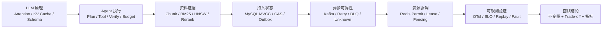

# 08｜知识深挖库：面试八股与 NoteWeave 项目映射

> 本文不是新的业务故事，而是“面试官继续往下问时”的知识底座。每个主题都按：概念 → 原理 → NoteWeave 落点 → 失败场景 → Trade-off → 追问回答组织。简历主稿负责讲清楚项目价值，本文负责证明这些设计不是只会调用函数。

## 0. 先补哪些知识：面试官真正想确认什么

面试官通常不会因为听到 `Kafka`、`RAG` 或 `Agent` 就认为有深度。他会继续确认四件事：

1. 你是否理解组件内部的工作原理，而不是只会调用 API。
2. 你是否能把原理映射到一个明确的不变量、状态或失败窗口。
3. 你是否知道方案的边界、代价和什么时候应该换方案。
4. 你是否用指标、测试或故障注入证明过它，而不是只讲目标架构。

因此，所有专题都用下面这条链路复习：

```text
业务失败
  → 技术原理
  → 数据/状态不变量
  → 正常路径
  → 失败路径
  → 观测与验证
  → 方案边界与升级条件
```

### 0.1 本轮审查补出的知识缺口

| 主题 | 原稿已有 | 仍需下钻的知识 | 面试官的怀疑 |
|---|---|---|---|
| LLM | Agent、Prompt、Verifier | Attention、KV Cache、结构化输出、Tool Calling、采样参数、Token 成本 | “是不是只会调模型接口？” |
| RAG | BM25、向量、RRF、Rerank | BM25 参数、HNSW、Embedding 距离、Chunk、指标、ES Segment | “为什么这个检索链路有效？” |
| Agent | Plan、Replan、Checkpoint | State Machine/DAG 边界、取消竞态、失败分类、预算与调度 | “Agent 失败时谁负责收敛？” |
| Java | 线程池、异步 | JMM、CAS、AQS、CF、Spring 事务代理、GC 长尾 | “底层并发和事务你能讲清吗？” |
| MySQL | 幂等、版本、事务 | B+Tree、MVCC、锁、Redo/Undo/Binlog、EXPLAIN、DDL | “为什么这样建表和加索引？” |
| Redis | Lua、Lease、Quota | Cache Aside、过期、持久化、集群、限流、锁安全边界 | “Redis 挂了会不会改写业务事实？” |
| Kafka | Outbox、Offset、Rebalance | ISR、幂等生产、事务消息、重试/DLQ、Lag 与完成状态 | “你说至少一次，重复怎么办？” |
| ES/对象存储 | 检索投影、MinIO | Refresh、Merge、Alias、Generation、Multipart、清理传播 | “索引和文件怎样一致？” |
| 可靠性 | SLO、Trace、测试 | OTel、RTO/RPO、Unknown Outcome、混沌与回放 | “怎么知道系统真的可靠？” |

---

## 1. LLM 基础：不要把模型当黑盒函数

### 1.1 Transformer、Attention 和 KV Cache

Transformer 的核心是自注意力。对一组 token 的向量，模型计算：

```text
Q = XWq, K = XWk, V = XWv
Attention(Q,K,V) = softmax(QKᵀ / √dₖ + Mask) V
```

直觉上，Query 表示当前 token 想找什么，Key 表示每个历史 token 提供什么索引，Value 表示真正要聚合的信息。`Mask` 在自回归生成时禁止看到未来 token。多头注意力让模型同时学习词法、指代、结构等不同关系，残差连接和 LayerNorm 保证深层网络可训练。

生成第 `t` 个 token 时，历史 token 的 `K/V` 不需要重复计算，因此服务端会保存 KV Cache。它把解码阶段从“每轮重算完整上下文”变成“旧 token 复用，新 token 增量计算”，但代价是显存随上下文长度、层数、头数和 batch 增长。长上下文并不等于无限可用：KV Cache 压力、注意力稀释和 `Lost in the Middle` 会让中间证据被忽略。

**项目落点：** Context Manager 不把全部历史原样拼接，而是保留当前任务约束、证据引用和最近窗口，对老消息做增量摘要。Research 的 Evidence Bundle 先排序、去重和压缩，再交给模型，实际是在控制注意力预算，而不是只追求更大的 Context Window。

**追问：为什么不把所有资料放进长上下文？**

因为成本、延迟和噪声同时增加，模型对中间内容的利用率下降，且无关资料会放大提示注入风险。检索先缩小候选空间，Context 层再做任务相关压缩；长上下文只作为高价值、低频场景的兜底。

### 1.2 Temperature、Top-p 与可复现性

Temperature 对 logits 做缩放：`pᵢ = softmax(zᵢ / T)`。`T` 越低，分布越尖锐，输出更确定；越高，探索性更强。Top-p 是 nucleus sampling，只在累计概率超过 `p` 的最小 token 集合中采样。二者不是“质量旋钮”，而是确定性、覆盖和多样性的权衡。

Research 的计划、字段抽取、JSON 修复通常使用较低温度；开放式解释或候选生成可以适当提高温度。评测和回放必须固定模型版本、Prompt 版本、temperature、top-p、seed（如果 Provider 支持）以及检索候选，否则同一输入的结果不可比较。即使固定这些参数，Provider 更新仍可能造成漂移，所以要保存 `model_id + prompt_version + strategy_version`。

### 1.3 Structured Output、JSON Schema 与 Tool Calling

结构化输出不是把 Prompt 写成“请输出 JSON”。可信链路至少有三层：

```text
模型生成
  → Provider 原生 Schema/Tool 约束
  → JSON Schema 语法与类型校验
  → 业务不变量校验（权限、版本、范围、枚举、引用）
```

Schema 约束解决“形状正确”，不解决“语义正确”。例如 `evidence_ids` 是数组且格式合法，并不代表这些 Evidence 属于当前 Workspace，也不代表它们真的支持 Claim。Tool Calling 还必须校验工具名、参数范围、Capability、Approval 和当前 `ScopeEpoch`，不能因为模型生成了合法函数名就直接执行。

在 NoteWeave 中，Worker 返回 `Candidate Envelope`，Host 先校验 Schema、Base Version、Evidence Scope 和预算，再决定是否写入业务真源。模型不能直接写 MySQL、Redis 或 MinIO；它只能提出候选。

### 1.4 ReAct、Reflection、Verifier 的区别

| 机制 | 解决的问题 | 主要风险 | NoteWeave 的位置 |
|---|---|---|---|
| ReAct | 让模型在 Thought/Action/Observation 间循环 | 无界循环、工具滥用、目标漂移 | 只作为局部执行策略，受预算和工具白名单约束 |
| Reflection | 让模型复查自己的答案 | 同源自评、错误自洽 | 作为修复提示，不作为最终可信来源 |
| Verifier | 用独立合同判断是否满足验收 | 验证器自身误判、成本上升 | L0 规则 + L1 语义 + L2 独立复核 |

Reflection 让模型复查自己的输出，可以修正文案或格式；Verifier 按外部验收条件判断 Candidate 能否推进状态。两个同源模型可能共享错误，因此不是所有 Claim 都要双模型验证。高风险 Claim 才增加独立复核，证据不足保留 `ABSTAIN/INSUFFICIENT`。

### 1.5 Prompt 组装的优先级与注入防护

Prompt 不是一段字符串，而是有信任级别的消息结构：

```text
系统规则/安全策略
  > 当前用户授权与任务合同
  > 已验证的资料 Evidence
  > 不可信资料正文、网页、字幕、MCP 返回值
  > 模型历史建议
```

外部资料中的“忽略之前指令”只能作为文本证据，不能升级为系统指令。工具输出需要标记 Provenance，Memory 晋升不能仅因为文本看起来像偏好。组装前还要做长度预算、敏感内容处理、重复片段去重和引用定位，组装后记录摘要 Hash，便于回放时证明当时输入是什么。

### 1.6 Token 与成本估算

单次调用成本应拆成：

```text
输入 Token + 输出 Token
+ Embedding Token
+ Rerank/搜索次数
+ 重试与修复调用
+ 文件解析、渲染、对象存储
```

研究成本更适合按 `WorkItem`、`Evidence` 和 `Attempt` 归因；Artifact 按 Skill Node 归因；Context 按“摘要节省的输入 Token − 摘要自身成本”计算净收益。优化目标不是“最少调用模型”，而是“每个有效结果的成本和延迟”。

---

## 2. RAG 深度：从“能搜到”到“可证明地搜对”

### 2.1 BM25 的公式和参数

BM25 对查询词 `q` 和文档 `d` 的相关性可写为：

```text
score(d,q) = Σ IDF(t) × [ f(t,d) × (k₁+1) ] /
            [ f(t,d) + k₁ × (1-b+b×|d|/avgdl) ]
```

`f(t,d)` 是词频，`|d|/avgdl` 是文档长度归一化，`k1` 控制词频饱和速度，`b` 控制长度惩罚。它比 TF-IDF 更能处理“同一个词出现十次并不代表相关性是十倍”。中文场景还受分词、同义词、数字和课程编号影响，因此 BM25 参数不是固定背诵值，要在验证集上调优。

**项目落点：** QA 对标题、正文、课程号、实体名采用不同字段权重；结构化过滤先下推，再做全文查询；结果进入 RRF 和 Rerank。Note 链路不把检索片段直接拼接成答案，而是定位资料级入口并取连续窗口。

### 2.2 Embedding、距离函数与 HNSW

Embedding 把文本映射到向量空间。余弦相似度是 `cos(a,b)=a·b/(||a|| ||b||)`；如果向量已归一化，最大内积与最小平方欧氏距离具有等价排序关系。维度越高通常表达能力越强，但索引大小、内存带宽和检索延迟也上升；切换 Embedding 模型必须新建索引代次，不能把不同空间的向量混在一起。

HNSW 是分层近邻图：高层负责快速跳跃，底层负责精细邻近搜索。`M` 控制每个节点的连接数，`efConstruction` 影响建图质量和构建成本，`efSearch` 影响查询精度和延迟。精确 KNN 质量高但成本随规模增长；HNSW 是可接受误差下的 ANN，需要通过 Recall@K 评估，而不是只看 P95。

### 2.3 Bi-Encoder、Cross-Encoder 与 Rerank

Bi-Encoder 分别编码 Query 和 Document，向量可预计算，适合大规模召回；Cross-Encoder 把 Query 与 Document 拼在一起联合编码，相关性判断更准确但每个候选都要推理，适合小候选集 Rerank。典型预算是先用 BM25/向量召回几十到几百条，再用 Cross-Encoder 或模型 Rerank 压缩到十几条 Evidence。

Rerank 不是“越多越好”：候选过少会损失 Recall，过多会把延迟和成本推高。要记录每阶段候选量、耗时、淘汰原因和最终 Evidence 覆盖，才能知道优化发生在哪一段。

### 2.4 Chunk、Overlap、Parent-Child 和结构化切分

固定字符数切片简单，但容易切断标题、表格和因果关系。更稳妥的切分顺序是：章节/标题 → 段落 → 句子 → token 上限；表格、代码、列表作为结构单元保留。Overlap 用来缓解边界信息丢失，但会增加索引冗余和重复引用。

Parent-Child 模式把小 Child 用于精准召回，把较大的 Parent 用于上下文阅读；连续 Note 窗口则根据 anchor 在原始 Snapshot 上扩展相邻内容。切片必须保存 `source_id + snapshot_id + locator + offset`，否则无法把答案引用回原文。

### 2.5 Hybrid Search、RRF 和过滤顺序

RRF 的常见形式是：

```text
RRF(d) = Σ 1 / (k + rankᵢ(d))
```

它不要求 BM25 分数和向量分数在同一尺度上，只融合排名。`k` 越大，排名靠后的结果贡献下降更慢。RRF 解决分数不可比，不代表结果一定相关，后面仍需 Rerank 和引用资格判断。

过滤顺序要区分“安全过滤”和“召回优化”：Workspace、ACL、Source/Snapshot 版本必须由服务端强制下推，不能先召回全库再在应用层删。业务标签、时间范围等过滤可根据 ES 查询计划决定是否预过滤；过滤过早可能损失召回，过晚可能浪费计算，但租户隔离不能拿准确率做交换。

### 2.6 Evidence Selection：覆盖、去重和冲突保留

最终 Evidence Bundle 不应只是 Top-K。可以把候选按以下步骤处理：

1. 按 Source Lineage 聚类，转载内容不重复计为独立来源。
2. 对每个 Claim 计算支持覆盖，优先选择能覆盖多个待验证字段的片段。
3. 对重复段落做 MMR 或相似度去重，避免上下文被同一观点占满。
4. 对冲突陈述保留至少一条支持和一条反驳，不用排序模型静默删除争议。
5. 记录选择原因、定位、Snapshot 和 `evidence_set_version`。

这样 Verifier 才能区分“没有证据”和“存在冲突”，Research 才能返回 `INSUFFICIENT` 而不是强行给单一结论。

### 2.7 评测指标不能混为一谈

| 指标 | 问题 | 误用后果 |
|---|---|---|
| Recall@K | 相关片段是否进入候选 | 候选中有答案但生成没用上，仍可能高 Recall |
| Precision@K | Top-K 中有多少相关 | 过滤太严可能 Precision 高但漏召回 |
| MRR | 第一个正确结果出现得早不早 | 不适合多证据覆盖 |
| NDCG | 排序位置和相关等级 | 需要标注相关等级 |
| Citation Support | Claim 是否被引用支撑 | 有链接不等于支撑 |
| Faithfulness | 答案是否忠于证据 | 不能替代检索 Recall |
| 越界引用率 | 是否引用不在 Scope 的资料 | 安全不变量，目标应为零 |

评测单元可能是 Query、Claim、Document、WorkItem 或最终报告，分母不同，结果不能混用。基线与新方案使用同一输入和同一评测集，并保留失败案例，才能把召回、引用支撑和最终任务通过区分开。

### 2.8 ES 索引内部：Refresh、Segment、Merge、Alias

ES 写入后并非立刻可搜。Refresh 让内存 Buffer 形成可搜索 Segment；后台 Merge 合并小 Segment，减少查询开销但消耗 IO。高频单条刷新会放大开销，资料底座应使用 Bulk API、合理 Refresh Interval，并将“已写入数据库”与“ES 已可检索”区分为不同状态。

Mapping、Analyzer 和向量维度属于索引契约，不能随意在线改变。重建时用新 Generation，完成 Backfill、增量 Catch-up、质量门禁后通过 Alias 切换。Alias 切换是投影发布动作，不是数据库事务；操作必须有 Operation ID、真实状态读取和回滚 Alias 目标。

---

## 3. Agent / Workflow / Tool Calling：把“会思考”变成可治理执行

### 3.1 四个概念不要混用

| 概念 | 本质 | 适用边界 |
|---|---|---|
| Agent | 能根据观察选择下一步的执行体 | 开放探索、动态工具选择 |
| Workflow | 预先定义的步骤和转移 | 稳定流程、可审计、可测试 |
| State Machine | 有限状态和合法转移 | 任务生命周期、取消、恢复 |
| DAG | 有向无环依赖图 | 可并行的阶段和 Fan-in/Fan-out |

NoteWeave 用 Workflow/State Machine 管理外部可见生命周期，用 DAG 表达可并行的 WorkItem 依赖，Agent 只在单个节点中做局部决策。这样不会让一个无界 ReAct 循环同时拥有业务状态、权限和交付提交权。

### 3.2 Planner 的计划表示

Planner 输出的不是自然语言 TODO，而是版本化 `ResearchPlan`：

```text
plan_revision
work_item_id / type / dependency_ids
acceptance_contract
risk_level / budget_cap / max_attempts
stop_contract / required_evidence
```

计划变更采用 Diff：新增、取消、重排、提高风险等级或修改验收条件都需要新的 `plan_revision`。正在执行的 Attempt 绑定旧计划，不能被悄悄改写；Replan 要记录触发事件和新旧差异。

### 3.3 失败分类、Retry Budget 和 Circuit Breaker

所有错误不能都重试。至少分为：

| 类型 | 示例 | 动作 |
|---|---|---|
| 可重试 | Provider 429、网络超时、临时 ES 不可用 | 指数退避、抖动、消耗 Retry Budget |
| 不可重试 | Schema 错、越权、参数非法、Evidence 不存在 | 记录 Reason Code，转人工/拒答 |
| 未知结果 | 请求已发出但响应丢失、对象上传状态未知 | 查询 Receipt/Head，禁止盲目重放 |

Retry Budget 防止单个任务把全局资源耗尽；Circuit Breaker 在 Provider 连续失败时快速失败；Bulkhead 把高成本 Research 与低延迟 QA 分离。三者分别控制重试数量、故障扩散和资源隔离，不能只靠一个“重试三次”配置。

### 3.4 取消、超时和竞态

取消不是把数据库状态改成 `CANCELLED` 就结束。取消传播路径是：

```text
用户取消
 → Task/Run 写入 Cancellation Requested
 → Scheduler 不再发放新 Permit
 → Worker 检查取消 Token，停止可中断调用
 → Provider/MCP 调用使用 deadline
 → 已发出的不可逆副作用进入 UNKNOWN/COMPENSATION
 → Reconciler 仲裁最终状态
```

竞态包括“取消与完成同时到达”“旧 Worker 回调晚到”“超时后 Provider 实际成功”。因此终态转换必须使用 Expected Version、Attempt Epoch 和副作用 Receipt。谁先写入并不自动决定业务结果，要根据领域完成合同和副作用状态裁决。

### 3.5 MCP 的协议边界和信任模型

MCP 解决 Host 与工具 Server 的能力发现和调用协议，不等于“工具天然可信”。Host 仍需维护：

- Server 身份、版本和允许的 Workspace 范围；
- Tool 的输入 Schema、超时、并发、速率和副作用等级；
- Resource 与 Prompt 能力的来源标识；
- SSRF、路径穿越、命令注入和敏感数据回传防护；
- 每次调用的 `operation_id`、参数 Digest 和 Receipt。

模型只能提出 Tool Call，不能自行决定工具是否执行。Host 按当前 Capability Policy 和 Approval 校验，高风险工具还要二次授权；MCP 返回的内容始终是低信任输入，不能反过来修改权限和系统规则。

### 3.6 调度、公平和预算

调度器至少维护四类对象：

```text
Admission Reservation：任务是否被系统接纳
Active Permit：当前是否占用执行槽
Budget Reservation：本次最多花多少资源
Domain Execution Lease：谁拥有业务提交权
```

WAITING 任务保留接纳身份但释放 Active Permit。公平调度可使用优先级队列加 Workspace 配额，或 Weighted Fair Queue 防止大租户吞噬全部 Provider。预算账本要区分预留、实际消费、结算和释放，不能仅在内存里累加 Token。

---

## 4. Kafka、Outbox 和幂等：至少一次的边界在哪里

### 4.1 Kafka 的基本模型

Topic 被拆成 Partition，Partition 内由 Offset 保证顺序；Consumer Group 中一个 Partition 同时只分配给一个 Consumer。Partition Key 决定同一 Key 是否保持顺序，不能为了均衡把需要顺序的事件随机打散。Consumer 数超过 Partition 数时，多出来的实例没有有效消费任务。

ISR 是与 Leader 保持同步的副本集合。生产者确认级别、未同步副本数和 Leader 选举策略影响数据持久性。写入 Kafka 成功只说明消息进入传输层，Consumer 执行、MySQL 状态推进和用户可见终态仍要分别确认。

### 4.2 Outbox 的事务边界

资料上传事务中，MySQL 同时提交 Snapshot 和 Outbox Event：

```text
同一事务：Source/Snapshot 状态变化 + Outbox
异步 Relay：Outbox → Kafka
消费事务：Command 幂等登记 + 业务状态推进
```

如果数据库提交成功、Relay 宕机，Outbox 可重试；如果 Kafka 已发送、Relay 在标记发送前宕机，消息会重复，但消费者用 `event_id/command_id` 唯一键吸收。Outbox 解决的是 DB 与消息之间的原子可见性，不是端到端 Exactly Once。

### 4.3 Offset、重平衡和长任务

Consumer 提交 Offset 表示“这个消息已被本组接纳到可恢复位置”，不应表示“小时级任务已完成”。长任务占住 Consumer Session 会造成 `max.poll.interval` 超时、Rebalance 和分区停顿。更稳的做法是快速完成 Schema 校验和 Durable Execution 登记后提交 Offset，由 Scheduler/Worker 处理长任务。

永久坏消息要进入 `command_rejection` 和 DLT 后提交 Offset，避免毒消息堵住分区；数据库不可用、提交结果未知等临时错误不提交 Offset。原始 Payload 可能包含隐私，拒绝记录保存 Digest 和最小摘要。

### 4.4 Producer 幂等、事务消息和真实边界

Kafka Producer Idempotence 可避免同一 Producer Session 的重试造成重复日志；Kafka Transaction 可以把多条消息和 Offset 绑定，但它不能自动包住 MySQL、ES、MinIO 和外部 Provider。跨系统副作用仍需要业务 Idempotency Key、Receipt、Reconciler 和补偿。所谓 Exactly Once 必须说明“在哪个边界内”。

### 4.5 Retry Topic、DLQ 和重驱

可重试错误按退避时间进入 Retry Topic 或延迟队列，不能让原分区忙等。DLQ 不等于“丢弃”：要带原 Event ID、Partition/Offset、Schema Version、错误码和重驱次数。重驱前先确认当前业务状态、版本和权限仍然允许执行；被删除或撤权的资料不能因为旧消息重放而重新入索引。

### 4.6 Schema 演进

事件 Schema 需要向后兼容策略，例如新增可选字段、保留旧字段一段时间、按 `schema_version` 选择解析器。消费者必须拒绝未知高风险 Schema，而不是空字段继续执行。命令和结果的 Schema 要分别版本化，因为 Worker 能理解的结果版本不必等于 Host 当前可发布的版本。

---

## 5. MySQL：索引、事务和锁要能解释到页与版本

### 5.1 B+Tree、联合索引和最左匹配

InnoDB 的主键索引是聚簇 B+Tree，叶子节点存整行；二级索引叶子保存索引列和主键，再回表取其他列。联合索引按从左到右排序，因此 `(workspace_id, status, created_at)` 可以高效支持 Workspace + 状态过滤和时间排序，但只查 `status` 通常不能完整利用最左前缀。

索引设计要同时看过滤、排序、选择性和回表成本。不是字段越多越好：写入、Buffer Pool 和索引维护都会变重。面试中用 `EXPLAIN` 说明实际扫描行数、使用的 key、回表和 filesort，不只背“加索引”。

### 5.2 MVCC、Undo、Read View 和隔离级别

InnoDB 通过隐藏事务 ID、Undo 链和 Read View 实现一致性读。`READ COMMITTED` 每次语句生成 Read View，`REPEATABLE READ` 通常在第一次一致性读时固定视图。快照读和当前读不同：`SELECT ... FOR UPDATE` 需要当前最新版本并加锁。Undo 既支持回滚，也支持读取历史版本，长事务会阻碍 purge 和放大存储。

Research Candidate 在事务外调用模型，提交时用 Expected Version 做乐观 CAS，不能在模型等待期间持有行锁。高争用的 Reservation 计数可短事务锁单行；资料解析、文件导出等长操作绝不持有数据库事务。

### 5.3 行锁、间隙锁、Next-Key Lock 与死锁

索引等值更新通常锁记录；范围查询在 Repeatable Read 下可能锁记录与间隙形成 Next-Key Lock，防止幻读。死锁不是“数据库坏了”，而是两个事务按不同顺序持锁形成环。设计上统一锁顺序、缩短事务、减少范围更新；运行时捕获死锁错误，使用有限重试和幂等。

### 5.4 Redo、Undo、Binlog 和提交顺序

Redo 保证 InnoDB 崩溃恢复时把已提交页重放；Undo 支持回滚和 MVCC；Binlog 记录逻辑变更，用于复制和 CDC。事务提交涉及存储引擎和 Binlog 的协调，参数如 `sync_binlog`、`innodb_flush_log_at_trx_commit` 是持久性与性能的 Trade-off。数据页进入 Buffer Pool 不等于事务提交已经持久化，Outbox 的可靠性要以提交和恢复条件为准。

### 5.5 幂等、分页和 N+1

幂等优先使用唯一约束，例如 `(workspace_id, command_id)`、`(source_id, snapshot_id, stage)`。应用层先查再插存在并发窗口，唯一约束才是最终裁判。大分页避免 `OFFSET` 扫过大量历史行，使用基于唯一排序键的 Keyset Pagination。批量 Hydration 代替循环查 Evidence，避免 N+1 放大连接池和长尾。

### 5.6 Online DDL 与 Expand/Contract

生产表结构变更采用：

```text
Expand：新增可选列/新表/兼容读写
Migrate：后台回填、校验和双写
Contract：切读、停止旧写、删除旧字段
```

不能先把旧列删除再发布新代码。大表回填需要分批、限速、可暂停，并观察锁等待、Redo、复制延迟和业务 P99。回滚优先切回读路径，避免不可逆 DDL。

---

## 6. Redis：只做协调面和加速面，不偷走业务真源

### 6.1 Cache Aside 与三类缓存故障

Cache Aside 的读路径是“先缓存，未命中读 DB 再回填”；写路径通常“先写 DB，再删除缓存”。

- 穿透：查询不存在的 Key，使用空值短 TTL、布隆过滤器或参数校验。
- 击穿：热点 Key 同时过期，使用单飞、互斥重建或逻辑过期。
- 雪崩：大量 Key 同时过期或 Redis 故障，使用 TTL 抖动、分批过期、本地降级和限流。

缓存不能保存未经版本校验的 Evidence 事实。Key 至少带 Workspace、Snapshot/Generation 和策略版本，删除和版本切换时使用 Namespace 或版本栅栏避免旧值复活。

### 6.2 TTL、持久化和集群

Redis 过期有主动清理和被动访问清理两种路径，TTL 不是精确的定时器。RDB 是快照，恢复快但可能丢最近数据；AOF 记录写命令，持久性更好但文件和重放成本更高。Sentinel 解决高可用故障转移，Cluster 解决分片，但跨 Slot 多 Key 原子操作受限。选择要基于数据是否可重建，而不是默认“上 Cluster”。

### 6.3 Lua、限流和租约

Lua 脚本在 Redis 单线程执行，可把“检查 + 修改 + 设置 TTL”变成原子操作，但脚本必须短，不能在里面做网络调用。固定窗口简单但边界突发明显；滑动窗口更平滑但成本高；令牌桶适合控制平均速率和突发容量；漏桶强调匀速输出。

Lease 只表示短暂协调，不表示业务事实。执行权需要 Owner、Epoch、Fencing Token，并由下游 Host 校验；仅依赖 Redis Key TTL 的锁在 GC 停顿、网络分区和延迟删除下可能误放权。Redlock 也不能替代带版本条件的业务提交，真正安全来自下游拒绝旧 Token。

---

## 7. Java / Spring：并发、事务和长尾要讲到运行时

### 7.1 JMM、volatile、CAS 和 AQS

Java Memory Model 规定线程间的可见性、原子性和有序性。`volatile` 保证读写可见和一定的禁止重排序，但不保证 `i++` 这类复合操作原子。CAS 通过比较期望值和当前值实现无锁更新，适合短冲突计数和版本号；高竞争时会自旋浪费 CPU。

AQS 是 `ReentrantLock`、Semaphore 等同步器的基础，通过 state 和等待队列管理获取/释放。`synchronized` 由 JVM 管理监视器，代码简单且现代 JVM 已高度优化；Lock 适合可中断、可超时、公平策略和多条件队列。项目中不把 JVM 锁持有到网络调用，数据库/Redis 的条件更新才是跨进程一致性边界。

### 7.2 ThreadPoolExecutor、CompletableFuture 和虚拟线程

线程池关键参数是核心线程数、最大线程数、队列、KeepAlive、ThreadFactory 和拒绝策略。CPU 密集任务受核数限制，阻塞 I/O 任务受连接池、Provider 和内存限制；无界队列会掩盖过载并制造长尾。拒绝策略要与业务语义配合：快速失败、调用方执行或降级排队都不能静默丢任务。

CompletableFuture 组合异步流程方便，但默认公共 ForkJoinPool 不适合阻塞网络调用，应使用隔离的 Executor，并传播超时、取消、Trace 和 MDC。虚拟线程适合大量阻塞 I/O，但不能消除数据库连接、Provider QPS 或 CPU 限制；仍需信号量和超时。

### 7.3 Spring 事务代理的失效场景

`@Transactional` 通常通过代理织入，类内部自调用绕过代理，事务不会生效；非 public 方法、异常被吞掉、异步线程切换、读取未提交对象都可能让人误判。事务边界应放在短的应用服务方法，外部模型调用、文件上传和 Kafka 等待放到事务外，用 Outbox、状态机和幂等衔接。

事务传播和隔离级别不是装饰配置。需要回答“哪个写入必须原子”“哪个可以最终一致”“异常后谁负责重试”。连接池大小不能超过数据库和下游能承受的并发，线程池 × 连接池 × Provider 并发是一个联动容量问题。

### 7.4 GC、内存泄漏和 P99

长文本、PDF、Evidence Bundle 和大 JSON 容易造成堆峰值。应使用流式读取、大小上限、分块和对象存储，不把整文件复制到多个中间对象。内存泄漏常见于无界缓存、ThreadLocal 未清理、监听器和 Future 引用未释放。监控 GC Pause、Old Gen、分配速率与业务 P99，不能只看平均响应时间。

---

## 8. 对象存储与资料处理：大文件链路的知识底座

### 8.1 Multipart、ETag 和 Manifest

大文件使用 Multipart Upload：客户端或接入服务把文件分片上传，最后 Complete；失败分片可重传，未完成 Upload 需要生命周期清理。ETag 不总是简单的 MD5，尤其是 Multipart 场景，因此要额外保存内容 Hash、大小、分片校验和。`ObjectRef` 只是物理对象地址，业务可见性由 MySQL Snapshot、Manifest 和状态控制。

下面是生产化接入的目标链路，病毒扫描、完整 Manifest 和孤儿对象 Reconciler 不应仅凭这张图说成当前已实现：

```text
临时 Object
 → 病毒/类型/大小扫描
 → Manifest 固化
 → Snapshot READY
 → Parser/Chunk/Embedding/Index Projection
```

解析失败不能把原文件标成不存在；文件与解析状态分离，便于只重试失败阶段。孤儿对象由 Object Manifest、TTL 和定期 Reconciler 清理，不能按“目录时间”盲删。

### 8.2 断点续传、流式解析和安全

断点续传依赖 Upload ID、分片编号和校验；大 PDF 解析应按页/段流式处理，限制单页异常、压缩炸弹、恶意嵌套和临时文件空间。文件名不能直接成为路径，必须防路径穿越；解析器、OCR、转写和 MCP Server 应在沙箱/资源配额中运行。删除传播要覆盖 Object、Snapshot、ES、缓存、Memory Candidate、Artifact 引用和反链。

---

## 9. 可观测性、测试和发布：把“可靠”变成可证伪命题

### 9.1 OpenTelemetry 和四类标识

四类标识分别跟踪请求、跨服务调用、稳定任务意图和一次执行代际：

```text
request_id：一次 API 请求
trace_id/span_id：跨服务耗时链路
run_id：用户一次稳定意图
attempt_id：一次执行代际
operation_id：一个外部副作用/可对账操作
```

Java、Kafka、Python、Provider 和 MCP 调用通过 W3C Trace Context 传播；消息异步消费时保留原 trace link，而不是伪造同步父子关系。日志记录决策原因和 Digest，敏感 Prompt/资料正文默认不落明文。

### 9.2 Metrics、Logs、Trace、业务事件的边界

- Metrics：回答“范围多大”，如 Lag、P99、死信率、READY 延迟。
- Trace：回答“慢在哪里”，如 DB、Rerank、Provider、对象上传耗时。
- Logs：回答“为什么这样决定”，如旧 Token 拒写、Evidence 不合格、拒答原因。
- 业务事件：回答“事实发生了什么”，如 Snapshot Ready、Candidate Accepted、Version Ready。

业务事件必须可重放和可对账；日志不能替代状态真源，Metrics 不能替代审计。

### 9.3 SLI、SLO、SLA、RTO、RPO

SLI 是测量，SLO 是目标，SLA 是对外承诺。同步 QA 的 SLI 包括有效回答率、拒答正确率、P95；异步资料关注 Snapshot READY 延迟、队列年龄、死信率；Research/Artifact 关注终态到达率、恢复成功率、文件交付率。RTO 是恢复时间目标，RPO 是可接受的数据丢失窗口。HTTP 200 不能作为异步业务完成率。

Error Budget 用于决定是否暂停高风险发布：质量、延迟、安全和成本都可以有独立预算。告警必须绑定动作，例如自动降级 Rerank、暂停某 Provider、阻断索引发布或创建人工工单。

### 9.4 测试金字塔与 LLM 专项

| 测试 | 主要验证 |
|---|---|
| 单元 | 状态机、CAS、预算、Schema、权限条件 |
| 集成 | MySQL/Kafka/Redis/ES/MinIO 的真实交互 |
| Contract | Java Host 与 Python Worker 的输入/回调/错误码 |
| Replay | 固定 Snapshot、Prompt、模型版本下的可重复结果 |
| Golden Set | RAG、Research、Artifact 的质量回归 |
| Fault Injection | 宕机、超时、重复消息、未知结果、旧 Token |
| Shadow/Canary | 新 Prompt、Embedding、Rerank 或索引代次 |

LLM Judge 要与人工标注校准，报告置信区间和样本分层；防止数据泄漏、近重复和只在成功样本上评测。消融实验要一次只改变一个因素，例如去掉 Rerank、去掉 Evidence 去重、去掉 Checkpoint，再比较质量、成本和延迟。

### 9.5 发布、灰度和回滚

Prompt、Embedding、Rerank、Skill、Schema 和索引都要有版本。数据库使用 Expand/Migrate/Contract；ES 使用新 Generation + Alias；Prompt 使用 Feature Flag、Shadow 或 Canary。回滚与补偿不同：代码/策略回滚是切回旧版本，外部写回已发生时不能假装没发生，要查询 Receipt、生成补偿 Proposal 或人工处理。

---

## 10. 一张知识地图：把面试追问拉回项目主线



每次回答都尽量落到一个具体的不变量：

| 面试问题 | 最短落点 |
|---|---|
| 如何防幻觉 | Claim 必须引用合格 Evidence，无法判断就 ABSTAIN |
| 如何防重复 | `command_id/operation_id` 唯一约束 + 状态条件 |
| 如何防旧 Worker 覆盖 | Attempt Epoch/Fencing + Host CAS |
| 如何恢复长任务 | Run 不变、Attempt 递增、Checkpoint Hydration |
| 如何防越权 | Scope 从认证上下文构造，MySQL/ES/Worker 二次校验 |
| 如何证明有效 | Golden Set、消融、故障注入、分母明确的 SLI |
| 什么时候不用复杂架构 | 任务短、消费者少、无跨天 Timer 时，持久 Task/Outbox 足够 |

## 11. 组件原理如何约束系统结果

> NoteWeave 的每个技术选择都对应一个用户可见的失败。Source Snapshot 和 PageVersion 解决旧资料与新资料混用，MySQL 保存业务真源，ES 和 Redis 只保存可重建投影；Worker 可以产生 Candidate，最终引用和交付必须由 Host 验收。Kafka 至少一次投递意味着消息可能重复，Offset 不能说明业务完成；Provider 和文件操作响应丢失时要先查 Receipt，再判断是重试还是补状态。Research 的 Cell、Artifact 的 Version 和 Memory 的 Revision 各有不同完成条件，不能用同一个“模型生成成功”覆盖。固定回放与故障注入验证这些不变量，但它们不是生产用户数据。业务量小且任务短时，同步处理和固定 Workflow 可能更省维护成本，独立调度和多 Agent 并行需要由实际瓶颈触发。

## 12. 五条简历亮点的知识与项目映射

下表把状态机、检索、消息、存储和模型治理分别映射到业务对象与失败反例；每一项原理都可以在项目链路中找到具体的判断或约束。

| 简历亮点 | 必备知识 | 项目中的具体落点 | 最容易被追问的反例 |
|---|---|---|---|
| Deep Research Agent | 状态机、DAG、CAS、MVCC、ReAct、Verifier、Checkpoint、Lease/Fencing | WorkItem、Cell Version、Evidence Qualification、Attempt Epoch、停止合同 | 两个 Worker 同时写同一 Cell；旧 Worker 恢复后晚到；Search 成功但引用不支持 Claim |
| QA/Note/Wiki | BM25、Embedding、HNSW、RRF、Rerank、Chunk、ES Alias/Generation | QA 混合召回、Note 连续窗口、Wiki 版本化投影、Scope Filter | 向量召回命中但答案不忠；索引刷新延迟；删除后旧 Snapshot 仍能被搜到 |
| 异步资料底座 | Outbox、Kafka Partition、Offset、DLQ、幂等、对象存储、最终一致 | Snapshot 状态机、阶段事件、Parser/Embedding/Indexer、Change Log | DB 成功 Kafka 失败；消息重复；文件已上传但解析失败；未知结果重放导致重复索引 |
| Schema Artifact | JSON Schema、Tool Calling、Host/Worker 边界、Saga、文件 Manifest、CAS | Candidate → Contract → DELIVERY_PENDING → File READY → Version READY | Worker 自己创建 Version；首个文件失败无记录；外部写回超时却重复执行 |
| Context/Memory | Attention/KV Cache、Token 预算、摘要、数据血缘、信任分层、删除传播 | Topic Window、增量摘要、Explicit/Derived Memory、撤销和 Tombstone | 摘要丢关键约束；网页注入伪装成 Memory；删除后旧记忆仍进入 Prompt |

### 12.1 Deep Research 的五个底层追问

**追问一：为什么 Table-as-State 比聊天记录更适合作为真源？**

聊天记录保存“发生了什么”，但不直接表达“哪些字段已经满足验收”。Table-as-State 把实体、字段、Evidence、Claim、验证状态和版本集中到可查询对象，覆盖率、缺口和恢复点都能计算。代价是需要定义字段合同和冲突处理；简单问答不应强行建立 Matrix。

**追问二：为什么用乐观 CAS 而不是分布式锁？**

模型和网页调用持续时间不可控，持有分布式锁会放大锁泄漏、续租和网络分区问题。Candidate 在事务外生成，提交时以 `expected_version` 条件更新；冲突后可合并、重试或保留冲突。只有需要业务提交权的执行 Lease 才使用 Fencing。

**追问三：Verifier 自己错了怎么办？**

Verifier 也有误报和漏报，所以把它当作有版本的评测组件：规则门禁、语义判断和人工抽样分层；记录 `verifier_version`、Reason Code 和人工校准结果；无法判断时返回 `ABSTAIN`。不能把第二次模型调用当成绝对真理。

**追问四：为什么 Replan 不能无限进行？**

开放搜索存在边际收益递减。每个 OPEN_QUESTION 创建时绑定墙钟、Token、分支数和连续低收益停止条件；达到阈值后只能收敛为 COMPLETED、ABSTAINED 或 INSUFFICIENT。停止理由本身是结果的一部分。

**追问五：恢复时如何避免重复扣费？**

Run 代表用户意图，Attempt 代表执行代际。Checkpoint 只确认已经落库的业务状态；外部调用用 Operation ID 查询 Receipt。未确认的调用进入 UNKNOWN，不能假设失败并盲目重放，也不能假设成功直接写入结果。

### 12.2 RAG 的五个底层追问

**追问一：为什么不能只用向量搜索？**

向量擅长语义相近，BM25 擅长课程号、专有名词、精确短语和数字。只用向量会漏掉实体精确匹配，只用 BM25 会漏掉同义表达。Hybrid Search 提高候选 Recall，但需要处理分数融合、延迟和去重。

**追问二：RRF 为什么比直接相加更稳？**

BM25 和向量分数不在同一尺度，直接相加需要校准；RRF 只使用排名，减少尺度依赖。它仍然不懂语义支持关系，所以只负责候选排序，最终是否支撑 Claim 由 Evidence Qualification 和 Verifier 判断。

**追问三：Chunk 越大是不是上下文越完整？**

大 Chunk 减少边界断裂，但召回精度、Token 成本和噪声变差；小 Chunk 精准但缺少上下文。Parent-Child 和原文连续窗口把“召回粒度”和“阅读粒度”拆开，`locator` 保证可回链。

**追问四：ES 写入成功为什么还搜不到？**

写入先进入 Buffer，Refresh 后才形成可搜索 Segment；Merge 又是后台过程。业务状态要区分 `SNAPSHOT_READY`、`PROJECTION_BUILDING` 和 `PROJECTION_SEARCHABLE`，不能把 MySQL 提交等同于检索已可用。

**追问五：如何证明检索优化不是自嗨？**

固定 Gold Set 和相同输入，分阶段比较 Recall@K、NDCG、Citation Support、Faithfulness、越界率、P95 和 Token 成本；对 Rerank、Query Rewrite、Chunk 策略做一次只变一个因素的消融，并报告置信区间。

### 12.3 异步与中间件的五个底层追问

**追问一：Kafka 至少一次如何变成业务不重复？**

消息重复是允许的，业务重复不允许。消费者使用 `command_id/event_id` 唯一约束和状态条件；对象上传使用 Object Key/Checksum；ES 使用 `(snapshot_id, generation)` 幂等；外部写回使用 Operation ID 查询 Receipt。可靠性不是一句 Exactly Once，而是每个副作用都有吸收重复的边界。

**追问二：为什么不让 Consumer 一直等任务完成？**

小时级任务会超过 `max.poll.interval`，触发 Rebalance，阻塞同分区的其他命令。Consumer 只负责把命令持久接纳，Scheduler/Worker 通过 Lease 执行。引入的额外组件换来了可恢复性、独立扩容和正确的消费者会话管理。

**追问三：Outbox Relay 发重复了怎么办？**

Relay 在 Kafka 发送成功、更新 Outbox 状态前宕机时会重复发送；消费者用稳定 Event ID 去重。不能依赖“Relay 只会发一次”，因为 DB 和 Kafka 之间不存在天然原子提交。

**追问四：Redis 挂掉是否意味着任务不存在？**

不意味着。Task、Admission Reservation 和预算事实在 MySQL；Redis 只控制瞬时 Active Permit、缓存和通知。Redis 恢复后由 Scheduler/Reconciler 根据持久状态重新申请 Permit。

**追问五：死信如何处理？**

DLQ 记录原 Event ID、位置、Schema、错误码和重驱次数。修复后按当前版本和权限校验再重驱；已删除资料、撤销授权或已终态任务不得因为旧消息重新产生副作用。

### 12.4 Java/MySQL 的五个底层追问

1. **为什么模型调用不能放在 `@Transactional` 里？** 网络等待会长期占用连接和锁，Provider 超时还会把数据库事务拖入长尾；正确做法是冻结输入、提交状态、事务外调用、回调时 CAS。
2. **`volatile` 能不能替代锁？** 只能保证可见性和部分有序性，不能保证复合更新；预算扣减、版本推进和唯一身份仍需数据库条件更新或原子脚本。
3. **为什么唯一约束比“先查再插”可靠？** 并发下两个事务都可能查不到再插入，唯一约束让数据库成为最终裁判，应用捕获冲突后读取既有记录。
4. **为什么连接池不是越大越好？** 线程池、连接池、Provider 并发和数据库 CPU 是联动资源；连接过多会增加上下文切换、锁竞争和下游过载，P99 可能反而变差。
5. **为什么长事务会拖垮 MVCC？** 长事务持有旧 Read View，使 Undo 无法及时清理，增加存储和 purge 压力；批处理应分批提交、限制单批大小并可恢复。

## 13. 最后一个原则：每个知识点都要能落到“为什么”和“什么时候不用”

面试中不要把这份知识库讲成百科。一个高质量回答通常只有五步：

```text
我遇到的失败是……
这个机制原理上保证……
在 NoteWeave 中由……对象和……状态承载
它仍然会在……窗口失败，所以我用……指标/测试验证
如果规模或约束变成……，我会换成……，因为代价是……
```

能说出“什么时候不用 Kafka、什么时候不做 Rerank、什么时候不启用多 Agent、什么时候 Redis 不能当真源”，比背出更多组件名字更能证明系统设计能力。
