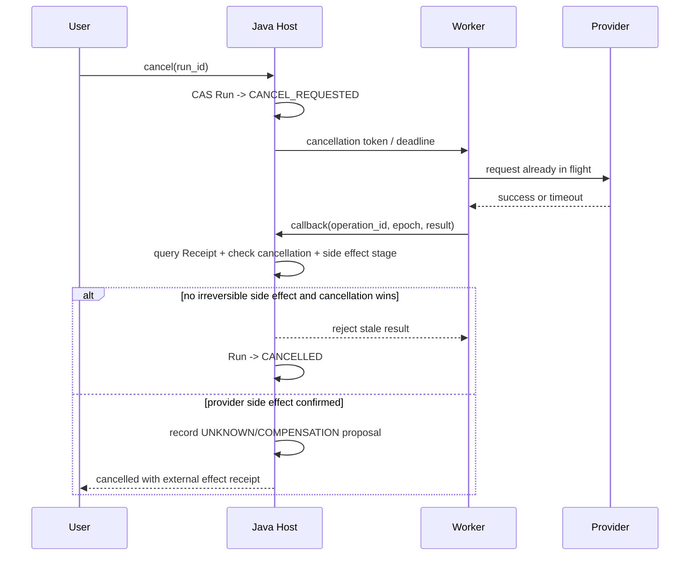

# 09｜面试官终审与事实矩阵

> 本文是面试前的最后一道闸门。它不增加新的业务亮点，只审核五条亮点是否可信、是否能落到运行时、是否能解释个人 Ownership，以及面试官继续追问时是否存在前后矛盾。每个亮点仍以总稿中的 5 分钟详细版为唯一口述版本，本文件只提供审核表和补充边界。

## 1. 统一事实层级

所有回答只能使用下面三种事实标签。没有标签的句子默认不能直接说成“线上已经如此”。

| 标签 | 可以怎么说 | 证据要求 | 不能怎么说 |
|---|---|---|---|
| 当前实现 | “当前代码已经实现……” | 源码、迁移、配置、契约测试可定位 | 不能自动推出生产规模和线上收益 |
| 已测模拟 | “在固定 Fixture、隔离基础设施或故障注入中验证……” | 测试输入、环境、命令、结果和限制 | 不能叫线上事故、真实用户结果 |
| 目标设计 | “如果进入生产，我会演进为……” | 触发条件、迁移顺序、回滚方式 | 不能使用“我们线上已经” |

### 1.1 当前运行能力矩阵

面试前把右侧状态补成自己的最终答案。下面的默认口径基于当前仓库的代码和配置，若实际运行环境不同，以本人重新验证结果为准。

| 能力 | 当前代码/协议 | 面试默认说法 | 需要避免的说法 |
|---|---|---|---|
| Source/Snapshot/ACL | Java + MySQL 领域模型 | 当前实现 | 已经有大规模生产数据 |
| QA Hybrid Retrieval | ES 适配器、BM25/向量/Rerank 契约 | 当前实现或隔离联调，说明 ES 是否启用 | 任意环境都默认可检索 |
| Research Cell CAS | Host 条件更新、Candidate、Evidence Gate | 当前实现，质量和恢复用固定回放/故障注入证明 | 完整多 Agent 已在线并行 |
| Research 角色化执行 | Python 角色合同与执行器 | 受控角色框架，部分并行能力属于目标演进 | 已经是无限扩展的多 Agent 集群 |
| Artifact Schema/Repair | Skill Graph、Schema、局部修复 | 当前实现或隔离回放 | 模型输出天然结构化 |
| Artifact Kafka | 当前 Consumer 会在提交 Offset 前执行任务 | 当前实现仍是长任务 Consumer；快速登记方案是目标演进 | 说成 Consumer 已经只做登记 |
| MCP 音视频能力 | 系统注册 MCP、转写和内容解析路径 | 受控 MCP 能力，说明具体 Provider、输入和回放环境 | MCP Server 都是真实第三方生产服务 |
| Artifact 写回 | Writeback intent、Receipt、模拟 Host callback | 已实现意图、审批和回执协议，真实外部写回按模拟边界回答 | 已完成真实外部系统写回 |
| Redis Quota/Lease | Lua、Permit、短期协调 | 当前实现，MySQL 仍是业务真源 | Redis 保存长期业务事实 |
| Kafka Outbox | Java Outbox、Python Consumer、DLQ | 当前实现，说明当前长任务执行边界 | Kafka 自动保证业务 Exactly Once |
| ES 禁用模式 | `ElasticsearchDisabledConfig` 和 NoOp Adapter | 开发或故障环境可以显式禁用，生产按守卫拒绝不安全 fallback | ES 不可用时仍宣称正常检索 |
| 128 MB | Spring Multipart 配置上限 | 上传配置边界或固定回放输入 | 128 MB 等于吞吐、并发或生产容量 |

## 2. 时间线和项目来源

项目来源、工程重构和简历展示对应三个不同时间范围：

```text
学校原型阶段：更早，解决资料管理和知识问答的实际问题
v2 工程化重构：2026.05 - 2026.08，集中补充状态、异步、检索、Research、Artifact 和治理
简历展示周期：2026.06 - 2026.09，覆盖重构、验证和面试材料沉淀
```

> 这个项目最初来自学校资料管理和知识问答场景，原型阶段早于当前仓库。2026 年 5 月到 8 月我集中做 v2 工程化重构，6 月到 9 月是简历中展示的完整周期，后段补充了评测、故障注入和架构边界的验证。

不要把学校原型已经具备的能力、v2 新增的能力和面试目标设计全部说成同一时间上线。

## 3. 个人 Ownership 边界

### 3.1 核心 Ownership

```text
Java 控制面
  Workspace / ACL / Task / Run / Version / Outbox / Commit

AI 工程核心
  RAG 策略、Evidence、Research Cell、Checkpoint、Lease/Fencing

跨语言契约
  Java Host 与 Python Worker 的 Snapshot、Candidate、Callback、Receipt
```

### 3.2 辅助实现或验收范围

```text
Python Worker 的检索、解析、模型和工具调用细节
Artifact Skill Catalog、Schema Repair、文件 Manifest
前端任务状态、SSE 展示和结果交互
Prompt 细节、固定评测脚本、演示编排
```

回答“你是不是一个人做完全部模块”时：

> 这是个人项目，我对需求取舍、架构边界、核心代码验收、测试设计和最终交付负责。开发过程中使用 AI 工具辅助生成草稿、查资料和审查提示，但 AI 不拥有需求和生产责任。对于前端、Prompt 和第三方 Provider，我会区分自己实现、自己定义契约并验收，以及仅作为目标架构的部分，不把所有第三方能力说成自己从零实现。

## 4. 全局状态机审核表

Task、Run、Attempt、Candidate 和 Version 不能共享同一个完成状态，它们的写入者与重试规则不同：

| 对象 | 核心状态 | 谁能推进 | 是否允许重试 | 与其他对象的关系 |
|---|---|---|---|---|
| Task | ACCEPTED、WAITING、RUNNING、CANCEL_REQUESTED、SUCCEEDED、FAILED、CANCELLED | Java Host | 允许重新申请执行槽，不能重置接纳事实 | 面向用户的生命周期投影 |
| Run | CREATED、EXECUTING、VERIFYING、COMPLETED、ABSTAINED、FAILED | 领域 Host | Attempt 重试不创建新 Run | 表示用户一次稳定意图 |
| Attempt | CLAIMED、RUNNING、UNKNOWN、RECONCILING、TERMINAL | Scheduler/Worker/Host | 可创建新 Attempt | 表示一次执行代际和 Lease Epoch |
| Candidate | RECEIVED、SCHEMA_REJECTED、QUALIFIED、MERGED、REJECTED | Host Validator/Merge | 可重新生成候选 | Worker 提交的建议，不是事实 |
| Artifact Version | RESERVED、DELIVERY_PENDING、READY、DELIVERY_FAILED、ABANDONED | Host | 文件可重物化，READY 不倒退 | 业务交付身份，ID 不复用 |
| File Manifest | PENDING、UPLOADING、READY、FAILED、EXPIRED | Delivery Worker/Host | 同一 Version 下可重试 | 全部必需文件 READY 后 Version 才可见 |
| Projection | BUILDING、CATCHING_UP、EVALUATED、ACTIVE、RETIRED | Projection Publisher | 可重建新 Generation | ES 是派生投影，不是业务真源 |

终态推进必须带 Expected Version、Attempt Epoch 或 Operation ID。不能用“最后一次回调到达”作为统一规则。

## 5. 取消竞态和未知结果

### 5.1 用户取消与 Provider 成功同时发生



取消不能简单等于删除任务。已产生的外部副作用必须保留 Receipt，用户取消只阻止新的提交，不抹掉已经发生的事实。

### 5.2 未知结果的统一规则

| 场景 | 不能直接做什么 | 正确动作 |
|---|---|---|
| Provider 超时 | 直接重试 | 用 Operation ID 查询 Receipt 或 Provider 状态 |
| 文件上传回调丢失 | 再上传一个随机文件 | 按 Staging Key、Checksum 和 Manifest 对账 |
| Kafka Commit 结果未知 | 假设消息未消费 | 依赖持久 Command ID 和业务状态重放吸收重复 |
| ES Alias 切换结果未知 | 再切一次 | 读取真实 Alias 指向，按 Operation ID 收敛 |
| Worker 回调晚到 | 最后写入获胜 | 校验 Epoch、Fencing、Expected Version 和终态 |

## 6. Artifact Kafka 当前实现与推荐演进

这是目前最需要在面试中主动解释的一处差异。

### 当前实现

当前 Artifact Consumer 的处理顺序是：

```text
消费 Kafka Message
  → 解析和校验 Command
  → 调用 Artifact Executor
  → Callback 或失败处理
  → Commit Offset
```

因此它通过 `max_poll_interval` 覆盖长任务和 MCP 超时时间，当前设计仍然让 Consumer Session 参与长任务执行。

### 推荐演进

```text
消费 Kafka Command
  → Schema 校验
  → MySQL 幂等登记 Durable Execution
  → Commit Offset
  → Scheduler 申请 Active Permit
  → Worker Lease/Fencing 执行
  → Candidate/Delivery Callback
  → Host Commit
```

### 面试回答

> 当前版本为了在单 Worker 场景下保持实现闭环，Artifact Consumer 仍然执行长任务，并把 `max_poll_interval` 配置到覆盖 MCP 超时。这个方案能工作，但会把 Kafka Consumer Session 和业务执行时间绑定，长任务会放大 Rebalance 风险。推荐演进是 Consumer 只登记 Durable Execution，长任务交给 Scheduler 和 Domain Execution Lease。这样需要增加 Reconciler 和执行调度，但能把消息接纳、资源占用和业务提交权拆开。

这比直接宣称“当前已经是快速 ACK 架构”更可信。

## 7. Provider、MCP 和外部副作用审核表

| 依赖 | 超时 | 可重试错误 | 不可重试错误 | 降级 | 成本/隐私问题 |
|---|---|---|---|---|---|
| LLM | 请求 deadline、输出 Token 上限 | 429、暂时网络错误 | Schema/权限/输入非法 | 降级模型或拒答 | Prompt、Token、模型版本 |
| Embedding | 批次 deadline | Provider 暂时错误 | 维度不匹配、文本超限 | 暂缓索引，不生成错误向量 | 向量维度、模型迁移成本 |
| Rerank | 候选预算和 P95 deadline | 429、超时 | 参数非法 | 使用已融合候选并标记 DEGRADED | 延迟、调用费用 |
| 网页/MCP | 网络 deadline、响应大小 | 连接失败、限流 | SSRF、路径穿越、越权 | 使用已有 Evidence 或 ABSTAIN | 外部内容注入、数据出境 |
| MinIO | 分片和上传 deadline | 分片重试 | 校验失败、路径非法 | Delivery Failed，保留 Manifest | 孤儿对象、临时文件 |
| ES | Bulk/查询 deadline | 节点暂时不可用 | Mapping/维度错误 | 延迟 Projection Ready | Refresh、Merge、索引代次 |

所有外部调用至少记录 `operation_id`、参数 Digest、Provider Version、Attempt、耗时、结果类别和成本估算。MCP 协议只解决能力发现和调用格式，不自动授予模型工具权限。

## 8. 128 MB 和容量口径

### 8.1 128 MB 的准确表述

可以说：

> 当前 Spring Multipart 配置允许单个请求最大 128 MB，固定回放验证了大文件可以进入异步资料处理链路。这个数字是接入边界，不代表吞吐、并发或生产容量。

不能说：

- 支持 128 MB 高并发上传。
- 128 MB 文件可以稳定在某个秒数内完成。
- 系统具备某个 QPS 或日处理量。

### 8.2 面试前应补的 Manifest

```yaml
experiment_id: source-128mb-replay-v1
input: file hash / mime / page count / text size
environment: cpu / memory / parser / embedding / es version
concurrency: 1
stages: upload, parse, chunk, embedding, index
metrics: ready_latency_p50, ready_latency_p95, peak_rss, retries, dead_letters
failure_injection: parser_exit, provider_429, es_timeout, callback_loss
result: pass/fail with artifact path
limitation: single-node, no production traffic
```

### 8.3 容量回答

> 我不会从线程池大小直接推算 QPS。资料链路按 Parser、Embedding、Indexer 分阶段测稳态吞吐，长任务还受 Provider 速率和 Workspace Active Permit 限制。容量计算用到达率乘平均处理时间推导平均并发，再用阶梯压测观察 P95、P99、内存、连接池和队列年龄。十倍流量先找最小瓶颈，而不是统一增加 Worker。

## 9. 安全、备份、删除和恢复

### 9.1 请求到 Worker 回调的安全链路

```text
认证上下文
  → Actor / Workspace / Role
  → Host 构造 Scope，不信任请求中的 workspace_id
  → Snapshot/Task 绑定 Workspace 和 Scope Epoch
  → Worker 只接收冻结输入和短期 Capability
  → Callback 使用独立内部 Token、签名/摘要、Attempt Epoch
  → Host 再校验 ACL、Policy、Approval、Expected Version
```

### 9.2 删除语义

删除分两层：

1. 在线不可见：Tombstone 先提交，查询、检索、Memory 编译和新任务立即排除。
2. 物理清理：ES、Redis、Summary、Memory Candidate、Artifact 引用、MinIO 临时对象和反链按清理任务删除并产生 Receipt。

已删除内容是否保留在备份中，要按保留策略回答，不能把“数据库行删除”说成“所有副本立刻消失”。

### 9.3 备份与 RTO/RPO

面试中明确当前边界：

```text
MySQL：业务真源，需要备份和时间点恢复
MinIO：原始对象和交付文件，需要版本/校验/孤儿清理
ES：可重建投影，不作为唯一恢复来源
Kafka：事件保留与重放窗口，不能替代 MySQL 备份
Redis：可重建协调面，不能承担恢复真相
```

如果没有正式生产备份演练，不填写具体 RTO/RPO 数字，改说“已定义恢复顺序和需要补的演练”。

## 10. 产品结果与真实用户边界

如果没有可以公开核验的真实用户数、课程数、留存或线上成本，不使用“用户显著增长”“大幅提升效率”“生产稳定运行”等表述。当前可以报告的证据是代码、配置、契约测试、真实基础设施联调、固定回放和故障注入。

> 项目有学校资料服务的场景来源，但当前没有可以对外宣称的生产用户规模和长期线上 SLO。我没有用 Fixture 冒充用户数据，而是把当前证据分成代码实现、固定评测和故障演练。真正上线后，我会优先采集 Workspace 激活、Time to First Value、有效回答采纳、教师纠错、每个成功结果成本和删除传播延迟。

产品上还要准备一个“做了但不值得继续加码”的判断：如果教师维护资料的成本没有下降，或者大量回答仍需要人工重写，继续增加 Agent 角色不会解决核心问题，应先改善资料接入、引用可读性和纠错闭环。

## 11. 面试官高概率 12 问及统一答案

### 1. 你说的多 Agent 当前真的并行运行了吗？

当前回答应区分角色化合同、顺序执行和未来并行。Research 的核心状态、Candidate、Evidence、Verifier 和恢复协议已经具备；部分角色并行是受控实验或目标演进，不说成生产级多 Agent 集群。并发真正来自无依赖 WorkItem 和资源预算，而不是角色数量。

### 2. Artifact Kafka Consumer 为什么把 `max_poll_interval` 配到很大？

因为当前 Consumer 仍在消费线程里执行长任务，配置需要覆盖 MCP 超时。它是当前实现的结构性限制，不是最终推荐方案。后续迁移为快速登记 Durable Execution，再由 Scheduler/Lease 执行。

### 3. 128 MB 是什么指标？

是 Multipart 接入配置边界和固定回放输入，不是吞吐或并发指标。真正容量要看文件类型、页数、内存、阶段耗时、Provider 限流和队列年龄。

### 4. 哪个数字可以现场拿出原始数据？

只能回答已经存在 Manifest、脚本和结果文件的数字；没有原始数据就回答指标定义和验证方法，不现场编造百分比。每个数字必须能给评测集、分母、基线、版本和失败样本。

### 5. 你一个人具体负责哪些模块？

核心是 Java 控制面、任务/版本模型、RAG、Research 状态和 Host/Worker 契约。Python 运行细节、前端和 Prompt 按实现或验收边界说明，第三方组件能力不算本人从零实现。

### 6. MCP 的真实调用对象是什么？

MCP 调用对象由注册的 Server、Tool Schema、输入、输出和回放环境共同限定。只有系统注册的能力才能进入 Capability Policy，工具输出仍是不可信内容；模拟 Provider 或本地协议不等于真实第三方生产写回。

### 7. ES 被禁用时 QA 和 Note 还能不能工作？

需要按环境回答。ES 禁用时适配器应显式失败或进入受控降级，不能把空结果当成“没有资料”。开发环境可以使用 fallback，生产配置守卫应拒绝不安全 fallback。

### 8. Worker 执行成功、Callback 成功、业务成功有什么区别？

Worker 执行成功只说明执行面有结果；Callback 成功只说明 Host 收到消息；业务成功还需要 Schema、权限、Evidence、版本、文件 Manifest 和外部副作用都满足提交合同。

### 9. 用户取消和 Provider 成功同时发生谁赢？

看副作用阶段。没有不可逆副作用时，取消可以阻止结果提交；如果 Provider 或文件已经成功，则记录 Receipt 和 UNKNOWN/COMPENSATION，取消不能抹掉已发生事实。

### 10. 删除资料后摘要、Memory、ES 和 Artifact 引用怎么办？

Tombstone 先阻断新读取，再按 Provenance 扩散 Stale/Revoked，重建 Summary 和 Memory Candidate，清理 ES、缓存、对象和反链。在线不可见和物理清理分开统计。

### 11. 如果只有 10 个用户，为什么不用同步方案？

学校 MVP 可以同步或数据库轮询，Kafka 和更复杂的协调机制不是前置条件。只有当大文件、长任务中断、跨存储最终一致、重放或多消费者成为真实约束时，才引入当前复杂度。

### 12. 哪个设计后来被你否定了？

可以回答：曾把 Kafka Consumer 长任务执行和业务完成绑在一起，后来认识到 Consumer Session、资源 Permit、Domain Lease 和业务提交权生命周期不同，因此把快速登记 Durable Execution 作为演进方向。承认当前实现的限制，再给出迁移和回滚，比声称一开始就设计完美更可信。

## 12. 五条亮点共享的工程边界

> 我把资料接入、检索、研究、产物和 Memory 看作同一条资料链路的不同阶段。Source Snapshot 固定资料版本，Java Host 保存 Workspace 权限、任务状态和最终提交权；Kafka 传递异步意图，Python Worker 执行研究与产物长任务，只返回候选。QA 的结果要有可见证据支撑，Research 的必填 Cell 要通过验证或保留明确缺口，Artifact 要在 Schema 与必需文件验收后才能交付。Memory 只补充偏好和长期约束，不能代替 Source Evidence。重复消息、旧 Worker 晚到和外部结果不明时，通过幂等、Fencing、Version 条件更新与 Receipt 对账恢复。当前有固定回放和故障注入证据，但缺少可公开宣称的生产用户规模与长期 SLO；独立调度和真实第三方写回仍要与现有实现区分。

每条亮点的完整 5 分钟回答和跨模块案例见 [面试总稿](NoteWeave面试总稿-STAR重构版-2026.06-2026.09.md)。

## 13. 终审签字表

面试前逐项确认：

- [ ] 时间线已经统一为学校原型、v2 重构和简历展示周期三层。
- [ ] 每个百分比都有 Manifest、分母、基线和失败样本；没有就删掉数字。
- [ ] 已区分当前实现、已测模拟和目标设计。
- [ ] 已准备 Artifact Kafka Consumer 当前实现与推荐演进的回答。
- [ ] 已明确 Research 多 Agent、MCP 和外部写回的真实边界。
- [ ] 已确定个人核心 Ownership 和辅助验收范围。
- [ ] 已能画出 Task、Run、Attempt、Version、Manifest 的关系。
- [ ] 已准备取消竞态和未知结果的回答。
- [ ] 已准备 128 MB 的配置边界和容量 Manifest。
- [ ] 已准备安全、删除、备份、RTO/RPO 的保守口径。
- [ ] 已明确真实用户、线上数据和长期 SLO 的缺失边界，不用 Fixture 冒充业务成绩。
- [ ] 五条亮点都能在 5 分钟内讲完，并能继续落到知识下钻库。

隐私扫描：本文不包含个人联系方式、薪资、公司机密或真实用户身份信息。
