# NoteWeave 面试总稿

**项目：** NoteWeave｜AI 资料研究工作台  
**时间：** 2026.06 - 2026.09  
**定位：** 面向个人资料研究与长期知识沉淀的 AI 工作台

这份文件是面试主入口。每个章节都按至少 5 分钟的口述长度准备，建议先背每章开头的主回答，再根据面试官的追问展开数据模型、状态机、失败窗口和 Trade-off。分册文件保留作为查阅索引，不需要在面试前逐篇重复阅读。

---

## 0. 30 秒开场和项目总览

我做的是一个面向个人资料研究和长期知识沉淀的 AI 工作台。用户可以把 PDF、网页、录音和视频等资料接入系统，然后进行带引用问答、资料精读、Wiki 沉淀、Deep Research，以及报告、测验、课程笔记等结构化产物生成。

这个项目真正要解决的不是“怎样调用大模型”，而是资料型 AI 产品落地后会遇到的几个工程问题。资料会不断更新，搜索索引不能反过来当事实；长任务可能运行很久，中途会超时、断线或 Worker 重启；模型输出不稳定，不能直接写入知识库或生成最终文件；用户偏好和历史摘要还可能污染后续事实判断。

所以我把系统拆成控制面和执行面。Java Spring Boot 主服务负责 Workspace、权限、资料版本、任务状态、配额和最终提交。Python Worker 负责解析、检索、模型调用、MCP 工具和 Agent 长任务。MySQL 保存业务真源，MinIO 保存原文件，Elasticsearch 保存可重建检索投影，Kafka 负责异步解耦和削峰，Redis 负责短期协调、限流和租约。

项目的五条主线分别对应五类系统设计问题：Deep Research 解决开放研究的可验证和可恢复，QA / Note / Wiki 解决不同任务的检索和写回语义，异步资料底座解决大文件和最终一致性，Schema 驱动产物解决 Agent 的结构与权限控制，Context / Memory 解决长会话压缩和长期记忆污染。面试时我会先讲整体架构，再选择其中一条深入到数据模型和失败恢复。

---

## 1. 系统总架构：至少 5 分钟主回答

### 1.1 业务问题和架构目标

NoteWeave 的资料不是一次性上传后就结束。用户可能先上传一版课程大纲，后面又上传修订版；用户问的是“这门课的实验和考核有什么差异”，答案必须能回到具体 Snapshot；用户还可能要求系统做一个跨多份资料的研究，研究过程会触发搜索、阅读、抽取、验证和生成，时间明显超过一个 HTTP 请求。

因此架构目标不是单纯追求低延迟，而是同时满足四个约束：第一，事实可以追溯到某个不可变资料版本；第二，长任务可以恢复，并且旧 Worker 不能在恢复后覆盖新结果；第三，模型只能产出候选，不能绕过权限和 Schema 直接写入权威状态；第四，系统能区分“没有资料”“资料没有证据”“任务失败”和“结果还未知”。

### 1.2 控制面和执行面

Java Host 是控制面。它维护 Workspace、用户和权限，接收上传和任务请求，创建 Source、Snapshot、Run、Task、ArtifactVersion，保存状态变化，并负责最后的版本提交。Host 不负责模型推理，但负责决定 Worker 看哪些资料、能调用哪些能力、结果是否满足提交条件。

Python Worker 是执行面。它适合承载 PDF 解析、Embedding、Prompt、Agent 策略和 MCP SDK。Worker 拿到 Host 冻结的输入后执行，可能返回检索候选、Evidence、研究 Cell Candidate、产物章节或进度事件。Worker 不直接写 Source、Wiki Head 或 Artifact Version，而是回调 Host，由 Host 校验版本、租约、权限和 Schema 后提交。

这样拆分的核心不是语言偏好，而是稳定业务边界和快速变化的模型策略分离。模型策略可能一周内调整多次，但 Workspace 权限、版本提交和幂等语义不能跟着 Prompt 一起漂移。代价是跨语言协议、任务回调和部署复杂度增加，但它换来了更清晰的 Ownership 和恢复边界。

### 1.2.1 总体架构图

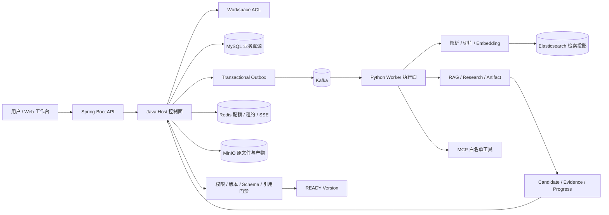

这张图用于回答“系统怎么分层”。口述顺序是从左到右：用户进入 API，Host 先做权限和状态，业务事实进入 MySQL，异步意图通过 Outbox 和 Kafka 到 Worker，Worker 只产生候选，最后由 Host 做门禁和版本提交。面试官继续追问时，再解释 ES 是投影、Redis 不是事实库、MinIO 不保存业务状态。

### 1.3 存储和消息组件的分工

MySQL 是业务真源，保存 Source、Snapshot、ACL、Run、Task、Cell、PageVersion、MemoryRevision 和 ArtifactVersion。它负责回答当前事实是什么、哪个版本可见、任务现在处于什么状态。Redis 不保存这些业务事实，Redis 只做令牌桶、并发租约、短期缓存和 SSE 桥接，Redis 丢失后应能从 MySQL 恢复。

MinIO 保存原始 PDF、音视频和生成后的文件。原文件不适合放入 MySQL BLOB，业务库只保存 ObjectRef、校验和、大小、媒体类型和生命周期。Elasticsearch 保存词法字段、向量、页码、章节和权限元数据，是检索投影，不是权限真源。任何 ES 命中在生成引用前都要回 MySQL 校验 Workspace、Source、Snapshot 和删除状态。

Kafka 传递解析、切片、Embedding、索引和长任务命令。它提供削峰、重放和消费解耦，但只提供至少一次语义，不能被描述成 exactly-once。业务变更和 Outbox Event 在 MySQL 同一事务中写入，Dispatcher 再投递 Kafka，Consumer 通过稳定幂等键避免重复副作用。

### 1.4 一次请求的完整链路

资料接入时，API 先创建 Upload Session，检查 Workspace、类型和大小。文件写入 MinIO 后，Host 在 MySQL 同一事务中创建 Source、不可变 Snapshot、初始处理状态和 Outbox Event。HTTP 请求到这里就可以结束，后续解析、切片、向量化和索引由 Kafka 任务异步执行。用户查询的是 Snapshot 状态，不是直接去 ES 猜测资料是否可用。

交互请求进入 Workspace 后，根据 `answer_mode` 选择 QA、Note 或 Wiki。QA 走混合召回、重排和 Evidence Selection；Note 先找资料再展开连续阅读窗口；Wiki 读取当前 PageHead 和来源回链。长任务根据 Research 类型或 `skill_key` 创建 Run 和 Task，冻结输入资料、记忆版本和策略版本后交给 Worker。

Worker 执行过程中写入 Progress、Checkpoint 和外部调用 Receipt。Host 收到回调时检查任务是否仍属于当前 Lease，检查 Fencing Token、Snapshot 摘要、Cell 或节点版本是否匹配。只有所有必填字段、引用、Schema、文件 Manifest 和权限门禁通过，结果才提升为 READY 或用户可见版本。

### 1.4.1 请求时序图

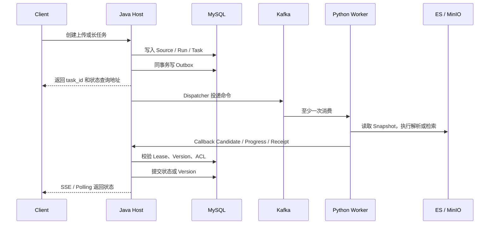

关键知识点是：HTTP 返回和业务完成不是同一个时刻；Kafka ACK 和业务终态不是同一个确认；Callback 成功和 Artifact 可下载也不是同一个状态。把这些确认点拆开，才能解释超时、重复、断线和未知结果。

### 1.5 跨模块统一设计原则

第一是真源与投影分离。MySQL 的 Snapshot 是事实，ES、缓存、Wiki 反链和搜索结果都是投影。投影可以重建，不能反向修改事实。

第二是控制面与执行面分离。Worker 可能重复、晚到、超时或被攻击，因此只能提交候选，不能自行决定版本、权限和长期记忆。

第三是输入冻结、输出门禁。Research 和 Artifact 都在启动时生成 InputSnapshot，重试时不重新读取不断变化的上下文；结果必须经过 Verifier、引用检查或 Schema 校验，生成了一段文本不代表业务成功。

第四是至少一次加幂等。Kafka、HTTP 和 Provider 的重试都是正常输入，业务操作必须带 Idempotency Key、Operation ID、Receipt 或 CAS。遇到 Provider 超时，先判断是否已经产生副作用，不能把未知结果直接当失败重放。

第五是正确失败优先。证据不足时返回拒答或 `NO_SUPPORTED_CANDIDATE`，结构不完整时进入 Repair 或 NEEDS_REVIEW，不能为了提高完成率放宽引用和权限门槛。

### 1.6 总体 Trade-off

如果是短文本、秒级请求，同步 HTTP 和单体内调用更简单；但 NoteWeave 有大文件、长任务和多阶段处理，继续同步会占住请求线程并且难以恢复，所以选择 Kafka 和状态机。ES 能同时支持 BM25、过滤和向量，适合资料中有大量课程号和专名的场景；代价是索引代次、重建和发布治理更复杂。当前规模用 MySQL + Outbox 比完整事件溯源更容易查询和维护，只有审计重放成为主要查询方式时才考虑升级。

---

## 2. 亮点一：Deep Research Agent，至少 5 分钟主回答

### 2.1 问题背景

开放研究最容易被误做成一次长 Prompt。用户说“比较几门课程的学时、实验、考核和适合人群”，模型可能先搜索一堆资料，再凭记忆写出完整报告。表面上文章很长，实际上不知道哪些字段被验证过、哪些结论没有引用、哪些搜索已经产生外部费用。进程中断后如果重新喂一遍聊天记录，又会重复调用搜索，甚至因为网页变化得到不同结果。

我把这个问题定义成“证据生产线”，而不是“自动写文章”。系统先把开放问题编译成一张有界研究表，先完成可验证的数据单元，再组织成报告。这样研究质量可以按 Cell 和 Evidence 衡量，恢复也只需要重跑缺口。

### 2.1.1 Deep Research 全流程图

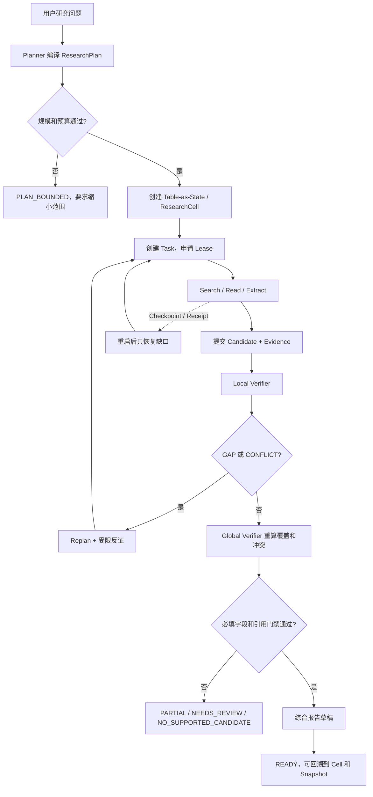

### 2.1.2 研究状态图

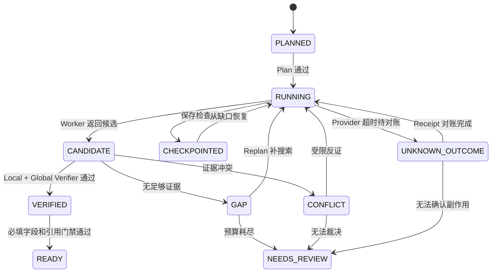

### 2.2 Table-as-State 数据模型

ResearchRun 包含 `run_id`、Workspace、输入快照、计划版本、预算、截止时间和状态。Run 下面是多个 ResearchCell，每个 Cell 由 `entity_key` 和 `field_key` 定位，例如实体是课程 A，字段是考试形式。Cell 还保存字段类型、是否必填、风险等级、候选列表、Evidence 引用、状态、版本和最后一次 Checkpoint。

Cell 状态可以是 TODO、SEARCHING、CANDIDATE、VERIFIED、GAP、CONFLICT。它是最小恢复单元，比整个 Run 更细，因此一个字段失败不会导致整份报告重新生成；又比一个搜索结果更有业务意义，可以聚合多个来源对同一个字段的支持和冲突。

Planner 不写最终答案，只输出 ResearchPlan。Plan 说明实体类型、必填字段、字段类型、最大 Cell 数、搜索预算、验证等级和停止条件。Host 校验计划规模，超过上限返回 `PLAN_BOUNDED`，要求缩小范围，不允许模型偷偷删掉必填字段换取完成率。

### 2.3 执行链路

计划通过后，Host 为待处理 Cell 创建 Task 和 Outbox。Worker 领取 Task 时拿到 Lease 和递增 Fencing Token，并读取 RunInputSnapshot 指定的资料版本。它可以搜索、阅读、抽取和整理，但只能返回 Candidate。Candidate 包含 claim、Evidence 引用、原文 quote、定位、置信度和观察记录，不直接改变 Cell 的最终结论。

Host 写回 Candidate 时校验五组信息：任务和 Workspace 是否匹配，Lease Epoch 是否仍有效，Fencing Token 是否是当前持有者，输入 Snapshot 摘要是否一致，Cell 的期望版本是否没有被其他执行者更新。任意一个不匹配，说明 Worker 已经过期或状态发生变化，直接拒写。

Local Verifier 针对单个 Cell 检查证据是否属于同一实体和字段，引用是否真的覆盖 Claim，数字、年份和单位是否符合字段类型，来源是否仍然可见。Global Verifier 根据所有 Cell 重新计算必填字段覆盖、实体间冲突和整体一致性，不直接相信 Local Verifier 的结论。

### 2.4 Replan 与受限反证

Replan 只接受结构化的 GAP、CONFLICT 或低覆盖结果。对于缺口，它可以补充搜索任务；对于冲突，它可以生成有限的反证目标，比如寻找否定证据、替代来源和不同版本。Replan 不能把“必须引用课程大纲”改成“找到任何相关网页即可”，也不能无限增加预算。

受限反证是一个有边界的纠偏机制。系统限制查询族、尝试次数、Token 和 Provider 预算，并要求结果回写到原 Cell 的支持集或冲突集。预算耗尽后仍无支持证据，状态进入 GAP、NEEDS_REVIEW 或 `NO_SUPPORTED_CANDIDATE`，而不是继续自我反思。

### 2.5 Checkpoint、Receipt 与恢复

Checkpoint 保存 Plan 版本、Cell 状态、Evidence、预算消耗、外部调用 Receipt 和事件高水位。Run 重启时先读取最近 Checkpoint，再扫描 TODO、GAP 和 SEARCHING 超时的 Cell。已经有成功 Receipt 的搜索操作可以复用，不重复付费调用。只为缺口建立新 Task，已经 VERIFIED 的 Cell 不重新执行。

Lease 解决谁在执行，Fencing 解决旧 Worker 能不能写回。Worker 可能在 Lease 过期后恢复，旧回调仍然带着旧 Token。Host 用条件更新拒绝旧 Token，因此不会出现旧 Worker 覆盖新 Cell 的问题。

Provider 超时是未知结果，不是天然失败。系统根据 Operation ID 查询外部结果或 Receipt，确认成功就复用，确认失败才重试，查不到时进入 UNKNOWN_OUTCOME，由对账任务处理。这样既避免重复费用，也避免把已成功的外部调用误判为失败。

### 2.6 综合和完成门禁

综合器只负责把已经验证的 Cell 组织成报告草稿。每个 Claim 都必须绑定 Evidence 集合，引用不能由模型在最后一步随意生成。Host 做最终门禁：必填字段是否覆盖，引用是否支撑，是否发生 Scope Violation，冲突是否处理，输出格式是否通过。如果任何硬门禁失败，Run 不进入 READY，而是返回 PARTIAL、NEEDS_REVIEW 或失败原因。

### 2.7 为什么不用其他方案

自由 ReAct 灵活，但状态藏在轨迹中，难以做字段级完成和恢复；固定 Workflow 容易测试，但开放研究的搜索路径和冲突处理不固定。Table-as-State 取中间路线，允许模型在 Cell 内探索，但把范围、预算、状态和写回收进程序。

多个 Agent 投票不能证明引用绑定正确，可能只是多个模型重复同一个错误。Local + Global Verifier 更适合把正确性拆成字段级和全局级规则。完整事件溯源可以重放一切，但当前主要查询是当前 Head、当前 Cell 和当前版本，MySQL 状态加 Checkpoint 更直接。跨天 Timer 和人工审批成为主路径后，再评估 Temporal 等工作流引擎。

### 2.7.1 这一条亮点涉及的知识点

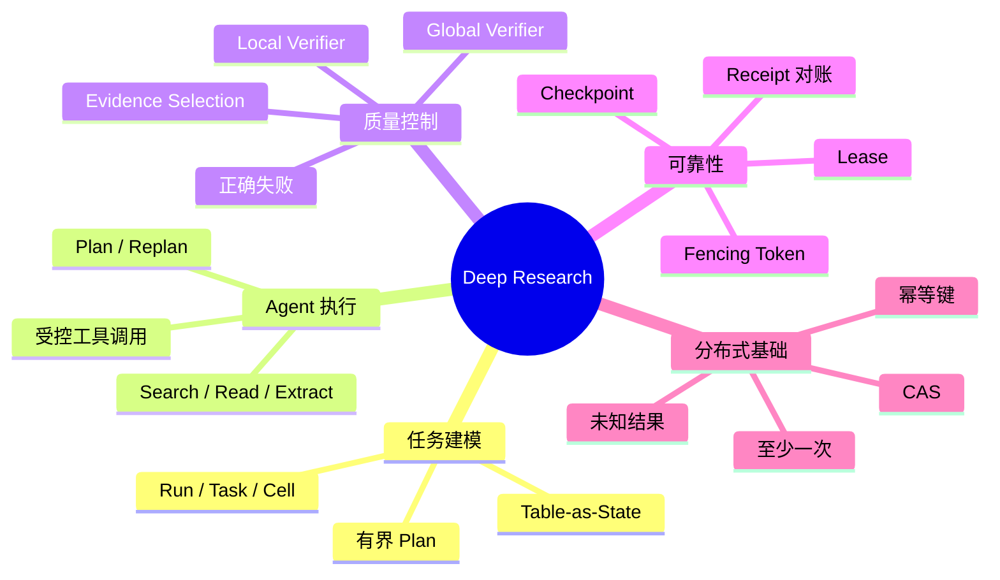

### 2.8 高频追问

**问：Research 和普通聊天 Agent 的边界是什么？**  
普通聊天关注一次回答的连贯性，允许短期上下文和局部失败。Research 需要逐项证据、预算、长任务恢复和审计，所以必须有 Run、Cell、Checkpoint、Lease 和完成门禁。

**问：如何防止研究范围漂移？**  
用 Plan 预先定义实体、字段和最大规模，Replan 只能处理缺口和冲突，不能修改问题目标。超过规模直接让用户缩小范围。

**问：引用支撑率和完成率冲突怎么办？**  
正确失败优先。证据不足就标记 GAP 或 NO_SUPPORTED_CANDIDATE，不用无关网页补齐，也不把低置信度内容伪装成已验证结论。

---

## 3. 亮点二：QA / Note / Wiki，至少 5 分钟主回答

### 3.1 为什么不能只做一套 RAG

QA、Note 和 Wiki 看起来都需要检索，但它们对“相关”的定义不同。QA 要回答一个问题，重点是少量高支撑证据和正确拒答；Note 要理解一份资料，重点是连续原文和可审阅草稿；Wiki 要维护长期知识，重点是页面版本、关系和来源回链。如果只做向量 TopK 加一个大 Prompt，QA 的重复片段会挤满 Note，Wiki 的旧页面又可能被当成实时事实。

因此三条链路共享 Source、Snapshot、Workspace ACL 和 Evidence 契约，但各自定义检索单元、上下文组织方式和写回语义。共享底层能力避免重复建设，分开 Adapter 避免任务目标互相污染。

### 3.1.1 三条知识链路总图

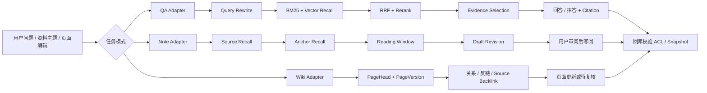

三条链路的共同安全出口是 ACL 和 Snapshot 校验，区别在于中间的检索单元和最终写回。画图时不要只画“输入到 LLM”，要把 Evidence 和版本校验画出来，这是面试官判断项目是否工程化的关键。

### 3.2 统一检索合同和安全边界

RetrievalRequest 包含 Workspace、Actor、资料范围、模式、原始 Query、会话截止点、Snapshot 策略和 Token 预算。RetrievalResult 包含候选、选中 Evidence、来源 Snapshot、检索 Trace 和降级原因。所有召回都带 `workspace_id + source_id + snapshot_id`。

ES 命中只说明“可能相关”，不说明“可以引用”。生成前要回 MySQL 校验 Source 归属、Snapshot 是否仍可见、是否被删除以及当前 Head 是否变化。这样即使 ES 索引延迟或缓存里残留旧数据，也不能绕过权限。Scope Violation 是硬门槛，宁可少返回证据，也不能靠 Prompt 让模型自己判断权限。

### 3.3 QA 的具体链路

第一步是 Query Understanding。多轮问题里“第二个呢”“它和上一版有什么区别”需要补齐代词、对象和时间。系统保留原问题，Query Rewrite 只生成结构化检索约束。低置信度时可以同时跑原 Query 和 Rewrite Query，如果结果冲突则追问，不让改写静默改变用户意图。

第二步是 Scope Filter，先按 Workspace、资料类型、当前版本和用户授权过滤。第三步是 BM25 和 Vector 双路召回。BM25 对课程号、专名、章节号、百分比和精确短语更稳定，Vector 对同义表达和自然语言描述更有优势。

第四步用 Weighted RRF 融合两路排名。不同召回器的分数不在同一个空间，直接相加需要大量归一化和调参，RRF 只依赖名次，能减少分数尺度不一致。第五步对有限候选做 Cross-Encoder Rerank，承担更精细的语义匹配。第六步是 Evidence Selection，它不是再次排序，而是从候选集合中选择能共同覆盖 Claim 的证据，去掉重复片段并保留冲突。

回答器只接受 Evidence Bundle，输出 Claim、Citation 和 Uncertainty。证据不足、互相冲突或版本失效时返回澄清、拒答或“当前资料无法证明”，不凭模型常识补齐。这样 QA 的成功不是“生成了一段话”，而是 Claim 被可见资料支持。

### 3.4 Note 的具体链路

Note 面向资料精读。第一阶段做 Source Recall，判断哪些资料与主题有关；第二阶段做 Anchor Recall，定位章节、页码或段落锚点；第三阶段以 Anchor 为中心扩展 Reading Window，保留定义、例子、限定条件和相邻解释；第四阶段生成 Draft Revision，保留原文定位和待确认项；用户确认后才写回 Note 版本。

如果直接把 Chunk TopK 交给模型，片段之间可能不连续，结论看似正确但丢掉前提。资料级召回加连续窗口更接近人类阅读。窗口大小由段落边界、资料结构和 Token Budget 共同决定，超预算时优先减少远处窗口和重复内容，不静默删除 Anchor 周围的关键原文。

### 3.5 Wiki 的具体链路

Wiki 页面采用不可变 PageVersion 和指向当前版本的 PageHead。每次编辑或生成都会创建新版本，不在原页面正文上覆盖。关系表维护页面链接、反链和有限关系扩展，Source Backlink 记录段落或结论对应的 Source Snapshot。

Wiki 读取当前 Head 和受限关系，不自动回退成普通 QA。没有页面表示知识还没有被沉淀，资料没有答案表示检索无法证明，两者语义不同。资料更新后，系统可以根据来源回链标记页面待复核，而不是静默覆盖用户编辑。关系图用于导航和局部扩展，不把当前设计包装成全量 GraphRAG。

### 3.5.1 QA 检索漏斗图

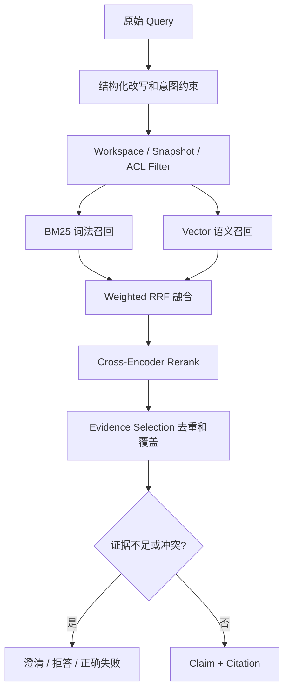

### 3.5.2 知识点地图

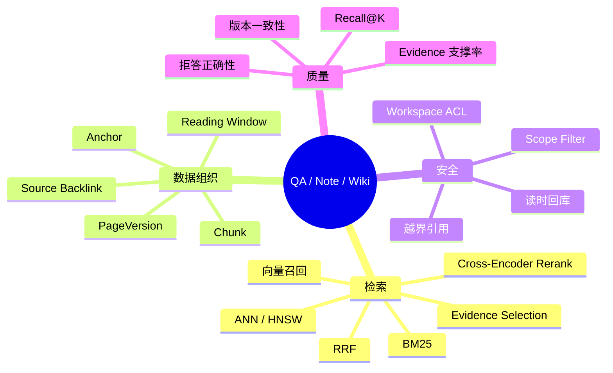

### 3.6 关键取舍

BM25 + Vector 比单路向量多维护一套索引，但能同时覆盖专名和自然语言。RRF 比分数相加少做归一化，但不能表达绝对置信度，因此后面仍需要 Rerank 和 Evidence Selection。先精排再做集合选择增加延迟，却能避免多个相邻片段重复占满上下文。PageVersion 增加版本和关系管理成本，却支持审计、回滚和来源追踪。共享契约加场景 Adapter 比完全复制三套系统复杂一点，但能保持安全和版本规则一致。

### 3.7 高频追问

**问：Rerank 后为什么还要 Evidence Selection？**  
Rerank 判断单段与问题的相关性，不能保证多段合起来覆盖所有字段。Selection 负责集合覆盖、去重和冲突保留，最终形成可引用证据集。

**问：为什么不用专用向量库？**  
当前资料包含大量课程号、专名和权限过滤，ES 已经能提供 BM25、过滤和向量能力。向量规模或向量 P95 成为主要瓶颈后，再拆独立向量库，避免先引入双写和额外一致性成本。

**问：一个 Wiki 页面和最新资料冲突怎么办？**  
页面和资料是两个版本化对象。资料更新会通过来源回链把页面标记为待复核，QA 使用当前可见 Snapshot，Wiki 不自动覆盖人工页面，直到用户确认新的 PageVersion。

---

## 4. 亮点三：异步资料底座，至少 5 分钟主回答

### 4.1 问题和总体方案

资料处理链路至少包含上传、解析、切片、Embedding 和索引。大 PDF 或音视频如果在同步请求里串行执行，会占住请求线程，超时后用户也不知道处理进行到了哪一步。业务库和 ES 也无法做原子更新，可能出现数据库显示资料可用但搜索不到，或者旧索引继续暴露已删除内容。

我的方案是把原文件、业务状态和检索投影分开。MinIO 保存对象字节，MySQL 保存 Source、Snapshot 和处理状态，Kafka 承载阶段任务，ES 保存可重建投影。HTTP 只处理上传意图和状态查询，耗时阶段全部异步化。`128 MB` 是单文件接入边界，不能理解成同步接口能处理 128 MB。

### 4.1.1 资料接入全流程图

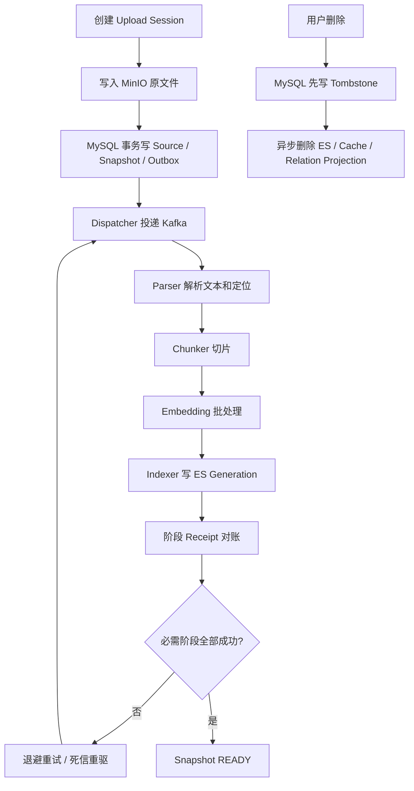

### 4.1.2 资料状态图

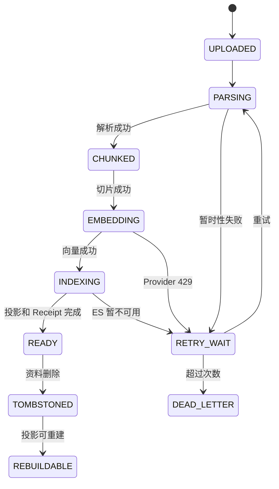

### 4.2 领域对象和状态机

Source 表示资料身份，不随着文件覆盖。每次上传或修订创建不可变 Snapshot，Snapshot 记录 ObjectRef、校验和、解析器版本、切片版本、Embedding 模型版本和 Index Generation。处理状态拆成 UPLOADED、PARSING、CHUNKED、EMBEDDING、INDEXING、READY、RETRY_WAIT 和 DEAD_LETTER。

`READY` 只表示这个 Snapshot 的必需阶段已经完成，文件上传成功不等于可检索。每次状态变更都携带 Snapshot ID、Generation 和 Version。旧任务晚到时，如果携带的 Generation 不是当前版本，不能把旧结果写成当前状态。

### 4.3 正常流程

API 创建 Upload Session，校验 Workspace、大小、媒体类型和幂等键。文件写入 MinIO 后，Host 在 MySQL 一个事务中写 Source、Snapshot、初始状态和 Outbox Event。Dispatcher 发布 `SOURCE_SNAPSHOT_CREATED`，Parser Consumer 从 MinIO 读取固定 Snapshot，生成带页码、章节和定位的结构化文本。

Chunker 生成带 Snapshot ID 和 chunk version 的切片。Embedding 阶段批量向 Provider 请求向量，并保存模型版本和 Receipt。Indexer 将词法字段、向量、页码、权限元数据和 Generation 写入 ES。所有必需阶段成功后，Host 才把 Snapshot 提升为 READY，QA 和 Note 才允许把它作为当前证据使用。

### 4.4 Transactional Outbox

如果先提交 MySQL 再直接发 Kafka，进程可能在两者之间崩溃，数据库已经有新 Snapshot，但下游没有任务。如果先发 Kafka 再提交 MySQL，Consumer 可能读取不存在的 Snapshot。Outbox 把业务变更和待投递事件放在同一事务：事务提交意味着业务状态和事件意图同时存在。

Dispatcher 领取 Outbox Event，带上 event_id、aggregate_id、event_type、payload 和版本，发布成功后标记 SENT。发布失败进入退避重试，超过阈值进入死信。Outbox 不能保证 exactly-once，Kafka 和 Consumer 仍是至少一次，所以每个阶段必须有稳定幂等键和处理 Receipt。

### 4.5 幂等、乱序和删除

幂等键按阶段构造，例如 `parse:snapshot_id:parser_version`、`embedding:chunk_set_version:model_version`、`index:snapshot_id:generation`。Consumer 先登记执行记录，重复消息命中成功 Receipt 就确认，不重复副作用。ES 写入带 Snapshot 和 Generation，查询时只接受当前有效代次。

删除先否定事实，再扇出投影。MySQL 先写 Tombstone 或 deleted_at，读时立即按真源过滤；之后异步删除 ES、缓存、反链和其他投影。这样即使删除消息暂时延迟，旧索引命中也不能重新暴露资料。新版本和旧删除消息并存时，用 Generation 和版本栅栏判断，旧删除不能误伤新 Snapshot。

### 4.6 失败恢复和未知结果

Parser 超时进入 RETRY_WAIT，按照阶段和错误类型退避；Provider 返回 429 时遵守 Retry-After 和配额，不无限并发。Worker 处理中宕机，Lease 过期后由 Scheduler 重新领取，旧 Token 不能写回。ES 写入成功但回调丢失时，不立即重做全量索引，而是用 Index Generation 和 Operation ID 对账，确认已经成功就补 Receipt。

Kafka Lag 为零也不表示资料 READY。Lag 只能说明消息被消费，仍要检查 Parser、Embedding、Indexer Receipt、ES Generation 和 Snapshot 状态。系统监控 Outbox Oldest Ready、阶段耗时、Kafka Lag、死信数量和 READY 延迟，才能定位“消息消费了但搜索不可用”的问题。

### 4.7 Trade-off 和追问

MinIO 加 MySQL 比 BLOB 更适合大文件，代价是要清理对象上传成功但事务失败产生的孤儿文件。Kafka 比同步链路更适合削峰和重放，代价是最终一致、乱序和重复消费。ES 作为投影便于检索和重建，但必须维护 Generation 和发布流程。Outbox 比 CDC 更容易表达 Snapshot、删除和阶段语义，表数量和下游显著增加后再评估 CDC。

**问：为什么不把 Kafka Consumer 的 Offset 设计成业务成功？**  
Offset 只表示消息处理到某个位置，不能代表业务状态 READY。业务成功要由 MySQL 状态和阶段 Receipt 判断，Offset 提交和业务终态是两个不同的确认点。

**问：大文件如何避免阻塞业务请求？**  
HTTP 只创建 Upload Session 和对象引用，解析链路由 Kafka Worker 执行。请求返回的是 Snapshot 状态和任务 ID，不等待解析、Embedding 和索引完成。

### 4.7.1 这一条亮点涉及的知识点

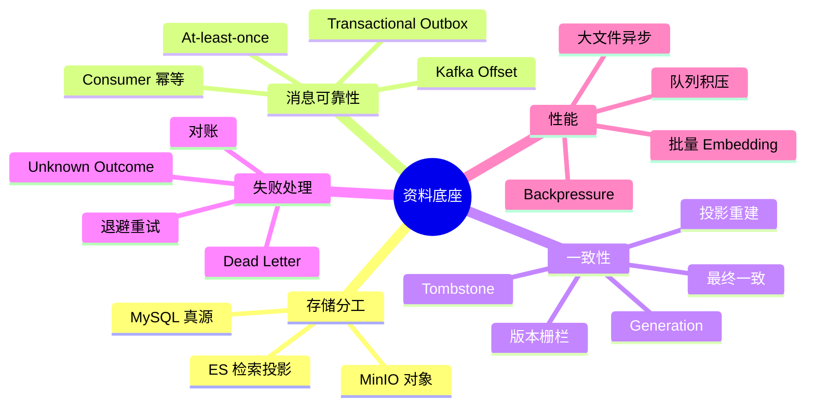

---

## 5. 亮点四：Schema 驱动产物生成，至少 5 分钟主回答

### 5.1 为什么需要 Skill，而不是复制 Prompt

报告、测验和课程笔记表面上是三类文本，实际的输入资料、输出结构、章节要求、工具权限、引用规则和交付方式都不同。如果每新增一种产物就复制 Prompt，很快会出现输入缺失、字段漂移、工具越权和失败后整份重做。

我把产物定义抽象成 Skill。Skill 不是一个 Prompt 模板，而是一个产品契约：它声明输入 Schema、输出 Schema、需要哪些资料、允许哪些能力、如何编译执行图、如何验证，以及最终需要哪些文件才能交付。用户选择的是“PDF 课程笔记”，系统选择对应 Skill Version，执行过程中不会因为模型自由发挥而改变业务契约。

### 5.1.1 Artifact 生成全流程图

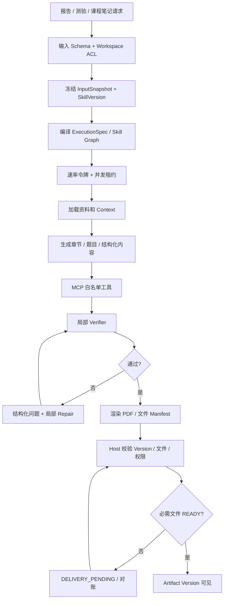

### 5.2 Skill Catalog 和 Graph 编译

SkillDefinition 包含 skill_key、version、input_schema、output_schema、required_sources、capability_policy、execution_nodes、verifier_rules 和 delivery_policy。提交时先校验必填字段和资料范围，再冻结 Skill Version 和 InputSnapshot。

Compiler 根据 Skill、用户输入和可用能力生成 ExecutionSpec。典型节点包括 LoadContext、RetrieveSource、PlanSections、GenerateSection、BindCitation、Verify、Repair、Render 和 Archive。编译阶段检查节点类型、Schema、能力白名单、环依赖和预算。模型不能在运行时用自然语言新增一个未注册 Tool，也不能把结果写到任意路径。

它和固定 Workflow 的区别是，节点类型和安全边界受控，但 Graph 可以根据 Skill 和输入编译。模型在内容生成、资料选择和局部 Repair 上有灵活性，能力、权限、完成条件和写回仍然由 Harness 控制，所以它是受控 Agentic Workflow。

### 5.3 一次 PDF 讲义生成

Host 先校验用户、Workspace、资料范围和输入 Schema，创建 ArtifactJob、Operation ID 和冻结的 InputSnapshot。Compiler 生成 ExecutionSpec，并将其版本化存储。Scheduler 申请 Workspace 级速率令牌和并发租约，避免一个大任务占满全部 Worker。

Worker 按图执行资料加载、章节规划、内容生成、引用绑定、版式渲染和文件归档。每个节点写 Checkpoint 和外部调用 Receipt。节点失败时，系统根据错误类型决定重试当前节点、等待 Provider、进入人工处理或终止任务，不把整份讲义全部重做。

Verifier 检查 JSON 或 Markdown 结构、必填章节、引用定位、敏感内容、安全策略、文件 Manifest 和 PDF 是否可打开。Verifier 输出结构化问题，例如“第三章缺少来源引用”“题目数量不足”“PDF 文件未上传”。Repair 只修复受影响节点，下游节点重新执行，最后再经过全局 Contract 校验。

### 5.4 Java Host、Python Worker 和 MCP

Host 负责 ArtifactJob、Task、Version、权限、幂等键、文件元数据和最终提交。Worker 负责 Prompt、模型、Embedding、解析和工具编排。Worker 返回 Candidate 或中间文件，不直接创建用户可见版本。Host 校验租约、版本、Schema 和文件清单后，创建内部 Artifact Version。

MCP 作为外部能力适配协议，用于音视频转写、视频元数据和内容理解等能力。MCP 统一工具发现、参数 Schema 和调用结果，但不替代 ACL。生产只启用系统注册的 MCP，能力在 Host 编译时进入 Capability Policy。每次调用带 Workspace、Source Snapshot、Operation ID 和超时预算，结果落 Receipt 方便重试和对账。

### 5.5 Quota、Lease 和三种成功

速率令牌桶限制一段时间内可以提交多少任务，并发租约限制同时运行多少长任务，预算账本限制单个任务最多消耗多少 Token、搜索和文件操作。三者生命周期不同，不能用一个 counter 代替。Redis Lua 负责令牌和租约的原子操作，MySQL 保存 Job 和状态。Redis 不可用时，高成本 Research 和 Artifact 默认 Fail Closed。

产物有三种成功：内容成功，表示 Schema、引用和质量检查通过；投递成功，表示文件上传和 Manifest 记录成功；交付成功，表示所有必需文件 READY，用户可以下载。模型返回文本不等于内容成功，Worker 回调 200 不等于文件已经交付。只有第三种状态才提升为用户可见终态。

### 5.5.1 Artifact 状态图

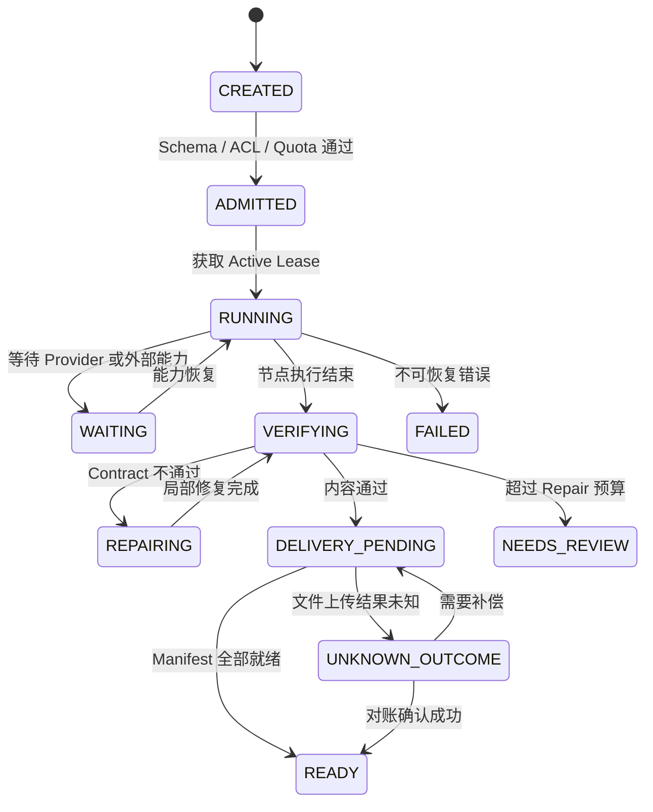

### 5.6 Trade-off 和追问

受控 Skill Graph 比自由 Agent 更复杂，但能把权限、结构和恢复纳入程序控制。MCP 比每个能力单独写 HTTP Adapter 多一层协议，但复用工具发现和 Schema 更方便；单个简单能力不一定值得引入。局部 Repair 比整份重生成节省成本和时间，但要求节点依赖和错误定位更清楚。Host 提交比 Worker 直写多一次回调，却保护了版本和权限不变量。

**问：为什么不用 LangGraph 或 Temporal 直接做真源？**  
当前主路径是有界产物生成和 Research，业务真源需要管理 Workspace 权限、资料版本和 Artifact Version，所以先由 Java Host 保存领域状态，Worker 内部可以使用图编排。跨天等待、人工审批和复杂 Signal 成为主路径后，再评估专门的工作流引擎。

**问：MCP 超时如何处理？**  
先用 Operation ID 和 Receipt 对账。确认成功就复用结果，确认失败才重试，无法确认时进入 UNKNOWN_OUTCOME，不把网络超时直接当作没有副作用。

### 5.6.1 这一条亮点涉及的知识点

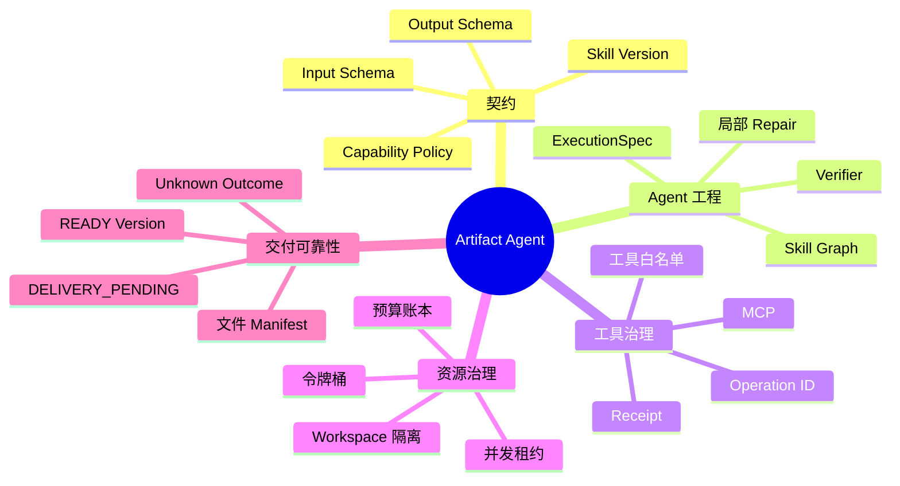

---

## 6. 亮点五：Context Engineering 与 Memory，至少 5 分钟主回答

### 6.1 问题背景

长会话不是简单把窗口扩大。用户可能在很早之前确认过输出格式，最近几十轮却在讨论另一门课程；如果只保留最近 N 条，会丢掉长期约束；如果把全量历史都塞进 Prompt，会增加 Token、延迟和噪声，还可能把已经删除的信息带回来。

长期 Memory 又是另一个问题。用户偏好、确认决策、模型推断、资料事实和短期任务结果的可信度不同。如果模型自动把所有内容写进记忆，错误和 Prompt Injection 会跨会话放大。我的设计把 Context、Conversation、Summary、Memory 和 Evidence 分成不同信任域。

### 6.1.1 Context 编译流程图

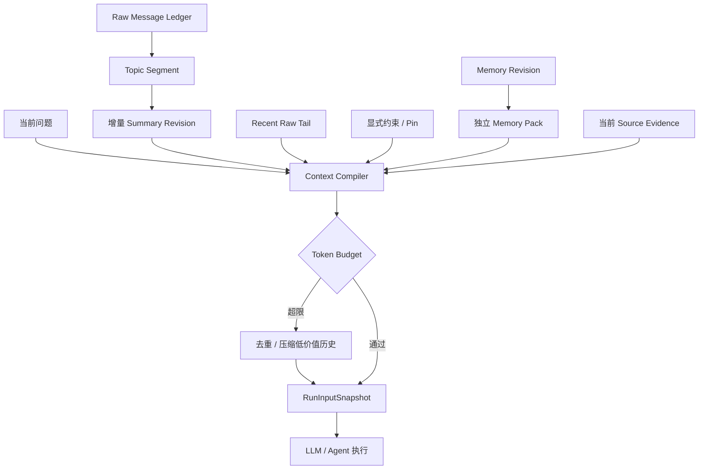

### 6.1.2 Memory 生命周期图

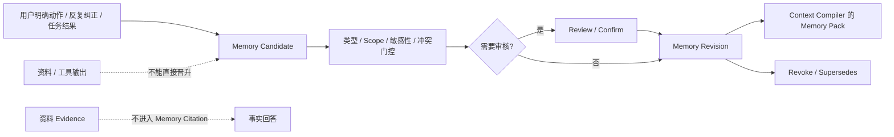

### 6.2 Raw Message、Segment 和增量摘要

每条消息先进入 MessageLedger，带 conversation、sequence、时间和主题信息。原始消息是真源，摘要只保存覆盖区间、Source Segment Version、内容 Hash 和状态。按显式对象、当前任务、Query 语义和相邻消息划分 Topic Segment，低置信度时保留原文，不强行把消息合并到错误主题。

每个 Segment 维护版本。新增消息通常只影响活动 Segment 或产生新 Segment，因此只重算受影响的尾部。摘要任务绑定 `segment_id + segment_version`，完成晋升时用 CAS 检查版本；如果期间又来了新消息，旧摘要标记 STALE，不能覆盖新版本。

Context Compiler 不是字符串拼接器。它根据当前 Mode、Conversation Cutoff、活动主题和 Token Budget，依次选择 System 和任务契约、当前问题、相关 Summary、Recent Raw Tail、显式约束、Memory Pack 和 Evidence Bundle。不同 Section 有独立预算，超限时优先去重和压缩低价值历史，不能静默删除当前问题、关键约束和必要证据。

### 6.3 Memory Candidate、Gate 和 Revision

长期 Memory 的输入主要有四类：用户明确保存的偏好，用户反复纠正形成的稳定规则，经过确认的长期决策，以及可复用的任务指针。临时聊天内容、未经确认的模型推断、资料事实和敏感信息不应自动晋升。

系统先提取 Memory Candidate，并记录来源消息、提取方式、建议 Scope、类型、敏感性和有效期。随后经过类型白名单、重复判断、冲突检测和 Scope 检查。低风险且由用户明确确认的偏好，可以直接形成可撤销 Revision；模型推断、行为信号和外部资料只能进入 Review 或受控晋升。

Memory 不原地覆盖。新版本创建 Revision，记录 supersedes 关系，旧版本保留审计但不进入当前编译结果。用户撤销时生成显式 Revoke 事件，使相关 Control Pack、缓存和下游任务输入失效。这样才能回答“这条记忆为什么存在、什么时候生效、如何撤销”。

### 6.4 RunInputSnapshot 和 Evidence Isolation

Research 或 Artifact 启动时，Host 创建 RunInputSnapshot，冻结可见 Source Snapshot、Conversation Cutoff、Summary Revision、Memory Revision 和 Strategy Tuple。任务运行过程中新增消息或 Memory 不会悄悄改变本次输入，下一次任务才读取新版本。这样结果可以回放，重试也不会因为上下文变化而产生不可解释差异。

Memory 可以影响输出格式、语言偏好和已确认协作约束，但不参与 Source Recall、Citation 或 Evidence Rerank。资料事实必须来自当前可见 Source Snapshot。即使 Memory 里有“用户认为某课程是闭卷考试”，也不能把它当成考试方式的 Citation。这个隔离会牺牲一部分个性化便利，但能防止模型以前的错误变成后续事实。

### 6.5 关键 Trade-off 和追问

Topic-aware Window 比最近 N 条复杂，但能保留跨话题仍有效的约束。增量摘要比每次全量总结便宜，但要处理版本失效、CAS 和原文回读。Candidate 加 Gate 比模型直接写 Memory 有延迟和审核成本，但能降低污染。Revision 比原地更新多存储和查询复杂度，却支持回放、冲突和撤销。Memory 与 Evidence 隔离让事实更可靠，但模型不能用用户偏好直接补齐缺失资料。

**问：摘要错误怎么办？**  
原始 MessageLedger 不删除，摘要保存引用区间和版本。发现摘要与原文不一致时按引用回读，重新生成新 Revision，旧版本标记失效，不覆盖当前新消息。

**问：用户说“记住这条”是否立即生效？**  
如果是低风险、明确的格式偏好，可以通过 Scope、敏感性和冲突检查后形成可撤销 Revision。如果内容涉及事实、权限或模型推断，只形成 Candidate 或进入 Review，不能直接进入引用链。

**问：为什么 Memory 不参与 RAG？**  
RAG 解决资料事实检索，Memory 解决协作偏好和长期约束。混在一起会让系统以前生成的内容反过来证明资料事实，也会让撤销和权限删除变得不可控。

### 6.5.1 这一条亮点涉及的知识点

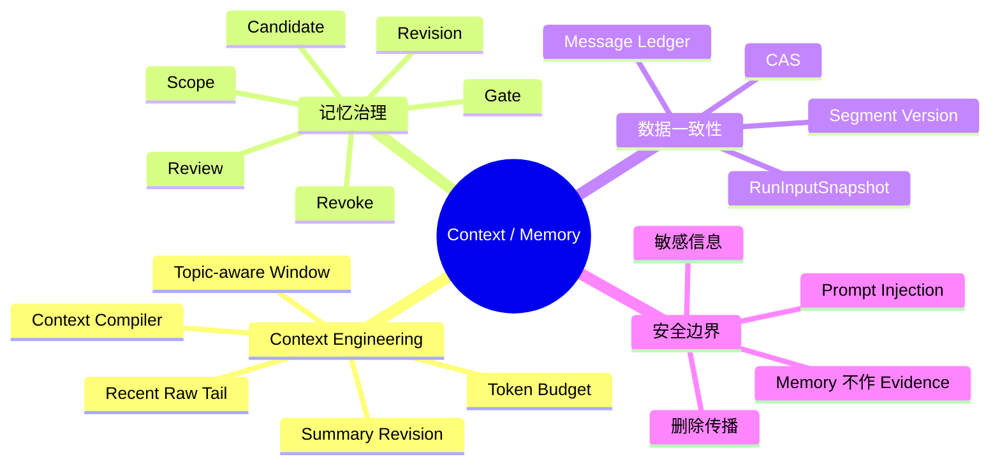

---

## 7. 横向系统设计、Trade-off 和现场题

### 7.1 统一答题模板

面对系统设计题，我先问五个问题：数据是否需要追溯到不可变版本，任务是秒级还是长任务，模型输出能否直接产生副作用，失败后能否安全重试，质量、安全和成本哪个优先。然后先给最小可用方案，再说明 NoteWeave 当前为什么演进到现在的架构，最后说流量或业务边界变化后什么时候升级。

### 7.1.1 面试回答决策树

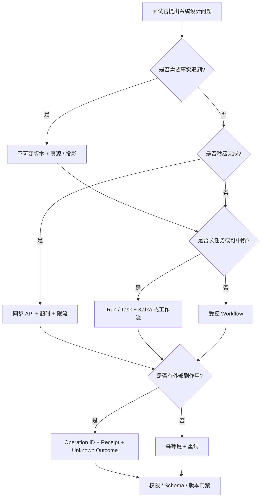

例如面试官问“为什么要 Kafka”，我不会只说 Kafka 异步解耦。先说明资料解析和索引长、会阻塞 HTTP，且需要重试和削峰；再说明 Outbox 保证业务事件不丢、Consumer 幂等保证重复安全；最后说明代价是最终一致和乱序，若任务演进为跨天 Timer 和人工审批，再评估工作流引擎。

### 7.2 安全和权限

权限至少做四层：入口验证 Workspace 和 Actor，检索前做 Scope Filter，命中后回库校验 Source 和 Snapshot，Worker 写回时校验 Capability、Lease、Fencing 和 Version。不能因为 ES 命中或缓存命中就跳过回库。

高风险能力 Fail Closed。Redis 挂掉时，配额和工具许可不能默认放开；ACL 或版本缓存不可用时回 MySQL；SSE 空结果不能解释成没有事件。这样做的代价是故障期间部分请求不可用，但避免了安全边界在降级时失效。

### 7.3 可观测性和评测

资料链路看上传成功率、解析耗时、Snapshot READY 延迟、Outbox Oldest Ready、Kafka Lag、死信数量。QA 看召回覆盖、Evidence 支撑、拒答正确性、越界引用和 P95。Research 看有效 Cell 完成、必填字段覆盖、引用支撑、冲突发现、恢复成功和预算消耗。Artifact 看 Schema 通过率、Repair 次数、Manifest 完整和交付成功。Memory 看 Token、摘要保留、误晋升和撤销传播。

评测需要固定基线、数据集版本、策略版本和失败样本。不能只报一个总准确率，因为结果变差可能来自召回、Rerank、Evidence Selection、生成、拒答阈值或资料版本。面试时如果指标还未完整跑完，说明评测设计和指标分母，不把默认配置当作生产成绩。

### 7.4 高频现场题一：Worker 执行一半宕机

先判断任务是否处于未知结果。读取 Task、Lease、Checkpoint 和外部 Receipt，Lease 过期后重新领取。已完成的节点和成功 Receipt 复用，只重跑未完成阶段。旧 Worker 恢复后带旧 Fencing Token 回调，Host 条件更新拒绝。若外部工具可能已经产生副作用，用 Operation ID 对账后再决定是否重试。

### 7.5 高频现场题二：资料更新后仍搜到旧内容

先以 MySQL 当前 Snapshot 和删除意图为准，确认事实层是否已经切换。然后检查 ES Generation、Indexer Receipt、缓存和查询是否使用了旧 Head。新 Snapshot 先成为真源，旧投影不能继续作为有效 Evidence。通过 Outbox 重放、索引重建和 Alias 或 Generation 切换恢复投影，恢复期间明确标记 DEGRADED，不把旧内容冒充最新版本。

### 7.6 高频现场题三：完整度提高但引用支撑率下降

先冻结同一评测集，分别对召回、Rerank、Evidence Selection、Verifier 和生成做消融。检查是否把相邻重复片段当成多个独立证据，是否发生 Snapshot 漂移，是否把 Memory 混进 Evidence，是否为了提高完成率放宽了拒答门槛。解决时优先修复证据绑定和版本问题，再调整 TopK、窗口或模型，不直接换更大的模型。

### 7.7 高频现场题四：一个大任务占满系统

把速率、并发、预算和公平调度分开。速率令牌控制突发提交，并发租约限制正在运行的长任务，预算账本限制单个任务成本。按 Workspace 和 Workload 隔离 Active Permit，为 QA 保留短请求资源，大任务进入排队。不能只把线程池调大，因为瓶颈可能转移到 Provider、MySQL 连接池或 ES。

### 7.8 十倍流量时的演进顺序

先看用户旅程和最小瓶颈，而不是先加机器。若上传处理积压，扩 Parser、Embedding 和 Indexer 的独立 Worker，并增加背压；若 QA 的 Rerank P95 上升，先缩小候选集、缓存稳定结果，再考虑独立排序服务；若 Research 占满 Provider，强化预算和公平调度；若 MySQL 锁等待增加，检查状态更新粒度和索引，不把所有状态搬进 Redis；若 ES 重建影响在线查询，做代次投影和灰度切换。

### 7.8.1 横向知识点地图

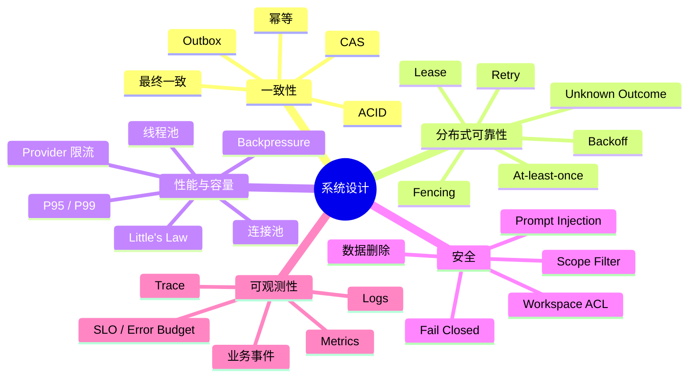

---

## 8. 面试结束时的统一收尾

NoteWeave 的核心不是堆叠 Spring Boot、Kafka、RAG 和 Agent 这些名词，而是把不确定的模型执行装进确定的系统边界。资料有不可变版本，检索有权限和 Evidence，Research 有可验证状态和恢复点，Artifact 有 Schema 和交付门禁，Context 和 Memory 有不同信任域。系统不保证每次都给出答案，但能够说明答案来自哪里、为什么失败、下一步如何恢复，以及在什么规模和约束下应该更换方案。
