# NoteWeave 面试总稿，STAR 重构版

> 知识原理下钻见：[08-知识深挖库-面试八股与项目映射](08-知识深挖库-面试八股与项目映射.md)。总稿负责项目叙事，知识库负责面试官继续追问时的底层原理、失败边界和 Trade-off。

**项目：** NoteWeave｜AI 资料研究工作台  
**时间：** 2026.06 - 2026.09（学校原型更早；v2 工程化重构集中在 2026.05 - 2026.08）  
**核心技术：** `Spring Boot`、`MySQL`、`Redis`、`Kafka`、`Elasticsearch`、`MinIO`、`Python`、`MCP`、`RAG`、`Harness Engineering`

## 面试事实边界与个人 Ownership

NoteWeave 同时包含当前实现、固定环境验证和进入生产后的目标设计。三者在回答中有不同的证据边界：

| 事实层级 | 面试说法 | 证据边界 |
| --- | --- | --- |
| 当前实现 | “当前代码已经支持……” | 以源码、迁移、配置和契约测试为准 |
| 已测模拟 | “在固定 Fixture、隔离基础设施或故障注入中验证……” | 必须说明环境、输入、测试命令和限制 |
| 目标设计 | “如果进入生产，我会演进为……” | 说明触发条件、迁移步骤和回滚，不说成已上线 |

本项目的核心 Ownership 是 Java 控制面、任务和版本模型、RAG 链路、Research 状态与恢复协议，以及 Java Host 和 Python Worker 之间的提交契约。Python Worker、Artifact、前端和 Prompt 细节按具体模块说明本人实现、深度验收或目标设计边界。开发中使用过 AI 工具辅助代码草稿、资料检索和审查，但需求取舍、状态不变量、测试设计和最终验收由本人负责。

Research 的角色化契约和 Artifact 的写回意图协议已经具备可验证结构，部分多角色并行和真实外部写回仍属于受控模拟或目标演进。ES、Kafka、Redis 存在显式禁用和降级配置，演示环境不能自动等同于生产环境。完整矩阵见 [面试官终审与事实矩阵](09-面试官终审与事实矩阵.md)。

五条简历亮点都按同一条因果链展开：业务中出现什么失败，系统必须守住哪些边界，具体用哪些状态和契约解决，最后用什么证据检验。

```text
S：业务场景为什么会失败，以及失败的代价
T：我需要守住哪些不变量，目标和边界是什么
A：我如何抽象领域、划分控制面和执行面、设计状态机与恢复
R：如何用评测、指标和可观察信号证明方案有效
```

研究验证、任务感知检索、异步资料处理、受控产物生成和长期上下文治理共享资料版本、权限和任务状态，但各有不同的完成条件。研究要逐字段验证，问答要绑定引用，资料处理要形成可检索 Snapshot，产物要达到文件交付状态，Memory 则不能替资料事实提供证据。

---

## 0. 项目开场与系统主线

### 0.1 30 秒版本

我做的是一个面向个人资料研究和长期知识沉淀的 AI 工作台。它覆盖资料接入、带引用问答、资料精读、Wiki 沉淀、Deep Research 和结构化产物生成。这个项目的重点不是调用大模型，而是处理 AI 系统落地后的工程问题：资料会变、长任务会中断、模型输出不稳定、权限不能被检索结果绕过、用户记忆不能污染资料事实。

所以我把系统拆成 Java 控制面和受控执行面。Java 主服务负责 Workspace、权限、资料版本、QA／Note／Wiki 的业务检索、任务状态、配额和最终提交；Python Worker 重点承载 Research、Artifact 及模型与工具长任务。资料解析有同步降级和 Kafka 异步处理两条运行路径。MySQL 是业务真源，MinIO 保存原文件，Elasticsearch 是可重建检索投影，Kafka 做异步投递，Redis 做短期协调。五条简历亮点分别解决可验证研究、任务感知检索、异步资料底座、受控产物生成和长期上下文治理。

### 0.2 系统全景图

系统分为控制面、执行面、权威数据、协调投递、派生投影和运行治理。图中同时保留当前已有的业务契约与按容量演进的目标形态；独立 Scheduler、完整分布式 Trace 和大规模分池部署属于目标形态，当前运行边界见第 10.1 节。

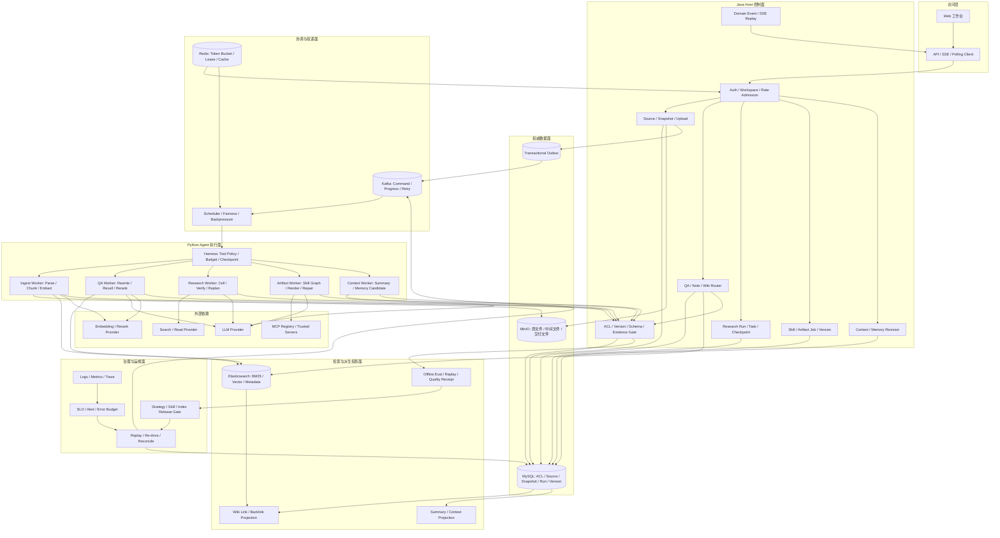

### 0.2.1 系统全景的直接回答

NoteWeave 的入口由 Java Host 承接。一次请求先确认用户属于哪个 Workspace、能访问哪些资料、是否还有任务配额，然后把资料版本和任务意图固定下来。Host 管理 Source、Snapshot、Run、Task、PageVersion、Memory Revision 和 Artifact Version，也负责最后的权限、证据与版本校验。模型和工具执行可能重试或晚到，所以执行结果先作为候选返回，不能由 Worker 直接改写用户可见版本。

MySQL 保存这些权威状态，MinIO 保存原文件和交付文件。资料状态变化和 Outbox 事件写在同一个数据库事务里，Dispatcher 再把命令送到 Kafka。Kafka 解决投递和解耦，不决定任务是否完成；Redis 负责缓存、实时事件与短期协调，不能取代 MySQL 中的权限和删除事实。执行侧按负载处理解析、检索、Research、Artifact 与摘要，各条链路共享 Workspace 和 Snapshot 身份，但完成条件并不相同。

ES、Wiki 反链和摘要属于从权威状态派生出的投影。索引落后时，查询仍要回到当前 Snapshot、ACL 和删除标记判断能否使用；需要重建时，可以按新 Generation 构建和校验，再切换读路径。外部模型、搜索和 MCP 调用会超时，也可能已经成功却丢了响应，因此任务要记录预算、执行代际、Receipt 和可恢复位置。当前代码已有这些分层中的关键契约；图中的独立 Scheduler、完整跨服务 Trace 和大规模分池部署是容量与故障需求出现后的演进视图。

### 0.2.2 四条关键数据流

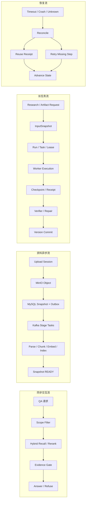

四条流分别对应同步回答、资料处理、长任务执行和故障恢复。QA 可以在证据不足时拒答；资料只有完成所需处理才进入可检索状态；Research 与 Artifact 从冻结输入恢复；外部结果不明时先查 Receipt，再决定是否重试。

### 0.3 2 分钟总架构版本

资料上传不是写一个文件就结束。原文件进入 MinIO，MySQL 创建 Source 和不可变 Snapshot，解析、切片、向量化和索引经 Outbox 投递 Kafka。Worker 只处理冻结的 Snapshot，完成后回传 Receipt 和候选状态。用户查询 QA、Note 或 Wiki 时，三条链路共享资料版本和 Workspace 权限，但按任务定义检索单元。Research 和 Artifact 是长任务，启动时冻结输入，执行中保存 Checkpoint，结果必须经过引用、Schema 和版本门禁。

系统的统一思想是四句话。第一，MySQL 是事实，ES、缓存、反链和摘要都是投影。第二，Host 持有提交权，Worker 只交候选。第三，至少一次投递是正常情况，重复、乱序和未知结果通过幂等、版本条件和 Receipt 处理。第四，正确失败优先，证据不足或结构不完整时拒答、等待或人工复核，不用低质量结果换完成率。

---

## 1. 亮点一：验证驱动、可恢复的 Deep Research Agent

### 1.1 S：Situation，开放研究为什么会失控

最初如果把研究问题直接交给一个通用 Agent，路径通常是“搜索几次，读一些页面，最后生成报告”。这个方案在 Demo 阶段很快，但一旦用户要求比较多个对象和多个字段，系统就会遇到四个问题。

第一是范围漂移。用户要比较课程学时、实验和考核，模型可能扩展成课程评价长文，搜索预算不断增加，却没有明确停止条件。第二是证据断裂。最后的报告看起来完整，但某些字段没有来源，或者引用只说明了相关主题，不能支撑具体数字。第三是中断不可恢复。一个研究可能包含几十次搜索和阅读，Worker 在中途重启后只能重新喂聊天记录，既重复外部调用，也可能因为网页变化得出另一份结果。第四是并发写回风险。多个 Worker 可能同时处理同一个对象，旧进程晚到后覆盖新结论。

开放研究的真正产物不是一篇文字，而是一组带证据的事实单元，以及一个可以解释为什么停止的状态。

### 1.2 T：Task，我要守住的工程不变量

我的任务是把研究变成可验证、可恢复、可审计的长任务。这里有五个不变量：

1. 每个必填字段都必须对应实体、字段和可见 Snapshot，不能只绑定一个模糊网页。
2. 研究范围、预算和停止条件在计划阶段确定，Replan 只能补缺口或处理冲突，不能偷偷降低标准。
3. Worker 可以探索，但不能改变权威状态、权限和最终版本。
4. 任务重启后只重做缺口，已经有成功 Receipt 的外部调用不能无条件重复。
5. “没有可靠证据”是一个合法终态，系统要能输出正确失败，而不是强行编一个答案。

### 1.3 A：Action，先改变状态模型，再谈 Agent 策略

#### 1.3.1 用 Table-as-State 把开放问题收敛成有界对象

我没有把对话轨迹作为研究状态，而是把问题编译成一张研究表。行是实体，列是待验证字段，单元格就是最小的恢复和验证单元。

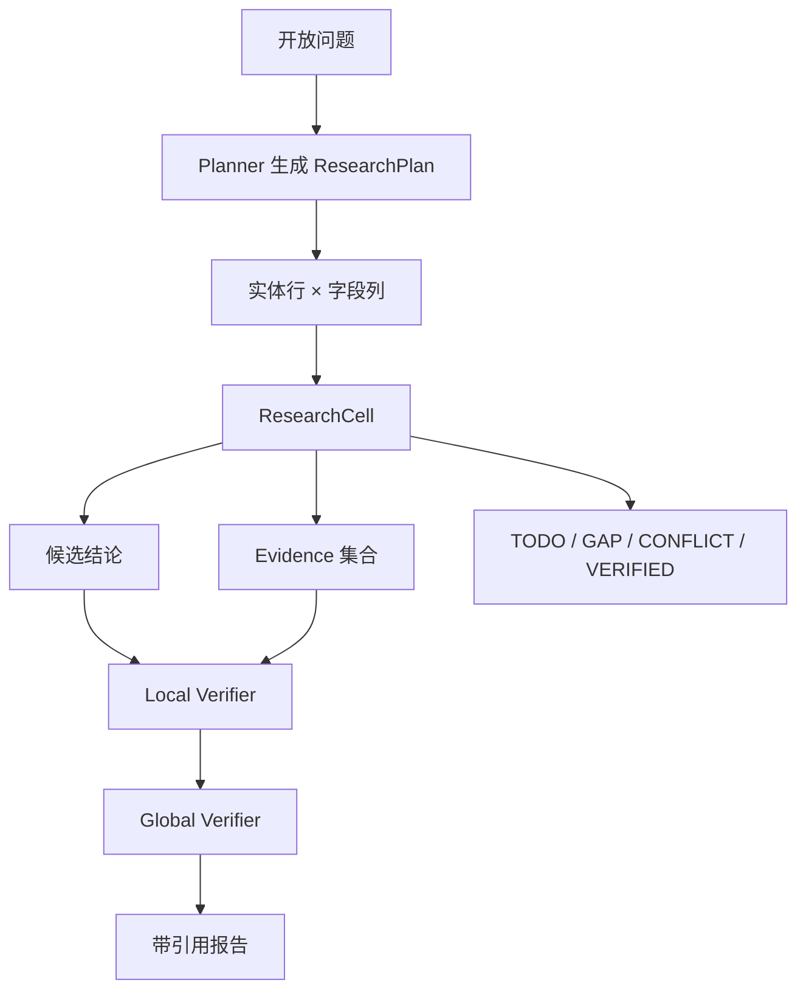

一个 Cell 至少包含 `entity_key`、`field_key`、`expected_type`、`required`、`risk_level`、`candidates`、`evidence_refs`、`cell_version` 和状态。比如“课程 A 的考核方式”与“课程 B 的考核比例”是两个不同 Cell，即使它们来自同一个 PDF，也不能因为文本相似就合并。

这种建模解决了一个本质问题：研究完成不再由“模型生成了多少字”定义，而由“必填 Cell 有多少经过验证”定义。它也让失败粒度从整个 Run 下沉到单个 Cell，一个字段冲突不会导致整份研究重跑。

#### 1.3.2 控制面和执行面分离

Java Host 保存 Run、Plan、Cell、Evidence、预算和状态；Python Worker 拿到 `RunInputSnapshot` 后执行搜索、阅读和抽取。Worker 返回 Candidate，而不是直接写结论。Candidate 必须带 Claim、原文摘录、定位、来源 Snapshot、置信度和观察记录。

写回时 Host 同时检查 Workspace、Run、Cell Version、Lease Epoch、Fencing Token 和 Snapshot 摘要。任何条件不匹配都说明 Worker 已经过期或输入发生变化，旧结果只能被拒绝，不能靠“最后写入获胜”覆盖当前事实。

#### 1.3.3 Local Verifier 和 Global Verifier 分工

Local Verifier 处理单元格级问题：证据是否属于同一个实体和字段，引用是否覆盖 Claim，数字、年份和单位是否符合字段类型，来源是否仍然可见。它解决“这一格是否站得住”。

Global Verifier 不重复相信 Local 的结论，而是从当前 Cell 状态重新计算必填字段覆盖、实体间冲突、时间和单位一致性。它解决“整张表是否能一起成立”。例如每个课程的学时都各自有证据，但两个字段的单位一个是小时、一个是周课时，Global Verifier 仍然要标记为需要复核。

#### 1.3.4 Replan 不是无限反思

Replan 的输入是 GAP、CONFLICT 和低覆盖结果。对于 GAP，Planner 可以补充查询；对于 CONFLICT，可以生成有限的受限反证，例如查找否定证据、替代来源和不同版本。反证有查询族、次数、Token 和 Provider 预算，不能无限循环。

Replan 不能把必填字段删掉，也不能把“必须课程大纲”降级成“任意网页相关即可”。预算耗尽后仍没有支持证据，就进入 GAP、NEEDS_REVIEW 或 `NO_SUPPORTED_CANDIDATE`。这体现的是正确失败，而不是执行失败。

#### 1.3.5 Checkpoint、Lease、Fencing 和未知结果

Checkpoint 保存 Plan 版本、Cell 状态、Evidence 引用、预算消耗、Receipt 和事件高水位。恢复时扫描 TODO、GAP 和超时的 SEARCHING，只为缺口创建任务，已成功的 Receipt 可以复用。

Lease 解决“谁在执行”，Fencing Token 解决“旧 Worker 还能不能写”。Worker 可能在 Lease 过期后恢复，Host 根据 `run_id + cell_id + cell_version + lease_epoch + fencing_token` 做条件更新，旧 Token 无法写回。

外部搜索或模型调用超时属于 UNKNOWN_OUTCOME，不直接等同于失败。系统先按 Operation ID 和 Receipt 对账，确认成功就复用，确认失败才重试，无法确认则等待补偿。否则很容易出现外部已经扣费，系统又重复调用一次的问题。

### 1.4 R：Result，结果怎么证明

研究效果不能只说“报告更完整”。我会把结果拆成四类：有效研究单元完成率、引用支撑率、冲突发现率和恢复成功率。基线是“一次 Prompt 或自由 ReAct 生成”，优化后对同一批固定研究问题比较。没有冻结评测 Manifest 之前，不在简历中填写百分比，只报告指标定义、分母、失败样本和回放方法。

恢复正确性靠故障注入检验。在搜索成功但回调丢失、Checkpoint 写完后 Worker 被杀、Lease 过期后旧进程迟到等窗口中断执行，重新接管后应只处理未完成 Cell；旧 Worker 回调应被 Fencing 拒绝，已确认 Evidence 不能丢失，预算耗尽也要形成可解释终态，不能靠反复重试伪造完成。

### 1.5 5 分钟口述稿

这个亮点解决的是开放研究的可控性问题。一次 Prompt 可以很快写出一篇看起来完整的文章，但它没有回答每个字段是否有来源，也没有办法说明长任务中断后从哪里继续。我的做法是把研究问题编译成 `Table-as-State`：行代表研究对象，列代表需要验证的字段，每个 Cell 保存候选值、证据引用、状态、版本和预算。研究完成不是由文章长度决定，而是由必填 Cell 是否通过 Evidence Gate 决定。

以“比较几个技术方案”为例，Host 先把用户问题拆成实体集合和字段集合，例如部署方式、限制条件、版本信息和适用场景。Java Host 持有 `ResearchRun`、Plan、Cell、权限和预算，启动时创建 `RunInputSnapshot`，把资料版本、检索范围和策略版本冻结下来。Research Worker 收到的不是一段可以自由改写的 Prompt，而是版本化的 `ResearchAgentCommand`。命令只带 `schema_version`、`command_id`、`research_run_id`、`agent_task_id` 和 `idempotency_key`，Worker 领取任务后再通过内部接口读取经过授权的冻结输入。

Worker 的输出也不是“研究完成”的字符串，而是 Candidate。Candidate 必须带 `cell_id`、`base_cell_version`、`evidence_ids`、置信度、`lease_epoch` 和 `fencing_token`。这几个字段解决的是不同问题：`base_cell_version` 防止两个 Worker 基于旧状态覆盖彼此，`evidence_ids` 保证候选值能回到来源，Lease Epoch 和 Fencing Token 防止超时 Worker 晚到写回。Host 收到 Candidate 后做条件更新，更新条件不满足时拒绝写入，并把版本冲突记录成可观察事件，而不是静默重试。

验证分两层。本地 Verifier 检查当前 Cell 的证据是否存在、引用范围是否属于当前 Snapshot、引用文本是否真的支持候选值。全局 Verifier 检查整张表的覆盖率、冲突字段、来源多样性和必填字段是否缺失。只有本地和全局条件都满足，Cell 才能从 `CANDIDATE` 进入 `VERIFIED`。证据不足进入 `GAP`，互相矛盾进入 `CONFLICT`，而不是让模型任选一个看起来合理的值。

Replan 也有边界。它只能新增受限查询、补读一个来源或开启一次反证分支，不能修改必填字段、降低验证标准或无限增加搜索次数。当前 Worker 默认并发是 1，Lease 默认 60 秒，Heartbeat 需要在 Lease 过期前续租；LLM 总调用数、搜索次数、读取窗口和 Token 都属于 Run Budget。这样的配置牺牲了一部分探索速度，但先保证状态一致和成本可控，后续只有在 Workspace 配额和恢复测试稳定后才考虑提高并发。

Checkpoint 保存 Plan 版本、Cell 状态、Evidence 引用、预算消耗、Receipt 和事件高水位。Worker 重启后读取最近 Checkpoint，只为 `TODO`、`GAP` 和已超时的 `SEARCHING` Cell 创建新任务，已经 `VERIFIED` 的 Cell 不重跑。Provider 超时进入 `UNKNOWN_OUTCOME`，先用 `operation_id` 和 Receipt 对账；如果已经有结果就只重放 finalize，如果无法确认才进入补偿或人工处理。这样避免“请求方没收到响应，于是重复付费搜索”的问题。

这套方案的 Trade-off 是减少自由 Agent 的任意探索，换取字段级证据、可解释恢复和可审计提交。它适合研究报告、对比表和需要逐项引用的任务，不适合每一次低延迟闲聊。评测使用固定研究问题集，分母是必填 Cell 总数、冲突 Cell 数和注入中断的 Run 数，指标包括有效 Cell 完成率、引用支撑率、冲突发现率、旧 Token 拒写率和恢复成功率。当前不能把角色化并行说成完整生产多 Agent 集群，但可以明确说已经把候选、验证、Checkpoint、Lease 和恢复协议固定成可测试的边界。

### 1.6 高频追问

**为什么不使用多个 Agent 投票？**  
投票只能说明模型输出相似，不能证明实体、字段和引用绑定正确。Cell 级验证比投票更接近业务正确性。

**为什么不直接上 Temporal？**  
当前主路径是有界研究和产物生成，Host 自己保存领域状态更容易控制 Evidence、ACL 和版本提交。跨天 Timer、人工审批和复杂 Signal 成为主路径后，再迁移工作流引擎。

**Research 为什么不是普通 RAG？**  
RAG 的目标是一次回答，Research 的目标是跨多个对象和字段形成可审计事实集合，必须额外管理 Plan、Cell、预算、验证和恢复。

### 1.7 六模块补强：端到端案例、故障复盘、基础映射和数字证据

#### 模块一：完整 STAR 主回答

**Situation。** 用户要比较三门课程的学时、实验、考核方式和适合人群。直接让模型搜索并生成报告，结果经常出现字段遗漏、引用只支撑大方向、任务中断后重复调用外部搜索的问题。

**Task。** 我需要让研究过程可拆解、可验证、可恢复，并保证模型不能跳过 Workspace 权限和证据门禁。完成条件不是“生成一篇文章”，而是所有必填字段都有满足类型约束的 Evidence，冲突能够被保留，无法证明时能正确失败。

**Action。** 我先把问题编译成实体和字段组成的 Table-as-State，给每个 Cell 分配状态、版本、预算和风险等级。Java Host 保存权威 Run 和 Cell，Python Worker 按冻结 Snapshot 执行搜索和抽取，只提交 Candidate。Local Verifier 检查单元格证据绑定，Global Verifier 重算整体覆盖和冲突。缺口才触发受限 Replan，所有搜索和外部调用保存 Checkpoint、Receipt、Lease 和 Fencing Token。Worker 重启后只恢复 TODO、GAP 和超时 Cell，旧 Worker 晚到回调会被版本条件拒绝。

**Result。** 以“一次 Prompt 生成报告”为基线，在固定研究问题集上统计有效 Cell 完成率、引用支撑率和恢复成功率。最终结果应同时说明质量收益、平均研究耗时、Provider 调用成本和正确失败数量。这个结果证明的不是模型更会写，而是系统能知道哪些结论被证明、哪些结论不能证明，以及任务如何从中断位置继续。

#### 模块二：端到端案例

案例问题是“比较课程 A、B、C 的学时、实验、考试形式和适合人群”。Planner 先创建 3 个实体乘 4 个字段的矩阵，并把学时和考试比例标成类型化字段。Source Recall 找到三份课程大纲，Worker 分别读取对应 Snapshot。课程 A 的考试形式在大纲和教师说明中一致，Cell 进入 VERIFIED；课程 B 只有一个来源，Global Verifier 将其标成低覆盖；课程 C 的两个版本分别写“闭卷考试”和“项目考核”，进入 CONFLICT。

Replan 只对 B 的低覆盖字段和 C 的冲突字段生成新任务，反证目标分别是“查找官方考核说明”和“确认版本生效日期”。如果预算用完，B 的字段输出“当前资料无法证明”，C 的字段保留两个候选并进入 NEEDS_REVIEW。最终报告仍然可以交付，但明确哪些字段是 VERIFIED、哪些字段是 GAP 或 CONFLICT，而不是把整份研究标成成功或失败。

#### 模块三：失败复盘案例

**现象：** Worker 已经完成搜索，Host 没收到 Callback，任务长时间停在 SEARCHING。  
**影响：** 如果直接重试，可能重复搜索并产生额外费用；如果直接标失败，又会丢掉已经完成的 Evidence。

**定位：** 先查 Task Lease 和 Checkpoint，再查 Provider Operation ID、Receipt 和 Kafka 投递记录。发现外部搜索已经成功，但 Callback 在网络断开窗口丢失，Host 没有收到最终状态。

**修复：** 对账任务按 Operation ID 查询结果，补写 Receipt 和 Candidate；Lease 过期后重新领取时跳过已有成功 Receipt，只继续未完成 Cell。旧 Worker 恢复后使用旧 Fencing Token 回调，被 Host 条件更新拒绝。

**防复发：** 把“执行成功”“回调成功”“业务状态提交成功”拆成三个事件，补充 Worker Kill、Callback 断网和重复投递测试，并增加 UNKNOWN_OUTCOME 和 Receipt 对账指标。

#### 模块四：三个硬核追问

1. **为什么 Cell 级状态优于整个 Run 一个状态？** 因为研究失败通常是局部字段失败，Cell 级状态允许复用已验证证据、控制重试成本，并且能让完成率和引用支撑率有明确分母。
2. **Fencing Token 和 Lease 各解决什么？** Lease 表示当前执行权会过期，Fencing Token 表示每次领取的代次。Lease 防止任务永久卡住，Fencing 防止旧 Owner 在恢复后继续写入。
3. **为什么 Provider 超时不能直接重试？** 超时只说明调用方没有收到结果，不能证明外部没有副作用。必须用 Operation ID 对账，否则可能重复扣费、重复搜索或生成两份产物。

#### 模块五：基础知识映射

| 项目机制 | 基础知识 | 面试落点 |
| --- | --- | --- |
| Cell Version 条件更新 | MySQL 乐观锁、CAS | 防止并发 Worker 覆盖 |
| Lease 和 Fencing | 分布式租约、ABA 问题 | 旧 Owner 晚到拒写 |
| Checkpoint | 状态持久化、恢复点 | 只重跑缺口 |
| Receipt | 幂等、未知结果 | 外部副作用对账 |
| Plan / Replan | 工作流、约束搜索 | 防止研究范围漂移 |
| Evidence Gate | 数据血缘、可审计性 | 结论逐项回溯 |

#### 模块六：数字证据卡

```text
基线：一次 Prompt 或自由 ReAct
评测单元：一个实体字段 Cell
主指标：有效 Cell 完成率、引用支撑率、冲突发现率、恢复成功率
必备分母：必填 Cell 总数、包含冲突的 Cell 数、注入中断的 Run 数
性能指标：平均研究时长、P95 Provider 调用次数、单 Run Token 和搜索成本
故障指标：旧 Token 拒写率、UNKNOWN_OUTCOME 对账成功率、重复副作用数量
结果口径：固定研究问题集上的有效 Cell 完成率、引用支撑率、恢复成功率和正确失败数量；具体数值以评测 Manifest 为准
```

---

## 2. 亮点二：任务感知的 QA / Note / Wiki 知识链路

### 2.1 S：Situation，统一 RAG 的上限

最初最容易做的是一套通用 RAG：所有资料切成 Chunk，向量召回 TopK，然后交给模型生成。它能很快回答简单问题，但在实际使用中会出现三类失败。

QA 的问题是专名、课程号、数字和限定条件很容易被纯向量召回漏掉，TopK 里还可能有多段重复内容。Note 的问题是 Chunk 被打散，模型看到了几个结论，却看不到原文的定义、例子和上下文。Wiki 的问题是页面会被长期编辑，不能把一次回答直接覆盖成事实，也不能把旧页面和最新资料混成一个时间点。

因此“相关”不是一个全局常数。QA 关心证据是否支撑问题，Note 关心资料是否适合连续阅读，Wiki 关心知识页面和来源关系是否可维护。

### 2.2 T：Task，我要统一什么，拆开什么

我要统一的是安全和事实边界：三条链路都共享 Source、Snapshot、Workspace ACL、Evidence 和读时回库校验。我要拆开的是检索单元、上下文组织和写回方式：

- QA 产出带 Citation 的 Answer，证据不足时拒答。
- Note 产出带原文定位的 Draft Revision，用户审阅后写回。
- Wiki 产出不可变 PageVersion，关系和来源回链可重建。

硬不变量是：ES 命中不等于授权，Memory 不等于 Evidence，Page Head 不等于 Source Snapshot，检索相关性不能替代版本和权限校验。

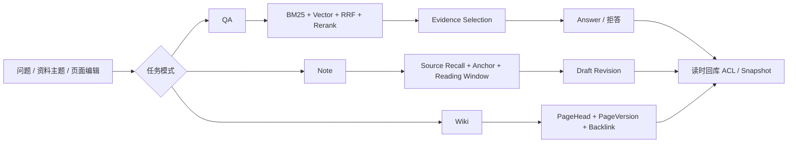

### 2.3 A：Action，把三条链路做成不同的检索产品

#### 2.3.1 QA：从 Query 到 Evidence Bundle

第一步是 Query Understanding。多轮问题中的代词、时间和对象先变成结构化检索约束，但保留原问题。低置信度时并行尝试原查询和改写查询，发现冲突就追问用户，避免 Query Rewrite 静默改变意图。

第二步是 Scope Filter。根据 Workspace、资料类型、Source 和 Snapshot 过滤。第三步做 BM25 和 Vector 双路召回。BM25 擅长课程号、专名、数字、章节和精确短语，Vector 擅长同义表达和自然语言描述。两路结果用 Weighted RRF 融合，因为不同召回器的分数不在同一个空间，直接相加会依赖脆弱的归一化。

第四步对有限候选做 Cross-Encoder Rerank。Rerank 只解决单片段相关性，不能保证多个片段合起来覆盖结论，因此第五步还要做 Evidence Selection。Selection 处理去重、集合覆盖和冲突保留，生成 Evidence Bundle。

回答器不能重新自由搜索，也不能把 Memory 当来源，只能消费 Evidence Bundle，输出 Claim、Citation 和 Uncertainty。证据不足或冲突时返回拒答或澄清。QA 的完成条件是 Claim 被可见资料支撑，不是模型返回 HTTP 200。

#### 2.3.2 Note：从资料召回到连续阅读

Note 的第一阶段是 Source Recall，不急着拿最相似的几个 Chunk 生成文章，而是先判断哪些 Source 值得读。第二阶段定位章节、页码或段落 Anchor。第三阶段沿原文顺序扩展 Reading Window，保留定义、例子和限定条件。第四阶段生成 Draft Revision，包含摘要、原文定位和待确认项。只有用户审阅或通过写回门禁后，才形成 Note Version。

这样设计是因为“相似片段”不等于“可读资料”。连续窗口可能增加 Token，但能减少把结论和限定条件拆开的风险。窗口由段落边界、章节结构和预算共同决定，超限时先缩减远端窗口，不删除 Anchor 附近的关键上下文。

#### 2.3.3 Wiki：从一张页面表到版本化知识投影

Wiki 用 PageHead 指向当前 PageVersion，每次人工编辑或 Agent 生成都创建新版本。关系表保存页面链接和反链，Source Backlink 保存段落或结论对应的 Source Snapshot。资料更新后，系统通过来源回链把页面标记为待复核，而不是自动覆盖用户编辑。

Wiki 读取当前 Head 和受限关系扩展，不自动回退成普通 QA。页面不存在和资料没有答案是两种不同语义，不能用一个空字符串表示。关系图用于导航和局部扩展，不把有限关系查询包装成全量 GraphRAG。

#### 2.3.4 两次授权和版本校验

Scope Filter 在召回前减少越权候选，但它不能作为唯一安全边界，因为索引可能延迟或元数据可能旧。生成引用前还要回 MySQL 检查 Workspace 归属、Source、Snapshot、删除状态和当前 Head。Worker 写回时再次校验权限和版本，确保读取时合法不等于提交时仍然合法。

这条链路不是把检索技术简单叠加。BM25 保住课程编号、专名和精确数字的词法匹配，向量召回覆盖用户换一种说法后的语义相关资料；ANN 以近似搜索换取大规模候选检索的时延，RRF 避免直接比较 BM25 与向量分数。Rerank 重新判断候选与问题的关系，Evidence Selection 再去掉重复片段并检查来源覆盖。Query Rewrite 可能改变原问题中的否定和限定条件，因此改写结果不能替代原问题约束。Note 需要连续 Reading Window，而非零散 Chunk；Wiki 使用不可变 PageVersion 和来源反链解释知识如何形成。索引过滤只能缩小候选，生成引用前仍回 MySQL 复核当前权限和删除状态；找不到足以支撑结论的证据就拒答。

### 2.4 R：Result，怎么证明拆链路有效

评测不能只比较一个总准确率。QA 看 Recall@K、Evidence 支撑率、拒答正确性和越界引用率；Note 看主题覆盖、原文定位准确度和用户审阅通过率；Wiki 看页面来源回链完整度、版本冲突发现和关系重建正确率。

任务通过率和越界引用率需要在相同输入与标注规则下比较。基线使用通用 Vector TopK 与 Prompt，实验组分别启用词法召回、RRF、Evidence Selection、Reading Window 和版本校验；每一步保留失败样本，才能看出提升来自哪一道机制。当前只有固定 Fixture 回放可以支撑局部消融，不能据此填写线上收益百分比。

工程结果还可以通过故障注入证明：ES 返回旧 Snapshot 时是否被回库过滤，Rerank 超时时是否仍能返回可解释降级，页面来源资料删除后是否进入待复核，Note 窗口超预算时是否保留 Anchor 原文。

### 2.5 5 分钟口述稿

这个亮点解决的不是“如何把三种召回器都接上”，而是三个任务对相关性的定义不同。QA 需要少量、可引用、能支撑 Claim 的证据；Note 需要连续原文、章节顺序和上下文；Wiki 需要长期页面、版本关系和来源回链。如果三者共用一个 `Chunk TopK + Prompt`，QA 会漏掉专名和数字，Note 会把原文打散，Wiki 还会把一次回答误当成长期事实。

三条链路共享 Source、Snapshot、Workspace ACL 和 Citation 规则，但拆开检索单元、上下文组织和写回 Adapter。QA 输出 Answer 和 Evidence Bundle，Note 输出用户可以审阅的 Draft Revision，Wiki 输出不可变 PageVersion。共享的是安全和事实边界，不能共享同一个“完成条件”。

QA 的链路从原问题开始。多轮问题先保留原文，再产生结构化 Query Plan，里面记录对象、时间、资料范围和是否需要澄清。低置信度时同时保留原查询和改写查询，避免 Query Rewrite 静默改变用户意图。之后先做 Workspace、Source、Snapshot 和权限 Scope Filter，再做 BM25 和 Vector 双路召回。BM25 负责课程号、专名、数字和精确短语，Vector 负责同义表达。两路分数不在同一个空间，所以用 RRF 融合，当前实现的 RRF 常量 `k` 是 60，Vector 候选数是 `max(100, topK * 5)`，不是直接把两个分数相加。

Rerank 只回答“这个片段和问题相关吗”，不能回答“这些片段合起来能不能支撑完整结论”。因此 Rerank 后还有 Evidence Selection，负责去重、覆盖 Claim、保留冲突和限制 Evidence Budget。回答器只能消费 Evidence Bundle，不能在生成阶段自行扩展资料范围。最终输出把 Claim、Citation 和 Uncertainty 绑定起来，证据不足返回拒答或澄清，而不是用最相近的一段内容凑答案。

Note 采用资料级召回。它先选择值得阅读的 Source，再定位章节、页码或段落 Anchor，沿原文扩展连续 Reading Window。当前文档切片默认约 900 字，overlap 约 120 字，这个配置是为了兼顾语义完整、定位稳定和上下文成本，最终仍要通过资料类型和固定 Fixture 做消融。Note 生成的是 Draft Revision，必须保留来源定位和待确认项，用户审阅后才形成 Note Version。

Wiki 使用 PageHead 和不可变 PageVersion。页面编辑不直接覆盖旧内容，来源关系、页面关系和反链作为可重建投影保存。资料 Snapshot 更新时，Wiki 页面先标记待复核，不自动用新资料覆盖人工知识，避免知识页面被一次模型回答悄悄改写。ES 命中也不等于已经授权，查询结果还要按当前 Workspace ACL、Snapshot 可见性和删除 Tombstone 回 MySQL 校验。

这套方案的代价是维护三套检索计划、三套评测指标和多个写回 Adapter。固定回放数据中，QA 的 `keyword-only`、`vector-only` 和 `hybrid-rrf` 可以用来做消融，Rerank 带来可观测的 P95 代价。这个结果只说明固定 Fixture 中的取舍，不能包装成线上提升。真正的长期收益是每条链路都有自己的失败解释：QA 可以拒答，Note 可以要求审阅，Wiki 可以进入待复核，而不是三个场景都返回一段看似完整但无法审计的文本。

一个典型故障是 Rerank Provider 超时。系统不能让整个 QA 直接失败，也不能假装质量没有变化。当前策略是保留已经完成的 BM25、Vector 和 RRF 结果，经过 Evidence Relevance 和 Scope Guard 后降级生成；如果剩余证据不能支撑问题，就返回拒答。Answer Run 会保存 Retrieval Plan、Evidence Snapshot、Provider 状态和降级原因，之后可以用同一个输入重放。这样排查时能够区分召回没命中、Rerank 不可用、Evidence 被权限门禁剔除，还是生成器没有遵守引用契约。

我在这条链路中的核心工作不是单独实现一个搜索函数，而是定义三类任务的检索契约、证据提交边界和评测维度，并把 Workspace、Snapshot、Citation 和降级状态贯穿 Java Host。Embedding 和 Rerank Provider 可以替换，Evidence Bundle 和权限不变量不能随 Provider 一起变化。

### 2.6 高频追问

**为什么 Rerank 后还要 Evidence Selection？**  
Rerank 处理单段相关性，Selection 处理集合覆盖、去重和冲突。

**为什么不用一个更大的模型解决？**  
模型无法替代任务建模、权限校验和版本语义。更大的模型也不能证明引用绑定正确。

**为什么不用 GraphRAG？**  
当前关系主要用于页面导航和来源回链，图规模和关系质量还不足以支撑全量图推理，先做受限关系查询更容易验证。

### 2.7 六模块补强：端到端案例、故障复盘、基础映射和数字证据

#### 模块一：完整 STAR 主回答

**Situation。** 用户问“课程 A 的实验要求和课程 B 相比有什么不同”，或者在多轮对话里问“第二个呢”。统一 Vector TopK 容易漏掉课程号和数字，也容易把相邻但无关的 Chunk 一起塞进 Prompt。若直接把回答写进 Wiki，又会把一次性答案误当成长期知识。

**Task。** 我需要让 QA、Note、Wiki 共享资料和权限，但分别满足证据回答、连续阅读和版本化知识沉淀。系统必须把相关性、授权和版本拆开，证据不足时能拒答，写回时不能覆盖旧页面。

**Action。** QA 先保留原问题，做结构化 Query Rewrite 和 Scope Filter，再用 BM25 处理专名、编号和数字，用 Vector 补充语义表达，用 RRF 融合后做 Rerank 和 Evidence Selection。Note 先做资料级召回，再定位 Anchor 和连续 Reading Window，生成带原文定位的 Draft Revision。Wiki 用 PageHead 和不可变 PageVersion，关系和 Source Backlink 作为可重建投影。三条链路在引用和写回前都回 MySQL 校验 Workspace、Source、Snapshot 和删除状态。

**Result。** 用通用 Vector TopK 作为基线，统一评测任务通过率、Evidence 支撑率、越界引用率、Note 主题覆盖和 Wiki 来源回链完整度。结果不仅看回答是否“像对的”，还看证据是否正确绑定、旧索引是否被过滤、资料删除后页面是否进入待复核。

#### 模块二：端到端案例

用户问：“课程 CS101 的实验占比是多少，第二门课程呢？” Query Rewrite 把“第二门”解析成当前对话中的 CS102，并保留原始 Query 供审计。Scope Filter 只允许当前 Workspace 的课程资料和当前 Snapshot。BM25 命中课程编号，Vector 找到“实验成绩占总评比例”的语义表达，RRF 合并后 Rerank。

Evidence Selection 选择 CS101 大纲中的实验比例和评分说明，同时丢弃只提到课程名称但没有比例的片段。回答时对 CS101 给出 Citation。CS102 的资料只有课程介绍，没有评分比例，系统返回“当前资料无法证明”，而不是把 CS101 的比例迁移过去。若用户继续要求生成 Wiki，系统创建待审阅 PageVersion，记录两个课程的来源回链，用户确认后才更新 PageHead。

#### 模块三：失败复盘案例

**现象：** 用户删除了一份旧课程大纲后，QA 偶尔仍然引用旧内容。  
**定位：** MySQL 中 Snapshot 已经标记删除，但 ES 旧 Generation 仍然命中，缓存也保存了旧 Evidence Bundle。

**根因：** 系统过去把“索引删除成功”当成删除完成，读路径没有再次回库验证当前 Snapshot。

**修复：** 删除先在 MySQL 提交 Tombstone，检索命中回库校验当前归属和删除状态，旧候选直接丢弃；ES、缓存和来源回链通过异步任务清理。缓存键加入 Snapshot 和策略版本，不能把旧 Evidence 当作当前事实。

**防复发：** 增加删除传播、旧索引命中和缓存过期测试，监控 Scope Violation、旧 Snapshot 命中率和待清理投影数量。

#### 模块四：三个硬核追问

1. **RRF 为什么比分数相加稳？** BM25 和向量分数没有统一尺度，RRF 只依赖排名，减少归一化问题；代价是丢失绝对分数信息，所以后面仍需 Rerank 和 Evidence Selection。
2. **Rerank 超时怎么办？** 保留 RRF 候选，降低 Evidence Budget 或走词法优先降级，并标记 `DEGRADED_RERANK`。不能无提示地把未精排候选当作同等质量。
3. **为什么 Scope Filter 后还要回库？** 索引元数据和缓存可能滞后，授权与删除是业务事实，必须以 MySQL 当前状态为准。

#### 模块五：基础知识映射

| 项目机制 | 基础知识 | 面试落点 |
| --- | --- | --- |
| BM25 | 倒排索引、词频和文档频率 | 专名、编号、数字召回 |
| Vector Recall | Embedding、ANN、HNSW | 同义表达召回 |
| RRF | 排名融合 | 不同分数空间合并 |
| Rerank | Cross-Encoder | 候选精排和长尾相关性 |
| Evidence Selection | 集合覆盖、去重 | 证据不是简单 TopK |
| PageVersion | 乐观版本、审计 | Wiki 不原地覆盖 |
| Scope Filter | 多租户隔离 | 相关性不等于授权 |

#### 模块六：数字证据卡

```text
基线：Vector TopK + 统一 Prompt
QA 指标：Recall@K、Evidence 支撑率、拒答正确性、越界引用率、P95
Note 指标：资料命中、Anchor 定位、主题覆盖、连续窗口完整度
Wiki 指标：来源回链完整度、版本冲突发现率、待复核收敛时间
消融：去掉 BM25、去掉 RRF、去掉 Rerank、去掉 Evidence Selection
故障样本：旧 Snapshot、Rerank 超时、索引未就绪、权限变化、资料删除
结果口径：统一评测集上的 Recall、Evidence 支撑、任务通过、越界引用和来源回链；不使用单一准确率概括三条链路
```

---

## 3. 亮点三：高可靠异步资料处理流水线

### 3.1 S：Situation，大文件链路为什么不能同步化

资料接入包含原文件上传、文本解析、页码定位、切片、Embedding 和索引。把这些步骤全部放进一次 HTTP 请求，会导致请求线程被长时间占用，Provider 或 ES 的慢响应会放大到业务接口。请求超时后，用户也无法判断是文件没上传、解析失败、向量未完成还是索引还没发布。

另一个问题是存储一致性。MySQL 可能已经记录 Source，但 ES 还没有索引；或者新 Snapshot 已经上传，旧任务晚到后把旧切片写回当前索引；删除请求完成后，旧索引仍然可以搜到内容。如果只用“处理完成”一个布尔字段，无法解释这些中间态。

### 3.2 T：Task，设计一条可恢复的最终一致链路

我的目标是把解析、切片、向量化和索引从上传完成请求中移走，让后续处理成为可观测、可重试、可重建的任务。分片接收、合并、校验和原文件写入仍属于当前请求路径，不能把整个 128 MB 上传过程称为瞬时接纳。核心不变量有四个：

1. 原文件、业务事实和检索投影分开，ES 永远不是权限真源。
2. 业务变更和异步意图不能出现一方成功、一方丢失。
3. 同一个 Snapshot 的每个阶段可以重复消费，但不能重复产生业务副作用。
4. 新版本和删除意图优先级高于旧任务，旧任务不能覆盖当前 Head。

### 3.3 A：Action，按阶段拆出数据和一致性边界

#### 3.3.1 Source、Snapshot、Projection 三层模型

Source 表示资料身份，Snapshot 表示一次不可变内容版本，Projection 表示针对 Snapshot 构建的搜索索引。Source 可以有多个 Snapshot，但一次检索只能引用明确的 Snapshot。MinIO 记录 ObjectRef、大小、校验和；MySQL 记录 Source、Snapshot、状态和版本；ES 记录切片、定位、词法字段、向量和 Generation。

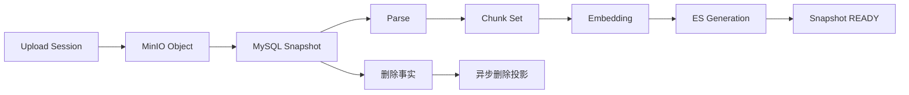

上传成功不等于 Snapshot READY。只有解析、切片、Embedding 和 Indexer 的必需 Receipt 都成功，Host 才允许交互链路使用这个 Snapshot。

#### 3.3.2 Transactional Outbox 解决事务和消息的夹缝

业务变更和消息投递不能靠两个独立操作。先写库再发 Kafka，进程可能在两者之间崩溃；先发 Kafka 再写库，Consumer 可能读不到 Snapshot。Outbox 把 `Source / Snapshot 状态变化` 和 `Outbox Event` 放进同一 MySQL 事务，Dispatcher 再把事件投递 Kafka。

Outbox 只保证事件意图随业务变更可靠落库，不保证下游 exactly-once。Kafka ACK 说明 Broker 接收了消息，不说明 Consumer 完成业务处理；Consumer 可能重复读到消息，因此还需要幂等键和处理 Receipt。业务状态在 MySQL 按条件推进，用户可见的终态则要等解析、索引或文件交付各自达到验收条件，不能把其中一个 ACK 当成整条链路成功。

#### 3.3.3 幂等、乱序和版本栅栏

每个阶段使用稳定幂等键，例如 `parse:snapshot:parserVersion`、`embedding:chunkSet:modelVersion` 和 `index:snapshot:generation`。Consumer 先登记执行记录，重复消息命中已完成 Receipt 就直接确认。

ES 写入携带 Snapshot ID 和 Generation。查询只接受当前 Head 对应的 Generation，旧任务晚到时不能覆盖新投影。删除先在 MySQL 写 Tombstone，读时立即按真源过滤，再异步删除 ES、缓存和反链。这样旧索引即使暂时存在，也不能重新暴露已经撤销的资料。

#### 3.3.4 失败、死信和未知结果

解析超时、Provider 429 和 ES 暂时不可用属于不同失败类型。暂时性失败进入退避重试，毒消息超过次数进入 Dead Letter；死信重驱前先检查 Snapshot 版本和当前状态。Worker 宕机时依赖 Lease 过期重新领取，旧 Token 不能写回。

ES 写入成功但 Callback 丢失是未知结果，不应该无条件重建。系统根据 Operation ID、Generation 和 Receipt 对账，确认成功就补状态，确认失败才补偿。监控不能只看 Kafka Lag，还要看 Outbox Oldest Ready、阶段耗时、READY 延迟和死信原因。

### 3.4 R：Result，怎么证明异步化有效

功能结果是当前配置允许 `128 MB` 单文件接入；启用 Kafka 时，上传完成请求不等待解析和索引。这个数字是接入边界，不是吞吐或并发承诺。上传完成方法目前还会合并分片、校验并写对象存储，而且位于数据库事务内；Kafka 关闭时还会同步解析。因此现阶段只能说解析和索引长任务从请求路径中拆出，不能说大文件接入本身已经完全流式化。Snapshot 能展示处理中间态，异步阶段可以单独重试，索引可以从 MySQL 和原文件重建。

性能和可靠性指标包括上传接口 P95、Parser 和 Embedding 阶段耗时、Snapshot READY 延迟、队列积压、Outbox Oldest Ready、死信率和重试成功率。故障注入包括 Worker 在阶段中途退出、Kafka 重复投递、ES 写入后回调断网、新 Snapshot 生成后旧任务晚到、删除消息延迟。结果不是简单的“处理成功率”，而是旧版本不会污染新版本，重复消费不会生成重复切片和重复版本。

### 3.5 5 分钟口述稿

这个亮点解决的是资料接入不能把解析和索引长任务塞进一次 HTTP 请求的问题。用户上传文件后，系统还要完成对象存储、解析、页码定位、切片、Embedding 和检索索引。解析或 Provider 变慢会占住请求线程，超时后用户也不知道是上传失败、解析失败、向量未完成，还是索引还没有发布。因此我把原文件、业务事实和检索投影拆开，并把后续处理做成可观测状态。

当前配置允许单文件最大 128 MB，这只是接入边界。请求先创建 Upload Session 并接收分片；完成上传时，Host 仍在请求线程内合并、校验、写入对象存储，并在 MySQL 中创建 Source、Snapshot 和 Task。启用 Kafka 后，同事务记录 Outbox，解析与索引再异步推进；关闭 Kafka 的本地路径会同步解析。MySQL 保存 Source、Snapshot、状态和版本，MinIO 保存原文件和中间文件，ES 保存检索投影。用户看到的 `READY` 不能由对象上传成功直接推出，必须核对所需解析和索引状态。当前完成上传路径仍有内存、对象存储延迟和事务时长风险，后续可把合并改为流式处理，并把对象写入与短数据库事务解耦。

Outbox 解决的是本地事务和消息投递之间的窗口。先写 MySQL 再发 Kafka，进程可能在中间崩溃；先发 Kafka 再写 MySQL，Consumer 可能读不到对应 Snapshot。把业务状态变化和 Outbox Event 放在同一事务里，Dispatcher 再投递 Kafka。这个保证只覆盖事件意图可靠落库，不代表 Kafka 或下游 exactly-once，所以每个阶段都要使用稳定幂等键，例如 `parse:snapshot:parserVersion`、`embedding:chunkSet:modelVersion` 和 `index:snapshot:generation`。

Kafka 消费默认关闭自动提交。阶段任务完成后登记 Receipt，再提交 Offset。重复消息命中已完成 Receipt 时可以直接确认，不能再次生成切片、扣 Embedding 费用或创建第二个索引 Generation。新 Snapshot、删除 Tombstone 和当前 Head 是版本栅栏，旧 Snapshot 的任务即使晚到，也只能写自己的 Generation，查询只接受当前 Head 对应的 Alias 和 Generation。

失败需要分类型处理。解析输入非法是永久失败，Provider 429、网络超时和 ES 暂时不可用属于可退避重试，超过次数的毒消息进入 DLQ。Worker 宕机依赖 Lease 过期重新领取，旧 Token 不能写回。ES 写入成功但 Callback 丢失属于未知结果，必须用 `operation_id`、Generation 和 Receipt 对账，确认已成功就补状态，无法确认才进入补偿，不能看到超时就无条件重建。

资料删除也不是把 Source 的状态改成 DELETED 就结束。Host 先写 Tombstone，让新查询和新任务立即排除 Snapshot；之后清理 ES、Redis、Summary、反链和 MinIO 临时对象，并为每个删除动作记录清理 Receipt。清理任务使用 `deletion_operation_id` 幂等，避免重试时误删新版本对象。

这套方案的代价是 Kafka、Outbox、幂等键、Generation 和重建逻辑增加了维护成本。换来的能力是启用 Kafka 时解析和索引不用等待在上传完成请求里，阶段可以单独重试，投影可以重建，删除和版本更新可以解释。固定回放时要把分片接收、完成上传和 Snapshot READY 分别计时，并记录合并峰值内存、事务时长、每阶段耗时、Outbox Oldest Ready、Kafka Lag、死信和旧 Generation 拒写数。128 MB 只能作为接入边界回答，不能说成吞吐、并发或生产容量。

一个容易被忽略的故障是 Kafka Lag 已经归零，但资料仍然搜不到。Lag 归零只说明消息已经被 Consumer 读取，不能证明解析 Receipt、Embedding、ES 写入和 Snapshot READY 全部完成。排查时我会从 Source 和 Snapshot 状态开始，查每个阶段的 Operation ID、Outbox 状态、死信、Projection Generation 和 Alias 指向，再看 ES 文档数和向量维度。这样能够区分消息没发出、任务已消费但执行失败、索引已写但 Alias 未切，还是 Snapshot 已被新版本替换。

容量上也不会从“用了 Kafka”推导出高并发。当前生产者配置 `acks=all`，Hikari 最大连接池默认 20，这些只是可靠性和保护参数。真正的吞吐要在固定硬件、文件类型、Parser、Embedding Provider、ES Bulk 和并发数下做阶梯压测，并记录峰值内存和故障恢复时间。

### 3.6 高频追问

**Kafka Lag 为零，为什么还是搜不到？**  
消息被消费不代表索引写入成功，更不代表 Snapshot 已 READY。要沿 Snapshot 检查每一阶段 Receipt、Generation 和最终状态。

**为什么不用 CDC？**  
当前事件需要表达 Snapshot、阶段和删除语义，Outbox 更直接；表多、下游多、轮询 Outbox 成为瓶颈后再评估 CDC。

**为什么不把 ES 当真源？**  
ES 适合搜索，不适合承载权限、版本和删除事实。投影可重建，事实必须可审计。

### 3.7 六模块补强：端到端案例、失败复盘、基础映射和数字证据

#### 模块一：完整 STAR 主回答

**Situation。** 大文件解析和索引如果同步执行，会占住请求线程；如果数据库、Kafka 和 ES 的写入没有清楚边界，就会出现业务显示成功但搜不到，或者新文件已经上传但旧任务晚到覆盖新索引。

**Task。** 我需要把资料处理拆成可观测的异步阶段，保证业务事件不丢、阶段可以重试、重复消息不产生重复副作用，新旧 Snapshot 和删除操作不会互相污染。

**Action。** 原文件进入 MinIO，MySQL 保存 Source、Snapshot 和阶段状态，ES 只保存 Projection。业务状态和 Outbox Event 在同一事务中写入，Dispatcher 投递 Kafka。每个阶段使用稳定幂等键、Receipt 和 Generation。Consumer 通过 Lease 领取，旧 Token 不能写回。删除先写 Tombstone，读路径立即过滤，后台再清理投影。Provider 超时或 Callback 丢失先进入 UNKNOWN_OUTCOME，通过 Operation ID 对账。

**Result。** 启用 Kafka 时，上传完成后解析和索引由异步链路推进，Snapshot 有可查询的处理状态；128 MB 是文件接入上限。重复投递、Worker 重启和旧任务晚到是否收敛，要用对应故障注入和业务状态断言说明。完成上传耗时、峰值内存和 Snapshot 可检索延迟需分别记录，不能把异步解析解释为整个上传请求没有同步成本。

#### 模块二：端到端案例

用户上传一份接近 128 MB 上限的课程 PDF。先创建 Upload Session 并逐片接收；完成上传请求仍需合并、校验并写原文件。启用 Kafka 时，Host 在 MySQL 事务中写 Snapshot、Task 和 Outbox，返回任务身份后，Dispatcher 才发布解析任务。Parser 生成页码和章节定位，Chunker 创建 ChunkSet，Embedding 写入模型版本，Indexer 写入 ES 的新 Generation。这个案例中的“异步”从解析任务开始，不能省掉上传完成阶段的耗时。

如果 Parser 成功但 Embedding Provider 返回 429，Snapshot 停在 RETRY_WAIT，不会被标记为失败，也不会让 QA 使用半成品。如果新版本 Snapshot 已经开始索引，旧版本 Indexer 晚到，Generation 校验拒绝旧写入。如果 ES 写入成功但回调丢失，对账任务依据 Operation ID 和 Generation 补写 Receipt。只有所有必需阶段成功，Snapshot 才进入 READY。

#### 模块三：失败复盘案例

**现象：** Outbox Dispatcher 已经 Claim 一条消息，进程随后退出，Snapshot 长时间停在 PROCESSING。  
**根因：** 原设计把 Claim 当成已投递，缺少 Lease 过期和重新领取语义。

**修复：** Outbox 记录 `claimed_at`、`claim_owner` 和租约过期时间。Dispatcher 只有在 Kafka 发布成功后才标记 SENT，Claim 超时的事件重新进入 READY。Consumer 侧用 event_id 和业务幂等键去重，重投不会重复解析或创建新 Snapshot。

**防复发：** 注入 Claim 后进程退出、Kafka 发布超时、重复发送和 Consumer 处理后宕机四个窗口，监控 Oldest Ready、Claim 超时、重试次数和死信原因。

#### 模块四：三个硬核追问

1. **Kafka Offset 什么时候提交？** 不能把 Offset 提交当成业务成功。要先完成幂等登记和必要状态持久化，再根据命令类型决定是否提交；业务终态由 MySQL 状态和 Receipt 判断。
2. **同一个 Snapshot 如何保证顺序？** 事件携带 Snapshot 和 Generation，分区键按聚合对象选择；即使跨分区或重放，也用版本栅栏拒绝旧事件，不能只依赖 Kafka 顺序。
3. **删除为什么先写 Tombstone？** 删除是一个高优先级事实，必须先阻断读路径；投影清理属于最终一致的副作用，晚一点完成也不能继续暴露旧资料。

#### 模块五：基础知识映射

| 项目机制 | 基础知识 | 面试落点 |
| --- | --- | --- |
| Outbox | 本地事务、最终一致 | 业务提交后事件不丢 |
| Claim Lease | 租约、故障接管 | Dispatcher 崩溃可恢复 |
| Consumer 幂等 | 唯一约束、幂等键 | 重复消息不重复副作用 |
| Generation | 乐观锁、版本栅栏 | 旧任务不能覆盖新投影 |
| Kafka | 分区、Offset、重平衡 | 顺序和消费确认边界 |
| MinIO | 对象存储、生命周期 | 大文件与业务元数据分离 |
| MySQL | 事务、索引、锁 | 真源和状态机持久化 |

#### 模块六：数字证据卡

```text
功能边界：128 MB 单文件异步接入
链路指标：上传 P95、Parser 耗时、Embedding 耗时、Indexing 耗时、READY 延迟
可靠性指标：Outbox Oldest Ready、Kafka Lag、Claim 超时、死信率、重试成功率
一致性指标：重复消费数、旧 Generation 拒写数、重复 Version 数、删除残留数
故障注入：Claim 后退出、Worker Kill、Kafka 重复、ES 回调断网、旧任务晚到
容量指标：每小时文件数、平均页数、Chunk 数、Embedding 批大小、Provider 429
结果口径：固定文件回放和故障注入中的 READY 延迟、阶段重试收敛、死信和旧版本拒写；128 MB 是配置边界，不是吞吐承诺
```

---

## 4. 亮点四：Schema 驱动的产物生成框架

### 4.1 S：Situation，生成文件不是一次 Prompt

报告、测验、课程笔记、视频摘要和 PDF 讲义都可以调用模型，但它们的输入、输出、引用、工具和交付完全不同。一次 Prompt 的方案在短文本上足够，一旦产物变长，资料获取、章节规划、生成、校验、渲染和文件上传混在一条链上，任一步失败都需要整份重做。

自由 Agent 又带来另一个问题：模型可能根据 Prompt 选择未授权的工具，输出字段不稳定，或者把尚未上传完成的文件当成成功。系统需要同时保留 Agent 的灵活性和工程上的确定边界。

### 4.2 T：Task，把模型的不确定性收进确定契约

我的目标是让新增产物类型尽量只增加 Skill 定义，而不是复制一套 Prompt 和状态机。要守住的约束是：输入必须完整，输出必须符合 Schema，工具必须经过 Capability Policy，长任务可以恢复，内容成功和文件交付必须分开。

### 4.3 A：Action，Skill、Graph、Host 和 Worker

#### 4.3.1 Skill 是产品契约

SkillDefinition 包含 `skill_key`、版本、输入 Schema、输出 Schema、资料要求、能力白名单、执行节点、验证规则和交付策略。用户选择的是“PDF 课程笔记”，不是直接编辑 Prompt。提交后冻结 Skill Version 和 InputSnapshot，重试不会因为 Catalog 更新而改变任务含义。

#### 4.3.2 用 Skill Graph 编译执行规格

Compiler 根据 Skill、用户输入和能力集合生成 ExecutionSpec。节点可以是 LoadContext、RetrieveSource、PlanSections、GenerateSection、BindCitation、Verify、Repair、Render 和 Archive。编译时检查节点类型、Schema、环依赖、能力白名单和预算。

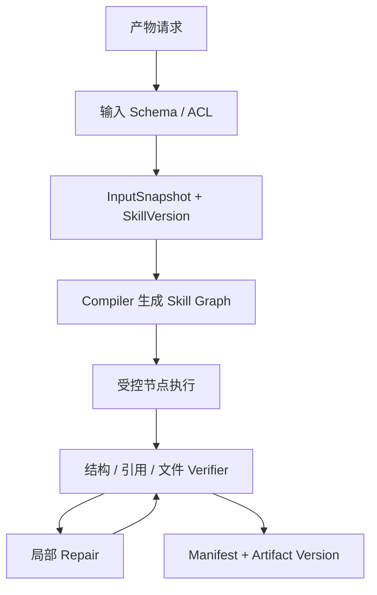

它不是固定 Workflow，因为 Graph 可以随 Skill 和输入变化；也不是自由 Agent，因为节点类型、工具、写回位置和完成条件不能由模型临时增加。模型灵活性只存在于受控节点内部。

#### 4.3.3 Java Host + Python Worker 的提交权设计

Host 创建 ArtifactJob、Task、Version 和 Operation ID，冻结输入，负责 Workspace 权限、配额、幂等、文件元数据和最终提交。Worker 负责模型、解析、Embedding、MCP 和局部验证，只回传 Candidate、Progress 和中间文件。

Worker 不直接写业务 Version，是因为它可能重复、超时、晚到或被错误输入驱动。Host 收到结果后校验 Lease、Fencing、Skill Version、Schema、引用和 Manifest，再创建内部 Version。这样最终副作用集中在控制面，回滚和审计也更清楚。

#### 4.3.4 MCP 和 Harness Engineering

MCP 统一音视频转写、视频元数据和内容理解等外部能力的发现、参数 Schema 和结果格式。生产只启用系统注册的 MCP，Capability Policy 在 Host 编译时确定，用户不能通过一句 Prompt 临时注册工具。

Harness Engineering 的重点是把模型放在安全轨道里：模型可以生成候选和选择内容路径，但不能决定能调用什么、能写到哪里、何时算完成。工具调用带 Workspace、Source Snapshot、Operation ID、超时和预算，结果通过 Receipt 对账。

#### 4.3.5 Verifier、Repair 和三阶段成功

Verifier 先做确定性检查，再做语义检查。确定性检查包括字段、章节数量、引用格式、文件类型和 Manifest；语义检查关注内容是否覆盖资料和用户要求。Verifier 输出结构化问题，Repair 只重做受影响节点，不能无限整份重生成。

产物有三种成功：内容成功，表示 Schema 和质量通过；投递成功，表示文件和 Manifest 已记录；交付成功，表示所有必需文件 READY，用户可以下载。把三种成功拆开，才能处理“内容通过但 PDF 上传失败”和“Callback 超时但文件已存在”。

### 4.4 R：Result，如何证明框架有价值

功能结果是新增报告、测验和课程笔记时复用统一 Skill、Schema 和验证框架，减少重复 Prompt 和流程开发。工程结果包括 Schema 通过率、局部 Repair 成功率、平均重做节点数、文件 Manifest 完整率、交付成功率和重复版本数。

一次 Prompt 整体生成可以作为基线，与 Skill Graph、Verifier 和受控 Repair 的路径比较。两组使用相同输入，分别记录 Schema 不合格、引用缺失、失败恢复时间、重复文件和非法工具调用。当前可确认的能力是多类型产物的 Skill 与执行契约；Schema 通过率和交付成功率只有在固定评测、Manifest 与文件状态共同验收后才形成可报告数字。

### 4.5 5 分钟口述稿

这个亮点解决的是报告、测验、课程笔记和 PDF 讲义不能靠复制 Prompt 扩展的问题。不同产物有不同输入资料、输出结构、工具权限和交付条件。一次 Prompt 失败通常需要整份重做，自由 Agent 还可能临时增加工具、写入未授权路径，或者把“内容生成成功”误报成“文件已经可以下载”。

我把稳定能力抽象成 `SkillDefinition`。一个 Skill 至少包含 `skill_key`、版本、输入 Schema、输出 Schema、资料要求、Capability Policy、执行节点、Verifier 规则和 Delivery Policy。用户选择的是“课程讲义”这种产品能力，Host 冻结 Skill Version、Source Snapshot 和 Memory Revision，再由 Compiler 生成 `ExecutionSpec`。这样重试时不会因为 Skill Catalog 更新而改变原任务含义。

Skill Graph 不是任意 DAG。Compiler 先检查节点类型是否注册、Schema 是否兼容、是否存在环、节点需要的 Capability 是否在白名单、预算是否足够。典型节点包括 LoadContext、RetrieveSource、PlanSections、GenerateSection、BindCitation、Verify、Repair、Render 和 Archive。模型只能在受控节点内部决定候选内容或局部路径，不能临时添加一个外部工具，也不能决定什么时候算完成。

Java Host 负责 ArtifactJob、Task、Artifact Version、权限、配额、幂等和最终提交。Python Worker 负责模型、检索、解析、MCP 和局部 Repair。Worker 只能返回 Candidate、Progress、Receipt 和临时文件 Manifest，不能直接创建用户可见的 Artifact Version。Host 收到结果后校验 `skill_version`、`input_snapshot_id`、Schema、ACL、Lease、Fencing 和 Manifest，再用条件更新提交状态。

以生成课程 PDF 为例，Host 先冻结输入和能力白名单，Compiler 从注册的 Graph 模板解析节点依赖，形成有序执行计划。当前 Worker 沿 `node_sequence` 执行，节点验证后可以对缺失字段、章节或引用做受控补全，并留下 Node Trace；它不等于所有产物都支持失败章节重新调用模型并只重跑下游节点。后者需要持久化节点输入、输出、依赖版本和副作用 Receipt，属于明确的演进方向。内容通过后，系统将预留的 Version 保持在不可交付状态，核对文件 Key、Content-Type、大小、校验和与文件状态；必需文件 READY 后才允许下载。

MCP 解决的是能力发现、输入输出 Schema 和调用协议，不是权限系统。Host 在编译 Skill 时决定可用 Capability，外部工具输出视为不可信输入，仍要经过 Schema、路径、Workspace、响应大小、超时和 SSRF 检查。当前 Artifact Kafka Consumer 是执行长任务后再提交 Offset，因而任务时长受 `max.poll.interval.ms` 等消费配置约束；演进方案才是先登记 Durable Execution、快速提交 Offset，再由 Scheduler 申请 Lease 执行。两者的提交时点和故障恢复责任不能混为一谈。

这套方案的代价是 Skill Catalog、Graph Compiler、Verifier、Manifest、Receipt 和多阶段状态都要维护。收益是新增产物主要增加 Skill 和 Schema，失败时可以局部 Repair，内容成功、投递成功和交付成功不会被混成一个布尔值。评测应同时记录 Schema 通过率、Repair 收敛率、重做节点数、Manifest 完整率、重复 Version 数、交付成功率和未知结果对账率，不能只说“生成质量更好”。

我遇到的核心设计问题是 Callback 成功不等于交付成功。Worker 可能已经生成内容，但 PDF 上传失败；也可能文件已经存在，Callback 响应却丢失。如果直接把 Job 标成成功，用户会看到无法下载的 Version；如果无条件重试，又可能生成两个同名文件。因此我把内容验证、文件投递和用户交付拆成三个确认点，并用 `operation_id`、Delivery Token、文件校验和和 Receipt 对账。`DELIVERY_PENDING` 只能继续补文件或对账，不能被下载接口当作 READY。

当前 Artifact Consumer 每次只 Poll 一条消息，关闭自动提交，在 Executor 完成、识别到旧 Delivery Token，或者失败已经被可靠上报后才提交 Offset。MCP 超时默认 3600 秒，`max.poll.interval` 默认 4200 秒。这能保证当前单 Worker 闭环，但会让分区被长任务占用，所以目标演进是先登记 Durable Execution 再提交 Offset。真实外部写回目前仍按模拟 Host Callback 和协议回放回答，不能包装成已经接入多个第三方生产系统。

我的主要 Ownership 是 Java Host 的 Job、Version、Manifest 和提交边界，以及 Host 与 Python Worker 的 Command、Callback 和 Delivery Token 契约。具体 MCP Provider 和部分内容生成节点按本人实现、契约验收或目标设计分别说明。

### 4.6 高频追问

**这和固定 Workflow 有什么区别？**  
节点类型和安全边界固定，但 Graph 可以根据 Skill 和输入编译，属于受控 Agentic Workflow。

**为什么 Worker 不能直写 Artifact Version？**  
Worker 是不稳定执行面，可能重复和晚到。Host 集中提交权才能保护权限、版本和幂等。

**为什么不用一个更强的模型解决结构漂移？**  
模型能力不能替代 Schema、权限、Manifest 和未知结果处理。结构门禁必须由程序控制。

### 4.7 六模块补强：端到端案例、失败复盘、基础映射和数字证据

#### 模块一：完整 STAR 主回答

**Situation。** 报告、测验、课程笔记和 PDF 讲义都有模型生成，但它们的输入资料、输出结构、工具权限和文件交付条件不同。一次 Prompt 生成失败后通常只能整份重做，自由 Agent 还可能选择未授权工具或生成无法解析的结构。

**Task。** 我要让新增产物类型主要增加 Skill 定义，而不是复制 Prompt 和状态机。同时必须把模型输出限制在 Schema、Capability Policy 和交付门禁内，区分内容成功、投递成功和用户可下载的交付成功。

**Action。** Skill Catalog 定义输入输出 Schema、资料要求、允许能力、Execution Graph、Verifier 和 Delivery Policy。Compiler 把 Skill 和冻结的 InputSnapshot 编译成受控 ExecutionSpec。Java Host 管理 Job、权限、Version、配额和最终提交，Python Worker 执行模型、检索、MCP 和局部 Repair。Verifier 产生结构化问题，Repair 只重做受影响节点。MCP 只允许系统注册能力，所有外部调用带 Operation ID 和 Receipt。

**Result。** 当前能够展示多种 Artifact 复用 Skill 与 Graph 契约，以及内容通过、文件未 READY 时保持不可交付的状态。减少多少重复开发、Schema 通过率和交付成功率是否提升，需要同一输入下的基线回放和文件 Manifest 统计；节点级模型局部重跑不能用现有确定性补全的 Trace 代替。

#### 模块二：端到端案例

用户请求生成“某门课程的 PDF 讲义”。Host 校验资料范围和输入 Schema，冻结 Skill Version、Source Snapshot 和 Memory Revision，Compiler 生成加载资料、规划章节、生成内容、绑定引用、验证、渲染和归档节点。Scheduler 申请 Workspace 速率令牌和 Active Lease。

Worker 生成第二章时发现引用不足，Verifier 在 Node Trace 中记录缺口。当前可执行路径是按已有资料范围做受控引用补全，或者让候选保持未通过。若要重新调用模型只生成第二章，并只重跑该节点及下游渲染，还需要持久化节点输入、输出、依赖版本和副作用 Receipt；这是下一阶段的设计，不属于当前已实现能力。内容通过后，预留 Version 仍不能交付；PDF 文件状态与校验信息确认后才对用户可见。上传结果未知时先核查对象和回调记录，再决定补写状态或重试。

#### 模块三：失败复盘案例

**现象：** 生成任务返回内容通过，但用户看到两个同名 PDF，或者页面显示成功但文件下载失败。  
**根因：** 原设计把“Worker 回调成功”当成“Artifact Version 成功”，没有区分内容、投递和交付三个确认点。

**修复：** Host 预分配唯一 Version ID，内容通过后进入 DELIVERY_PENDING，文件必须按 Manifest 逐项 READY 才提升版本。文件上传、回调和版本提交都使用 Operation ID 和幂等键，未知结果先对账，不重复创建 Version。

**防复发：** 注入 Worker Kill、文件上传成功后断网、Callback 重复和 Host 提交前重启，断言同一 Operation 只有一个业务版本，且未 READY 文件不会被用户下载。

#### 模块四：三个硬核追问

1. **为什么局部 Repair 不能无限执行？** Repair 次数和预算必须有上限，否则错误 Prompt 可能消耗全部资源，且反复修复会造成结构漂移。超过预算进入 NEEDS_REVIEW。
2. **MCP 白名单和 Workspace ACL 是什么关系？** 白名单限制系统能调用哪些能力，ACL 限制这次调用能看哪些资料。两者必须同时校验，MCP 不能替代租户授权。
3. **为什么内容通过后还不能立即发布用户版本？** Version 可以提前预留身份，内容和文件交付仍是不同阶段。PDF、图片和索引文件可能部分成功，必需文件状态全部 READY 后才能开放下载，避免用户看到不完整产物。

#### 模块五：基础知识映射

| 项目机制 | 基础知识 | 面试落点 |
| --- | --- | --- |
| Skill Schema | JSON Schema、契约设计 | 输入输出结构稳定 |
| Execution Graph | DAG、拓扑排序、状态机 | 节点依赖和局部恢复 |
| Host / Worker | 控制面与执行面 | 提交权和候选边界 |
| MCP | 协议、工具发现、参数校验 | 外部能力统一接入 |
| Quota / Lease | 令牌桶、并发控制 | 防突发和资源耗尽 |
| Repair | 局部重算、错误传播 | 减少整份重生成 |
| Manifest | 两阶段交付、幂等 | 防半成品版本 |

#### 模块六：数字证据卡

```text
基线：一次 Prompt 整体生成
质量指标：Schema 通过率、引用完整率、结构漂移率、Repair 成功率
可靠性指标：重复 Version 数、Manifest 缺失率、UNKNOWN_OUTCOME 对账成功率
资源指标：单 Artifact Token、Provider 调用次数、平均 Repair 节点数、Active Lease 占用
安全指标：非法 Tool 调用拦截数、越权资料访问数、路径和 SSRF 拦截数
故障注入：节点失败、Worker Kill、MCP 超时、文件上传断网、Callback 重复
结果口径：Candidate Schema 通过、Repair 收敛、必需文件 READY、重复 Version 拒绝和未知写回对账；真实外部写回按模拟协议边界回答
```

---

## 5. 亮点五：Context Engineering 与长期 Memory

### 5.1 S：Situation，长上下文和自动记忆会互相污染

长会话最简单的实现是把最近 N 条消息放进 Prompt，或者不断扩大窗口。前者会丢掉早期仍有效的约束，后者会引入无关话题、Token 膨胀和 Context Rot。更危险的是，系统可能把一条模型推断或外部资料自动写进长期记忆，下一次回答又把它当作用户事实。

因此 Context 和 Memory 是两个问题。Context 是本次模型实际看到什么，生命周期短；Memory 是什么信息可以跨会话复用，生命周期长，必须有来源、Scope、版本和撤销。Evidence 又是第三个信任域，只能来自当前可见资料。

### 5.2 T：Task，压缩输入但不丢事实和边界

目标是降低平均输入 Token，同时保留当前问题、关键约束、必要原文和可回放能力。要守住的约束是：摘要不能覆盖原始消息，旧摘要不能覆盖新消息，Memory 不能参加资料引用，任务启动后输入不能漂移，删除和撤销要能传播到缓存和后续编译。

### 5.3 A：Action，Context Compiler 和 Memory Gate

#### 5.3.1 Raw Message Ledger、Topic Segment 和增量摘要

每条消息先进入 MessageLedger，带 sequence、时间、会话和主题信息。按当前任务、显式对象、Query 语义和相邻消息划分 Topic Segment。主题置信度低时保留原文，不把消息强行塞进错误 Segment。

每个 Segment 有版本化 Summary Revision，记录覆盖区间、Source Version、内容 Hash 和状态。新增消息通常只影响活动 Segment，因此只重算尾部，稳定的前序摘要不重复生成。摘要晋升时用 Segment Version 做 CAS，期间有新消息就标记旧摘要 Stale，不能覆盖新状态。

#### 5.3.2 Context Compiler 不是字符串拼接

Compiler 依据 Mode、Conversation Cutoff、活动主题和 Token Budget 选择 System、任务契约、当前问题、相关摘要、Recent Raw Tail、显式 Pin、Memory Pack 和 Evidence Bundle。每个 Section 有独立预算和优先级。超预算先去重和压缩低价值历史，再减少远期摘要和低优先级 Memory，不静默删除当前问题、关键约束和必要 Evidence。

Research 和 Artifact 启动时创建 RunInputSnapshot，冻结可见 Source Snapshot、Conversation Cutoff、Summary Revision、Memory Revision 和策略版本。这样任务执行期间新增消息不会悄悄改变输入，重试也能复现同一上下文。

#### 5.3.3 Memory Candidate、门控和 Revision

Memory Candidate 可以来自用户明确保存、反复纠正、稳定偏好和确认决策。每个 Candidate 带来源、提取方式、Scope、类型、敏感性和有效期。经过类型白名单、重复、冲突、敏感性和 Scope 检查后，低风险且明确确认的偏好可以晋升；模型推断、行为信号和外部资料只能进入 Review。

Memory 不原地覆盖，而是创建新 Revision，记录 supersedes。撤销时产生 Revoke 事件，让 Context Pack、缓存和后续任务失效。这样可以解释记忆的来源和生命周期，也能支持删除。

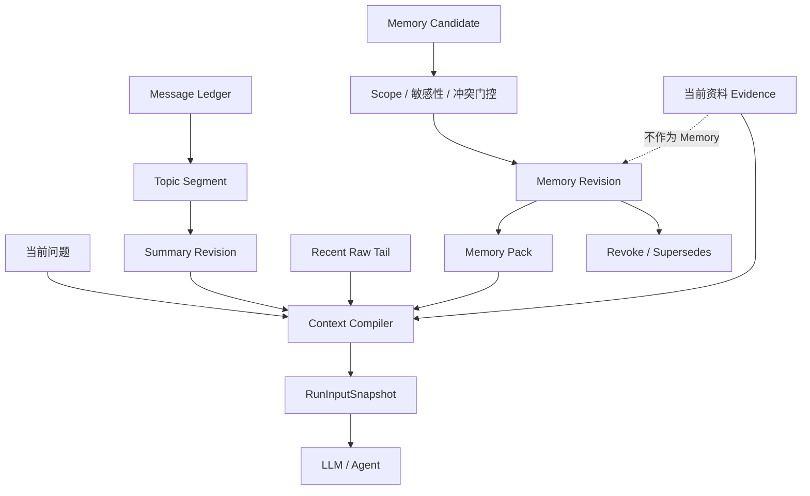

#### 5.3.4 Evidence Isolation

Memory 可以影响格式偏好、语言风格和已确认协作规则，但不参与 Source Recall、Citation 和 Evidence Rerank。资料事实必须来自当前可见 Source Snapshot。即使 Memory 中保存了“用户认为某课程是闭卷”，它也不能成为课程考核方式的引用。

这条链路涉及的知识点包括：Context Window、Context Rot、Token Budget、Topic Segmentation、增量摘要、版本化摘要、CAS、Memory Candidate、Scope、Revision、Revoke、Prompt Injection、敏感信息删除和 Evidence Isolation。真正的设计难点不是把历史压缩得更短，而是压缩以后仍然知道哪些内容可以影响偏好，哪些内容只能作为事实证据，以及一次长任务到底看到了哪个版本的上下文。

### 5.4 R：Result，怎么证明上下文工程有效

结果指标分三层。效率层看平均输入 Token、Context 构建耗时和重复摘要比例；质量层看关键约束保留率、主题切换后的相关性和摘要回读准确率；安全层看误晋升率、撤销传播、敏感信息残留和 Memory 进入 Evidence 的违规次数。

简历中的输入 Token、关键约束保留和 Memory 误晋升需要对比全量历史回放基线，并固定问题集和人工标注的关键约束。工程验证可以注入新消息覆盖摘要、删除含敏感信息的消息、撤销 Memory、任务执行中修改用户偏好等场景，确认旧版本不会继续进入新 Run。

### 5.5 5 分钟口述稿

这个亮点解决两个相互关联的问题。长会话每次全量回放会让 Token 成本持续增长，也会把旧话题和当前任务混在一起；只保留最近 N 条消息虽然便宜，却可能丢掉早期已经确认的限制。自动 Memory 更危险，如果把模型推断或外部资料直接存成用户事实，下一次回答又会把这条错误记忆当作依据。

我把 Raw Message、Summary、Memory 和 Evidence 分成不同信任域。Raw Message Ledger 保存原文、序号、会话和版本，消息按主题形成 Topic Segment。主题置信度低时保留原文，不强行分类。活动 Segment 使用增量 Summary Revision，只重算新增消息影响的部分，同时保留 Recent Raw Tail，避免摘要把刚发生的细节过早压缩掉。

Context Compiler 不是把几段字符串简单拼起来。它先读取当前任务类型和 Token Budget，再选择系统约束、当前问题、相关 Summary、近期原文、显式 Pin、Memory Pack 和 Evidence Bundle。各部分有独立预算，超出上限时优先保留系统约束、当前问题和可引用 Evidence，再压缩旧 Summary 和低相关 Memory。Research 和 Artifact 启动时创建 `RunInputSnapshot`，把当时使用的 Message Head、Summary Revision、Memory Revision、Source Snapshot 和策略版本冻结下来。任务重试继续读取同一份快照，不会因为用户新发了一条消息就改变执行输入。

摘要通过 Segment Version 做 CAS。假设 Worker 基于版本 12 生成摘要，但生成期间又来了两条消息，Segment 已经变成版本 14，那么版本 12 的摘要不能覆盖新状态。系统可以重新生成摘要，或者临时回退到旧摘要加 Recent Raw Tail。这样摘要是可重建投影，原始消息才是真源。

长期 Memory 先形成 Candidate，再经过来源类型、Scope、敏感性、冲突和用户确认门控。用户明确确认的低风险偏好可以晋升为 Memory Revision，例如语言、输出格式和长期协作方式。模型推断、外部网页和资料内容只能进入 Review，不能直接晋升为用户事实。Memory 只影响协作偏好和输出约束，不参与 Source Recall、Citation 或 Evidence Rerank。资料事实必须从当前可见 Source Snapshot 重新取得，防止 Memory 自己证明自己。

冲突规则是确定的：当前用户明确输入优先于旧 Memory，用户明确偏好优先于模型推断，Source Evidence 负责资料事实，删除和撤销事件优先于所有派生缓存。用户撤销一条 Memory 时，新 Revision 记录 Revoke，Compiled Memory Pack 失效，之后的新 Run 不再读取；已经启动的 Run 仍按冻结的 RunInputSnapshot 执行，除非是权限撤销或敏感信息删除，这类安全事件需要中止或重新授权。

这个方案的代价是增加 Segment、Summary Revision、Memory Revision、RunInputSnapshot、缓存失效和删除传播。收益是每次模型调用可以回放当时输入，摘要更新不会覆盖新消息，记忆错误可以撤销，资料引用也不会被偏好污染。评测不能只看平均 Token，还要用固定约束保留集观察关键约束保留率、主题切换相关性、事实回读一致率、Memory 误晋升率、撤销传播延迟和敏感信息残留数。没有正式评测 Manifest 时只讲指标和机制，不填写百分比。

在缓存层，Compiled Memory Pack 的 Key 不只包含 Workspace，还包含 Actor Fingerprint、Pack Type、Request Fingerprint、Policy Version 和 State Fingerprint。Memory Revision 或策略发生变化后，新请求自然使用新 Key，旧缓存等待 TTL 回收，不依赖全量扫描删除。删除敏感内容时不能只等 TTL，Host 先写 Revoke 和 Tombstone，让编译器立即排除旧 Revision，再异步清理 Summary、缓存和派生记录。

我的核心 Ownership 是 Context Compiler 的输入层次、RunInputSnapshot、Memory Candidate 到 Revision 的门控，以及 Memory 和 Evidence 的隔离规则。摘要模型可以替换，用户事实不能由模型推断自动晋升、资料事实不能由 Memory 提供 Citation，这两条不变量保持不变。

### 5.6 高频追问

**摘要错了怎么办？**  
原始消息永远保留，摘要记录覆盖区间和版本，发现不一致时回读原文生成新 Revision，旧摘要标记 Stale。

**为什么不让模型直接写 Memory？**  
模型推断可能错误，外部内容可能包含注入。Candidate 和 Gate 把晋升变成可审计的业务状态。

**Memory 为什么不参与 RAG？**  
RAG 证明资料事实，Memory 表达协作偏好。两者混合会破坏引用和删除语义。

### 5.7 六模块补强：端到端案例、失败复盘、基础映射和数字证据

#### 模块一：完整 STAR 主回答

**Situation。** 长会话如果全量回放，会产生 Token 膨胀、主题串线和旧信息污染；如果只保留最近 N 条，又会丢失早期确认的关键约束。自动记忆还可能把模型推断或外部资料写成长期事实，下一次回答继续引用错误。

**Task。** 我要降低输入成本，同时保留当前问题、关键约束和必要证据，并让每一次 Research 或 Artifact 都能回放当时实际看到的输入。长期 Memory 必须有来源、Scope、版本、冲突处理和撤销传播，而且不能参与资料事实引用。

**Action。** Raw Message Ledger 保存原文，消息按主题形成 Segment，活动 Segment 使用增量 Summary Revision。Context Compiler 按任务和 Token Budget 选择 Summary、Raw Tail、显式 Pin、Memory Pack 和 Evidence Bundle，任务启动时创建 RunInputSnapshot。Memory 先产生 Candidate，经过类型、Scope、敏感性和冲突门控，再晋升为可撤销 Revision。新版本不覆盖旧版本，撤销通过 Revoke 事件使缓存和后续 Context 失效。Memory 只影响偏好和协作约束，不参与 Source Recall、Citation 和 Evidence Rerank。

**Result。** 当前能展示版本化摘要、Memory Pack 编译、撤销后的状态指纹变化和冻结的 RunInputSnapshot。平均输入 Token、关键约束保留率与误晋升率需要对同一会话和任务集分别评测；撤销传播和任务重试则用状态与回放断言证明，不能把机制存在直接写成百分比收益。

#### 模块二：端到端案例

用户在对话中先确认“课程笔记先给结论，再给原文定位”，随后讨论另一门课程。系统把格式偏好提取为 USER Scope 的低风险 Candidate，经用户确认后形成 Revision。下一次生成 Note 时，Context Compiler 把偏好放进独立 Memory Pack，但仍然从当前课程 Snapshot 召回 Evidence。

用户后来撤销该偏好。系统创建 Revoke 事件，使当前 Memory Pack 缓存失效；正在运行的 Research 继续使用启动时冻结的旧 Revision，并在下一次任务使用新状态。若用户要求删除包含敏感信息的历史消息，MessageLedger 保留审计所需的删除标记，Summary Revision、Memory Candidate 和缓存都按来源关系进入脱敏或失效流程。

#### 模块三：失败复盘案例

**现象：** 用户删除了一条包含姓名的历史消息，但后续问答的摘要仍然提到该姓名。  
**根因：** 摘要被当成独立文本缓存，没有记录覆盖消息区间和来源版本，删除操作无法传播到摘要和 Memory Candidate。

**修复：** Summary Revision 保存覆盖区间、Segment Version 和内容 Hash；删除事件根据来源关系标记相关摘要 Stale，重新编译 Context 时回读原文并排除已删除消息。候选记忆也必须保留 Provenance，来源被删除后进入撤销或脱敏。

**防复发：** 增加摘要重算、消息删除、Memory 撤销和正在执行 Run 的版本隔离测试，监控敏感信息残留、Stale 摘要数量、误晋升和撤销传播延迟。

#### 模块四：三个硬核追问

1. **为什么需要 RunInputSnapshot？** 长任务执行期间消息、资料和 Memory 都可能变化，不冻结输入就无法解释重试差异，也无法复现一次错误。
2. **多个 Memory 冲突怎么办？** 不原地覆盖，创建新 Revision，按 Scope、有效期、用户显式确认和版本关系裁决；冲突不能靠最后写入时间粗暴覆盖。
3. **为什么摘要也要版本化？** 摘要是有损投影，随着新消息会变化；版本化才能让历史 Run 读到当时的摘要，并在新消息到来时拒绝旧摘要覆盖。

#### 模块五：基础知识映射

| 项目机制 | 基础知识 | 面试落点 |
| --- | --- | --- |
| Segment Version | 乐观锁、CAS | 摘要不覆盖新消息 |
| Summary Revision | 事件版本、可回放 | 原文和压缩结果分离 |
| Context Compiler | 编译器、预算分配 | 按任务构建输入 |
| Memory Gate | 数据治理、信任边界 | 候选不能直接成为事实 |
| Revision / Revoke | 版本化和撤销 | 支持纠正、删除和审计 |
| Evidence Isolation | 数据血缘、Prompt 安全 | 记忆不能自证事实 |

#### 模块六：数字证据卡

```text
基线：全量历史回放或最近 N 条消息
效率指标：平均输入 Token、Context 构建耗时、摘要重算次数
质量指标：关键约束保留率、主题切换相关性、摘要回读准确率
治理指标：Memory 误晋升率、冲突率、撤销传播延迟、敏感信息残留数
版本指标：RunInputSnapshot 重试一致率、Stale Summary 覆盖拒绝数
故障注入：新消息覆盖摘要、删除消息、撤销 Memory、任务中途修改偏好
结果口径：固定约束保留集上的输入 Token、关键约束保留、事实回读一致和 Memory 误晋升；具体数值以评测 Manifest 为准
```

---

## 6. 横向硬核设计：把五条亮点串成一个系统

### 6.1 真源、投影、候选和版本

五条亮点表面不同，底层共享同一个设计思想：不让派生结果反向成为事实。Source Snapshot 是资料事实，ES 是检索投影；Research Candidate 是模型候选，Cell Verified 是经过门禁的状态；Artifact Candidate 是中间产物，Artifact Version 是交付事实；Summary 是压缩投影，MessageLedger 是原文；Memory Candidate 是待治理信号，Memory Revision 是可撤销事实。

这套模型让系统可以回答“它从哪里来、何时生效、谁提交、是否仍然有效”。如果所有对象都只保留一个当前字符串，系统就无法解释旧版本、删除、并发写回和失败恢复。

### 6.2 为什么不全部用 Redis

Redis 适合低延迟和原子协调，不适合保存需要审计、版本和长期恢复的业务事实。Quota、Lease 和短缓存可以放 Redis；Source、Snapshot、Run、Cell、PageVersion 和 MemoryRevision 必须在 MySQL。Redis 不可用时，配额类高风险能力 Fail Closed，ACL 和状态类数据回源 MySQL，不能把空缓存解释成没有权限或没有事件。

### 6.3 为什么不全部用一个 Agent

一个万能 Agent 可以减少入口代码，但会把 QA、Research、Artifact 和 Memory 的成功条件混在一起。问答的成功是证据支撑，Research 的成功是必填 Cell 验证，Artifact 的成功是 Schema 和文件交付，Memory 的成功是门控晋升。统一入口可以存在，统一状态和统一完成条件不应该存在。

### 6.4 容量规划按负载分别估算

先区分同步 QA、资料处理、Research 和 Artifact 四种负载。同步 QA 主要受检索、Rerank 和连接池影响；资料处理受文件大小、切片数、Embedding 和 ES 写入影响；Research 受 Cell 数、搜索预算和 Provider 限制；Artifact 受节点并发、渲染和文件交付影响。

容量估算用 Little's Law 和最小瓶颈思路，不从线程数直接宣称 QPS。解析、Embedding 和 Indexer 分别测稳态吞吐，按最慢阶段配置队列和 Worker。长任务按 Workspace 和 Workload 申请 Active Permit，QA 保留独立资源，避免一个大任务耗尽所有连接和 Provider 配额。

---

### 6.5 五层追问背后的系统边界

#### 6.5.1 项目与个人职责

> NoteWeave 面向个人资料研究和长期知识沉淀。早期有学校场景原型，v2 在 2026.05 至 2026.08 集中做工程化重构。我主要负责 Java 控制面、资料和任务版本、RAG 检索、Research 状态与恢复，以及 Host 与 Worker 的提交契约。五条亮点沿一份资料从接入、检索、研究到产物和记忆的路径展开，不是五个互不相关的 Demo。128 MB 是单文件接入配置边界，固定 Fixture 的数字只说明离线回放结果；没有足够数据支持的线上用户数、QPS 和 SLO，我不把它们写成项目成绩。

#### 6.5.2 系统如何划分提交权

> MySQL 保存 Source、Snapshot、Run、Cell、Version 和权限等业务事实，MinIO 保存原文件和交付文件，ES 是检索投影，Redis 承担短缓存和协调，Kafka 传递异步意图。Java Host 决定资料范围、权限和状态提交，Python Worker 负责长任务探索和候选生成，不能直接把模型输出写成用户可见事实。同步 QA 在 Evidence 足以支撑回答时完成，资料处理要达到所需的 READY 状态，Research 按 Cell 验证或留下明确缺口，Artifact 必须通过内容和文件交付门禁。

#### 6.5.3 出故障后为何不会悄悄重复或越权

> Source 状态与 Outbox 在同一 MySQL 事务中提交；Dispatcher Claim 后崩溃，由超时 Lease 接管。Kafka 可能重复、乱序或 Rebalance，所以 Consumer 用幂等键和 Receipt 防重复，Worker 回调还要通过 Attempt Epoch、Fencing 和 Expected Version。Provider 或文件调用结果不明时先对账，不能盲目重试。删除先写 Tombstone 阻断新读取，旧 ES 索引和缓存即使还没清理，也过不了读时的当前 ACL 和版本检查。Rerank、Embedding、MCP、MinIO 或 ES 失败时，系统按任务语义降级、等待或正确失败，不把半成品标成成功。

#### 6.5.4 基础知识怎样落在具体链路上

> Spring 本地事务只能保证 MySQL 内的状态和 Outbox 一起提交，Kafka ACK 和 ES 写入在事务之外，要靠幂等、Receipt 与补偿收敛。MySQL 条件更新拒绝旧版本，Redis Lua 适合原子扣减配额，Kafka Offset 只表示消费进度。BM25 保专名和数字，Vector 覆盖语义表达，RRF 融合名次，Rerank 重估相关性，Evidence Selection 才判断证据组合能否支撑 Claim。Chunk 适合召回，Reading Window 适合精读，PageVersion 保存知识页面历史，Source Snapshot 固定资料版本。线程池并发还受连接池、Kafka 分区和 Provider 配额约束，队列必须有界。

#### 6.5.5 结果、回滚与适用范围

> 我会把基线、输入集、分母、指标和代价放在同一张评测记录里。当前固定 Fixture 能验证部分 QA／Note 消融和回归，不能证明线上百分比收益；故障注入能验证重复、迟到和中断恢复，不能称作生产事故。统一 Vector TopK 曾是验证需求的简单方案，后来因专名召回、连续阅读和 Wiki 写回的不同需求拆成三条链路。发布新 Embedding 或 Research 策略时使用版本化、Shadow 或固定回放、灰度和停止门槛；业务版本已经提交后，回滚不等于删除事实，而是切回旧策略、重建投影或追加补偿。资料量和任务时长都很小时，同步处理和固定 Workflow 更经济，复杂调度可以延后。

### 6.6 为什么不是过度设计

我会回到失败后果。没有 Snapshot，引用无法解释；没有 Outbox，业务和消息可能分裂；没有幂等和 Fencing，重试会产生重复副作用；没有 Evidence Gate，完整文章可能没有依据；没有 Skill Schema，新增产物会复制 Prompt；没有 Memory 隔离，错误会跨会话污染。

这些机制分别对应具体失败窗口，而不是为了堆组件。资料量小、任务短、没有跨版本引用时，同步处理、单路检索和固定 Workflow 更简单；当 128 MB 文件解析占用请求、大纲多版本并存、研究任务可能中断、多租户争抢执行槽时，同步路径会拖垮体验，隐式状态也无法判断该重试哪一步。于是才分别引入异步、Snapshot、Checkpoint 和配额门禁，并承担额外的状态维护与对账成本。

### 6.7 面试场景补强

#### 6.7.1 后端基础能力在项目中的具体边界

**问 MySQL 事务边界。** Source、Snapshot 和 Outbox 必须在同一本地事务中提交，因为它们共同表达“业务事实已经产生，异步意图不能丢”。Kafka 发布、Provider 调用和 ES 写入不能放进 MySQL 事务，它们属于事务外副作用，必须用 Receipt、幂等和对账收敛。

**问 Redis 和 MySQL 怎么分工。** Redis 做令牌桶、租约和短缓存，因为这些操作需要低延迟和原子脚本；MySQL 保存状态、版本和权限，因为它们需要审计、恢复和条件更新。Redis 重启后可以重建或回源，MySQL 状态不能依赖 Redis TTL。

**问 Kafka Consumer 如何幂等。** 消息带 event_id、aggregate_id、generation 和 idempotency_key。Consumer 先登记处理记录或使用唯一约束，再执行阶段副作用，重复消息命中成功 Receipt 后直接确认。Offset 只表示消费进度，不能当成业务终态。

**问 Java 线程池和连接池怎么定。** 先按任务类型拆分 CPU、IO、Provider 阻塞和长任务，不能所有任务共享一个无界线程池。线程池并发还要受 MySQL 连接池、Kafka 分区、ES bulk 和 Provider 速率限制，最终并发取最小瓶颈。队列必须有界，满载时背压、排队或拒绝，不能无限堆内存。

**问索引怎么设计。** 业务查询优先覆盖 Workspace、Source、Snapshot、状态和时间等过滤条件，再结合幂等唯一键和版本条件更新。检索索引的字段和向量属于投影，不能因为 ES 查询方便就把权限和删除事实迁移到 ES。

#### 6.7.2 故障排查 STAR 案例

**S：** 故障注入演练中，一批资料上传后接口返回成功，但部分任务长期停在 PROCESSING，Kafka Lag 并不高。  
**T：** 在不重复执行外部副作用的前提下，定位任务卡住的阶段，并恢复可继续处理的任务。

**A：** 按 task_id、snapshot_id 和 event_id 关联日志与业务事件，确认任务最后一次状态变化。模拟 Dispatcher 已经 Claim Outbox、却在 Kafka 发布前退出的窗口；若 Claim 没有过期回收，任务就会卡住。处理方式是为 Claim 设置 Lease，只有 Kafka 发布成功才标记 SENT，超时 Claim 回到 READY；Consumer 再用幂等键防重复。验证覆盖进程退出、发布超时、重复消费和回调断网。

**R：** 超时 Claim 可以被自动接管，旧 Claim 不再永久阻塞任务；重复事件命中相同幂等键，不会生成重复切片。验证覆盖进程在发布前退出、Kafka ACK 丢失、重复消费和回调断网四个窗口，分别检查任务最终可恢复、业务状态只推进一次，以及用户不会看到虚假的 READY。

#### 6.7.3 发布、灰度和回滚回答

Research 策略、Embedding 模型、Rerank 模型和 ES Projection 都不能直接全量切换。先为策略和索引生成版本，使用 Shadow 或固定评测集比较新旧结果，再以 Workspace 或流量比例灰度。停止条件包括越界引用、引用支撑率、P95、Provider 成本和死信异常。

数据库采用 Expand、Migrate、Contract。先添加兼容字段和双读或双写，再回填和校验，最后删除旧字段。Kafka Event Schema 必须向前和向后兼容，旧 Consumer 不能因为新增字段立即崩溃。ES 用新 Generation 回填，评测通过后切换 Alias 或当前代次，回滚是切回旧投影，不是简单撤销已经发生的业务事实。

如果新版本已经生成了部分 Artifact 或 Memory Revision，不能把数据库代码回滚当作业务回滚。必须根据版本和事件做补偿、撤销或重新编译；这也是为什么所有副作用都需要 Operation ID、Version 和审计事件。

#### 6.7.4 Ownership 和主管面回答

我负责把 AI 功能从一次性调用改成可追溯、可恢复的任务链路。落地对象包括状态模型、版本契约、Host / Worker 提交边界、检索策略和失败恢复；模型 Prompt 和前端页面属于协作部分，不算作我独立完成的模块。

如果只剩两天，我会交付 Workspace ACL、Source Snapshot、带引用的 QA 和最小任务状态，让用户能安全地上传资料并获得可追溯回答。异步化若已经是 128 MB 接入的必要条件，就保留 Outbox、幂等和失败恢复；Memory 自动晋升、复杂反证和高级评测延后。这个取舍的理由是先保证资料范围、引用和任务终态正确，再扩展功能。

早期统一 Vector TopK 加 Prompt 能快速验证问答需求，但在课程号等专名召回、连续阅读和 Wiki 写回上暴露出不同的失败。后来保留公共 Evidence 和 ACL 契约，把 QA、Note、Wiki 拆成三个 Adapter。这个改动增加了策略维护成本，却避免用一套相关性定义处理三种不同任务。

---

## 7. STAR 复盘速记卡

| 亮点 | S 业务痛点 | T 核心不变量 | A 核心设计 | R 结果口径 |
| --- | --- | --- | --- | --- |
| Deep Research | 研究漂移、中断丢状态、证据不足 | Cell 可验证、可恢复、不可越权写回 | Table-as-State、Verifier、Checkpoint、Fencing | Cell 完成、引用支撑、恢复成功、冲突发现 |
| QA / Note / Wiki | 三种任务的相关性不同，统一 RAG 不稳 | Evidence、ACL、Snapshot 一致 | Hybrid RAG、Reading Window、PageVersion | 任务通过率、引用支撑、越界引用、审阅通过 |
| 资料底座 | 大文件阻塞、索引与业务不一致 | 版本隔离、幂等、最终可重建 | MinIO、Outbox、Kafka、Generation、Tombstone | READY 延迟、积压、死信、重试和故障恢复 |
| Artifact | Prompt 结构漂移、工具越权、整份重做 | Schema、Capability、交付门禁 | Skill Graph、Host / Worker、MCP、Repair | Schema 通过、交付成功、重做节点、重复版本 |
| Context / Memory | Token 膨胀、摘要丢信息、记忆污染事实 | 输入可回放、Memory 可撤销、Evidence 隔离 | Topic Window、Summary Revision、Memory Gate | Token 降低、关键保留、误晋升、撤销传播 |

## 8. 项目总结

NoteWeave 的核心不是把 AI 名词堆在简历上，而是把不确定的模型执行装进确定的系统边界。资料有不可变版本，检索有 Evidence 和 ACL，Research 有可恢复状态，Artifact 有 Schema 和交付门禁，Context 和 Memory 有独立信任域。系统不保证每次都给出答案，但能够解释答案来自哪里、为什么失败、下一步怎么恢复，以及什么约束变化后应该更换方案。

---

## 9. 面试官视角全量补强

以下问题围绕简历中的关键设计展开。每个回答直接给出当前边界、设计机制、失败窗口和验证方式；对尚未落地的演进方案明确标出与当前实现的差别。

### 9.1 项目事实、Ownership 和可信边界

#### 问：这个项目是公司项目、个人项目还是课程项目？

> 这是一个面向个人资料研究场景的 AI 工作台。资料接入、QA、Note、Wiki 和异步任务是业务主链路，Research、Artifact、Memory 是围绕长任务可靠性和知识沉淀做的工程化扩展。我主要负责 Java 控制面、任务和版本模型、检索链路、Python Worker 协议以及失败恢复设计。模型 Prompt、前端交互和部分评测属于协作部分，我不会把团队所有工作都包装成个人独立完成。

这个项目源于学校场景中的资料整理需求，当前仓库里的 v2 工程化重构集中在 2026.05 至 2026.08。简历展示时间是 2026.06 至 2026.09。已有代码、固定回放和目标架构是三种不同的证据层级；目前没有可据以宣称生产规模、真实用户收益或正式线上 SLO 的数据。

#### 问：你具体写了什么？

> 我负责把 AI 调用从一次同步请求拆成可持久化的 Run、Task、Candidate 和 Version。Java Host 负责 Workspace、权限、QA／Note／Wiki 的业务检索、任务状态和最终提交；Python Worker 主要执行 Research、Artifact 等模型与工具长任务。我的工作集中在 Source／Snapshot、Outbox、检索计划、Evidence、Worker 回调、Lease／Fencing 和故障恢复。前端交互和模型 Prompt 细节属于协作或验收范围，不能都算成我的独立实现。

#### 问：五条亮点是同一时间完成的吗？

> 不是五条亮点同时完成。学校阶段先有资料整理与问答原型，2026.05 至 2026.08 的 v2 重构逐步补上 Source／Snapshot、异步资料处理和检索投影，再按 QA、Note、Wiki 的不同需求拆链路；Research、Artifact 与 Context／Memory 围绕长任务、交付和长期知识沉淀继续扩展。简历写 2026.06 至 2026.09，是这个版本的展示周期，不代表每个组件都在 6 月同时上线，也不代表目标架构全部进入生产。

#### 问：如果只有两天时间，你会先做什么？

先保住三件事：Workspace 权限、Source Snapshot 和带引用 QA。然后加最小异步任务状态和 Outbox，保证大文件不会阻塞请求；再补幂等和旧版本保护。复杂的受限反证、Memory 自动晋升、完整 Artifact Graph 和高级评测都放到第二阶段。原则是先交付正确的最小链路，再通过版本和 Adapter 扩展。

### 9.2 技术栈为什么这样选

#### 为什么 Java + Python，而不是全 Java 或全 Python？

Java 更适合稳定的事务、权限、状态机和中间件治理，Python 更适合模型 SDK、解析库和 Agent 策略快速迭代。跨语言的代价是协议、序列化、部署和回调复杂，但控制面与执行面本来就需要隔离。真正的边界不是语言，而是谁拥有事实和提交权。

#### 为什么有 Kafka？同步 HTTP 不行吗？

同步 HTTP 适合秒级、失败可直接返回的请求。资料解析、Embedding、索引和 Research 具有长耗时、可重试、可削峰和可恢复特征，因此使用 Kafka。代价是最终一致、乱序、重复和未知结果，需要 Outbox、幂等键、Receipt 和状态机。没有这些约束时，Kafka 反而是过度设计。

#### Redis 和 MySQL 如何分工？

Redis 保存令牌桶、Active Lease、短缓存和 SSE 桥接；MySQL 保存 Source、Snapshot、Run、Task、Version、ACL 和 MemoryRevision。Redis 追求低延迟协调，MySQL 追求审计和恢复。Redis 挂了，配额类高风险能力 Fail Closed，状态类数据回源 MySQL，不能把 Redis 空值解释成没有权限或没有事件。

#### 为什么 ES 不是事实库？

ES 擅长倒排、过滤、向量和聚合，但索引延迟、重建和删除传播都意味着它不是权威事实。权限、删除、当前 Snapshot 和页面 Head 在 MySQL，ES 只提供候选。生成引用前必须回库校验，这个设计是为了把“搜得到”和“有权引用”分开。

#### MinIO 为什么不是本地磁盘？

原文件和生成文件需要跨 Worker、多实例和重试访问，本地磁盘不适合共享和恢复。MinIO 提供对象寻址、校验和生命周期，MySQL 只保存 ObjectRef 和业务状态。对象先写临时路径，数据库事务成功后绑定正式引用，定时清理孤儿对象。

#### Harness Engineering 在项目里具体是什么？

它不是另一个 Agent 框架，而是围绕模型建立确定边界：输入快照、工具白名单、Schema、状态机、预算、验证器、恢复点和最终提交。模型负责候选生成和局部决策，程序负责权限、资源、版本和完成条件。这样模型可以有推理能力，但不能直接产生不可控副作用。

### 9.3 Deep Research 二阶追问全量回答

#### Planner 如何决定实体和字段？

Planner 输出结构化 ResearchPlan，包含实体类型、字段定义、字段类型、是否必填、风险等级、最大 Cell 数、搜索预算和停止条件。Host 先做 Schema 校验和规模校验，再创建 Cell。Planner 不能直接写结论，不能为了缩小规模删除必填字段。低置信度计划进入澄清，而不是直接执行。

#### 搜索来源怎么排序？

来源至少有类型、版本、发布时间、Workspace 归属、可信级别和定位信息。官方资料、用户上传的原始资料和经过确认的页面优先于无来源摘要。来源质量不是一个模型分数，而是 Evidence 的属性。多个来源冲突时保留冲突，按字段类型、版本时间和来源级别产生待复核状态。

#### Research 如何取消？

取消先在 MySQL 写入 Cancel Requested，并停止领取新的 Cell。正在执行的 Worker 通过租约或取消版本检查，在下一个安全边界停止。已经发出的外部调用不能假设可撤销，仍然需要用 Operation ID 对账。取消后的 Run 进入 CANCELLED 或 CANCEL_PENDING，不允许晚到结果提升为 READY。

#### Research 的并发怎么控制？

并发不是“开多少 Agent”，而是由 Cell 依赖、Workspace 配额、Provider 速率、MySQL 连接池和预算共同决定。独立 Cell 可以并行，有前置依赖的 Cell 必须等待。Admission Reservation 控制是否接纳，Active Lease 控制是否正在执行，Budget Ledger 控制成本，三种生命周期不混用。

#### 如何判断搜索应该停止？

停止条件包括必填字段已经通过验证、候选支持已经达到字段级门槛、预算耗尽、来源冲突无法裁决或截止时间到达。不能用“模型觉得够了”作为唯一条件。停止后输出完成、部分完成、待复核或正确失败，并保存原因。

### 9.4 QA / Note / Wiki 二阶追问全量回答

#### Chunk 怎么切？

优先利用文档结构、标题、段落、列表、表格和页码，而不是盲目按固定 Token 切分。Chunk 需要保存 Source Snapshot、章节、页码、字符范围和父文档关系。过大的 Chunk 降低召回精度，过小的 Chunk 丢失上下文，所以 QA 和 Note 不必使用同一个 Chunk 策略。

#### TopK 如何定？

TopK 不是越大越好。召回过小会漏证据，过大会增加重复、Rerank 延迟和上下文噪声。通过固定评测集做候选规模消融，分别看 Recall、Evidence 支撑、P95 和 Token 成本。QA 偏向小候选精排，Note 通过 Source Recall 后做连续窗口扩展。

#### Rerank 超时如何降级？

保留 RRF 候选，限制 Evidence Budget，优先使用词法强匹配和高置信过滤，并标记降级原因。不能把 Rerank 超时后的结果伪装成正常质量，也不能为了等待 Rerank 无限延长用户请求。

#### 资料还没索引完成时能不能回答？

可以返回资料状态和可用范围，但不能把未 READY 的 Snapshot 当成完整 Evidence。若允许使用已完成的部分，回答必须标记 PARTIAL，并明确哪些章节尚未进入索引。默认策略是正确失败或提示等待，而不是静默使用半成品。

#### Query Rewrite 错了怎么办？

保留原问题，Rewrite 只作为检索候选。低置信度时同时跑原问题和改写问题，结果冲突时追问。最终回答的语义不能只依赖 Rewrite 文本，必须回到用户原始输入和 Evidence。

#### Wiki 为什么不用图数据库？

当前 Wiki 的关系主要用于页面导航、反链和来源回链，关系规模和查询深度有限，MySQL 关系表和受限扩展足够。图数据库适合关系查询成为主负载、关系类型复杂并且需要多跳遍历的场景。当前先保持简单，避免引入新的写入和一致性边界。

### 9.5 异步资料底座二阶追问全量回答

#### Outbox Dispatcher 如何 Claim？

Dispatcher 使用短租约领取 READY 事件，写入 claim_owner、claimed_at 和 lease_until。发布 Kafka 成功后标记 SENT，失败则回到 RETRY_WAIT 或 READY。进程在 Claim 后退出，租约过期后其他 Dispatcher 可以接管。Claim 不是业务完成，SENT 也不是下游 READY。

#### Kafka Offset 什么时候提交？

先完成命令幂等登记和必要的业务状态持久化，再提交 Offset。对于长任务，不让 Consumer 持有一个小时的 Kafka 会话，而是把 Durable Execution 登记和真正的 Active Lease 分开。Offset 表示消费进度，MySQL 状态和 Receipt 才表示业务结果。

#### 如何保证同一 Snapshot 的顺序？

事件携带 Snapshot ID、阶段版本和 Generation，分区键尽量按聚合对象保持局部顺序。但不把正确性寄托在 Kafka 顺序上，乱序消息仍要通过版本条件拒绝。顺序是性能优化，版本栅栏才是正确性保障。

#### MinIO 上传成功但 MySQL 失败怎么办？

文件先写临时 ObjectRef，只有 MySQL 事务成功后才绑定正式 Snapshot。定时清理超过 TTL 且没有业务引用的临时对象。若 MySQL 成功而对象不存在，Snapshot 进入 FAILED 或 RECONCILE_REQUIRED，不允许进入 READY。

#### ES 重建期间怎么提供服务？

新 Generation 在后台回填，使用固定评测集做 Shadow 对比，质量和完整性通过后切换当前代次或 Alias。切换结果未知时不能直接重试，先查询 Operation 状态。旧 Generation 保留到新版本稳定后再删除。

### 9.6 Artifact / MCP 二阶追问全量回答

#### Skill Graph 是 DAG 还是状态机？

编译结果可以是带依赖关系的 DAG，但运行时每个节点仍然有状态和重试语义。DAG 表达“哪些节点依赖哪些输入”，状态机表达“节点当前是 READY、RUNNING、WAITING、VERIFYING 还是 FAILED”。两者不能混为一个布尔完成字段。

#### JSON 不符合 Schema 怎么办？

先进行确定性解析和 Schema 校验，失败时生成结构化问题。Repair 只修复字段或节点，不重新生成整个 Artifact。连续失败超过预算进入 NEEDS_REVIEW。模型不能直接把未解析的字符串标记为成功。

#### MCP 工具返回恶意内容怎么办？

MCP 只表示协议可信，不代表内容可信。工具结果仍然要做 Workspace Scope、输入 Schema、Prompt Injection、外部 URL、文件路径和引用来源检查。外部内容只能成为候选输入，不能直接晋升为 Memory 或事实。

#### 如何防 SSRF 和路径穿越？

外部访问采用允许列表和网络出口策略，禁止任意内网地址和未授权协议。文件路径必须由 Host 生成，Worker 只能写入本次 Artifact 的沙箱目录，最终文件由 Manifest 指定，不能使用模型返回的任意路径。

#### 生成中途取消怎么办？

Host 先写 Cancel Requested，停止新的节点调度；当前节点在 Provider 返回或安全边界检查后结束。已生成的临时文件不立即当作用户版本，按 Operation ID 清理或转入补偿。取消后晚到结果不能发布新 Version。

### 9.7 Context / Memory 二阶追问全量回答

#### Memory 类型怎么分？

至少分为表现偏好、Workspace 规则、确认决策、任务指针和推断候选。表现偏好可以在 USER Scope 复用，Workspace 规则只在当前资料空间生效，任务指针不应直接作为事实。模型推断和外部内容默认停留在 Candidate。

#### 多条 Memory 冲突怎么办？

优先级通常是系统安全规则高于 Workspace 规则，Workspace 规则高于用户明确确认的偏好，明确偏好高于模型推断。冲突不靠最后写入覆盖，而是创建新 Revision，记录 supersedes、有效期和来源。无法裁决时交给用户确认。

#### 删除原消息后摘要怎么办？

Summary Revision 必须保存覆盖消息区间和 Segment Version。删除事件根据来源关系标记相关摘要 Stale，重新编译时排除已删除消息。Memory Candidate 也要保存 Provenance，来源删除后进入撤销或脱敏。

#### 正在执行的 Research 使用旧 Memory 还是新 Memory？

使用启动时的 RunInputSnapshot。新 Memory 对下一次任务生效，不悄悄改变当前任务。这样任务可以回放和解释，用户也不会因为中途修改偏好而得到不可复现的结果。

#### 摘要如何评估？

不能只看摘要长度。需要固定带关键约束、否定条件和主题切换的问题集，标注摘要是否保留实体、时间、限制条件和用户明确决策。指标包括关键约束保留率、事实回读一致率、主题相关性和输入 Token 收益。

### 9.8 Java、MySQL、Redis、Kafka 基础下钻

#### Spring 事务为什么不能包住 Kafka 和 ES？

Spring 事务只能可靠控制当前数据库连接上的本地事务。Kafka 和 ES 是外部系统，不能因为方法上有事务注解就获得同一个原子提交。正确做法是数据库内写业务状态和 Outbox，外部副作用使用消息、幂等和对账收敛。

#### MySQL 乐观锁如何落到项目？

Snapshot、Cell、PageHead 和 ArtifactVersion 都带版本号。更新时携带期望版本，例如 `update ... where id = ? and version = ?`，成功后递增版本。影响行数为零表示并发更新或版本过期，调用方不能静默覆盖。

#### Redis Lua 为什么适合令牌桶？

令牌桶需要读取上次时间、补充令牌、判断余额、扣减并写回，这些操作必须原子化。Lua 可以在 Redis 内一次完成，避免多 Host 读改写竞争。它只适合短期协调，不适合保存业务事实。

#### Kafka Rebalance 后为什么不会重复生成版本？

Rebalance 可能导致消息重复交付，但业务命令带有稳定 event_id、Operation ID 和幂等键。业务侧先做唯一登记，版本由 Host 预分配或条件创建，重复消息只能复用已有执行记录，不能新建第二个用户版本。

#### 线程池和连接池如何联动？

线程池并发不能大于下游能够承受的连接、Provider 和 ES bulk 能力。数据库操作线程过多会导致连接池等待和锁竞争，Worker 并发过高会触发 Provider 429。队列有界，按任务类型隔离资源，过载时背压、排队或拒绝，而不是继续扩大线程池。

### 9.9 故障排查场景 STAR

#### 场景一：Kafka Lag 不高但任务不完成

**S：** Kafka 消息已经消费，用户任务仍停在 PROCESSING。  
**T：** 判断是消费问题、业务状态问题、Worker 问题还是 Callback 丢失。  
**A：** 按 task_id 串联业务事件、Trace、Consumer Receipt、Worker Lease 和 Callback 日志。发现 Consumer 已提交 Offset，但 Worker 执行结果没有写回，且任务 Lease 已过期。恢复任务状态，重新发放 Execution Lease，旧 Token 拒绝写回；补充“消费成功但业务未终态”的监控。  
**R：** 不再用 Kafka Lag 作为唯一完成指标，增加 Task Stuck Age、Lease Expiry、Callback Missing 和业务终态延迟。

#### 场景二：Redis 延迟升高导致配额异常

**S：** 高峰期部分任务无法申请配额，另一些任务重复获得并发槽。  
**T：** 保护成本和公平性，不能在 Redis 故障时无限放开。  
**A：** 先区分令牌桶、Active Lease 和缓存读取。配额脚本设置超时和 Fail Closed，任务状态回源 MySQL；检查热点 Key、Lua 执行耗时、连接池和过期租约；通过带 Token 的释放防止旧任务删除新租约。  
**R：** 高风险任务宁可短暂不可用，也不会因为 Redis 异常失控；监控 Redis P99、脚本耗时、租约过期和配额拒绝率。

#### 场景三：Rerank 超时导致回答质量下降

**S：** QA P95 上升，部分回答引用了相关但不够精确的片段。  
**T：** 在不越过权限和 Evidence 门禁的前提下恢复延迟和质量。  
**A：** 通过 Trace 拆分召回、RRF、Rerank 和生成耗时，发现 Rerank Provider 长尾。短期使用 RRF 候选和词法强匹配降级，明确标记 DEGRADED；中期减少候选规模、设置预算和缓存稳定结果；长期再评估本地 Rerank 或异步预计算。  
**R：** 同时观察 P95、Evidence 支撑率和降级比例，不能只看接口恢复。

#### 场景四：Worker 内存持续上涨

**S：** 处理大 PDF 后 Worker RSS 不下降，后续任务频繁 OOM。  
**T：** 区分真正泄漏、对象生命周期过长和并发过高。  
**A：** 查看堆、Native Memory、任务大小和并发关联，检查是否把整份文件、Chunk 列表和模型响应同时保存在内存；改为流式读取、分批处理、限制单 Worker 活跃文件和任务大小，结束后释放临时对象。  
**R：** 通过固定文件集和阶梯并发比较峰值内存、GC 时间和 OOM 次数，不能只把容器内存调大。

#### 场景五：SSE 断线后状态不一致

**S：** 浏览器显示任务失败，但服务端实际已经 READY，刷新后又显示成功。  
**T：** 让实时事件和权威快照最终收敛。  
**A：** SSE 只做增量事件投递，MySQL 状态和事件序号是权威；客户端重连时携带 last_event_id，服务端按序回放，发现序列缺口就发送快照校正或让客户端轮询。事件重复通过 event_id 去重，不能把 SSE 连接是否成功当作业务状态。  
**R：** 断线、重复、乱序和刷新都收敛到同一个任务快照。

### 9.10 发布、灰度和回滚场景

#### Embedding 模型升级

新模型生成新的 Index Generation，不覆盖旧向量。先对固定 Gold Set 做 Recall、Evidence 支撑、成本和延迟对比，再用 Shadow 查询比较新旧结果。通过 Workspace 或流量灰度，确认旧版本可以保留和回切后再切换当前代次。回滚是切回旧投影，不是删除已经产生的业务事实。

#### Kafka Event Schema 升级

新增字段必须有默认值，旧 Consumer 可以忽略新字段，新 Consumer 可以读取旧消息。先发布兼容 Consumer，再发布 Producer，最后清理旧字段。不能让消息版本升级和数据库 Contract 同时不可逆。

#### 数据库字段变更

使用 Expand、Migrate、Contract：先增加兼容字段，代码双读或双写，后台回填并校验，灰度切换读取，最后删除旧字段。回滚代码时保留旧字段和兼容写入，避免数据库先 Contract 后无法恢复。

#### Research 策略上线

新策略先在固定回放集和 Shadow Run 上运行，不产生用户可见副作用。比较 Cell 完成、引用支撑、Provider 成本、P95 和正确失败率。灰度期间设置自动停止门槛，超过越界引用、成本或错误预算就切回旧 Strategy Version。

### 9.11 主管面和行为面

#### 你做过最重要的技术取舍是什么？

我认为是“模型自由度和系统可控性的取舍”。完全自由 Agent 早期开发快，但难以保证权限、Schema、恢复和交付；完全固定 Workflow 又限制了资料选择和局部推理。我选择受控 Skill Graph 和 Host 提交，牺牲一部分自由度，换取能验证、可恢复和可审计。

#### 哪个方案后来被推翻？

早期统一 Vector TopK 加一个 Prompt 能快速做出问答，但在课程号召回、连续阅读和 Wiki 写回上表现不稳定。后来保留公共 Source、Snapshot、ACL 和 Evidence 契约，拆分 QA、Note、Wiki Adapter。这个演进说明不是一开始就过度设计，而是根据失败样本增加边界。

#### 如果和队友意见不一致怎么办？

先把分歧转成可验证假设。例如“直接同步解析更简单”和“异步解析更可靠”不是观点问题，可以比较请求 P95、超时率、重试成本和失败恢复。先用小规模回放或故障注入验证，再根据指标决定，不把技术偏好当成结论。

#### 你做错过什么？

> 早期我把 Callback 返回成功和业务任务成功看得太近。后来拆文件交付链路时发现，模型内容通过、文件上传完成、Version 对用户可见是三个不同确认点。若 Callback 丢失后直接重试，可能重复生成文件；若先标成功，用户可能拿到不能下载的版本。所以我用 Operation ID 和 Manifest 对账，把未知结果留在待确认状态，只有必需文件就绪才推进 Version。这个问题也进入了响应丢失和重复执行的故障测试。

#### 为什么这个项目值得做？

因为资料型 AI 的难点不是生成一段文字，而是让用户相信资料来源、知道失败原因并能继续任务。这个项目把检索、研究、产物和记忆统一到版本、证据、权限和恢复边界上，能体现后端工程和 AI 工程的交叉能力。

### 9.12 最终数字证据总表

正式简历中的数字必须来自以下结构，不能只写一个漂亮百分比：

| 亮点 | 基线 | 评测单元 | 主指标 | 代价指标 | 故障指标 |
| --- | --- | --- | --- | --- | --- |
| Research | 一次 Prompt / 自由 ReAct | Entity × Field Cell | 完成率、引用支撑、冲突发现 | Token、搜索次数、耗时 | 恢复成功、旧 Token 拒写 |
| QA | Vector TopK + Prompt | Query / Claim | Recall、支撑率、拒答、越界 | P95、Rerank 成本 | 旧 Snapshot、Provider 超时 |
| Note | Chunk TopK 生成 | 文档主题 / Anchor | 覆盖、定位、审阅通过 | Token、窗口数量 | 索引未就绪、窗口超限 |
| Wiki | 原地覆盖页面 | PageVersion | 回链、冲突发现、重建 | 写回延迟、存储 | 并发编辑、来源删除 |
| 资料底座 | 同步处理 / 无 Outbox | Snapshot | READY 延迟、重试成功 | Worker、队列和存储成本 | 重复、死信、旧版本拒写 |
| Artifact | 一次 Prompt 整体生成 | Artifact Job | Schema、Repair、交付 | Token、节点数、文件耗时 | 202、重复 Version、上传未知 |
| Memory | 全量历史 / 最近 N 条 | Conversation / Constraint | Token、保留率、误晋升 | 摘要耗时、存储 | 删除残留、撤销延迟 |

每个指标都记录样本来源、分母、基线输入、统计区间和失败样本。当前固定 Fixture 只覆盖有限的 QA／Note 回放，不能外推成真实流量下的任务通过率或越界引用改善；没有同口径前后对比的项目指标，简历保留评测方法，不填写百分比。

### 9.13 安全、认证、多租户和隐私追问

#### 认证和 Workspace 隔离

当前认证采用 Bearer Session Token，服务端保存 Token Hash，并支持撤销和 Refresh Rotation，不是无状态 JWT。请求进入业务后，Host 从当前会话解析 Actor、Workspace 和 Role，再构造后续查询与任务的 Scope；请求参数里的 `workspace_id` 只是目标标识，不能代替成员关系与权限校验。

多租户隔离至少覆盖四层：API 入口、MySQL 查询、ES 检索过滤和 Worker 回调。缓存键、Kafka 命令、ObjectRef、RunInputSnapshot 和 Artifact Version 都要带 Workspace 维度。任何一层缺失，都可能出现缓存串租户、索引越权或旧 Worker 跨 Workspace 写回。

#### Prompt Injection 和外部资料

资料内容、网页、视频字幕和 MCP 返回值都属于不可信输入，不能覆盖系统规则、工具策略或 Workspace ACL。系统把外部内容放在 Evidence 或 Candidate 区域，工具调用仍然由 Capability Policy 决定，Memory 晋升还要经过 Provenance 和门控。不能因为内容来自“官方网页”就直接让它改变系统行为。

#### 删除和隐私传播

删除先在 MySQL 写 Tombstone，让新查询和新 Run 立即看不到该 Source；ES、缓存、Summary、Memory Candidate、Artifact 引用、MinIO 对象和反链投影随后按清理任务传播删除。业务不可见与物理清理完成是两个状态，不能以索引或对象仍待清理为由继续开放读取。已冻结历史 Run 的保留期限由审计和隐私策略决定，新 Run 不再读取被删除内容。

### 9.14 可观测性、测试和 SLO 追问

#### Logs、Metrics、Trace 和业务事件的分工

Metrics 用于发现范围，例如 Kafka Lag、P95、死信率和 READY 延迟；Trace 用于拆分一次请求在 API、MySQL、Kafka、Worker、Provider 和 ES 的耗时；Logs 用于解释一次决策，例如为什么拒答、为什么丢弃 Evidence、为什么旧 Token 被拒写；业务事件用于恢复和审计，例如 Snapshot Created、Task Claimed、Candidate Accepted、Version Ready。

不能只打 Prompt 和模型原文日志，因为这会泄露资料和隐私。日志应记录 request_id、workspace_id、run_id、operation_id、strategy_version 和决策原因，敏感内容脱敏或使用 Hash 和定位引用。

#### 测试如何证明机制有效

单元测试验证状态机、幂等键、版本条件和预算计算；集成测试验证 MySQL、Kafka、Redis、MinIO 和 ES 的真实交互；契约测试验证 Java Host 与 Python Worker 的输入、Callback、Schema 和错误码；回放评测验证 RAG、Research、Artifact 和 Memory 质量；故障注入验证进程退出、重复投递、回调断网、Provider 超时、Redis 不可用和 ES 重建。

测试不能只统计 Mock 覆盖率。每个测试应绑定一个不变量，例如“旧 Fencing Token 不得写回”“删除后的 Snapshot 不得形成 Citation”“同一 Operation ID 不得创建两个 Version”。

#### SLO 如何定义

同步 QA 的 SLO 关注可用回答率、P95 / P99 延迟和正确拒答；异步资料关注 Snapshot READY 延迟、积压年龄和死信；Research / Artifact 关注最终终态到达率、恢复时间和交付成功率；安全关注越界引用和旧版本暴露必须为零。SLO 不应该只写 HTTP 200，因为 HTTP 成功不等于业务完成。

### 9.15 成本和容量追问

#### Token 成本怎么计算

单次有效产出的成本不只是模型 Token，还包括 Embedding、Rerank、搜索调用、文件渲染、存储和失败重试。Research 要按 Cell 和 Evidence 统计预算，Artifact 要按节点和 Skill 统计，Context 要区分压缩节省的 Token 和摘要本身消耗的 Token。比较方案时看“每个有效结果”的成本，而不是只看一次 Prompt 的价格。

#### 十倍流量先扩哪里

先按工作负载拆瓶颈。资料积压先看 Parser、Embedding、Indexer 和对象存储；QA 变慢先拆召回、Rerank、数据库和连接池；Research 变慢先看 Provider 配额、Cell 并发和公平调度；Artifact 变慢先看节点并发、渲染和文件上传。不能只增加 Worker 数，因为瓶颈可能转移到 MySQL、ES、Provider 或 Redis。

#### 如何使用 Little's Law

对队列使用 `平均并发 = 到达率 × 平均处理时间`，先测稳定阶段的平均服务时间和目标到达率，再推导需要的 Worker 和队列容量。P95 和 P99 还要单独观察，因为平均值无法解释长尾。容量结论必须通过阶梯压测和故障恢复验证，不能从线程数直接宣称 QPS。

---

## 10. 面试官终审补强：把架构、知识和事实收进同一条主线

五条简历亮点背后共享同一组系统约束：资料版本和权限决定证据是否有效，任务状态决定能否恢复，外部副作用需要幂等与对账，固定评测不能外推为线上收益。下面把这些横切设计和当前事实边界放在一起。

### 10.1 事实层级和当前运行边界

项目能力分为当前实现、已测模拟和目标设计三个层级：

| 层级 | 口述方式 | 证据 | 不能越过的边界 |
|---|---|---|---|
| 当前实现 | “当前代码已经实现……” | 源码、迁移、配置、契约测试 | 不能自动推出生产规模、真实用户和线上收益 |
| 已测模拟 | “在固定 Fixture、隔离基础设施或故障注入中验证……” | 输入、环境、命令、结果、限制 | 不能称为线上事故或生产 SLO |
| 目标设计 | “如果进入生产，我会演进为……” | 触发条件、迁移步骤、回滚方式 | 不能说成已经上线 |

关键能力的当前运行边界如下：

| 能力 | 当前应如何回答 |
|---|---|
| Research | Cell、Candidate、Evidence、Verifier、Checkpoint 和恢复协议已经具备；角色化并行不包装成无限多 Agent 集群 |
| Artifact | Schema、Repair、Manifest、写回意图和 Receipt 有协议与模拟回放；真实外部写回按目标设计或模拟边界回答 |
| Kafka | 当前 Artifact Consumer 仍在提交 Offset 前执行长任务；快速登记 Durable Execution 是推荐演进，不是当前实现 |
| MCP | 使用受控、系统注册的能力；具体 Provider、输入、输出和回放环境必须说清楚，MCP 不等于第三方生产服务 |
| ES/Redis/Kafka | 存在显式禁用或降级配置，演示环境不能自动等同于生产环境 |
| 128 MB | 是 Multipart 接入配置上限或固定回放输入，不是吞吐、并发或容量指标 |

时间线统一为：学校原型阶段早于当前仓库；2026.05 至 2026.08 集中完成 v2 工程化重构；简历展示周期写作 2026.06 至 2026.09。这样能够解释为什么项目既有学校场景来源，又包含后续的 Research、Artifact、Memory 和可靠性治理。

### 10.2 个人负责范围

> 我的核心工作是把 AI 调用从一次同步请求改造成可持久化、可恢复、可审计的任务链路。Java 侧我负责 Workspace、权限、Task/Run/Version、Outbox 和最终提交；AI 工程侧我重点负责 RAG、Evidence、Research Cell、Checkpoint、Lease/Fencing，以及 Java Host 和 Python Worker 的 Candidate/Callback 契约。Python Worker 的模型和工具调用、前端交互、Prompt 细节和第三方 Provider，我会按自己实现、定义契约并验收、或者目标设计分别说明。开发中使用过 AI 工具辅助代码草稿和资料检索，但需求取舍、状态不变量、测试设计和最终验收由我负责。

### 10.3 全局领域模型和状态关系

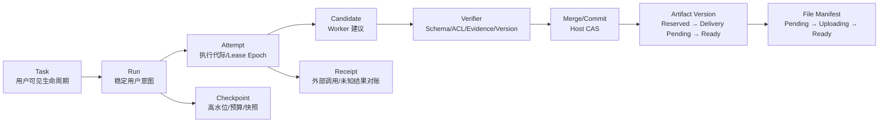

| 对象 | 业务含义 | 提交者 | 失败后怎么做 |
|---|---|---|---|
| Task | 用户看到的接纳、执行和终态 | Java Host | 保留接纳事实，按领域合同推进终态 |
| Run | 一次稳定的用户意图 | 领域 Host | 基础设施故障不创建新 Run，用户改目标才创建新 Run |
| Attempt | 一次 Worker 执行代际 | Scheduler/Worker/Host | Lease 过期后增加 Epoch，旧 Owner 不得写回 |
| Candidate | Worker 提出的结构化建议 | Worker 产生，Host 接收 | Schema 或证据不合格就拒绝或局部修复 |
| Artifact Version | 用户可见的交付身份 | Host 预留和提交 | ID 不复用，文件失败进入 Delivery Failed 或 Abandoned |
| File Manifest | 交付所需文件清单 | Host 冻结，Worker 物化 | 单文件可重试，全部必需文件 Ready 后 Version 才可见 |
| Projection | ES/Wiki/摘要等派生状态 | Projector | 新代次重建、追平增量后切换，不能反写业务真源 |

最重要的边界是：Worker 只能产生 Candidate、Receipt 或临时文件，不能直接创建业务 Version；最终业务状态、权限、版本和外部提交资格由 Host 统一判断。

### 10.4 取消竞态和未知结果

取消不能简单等于删除一行状态。完整路径是：

```text
用户取消
  → Host 写入 CANCEL_REQUESTED
  → Scheduler 停止新 Permit
  → Worker 检查 Cancellation Token 和 Deadline
  → 已发出的 Provider/文件操作进入 Receipt 对账
  → Host 校验 Attempt Epoch、Expected Version 和副作用阶段
  → 无不可逆副作用则 CANCELLED
  → 已产生外部副作用则记录 UNKNOWN/COMPENSATION
```

取消和 Provider 成功并发时，最终状态由副作用是否已发生、当前 Attempt 与 Version 条件共同决定，不能简单按请求到达先后裁决：

- 没有不可逆副作用时，取消可以阻止 Candidate、Version 或写回提交。
- Provider 已成功但回调丢失时，先用 Operation ID 查 Receipt，不能盲目重试。
- 文件已经上传时，取消不能假装对象不存在，必须记录对象 Receipt，再决定清理或补偿。
- 已经 `READY` 的业务 Version 不回退，用户只能归档、删除或创建追加式回滚版本。

### 10.5 Artifact Kafka 的当前实现和目标演进

当前实现的真实链路是：

```text
Kafka Consumer
  → 解析 Command
  → 调用 Artifact Executor
  → Callback/失败处理
  → Commit Offset
```

因此当前实现需要通过较大的 `max_poll_interval` 覆盖长任务和 MCP 超时。它能形成单 Worker 闭环，但把 Kafka Consumer Session 和业务执行时间绑定，长任务会放大 Rebalance 和分区阻塞风险。

当长任务持续占住 Consumer、Rebalance 风险和租户争用超过当前模型的可接受范围时，执行入口演进为：

```text
Kafka Consumer
  → Schema 校验
  → MySQL 幂等登记 Durable Execution
  → Commit Offset
  → Scheduler 申请 Active Permit
  → Worker Lease/Fencing 执行
  → Candidate/Delivery Callback
  → Host Commit
```

这个演进增加 Scheduler 和 Reconciler 的复杂度，但把消息接纳、执行槽、预算和业务提交权分开。当前版本仍在 Consumer 内执行长任务并在完成后提交 Offset；只有当任务时长和资源竞争使这种消费模型难以维持时，才引入 Durable Execution 与独立调度，不能把目标方案当作现状。

### 10.6 Provider、MCP 和外部副作用的统一治理

外部依赖都使用同一组治理字段：

```text
operation_id
provider_version
request_digest
attempt_id
deadline
retryable / permanent / unknown
receipt_id
estimated_cost
```

不同依赖的处理边界：

| 依赖 | 可重试 | 不可重试 | 降级 | 重点成本 |
|---|---|---|---|---|
| LLM | 429、临时网络错误 | Schema、权限、输入非法 | 降级模型或拒答 | Token、模型版本、Prompt 隐私 |
| Embedding | Provider 暂时失败 | 维度不匹配、文本超限 | 延迟 Projection Ready | 重建索引和向量迁移 |
| Rerank | 429、超时 | 参数非法 | 使用 RRF 候选并标记 DEGRADED | P95 和调用成本 |
| MCP/网页 | 连接失败、限流 | SSRF、路径穿越、越权 | 使用已有证据或 ABSTAIN | 外部内容注入和数据出境 |
| MinIO | 分片失败、临时不可用 | Checksum/路径非法 | Delivery Failed | 孤儿对象和临时空间 |
| ES | 节点暂时不可用 | Mapping/维度错误 | 延迟检索投影 | Refresh、Merge、Generation |

MCP 只解决能力发现和调用协议。Host 仍要检查 Server 身份、Tool Schema、Workspace Scope、Capability、Approval、超时、响应大小、SSRF 和路径策略。工具输出始终是不可信输入，不能直接晋升为 Evidence、Memory 或外部写回。

### 10.7 安全、删除、备份和恢复

请求进入 Worker 前，身份和权限被逐层收窄；Worker 回调仍需由 Host 按当前事实重新验收：

```text
认证上下文
  → Actor / Workspace / Role
  → Host 根据身份构造 Scope
  → Snapshot/Task 绑定 Workspace 和 Scope Epoch
  → Worker 接收冻结输入和短期 Capability
  → Callback 使用独立内部凭证和 Attempt Epoch
  → Host 再校验 ACL、Policy、Approval、Expected Version
```

删除分两层：

1. 在线不可见：Tombstone 先提交，查询、检索、Memory 编译和新任务立即排除。
2. 物理清理：ES、Redis、Summary、Memory Candidate、Artifact 引用、MinIO 临时对象和反链由清理任务删除并记录 Receipt。

备份和恢复要区分组件职责：MySQL 是业务真源，需要备份和时间点恢复；MinIO 保存原始对象和交付文件，需要校验和版本；ES 是可重建投影；Kafka 只能提供消息重放窗口；Redis 只能重建协调状态。没有正式演练时，不填写具体 RTO/RPO 数字，只说明恢复顺序和需要补的演练。

### 10.8 128 MB 接入上限与容量边界

> 当前 Spring Multipart 配置允许单文件最大 128 MB，固定回放验证了文件可以进入异步资料链路。128 MB 是接入边界，不是吞吐、并发或生产容量。

固定回放至少记录：文件 Hash、类型、页数、文本量、CPU、内存、Parser、Embedding、ES 版本、并发数、每阶段耗时、峰值 RSS、重试次数、死信和故障注入结果。容量计算使用 `平均并发 = 到达率 × 平均处理时间`，但最终还要受 MySQL 连接池、ES Bulk、Provider QPS、Workspace Permit 和对象存储带宽的最小瓶颈限制。

### 10.9 评测、测试和发布门禁

每个质量结论都绑定四个东西：评测单元、基线、分母、失败样本。

| 能力 | 评测单元 | 基线 | 主指标 | 代价/护栏 |
|---|---|---|---|---|
| Research | Entity × Field Cell | 一次 Prompt/自由 ReAct | Cell 完成、引用支撑、冲突发现、恢复 | Token、搜索、正确失败 |
| QA | Query × Atomic Claim | Vector TopK + Prompt | Recall、NDCG、支撑、拒答、越界 | P95、Rerank 成本 |
| Note | Source × Anchor | Chunk TopK 生成 | 主题覆盖、定位、审阅通过 | Token、窗口大小 |
| Artifact | Candidate/Version | 一次 Prompt 整体生成 | Schema、Repair、File Ready、重复 Version | 节点数、渲染耗时、未知结果 |
| Memory | Conversation × Constraint | 全量历史或最近 N 条 | 约束保留、事实回读、误晋升 | 摘要成本、撤销延迟 |

测试按不变量组织，而不是只报 Mock 覆盖率：

- 旧 Fencing Token 不能写回。
- 重复 `operation_id` 不能创建第二个 Version。
- 删除后的 Snapshot 不能形成新 Citation。
- `DELIVERY_PENDING` 版本不能被下载或写回。
- ES 新 Generation 没有通过门禁不能切 Alias。
- 取消后的晚到回调不能创建新副作用。

发布时对 Prompt、Embedding、Rerank、Skill、Schema 和索引使用版本化、Shadow、Canary、Release Gate 和回滚窗口。代码回滚不等于外部副作用补偿，已经发生的写回必须通过 Receipt、Compensation Proposal 或人工处理收敛。

### 10.10 面试官高概率追问统一答案

**为什么说是 Agent，不是普通 Workflow？**

外部生命周期由 Workflow 和 State Machine 约束，动态搜索、证据选择和局部 Repair 才使用 Agent 决策。这样可以保留开放探索能力，又不把权限、预算和最终提交权交给无界循环。

**为什么不用一个万能 JSON WorkItem？**

共享身份、依赖、预算和状态可以统一，但 Matrix Cell、Claim Investigation、Timeline Event 和 Source Audit 的验收语义不同。公共 Envelope 加类型化 Contract Adapter 能避免把领域差异扩散到所有调用方。

**为什么不用分布式锁保护 Cell？**

模型和网页调用不应持有数据库锁。Candidate 在事务外生成，提交时使用 Expected Version CAS；只有业务提交权需要短期 Lease 和 Fencing。这样锁的范围与外部调用解耦。

**为什么 Kafka Lag 为零，任务仍可能不完成？**

Offset 只表示消息消费进度，不代表 Worker 结果、Callback 或业务终态。还要看 Task Stuck Age、Lease Expiry、Callback Missing、Receipt 和最终状态延迟。

**为什么 Redis 挂掉不能说明任务不存在？**

Task、Admission Reservation、预算和业务状态在 MySQL；Redis 只表达 Active Permit、缓存、租约和实时桥。Redis 故障时高风险能力 Fail Closed，恢复后由 Scheduler 根据持久事实重新申请资源。

**为什么不能说系统高并发？**

当前没有生产流量和正式容量压测，就只说有界并发、配额、背压和可观测指标。并发能力必须绑定工作负载、硬件、Provider 配额、连接池、P95/P99 和故障恢复结果。

**如果只有十个用户，为什么不用同步处理？**

学校 MVP 可以同步或数据库轮询。只有大文件、跨系统最终一致、长任务恢复、重放或多消费者成为真实约束时，才逐步引入 Kafka、Scheduler、Lease 和 Projection Generation。

### 10.11 总稿终审清单

- [ ] 五条亮点都能按 Situation、Task、Action、Result、Trade-off 和失败复盘讲满 5 分钟。
- [ ] 每个结果数字都有评测集、分母、基线、统计区间和失败样本。
- [ ] 当前实现、已测模拟和目标设计没有混写。
- [ ] 时间线能解释学校原型、v2 重构和简历展示周期。
- [ ] Ownership 能说清核心负责、验收范围和第三方能力边界。
- [ ] Task、Run、Attempt、Candidate、Version、Manifest 的关系能画出来。
- [ ] 能回答取消竞态、未知结果、旧 Worker、重复消息和删除传播。
- [ ] 能解释 128 MB 是接入上限，而不是容量承诺。
- [ ] 能说清 Kafka、Redis、ES、MinIO 各自不负责什么。
- [ ] 能说出一个被否定的设计以及迁移和回滚方式。
- [ ] 没有真实用户、线上流量和长期 SLO 时，明确说没有，不用 Fixture 冒充。

相关原理与事实核对见 [08-知识深挖库](08-知识深挖库-面试八股与项目映射.md) 和 [09-面试官终审与事实矩阵](09-面试官终审与事实矩阵.md)；当前总稿已经包含回答所需的主要设计和边界。

## 11. 仍需深入的横切设计：面试官第二轮会继续问什么

请求从接收到完成可能跨 MySQL、Kafka、Worker、Redis、ES 和 MinIO。只描述组件还不足以解释系统正确性：还要说明哪一步建立业务事实，哪一步可以重复，哪一步会产生外部副作用，哪一种状态才允许对用户承诺完成。以下横切设计围绕这些边界展开。

### 11.1 从一次请求到最终交付：API、状态和事件必须对得上

用户提交研究或产物生成意图后，Host 先完成身份、Workspace、资料范围与配额校验，创建可持久查询的任务状态，再把执行意图交给异步链路。客户端拿到任务身份时只知道系统已经接纳请求；执行、结果验证和文件交付各有独立状态。网络中断后，重新读取持久状态和事件序号即可判断任务进展，不依赖原来的连接一直存活。

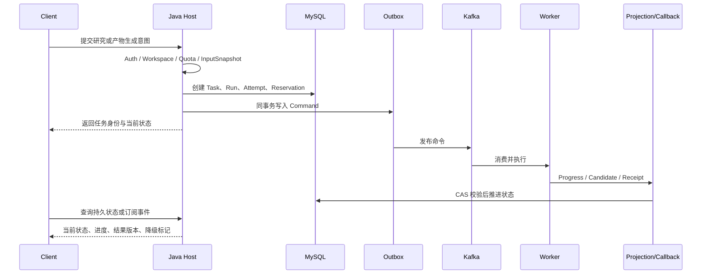

这条链路有四个约束：

1. 返回任务身份只表示 Host 接受了意图，不代表模型已经完成，更不代表 Artifact 已经可以下载。
2. 创建意图、Outbox 投递、Worker 执行和最终提交要分别有幂等身份。当前研究命令按 `agent_task_id + delivery_no` 构造内部幂等键；客户端统一 `Idempotency-Key` 可以作为后续入口契约设计，不当作当前所有创建接口已有的行为。
3. SSE 只是实时通知，不是真实状态源。断线重连以持久任务状态和事件序号恢复，旧事件不能覆盖新状态。
4. 查询接口不能把内部中间态直接暴露给用户。`DELIVERY_PENDING`、`UNKNOWN`、`DEGRADED` 要有明确的产品语义，例如“正在准备文件”“外部调用结果待确认”“已使用降级检索”。

不同任务采用不同的等待边界：

| 场景 | 接口策略 | 原因 | 超时后的状态 |
|---|---|---|---|
| 小范围 QA | 同步响应或短 SSE | 用户等待时间可控 | `ANSWERED`、`REFUSED` 或 `DEGRADED` |
| 大文件接入 | 异步接纳 | 解析、向量化和索引不应占住 HTTP 请求 | `INGESTING`、`READY`、`FAILED` |
| Deep Research | 异步 Run | 搜索、验证和重试耗时不可预测 | `RUNNING`、`PAUSED`、`SUCCEEDED`、`FAILED` |
| Artifact 生成 | 异步交付 | 结构化生成、渲染和写回有多个副作用 | `GENERATING`、`DELIVERY_PENDING`、`READY` |

短任务可以轮询。长任务用 SSE 降低通知延迟，但一致性仍由持久状态承担；重连、刷新和多端登录都读取同一个业务状态。连接断开不会丢失结果，事件订阅也避免了高频轮询持续放大数据库读负载。

### 11.2 用状态机和不变量防止“看起来成功，实际上不可交付”

系统中最容易出现的错误不是 HTTP 报错，而是某个对象已经进入成功状态，后续却没有满足前置条件。因此每个状态都要有进入条件、允许动作和终态约束。

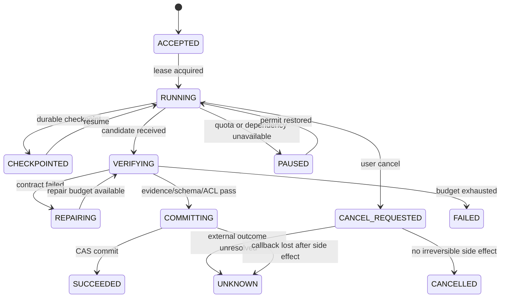

这条任务状态机由四条不变量约束：

| 不变量 | 防住的问题 | 实现方式 |
|---|---|---|
| 未通过 ACL 和 Evidence Gate 的 Candidate 不能生成 Citation | 越权引用、幻觉引用 | Host 统一验收，Worker 无提交权 |
| 未达到 `READY` 的 Artifact Version 不能下载或写回 | 半成品被用户看到 | 下载和写回接口只接受已提交版本 |
| 旧 Attempt 不能覆盖新 Attempt | Worker 超时后迟到回调覆盖新结果 | `attempt_id + fencing_epoch + expected_version` CAS |
| 删除后的 Snapshot 不能进入新任务 | 隐私删除后又被检索使用 | Tombstone 先写入真源，召回和任务创建都检查 |

状态推进必须是条件更新，而不是“查出来再 save”：

```sql
UPDATE artifact_version
SET state = 'READY', state_version = state_version + 1
WHERE id = :id
  AND state = 'DELIVERY_PENDING'
  AND state_version = :expected_version
  AND required_file_count = ready_file_count;
```

更新行数为零时不能直接重试写入。Host 先区分版本冲突、前置条件未满足和对象已被其他 Attempt 提交；三者分别对应拒绝旧结果、等待前置状态和返回已完成 Receipt，盲目重试会让幂等保护失去意义。

### 11.3 多租户、权限和 Prompt Injection：检索边界不是只加一个 user_id

多租户检索最危险的失败是把其他 Workspace 的资料带进回答。安全边界贯穿接入、索引、召回、Worker 和回写，Controller 的一次权限检查不足以覆盖旧索引、长任务中途撤权和迟到回调。

```text
Bearer Session Token
  → Actor、Workspace、Role、Scope Epoch
  → Source / Snapshot ACL
  → ES Filter + MySQL 二次校验
  → RunInputSnapshot 固化授权时点
  → Worker 短期 Capability
  → Callback 重新校验 Workspace、Attempt 和 Version
```

每一层承担不同的隔离责任：

- Workspace 是最小业务隔离单元，所有 Source、Snapshot、Task、Memory 和 Artifact 都带 `workspace_id`，跨 Workspace 的主键引用默认拒绝。
- ES 过滤必须和 MySQL 的 ACL 语义一致。不能先召回全库，再在 LLM Prompt 中“提醒模型不要使用别人的内容”。
- 长任务启动时冻结 `RunInputSnapshot` 和权限版本。用户中途失去权限时，新步骤停止，已产生的结果要按当前 ACL 再次过滤。
- 外部资料和 MCP 返回内容都属于不可信输入。系统提示词、工具策略和资料正文分层传递，资料中的“请忽略之前规则”只能作为文本，不能改变 Tool Policy。
- 网页读取和 MCP 工具必须限制 URL Scheme、DNS 解析结果、内网地址、重定向次数、响应大小和本地路径。拒绝 SSRF 和路径穿越，比“调用成功”更重要。

存储加密降低介质泄露风险，但模型调用前仍需解密。跨 Workspace 隔离依赖最小权限、短期凭证、Provider 数据策略、脱敏、审计和可撤销的 Capability；加密不能代替授权检查。

### 11.4 数据保留、删除和重建：最终一致不是无限保留脏数据

资料系统会同时产生原文件、解析文本、Chunk、Embedding、ES 文档、Summary、Memory Candidate、Citation 和临时 Artifact。只删除 MySQL 主记录是不够的，也不能为了“最终一致”无限期保留用户已经删除的内容。

删除分为业务不可见、投影停止新读和物理清理三个时间点：

```text
T0  MySQL 提交 Tombstone，查询和新任务立即不可见
T1  投影清理，ES / Redis / Summary / Memory / Citation 停止产生新读
T2  物理清理，MinIO 对象、临时文件、备份副本按保留策略删除并留 Receipt
```

删除任务本身也要可重试。每个清理动作使用 `deletion_operation_id`，记录目标版本、尝试次数和结果。这样 MinIO 删除超时不会导致系统误以为“已经清干净”，也不会因为重复清理把正常的新版本对象误删。

重建和删除要区分：

| 操作 | 是否可以重放 | 真源 | 需要的门禁 |
|---|---|---|---|
| ES 索引重建 | 可以 | MySQL Snapshot + 原始对象 | Generation、Alias、抽样质量 |
| Wiki 反链重建 | 可以 | PageVersion 和 Source Link | 版本一致、ACL 一致 |
| Summary 重算 | 可以 | Raw Message Ledger | 摘要版本、事实保留率 |
| Memory 重算 | 受限 | 用户明确事件和可见上下文 | 删除传播、冲突门控 |
| 外部写回撤销 | 不一定 | Receipt 和目标系统 | 补偿能力或人工确认 |

这里的核心 Trade-off 是：派生投影尽量可重建，外部副作用尽量可对账。不能把 ES 当作事实库，也不能假设所有第三方写回都支持事务回滚。

### 11.5 部署拓扑和扩容：按瓶颈扩，不按服务数量扩

运行时按入口与控制面、调度与消息、执行池、存储和外部依赖划分。下面是进入生产后的部署目标图；当前版本的部分 Worker、Scheduler 和 Reconciler 尚未独立部署，先在合并部署下验证状态、契约和恢复不变量，达到资源隔离或公平调度的触发条件再拆分。

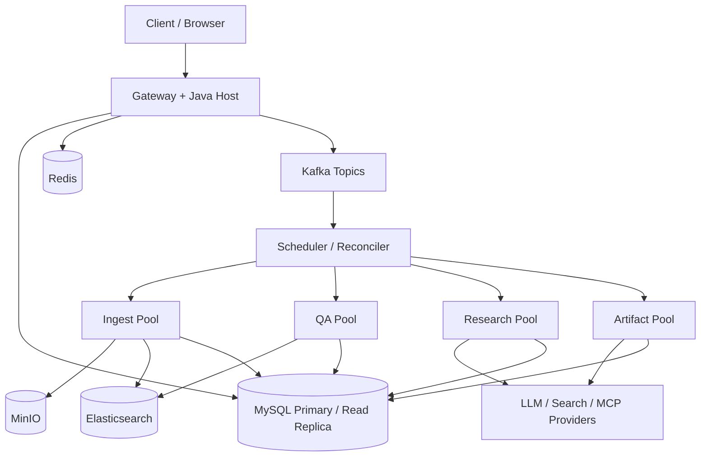

扩容维度不能只说“多加几个 Pod”：

- Gateway 按请求并发、P95 延迟和连接池扩容。
- Ingest 按解析 CPU、Embedding Provider 限额、Kafka Lag 和对象存储带宽扩容。
- QA 按检索 QPS、ES 查询延迟和 Rerank 配额扩容。
- Research 和 Artifact 按每个 Workspace 的 Active Permit、平均 Run 时长、Provider 成本和 Lease 过期数扩容。
- ES 按文档数、向量内存、Segment Merge 和写入吞吐扩容，不能只看 CPU。
- MySQL 按事务冲突、慢查询、连接池和 Binlog 保留扩容，读副本不能解决所有写热点。

如果只有少量用户，部署可以先合并 Worker 和 Scheduler，使用数据库轮询代替完整调度层。引入独立 Scheduler 的触发条件应该是：任务类型需要公平调度、长任务占满消费线程、需要按 Workspace 配额隔离，或者需要统一 Lease 和 Reconcile。这样能解释“为什么没有一开始就拆成几十个微服务”。

### 11.6 Token、Provider 和预算治理：成本是运行时不变量

AI 系统最危险的故障之一是功能没有报错，但成本不断上升。每次模型、搜索、Embedding、Rerank 和 MCP 调用都要挂在 `run_id + attempt_id + operation_id` 下，形成可追溯的 Cost Ledger。

```text
Run Budget
  = input_tokens
  + output_tokens
  + embedding_items
  + rerank_items
  + search_calls
  + tool_seconds
```

预算至少分四层：

1. 单次 Operation 上限，防止某个 Tool 卡死或返回巨大内容。
2. 单个 Attempt 上限，限制 Repair 和 Replan 的循环次数。
3. 单个 Run 上限，限制跨 Cell、跨节点的总成本。
4. Workspace 日配额，防止单个用户或自动重试耗尽共享资源。

达到预算后不是统一报错，而是按任务语义处理：QA 可以减少 Rerank 候选并标记降级，Research 可以停止扩展并输出证据不足，Artifact 可以保留 Candidate 但不提交 Version，Memory 可以等待用户确认。成本治理和质量门禁必须一起设计，否则系统会为了完成率无限重试。

Provider 路由也要版本化。高质量模型用于最终验证，低成本模型用于 Query Rewrite、摘要草稿或局部 Repair；切换模型时要记录 `provider_version`、请求摘要和输出 Schema 版本，才能解释同一输入为什么产生不同结果。

### 11.7 测试不能只测“返回 200”：把系统不变量变成可执行证据

Agent 测试拆成状态逻辑、跨语言契约、依赖集成、质量回放与故障恢复，单看一次正常生成无法证明旧执行者、重复消息和权限变更下的正确性：

| 层级 | 目标 | NoteWeave 示例 |
|---|---|---|
| 单元测试 | 状态和边界逻辑 | CAS 失败、预算扣减、ACL 判定、Chunk 边界 |
| 契约测试 | Java/Python/MCP 协议稳定 | Candidate Schema、Receipt、Callback、Tool Schema |
| 属性测试 | 对所有输入保持不变量 | 重复消息不重复 Version、旧 Epoch 永不覆盖新值 |
| 集成测试 | 真实依赖交互 | MySQL Outbox、Kafka 重平衡、ES Alias、MinIO 分片 |
| Golden Set | 质量回归 | QA 引用支撑、Research Cell 完成、Memory 误晋升 |
| 故障注入 | 恢复和未知结果 | Worker 崩溃、Callback 丢失、Provider 超时、Redis 不可用 |
| Replay | 线上或 Fixture 重演 | 用 RunInputSnapshot 和版本化策略重放同一 Run |

至少要有以下可执行断言：

```text
重复 Command                  → 最多一个业务 Version
旧 Fencing Epoch 回调          → 0 行提交，不产生新副作用
删除后的 Snapshot              → 不能进入新 Citation
Kafka 重平衡                   → 不出现两个有效 Lease
Rerank 超时                    → QA 仍能走 RRF 降级或正确拒答
Artifact 文件缺失              → Version 保持 DELIVERY_PENDING
SSE 断线重连                   → GET 状态与最终 Version 一致
```

“模型输出看起来不错”只能作为样本观察，不能替代这些系统级断言。质量评测也要保存输入、基线、版本、分母、失败样本和运行环境，否则下一次模型升级无法解释回归来源。

### 11.8 从当前版本到目标版本：要有迁移顺序，不要只画终态

当前项目同时存在已实现链路、受控模拟和进一步演进方案。只有在任务时长、外部副作用或资源竞争触及现有边界时，才按下面的依赖关系推进：

```text
阶段 0：单体 Host + Worker，先固定领域状态和契约
  ↓
阶段 1：Outbox + Kafka，资料处理与长任务异步化
  ↓
阶段 2：Scheduler + Lease/Fencing，执行和消费解耦
  ↓
阶段 3：Projection Generation + Alias，索引和摘要可重建
  ↓
阶段 4：Receipt/Reconcile，外部副作用可对账
  ↓
阶段 5：按 Workspace 的配额、灰度和成本治理
```

每一步都要有退出条件：

- 没有稳定的状态和幂等契约，不先拆服务。
- Kafka 只有在任务耗时、重放或多消费者成为实际约束时引入。
- Scheduler 上线前先验证 Lease 过期、旧 Worker 回调和取消竞态。
- ES Generation 切换前先跑抽样质量和 ACL 校验。
- 真实外部写回前先有 Operation ID、Receipt、回放和人工兜底。

当前版本先固定 MySQL 业务真源、Host 提交权和用户可见状态。独立 Scheduler、Reconciler 与完整追踪链路要等长任务时长、资源争用和排障成本触及当前模型的边界才引入；这些基础设施可以替换执行方式，不改变 Source、Run、Version 的业务契约。

### 11.9 横切设计如何共同约束一次长任务

> 我把 Agent 放在受限执行面，Java Host 保留事实、权限和最终提交权，Worker 只返回候选。用户提交任务时，Host 固定 Workspace、资料 Snapshot、策略版本和预算，MySQL 保存 Run 与 Task 的业务状态；Kafka 负责传递执行意图，不能替业务库决定任务是否完成。Worker 可能超时、重复消费或晚到，所以每次执行有 Attempt 和 Epoch，回调必须带 Expected Version 做条件更新。ES、Redis 和摘要都是可重建投影，读路径还会按当前 ACL 与删除状态回库校验。外部调用结果不明时先查 Receipt，再决定重试或补偿。这样即使 SSE 断线，用户仍能从持久状态恢复进度；即使模型给出看似完整的文本，没有 Evidence 或必需文件未就绪，也不会推进到可引用或可下载的终态。

同步 QA、Research 和 Artifact 的完成条件不同。QA 要让每个 Claim 有可见资料支撑；Research 要让必填 Cell 通过验证或以冲突、缺口终态交付；Artifact 要通过 Schema、引用和文件 Manifest 验收。预算按 Operation、Attempt、Run 和 Workspace 限制，不能为了完成率无限调用 Provider。资源量小、任务短时，合并部署和固定 Workflow 的成本更低；只有长任务占住消费线程、租户互相影响或恢复时间不可控时，才引入独立 Scheduler 和 Reconciler。

## 12. 实现证据卡：把架构名词落到字段、配置、测试和结果

下面的字段、默认值、测试资产和结果均对应当前仓库快照。源码路径证明契约在哪里实现，配置说明默认行为，测试和固定回放说明哪些边界被验证；这些证据不能自动推导生产规模或线上收益。

### 12.1 五条亮点的代码证据索引

| 亮点 | 核心代码或迁移 | 能证明什么 | 不能外推什么 |
|---|---|---|---|
| Deep Research | `workers/research-worker/app/agent_contracts.py`、`agent_kafka_consumer.py`、`V014` 至 `V020`、`V039` 至 `V050`、`V071`、`V097` 至 `V109` | Candidate、Cell、Verifier、Lease、Fencing、Checkpoint、Replan 和 Tool Grant 有结构化契约 | 不能证明已形成大规模生产多 Agent 集群 |
| QA / Note / Wiki | `QaRetrievalStrategyProfile.java`、`QaRrfFusionService.java`、`ElasticsearchQaHybridSearchAdapter.java`、`NoteRetrievalService.java`、`V007`、`V030`、`V032`、`V075`、`V087` | Hybrid Retrieval、Evidence Snapshot、PageVersion 和检索投影有代码与迁移 | 固定 Fixture 指标不能当线上质量收益 |
| 异步资料底座 | `V002` 至 `V004`、`V022` 至 `V026`、`V047`、`V087`、`V090`、`TaskOutboxDispatcherService.java`、`SourceDeletionCleanupListener.java` | Outbox、阶段幂等、投影状态、删除清理和死信可追踪 | 128 MB 只证明配置边界，不证明并发吞吐 |
| Artifact | `workers/artifact-worker/app/artifact_command_contract.py`、`artifact_kafka_consumer.py`、`artifact_skill_catalog.py`、`skill_graph.py`、`callback.py`、`V012`、`V018`、`V019`、`V023`、`V081` | Skill、Command、Delivery Token、文件状态和 Callback 协议存在 | 模拟 Writeback 不能说成真实第三方系统写回 |
| Context / Memory | `V005`、`V034` 至 `V036`、`V070`、`V074`、`V077`、`V078`、`V080` 至 `V082`、`CanonicalMemoryRuntime.java` | Message Head、Summary Revision、RunInputSnapshot、Memory Revision 和撤销可持久化 | 没有正式 Manifest 时不能宣称 Token 降低百分比 |

这五条亮点分别落在 Command、业务表、条件更新和故障测试上。以 Research 为例，Command 固定输入与执行代际，Cell 和 Checkpoint 保存进度，Fencing 条件更新拒绝旧 Worker，响应丢失测试验证只重放 Finalize。其余亮点的对应代码与证据列在上表。

### 12.2 Research 的字段级契约

Kafka Command 只携带传输身份，不把全部权限和业务输入直接塞进消息：

```json
{
  "schema_version": "research-agent-command.v1",
  "command_id": "cmd-...",
  "research_run_id": "run-...",
  "agent_task_id": "task-...",
  "idempotency_key": "research:run:task:delivery",
  "delivery_attempt": 1
}
```

Worker Claim 成功后再从 Host 读取冻结的 Task Bundle。Bundle 的关键字段如下：

| 字段 | 作用 | 错误时的处理 |
|---|---|---|
| `entity_set_version` | 防止实体集合在执行中漂移 | 版本不匹配时拒绝继续 |
| `plan_revision` | 表示当前研究计划版本 | 旧计划 Candidate 不晋升 |
| `target_cells[].expected_version` | Cell 级 CAS 条件 | 更新 0 行时按冲突处理 |
| `candidate_quorum` | 高风险 Cell 需要几个独立候选 | 大于 1 时必须标记 `high_risk` |
| `lease_epoch` | 本次领取代际 | 旧代际回调拒绝 |
| `fencing_token` | 防止失效 Owner 写回 | Token 不一致直接拒绝 |
| `budget` | 搜索、抓取、读取、LLM、Token 和时间上限 | 超预算停止扩展并输出限制 |

当前配置快照：

```text
Research Worker 最大并发：1
单个 Bundle 最大 Cell 数：3
Lease：60 秒
Heartbeat 默认间隔：Lease / 4
Fetch 最大并发：4
Fetch 超时：20 秒
Fetch 最大重试：3
LLM 总调用上限：64
```

这些值是当前默认配置，不是经过生产容量压测得到的最优值。并发先设为 1，是为了验证 Lease、恢复和提交不变量；只有 Provider 配额、Workspace 公平和故障注入稳定后，才逐步增加并发。

### 12.3 Research 的提交和恢复边界

Research Consumer 的关键语义是：执行结果生成后，响应丢失的重试只能重放 finalize，不能重新领取任务或重新执行 Provider 与 Tool。原因是 Provider 可能已经扣费，搜索和网页抓取也可能得到不同内容。

```text
Command 到达
  → 校验 Schema
  → Host Claim Task，取得 Lease Epoch 和 Fencing Token
  → 启动 Heartbeat
  → 执行 Provider / Tool
  → 冻结不可变 AgentExecutionResult
  → Finalize Callback
  → Host 校验 Task、Execution、Lease、Fencing、Candidate
  → Commit Offset
```

如果 Lease 丢失，Consumer 不提交 Offset，由 Reaper 或新的 Worker 恢复。如果消息非法，必须先成功写入 DLQ 再提交 Offset；DLQ 写入失败时停止消费，不能把毒消息直接丢掉。

需要能写出这条核心条件更新：

```sql
UPDATE research_cell
SET cell_status = 'CANDIDATE',
    cell_value = :value,
    cell_version = cell_version + 1,
    updated_at = CURRENT_TIMESTAMP
WHERE id = :cell_id
  AND cell_version = :expected_version
  AND research_run_id = :run_id;
```

更新行数为零不等于数据库故障，可能是旧 Candidate、计划已经 Replan、Cell 已被别的执行提交，或者 Run 已取消。调用方先读取当前状态并分类，不能对 CAS 冲突做无脑重试。

### 12.4 RAG 的真实默认值和取舍

| 参数 | 当前默认值或规则 | 为什么这样设计 | 验证方式 |
|---|---:|---|---|
| Chunk Size | 900 | 保留局部语义，同时控制 Evidence 长度 | 按 PDF、Markdown、网页分别做消融 |
| Chunk Overlap | 120 | 减少定义和限定条件被边界切断 | 检查跨 Chunk 引用完整性 |
| RRF `k` | 60 | 降低头部排名差异的过度影响 | 对比 Keyword、Vector、Hybrid |
| Vector Candidates | `max(100, topK × 5)` | 给 ANN 留足候选，再由后续阶段收缩 | 观察 Recall、延迟和候选重复 |
| HNSW 相似度 | Cosine | 与当前 Embedding 归一化语义一致 | 检查维度和相似度分布 |
| Alias | Workspace + Projection Type | 支持新 Generation 构建和原子切换 | 切换前做质量、ACL 和完整性门禁 |

参数不能只解释收益，还要说代价。Chunk 变大可以保留更多上下文，但召回粒度变粗，Rerank 和 LLM Token 增加；overlap 变大会提高边界召回，也会产生更多重复文档和索引成本；Vector 候选池变大可能提高 Recall，同时增加 ES 和 Rerank 延迟。

ES 的新 Generation 发布顺序是：

```text
创建新物理索引
  → 校验 Mapping 和向量维度
  → Backfill 当前 Snapshot
  → 追平增量
  → 运行固定 Gold 和 ACL 抽样
  → 生成 Quality Receipt
  → 原子切换 Alias
  → 保留旧索引回滚窗口
```

Mapping 错误、Embedding 维度不一致、Scope Violation 不为零或质量门禁失败时，不切 Alias。代码回滚不能代替索引回滚，因此旧 Generation 需要保留一个明确窗口。

### 12.5 固定 Fixture 的可用数字和边界

当前 QA / Note 消融报告是确定性 Fixture Replay，不是真实 Elasticsearch、Embedding、Rerank 或 LLM Provider Benchmark。它可以证明评测代码、消融方向和回归门禁，不能外推线上收益。

| 模式 | Case 数 | Variant | Recall@K | MRR | NDCG@K | Citation Coverage | P95，微秒 |
|---|---:|---|---:|---:|---:|---:|---:|
| QA | 3 | Keyword only | 0.3333 | 0.3333 | 0.3333 | 0.3333 | 1200 |
| QA | 3 | Vector only | 0.6667 | 0.6667 | 0.6667 | 0.6667 | 1800 |
| QA | 3 | Hybrid RRF | 1.0000 | 1.0000 | 1.0000 | 1.0000 | 2400 |
| QA | 3 | Hybrid RRF + Rerank | 1.0000 | 1.0000 | 1.0000 | 1.0000 | 4100 |
| QA | 3 | Full Pipeline | 1.0000 | 1.0000 | 1.0000 | 1.0000 | 4300 |
| Note | 3 | Metadata only | 0.3333 | 0.3333 | 0.3333 | 0.3333 | 900 |
| Note | 3 | Metadata + Journal + Semantic | 1.0000 | 1.0000 | 1.0000 | 1.0000 | 2200 |
| Note | 3 | Full Recall + Relations + Rerank | 1.0000 | 1.0000 | 1.0000 | 1.0000 | 3900 |

这组数字可以这样表述：

> 在 3 个 QA 和 3 个 Note 的固定回放 Fixture 上，QA 的 Vector-only Recall@K 是 0.6667，Hybrid RRF 达到 1.0，P95 从 1800 微秒增加到 2400 微秒；加入 Rerank 后 Recall 没继续增加，但 P95 增加到 4100 微秒。这个样本很小，Provider 还是确定性 Fixture，所以我只把它作为消融和回归证据，不说成线上收益。它至少说明 Rerank 不是免费收益，如果召回已经饱和，就需要用更难的样本决定是否值得保留。

评测结果文件是 `backend/src/test/resources/retrieval/qa-note-ablation-report-v1.json`，回放命令记录在文件内。对外使用数字前必须保留 `caseCount`、`evidenceLevel` 和 `claimBoundary`。

### 12.6 Artifact 和 Research 的 Kafka 语义对比

| 维度 | Artifact 当前实现 | Research 当前实现 | 推荐演进 |
|---|---|---|---|
| 自动提交 | 关闭 | 关闭 | 保持显式边界 |
| 单次 Poll | 1 条 | 受控 Poll | 长任务不批量占用 |
| 业务执行 | Consumer 内执行长任务 | Claim 后在 Lease 内执行 | Artifact 改为登记 Durable Execution 后 ACK |
| Offset 提交 | Executor 成功、409 旧 Token 或已上报失败后提交 | Finalize 成功、明确跳过或 DLQ 成功后提交 | Offset 只表示接纳或交付边界 |
| 旧任务保护 | Delivery Token | Lease Epoch + Fencing Token | 统一 Operation Receipt |
| 响应丢失 | 依赖回调协议 | 只重放 Finalize | 不重复 Provider 副作用 |
| 当前超时 | `max.poll.interval=4200s` | `lease=60s` + Heartbeat | Artifact 解耦 Consumer Session 和执行时间 |

Artifact 的 MCP 进程超时默认为 3600 秒，Kafka `max.poll.interval` 默认为 4200 秒，生产配置强制前者小于后者。这个设计能避免执行过程中被误判离组，但分区会被长任务占用，因此它是当前闭环实现，不是最终理想形态。

消息 Key 的原则是把需要顺序的业务身份放到同一分区，例如 Snapshot、Task 或 Run。Kafka 只保证单 Partition 内有序，跨 Partition 不保证全局顺序；最终是否允许提交仍由 MySQL 的 Expected Version、Head 和 Tombstone 决定。

### 12.7 MySQL 的事务、索引和锁

必须放在一个本地事务里的操作：

- 创建或更新业务状态，并写入对应 Outbox。
- 预留 Artifact Version，并冻结 Required File Manifest。
- 提交 Candidate，并写 Verifier Decision 或审计事件。
- 晋升 Memory Revision，并追加 Memory Event。
- 写 Tombstone，并登记 Source Cleanup Task。

不能放进长事务的操作：

- LLM、Embedding、Rerank、网页搜索和 MCP。
- MinIO 大文件上传、PDF 渲染和 ES Bulk。
- 等待 Kafka、SSE 客户端或人工审批。

这些操作在事务外执行，完成后携带 Receipt 回到短事务做条件提交。外部调用如果放进数据库事务，会延长锁时间、占满连接池，并让回滚语义和外部副作用不一致。

常见索引按查询方式设计：

| 查询 | 索引方向 | 原因 |
|---|---|---|
| 扫描待投递 Outbox | `topic, status, next_attempt_at, created_at` | Dispatcher 按状态和时间 Claim |
| 领取 Research Task | 状态、优先级、Lease 到期时间 | 避免扫描全部任务 |
| 查询 Workspace Source | `workspace_id, status, updated_at` | Workspace 列表和状态过滤 |
| 查询 Cell | `research_run_id, updated_at` | 恢复和审计按 Run 扫描 |
| 查询事件流 | `task_id, created_at` 或 `run_id, seq` | SSE 重放和游标查询 |

`SELECT FOR UPDATE` 只用于很短的权威更新，例如同一个 Memory Slot 的 Revision 晋升。外部调用绝不持有行锁。普通 Candidate 提交优先使用乐观锁和条件更新，发生 CAS 冲突时读取当前版本再决定丢弃、合并或 Replan。

### 12.8 Redis 的真实职责和 Key 设计

Redis 当前用于缓存、实时事件桥、取消信号和短期协调，MySQL 仍是 Task、权限、版本和删除状态的真源。

| 用途 | Key 结构 | 版本来源 | 失败策略 |
|---|---|---|---|
| Source Catalog | `noteweave:v1:cache:source_catalog:{workspace}:{catalogVersion}` | MySQL Catalog Version | 出错回源 MySQL |
| Workspace ACL | `noteweave:v1:cache:acl:{workspace}:{user}:{aclVersion}` | MySQL ACL Version | 高风险操作回源或拒绝 |
| Memory Pack | `noteweave:v1:cache:memory_compiled_pack:{workspace}:{actor}:{type}:{request}:{policy}:{state}` | Policy 和 State Fingerprint | Miss 时重新编译 |
| Answer Stream | `noteweave:v1:stream:answer:{runId}` | Run Event Sequence | Redis 不可用时以 DB 状态为准 |
| Cancel Signal | `noteweave:v1:cancel:answer:{runId}` | MySQL Cancellation | 读取失败时 Fail Closed |

缓存 TTL 带随机抖动，避免同一时刻大量过期。ACL 正缓存默认 300 秒，负缓存默认 30 秒；Source Catalog 默认 120 秒；Wiki Page Version 默认 600 秒；Compiled Memory Pack 默认 180 秒。版本号进入 Key 后，权限或资料更新不依赖全量删除旧 Key，新版本自然产生新 Key，旧 Key 等待 TTL 回收。

### 12.9 认证、安全和内部调用的当前边界

当前用户认证是 Bearer Session Token，不是无状态 JWT。数据库保存 `token_hash` 和 `refresh_token_hash`，支持过期、撤销和 Refresh Rotation。Access Token 默认 15 分钟，Refresh Token 默认 30 天。

```text
Bearer Token
  → ApiRequestIdentityFilter 计算 Hash
  → 查询 ACTIVE、未撤销、未过期 Session
  → 构造 Actor
  → WorkspaceAccessService 校验 Member Status 和 Role
  → 业务服务只接收经过校验的 Workspace Scope
```

Worker 内部调用使用独立内部 Token，Artifact Callback 还有独立 Callback Secret。生产配置要求 Java Base URL 使用 HTTPS，Kafka 使用 SSL 或 SASL_SSL，并禁止 Fake Provider、故障注入和 Debug Route。登录、注册分别有节流表和安全事件表，不能只依赖 Redis 限流。

Prompt Injection 的处理边界：系统约束、Tool Policy 和资料正文分层传递；资料中的指令只作为不可信文本；URL Reader 限制 Scheme、重定向、DNS 解析结果、内网地址和响应大小；MCP Tool 输出还要经过 Schema、路径和 Capability 校验。权限不能靠 Prompt 提醒模型遵守。

### 12.10 当前可观测性和目标链路追踪

当前代码能够明确证明的观测能力：

- Log Pattern 带 `request_id`、`correlation_id`、`user_id`、`workspace_id`、`task_id`、`source_id`、`answer_run_id` 和 `event_id`。
- Micrometer 记录 Answer Run、Retrieval、Outbox、Cache、SSE、Redis Bridge 和错误分类指标。
- Research Payload 有自己的 Tool Trace 和 `trace_id`。
- Task Event、Answer Event、Verifier Decision 和 Receipt 形成业务审计线。

当前不能直接声称完整 OpenTelemetry 分布式链路已经落地。目标演进才是把 W3C Trace Context 放进 HTTP Header 和 Kafka Header，Java、Kafka、Python Worker、Provider 调用和 Callback 使用同一个 Trace，并导出到 OTel Collector。

| 故障 | 第一观察信号 | 继续定位 |
|---|---|---|
| Kafka Lag 为零但任务未完成 | Task Stuck Age、Lease Expiry | Callback、Receipt、业务终态 |
| QA 变慢 | Retrieval Timer、Rerank Timer | ES 延迟、Provider 429、连接池 |
| SSE 丢事件 | Subscriber Overflow、Replay Trimmed | Redis Stream 和 DB Event Cursor |
| 缓存异常 | Cache Hit/Miss/Error | Redis 延迟、版本 Key、回源 DB |
| Artifact 卡在 Delivery Pending | Required/Ready File Count | MinIO Receipt、Callback、Delivery Token |

### 12.11 Artifact 的最小契约示例

下面以课程讲义 Skill 展示字段之间的关系；这是说明契约的示例，不代表仓库里只有这一种 Skill，也不把示例字段都当作已投产字段：

```json
{
  "skill_key": "course-note-pdf",
  "skill_version": "v1",
  "input_schema": {
    "required": ["language"],
    "properties": {
      "language": {"type": "string"}
    }
  },
  "capability_policy": [
    "source.read",
    "pdf.render"
  ],
  "required_files": [
    {
      "file_key": "course-note.pdf",
      "content_type": "application/pdf",
      "required": true
    }
  ]
}
```

执行时还要冻结：

```text
artifact_job_id
task_id
input_snapshot_id
skill_key + skill_version
execution_spec_version
delivery_token
operation_id
expected_artifact_version
```

Worker 返回的不是直接可见 Version，而是 Candidate、节点结果、临时对象和 Manifest。Host 对照冻结契约验收后，才把 `DELIVERY_PENDING` 推进为 `READY`。当前真实外部写回仍按模拟 Callback 协议和目标架构回答。

### 12.12 Memory 冲突和删除决策表

| 冲突 | 优先级 | 动作 |
|---|---|---|
| 当前用户明确输入 vs 旧 Memory | 当前输入高 | 旧 Memory 标记待修订，新 Run 使用当前输入 |
| 用户确认偏好 vs 模型推断 | 用户确认高 | 推断 Candidate 拒绝或保留 Review |
| Source Evidence vs Memory | Source Evidence 负责资料事实 | Memory 不进入 Citation 和 Evidence Rerank |
| 新消息 vs 旧 Summary | 新消息高 | Segment Version CAS 拒绝旧 Summary |
| 删除事件 vs Summary/Memory/Cache | 删除高 | Tombstone、Revoke、缓存失效、异步物理清理 |
| 已启动 Run vs 新 Memory | RunInputSnapshot 高 | 普通偏好变化不改当前 Run |
| 权限撤销 vs 已启动 Run | 权限撤销高 | 停止新步骤，结果提交前重新校验 ACL |

Memory Scope 至少区分 User、Workspace、Conversation 和 Task。跨 Workspace 默认不共享资料相关 Memory；全局用户偏好也必须排除可能泄露某个 Workspace 内容的字段。

### 12.13 测试证据如何映射到简历亮点

当前仓库快照包含约 47 个 Research Worker 测试文件、15 个 Artifact Worker 测试文件和 213 个 Backend Java 测试文件。文件数量只能说明测试资产范围，不等于本轮全部运行通过。更有证明力的是下面这些不变量断言：旧 Fencing Token 无法提交，越界 Source 无法进入 Evidence，重复消息不会产生第二个可交付 Version。

| 亮点 | 两个必须会讲的断言 | 对应测试方向 |
|---|---|---|
| Research | 旧 Fencing Token 不能提交；响应丢失只重放 Finalize | Agent Consumer、Task Recovery、Completion Contract |
| QA / Note / Wiki | 越界 Source 不能进入 Evidence；Rerank 失败可以降级或拒答 | Gold Replay、Scope Guard、Rerank Service |
| 异步资料 | 重复消息不生成重复 Projection；旧 Generation 不覆盖 Head | Kafka Recovery、Projection Coordinator、Alias Gate |
| Artifact | 旧 Delivery Token 不执行；Manifest 未完整时 Version 不 READY | Artifact Consumer、Callback、File Contract |
| Memory | 旧 Summary 不覆盖新 Segment；Revoke 后 Pack 失效 | Summary CAS、Canonical Memory Runtime、Cache Version |

以下命令分别运行检索、Research 和 Artifact 的相关测试，只有保留实际运行日志后，才可称为本轮测试结果：

```powershell
.\mvnw.cmd -f backend\pom.xml -Dtest=FinalRetrievalGoldContractTest test
conda run -n noteweave-workers python -m pytest workers/research-worker/tests/test_harness.py
conda run -n noteweave-workers python -m pytest workers/artifact-worker/tests/test_artifact_kafka_consumer.py
```

只有实际运行并保存日志后，才能说“本轮测试通过”。文档记录命令只是说明如何复现。

### 12.14 容量、连接池和成本的具体回答

当前 Hikari 最大连接池默认 20，Workspace 并发配额默认 4，本地降级配额默认 1。这些是保护值，不是容量结论。

容量估算按工作负载分开：

```text
同步 QA：到达率 × P95 服务时间 → 并发请求和连接池需求
Ingest：文件到达率 × 平均处理时间 → Parser / Embedding / Indexer Worker
Research：Run 到达率 × 平均 Run 时长 → Active Permit 和 Provider Budget
Artifact：Job 到达率 × 渲染时间 → Worker、临时磁盘和 MinIO 带宽
```

扩 Worker 前先找最小瓶颈。MySQL 连接池、ES Bulk、Provider QPS、对象存储带宽、CPU 和 Workspace Permit 中，任何一个到顶都会限制整体吞吐。长任务不能无限占连接，模型和网页调用期间不持有数据库连接和事务。

成本账本绑定 `run_id + attempt_id + operation_id`，记录输入输出 Token、Embedding Item、Rerank Item、Search Call、Tool Seconds 和估算金额。预算按 Operation、Attempt、Run 和 Workspace 四层限制。到达预算时，QA 可以减少候选或正确拒答，Research 停止扩展并输出限制，Artifact 保留 Candidate 但不提交 Version，不能通过无限重试提高表面完成率。

### 12.15 当前架构与目标架构的图例

总架构图用三种标记区分证据层级：

```text
实线框：当前代码和迁移已经存在
虚线框：固定 Fixture、模拟 Callback 或故障回放验证
灰色框：进入生产后的目标演进
```

独立 Scheduler、完整 OTel Trace、真实第三方 Writeback、大规模多 Agent 并行和正式生产 SLO 属于灰色目标层。当前可验证的是业务契约、受控执行、固定回放和部分故障恢复，不代表这些目标能力已经独立部署并承载生产流量。

### 12.16 十二个高概率追问的落地回答

**你能从用户点击生成讲到文件 READY 吗？**

Host 认证并冻结 InputSnapshot，创建 Task、Job、预留 Version 和 Outbox；Worker 消费 Command，执行受控 Skill Graph，返回 Candidate 和文件 Manifest；Host 校验 Delivery Token、Schema、ACL 和 Expected Version；必需文件全部有 Receipt 后才把 Version 从 `DELIVERY_PENDING` 推进 `READY`。SSE 只通知状态，断线后以 MySQL 查询为准。

**Task、Run、Attempt、Candidate、Version 为什么都要有？**

Task 是用户可见生命周期，Run 是稳定意图，Attempt 是一次执行代际，Candidate 是不可信建议，Version 是 Host 验收后的交付事实。把它们合成一个状态，会让基础设施重试变成新的用户任务，也会让 Worker 直接获得提交权。

**旧 Worker 晚到如何拒绝？**

回调同时校验 `attempt_id`、`lease_epoch`、`fencing_token` 和 `expected_version`。任何一个不匹配，条件更新都是 0 行。旧 Worker 的结果可以留审计记录，但不能创建新 Version 或推进 Cell。

**Research 和 Artifact Consumer 为什么不同？**

Research 已有 Claim、Heartbeat 和 Finalize-only Replay；Artifact 当前仍把长执行放在消费循环里，因此依赖 4200 秒 `max.poll.interval` 覆盖 3600 秒 MCP 超时。目标是让 Artifact 先登记 Durable Execution，再提交 Offset，由 Scheduler 执行。

**为什么 Chunk 是 900、Overlap 是 120？**

这是当前默认值，用来平衡语义完整、定位和 Token 成本，不是通用最优值。需要按中文 PDF、Markdown 和网页分别做 Chunk 消融，观察 Recall、Citation Span 和重复率。

**为什么 RRF `k` 是 60？**

60 是常见的平滑起点，能降低第一名和后续名次的极端差距。真正依据应来自 Gold Set 消融；数据不足时只能说当前配置为 60，不能说它已经是最优参数。

**Hybrid RAG 的指标是真实线上数据吗？**

不是。当前可引用数字来自 3 个 QA 和 3 个 Note 的确定性 Fixture Replay，只能证明消融和回归门禁。真实 Provider、真实 ES 和更大人工标注集还需要单独评测。

**认证是 JWT 吗？**

当前是 Bearer Session Token，数据库只保存 Token Hash，Access 默认 15 分钟，Refresh 默认 30 天，支持撤销和轮换。Workspace 权限由当前 Session 对应的成员关系决定。

**Redis 挂了会怎样？**

Task、权限版本和业务状态仍在 MySQL。缓存可以回源，实时桥可以通过 DB 状态恢复；取消和高风险配额在无法确认时 Fail Closed。Redis 不能决定业务对象是否存在。

**如何证明 Memory 删除后不再污染 Context？**

删除或撤销先写权威 Event 和 Revision，Compiled Pack 的 State Fingerprint 改变，旧缓存 Key 不再命中；新 Run 不再选择被撤销 Revision。测试要断言 Revoke 后编译结果不含旧内容，并检查 Summary 和缓存的删除传播。

**是否已经有完整 OpenTelemetry？**

当前明确实现的是 Micrometer、MDC 结构化字段、业务 Event 和 Worker Tool Trace。完整跨 Java、Kafka、Python 和 Provider 的 OTel Trace 是目标演进，不能说成已经生产运行。

**你本人具体做了什么？**

核心 Ownership 是 Java 控制面、任务和版本模型、RAG 链路、Research 状态与恢复协议，以及 Host 和 Worker 的提交契约。Python Worker、Artifact、前端、Prompt 和第三方 Provider 按本人实现、定义契约并验收、辅助实现或目标设计分别说明，不把仓库里所有模块都说成独立完成。

### 12.17 当前配置和评测边界的直接回答

> 当前默认切片大小是 900、Overlap 是 120，QA 的 RRF `k` 为 60；这些是配置起点，需要按资料类型和标注集做消融，不是全局最优参数。Research 当前最大并发为 1，Lease 为 60 秒；Artifact Consumer 的 `max.poll.interval` 默认 4200 秒，MCP 进程超时默认 3600 秒，长任务仍在消费循环里执行。认证使用可撤销的 Bearer Session Token，Access 默认 15 分钟，Refresh 默认 30 天。固定回放只有 3 个 QA 和 3 个 Note Case，消融结果用于回归门禁，不是线上效果。系统设计的关键也不在这些数字本身，而在它们对应的失败窗口：切片影响证据定位，Lease 决定旧执行者何时失效，消费时长影响 Rebalance，Token 生命周期决定撤销与刷新边界。

## 13. 面试官继续追问时，用一条资料链路把设计讲实

以下案例沿用同一份课程资料。课程名称和数值是用于解释决策的构造输入，不作为项目评测结果或线上事故。

### 13.1 128 MB 接入：异步从解析开始，上传完成仍有同步成本

当前 128 MB 是单文件接入上限。我把接入分成 Upload Session、分片接收和完成上传三段：会话登记文件元数据和分片计划，分片先落到临时对象；完成上传时再检查分片数量、按序合并、校验内容与 SHA-256、写原文件，并创建 Source、Snapshot 和 Task。启用 Kafka 后，同一事务会写 Outbox，解析、切片、向量化和索引在请求结束后推进。Kafka 关闭的本地路径会在完成上传时直接解析，因此两种运行模式不能共用一条延迟口径。

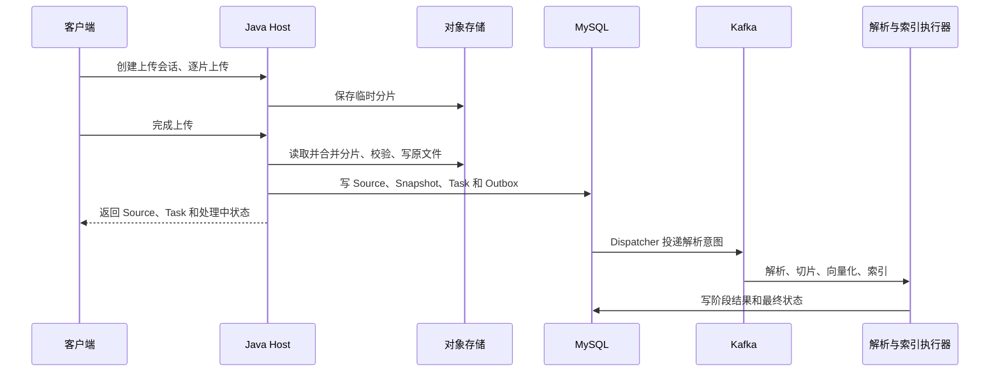

当前 `UploadService.completeUpload` 标有 `@Transactional`，合并分片会得到一个 `byte[]`，对象写入发生在数据库事务方法内。大文件合并会占用堆内存，对象存储慢会拉长完成上传请求和事务。事务回滚也不能撤销已经成功的对象写入，因此对象与数据库之间仍需清理或对账。当前已经拆出的是解析和索引长任务，上传完成本身还不是完全流式的零等待操作。

这条链路的性能记录应拆成分片写入 P95、完成上传 P95、合并峰值内存、事务持续时间、从完成上传到 Snapshot 可检索的延迟。压测固定文件大小分布、PDF 页数、并发上传数、对象存储带宽、Parser 和 Embedding Provider，再逐级增加并发。`128 MB` 是上限配置；在没有这组压测记录前，不由它推出每小时文件数或“高并发接入”。后续若完成上传成为瓶颈，优先改为流式合并和校验，把对象上传安排在短数据库事务之外，再用对象 Key、内容 Hash 和清理任务处理未知结果。这个迁移要先保留当前 Source、Snapshot 与 Task 的用户可见语义。

### 13.2 结果与故障：一个指标需要标注规则，一个案例需要时间线

现有 QA、Note 消融报告来自各 3 个确定性 Fixture Case，它能用于回归和验证评测程序，不能证明真实 Provider、真实 ES 查询或用户场景中的质量提升。我把引用支撑的评测单元定为原子 Claim：一句话如果包含两个数字和一个时间条件，就拆成三个待判断事实；每个事实都绑定引用片段、Snapshot 身份和原文定位。标注结果分为 `SUPPORTED`、`CONTRADICTED`、`INSUFFICIENT`、`OUT_OF_SCOPE`，之后再汇总答案级通过率。`SUPPORTED` 要求引用片段直接支持该事实，语义相近或只出现同一实体不足以通过。

| 亮点 | 最小评测单元 | 必须保存的判定材料 | 不能混用的结果 |
|---|---|---|---|
| Research | 必填 Cell × 一次冻结资料范围 | Gold 字段、有效来源、冲突来源、最终状态、停止原因 | `GAP` 的正确失败不等于系统执行失败 |
| QA | Query × 原子 Claim | 原问题、改写、候选排名、Citation Span、ACL 与 Snapshot | Recall 命中不等于引用支撑 |
| Note / Wiki | Source Anchor 或 PageVersion | 连续原文窗口、待确认项、来源回链、人工审阅结果 | 页面生成不等于来源正确 |
| Artifact | Job × 必需文件 / 节点 | Schema、Node Trace、Repair 动作、文件状态和校验和 | 内容通过不等于可下载 |
| Memory | 会话 × 关键约束 / Candidate | 原消息、摘要版本、候选来源、晋升与撤销决策 | Token 减少不等于关键信息保留 |

扩充 Gold Set 时先冻结题目、Source Snapshot、权限范围、预期 Claim 与判定规则；难例要覆盖否定、数字单位、版本冲突、资料缺失和权限撤销。至少抽样双人独立标注并记录分歧裁决，防止“引用支撑”由一个人临时凭感觉判断。对比实验要固定同一输入与版本，分别报告样本数、基线、主指标、延迟或成本代价、失败样本；样本很小时给原始计数，比给四位小数更诚实。Research 完成率、Artifact 交付率、Memory Token 收益在没有对应冻结报告前只给定义和复现步骤，不填假定百分比。

下面的时间线来自故障注入演练，用于说明排查与恢复动作，不代表已发生的线上事故：

| 时间 | 观察或动作 | 如何缩小范围 |
|---|---|---|
| T0 | 完成上传得到 Source 和 Task，页面显示处理中 | 记录 Workspace、Source、Snapshot、Task 和 Outbox 身份 |
| T1 | 任务迟迟不可检索，先读 MySQL 中 Snapshot 的解析与索引状态 | 确认卡在解析、投影还是最终状态提交 |
| T2 | 查 Outbox 是否仍 READY、已 Claim、已发送或进入 Dead Letter | 区分未投递与已投递后执行失败；Kafka Lag 为零不能替代这一步 |
| T3 | 查 Parser Receipt、Embedding 状态、ES Generation 与 Alias | 区分阶段成功但状态未推进、索引写入失败、Alias 未切换 |
| T4 | 对照当前 Source Head、删除标记和 Workspace ACL | 排除“其实已经被新版本替换或无权检索” |
| T5 | 只重驱缺失阶段或补写已完成 Receipt，并记录恢复结果 | 避免重新解析、重复计费或让旧 Generation 覆盖当前版本 |

这次演练的第一异常信号是任务长时间不可检索，但 Kafka Lag 无法直接解释业务状态。我用 Workspace、Source、Snapshot 和 Task 身份串起 Outbox、阶段结果与索引代次，定位是投递、执行、索引发布还是授权过滤的问题；确定已有成功结果后只补状态，缺失阶段才重驱。对应的回归断言是旧 Generation 不覆盖当前 Head、重复消息不创建第二份业务结果。若这一过程来自故障注入，应明确它是演练；没有当时的输入和日志，不能描述成真实线上事故。

### 13.3 Research：从一条冲突证据走到 Cell 的最终状态

构造问题：“课程 B 的实验成绩占总评多少？”研究表里这一格可以定义为 `entity=课程 B`、`field=实验占比`、`expected_type=百分比`、`required=true`。假设旧版大纲写 30%，当前 Snapshot 写 20%，另一份仍有效的教师说明写 25%。Worker 从三份文本抽取 Candidate 时，不应因为“30%”在旧文本中出现就直接填入 `VERIFIED`。

先做局部验证。Candidate 需要绑定确切 Evidence ID、原文范围、Source Snapshot、字段类型和执行代际。类型化校验可以比较数字、单位、日期、比较方向和否定词；当前 Worker 的 `claim_fact_validator` 对这几类事实返回 `ENTAILED`、`CONTRADICTED`、`UNKNOWN` 或 `NOT_APPLICABLE`。旧大纲即使在字面上支持 30%，当前 Snapshot 门禁仍会淘汰它；20% 和 25% 都来自有效来源时，这个 Cell 应保留冲突及来源，不让模型凭措辞选择一个。若两个 Chunk 出自同一 PDF，只能算一个来源根，不能拿 Chunk 数充当独立候选数。`candidate_quorum > 1` 的契约要求高风险任务，但“来源独立”还需用来源根、版本和发布主体来定义，不能只靠候选数量。

Host 侧把语义判断与提交判断分开。当前 Cell Merge 至少要求 Verifier Verdict 为 `SUPPORTS`、Evidence ID 存在于本 Run，并同时满足 Cell Version、Plan Revision、Entity Set Version、Active Task、Lease Epoch 和 Fencing Token。上述条件能拒绝晚到结果，却不能单独证明“25% 与 20% 谁更可信”；语义冲突仍需要 Verifier Decision 和有限的反证任务。Global Verifier 再检查必填 Cell 覆盖、同一字段跨来源是否矛盾、单位和时间是否一致，不能把若干局部通过的 Cell 自动视为整体研究完成。

对冲突只开受限 Replan：这一次只查“哪份文件在当前学期生效”，限定来源范围、查询次数、时间与 Token Budget。找到权威生效说明且无反证后再提交；找不到就输出 `CONFLICT` 或 `NEEDS_REVIEW`，报告里并列列出两种说法及依据。恢复时读取 Checkpoint 的 Plan Revision、Cell Version、预算消耗和已完成 Receipt，只补缺口；旧 Worker 的结果即使随后到达，也会因代际或版本不匹配被拒绝。研究在必填字段覆盖达标且冲突已处理时完成；预算耗尽或始终拿不到合格证据时，保留缺口并停止探索，不为提高表面完成率降低证据标准。

### 13.4 QA：用一次排序和引用判定解释 Hybrid RAG

假设用户问“课程 B 的实验占比是多少”，当前 Workspace 内有效资料出现三个候选：A 是旧介绍页，只提课程名称；B 是当前大纲，直接写实验占比；C 是另一份课程总结，提到实验但没有比例。先按 Workspace、当前 Snapshot 和指定 Source 范围过滤，再做词法与向量召回。当前 QA 检索配置的 RRF `k=60`，Vector 权重为 `0.7`、Keyword 权重为 `0.3`。下面的排名和分数是为了演示公式的构造输入，不是一次真实查询日志：

| Chunk | Keyword 名次 | Vector 名次 | 加权 RRF，`0.3/(60+K)+0.7/(60+V)` | 下一步 |
|---|---:|---:|---:|---|
| A | 1 | 3 | 约 0.01603 | 排名靠前仍要检查是否含比例 |
| B | 2 | 1 | 约 0.01631 | 进入精排与证据支撑检查 |
| C | 3 | 2 | 约 0.01605 | 可作背景，不能证明具体数字 |

RRF 只融合名次，分数高不等于能够引用。Rerank 判断问题与片段相关性；Evidence Selection 还要去重、优先保留不同 Source，并遵守当前最多 6 条 Evidence、总字符最多 8000 的 Bundle 限制。最终对“实验占比”这个原子 Claim，B 的确切原文 Span 才能成为 Citation。A 和 C 虽然相关，却不能提供比例；若 B 因权限撤销或 Snapshot 更新被回库校验剔除，回答应拒答或说明现有资料不足。Rerank 超时时保留已完成的召回结果并标记降级，再运行相关性与范围检查；证据不足时不能因为降级而放宽引用标准。

Note 不以单个比例答案为终点。它先定位 Source 与 Anchor，再沿章节扩展连续原文窗口，保留上下文中的例外条款；Wiki 需要 PageVersion 与来源回链，资料更新后进入待复核。三条链路共享 Scope 和 Snapshot 真源，但最小检索单元、输出合同和失败方式不同。消融时分别移除词法召回、向量召回、Rerank 与 Evidence Selection，记录 Recall、Claim 支撑、拒答正确性、越界引用、P95 和调用成本。当前 3 个 QA Fixture 能演示回归方向，不能用 1.0 的 Recall 宣称线上质量已经饱和。

### 13.5 Artifact：Graph、Repair 和交付分别到什么程度

当前 Compiler 解析已注册的 Action、Style、Prompt Recipe 与 Skill Graph，检查资料要求、Capability Union、Evidence Gate 和节点注册情况，再按依赖关系生成 `node_sequence`。节点图负责在编译期校验依赖与环，Worker 目前仍沿有序计划执行，每个节点后运行确定性校验与受控补全。它不是任意并行调度的 DAG；若要并行执行，还需为节点状态、依赖完成和副作用 Receipt 增加持久化与调度约束。

假设课程讲义的某节缺少引用，先看问题属于哪一层。字段缺失且冻结输入中已有可靠值，可以做确定性补全，Node Trace 记录 `PASS_WITH_REPAIR` 和动作；引用找不到有效 Source，则该节点不能靠填一个占位 Citation 通过；如果必须重新调用模型生成本节，要冻结该节点输入、模型版本、输出、下游依赖和 Operation ID，只重算受影响节点及渲染，其他节点复用已验证输出。最后一种是需要节点级持久化与重放的演进设计，不能把当前的字段补全说成已经具备完整的模型局部重跑。

Artifact Job、预留 Version、内容 Candidate 和文件各有自己的状态。Worker 完成内容回调，最多说明候选内容可验收；只有必需文件的 `object_key`、`media_type`、`size_bytes`、`checksum_sha256` 和状态都经 Host 核对，Version 才能对用户交付。当前数据库的 `artifact_file` 已有这些字段。上传或回调结果不明时，以 Delivery Token 和可查对象状态对账，不能直接创建第二个 Version。Artifact Consumer 当前在长执行结束后提交 Offset，`max.poll.interval` 默认 4200 秒、MCP 进程超时默认 3600 秒；若任务时长逼近这个窗口、分区被占用或重平衡频繁，才有充分理由演进到“先持久接纳，再由 Scheduler 持 Lease 执行”。

### 13.6 Kafka：Topic、Key 和业务版本共同决定顺序

当前消息链路的分区依据如下。Key 决定同一 Topic 中哪些消息会落在同一分区，不能保证跨 Topic 的全局顺序；业务提交仍要看 MySQL 当前状态。

| 链路 | Topic | 当前 Message Key | 需要的保护 |
|---|---|---|---|
| 原文件解析 | `noteweave.source.parse` | `sourceId` | 重复投递不重复创建业务结果；新 Snapshot 不被旧任务覆盖 |
| 检索投影 | `noteweave.retrieval.projection` | `snapshotId` | Projection Generation 与当前 Head 对照 |
| Research Agent Command | `noteweave.research.agent.command` | `agentTaskId` | `delivery_no`、Task Claim、Lease Epoch、Fencing |
| Artifact Job | `noteweave.artifact.job` | `artifactJobId` | Delivery Token、Job／Version 状态与文件交付门禁 |

同一 Source 的解析事件可以按 `sourceId` 聚在一个分区，但解析、投影和删除可能走不同 Topic，不能用 Kafka 顺序证明“删除一定先于旧索引写入”。删除先在 MySQL 写 Tombstone；即使旧投影随后落库，读路径仍以当前 Snapshot、ACL 和删除状态过滤。Research 的内部幂等键由 `agentTaskId + deliveryNo` 构成，命令重复或响应丢失时优先重放已冻结的 Finalize 结果。Artifact 目前在执行结束、识别旧 Delivery Token 或失败已可靠上报后才提交 Offset，因此消费速度会受长任务影响。Offset、Outbox 的 SENT、Worker Receipt 和业务 READY 分别回答四个不同问题，不能互相代替。

如果消息已发出，Consumer 随后崩溃，Callback 又丢失，旧 Worker 还在稍后回来，我会先按 Task／Attempt 查权威状态与已有 Receipt，再按当前 Lease、Fencing 和 Version 决定谁可写回。已有外部结果就补状态，缺失的阶段才重试。DLQ 重驱前重新检查当前 Snapshot 和删除标记，原消息不能无条件再执行一次。

### 13.7 Memory：给定预算时到底选进了哪些信息

Context 有多层输入，不能把整段对话、摘要、Memory 和 Evidence 混成一个字符串。当前 Memory Compiler 的 Pack 预算，Chat 默认为 320 估算 Token，Research／Artifact 默认为 480；这是 Memory Pack 的上限，不是整次 LLM 请求的总上下文窗口。它先过滤 USER／WORKSPACE Scope 与任务 Neighborhood，再按 Scope、Neighborhood、Utility、更新时间排序。Evidence Policy 占用 Pack 预算后，候选 Memory 的新增提示词成本若超出剩余预算就跳过，并在 Trace 中保留候选数、选中数与预算用量。当前估算按汉字和其他字符的启发式规则计数，真实 Provider 账单应另用实际 Token Usage 核对。

构造一个 Artifact Pack 的算例：预算 480，Evidence Policy 先占 80；用户确认的格式偏好估算 110，当前任务邻域的术语规则估算 150，另一条低优先级偏好估算 200。前两项进入 Pack，累计 340；最后一项加入后会达到 540，因而跳过。这个数值只用于说明选择过程，不是当前运行统计。当前用户明确要求“这次先给原文”，它的优先级高于旧的“先给结论”偏好，不能让 Memory 改写本次请求。课程资料中的“考试占比 20%”即使反复出现，也只能作为 Source Evidence，不能被晋升为 USER 偏好并参与 Citation。

用户撤销偏好后，Memory Revision 与状态指纹改变，新 Pack 不再命中旧缓存。已启动的 Research／Artifact 使用冻结的 RunInputSnapshot 保持可回放；如果变化是 Workspace 权限撤销或 Source 删除，新步骤与最终提交仍须按当前授权和 Tombstone 重新检查。若删除的是生成 Summary 所依据的原消息，Summary 应标记失效或重算，不能只清理 Memory Pack。评测时把同一会话分别走全量回放与压缩路径，既看输入 Token，也看关键约束保留、否定条件、事实回读和撤销后残留；节省 Token 但把“不要引用旧大纲”压没了，应判失败。

### 13.8 完整跨模块回答：从一份资料到可信的研究产物

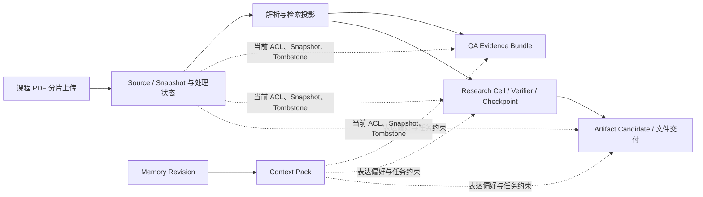

NoteWeave 是一个面向个人资料研究的工作台。我在设计时把“资料已经上传”“资料可以被检索”“研究结论已经得到证据支持”和“产物可以交付”分成不同的状态。以一份课程 PDF 为例，用户先创建上传会话并提交分片。完成上传时，Java Host 会合并和校验分片，把原文件写入对象存储，在 MySQL 创建 Source、不可变 Snapshot 和处理任务。启用 Kafka 时，解析意图与业务状态一起写入 Outbox，Dispatcher 再投递。Parser 产生带页码和章节定位的文本，后续切片、向量化和 ES 投影按 Snapshot 版本推进。上传完成仍有合并和对象写入的同步成本，异步化解决的是解析与索引长任务占用请求的问题。用户只有在所需处理状态就绪后，才能把这份资料作为当前可检索来源。

这份资料进入问答后，我不会把 ES 命中的第一个 Chunk 直接交给模型。查询先固定 Workspace、Source 范围和当前 Snapshot，再做 BM25 与 Vector 双路召回。课程编号、数字和专有词通常靠词法召回，语义改写靠向量召回；RRF 融合排名后，Rerank 处理候选相关性，Evidence Selection 再检查去重、来源覆盖与长度预算。最后还要按 MySQL 当前权限和删除状态复核。比如用户问实验占比，片段只提到“课程有实验”并不能支持“占比 20%”；只有含确切比例的原文范围才能绑定 Citation。如果所有有效证据都被过滤，QA 返回证据不足。Note 会改用资料级召回和连续原文窗口，Wiki 则保存待审阅的页面版本和来源回链。这三条链路共享资料真源，但不能用同一个 TopK 和同一个完成条件处理。

用户随后要求比较三门课程时，Deep Research 不复用刚才那段 QA 答案作为新证据，而是从冻结的 Source Snapshot 重新组织研究。Run 把“课程”作为行，把学时、实验占比、考核方式等作为待验证字段，每个 Cell 保存候选值、Evidence、版本和状态。Worker 可以搜索和抽取，但只能提交 Candidate。Local Verifier 检查引用范围、数字、单位和字段绑定，Global Verifier 检查必填覆盖与跨来源冲突。若旧版大纲写 30%，当前大纲写 20%，旧版本先被 Snapshot 门禁排除；若两份仍有效的来源分别写 20% 和 25%，系统保留冲突，只开有预算的反证任务去确认生效日期。查不到合格依据时，这个 Cell 以冲突或缺口交付，不让模型猜一个数。Checkpoint 保存 Plan、Cell 与预算进度；Worker 中断后只补未完成的 Cell，旧执行者晚到也过不了 Lease、Fencing 和版本条件。

研究结果需要生成 PDF 讲义时，Java Host 冻结资料范围、Skill 版本和输入约束，Python Worker 按注册的 Graph 模板执行并返回内容候选与 Node Trace。Schema、引用和 Capability Policy 都是验收条件，模型不能因为想完成文档就临时扩大资料范围或调用未授权工具。内容校验通过后，预留的 Artifact Version 仍不可下载；必需文件的对象位置、类型、大小、校验和与状态都确认，Version 才进入可交付状态。当前节点执行以有序计划和受控补全为主；如果以后要做到“第二章失败只重新调用模型生成第二章”，还需要持久化节点输入输出、依赖和外部操作 Receipt，才能安全地局部重跑。

长期 Memory 在这条链路里只影响表达方式和稳定的协作约束。比如用户确认“课程笔记先给结论，再附原文定位”，Context Compiler 可以把这个偏好编入当前任务的 Memory Pack；考试比例仍必须从当前 Source Snapshot 取得，Memory 不能为资料事实提供 Citation。Run 启动时冻结使用过的摘要和 Memory Revision，普通偏好更新不会让一次执行中途变味；权限撤销或资料删除则要阻断新读取，并在最终提交前再次检查。这样从问答到研究再到文件交付，每个阶段都能回答三个问题：使用的是哪份资料、谁有权推进业务状态、失败后从哪里继续。代价是多维护 Snapshot、Outbox、Cell、Version 和 Receipt，但这些对象分别挡住旧资料引用、重复执行、研究漂移和半成品交付。现阶段我会用固定回放、状态机测试和故障注入证明这些边界，质量收益和容量结论只按实际评测样本回答。
