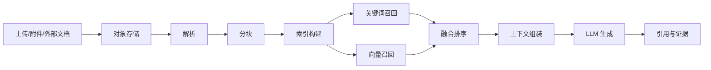

# RAG 检索链路

这一部分讲 WeKnora 如何把原始文档变成可以问答的知识资产。它不是单纯“向量库 + LLM”，而是“解析 -> 分块 -> 入库 -> 检索 -> 排序 -> 生成 -> 引用”的完整链路。
对 RAG 来说，文件上传和附件解析不是旁路，而是最前面的知识入口：图片、PDF、音频、压缩后的文档附件，都会先落到对象存储，再转成可检索、可追溯的 chunk。

## 为什么这样设计

WeKnora 的目标不是做一个通用聊天机器人，而是做企业级知识理解系统。企业场景里，用户既会问关键词明确的问题，也会问语义模糊的问题，还会要求回答可追溯、可解释、可分权限访问。因此单纯向量召回不够，单纯全文搜索也不够，必须 Hybrid。

## 链路总览

## 子文档

| 文档 | 说明 |
|---|---|
| [分块与入库](01_分块与入库.md) | 分块策略、章节保真、图片和附件处理 |
| [召回与排序](02_召回与排序.md) | Hybrid 检索、过滤、排序和多后端 |
| [答案生成与证据](03_答案生成与证据.md) | 上下文组装、引用、流式回答与失败兜底 |

## 关键 tradeoff

- 分块越细，召回越准，但上下文越容易丢。
- 检索越多路，召回越全，但延迟和噪声越高。
- 结果越可追溯，前置元数据成本越高。
- 单一后端实现最简单，但扩展和迁移能力最弱。
- 先把上传文件转成稳定 URL，再做解析和索引，链路更长，但排障和复用都更稳。

## 对 Noteweave 的启发

如果 Noteweave 要面向研究和面试沉淀，RAG 链路必须优先解决“资料结构化”和“证据回溯”，而不是只追求答案漂亮。

如果入口本身就是附件和截图，那还要优先解决“上传即归档、归档即可检索”，否则后面的总结页、面试页和知识页都会建立在不稳定素材上。
这部分可以继续配合 [文件上传与对象存储](../11_文件上传与对象存储/README.md) 和 [Redis / MQ / MySQL 任务编排](../12_Redis_MQ_MySQL任务编排/README.md) 一起看。

## 面试追问

### 1. 为什么企业场景不能只靠向量召回？

因为企业问题里有大量“看起来像自然语言，实际上依赖精确字段”的内容，比如版本号、配置名、页码、错误码、项目别名和权限边界。向量能解决语义接近，但对这些精确命中和可解释性弱。Hybrid 的价值就在于把关键词、向量和过滤一起用，再通过多路结果融合把不同召回通道的优势合并起来，而不是强迫所有信号服从同一个分数体系。

### 2. 为什么答案必须带证据？

因为企业知识系统不是一个聊天玩具，而是一个可决策工具。没有证据，用户无法判断答案是否可靠，也无法回查哪里错了。证据还能反向帮助修知识库：知道是哪个 chunk、哪个章节、哪个来源有问题。

### 3. 如果检索很慢，你会先优化哪一层？

先看召回质量和检索范围，再看排序，再看 chunk 结构，最后才是模型生成。很多“慢”其实不是计算慢，而是找了太多没必要的上下文。先把问题拆成意图，再做召回，通常比盲目加大 TopK 更有效。RAG 的核心不是“检索越多越好”，而是把外部知识以尽量准确、可控、可追溯的方式交给模型。

### 4. GraphRAG 能不能替代 RAG？

不能。图谱适合结构关系和跨文档依赖，RAG 适合证据片段和局部语义。更现实的方案是：RAG 负责找证据，图谱负责补结构，二者组合，而不是互相替代。图谱的优势是回答“哪些对象之间有关联、影响路径是什么”，RAG 的优势是回答“哪段原文支持这个结论”。

### 5. 为什么上传文件要先落对象存储，再做解析？

因为上传和解析的故障域不一样。对象存储先把原始素材稳定保存下来，解析失败也不会丢素材；后续再从稳定 URL 取回做 OCR、文本提取、切分和索引，链路更长，但可恢复性和可追责性更强。
