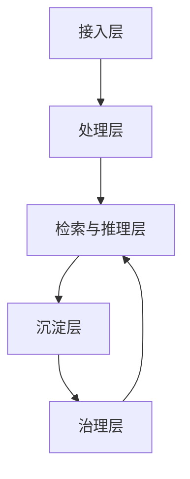

# WeKnora 系统设计总览

这组文档按“总-分-总”方式描述 WeKnora 的核心设计。目标不是复述功能清单，而是解释每个模块为什么这么拆、为什么选这些中间件、有哪些 tradeoff，以及这些选择如何共同支撑一个可追溯、可维护、可扩展的知识平台。

## 总体结构

WeKnora 可以理解为五层：

1. **接入层**：IM、Web、API、数据源导入、MCP、Skills。
2. **处理层**：解析、分块、图谱抽取、索引、任务调度。
3. **检索与推理层**：Hybrid RAG、Agent/ReAct、Web Search、MCP 工具调用。
4. **沉淀层**：Wiki、知识图谱、FAQ、知识库、缓存记忆。
5. **治理层**：RBAC、共享、审计、可观测性、配置与模型管理。

## 文档导航

| 模块 | 说明 |
|---|---|
| [RAG 检索链路](01_RAG检索链路/README.md) | 从分块、入库、检索到证据回答 |
| [Agent / MCP / Skills](02_Agent_MCP_Skills/README.md) | ReAct 编排、工具调用和技能系统 |
| [Wiki 知识编织](03_Wiki知识编织/README.md) | Wiki 生成、链接、图谱和自修复 |
| [数据源导入与解析](04_数据源导入与解析/README.md) | 外部平台同步、解析引擎和异步入库 |
| [分块召回与向量存储](05_分块召回与向量存储/README.md) | 分块策略、检索引擎和存储后端 |
| [会话与流式输出](06_会话与流式输出/README.md) | 流式对话、中断恢复和会话生命周期 |
| [权限 / RBAC / 共享](07_权限RBAC与共享/README.md) | 多租户、资源权限和跨租户共享 |
| [可观测性与运维](08_可观测性与运维/README.md) | Langfuse、审计、日志和故障定位 |
| [模型配置与多后端适配](09_模型配置与多后端适配/README.md) | 模型、解析器、存储和后端可插拔 |
| [IM / 外部集成](10_IM与外部集成/README.md) | IM、Web Search、向量库扩展与外部能力 |
| [文件上传与对象存储](11_文件上传与对象存储/README.md) | 上传接入、附件解析、图片回流与对象存储 |
| [Redis / MQ / MySQL 任务编排](12_Redis_MQ_MySQL任务编排/README.md) | 异步任务、队列协调、工作表和持久化 |

## 设计原则

- **链路分层**：不要把所有智能能力压进一个聊天接口。
- **接口抽象**：模型、存储、检索、解析器都应该可替换。
- **证据优先**：回答要可追溯到 chunk、页码、图谱或原始资源。
- **异步优先**：大文件、索引、Wiki 构建和同步要可恢复。
- **权限前置**：检索和共享都不能绕过资源权限。
- **可观测优先**：Agent 的每一步都要能追踪、回放和审计。

## 读法建议

先读 RAG、Agent、Wiki 三条主线，再看数据源导入、分块/存储、会话和治理模块。这样能先理解“知识从哪里来、怎么被查、怎么被沉淀、怎么被管住”。

## 面试视角

### 1. 为什么要把 WeKnora 拆成这些层？

因为知识平台的复杂性不在“能不能聊天”，而在“知识如何进入、如何检索、如何沉淀、如何治理”。拆层以后，系统边界更清楚，职责也更清楚。

### 2. 为什么总览页要先讲主链路，再讲模块？

因为资深面试官通常先问“你能不能讲清楚全局”，然后才问“某一层为什么这么做”。先讲主链路，后讲模块，才不会一上来就陷进细节。

### 3. 为什么这些文档要把 tradeoff 和失败模式写出来？

因为真正的系统设计不是只写“怎么做”，还要写“为什么这么做、代价是什么、哪里会坏、坏了怎么办”。这部分恰好最能体现工程判断力。
