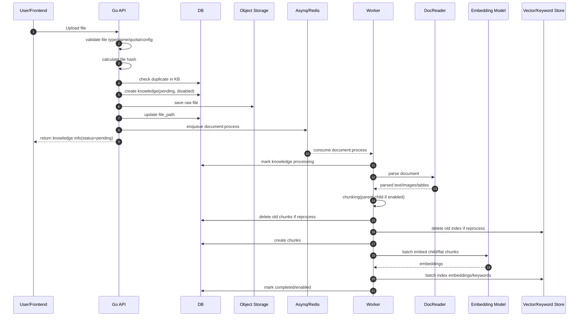
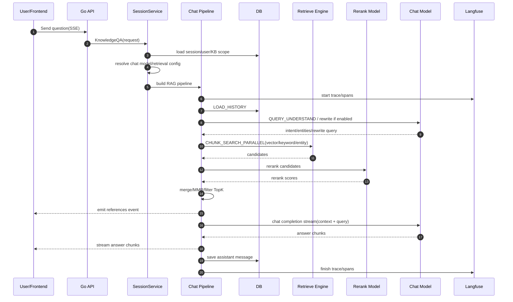
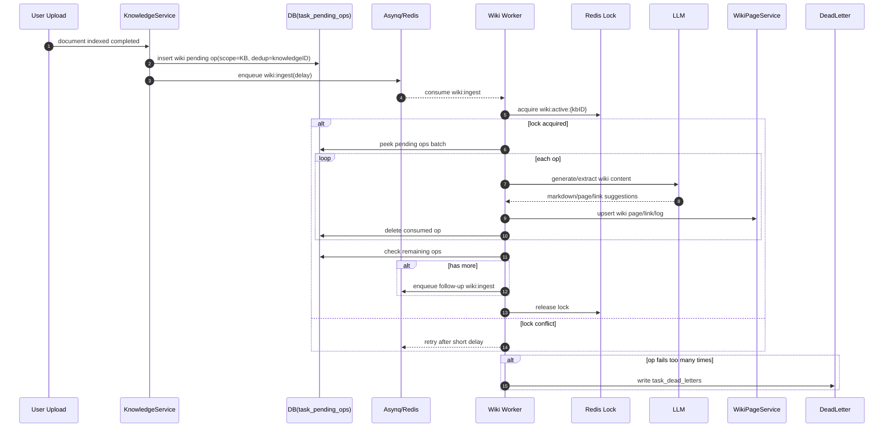
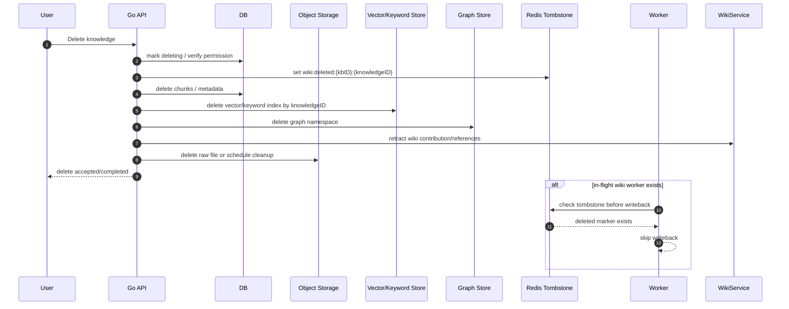
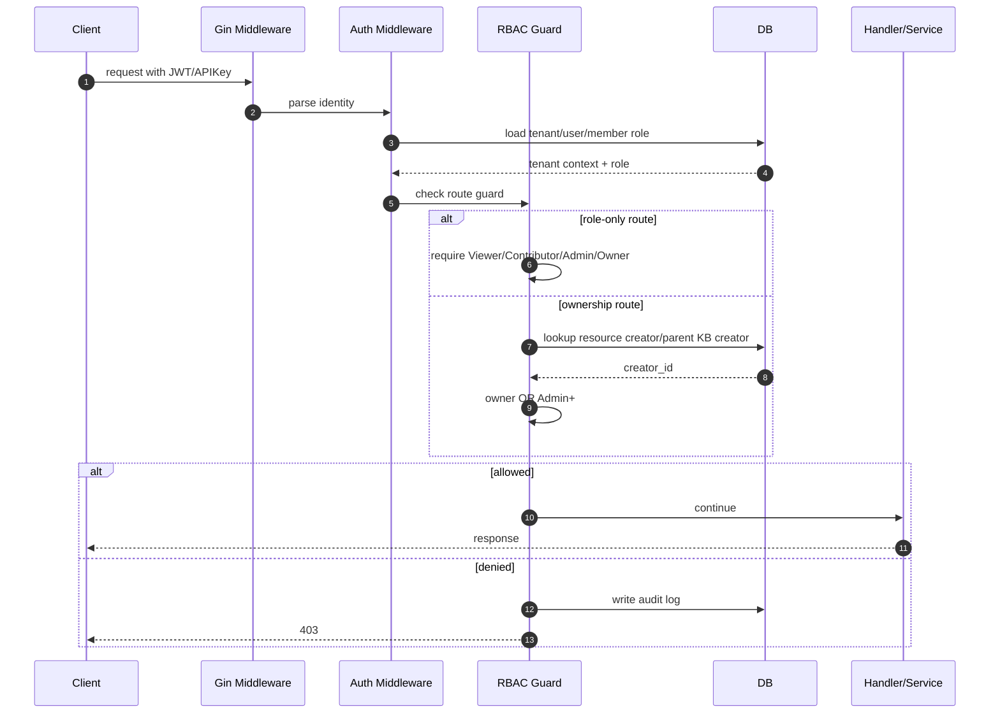
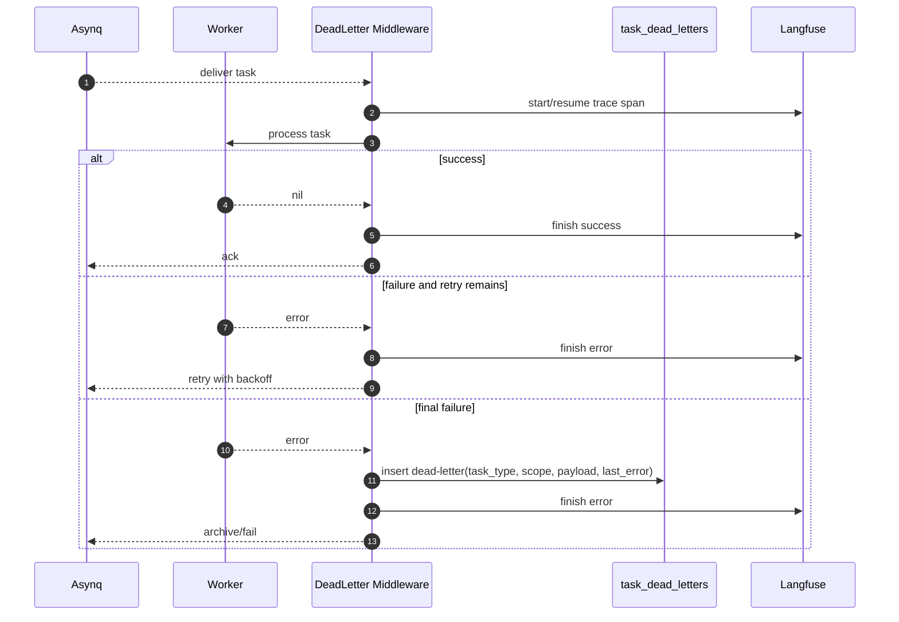

# 文件：17_核心链路时序图.md

## 1. 本主题面试官想考什么

时序图能快速暴露你是否真的理解链路。很多候选人讲概念很流畅，但一画图就混乱：哪些步骤同步，哪些步骤异步，哪些数据先落库，哪些失败可以重试，哪些是用户可见状态。

本文件提供文档入库、RAG 问答、Wiki 入库、删除清理、权限访问、任务失败几个核心链路。面试时不一定要完整画全部，但至少要能画出文档入库和 RAG 在线问答两张。

## 2. 高频问题清单

### 基础问题

- 你能画一下文档上传到可问答的时序图吗？
- 你能画一下用户提问到流式回答的时序图吗？
- 哪些步骤是同步的，哪些是异步的？
- 用户什么时候能看到 references？

### 进阶问题

- 任务失败在哪一层被记录？
- trace 如何从 HTTP 请求传到 worker？
- 删除文档时如何避免旧任务写回？
- Wiki 入库为什么要先写 pending ops？

### 深挖追问

- 如果向量库写入失败，时序图怎么变化？
- 如果用户没有权限访问 KB，在哪一步拦截？
- 如果 LLM 首 token 慢，应该看时序图哪一段？
- 如果 worker 崩溃，哪些状态可以恢复？

## 3. 文档上传入库时序图

### 面试官为什么问

这张图考察你是否知道上传接口返回时，后台任务还没完成。

### 讲解重点

- 上传 API 同步做校验、去重、保存、入队。
- 解析和索引异步做。
- knowledge 初始状态是 pending/disabled。
- worker 成功后才 completed/enabled。
- 重处理时要先清理旧 chunk 和旧索引。

### 可直接复述的面试回答

这条链路里最关键的是同步和异步的边界。上传请求只做前置校验、hash 去重、创建 pending 状态的 knowledge、保存原文件和投递任务，然后就返回。真正的文档解析、分块、Embedding 和索引写入都在 worker 里异步完成。这样可以避免 HTTP 超时，也能让后台任务具备重试和 dead-letter 能力。只有 worker 完成后，knowledge 才会变成 completed/enabled，真正参与问答。

### 常见追问

- 如果 API 保存文件成功但入队失败怎么办？
- 为什么先 create knowledge 再 save file？
- 如果 reprocess，为什么要先删旧索引？

### 常见坑

不要把 API 返回成功画在索引完成之后。那会说明你没理解异步入库。

---

## 4. RAG 在线问答时序图

### 面试官为什么问

它考察你是否理解 RAG 在线链路不是“查库 + 问模型”，而是一条多阶段 pipeline。

### 讲解重点

- 先解析 session、tenant、KB 范围和模型配置。
- query understand 可判断是否需要检索。
- chunk search 和 entity search 可以并行。
- rerank 后还要 merge、MMR、filter。
- references 可以先于完整答案返回。
- LLM 通过 SSE 流式输出。

### 可直接复述的面试回答

RAG 在线问答首先会解析当前会话、租户、知识库范围和检索配置，然后构建 pipeline。pipeline 会加载历史，做 query understand 和 rewrite，再并行执行向量、关键词和图谱检索。候选结果会经过 rerank、合并、MMR 和 TopK 过滤，形成最终上下文。系统会先把 references 事件返回给前端，然后调用 Chat Model 流式生成答案。整个链路通过 Langfuse 记录 retrieval、rerank、LLM 等阶段耗时。

### 常见追问

- references 是在生成前还是生成后返回？
- 如果 query understand 判断不需要检索怎么办？
- 如果 rerank 模型不可用如何降级？

### 常见坑

不要漏掉权限和知识库范围解析。RAG 不是全库查，必须先确定用户有权访问哪些知识。

---

## 5. Wiki 入库批处理时序图

### 面试官为什么问

Wiki 模式的复杂度主要在任务系统，而不是让 LLM 写 Markdown。

### 讲解重点

- pending ops 是持久任务池。
- Asynq 只是触发和调度。
- Redis active lock 控制同 KB 并发。
- batch 限制单次任务耗时和成本。
- dead-letter 隔离坏任务。

### 可直接复述的面试回答

Wiki 入库不是每个文档独立并发生成，因为同一个 KB 的多个文档可能更新同一个页面或链接。WeKnora 会先把文档写入 task_pending_ops，再延迟触发 wiki:ingest，起到 debounce 作用。worker 执行时先拿 KB 级 active lock，拿到后从 pending ops 拉一批文档处理，调用 LLM 生成页面内容并 upsert Wiki 页面。处理完删除 consumed ops，如果还有剩余就继续投递下一批。失败多次的 op 会进入 dead-letter。

### 常见追问

- 为什么 pending ops 不直接放 Redis？
- lock 过期怎么办？
- 同一个 KB 串行会不会太慢？

### 常见坑

不要说“Wiki 入库就是一个异步任务”。重点是 pending ops、batch、lock、dead-letter 的组合。

---

## 6. 删除 Knowledge 清理时序图

### 面试官为什么问

删除是派生数据一致性的集中考点。

### 讲解重点

- 删除不只是删 knowledge 表。
- 需要清理 chunk、索引、图谱、Wiki、对象存储。
- tombstone 防止旧 worker 写回。
- 跨系统无法强事务，只能最终一致。

### 可直接复述的面试回答

删除文档时，系统要清理的不止一条 knowledge 记录，还包括 chunk、向量/关键词索引、图谱 namespace、Wiki 引用、原始文件和 pending 任务。因为这些数据分布在 DB、对象存储、向量库、图数据库和 Redis 中，不能用一个本地事务强一致完成，所以要做幂等清理和最终一致。特别是 Wiki 生成可能有 in-flight worker，所以删除时要写 tombstone，worker 写回前检查到文档已删除就跳过，避免删了又回来。

### 常见追问

- 对象存储删除失败怎么办？
- 删除索引失败是否影响用户返回？
- Wiki 页面由多个文档共同贡献怎么撤回？

### 常见坑

不要承诺“删除接口返回时所有系统一定强一致”。更真实的回答是状态标记、幂等删除、后台补偿和审计。

---

## 7. 权限校验时序图

### 面试官为什么问

知识库系统的安全边界必须落在服务端路由和数据访问层。

### 可直接复述的面试回答

WeKnora 的权限校验先通过 Auth 中间件解析 JWT 或 API Key，拿到 tenant、user 和角色。路由层再根据 guard 判断权限：普通读操作可能只需要 Viewer，租户级配置需要 Admin，删除租户需要 Owner。对于 KB、Agent、Knowledge、Chunk、Wiki 这类有 owner 的资源，还要做 ownership lookup，比如 chunk 要回溯到 knowledge 再回溯到 KB creator，判断调用者是不是资源 owner 或 Admin+。拒绝时写 audit log。

### 常见追问

- 用户拿到 chunk_id 能不能绕过权限？
- API Key 算哪个角色？
- RBAC 关闭时为什么还要日志模式？

### 常见坑

不要说“前端不展示按钮就行”。权限必须在服务端校验。

---

## 8. 异步任务失败与 Dead-letter 时序图

### 面试官为什么问

它考察你是否知道异步失败不应该只靠日志。

### 可直接复述的面试回答

异步任务失败时，不能只写日志。WeKnora 的 Asynq worker 外层有 dead-letter middleware，任务失败但还有重试次数时，交给 Asynq 做 backoff；如果已经是最后一次失败，就把任务类型、租户、scope、payload 和 last_error 写入 task_dead_letters。这样运维可以按租户、KB、任务类型查询失败任务，并支持后续人工重放或补偿。同时 Langfuse middleware 会记录任务 trace，方便看到失败发生在哪个阶段。

### 常见追问

- 哪些错误不应该重试？
- dead-letter 如何重放？
- 如果写 dead-letter 自己失败怎么办？

### 常见坑

不要把 dead-letter 和普通 error log 混为一谈。dead-letter 是可查询、可恢复的失败任务事实。

---

## 9. 本主题总结

面试时能画图非常加分。建议至少背熟：

- 文档上传入库图。
- RAG 在线问答图。
- Wiki pending ops + active lock 图。
- 删除 tombstone 图。

画图时要特别强调同步/异步边界、状态变化、失败处理和权限检查。

## 10. 面试前自查清单

- 我是否能 2 分钟画出文档入库时序图？
- 我是否能 2 分钟画出 RAG 在线问答时序图？
- 我是否能解释 Wiki 为什么要 pending ops 和 active lock？
- 我是否能解释删除为什么需要 tombstone？
- 我是否能解释 dead-letter 在时序图中的位置？
