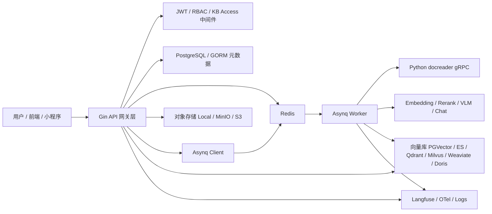

# 文件：19_中间件总览与选型方法论.md

## 1. 本主题面试官想考什么

这一主题不是考你能不能背出“用了哪些中间件”，而是考你是否真的理解系统为什么需要这些基础设施，以及你能不能把业务链路、非功能需求和技术选型串起来。

面试官通常会重点看：

- 你是否能从业务链路反推出中间件职责，而不是只罗列技术名词。
- 你是否知道每个中间件解决的核心矛盾，比如削峰、解耦、持久化、检索、对象存储、可观测性。
- 你是否能说清楚为什么选这个方案，而不是“项目里就是这么用的”。
- 你是否理解不同方案的边界，比如 Redis/Asynq 和 Kafka 的区别、Postgres/pgvector 和专业向量库的区别、S3/MinIO 和本地磁盘的区别。
- 你是否有工程落地意识，比如成本、部署复杂度、运维能力、扩展性、一致性、故障恢复、安全隔离。

基于当前 WeKnora 代码和部署文件，可以确认项目涉及的主要中间件/基础设施包括：

- Web 框架与网关层：Gin、CORS、JWT、RBAC、Recovery、Logger、Trace middleware。
- 元数据数据库：PostgreSQL，开发/测试兼容 SQLite，ORM 使用 GORM。
- 异步任务队列：Asynq，底层依赖 Redis。
- 缓存/流式事件/锁：Redis，包括 Asynq broker、Redis Lists、Pub/Sub、Wiki ingest active lock 等场景。
- 向量检索中间件：Postgres/pgvector、Elasticsearch、Qdrant、Milvus、Weaviate、Doris、Tencent VectorDB 等。
- 对象存储：本地、MinIO、S3/COS/TOS/OSS/KS3 等兼容云存储。
- 文档解析服务：独立 Python docreader，通过 gRPC/HTTP 与 Go 主服务通信。
- 可观测性：Langfuse、OpenTelemetry、日志、异步任务 dead-letter。
- 模型服务抽象：Chat、Embedding、Rerank、VLM、ASR 等模型接口封装。

## 2. 高频问题清单

### 基础问题

- 这个项目用了哪些中间件？它们分别解决什么问题？
- 为什么文档入库要用异步任务队列，而不是 HTTP 接口里同步处理？
- Redis 在项目里承担了哪些职责？
- PostgreSQL 和向量库分别存什么？为什么不能只用一个数据库？
- 为什么文件要放对象存储，而不是直接存数据库？
- docreader 为什么独立成 Python 服务？
- Langfuse 和普通日志有什么区别？

### 进阶问题

- 如果让你重新做选型，你会怎么选队列、数据库、向量库和对象存储？
- Asynq 和 Kafka/RabbitMQ/RocketMQ 相比有什么优缺点？
- Postgres/pgvector 和 Milvus/Qdrant/Weaviate 怎么取舍？
- Redis 同时承担队列、缓存、锁、流式事件，会不会职责过重？
- 中间件故障时系统如何降级？
- 多租户场景下，中间件层怎么做隔离？
- 如何保证数据库元数据和向量库索引的一致性？

### 深挖追问

- 如果 Redis 挂了，文档入库、Wiki 同步和流式输出分别会受什么影响？
- 如果向量库写入成功但数据库事务失败，怎么恢复？
- 如果对象存储文件丢失但知识库元数据还在，怎么排查？
- 为什么不直接用 Kafka 做所有异步任务？
- 为什么不把 docreader 合并到 Go 服务里？
- 如果需要支持十倍文档量，你会优先扩哪个中间件？
- 如果要 SaaS 化，哪些中间件配置必须按租户隔离？

### 压力追问

- 你是不是只是把开源组件拼起来了？你的技术难点在哪里？
- 这些中间件是不是过度设计？能不能一个 Postgres 全部搞定？
- 你能讲出 Asynq 底层怎么基于 Redis 实现延迟、重试和优先级吗？
- 你能讲出 HNSW/IVF/倒排索引分别适合什么检索场景吗？
- 为什么你说对象存储更适合文件？数据库 BLOB 不也能存吗？
- 如果面试官让你砍掉一半中间件，你会怎么裁剪？

## 3. 项目中间件全景图

从链路上看，中间件不是平铺的，而是围绕两个核心链路组织：

- 文档入库链路：API 接收文件 -> 对象存储保存原文 -> DB 保存元数据 -> Asynq 投递任务 -> Worker 调 docreader 解析 -> 切 chunk -> 调 embedding -> 写向量库和数据库。
- 在线 RAG 链路：API 接收问题 -> 权限校验 -> 查询会话和知识库配置 -> embedding query -> 向量库召回 -> rerank -> prompt 组装 -> 调 LLM -> SSE/流式事件返回 -> Langfuse 记录链路。

中间件选择的本质是把不同类型的工作负载拆开：

- 元数据是强结构化、强一致性、事务友好数据，所以用 PostgreSQL。
- 原始文件是大对象、低频随机读、高吞吐上传下载，所以用对象存储。
- 文档解析和模型调用耗时长、失败率高、需要重试，所以用异步任务。
- 向量相似度检索是专门的 ANN/索引问题，所以抽象多种向量库。
- trace、prompt、模型输入输出需要可观测，所以引入 Langfuse。

## 4. 问答与讲解

### Q1：你们项目用了哪些中间件？为什么需要这么多？

#### 面试官为什么问

这个问题是在判断你是否真的理解系统架构。很多候选人回答会停留在“我们用了 Redis、Postgres、MinIO、Qdrant”这种清单式描述，但面试官想听的是：每个中间件在哪条链路里，解决什么问题，为什么不能由应用代码自己解决。

#### 先给结论

我们项目的中间件不是为了堆技术栈，而是按 RAG 系统的负载特征拆出来的。

#### 回答思路

可以按功能域回答，而不是按技术名词回答：

1. 接入层：Gin、JWT、RBAC，负责 API 路由、鉴权、权限隔离。
2. 数据层：Postgres/GORM 存结构化元数据，SQLite 用于轻量/测试场景。
3. 异步层：Asynq + Redis 承载文档解析、知识库加工、Wiki ingest 等耗时任务。
4. 检索层：多向量库抽象，支持 PGVector、ES、Qdrant、Milvus、Weaviate 等不同部署场景。
5. 文件层：对象存储保存原始文件、图片和解析中间产物。
6. 解析层：Python docreader 作为独立服务处理 PDF、Office、图片等复杂格式。
7. 可观测层：Langfuse/OpenTelemetry/log/dead-letter，用来追踪 RAG 链路和异步失败。

#### 结合我的项目怎么答

可以这样讲：

WeKnora 不是单纯的 CRUD 系统，它的核心链路包含文件上传、文档解析、chunk 切分、embedding、向量索引、RAG 问答、Wiki 生成和 Agent 工具调用。不同环节的负载特征差异很大，所以中间件是按职责拆的。

Postgres 负责租户、知识库、文档、chunk、会话、任务状态等结构化数据；对象存储负责保存原始文件和解析出来的图片资源；Asynq + Redis 负责把长耗时、易失败的文档处理从 HTTP 请求里解耦出来；向量库负责 ANN 检索；docreader 独立处理复杂文档解析；Langfuse 负责把一次 RAG/Agent 调用中的 prompt、retrieval、rerank、generation、tool call 串成 trace。

#### 技术原理 / 链路设计讲解

中间件选型首先要看数据和任务类型。

结构化数据适合关系型数据库，因为它需要事务、约束、索引、Join、分页和权限过滤。比如 tenant、knowledge_base、knowledge、chunk、session、message 这些对象之间有明确关系，Postgres/GORM 很适合。

文件内容不适合直接塞数据库。PDF、图片、Office 文件可能很大，也可能被多次下载、预览或重新解析。对象存储采用 key-value/object 模型，天然适合大文件、分片上传、生命周期管理和 CDN 分发。

文档入库不适合同步处理。解析 PDF、OCR、抽图、embedding 和批量写向量库都可能持续数秒到数分钟，如果放在 HTTP 请求里，会导致超时、连接占用、重试困难、用户体验差。Asynq 把请求转成任务，Worker 后台处理，失败可以重试，队列可以限流和削峰。

向量检索不只是数据库查询。ANN 检索要解决高维向量的近似最近邻问题，常见索引包括 HNSW、IVF、PQ 等；Elasticsearch 还擅长关键词倒排和 hybrid search；Milvus/Qdrant/Weaviate 则面向向量搜索做了专门优化。

RAG 系统可观测性比普通业务更复杂。一次回答质量差，原因可能在 query rewrite、embedding、召回、rerank、prompt、LLM、工具调用任何一环，所以需要 trace 级别的观测，而不仅是日志。

#### 技术栈特点与选型理由

| 功能 | 当前方案 | 主要优势 | 主要代价 | 替代方案 |
| --- | --- | --- | --- | --- |
| API 接入 | Gin | Go 生态成熟、性能好、简单可控 | 需要自己组织中间件和错误处理 | Echo、Fiber、gRPC Gateway |
| 元数据 | PostgreSQL + GORM | 事务强、生态成熟、JSON/向量扩展好 | 大规模向量场景不如专用向量库 | MySQL、MongoDB |
| 异步任务 | Asynq + Redis | 轻量、重试/延迟/优先级开箱即用 | 不适合超大吞吐事件流 | Kafka、RabbitMQ、RocketMQ |
| 缓存/锁/流 | Redis | 低延迟、数据结构丰富、部署简单 | 内存成本、持久化和一致性要关注 | Memcached、etcd、DB lock |
| 向量检索 | 多引擎抽象 | 兼容本地、私有化、云服务 | 适配复杂、能力差异要屏蔽 | 单一 Milvus/Qdrant/ES |
| 对象存储 | MinIO/S3/COS/TOS/OSS | 大文件友好、云原生、可迁移 | 一致性和权限需要设计 | 本地磁盘、DB BLOB |
| 文档解析 | Python docreader + gRPC | 利用 Python 文档生态，和 Go 主服务解耦 | 多服务部署和网络调用成本 | Go 内置解析、HTTP 服务 |
| 可观测 | Langfuse + OTel + logs | 面向 LLM/RAG trace，方便质量排查 | 需要治理敏感数据和采样 | Jaeger、Prometheus、ELK |

#### 可直接复述的面试回答

> 我们项目的中间件不是为了堆技术栈，而是按 RAG 系统的负载特征拆出来的。Postgres 存租户、知识库、文档、chunk、会话这些强结构化元数据；对象存储保存原始文件和解析资源；Asynq 加 Redis 承载文档解析、embedding、Wiki ingest 这类长耗时任务；向量库负责高维相似度检索；docreader 独立成 Python 服务处理 PDF/Office/OCR 这类 Go 生态不擅长的解析；Langfuse 和 OTel 用来观测 RAG/Agent 链路。这样拆的好处是每类数据和任务都交给最适合的基础设施，同时也方便后续按瓶颈独立扩容。

#### 常见追问

- 如果只保留 Postgres、Redis、对象存储三个中间件，哪些能力会退化？
- 为什么向量检索不直接放 Postgres？
- 为什么 Redis 同时承担队列和流式事件？
- Langfuse 记录模型输入输出会不会有安全风险？

#### 常见坑

最常见的坑是只背技术栈，不讲业务链路。比如说“我们用了 Redis 做缓存”，但项目里 Redis 不只是缓存，还支撑 Asynq、流式事件、锁和 Pub/Sub。另一个坑是把“用了很多中间件”包装成高级架构，却讲不出每个中间件的失败影响和替代方案。

---

### Q2：中间件选型时你们主要考虑哪些维度？

#### 面试官为什么问

这个问题考察架构取舍能力。大厂面试不希望听到“这个组件性能高”“这个组件流行”，而是希望你能从业务规模、数据模型、一致性、团队运维能力、成本和扩展性角度做判断。

#### 先给结论

我做中间件选型会先看工作负载，而不是先看组件名。

#### 回答思路

可以按六个维度展开：

- 负载特征：读多写多、吞吐、延迟、任务耗时、数据大小。
- 一致性要求：是否需要事务、是否允许最终一致。
- 扩展方式：垂直扩容、水平扩容、分片、复制。
- 运维复杂度：部署、备份、监控、故障恢复。
- 生态兼容性：SDK、云服务、私有化部署、社区成熟度。
- 成本和团队能力：是否值得引入新组件。

#### 结合我的项目怎么答

在 WeKnora 里，不同中间件的选型维度非常典型：

- 文档入库任务耗时长、失败可重试、吞吐中等，所以 Asynq 比 Kafka 更轻量。
- 元数据需要事务和权限过滤，所以用 Postgres，而不是 NoSQL。
- 向量库场景差异大，有本地轻量部署、私有化、高性能检索、混合检索等需求，所以做多引擎抽象。
- 对象存储是为了支持大文件、多云部署和私有化，MinIO 可以作为本地 S3 兼容实现。
- docreader 独立是为了让文档解析依赖和主服务解耦，也方便单独扩容解析能力。

#### 技术原理 / 链路设计讲解

选型背后可以抽象为 CAP 和工作负载匹配。

Postgres 适合 CP 倾向的元数据场景：事务提交后状态可靠，权限查询可控，复杂筛选可以用索引优化。

Redis 适合低延迟临时状态：队列 broker、短期流事件、分布式锁、Pub/Sub 这类数据即使短期存在也有意义，且访问频率高。

对象存储适合 AP/最终一致倾向的大对象：文件上传后通过 key 引用，不参与复杂事务；系统通常通过 DB 元数据记录 object key，再异步清理孤儿对象。

向量库适合高维 ANN：它牺牲一部分精确性换取低延迟召回。不同向量库在索引构建、过滤能力、分片、副本、混合检索方面差异很大。

#### 可直接复述的面试回答

> 我做中间件选型会先看工作负载，而不是先看组件名。比如元数据需要事务和权限过滤，所以用 Postgres；文档处理是长耗时任务，需要重试和削峰，所以用 Asynq；文件是大对象，适合对象存储；向量召回是高维近似检索，所以抽象向量库；LLM 链路排障需要看到 prompt、retrieval、rerank 和 generation，所以用 Langfuse 这类 LLM observability。我们没有追求所有场景都上最重的组件，而是尽量在能力、复杂度和运维成本之间平衡。

#### 常见追问

- 你怎么判断一个中间件是不是过度设计？
- 为什么不是所有异步任务都用 Kafka？
- 如果团队没有运维 Milvus 的能力怎么办？
- 如果客户只能部署单机版，怎么裁剪？

#### 常见坑

不要把“性能高”当作唯一理由。很多选型失败不是因为性能不够，而是因为复杂度超过团队能力，或者组件的语义和业务不匹配。例如 Kafka 吞吐高，但并不天然适合需要按任务状态、重试次数、延迟执行、任务结果观察的后台 job 场景。

---

### Q3：如果面试官质疑中间件太多，你怎么回应？

#### 面试官为什么问

这是压力追问，考察你是否理解“复杂度预算”。一个成熟工程师不会无脑堆中间件，也不会为了简化而牺牲关键能力。

#### 先给结论

我会先承认中间件确实会带来部署和运维复杂度，但这个项目的复杂度主要来自 RAG 链路本身。

#### 回答思路

要承认复杂度，然后说明为什么这些复杂度是有收益的：

1. 核心链路本身复杂，不同负载不可混在一起。
2. 有些中间件是可选能力，比如 Langfuse、不同向量库、自建 MinIO。
3. 基础版可以裁剪，高级部署可以扩展。
4. 抽象层降低业务代码和中间件耦合。

#### 结合我的项目怎么答

可以说 WeKnora 的部署并不是强制所有中间件同时启用。比如向量库通过 `RETRIEVE_DRIVER` 和 `vector_stores` 抽象，可以从 Postgres/SQLite 起步，也可以切到 Qdrant/Milvus/Weaviate；对象存储可以本地，也可以 MinIO/S3；Langfuse 是可选观测栈；Wiki/Agent 能力也可以按配置启用。

#### 技术原理 / 链路设计讲解

降低中间件复杂度通常有三种方式：

- 分层抽象：业务层依赖 interface，不直接依赖某个 SDK。
- 能力分级：单机轻量版和生产高可用版使用不同中间件组合。
- 故障隔离：非核心能力可降级，不让观测、异步增强、某个外部模型拖垮主链路。

当前项目里比较符合这个思路的地方包括：

- VectorStore 抽象把不同向量库封装成统一配置和检索接口。
- FileService 抽象屏蔽本地/MinIO/S3/COS/TOS/OSS 等对象存储差异。
- docreader 通过 DocumentReader 接口和 gRPC 客户端封装，主业务不感知解析细节。
- Langfuse middleware 关闭时应当是 pass-through，不影响主业务链路。

#### 可直接复述的面试回答

> 我会先承认中间件确实会带来部署和运维复杂度，但这个项目的复杂度主要来自 RAG 链路本身。文档解析、embedding、向量索引、对象存储、在线召回、模型生成和可观测性是不同类型的负载，强行塞进一个数据库或一个进程里，短期看简单，长期会导致超时、扩展困难和排障困难。所以我们的做法是核心路径保留必要中间件，同时通过接口抽象和配置让它可裁剪。比如轻量部署可以用 Postgres/SQLite、本地存储；生产部署再切到对象存储、专业向量库和 Langfuse。

#### 常见追问

- 你会把哪些中间件设为必选，哪些设为可选？
- 如果部署在客户内网，哪些组件最难交付？
- 如果 Redis 和 Postgres 都挂了，系统还能提供什么能力？

#### 常见坑

不要说“中间件越多越解耦”。中间件越多，故障点、配置项、监控项和数据一致性问题也越多。正确的说法是：只有当中间件解决了明确的负载或可靠性问题时，引入才是合理的。

## 5. 本主题总结

中间件分析要围绕三个问题展开：

- 它解决了哪条链路的什么矛盾？
- 为什么当前方案比替代方案更适合？
- 出问题时如何降级、恢复和扩展？

面试中最好的回答方式不是罗列“用了 Redis、Postgres、MinIO”，而是用业务链路带出中间件职责：文档入库为什么异步、文件为什么对象存储、检索为什么抽象向量库、LLM 为什么需要专门可观测。

## 6. 面试前自查清单

- 我是否能画出 WeKnora 的中间件全景图？
- 我是否能解释每个中间件解决的问题？
- 我是否能说出 Redis 在项目里的至少四种用途？
- 我是否能解释 Asynq 为什么比 Kafka 更适合当前任务队列？
- 我是否能讲清楚对象存储和数据库存文件的区别？
- 我是否能解释不同向量库的取舍？
- 我是否能说明哪些中间件是必选，哪些可以裁剪？
- 我是否能说出每个中间件故障后的影响范围？
