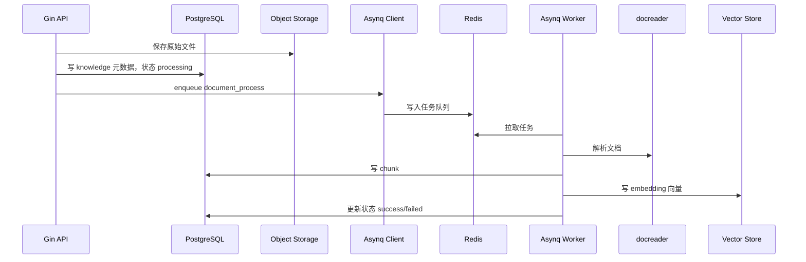

# 文件：20_Redis与Asynq任务队列中间件深挖.md

## 1. 本主题面试官想考什么

Redis 和 Asynq 是 WeKnora 文档入库、Wiki ingest、异步后处理里非常核心的一组中间件。面试官不会只问“Redis 是干什么的”，更可能围绕异步任务、削峰填谷、重试、幂等、死信、优先级、锁、流式事件这些点深挖。

当前项目里能确认的事实：

- Asynq 作为异步任务队列，底层使用 Redis。
- `router/task.go` 注册了文档处理、chunk 提取、FAQ 导入、问题生成、摘要生成、KB clone、知识移动、删除、图片多模态、post process、data source sync、Wiki ingest 等任务。
- Asynq 配置了 `critical/default/low` 三个队列，权重分别为 `6/3/1`。
- Wiki ingest 并发冲突使用自定义 retry delay，固定约 15 秒，而不是默认指数退避。
- 项目有 `asynqdl` middleware，在任务最终失败后写入 dead-letter 表。
- Redis 还用于流式事件 `RedisStreamManager`，采用 Redis List 的 `RPush/LRange/Expire`。
- Agent approval 里使用 Redis Pub/Sub 做跨实例决策通知。

## 2. 高频问题清单

### 基础问题

- Redis 在你们项目里有哪些用途？
- Asynq 是什么？为什么它需要 Redis？
- 为什么文档入库要异步？
- Asynq 和直接 goroutine 有什么区别？
- Asynq 的重试和死信怎么做？
- Redis List、Stream、Pub/Sub 分别有什么区别？

### 进阶问题

- Asynq 和 Kafka/RabbitMQ/RocketMQ 怎么选？
- Redis 做队列有什么可靠性风险？
- 任务失败后如何避免重复执行带来的脏数据？
- 你们为什么设计 critical/default/low 三个队列？
- Wiki ingest 为什么要单独定制 retry delay？
- Redis 同时承载队列、流事件、锁，会不会互相影响？

### 深挖追问

- Asynq 底层如何实现延迟任务、重试和优先级？
- 如果 Redis 挂了，已经接收的上传请求会怎样？
- 如果 Worker 执行到一半宕机，任务会丢吗？
- 死信表和 Asynq 自带 archived queue 有什么区别？
- 如何设计任务幂等键？
- 如果任务积压，你怎么排查是 Redis、Worker、docreader、embedding 还是向量库瓶颈？

### 压力追问

- 为什么不用 Kafka？Kafka 不是更可靠、吞吐更高吗？
- Redis 本来是缓存，你用它做队列是不是不专业？
- 如果同一个文档重复提交两次，会不会写重复 chunk 和向量？
- 如果任务最终失败，用户怎么感知？
- 如果要支持百万级文档入库，Asynq 还能撑住吗？

## 3. Redis 在项目中的职责拆分

| 职责 | 项目位置 | 典型数据 | 特点 | 风险 |
| --- | --- | --- | --- | --- |
| Asynq broker | `router/task.go` | 任务 payload、retry 状态、schedule 状态 | 异步、重试、优先级 | Redis 故障影响任务投递和执行 |
| 流式事件缓存 | `internal/stream/redis_manager.go` | session/message 的事件列表 | 低延迟、TTL、短期可读 | 不适合永久存储 |
| Wiki/任务锁 | Wiki ingest 相关服务 | active lock、并发控制 key | 防止同一 KB 并发写入 | 锁 TTL 和重试间隔要匹配 |
| Pub/Sub | Agent approval gate | 工具审批决策通知 | 跨实例广播、低延迟 | Pub/Sub 不持久化，订阅者掉线会丢消息 |
| Langfuse 自建依赖 | docker compose opt-in | Langfuse 队列/缓存 | 复用 Redis DB | DB 隔离和 key prefix 要注意 |

## 4. 问答与讲解

### Q1：为什么文档入库要用 Asynq + Redis 做异步任务？

#### 面试官为什么问

文档入库是 RAG 项目的核心链路。面试官想确认你是否理解“耗时任务不能阻塞请求线程”这个基本原则，以及是否知道异步化之后带来的新问题：任务状态、重试、幂等、一致性、失败可见性。

#### 先给结论

文档入库链路包含解析、chunk、embedding、写向量库和后处理，这些步骤耗时长且外部依赖多，如果在 HTTP 请求里同步做，很容易超时，也没有好的重试和削峰能力。

#### 回答思路

可以从同步处理的问题讲起：

1. 文档解析、OCR、图片提取、embedding、写向量库都很耗时。
2. HTTP 请求有超时限制，同步处理会导致连接占用和用户体验差。
3. 模型服务和向量库都有失败概率，需要重试。
4. 批量上传会产生峰值，需要队列削峰。
5. 入库任务需要后台状态跟踪和失败恢复。

#### 结合我的项目怎么答

WeKnora 的上传接口只负责接收文件、保存元数据和投递任务。真正耗时的文档处理由 Asynq worker 执行。项目在 `router/task.go` 中注册了多种任务类型，比如文档处理、chunk 提取、图片多模态、知识后处理、Wiki ingest 等。这样设计后，API 层可以快速返回，后台 Worker 可以按队列优先级、重试策略和并发能力处理。

#### 技术原理 / 链路设计讲解

Asynq 是 Go 生态里的 Redis-backed task queue。它把任务抽象为：

- task type：任务类型，比如 document_process、wiki_ingest。
- payload：JSON 或二进制参数，包含 tenant_id、knowledge_id、knowledge_base_id 等。
- queue：队列名，可以按优先级拆分。
- retry/max_retry：失败重试次数。
- timeout/deadline：任务执行时间限制。
- schedule：延迟执行或定时执行。

基于 Redis，Asynq 通常会使用不同 key 维护 pending、active、retry、scheduled、archived 等状态。Worker 拉取 pending 任务后放到 active，执行成功则删除，执行失败则根据 retry 策略放入 retry/scheduled，超过最大重试后进入 archived。项目又在外层补了 dead-letter 表，把最终失败任务写入数据库，便于 SQL 查询和运营排障。

在 WeKnora 的链路里：



#### 技术栈特点与选型理由

选择 Asynq 的原因：

- 和 Go 服务集成成本低。
- Redis 部署简单，项目本身也已经需要 Redis。
- 原生支持任务重试、延迟执行、队列优先级、任务超时和 middleware。
- 比 Kafka 更贴近“后台任务/job queue”语义。
- 运维成本低于 Kafka/RocketMQ 这类分布式消息系统。

Asynq 的不足：

- 吞吐和持久化能力依赖 Redis。
- 不适合无限事件流、超大规模日志流或复杂消费者组。
- Redis 内存和持久化策略要认真配置。
- 需要业务自己保证幂等。

#### 可直接复述的面试回答

> 文档入库链路包含解析、chunk、embedding、写向量库和后处理，这些步骤耗时长且外部依赖多，如果在 HTTP 请求里同步做，很容易超时，也没有好的重试和削峰能力。所以我们用 Asynq 加 Redis 做后台任务队列。API 层先保存文件和元数据，然后投递任务，Worker 后台处理。Asynq 本身提供队列优先级、失败重试、延迟执行和 middleware，我们又补了 dead-letter 表，把最终失败任务落库，方便按任务类型、租户和知识库排查。

#### 常见追问

- 如果任务执行成功但更新 DB 状态失败怎么办？
- 任务 payload 里应该放完整文件内容还是 object key？
- 重试时如何避免重复写 chunk 和向量？
- 队列积压时如何扩 Worker？

#### 常见坑

最大的坑是“异步化之后忘了幂等”。任务可能因为网络抖动、Worker 重启、超时误判而被重复执行。如果处理逻辑不是幂等的，就可能重复写 chunk、重复写向量、重复生成 Wiki 页面。因此任务处理一般要围绕 knowledge_id、task_id、chunk_id 设计可覆盖写、先删后写、唯一键或状态机。

---

### Q2：为什么不用 Kafka，而选择 Asynq？

#### 面试官为什么问

Kafka 是大厂面试里很常见的消息中间件。面试官问这个问题，是想看你是否能区分“消息流”和“后台任务队列”，而不是只会说 Kafka 性能高。

#### 先给结论

Kafka 吞吐更高，也更适合事件流和日志管道，但我们这里的核心需求不是把事件广播给多个消费者，而是后台执行文档解析、embedding、Wiki ingest 这类 job。

#### 回答思路

可以先承认 Kafka 的优势，再说明当前项目的主要需求：

- Kafka 适合高吞吐、可回放、事件流、消费者组、多订阅场景。
- Asynq 更适合后台任务：单任务状态、重试、延迟、优先级、任务超时。
- 文档入库不是日志流式消费，而是 job processing。
- 当前项目更需要任务生命周期管理，而不是超大吞吐事件流。

#### 结合我的项目怎么答

WeKnora 的异步任务有明显 job 特征：每个任务对应一个知识库或文档处理动作，需要知道成功/失败，需要重试，需要最终失败后进入 dead-letter，需要控制优先级。比如 `TypeDocumentProcess`、`TypeWikiIngest`、`TypeKnowledgeListDelete` 都不是“订阅一条事件后多个消费者都处理”，而是“某个 Worker 把这个 job 做完”。

#### 技术原理 / 链路设计讲解

Kafka 的核心抽象是 topic partition log。消息追加到分区日志，消费者通过 offset 消费。它的优势是：

- 高吞吐顺序写。
- 消息可保留和回放。
- 消费者组水平扩展。
- 适合事件驱动和数据管道。

但 Kafka 对后台 job 的一些能力不是默认强项：

- 单条任务延迟重试要额外设计 retry topic/delay topic。
- 每个任务的执行状态、失败原因、最大重试次数需要业务补。
- 优先级队列需要多 topic 或额外调度。
- 运维成本高于 Redis。

Asynq 的核心抽象是 task queue。它面向任务生命周期：

- enqueue。
- process。
- retry。
- schedule。
- archive。
- inspect。

所以对于文档入库这种“执行型任务”，Asynq 的语义更贴近。

#### 方案对比

| 维度 | Asynq + Redis | Kafka | RabbitMQ | RocketMQ |
| --- | --- | --- | --- | --- |
| 定位 | 后台任务队列 | 分布式日志/事件流 | 消息队列 | 分布式消息/事务消息 |
| 部署复杂度 | 低 | 高 | 中 | 中高 |
| 延迟任务 | 支持较自然 | 需额外设计 | 插件/TTL DLX | 支持 |
| 重试/死信 | Job 语义强 | 业务自建较多 | 支持 | 支持 |
| 超大吞吐 | 中等 | 很强 | 中等 | 强 |
| 回放能力 | 弱 | 很强 | 弱/中 | 中 |
| 适合 WeKnora 文档任务 | 高 | 中 | 中 | 中 |

#### 可直接复述的面试回答

> Kafka 吞吐更高，也更适合事件流和日志管道，但我们这里的核心需求不是把事件广播给多个消费者，而是后台执行文档解析、embedding、Wiki ingest 这类 job。每个 job 需要状态、重试、延迟、优先级、最终失败可观测。Asynq 对这些任务语义支持更直接，而且 Go 集成和 Redis 运维成本都更低。等到后续如果出现跨系统事件分发、审计日志流、训练数据管道这种高吞吐可回放场景，再引入 Kafka 会更合理。

#### 常见追问

- 如果未来任务量扩大 100 倍，是否还坚持 Asynq？
- Kafka 能不能做文档处理任务？
- Redis AOF 没刷盘时宕机会不会丢任务？
- Asynq 如何保证一个任务不被多个 Worker 同时执行？

#### 常见坑

不要贬低 Kafka。正确回答是“Kafka 很强，但当前问题不是它最擅长的场景”。如果直接说“Kafka 太重所以不用”，面试官可能继续问：那什么规模才需要 Kafka？你要能说出事件流、可回放、多消费者订阅、跨系统数据分发这些场景。

---

### Q3：Asynq 的重试、死信和幂等怎么设计？

#### 面试官为什么问

这个问题很关键。异步任务不是 enqueue 就结束了，真正难的是失败恢复。面试官想看你有没有生产经验：任务会失败、会重复、会半成功、会状态不一致。

#### 先给结论

我们把异步任务失败分成两层处理：Asynq 负责基础重试和归档，业务侧负责幂等和最终失败可观测。

#### 回答思路

回答要覆盖三层：

1. Asynq 机制层：retry、max retry、retry delay、archived。
2. 项目增强层：dead-letter middleware、失败落库、可查询。
3. 业务幂等层：任务状态机、唯一键、先清理后重建、幂等写。

#### 结合我的项目怎么答

项目在 `router/task.go` 中通过 Asynq 注册任务，并使用 `asynqdl.Middleware` 记录最终失败任务。这个 middleware 只在最终 retry 失败后写入 `task_dead_letters`，不会每次临时失败都写一条。它会从 payload 中尽量解析 tenant_id、knowledge_base_id、knowledge_id 等字段，推断失败作用域，方便后续按租户、知识库、文档定位。

Wiki ingest 还有特殊处理：并发锁冲突时使用固定 15 秒 retry delay，而不是 Asynq 默认指数退避。这是因为锁冲突通常是短期的，并不是外部服务长时间不可用。如果用指数退避，可能导致本来十几秒就能恢复的任务被拖到几分钟。

#### 技术原理 / 链路设计讲解

重试需要区分错误类型：

- 瞬时错误：网络抖动、模型服务 5xx、向量库短暂不可用，适合重试。
- 资源冲突：Wiki ingest active lock，适合短延迟重试。
- 参数错误：文件格式不支持、payload 无效，重试意义不大。
- 业务不可恢复错误：知识库已删除、权限不存在，应快速失败并记录。

幂等设计要针对任务副作用：

- 写 DB：使用 knowledge_id、chunk_id 等稳定 ID，避免每次重试生成不同主键。
- 写向量库：支持按 knowledge_id 删除旧向量后再批量写入，或使用 deterministic vector id 覆盖写。
- 更新状态：使用状态机，例如 pending -> processing -> success/failed，避免 failed 又被旧任务覆盖成 success。
- 写对象存储：object key 设计成 tenant/knowledge/file 的稳定路径，或者保存版本号。

死信不是“失败日志”，而是可恢复入口。一个好的 dead-letter 记录应包含：

- task_type。
- tenant_id。
- scope/scope_id。
- related_id。
- payload。
- last_error。
- fail_count。
- created_at。

这样才能支持重放、人工修复、批量清理和报表统计。

#### 可直接复述的面试回答

> 我们把异步任务失败分成两层处理：Asynq 负责基础重试和归档，业务侧负责幂等和最终失败可观测。项目里有 dead-letter middleware，它只在任务耗尽 retry 后把任务类型、payload、租户、知识库或文档作用域、最后错误写入数据库，方便运营和开发排查。幂等方面，文档处理不能假设任务只执行一次，重试时要围绕 knowledge_id/chunk_id 做先清理后重建或覆盖写，状态更新也要避免旧任务覆盖新状态。Wiki ingest 的锁冲突我们还定制了 15 秒固定重试，避免默认指数退避把可恢复冲突拖太久。

#### 常见追问

- dead-letter 记录成功但任务仍然 archived，是否会重复补偿？
- 如何判断一个任务能不能自动重放？
- 如果同一 knowledge 有两个处理任务并发执行怎么办？
- 如何避免重试风暴？

#### 常见坑

不要说“Asynq 保证任务只执行一次”。多数队列系统实际更接近 at-least-once，即任务可能被执行一次或多次。真正的 exactly-once 通常要靠业务幂等、唯一约束、事务边界和补偿机制共同实现。

---

### Q4：Redis List、Stream、Pub/Sub、分布式锁分别适合什么？

#### 面试官为什么问

很多候选人把 Redis 只理解成缓存。这个问题是在考 Redis 数据结构和消息语义。项目里 `RedisStreamManager` 实际用的是 Redis List 做短期事件流，Agent approval 用 Pub/Sub，Wiki ingest 涉及锁，Asynq 内部也使用 Redis 结构管理任务。

#### 先给结论

Redis 在项目里不是单一缓存角色。Asynq 用它做任务 broker；流式输出用 Redis List 保存短期事件，通过 RPush 追加、LRange 按 offset 拉取、Expire 自动过期；Agent approval 用 Pub/Sub 做跨实例实时通知；Wiki ingest 这类场景会用锁防止同一知识库并发处理。

#### 回答思路

先讲差异：

- List：简单队列/有序列表，适合短期追加和按 offset 读。
- Stream：Redis 5 引入的日志型结构，有 ID、consumer group，适合更正式的消息流。
- Pub/Sub：实时广播，不持久化。
- Lock：用 SET NX EX 或 Redlock 类机制做互斥，但要关注 TTL 和续租。

#### 结合我的项目怎么答

项目的 `RedisStreamManager` 使用 List：

- `RPush` 追加事件。
- `LRange` 按 offset 获取事件。
- `Expire` 设置 TTL，默认短期保存。

这适合 RAG 流式输出这种短生命周期事件：用户刷新或断线后可以从 offset 拉取一段历史，但不需要永久保留。对于 Agent approval 的跨实例通知，Pub/Sub 更合适，因为它需要实时广播审批结果，不要求长期回放。

#### 技术原理 / 链路设计讲解

Redis List 是双向链表/quicklist 实现，适合两端 push/pop。`RPush` 追加是 O(1)，`LRange` 按范围读取，适合小规模短列表。如果列表很长，范围读取会有成本，所以要配 TTL 或长度裁剪。

Redis Stream 更像轻量日志：

- 每条消息有递增 ID。
- 支持 consumer group。
- 支持 pending entries list。
- 支持 ack。

如果流式事件需要多个消费者、可靠消费、断点续传、审计保留，Stream 会比 List 更合适。但当前项目的流事件更多是单用户短期读取，List 实现简单且足够。

Pub/Sub 是广播通道：

- 发布者把消息发到 channel。
- 当前在线订阅者收到。
- Redis 不保存消息。

所以 Pub/Sub 适合实时通知，不适合可靠任务队列。

分布式锁一般用：

```text
SET lock_key lock_value NX EX ttl
```

释放锁时要校验 value，防止误删别人后来加的锁。锁的 TTL 要大于正常执行时间，或者支持续租。Wiki ingest 这类长任务尤其要注意：TTL 太短会导致并发写入，TTL 太长会导致宕机后长时间阻塞。

#### 可直接复述的面试回答

> Redis 在项目里不是单一缓存角色。Asynq 用它做任务 broker；流式输出用 Redis List 保存短期事件，通过 RPush 追加、LRange 按 offset 拉取、Expire 自动过期；Agent approval 用 Pub/Sub 做跨实例实时通知；Wiki ingest 这类场景会用锁防止同一知识库并发处理。List 简单，适合短期单消费者事件；Stream 更可靠，适合 consumer group 和 ack；Pub/Sub 延迟低但不持久化；锁要特别注意 TTL、value 校验和重试间隔。

#### 常见追问

- 为什么不用 Redis Stream 替代 List？
- Pub/Sub 消息丢了怎么办？
- Redis 锁过期但任务还在执行怎么办？
- Redis 内存满了会发生什么？

#### 常见坑

不要把 Pub/Sub 当可靠消息队列。订阅者不在线时消息就丢了。不要把 Redis lock 当强一致分布式事务。锁只能降低并发冲突，不能代替数据库唯一约束和业务幂等。

## 5. 本主题总结

Redis + Asynq 在 WeKnora 里承担的是“异步任务中枢”和“短期状态中枢”的角色。真正要讲透它，必须覆盖：

- 为什么文档入库要异步。
- Asynq 的任务生命周期。
- Asynq 和 Kafka/RabbitMQ/RocketMQ 的取舍。
- 重试、死信、幂等和补偿。
- Redis List/Stream/PubSub/Lock 的语义差异。
- Redis 故障、积压、内存和持久化风险。

## 6. 面试前自查清单

- 我是否能讲清楚文档入库同步处理的问题？
- 我是否能解释 Asynq 如何支持重试和死信？
- 我是否能说明项目里为什么有 critical/default/low 队列？
- 我是否能说出 Wiki ingest retry delay 为什么特殊？
- 我是否能解释 Redis List 和 Redis Stream 的区别？
- 我是否能承认 Asynq 是 at-least-once，并给出幂等设计？
- 我是否能排查任务积压的可能瓶颈？
