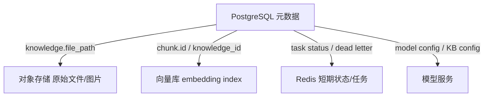

# 文件：21_PostgreSQL_GORM与数据一致性中间件深挖.md

## 1. 本主题面试官想考什么

PostgreSQL 是 WeKnora 的元数据核心。RAG 项目里很多人会把注意力放在大模型和向量库上，但真正支撑工程稳定性的往往是数据库建模、事务、一致性、索引和权限过滤。

本主题重点考察：

- 为什么元数据用关系型数据库。
- GORM 带来的开发效率和潜在坑。
- Postgres 和 SQLite 的定位差异。
- 元数据、chunk、任务状态、向量索引之间如何保持一致。
- 多租户/RBAC 场景下如何做数据隔离。
- 为什么不是所有数据都放向量库或对象存储。

当前项目相关事实：

- Go 后端使用 GORM。
- 支持 PostgreSQL 和 SQLite driver。
- 核心对象包括 tenant、knowledge_base、knowledge、chunk、session、message、wiki_page、task_dead_letters、vector_stores 等。
- `VectorStore.ConnectionConfig` 中敏感字段如 password/api_key 会 AES-GCM 加密后落库。
- `vector_stores` 表支持租户级向量库配置，但 Postgres/SQLite 作为默认连接型 env store，不作为普通 DB-managed VectorStore 添加。

## 2. 高频问题清单

### 基础问题

- PostgreSQL 在项目里存什么？
- 为什么不用 MongoDB/ES/向量库直接存全部数据？
- GORM 的优缺点是什么？
- 什么数据适合放数据库，什么数据适合放对象存储？
- chunk 表和向量库索引是什么关系？

### 进阶问题

- 文档入库时数据库事务边界怎么设计？
- DB 元数据和向量库写入如何保证一致？
- 删除知识库时如何清理 DB、对象存储和向量库？
- 多租户数据隔离怎么做？
- 如何设计数据库索引提升检索链路性能？
- SQLite 在这个项目里适合什么场景，不适合什么场景？

### 深挖追问

- 如果 DB 写成功但向量库写失败怎么办？
- 如果向量库写成功但 DB 状态更新失败怎么办？
- 为什么敏感连接信息要加密落库？AES-GCM 原理是什么？
- GORM 自动迁移有哪些风险？
- 如何避免 N+1 查询？
- 如何设计知识库删除的状态机？

### 压力追问

- 你们的数据一致性到底是强一致还是最终一致？
- 如果用户上传后马上提问，文档还没入库完怎么办？
- Postgres 是否会成为系统瓶颈？
- pgvector 能不能替代所有专业向量库？
- 数据库和向量库双写失败时，有没有补偿机制？

## 3. 数据分层：为什么 Postgres 是元数据中心



Postgres 在这个项目里承担的是“事实源”角色：

- 用户、租户、角色、权限。
- 知识库、文档、chunk 元数据。
- 会话、消息、反馈。
- Wiki 页面、日志、issue。
- 向量库配置、模型配置。
- 异步任务状态和 dead-letter。

对象存储和向量库都通过 Postgres 中的 ID/key 关联。换句话说，Postgres 不是只存业务数据，它也是跨中间件一致性的锚点。

## 4. 问答与讲解

### Q1：为什么核心元数据用 PostgreSQL？

#### 面试官为什么问

面试官想看你是否理解数据模型。RAG 项目不是只有向量检索，知识库管理、权限、租户、任务、会话都是强结构化业务。如果你只讲向量库，就会显得工程理解不完整。

#### 先给结论

WeKnora 的核心数据不是只有 embedding，而是租户、用户、知识库、文档、chunk、会话、Wiki、任务状态和向量库配置这些强结构化对象。

#### 回答思路

从数据特征回答：

1. 元数据结构化程度高，实体关系明确。
2. 权限和租户过滤需要可靠条件查询。
3. 文档状态、任务状态需要事务。
4. 查询需要分页、排序、筛选和组合条件。
5. Postgres 支持 JSON、全文、向量扩展和事务，扩展性强。

#### 结合我的项目怎么答

WeKnora 里知识库、文档、chunk、会话、Wiki 页面、向量库配置都需要和 tenant_id、user_id、knowledge_base_id 等字段关联。比如一次 RAG 查询，不只是去向量库搜 topK，还要先判断用户是否有知识库权限、知识库绑定了哪个向量库、文档是否处理完成、chunk 是否有效。Postgres 很适合作为这些事实状态的中心。

#### 技术原理 / 链路设计讲解

关系型数据库的优势在于：

- ACID 事务：保证一组元数据变更要么都成功，要么都回滚。
- 索引：B-Tree、GIN、GiST 等索引支持不同查询模式。
- 外键/唯一约束：可以避免重复数据和孤儿关系。
- SQL 表达能力：复杂过滤、聚合、排序、Join。
- MVCC：读写并发下减少锁冲突。

Postgres 的 MVCC 会为每次更新创建新版本，读事务看到一致性快照，写事务通过行锁和版本判断避免冲突。这对知识库列表、会话消息、任务状态这类并发读写很重要。

#### 技术栈特点与选型理由

Postgres 相比 MySQL：

- JSONB、全文检索、扩展生态更强。
- pgvector 可以作为轻量向量检索方案。
- 对复杂查询和扩展类型支持较好。

Postgres 相比 MongoDB：

- 多实体关系和事务更自然。
- 权限过滤、关联查询、分页排序更可控。
- 强 schema 有利于长期维护。

Postgres 相比只用向量库：

- 向量库擅长相似度检索，但不适合承载完整业务状态。
- 角色权限、任务状态、审计日志、配置管理更适合关系型数据库。

#### 可直接复述的面试回答

> WeKnora 的核心数据不是只有 embedding，而是租户、用户、知识库、文档、chunk、会话、Wiki、任务状态和向量库配置这些强结构化对象。它们之间有明确关系，也需要事务、权限过滤、分页和审计，所以 Postgres 更适合作为元数据事实源。向量库只负责相似度索引，对象存储只负责文件，Redis 只负责短期状态，最终跨组件关联还是通过 Postgres 里的 ID 和状态来闭环。

#### 常见追问

- Postgres 里 chunk 表会不会很大？
- 为什么不把 chunk 内容只放向量库？
- 你会给哪些字段建索引？
- Postgres 读写瓶颈怎么优化？

#### 常见坑

不要说“Postgres 性能高所以用”。应该讲清楚它适合的是结构化元数据、事务和复杂查询。向量召回性能不是 Postgres 的唯一评判维度。

---

### Q2：GORM 在项目中的作用是什么？有什么坑？

#### 面试官为什么问

很多项目使用 ORM，但候选人经常不了解 ORM 生成的 SQL 和性能影响。面试官想看你是否知道 ORM 是工具，不是数据库能力本身。

#### 先给结论

GORM 在项目里主要是 repository 层的开发效率工具，让领域对象和数据库表映射起来，并提供事务、软删除、hook 等能力。

#### 回答思路

回答时要两面讲：

- 优点：开发效率、模型映射、事务封装、钩子、软删除、跨数据库适配。
- 风险：N+1、隐式查询、零值更新、自动迁移、事务边界不清、复杂 SQL 不透明。

#### 结合我的项目怎么答

项目用 GORM 封装 repository，比如 knowledge、chunk、wiki_page、vectorstore 等数据访问。GORM 让业务层可以通过 repository 接口操作领域对象，不直接散落 SQL。同时项目里一些地方也会用 raw SQL 或特别处理，比如 chunk 更新绕开 GORM 零值问题，说明不能无脑依赖 ORM。

#### 技术原理 / 链路设计讲解

ORM 的本质是对象关系映射：

- struct 对应 table。
- field tag 对应 column。
- method chain 生成 SQL。
- transaction 包装 `BEGIN/COMMIT/ROLLBACK`。
- hook 如 `BeforeCreate` 可以生成 UUID。

GORM 常见坑：

- 零值不更新：`Updates(struct)` 默认可能忽略零值，需要 map 或 Select。
- N+1 查询：循环里查关联对象，导致大量 SQL。
- Preload 滥用：一次加载太多关联对象，内存爆。
- 自动迁移不可控：生产环境 schema 变更应使用 migration。
- 软删除过滤：`DeletedAt` 会默认过滤，排查时容易忽略。
- 事务遗漏：多表写入没有包事务，失败后状态不一致。

#### 可直接复述的面试回答

> GORM 在项目里主要是 repository 层的开发效率工具，让领域对象和数据库表映射起来，并提供事务、软删除、hook 等能力。但我不会把 ORM 当黑盒，关键路径还是要关注生成 SQL。比如批量 chunk、状态更新、分页查询、权限过滤这些场景，要避免 N+1、零值更新失效和事务边界不清。复杂或性能敏感的地方可以用 raw SQL 或显式 Select/Where，把 SQL 控制权拿回来。

#### 常见追问

- GORM 的 `Save` 和 `Updates` 有什么区别？
- 软删除对唯一索引有什么影响？
- 如何在 GORM 中做事务？
- 如何排查慢 SQL？

#### 常见坑

不要回答“GORM 可以兼容各种数据库”就结束。ORM 的核心风险在性能和隐式行为，面试官更想听你怎么规避这些坑。

---

### Q3：数据库元数据和向量库索引如何保证一致性？

#### 面试官为什么问

这是 RAG 系统工程落地最核心的问题之一。文档入库天然是跨 Postgres、对象存储、向量库、模型服务的分布式流程，不可能靠单个数据库事务覆盖所有组件。

#### 先给结论

DB 和向量库之间很难做强一致，因为向量库、对象存储、模型服务都不参与同一个事务。

#### 回答思路

要先说明一致性类型：

- DB 内部元数据可以强一致。
- DB 与向量库/对象存储之间通常是最终一致。
- 通过任务状态、幂等、补偿、dead-letter 保证可恢复。

#### 结合我的项目怎么答

WeKnora 的文档入库可以把 Postgres 作为状态机中心。上传时先记录 knowledge 状态为 processing，文件保存在对象存储；异步任务解析并生成 chunk；embedding 后写向量库；全部成功后更新状态为 success；任一关键步骤失败则更新 failed，并通过 dead-letter 或错误信息暴露给运维。

#### 技术原理 / 链路设计讲解

跨中间件一致性通常有几种方案：

1. 本地事务 + 异步任务：DB 先记录待处理状态，再异步处理外部副作用。
2. Outbox pattern：业务事务内写 outbox 表，由后台可靠投递事件。
3. Saga：每一步有正向操作和补偿操作。
4. 二阶段提交：理论强一致，但对象存储/向量库通常不支持，复杂度高。
5. 定期 reconcile：扫描 DB 状态和外部索引，修复不一致。

对于 RAG 文档入库，通常选择最终一致：

- 原因一：向量库、对象存储和模型服务不在同一个事务系统。
- 原因二：用户可以接受文档短暂 processing。
- 原因三：失败后可以重试或重新索引。

典型状态机：

```text
uploaded -> processing -> indexed -> ready
                       -> failed
deleting -> deleted
```

一致性关键点：

- 任务开始前检查 knowledge 是否仍存在、是否已经更新版本。
- 重试前清理旧 chunk/旧向量，或用稳定 ID 覆盖。
- 成功更新状态时带条件，比如只从 processing 更新为 ready。
- 删除使用 tombstone/soft delete，避免旧任务把删除对象重新写回。

#### 可直接复述的面试回答

> DB 和向量库之间很难做强一致，因为向量库、对象存储、模型服务都不参与同一个事务。所以我会把 Postgres 作为状态机和事实源，外部写入通过异步任务实现最终一致。文档上传后先进入 processing，任务解析、切分、embedding、写向量库，成功后状态变 ready，失败则 failed 并记录错误。为了处理重试和半成功，写 chunk 和向量要幂等，删除要有 tombstone 或状态判断，必要时通过 dead-letter 和定期 reconcile 修复不一致。

#### 常见追问

- 如果向量写成功，DB 更新 ready 失败，用户能搜到吗？
- 如果 DB 删除了文档但向量没删，会有什么后果？
- 如何设计 reconcile 任务？
- 是否需要分布式事务？

#### 常见坑

不要说“用事务保证 DB 和向量库一致”。除非所有组件都支持同一个事务协调器，否则这是不成立的。正确说法是：DB 内强一致，跨组件最终一致，靠状态机、幂等和补偿保证可恢复。

---

### Q4：敏感连接信息为什么要加密落库？

#### 面试官为什么问

项目支持租户配置外部向量库，连接信息里可能包含 password、api_key。面试官会看你是否有安全意识，以及是否理解加密、脱敏和密钥管理的区别。

#### 先给结论

项目支持用户配置外部向量库，所以连接配置里会有 password 和 api_key。

#### 回答思路

可以从三个层面回答：

- 存储安全：password/api_key 不能明文落库。
- 展示安全：API 返回时要 mask。
- 密钥管理：加密密钥不能和密文放在同一个不受保护的位置。

#### 结合我的项目怎么答

`VectorStore.ConnectionConfig` 的 `Value()` 会在持久化前对 Password/APIKey 做 AES-GCM 加密，`Scan()` 会在读取后解密。API 响应使用 `MaskSensitiveFields()` 将敏感字段替换为占位符，避免前端或日志泄露真实密钥。

#### 技术原理 / 链路设计讲解

AES-GCM 是认证加密算法：

- AES 负责对称加密。
- GCM 模式提供机密性和完整性校验。
- 加密时通常需要随机 nonce。
- 解密时如果密文被篡改，认证 tag 校验失败。

它比单纯 AES-CBC 更适合存储密钥类数据，因为 CBC 只提供加密，不自带完整性保护，容易出现 padding oracle 等风险。

脱敏和加密不同：

- 加密：为了数据库泄露时攻击者看不到明文。
- 脱敏：为了接口返回、日志、页面展示时不泄露明文。
- 哈希：不可逆，适合密码校验，不适合需要再次使用的 API key。

连接密钥必须可逆，因为系统要拿它连接外部向量库，所以不能只存哈希。

#### 可直接复述的面试回答

> 项目支持用户配置外部向量库，所以连接配置里会有 password 和 api_key。这类字段不能明文落库。WeKnora 在 ConnectionConfig 的数据库序列化阶段用 AES-GCM 加密敏感字段，读取时再解密；接口返回时再做 mask，避免前端和日志泄露。这里不能用哈希，因为 API key 后续还要被系统拿来连接外部服务，所以需要可逆加密。真正生产环境还要关注密钥来源、轮换和权限隔离。

#### 常见追问

- AES-GCM 的 nonce 重复会有什么风险？
- 加密密钥应该放在哪里？
- API 返回时如何区分“未设置”和“已设置但隐藏”？
- 日志里如何避免打印连接配置？

#### 常见坑

不要把“加密存储”说成万能安全。密钥管理、日志脱敏、权限控制、接口返回 mask、备份加密都要配合。否则数据库密文安全了，但日志里打印明文，一样会泄露。

## 5. 本主题总结

PostgreSQL 在 WeKnora 中是元数据事实源。面试时要讲清楚：

- Postgres 存的是强结构化业务状态，不是替代向量库或对象存储。
- GORM 提供效率，但关键路径要理解 SQL。
- 跨 DB、对象存储、向量库的一致性通常是最终一致。
- 任务状态机、幂等写、dead-letter、reconcile 是工程闭环。
- 敏感配置需要加密落库和接口脱敏。

## 6. 面试前自查清单

- 我是否能讲清楚 Postgres 和向量库的数据边界？
- 我是否能解释 GORM 的优缺点和常见坑？
- 我是否能说明 DB 与向量库为什么不能简单用事务保证一致？
- 我是否能设计文档入库状态机？
- 我是否能讲清楚 AES-GCM 加密敏感配置的原因？
- 我是否能说明 SQLite 适合轻量/测试，不适合高并发生产？
