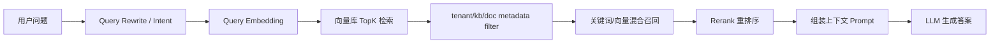

# 文件：22_向量数据库与检索中间件选型深挖.md

## 1. 本主题面试官想考什么

向量数据库是 RAG 项目的核心中间件之一，但面试官不会满足于“我们用向量库做相似度检索”。真正会深挖：

- 向量检索底层原理是什么。
- ANN 为什么是近似而不是精确。
- HNSW、IVF、PQ、倒排索引分别适合什么。
- Postgres/pgvector、Elasticsearch、Qdrant、Milvus、Weaviate、Doris 怎么取舍。
- 多向量库抽象为什么有必要，代价是什么。
- hybrid search、metadata filter、rerank 在链路中如何配合。

当前项目相关事实：

- `types.VectorStore` 支持 DB-managed 向量库配置。
- 支持 Elasticsearch、Qdrant、Milvus、Weaviate、Doris、Tencent VectorDB。
- Postgres/SQLite 作为 env store 可通过默认连接使用，不作为普通用户注册的 VectorStore。
- `IndexConfig` 支持不同引擎的 index/collection/shard/replica 配置。
- 项目存在 composite retriever、关键词 + 向量混合索引能力。
- 配置中有 `embedding_top_k`、`vector_threshold`、`rerank_top_k`、`rerank_threshold` 等参数。

## 2. 高频问题清单

### 基础问题

- 向量数据库在 RAG 里负责什么？
- embedding、向量索引、rerank 分别是什么？
- TopK、threshold、rerank_top_k 有什么关系？
- 为什么需要 metadata filter？
- 向量库里存 chunk 还是存文档？

### 进阶问题

- Postgres/pgvector 和 Milvus/Qdrant/Weaviate 怎么选？
- Elasticsearch 做向量检索有什么优势和不足？
- Qdrant、Milvus、Weaviate 的定位差异是什么？
- 为什么项目要支持多种向量库？
- hybrid search 为什么能提升召回？
- 召回和排序的指标怎么评估？

### 深挖追问

- HNSW 的基本原理是什么？
- IVF/PQ 是什么？和 HNSW 怎么取舍？
- 向量维度变化时索引怎么办？
- 多租户向量数据如何隔离？
- 向量库写入和删除如何保证幂等？
- metadata filter 会不会影响 ANN 性能？

### 压力追问

- RAG 不就是向量库 topK 吗？技术难点在哪里？
- 为什么不用一个 Milvus 解决所有问题？
- pgvector 性能够吗？什么时候会成为瓶颈？
- 长上下文模型越来越强，向量库还有必要吗？
- 多向量库适配是不是过度设计？

## 3. 向量检索链路全景



向量库只负责其中一段：根据 query embedding 找相似 chunk。真正的 RAG 效果由多个环节共同决定：

- 文档解析质量。
- chunk 切分粒度。
- embedding 模型。
- metadata filter。
- topK 和 threshold。
- hybrid search。
- rerank。
- prompt 组织。
- LLM 生成约束。

## 4. 问答与讲解

### Q1：向量数据库的底层原理是什么？

#### 面试官为什么问

这个问题是区分“会用向量库”和“理解向量检索”的分水岭。面试官想听你讲出 embedding、高维空间、相似度度量、ANN 索引，而不是只说“把文本转成向量后查一下”。

#### 先给结论

向量数据库本质上解决的是高维向量的近似最近邻检索。

#### 回答思路

可以按四步讲：

1. 文本通过 embedding 模型映射为高维向量。
2. 语义相近的文本在向量空间里距离更近。
3. 检索时用 cosine/IP/L2 计算相似度。
4. 数据量大时不能暴力扫全量，所以用 ANN 索引。

#### 结合我的项目怎么答

WeKnora 在文档入库时对 chunk 做 embedding，并把 chunk_id、knowledge_id、knowledge_base_id、tenant_id 等 metadata 一起写入向量库。在线问答时先把 query 做 embedding，再按知识库范围和权限过滤召回相似 chunk，之后通过 rerank 和 prompt 组装生成答案。

#### 技术原理 / 链路设计讲解

向量相似度常见三种：

- Cosine similarity：关注方向，适合文本语义向量。
- Inner Product：内积，相当于向量长度和方向共同影响；很多 embedding 会归一化后用 IP。
- L2 distance：欧氏距离，适合某些图像/特征空间。

ANN 是 Approximate Nearest Neighbor。高维向量如果精确计算，需要对所有向量算相似度，复杂度接近 O(N * D)。当 N 到百万、千万级时不可接受，所以向量库构建索引，用可接受的召回损失换延迟降低。

常见索引：

- HNSW：图索引，多层小世界图，查询从高层快速跳转到低层精细搜索。召回率高、查询快，但内存占用较高，构建成本较大。
- IVF：倒排文件索引，先聚类成多个 centroid，查询时只搜索最近的几个簇。适合大规模数据，可控制 nprobe 平衡召回和延迟。
- PQ：乘积量化，把向量压缩成短码，降低内存，但会损失精度。
- Flat：暴力精确检索，适合小数据或评估基线。
- 倒排索引：关键词检索，BM25 相关，适合精确词、编号、错误码、专有名词。

RAG 系统通常不会只依赖向量检索，因为向量对语义相似强，但对精确词弱。例如错误码、函数名、配置项、表字段，关键词召回可能更可靠。

#### 技术栈特点与选型理由

向量库的核心能力要看：

- 是否支持 metadata filter。
- 是否支持批量写入和删除。
- 是否支持多租户隔离。
- 是否支持 hybrid search。
- 是否支持分片和副本。
- 是否支持在线扩容。
- SDK 是否稳定。
- 运维复杂度和资源成本。

#### 可直接复述的面试回答

> 向量数据库本质上解决的是高维向量的近似最近邻检索。文档入库时，我们把 chunk 通过 embedding 模型转成向量，并带上 tenant、knowledge_base、knowledge、chunk 等 metadata 写入索引；问答时把 query 也转成向量，在指定知识库范围内做 TopK 相似度召回。底层相似度可以是 cosine、inner product 或 L2。数据量小时可以 flat 精确扫，但生产中一般用 HNSW、IVF、PQ 这类 ANN 索引，用一点召回损失换查询延迟。RAG 里还会结合关键词召回和 rerank，因为向量检索对错误码、字段名、专有名词不一定稳定。

#### 常见追问

- HNSW 为什么查询快？
- cosine 和 inner product 怎么选？
- embedding 模型换了，旧向量还能用吗？
- 为什么 topK 大不一定效果好？

#### 常见坑

不要把向量库说成“语义搜索万能”。向量检索对长尾词、精确匹配、表格字段、代码符号可能不如关键词检索。真实 RAG 通常要 hybrid + rerank + badcase 优化。

---

### Q2：Postgres/pgvector、Elasticsearch、Qdrant、Milvus、Weaviate 怎么选？

#### 面试官为什么问

这是典型选型问题。面试官不要求你背每个产品的所有细节，但希望你能根据规模、部署、过滤、成本、团队能力做合理取舍。

#### 先给结论

我不会说某个向量库一定最好，而是按场景选。

#### 回答思路

可以按适用场景讲：

- pgvector：轻量、和元数据同库、适合中小规模。
- Elasticsearch：关键词和向量混合检索强，适合已有 ES 体系。
- Qdrant：向量检索和 filter 体验好，部署相对轻。
- Milvus：大规模向量检索能力强，适合高吞吐和海量向量。
- Weaviate：对象化 schema、GraphQL/混合能力，生态丰富。
- Doris：偏分析型场景，适合向量 + OLAP/数据仓库融合。

#### 结合我的项目怎么答

WeKnora 支持多种向量库，是因为目标场景包括本地轻量部署、企业私有化和云环境。轻量场景可以用 Postgres/SQLite env store；需要混合检索可以选择 Elasticsearch；需要专业向量检索和较好 filter 能力可以用 Qdrant；大规模私有化可以考虑 Milvus；已有 Weaviate 或 Tencent VectorDB 的客户也可以接入。

#### 方案对比

| 方案 | 优势 | 不足 | 适合场景 |
| --- | --- | --- | --- |
| Postgres/pgvector | 元数据和向量同库，事务边界简单，部署轻 | 超大规模 ANN 性能和扩展不如专业向量库 | POC、中小规模、私有轻量部署 |
| SQLite/sqlite-vec | 极轻量，适合本地开发/单机 | 并发和规模有限 | Demo、测试、桌面端 |
| Elasticsearch | BM25/倒排强，hybrid search 方便，运维生态成熟 | 向量能力不是唯一核心，资源占用较高 | 文档检索、关键词 + 向量混合 |
| Qdrant | Filter 友好，HNSW 能力成熟，部署相对简单 | 超大规模生态不如 Milvus 老牌 | 中大型 RAG、私有部署 |
| Milvus | 面向海量向量，高性能，索引类型丰富 | 组件和运维复杂度更高 | 大规模向量检索平台 |
| Weaviate | Schema/对象模型，生态友好，混合能力 | 概念和部署复杂度中等 | 知识对象化、混合检索 |
| Doris | 分析型数据库，适合和 OLAP 融合 | 纯向量检索体验不如专用向量库 | 数据分析 + 向量检索融合 |
| Tencent VectorDB | 云服务托管，运维成本低 | 依赖云厂商生态 | 腾讯云/托管场景 |

#### 技术原理 / 链路设计讲解

不同向量库差异不只在“快不快”，还在这些能力：

- Filter 下推：能否先按 tenant/kb/doc 过滤，再做 ANN，或者 ANN 后再过滤。前者更准确但实现复杂，后者可能 topK 被无关数据占满。
- 多租户隔离：按 collection、partition、metadata filter、database 分隔。
- 索引构建方式：在线构建、离线构建、增量更新能力。
- 删除能力：是否支持按 filter 批量删除，删除后何时真正释放空间。
- 一致性：写入后是否立即可见，是否有 refresh/load 延迟。
- 资源模型：内存型、磁盘型、分片、副本、query node。

#### 可直接复述的面试回答

> 我不会说某个向量库一定最好，而是按场景选。小规模或私有轻量部署，pgvector 最简单，因为元数据和向量可以靠近；如果文档里有大量关键词、错误码、字段名，Elasticsearch 的 BM25 加向量混合检索很有价值；Qdrant 比较适合中大型 RAG，filter 和 HNSW 体验好，部署也相对轻；Milvus 更适合海量向量和高性能检索，但运维复杂度更高；Weaviate 偏对象化 schema 和混合检索生态。WeKnora 做多引擎抽象，是为了适配不同企业客户已有基础设施和不同规模，而不是强绑定一个向量库。

#### 常见追问

- 如果只能选一个默认向量库，你选哪个？
- pgvector 到什么规模会吃力？
- ES 的 BM25 和向量分数怎么融合？
- Milvus 的 collection、partition、index、load 分别是什么？

#### 常见坑

不要说“Milvus 性能最好，所以都用 Milvus”。生产选型不仅看性能，还看部署、运维、数据规模、团队能力、过滤需求和成本。小团队上来部署一套复杂 Milvus，可能比 pgvector/Qdrant 更难稳定。

---

### Q3：为什么要支持多向量库？这是不是过度设计？

#### 面试官为什么问

多引擎抽象会增加代码复杂度。面试官想看你是否能说明收益大于成本，以及你是否理解抽象边界。

#### 先给结论

多向量库抽象确实会增加适配成本，但对 WeKnora 这种企业知识库项目是有价值的。

#### 回答思路

可以从产品定位回答：

- WeKnora 面向企业知识库和私有化部署，不同客户已有基础设施不同。
- 向量库发展快，绑定单一引擎有迁移风险。
- 轻量部署和大规模部署需求不同。
- 通过统一 Retriever/VectorStore 抽象降低业务层耦合。

同时要承认代价：

- 不同引擎能力不完全一致。
- filter、score、索引配置、删除语义需要适配。
- 测试矩阵变大。

#### 结合我的项目怎么答

项目通过 `VectorStore` 记录 engine_type、connection_config、index_config，并提供 env store 和 DB-managed store 两种来源。API 层可以展示不同向量库配置，业务层通过 retriever factory/composite retriever 获取统一检索能力。

#### 技术原理 / 链路设计讲解

多引擎抽象的核心是定义最小公共能力：

- Insert/Upsert chunks。
- Search by vector with metadata filter。
- Delete by knowledge/KB。
- Health check。
- Index/collection initialization。

不能把所有引擎私有能力都暴露给业务层，否则抽象会泄漏。比较好的做法是：

- 公共能力走统一接口。
- 引擎差异放在 repository 实现。
- IndexConfig 保留引擎特有配置。
- 能力不支持时明确报错或降级。

多引擎的难点：

- score 归一化：不同库分数含义可能不同。
- filter 语义差异：字段类型、操作符支持不同。
- collection 命名规则不同。
- 批量写入限制不同。
- 删除可见性不同。
- 维度变化处理不同。

#### 可直接复述的面试回答

> 多向量库抽象确实会增加适配成本，但对 WeKnora 这种企业知识库项目是有价值的。客户可能已经有 ES、Milvus、Qdrant 或云厂商向量库，私有化部署也有轻量和大规模两种需求。如果强绑定一个引擎，会限制部署场景。我们的做法是把业务层依赖收敛到 Retriever/VectorStore 这类最小公共接口，engine_type、connection_config、index_config 放到配置层。代价是不同引擎的 score、filter、删除和索引配置有差异，需要适配和测试，但换来部署灵活性和技术演进空间。

#### 常见追问

- 抽象层如何处理不同向量库 score 不可比？
- 如果某个引擎不支持某个 filter 怎么办？
- 多向量库如何做自动化测试？
- 为什么 Postgres/SQLite 不允许作为普通 DB-managed store？

#### 常见坑

不要把多引擎抽象设计成“所有引擎能力的大杂烩”。抽象要稳定，差异要隔离。否则业务代码会到处写 `if engine == xxx`，最后抽象失效。

---

### Q4：Hybrid Search 和 Rerank 为什么重要？

#### 面试官为什么问

这个问题考察你是否理解 RAG 效果优化。只会说“向量召回 topK”往往不够。真实知识库问答中，很多问题需要关键词、结构、上下文和 rerank 共同作用。

#### 先给结论

RAG 效果不能只靠向量 topK。向量召回擅长语义相似，但对错误码、字段名、函数名、配置项这类精确词可能不稳定；关键词召回刚好补这个短板。

#### 回答思路

可以讲三个层次：

- 向量召回：语义泛化强。
- 关键词召回：精确词、编号、专有名词强。
- Rerank：对候选 chunk 做更精细相关性判断。

#### 结合我的项目怎么答

WeKnora 配置里有 `embedding_top_k`、`vector_threshold`、`rerank_top_k`、`rerank_threshold`，说明链路不是直接拿向量 topK 给 LLM，而是会控制初召回数量和分数阈值，再经过 rerank 过滤和排序。

#### 技术原理 / 链路设计讲解

向量召回是 bi-encoder 模式：

- 文档和 query 分别编码成向量。
- 检索阶段只计算向量相似度。
- 优点是快，可以预计算文档向量。
- 缺点是交互信息少，对细粒度匹配不够准确。

Rerank 常见是 cross-encoder：

- 把 query 和 chunk 一起输入模型。
- 模型直接判断相关性。
- 优点是排序精度高。
- 缺点是慢，只能对少量候选做。

所以链路一般是：

```text
召回 top 30/50/100 -> rerank -> 保留 top 5/10 -> prompt
```

Hybrid search 的融合方式：

- 并集召回：向量 topK + BM25 topK 合并去重。
- 分数融合：归一化后加权。
- RRF：Reciprocal Rank Fusion，根据排名融合，避免不同分数不可比。
- 分场景权重：技术文档提高关键词权重，FAQ 提高语义权重。

#### 可直接复述的面试回答

> RAG 效果不能只靠向量 topK。向量召回擅长语义相似，但对错误码、字段名、函数名、配置项这类精确词可能不稳定；关键词召回刚好补这个短板。初召回之后还需要 rerank，因为向量检索是 bi-encoder，速度快但匹配粒度粗，rerank 通常把 query 和 chunk 一起输入模型，相关性判断更准。我们的配置里也区分 embedding_top_k、vector_threshold、rerank_top_k、rerank_threshold，就是为了在召回率、精度、延迟和 token 成本之间做平衡。

#### 常见追问

- rerank_top_k 设太大有什么问题？
- threshold 应该如何调？
- RRF 的好处是什么？
- 为什么召回正确但模型仍然答错？

#### 常见坑

不要认为 rerank 一定越多越好。rerank 会增加延迟和模型成本，候选太多还可能引入噪声。TopK 和阈值要结合 badcase、评测集和延迟预算调。

## 5. 本主题总结

向量数据库专题要讲出四层：

- 原理：embedding、相似度、ANN、HNSW/IVF/PQ。
- 选型：pgvector、ES、Qdrant、Milvus、Weaviate、Doris 的取舍。
- 工程：metadata filter、多租户、批量写入、删除、幂等、维度变化。
- 效果：hybrid search、rerank、threshold、badcase。

## 6. 面试前自查清单

- 我是否能解释 ANN 为什么是近似检索？
- 我是否能讲清楚 HNSW 的大致原理？
- 我是否能比较 pgvector、ES、Qdrant、Milvus、Weaviate？
- 我是否能说明为什么支持多向量库不是单纯堆技术？
- 我是否能解释 hybrid search 和 rerank 的价值？
- 我是否能说出 metadata filter 对多租户和权限的重要性？
