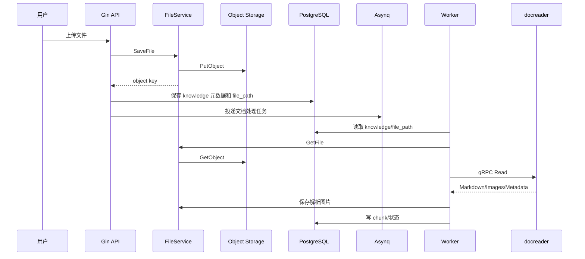

# 文件：23_对象存储与文档解析服务中间件深挖.md

## 1. 本主题面试官想考什么

文档入库是 WeKnora 的第一条关键链路，而对象存储和 docreader 是这条链路的基础设施。面试官会重点考：

- 文件为什么要放对象存储，而不是数据库或本地磁盘。
- MinIO/S3/COS/TOS/OSS 等对象存储的共同模型是什么。
- object key、bucket、presigned URL、权限和生命周期怎么设计。
- 文档解析为什么拆成独立 Python 服务。
- gRPC 和 HTTP 调用 docreader 怎么取舍。
- 文件、解析图片、chunk、向量之间如何关联。
- 文档解析失败如何排查和重试。

当前项目相关事实：

- `FileService` 抽象支持保存、读取、删除文件、获取 URL 和连通性检查。
- docker compose 中包含 MinIO 服务。
- `.env` 中有 MINIO/S3/COS/TOS/OSS/KS3 相关配置。
- docreader 是独立 Python 服务，默认通过 gRPC 地址 `docreader:50051` 调用。
- `GRPCDocumentReader` 支持最大消息大小、TLS/token 认证配置、Read/ListEngines。
- docreader 容器不默认暴露 50051 到宿主机，只在内部网络使用。

## 2. 高频问题清单

### 基础问题

- 原始文件为什么不直接存数据库？
- 对象存储和本地磁盘有什么区别？
- MinIO 和 S3 是什么关系？
- docreader 为什么独立成服务？
- 为什么 Go 后端通过 gRPC 调 Python docreader？
- 解析出来的图片怎么处理？

### 进阶问题

- 上传文件、对象存储、DB 元数据之间如何保证一致？
- 对象存储 key 怎么设计？
- 文件删除如何避免误删和漏删？
- docreader 服务超时或失败如何处理？
- gRPC 和 HTTP 在内部服务通信中怎么选？
- 大文件解析如何避免内存爆？

### 深挖追问

- presigned URL 的原理是什么？
- 对象存储的强一致/最终一致对业务有什么影响？
- 如果 DB 写成功但对象存储上传失败怎么办？
- 如果对象存储文件存在但 DB 元数据丢失怎么办？
- gRPC 的 HTTP/2、多路复用、protobuf 有什么优势？
- docreader 怎么做横向扩容？

### 压力追问

- 文件存本地不是更简单吗？为什么引入 MinIO？
- 解析服务拆出来会增加网络调用，为什么值得？
- gRPC 传大文件是不是不合适？
- 如果用户上传 500MB PDF，系统怎么处理？
- 如果客户要求文件不能出内网，怎么部署？

## 3. 文件入库链路



## 4. 问答与讲解

### Q1：为什么文件要放对象存储，而不是数据库？

#### 面试官为什么问

这个问题考察基础设施边界。很多候选人会说“文件大”，但大厂面试更希望听到存储模型、扩展性、备份、读写路径、成本和权限管理。

#### 先给结论

文件没有放数据库，主要是因为 PDF、Office、图片这类原始文件是大对象，读写路径和结构化元数据完全不同。

#### 回答思路

可以从五点回答：

1. 文件是大对象，不适合频繁进入数据库事务和 buffer cache。
2. 对象存储天然支持大文件、分片上传、流式下载。
3. 对象存储适合多副本、生命周期、跨云迁移。
4. 数据库只保存 object key 和元数据，查询更轻。
5. 文件服务抽象方便切换本地、MinIO 和云存储。

#### 结合我的项目怎么答

WeKnora 的文档可能是 PDF、Word、Excel、图片等大文件。项目通过 `FileService` 抽象保存文件，数据库只保存文件路径或 object key。这样文档上传、下载、解析图片保存都不需要让数据库承载大对象 IO。MinIO 可以作为私有化部署里的 S3 兼容对象存储，云上也可以切到 COS/TOS/OSS/S3/KS3。

#### 技术原理 / 链路设计讲解

对象存储的模型通常是：

- bucket：逻辑容器。
- object key：对象路径。
- object data：文件内容。
- metadata：Content-Type、ETag、自定义元信息。
- ACL/policy：访问控制。
- presigned URL：带签名的临时访问链接。

数据库存 BLOB 的问题：

- 备份恢复变重。
- 数据库 buffer cache 被大文件污染。
- 查询和文件 IO 资源互相影响。
- 横向扩展和 CDN 分发不方便。
- 大文件上传下载容易占用 DB 连接。

对象存储的优势：

- 按 key 读写对象，适合大文件。
- 支持 multipart upload。
- 支持生命周期清理。
- 可以挂 CDN。
- 云厂商和 MinIO 都支持 S3-like API，迁移成本低。

但对象存储也有代价：

- 不参与数据库事务。
- 删除和 DB 状态可能不一致。
- 访问权限和临时 URL 要单独设计。
- 对象 key 命名、孤儿文件清理要治理。

#### 可直接复述的面试回答

> 文件没有放数据库，主要是因为 PDF、Office、图片这类原始文件是大对象，读写路径和结构化元数据完全不同。如果放 DB BLOB，会让备份、连接、buffer cache 和查询都变重。我们用 FileService 抽象对象存储，数据库只保存 object key 和文件元数据。私有化可以用 MinIO，云上可以接 S3/COS/TOS/OSS。这样文件上传下载、生命周期、权限和 CDN 分发都更自然，数据库专注保存知识库、文档、chunk 和任务状态。

#### 常见追问

- object key 怎么设计？
- 文件上传成功但 DB 写失败怎么办？
- 文件删除失败怎么办？
- presigned URL 怎么保证安全？

#### 常见坑

不要只回答“因为文件大”。要讲清楚数据库和对象存储的职责边界，以及对象存储带来的事务一致性问题如何补偿。

---

### Q2：MinIO、S3、COS、OSS 这些对象存储怎么取舍？

#### 面试官为什么问

这个问题考察你是否理解“对象存储是一类能力”，而不是只知道某个产品。企业项目经常既要私有化，又要兼容不同云。

#### 先给结论

MinIO 和 S3/COS/OSS 这类云存储本质都是对象存储模型，核心是 bucket、object key、Put/Get/Delete 和签名 URL。

#### 回答思路

先讲共同点，再讲差异：

- 共同点：bucket、object key、Put/Get/Delete、签名 URL、访问策略。
- MinIO：私有化、自建、S3 兼容。
- S3/COS/OSS/TOS/KS3：云托管，可靠性和运维交给云厂商。

#### 结合我的项目怎么答

WeKnora 支持多种对象存储，是为了覆盖本地开发、私有化部署和云上部署。docker compose 里提供 MinIO，适合本地和内网部署；生产客户如果已有云厂商对象存储，可以通过配置切换，业务层通过 `FileService` 不感知底层差异。

#### 方案对比

| 方案 | 优势 | 不足 | 适合场景 |
| --- | --- | --- | --- |
| 本地磁盘 | 最简单、无额外服务 | 多实例共享困难，扩容和备份弱 | 单机 demo、开发 |
| MinIO | S3 兼容、私有化友好、部署简单 | 高可用和容量规划要自己运维 | 内网/私有化/测试 |
| AWS S3 | 成熟稳定、生态强、托管 | 云厂商绑定、网络/合规成本 | AWS 云上 |
| COS/OSS/TOS/KS3 | 国内云生态、合规和内网访问方便 | 多云 API 细节差异 | 对应云厂商客户 |
| 数据库 BLOB | 事务内一致性较强 | 性能和运维压力大 | 小文件、强事务少量场景 |

#### 技术原理 / 链路设计讲解

S3 兼容 API 的核心操作：

- PutObject：上传对象。
- GetObject：读取对象。
- DeleteObject：删除对象。
- HeadObject：检查对象存在和元数据。
- ListObjects：列举对象。
- Presign：生成临时 URL。

object key 设计建议：

```text
tenant/{tenant_id}/knowledge/{knowledge_id}/original/{filename}
tenant/{tenant_id}/knowledge/{knowledge_id}/images/{image_id}.png
tenant/{tenant_id}/tmp/{request_id}/{filename}
```

设计原则：

- key 中包含 tenant_id，便于隔离和清理。
- key 中包含 knowledge_id，便于删除文档时批量清理。
- 避免直接使用用户原始文件名作为唯一 key，防止冲突和路径注入。
- 临时文件和正式文件分 prefix，便于生命周期清理。

#### 可直接复述的面试回答

> MinIO 和 S3/COS/OSS 这类云存储本质都是对象存储模型，核心是 bucket、object key、Put/Get/Delete 和签名 URL。MinIO 的价值是私有化和本地部署，兼容 S3 API；云厂商对象存储的价值是高可用、容量和运维交给云服务。WeKnora 通过 FileService 抽象屏蔽底层差异，所以业务层只处理 file path 或 object key。具体选型取决于部署环境：本地 demo 可以本地磁盘，私有化用 MinIO，云上用客户已有对象存储。

#### 常见追问

- MinIO 单机和分布式有什么差异？
- 对象存储如何做权限隔离？
- presigned URL 泄露怎么办？
- 如何清理临时文件？

#### 常见坑

不要假设所有 S3 兼容存储行为完全一致。不同厂商在签名、region、path-style、endpoint、ACL、分片上传限制上可能有差异，需要适配和连通性检查。

---

### Q3：docreader 为什么独立成 Python 服务？

#### 面试官为什么问

这是架构拆分问题。面试官想知道你是否能从语言生态、依赖隔离、资源隔离和扩展性角度解释，而不是说“Python 解析文档方便”就结束。

#### 先给结论

docreader 拆成 Python 服务主要是因为文档解析依赖复杂，PDF、Office、OCR、图片抽取这些能力 Python 生态更成熟，而且会引入很多系统级依赖。

#### 回答思路

可以从四点回答：

1. 文档解析依赖复杂，Python 生态更成熟。
2. PDF/OCR/Office/图片解析可能引入系统依赖，和 Go 主服务解耦更安全。
3. 解析任务 CPU/内存消耗高，独立服务便于限流和扩容。
4. 主服务通过接口调用，解析引擎可替换。

#### 结合我的项目怎么答

WeKnora 的 docreader 是独立容器，Go 主服务通过 gRPC 调用 `Read` 和 `ListEngines`。gRPC 客户端支持最大消息大小、TLS/token 认证、DNS resolver，并且 docreader 的 50051 端口默认只暴露在内部网络，降低安全暴露面。

#### 技术原理 / 链路设计讲解

文档解析服务通常需要处理：

- PDF 文本抽取。
- OCR。
- 表格识别。
- Office 转换。
- 图片抽取。
- Markdown 规范化。
- 元数据提取。

这些能力在 Python 生态里可选库更多，比如 PDF/OCR/多模态解析工具链。把 docreader 独立出来有几个好处：

- 依赖隔离：解析服务可以安装系统库，不污染 Go 主服务镜像。
- 故障隔离：解析崩溃不会直接带崩 API 进程。
- 资源隔离：可以单独限制 CPU/内存。
- 横向扩容：解析压力大时只扩 docreader。
- 引擎可插拔：通过 ListEngines 暴露不同解析引擎能力。

代价：

- 多一个服务和网络调用。
- 需要超时、重试和错误处理。
- 大文件传输要关注内存和消息大小。
- 需要内部认证和网络隔离。

#### 可直接复述的面试回答

> docreader 拆成 Python 服务主要是因为文档解析依赖复杂，PDF、Office、OCR、图片抽取这些能力 Python 生态更成熟，而且会引入很多系统级依赖。如果放进 Go 主服务，会让主服务镜像变重、稳定性变差，也不方便单独扩容。现在 Go 服务通过 gRPC 调 docreader，解析服务可以独立部署、限流、扩容和替换解析引擎。代价是多了一次 RPC，所以要做好超时、最大消息大小、错误传播和内部网络安全。

#### 常见追问

- 为什么用 gRPC，不用 HTTP？
- gRPC 传大文件有没有问题？
- docreader 崩溃后任务怎么恢复？
- 如何给不同文件类型选择不同解析引擎？

#### 常见坑

不要把解析服务拆分只归因于语言偏好。更重要的是依赖隔离、资源隔离、故障隔离和独立扩容。

---

### Q4：gRPC 和 HTTP 调用 docreader 怎么取舍？

#### 面试官为什么问

项目里有 gRPC parser，也有 HTTP parser/reader 相关代码。面试官可能会问内部服务通信为什么选 gRPC，以及它的原理和坑。

#### 先给结论

docreader 是内部服务，接口由我们控制，所以 gRPC 比普通 HTTP 更适合做稳定的服务间契约。

#### 回答思路

先讲 gRPC 优势：

- protobuf 强类型 IDL。
- HTTP/2 多路复用。
- 二进制序列化效率高。
- deadline/cancellation/metadata 机制成熟。
- 适合内部服务。

再讲 HTTP 优势：

- 调试简单。
- 跨语言和浏览器更通用。
- 对文件上传更直观。

#### 结合我的项目怎么答

WeKnora 默认 docreader 内部地址是 `docreader:50051`，通过 gRPC 调用。因为这是服务间通信，双方都由项目控制，使用 protobuf 定义 `ReadRequest/ReadResponse` 可以让字段更稳定，类型更明确。对于外部云解析服务或兼容接口，HTTP reader 也可以作为补充。

#### 技术原理 / 链路设计讲解

gRPC 基于 HTTP/2：

- 一个 TCP 连接上可以多路复用多个 stream。
- 支持 header compression。
- protobuf 序列化体积小、解析快。
- deadline 可以从客户端传播到服务端。
- metadata 可用于 token 认证、trace id。

对 docreader 这类内部服务，gRPC 的优势是接口契约清晰。`ReadRequest` 可以包含 file_content、file_name、file_type、url、title、request_id、config 等字段；`ReadResponse` 可以返回 markdown_content、image_refs、metadata、error。

但大文件场景要注意：

- unary gRPC 一次性传大文件可能占内存。
- 需要配置 max message size。
- 超大文件更适合对象存储传 key，或者用 streaming。
- timeout 要和 Asynq 任务超时匹配。

#### 可直接复述的面试回答

> docreader 是内部服务，接口由我们控制，所以 gRPC 比普通 HTTP 更适合做稳定的服务间契约。protobuf 强类型，HTTP/2 支持多路复用，deadline、metadata、错误码也比较规范。项目里的 gRPC client 还支持最大消息大小、TLS/token 配置和 DNS resolver。HTTP 的优势是调试和开放集成简单，所以适合外部解析服务或兼容模式。对于超大文件，不能无脑 unary 传输，最好走对象存储 key 或 streaming，并配置超时和消息大小。

#### 常见追问

- protobuf 兼容性怎么保证？
- gRPC deadline 和 context cancellation 有什么作用？
- HTTP/2 多路复用解决了什么问题？
- gRPC 错误码和业务错误怎么映射？

#### 常见坑

不要说 gRPC 一定比 HTTP 快。实际性能取决于 payload、连接复用、序列化和服务端实现。gRPC 的优势更多在内部强契约、多语言代码生成和流式能力。

## 5. 本主题总结

对象存储和 docreader 是文档入库链路的两个关键基础设施：

- 对象存储解决大文件保存、下载、生命周期和多云/私有化部署。
- DB 只保存 object key 和元数据，避免大对象拖垮数据库。
- docreader 独立服务解决文档解析依赖复杂、资源重和可扩容问题。
- gRPC 适合内部强契约调用，但大文件场景要关注消息大小和内存。
- 文件、DB、向量库之间要通过状态机和补偿保证最终一致。

## 6. 面试前自查清单

- 我是否能解释为什么不用 DB BLOB 存文件？
- 我是否能讲清楚 MinIO 和 S3 的关系？
- 我是否能设计 object key 命名规范？
- 我是否能说明上传成功但 DB 失败如何补偿？
- 我是否能解释 docreader 为什么独立服务化？
- 我是否能比较 gRPC 和 HTTP？
- 我是否能说明大文件解析的内存、超时和重试风险？
