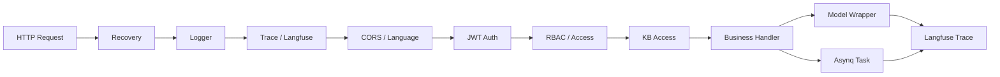

# 文件：24_可观测性网关安全与模型中间件深挖.md

## 1. 本主题面试官想考什么

这一主题覆盖三类经常被忽略但大厂很爱问的基础设施：

- 网关与 Web 中间件：Gin、CORS、JWT、RBAC、Recovery、Logger、Trace。
- 可观测性中间件：Langfuse、OpenTelemetry、日志、asynq dead-letter。
- 模型访问中间件：Chat/Embedding/Rerank/VLM/ASR wrapper、模型调用 trace、token 和敏感数据治理。

面试官想确认你是否知道：

- 一次请求从进入 API 到调用模型，中间件链路如何串起来。
- 普通业务日志为什么不够，需要 trace/span。
- RAG/Agent 的可观测性和传统后端可观测性有什么不同。
- 鉴权、租户隔离、知识库访问控制如何落到中间件。
- 模型调用如何抽象，如何记录、降级、超时和保护隐私。

当前项目相关事实：

- `internal/middleware` 下有 access、auth、kb_access、rbac、logger、recovery、trace、language、error_handler 等 Gin middleware。
- `internal/tracing/langfuse` 下有 client、config、middleware、asynq、tracer 等。
- Chat、embedding、rerank、VLM、ASR 都有 langfuse wrapper。
- Agent 工具调用和 engine 中也有 Langfuse span。
- Asynq task mux 安装了 Langfuse middleware，异步任务也能挂到 trace。
- docker compose 中 Langfuse 是可选 profile，可复用 Postgres/Redis，并引入 ClickHouse/MinIO。

## 2. 高频问题清单

### 基础问题

- Gin middleware 在项目里做什么？
- JWT 鉴权和 RBAC 授权有什么区别？
- Recovery middleware 解决什么问题？
- Langfuse 和普通日志有什么区别？
- Trace、span、generation 分别是什么？
- 为什么模型调用需要 wrapper？

### 进阶问题

- 一次 RAG 请求如何串起 HTTP trace、检索、rerank、LLM generation？
- 异步任务如何继承上游 trace？
- 如何避免 Langfuse 记录敏感数据？
- RBAC 和知识库访问控制如何防止越权？
- 模型调用失败如何降级？
- SSE、WebSocket 和 Redis stream 在流式输出里怎么取舍？

### 深挖追问

- OpenTelemetry 的 trace context 是怎么传播的？
- Langfuse 对 LLM/RAG 可观测性比 Jaeger 多了什么？
- 为什么 dead-letter 也是可观测性的一部分？
- middleware 顺序为什么重要？
- JWT 过期、刷新、撤销怎么设计？
- prompt、retrieval context、tool output 应该如何截断和脱敏？

### 压力追问

- 记录模型输入输出会不会泄露用户知识库内容？
- 关闭 Langfuse 后系统是否还能正常运行？
- 如果一个用户越权访问另一个租户知识库，应该在哪层拦住？
- Agent 工具调用如果执行危险操作，怎么审批和审计？
- 你们的日志能不能定位一次回答质量差的原因？

## 3. 请求链路中的中间件位置



middleware 的核心价值是把横切能力从业务 handler 中抽离：

- Recovery：防止 panic 打挂进程。
- Logger：记录请求、状态码、耗时。
- Trace：生成或传播 trace id。
- Auth：识别用户身份。
- RBAC/KB Access：判断是否有资源权限。
- Error handler：统一错误响应。
- Language：处理多语言上下文。

## 4. 问答与讲解

### Q1：Gin 中间件在项目里解决什么问题？顺序为什么重要？

#### 面试官为什么问

这考察 Web 后端基础。中间件不是简单注册函数，顺序决定了错误捕获、日志、鉴权、trace 和业务 handler 的执行边界。

#### 先给结论

Gin 中间件主要承载横切能力，比如 recovery、日志、trace、鉴权、RBAC、知识库访问控制和错误处理。

#### 回答思路

先讲 middleware 模型：

- 请求进入时按注册顺序执行。
- `Next()` 后进入后续中间件/handler。
- 返回时按栈反向执行收尾逻辑。

再讲项目中的职责：

- recovery 要尽量靠外层。
- logger/trace 要包住大部分链路。
- auth 要在需要用户上下文的权限判断之前。
- RBAC 和 KB access 要在业务 handler 前。

#### 结合我的项目怎么答

WeKnora 有 auth、rbac、kb_access、logger、recovery、trace 等中间件。比如知识库相关接口不能只校验用户已登录，还要校验用户在租户中的角色，以及对具体 knowledge_base 是否有访问权限。trace/logger 要尽量覆盖鉴权、权限和 handler，这样排查时能看到请求在哪一层失败。

#### 技术原理 / 链路设计讲解

Gin middleware 本质是：

```go
func(c *gin.Context) {
    // before
    c.Next()
    // after
}
```

常见顺序建议：

1. Recovery：兜底 panic。
2. Request ID / Trace：生成链路 ID。
3. Logger：记录入口出口。
4. CORS/Language：请求通用处理。
5. Auth：解析 JWT，注入 user。
6. RBAC/Access：基于 user/tenant/resource 判断权限。
7. Handler：业务逻辑。
8. Error handler：根据项目实现，可以包住 handler 统一响应。

顺序错误的后果：

- recovery 太内层，外层 panic 捕不到。
- logger 太内层，鉴权失败日志缺失。
- RBAC 在 auth 前执行，拿不到用户身份。
- trace 不包住模型调用，Langfuse 链路断裂。

#### 可直接复述的面试回答

> Gin 中间件主要承载横切能力，比如 recovery、日志、trace、鉴权、RBAC、知识库访问控制和错误处理。它的执行模型类似洋葱，请求进来按注册顺序往里走，`Next()` 后再反向收尾。顺序很重要：recovery 和 trace/logger 要尽量在外层，auth 要在 RBAC 前，KB access 要在业务 handler 前。这样才能保证 panic 被兜住、请求都有日志和 trace、权限在进入业务前被拦截。

#### 常见追问

- 如果鉴权失败还需要记录 trace 吗？
- RBAC 和 KB access 为什么分开？
- middleware 里能不能访问数据库？
- panic 后如何保证日志包含请求上下文？

#### 常见坑

不要把鉴权和授权混为一谈。JWT auth 解决“你是谁”，RBAC/KB access 解决“你能不能访问这个资源”。

---

### Q2：Langfuse 和 OpenTelemetry 在 RAG 项目里解决什么问题？

#### 面试官为什么问

RAG/Agent 系统排障难点不在于接口 500，而在于“回答不准”。普通日志很难还原一次回答的召回、rerank、prompt 和模型输出。面试官想看你是否理解 LLM observability。

#### 先给结论

普通日志只能告诉我接口有没有报错，但 RAG 的核心问题经常是“没报错但回答不准”。

#### 回答思路

可以先讲传统可观测三件套：

- logs：离散事件。
- metrics：聚合指标。
- traces：单次请求链路。

然后讲 LLM/RAG 特有观测：

- prompt。
- retrieval documents。
- rerank scores。
- model input/output。
- token usage。
- latency/cost。
- tool calls。

#### 结合我的项目怎么答

WeKnora 里 Langfuse 不只包 HTTP handler，还包 Asynq 任务、模型 wrapper、Agent engine 和 tool span。这样一次文档处理或 RAG 问答可以看到 embedding、rerank、chat、VLM、ASR、tool call 等子链路。Asynq middleware 还能让异步任务恢复上游 trace 或创建独立 trace。

#### 技术原理 / 链路设计讲解

OpenTelemetry 的核心概念：

- Trace：一次完整请求或业务操作。
- Span：trace 中的一个步骤，比如 retrieval、rerank、LLM call。
- Context propagation：通过 context/header/payload 传播 trace id。
- Attributes/events：给 span 记录元数据。

Langfuse 面向 LLM 场景增加了：

- Generation：模型生成调用，记录模型名、prompt、completion、token。
- Span：工具调用、检索、rerank、解析等步骤。
- Trace tree：把一次 RAG/Agent 操作可视化。
- Prompt/score/feedback：支持质量评估。

一次回答质量差时，可以沿 trace 排查：

1. 用户问题是否被 rewrite 错。
2. embedding 是否成功。
3. 召回 chunk 是否相关。
4. rerank 是否把正确 chunk 排掉。
5. prompt 是否超长截断。
6. LLM 是否忽略上下文。
7. 工具调用是否失败。

#### 可直接复述的面试回答

> 普通日志只能告诉我接口有没有报错，但 RAG 的核心问题经常是“没报错但回答不准”。Langfuse 的价值是把一次 RAG 或 Agent 调用拆成 trace：query rewrite、embedding、retrieval、rerank、prompt、LLM generation、tool call 都能看到输入输出、耗时和错误。项目里 HTTP、Asynq、模型 wrapper 和 Agent tool 都接了 Langfuse，所以异步任务和在线问答都能串起来。OpenTelemetry 提供通用 trace/span/context 语义，Langfuse 则补充 LLM 特有的 prompt、completion、token 和评分维度。

#### 常见追问

- Langfuse 关闭后会影响业务吗？
- 如何控制采样率？
- prompt 里有敏感内容怎么办？
- trace id 如何从 HTTP 传到 Asynq payload？

#### 常见坑

不要把 Langfuse 说成日志系统。它更像 LLM/RAG trace 和实验观测平台。也不要忽略隐私风险，模型输入输出可能包含用户知识库内容，必须脱敏、截断、采样和权限控制。

---

### Q3：为什么 dead-letter 也是可观测性的一部分？

#### 面试官为什么问

异步任务失败如果只留在 Redis archived queue 或日志里，业务运营很难知道哪些租户、知识库、文档失败了。面试官想看你是否理解“可观测性要服务恢复”。

#### 先给结论

Dead-letter 是异步系统的可观测和恢复入口。

#### 回答思路

说明 dead-letter 的意义：

- 记录最终失败任务。
- 提供可查询、可统计、可重放的失败视图。
- 帮助定位租户/知识库/文档影响范围。
- 和日志/trace 互补。

#### 结合我的项目怎么答

项目的 `asynqdl` middleware 在任务最终重试失败后写入 `task_dead_letters`。它会解析 payload 中的 tenant_id、knowledge_base_id、kb_id、knowledge_id、source_kb_id 等字段，推断 scope。这样不是只看到“某个任务失败”，而是知道失败影响哪个租户、哪个知识库或哪个文档。

#### 技术原理 / 链路设计讲解

日志、trace、dead-letter 的区别：

- 日志：适合记录过程细节，但查询结构化影响范围困难。
- Trace：适合单次链路分析，但不一定适合批量运营视图。
- Dead-letter：适合最终失败任务的结构化治理。

好的 dead-letter 设计应该：

- 只记录最终失败，避免临时失败污染。
- 保存原始 payload，便于重放。
- 保存 task_type 和 scope，便于聚合。
- 保存 last_error 和 fail_count，便于分类。
- 插入失败不能影响原任务错误返回。

#### 可直接复述的面试回答

> Dead-letter 是异步系统的可观测和恢复入口。日志能看到错误，但很难按租户、知识库、文档聚合；Asynq archived queue 也不方便业务侧查询。项目里做了 asynq dead-letter middleware，只在最终 retry 失败后把任务类型、payload、租户和作用域写到数据库。这样运维可以 SQL 查询哪些知识库入库失败、失败原因是什么，也可以后续做人工重放或补偿。

#### 常见追问

- dead-letter 会不会重复记录？
- payload 里有敏感信息怎么办？
- 如何设计重放功能？
- 为什么 middleware 要装在其他 middleware 前？

#### 常见坑

不要把 dead-letter 当成“失败后丢进去就完了”。真正价值在于可查询、可告警、可补偿。否则只是换了个地方存错误。

---

### Q4：JWT、RBAC、KB Access 如何防止越权？

#### 面试官为什么问

RAG 知识库通常包含企业私有数据，越权是高风险问题。面试官会非常关注租户隔离和资源权限是否贯穿检索链路，而不只是接口层。

#### 先给结论

这里要分清鉴权和授权。JWT 只解决用户是谁，RBAC 解决这个用户在租户里有什么角色，KB Access 解决他能不能访问具体知识库。

#### 回答思路

分层回答：

1. JWT 鉴权：确认用户身份。
2. Tenant membership：确认用户属于哪个租户。
3. RBAC：确认角色是否允许执行操作。
4. Resource access：确认具体知识库/文档是否可访问。
5. Retriever filter：检索时带 tenant/kb 过滤，防止越权召回。

#### 结合我的项目怎么答

WeKnora 有 auth、rbac、kb_access 等中间件，RBAC 文档中定义 viewer、contributor、admin、owner 等角色。知识库问答时不能只在 API 层判断，还要把 knowledge_base_id、tenant_id 等约束传入检索层，避免向量库返回其他租户或其他知识库的 chunk。

#### 技术原理 / 链路设计讲解

鉴权和授权区别：

- Authentication：你是谁。
- Authorization：你能干什么。

JWT 典型包含：

- subject/user_id。
- tenant/org 信息或当前上下文。
- expire time。
- issuer/audience。
- signature。

RBAC 判断：

```text
user -> tenant_member -> role -> permission -> action/resource
```

知识库访问控制还要处理：

- 私有 KB。
- 共享 KB。
- 跨租户分享。
- owner/admin/contributor/viewer 权限差异。

检索层必须做 metadata filter：

```text
tenant_id = current_tenant
knowledge_base_id in allowed_kbs
deleted_at is null
status = ready
```

否则即使 API 列表页不展示某个知识库，向量召回仍可能把它的 chunk 返回给 LLM，造成数据泄露。

#### 可直接复述的面试回答

> 这里要分清鉴权和授权。JWT 只解决用户是谁，RBAC 解决这个用户在租户里有什么角色，KB Access 解决他能不能访问具体知识库。RAG 场景还要特别注意，权限不能只停留在接口层，检索时也必须带 tenant_id、knowledge_base_id、状态和删除标记等 metadata filter，防止向量库召回到越权 chunk。也就是说，列表接口、详情接口、问答检索、Agent 工具都要使用同一套资源访问边界。

#### 常见追问

- JWT 被盗怎么办？
- 用户角色变更后旧 token 是否立即失效？
- 跨租户共享知识库如何避免泄露 owner tenant 的向量库配置？
- Agent 工具调用如何复用权限上下文？

#### 常见坑

不要只说“接口加了 RBAC”。RAG 越权常常发生在检索层：API 层看不到的文档，被向量库召回进 prompt。权限 filter 必须进入 retriever。

---

### Q5：模型调用 wrapper 有什么意义？

#### 面试官为什么问

模型服务是 RAG 系统中最不稳定、最贵、最难排查的依赖之一。面试官想看你是否会做模型抽象、超时、重试、观测、脱敏和降级。

#### 先给结论

模型 wrapper 的意义是把模型调用从业务代码里收敛出来，统一做供应商适配、超时、错误处理和观测。

#### 回答思路

模型 wrapper 的职责：

- 统一模型接口。
- 注入 trace/span。
- 记录 token、耗时、错误。
- 做输入输出截断。
- 做超时和上下文取消。
- 做供应商差异适配。

#### 结合我的项目怎么答

项目里 chat、embedding、rerank、VLM、ASR 都有 langfuse wrapper，说明模型调用不是散落在业务代码里，而是通过统一包装层接入可观测性。Agent 工具调用也会开 tool span，并对工具输出做截断，避免 Langfuse UI 被超大 payload 撑爆。

#### 技术原理 / 链路设计讲解

模型调用和普通 RPC 不同：

- 延迟更高且波动大。
- 成本和 token 数强相关。
- 错误可能来自限流、上下文超长、内容安全、网络、模型不可用。
- 输出不稳定，需要格式校验和 fallback。
- 输入输出可能包含敏感知识库内容。

wrapper 可以统一处理：

```text
业务请求 -> model interface -> langfuse wrapper -> provider client -> model API
```

常见治理策略：

- timeout：避免模型长时间挂起。
- retry：只对可重试错误重试，如 429/5xx。
- circuit breaker：连续失败后短暂熔断。
- fallback：主模型失败切备用模型或降级回答。
- truncation：trace 中截断超长 prompt/tool output。
- redaction：脱敏 API key、手机号、邮箱等。
- token accounting：统计输入输出 token。

#### 可直接复述的面试回答

> 模型 wrapper 的意义是把模型调用从业务代码里收敛出来，统一做供应商适配、超时、错误处理和观测。RAG 链路里 chat、embedding、rerank、VLM、ASR 都可能失败，也都影响最终效果。项目里这些模型都有 Langfuse wrapper，可以记录每次调用的耗时、输入输出摘要、错误和 token 信息。Agent 工具输出也会截断，避免超大结果污染 trace。生产上还要结合采样、脱敏、限流、fallback 和成本统计。

#### 常见追问

- embedding 调用失败是否应该重试？
- rerank 服务不可用能不能降级？
- 如何避免 prompt 泄露？
- token 成本怎么统计？

#### 常见坑

不要在业务 handler 里到处直接调用模型 SDK。这样会导致超时、日志、trace、错误处理和成本统计分散，后期很难治理。

## 5. 本主题总结

网关、安全、可观测和模型中间件共同保证系统“能用、可控、可查”：

- Gin middleware 负责请求横切能力，顺序非常关键。
- JWT/RBAC/KB Access 要贯穿接口和检索层。
- Langfuse/OTel 解决 RAG/Agent 链路可观测，普通日志不够。
- Dead-letter 是异步任务恢复和运营排查入口。
- 模型 wrapper 统一治理模型调用的超时、错误、trace、成本和隐私。

## 6. 面试前自查清单

- 我是否能讲清楚 Gin middleware 的洋葱模型？
- 我是否能区分 JWT 鉴权和 RBAC 授权？
- 我是否能说明权限 filter 为什么必须进入 retriever？
- 我是否能解释 Langfuse 比普通日志多解决什么问题？
- 我是否能讲清楚 trace/span/generation 的关系？
- 我是否能说明 dead-letter 如何支持失败恢复？
- 我是否能讲出模型 wrapper 的治理价值？
