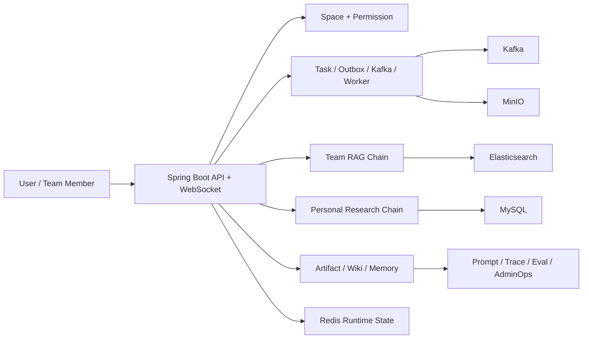

# NoteWeave 简历对齐项目架构主述与面试准备

> 更新时间：2026-06-09  
> 这份文档只服务一个目标：**围绕当前简历描述，把 NoteWeave 讲成一套真实、完整、能扛追问的项目答案。**  
> 表达基准以当前代码、测试和 Flyway 迁移为准；如果状态文档和代码不一致，优先信代码。

## 1. 这份文档怎么用

这不是学习路线，也不是功能清单，而是面试稿。

你可以这样用：

1. 先背熟第 2 节的一分钟版和三分钟版主述。
2. 再按第 4 节到第 8 节，把简历里的 5 个核心点逐条讲顺。
3. 面试官继续下钻时，直接接每节后面的“高频追问”和“不能说满”。
4. 如果对方开始怀疑你是不是只会堆名词，就切到第 9 节和第 10 节。

---

## 2. 项目主述

### 2.1 一句话版本

NoteWeave 是一个面向个人研究和团队知识协作的 AI 知识工作台，我做的核心不是简单接入大模型，而是把资料接入、权限隔离、可追溯问答、产物生成和长期知识沉淀做成了一套统一的工程闭环。

### 2.2 一分钟版本

这个项目我把它理解成一个双空间 AI 知识工作台。团队侧主要解决知识库上传、解析、索引、Hybrid RAG 问答、Citation 引用和 Wiki 沉淀；个人侧主要解决研究资料导入、卡片化编译、Artifact 生成和确认后的知识沉淀。底层我没有让这些能力各自做一套执行逻辑，而是统一在 `Space + Permission + Task/Outbox/Kafka + RetrievalTrace/Citation + Artifact/Wiki/Memory` 这套骨架里。这样做的价值是，系统不仅能回答问题，还能回答“资料从哪来、为什么召回这些证据、为什么这份内容能沉淀、坏了怎么排查”。

### 2.3 三分钟版本

如果从架构上讲，NoteWeave 不是单点 RAG，也不是普通聊天系统，而是一个双主线知识工作台。

第一条主线是团队知识闭环。文档先进入团队知识库，经过分片上传、对象去重、异步解析、chunk 化和索引写入，后面团队问答走的是权限约束下的 Hybrid RAG 链路。召回层不是只靠单一路径，而是组合了 BM25、向量召回和 Wiki recall，再用加权 RRF 做融合，后面还有证据去重、相邻片段合并、每文档限流和上下文裁剪。最终回答不只是生成文本，还会把 Citation 和 RetrievalTrace 持久化，方便审计、排查和后续评测。

第二条主线是个人研究闭环。个人资料从 `Source` 进入系统后，不是直接喂给模型，而是会被编译成 `ArticleCard`、`ConceptCard`、`ConceptRelation` 这一层结构化知识。后面再结合 `MethodologyCard` 生成 Artifact，用户确认之后，才能进一步蒸馏为 `SynthesisCard` 或进入长期记忆。这里我刻意把聊天、产物、Wiki、Memory 分层，避免临时生成内容直接污染长期知识。

底层支撑上，我比较强调统一执行骨架。长任务比如上传处理、索引、Artifact 生成、Wiki 索引、RAG Eval、清理任务，统一走 `Task + TaskOutbox + Kafka + Worker`，而不是每个模块自己起线程或自己维护状态机。运行态方面，WebSocket 负责流式输出、停止恢复和多会话切换，Redis 只承载短期 runtime state，不承担业务事实；真正的业务事实还是在 MySQL。再往后是可观测性，包括 `PromptVersion`、`LLMCallLog`、`RetrievalTrace`、`AnswerFeedback`、`RagEvalRun`、`AdminTask`、`Health/Audit`，这样系统才不是只能演示，而是能持续排查和演进。

---

## 3. 先把总架构讲清楚

### 3.1 总体架构一句话

它本质上是一个 **单体应用里的分层 AI 系统**：业务边界先按 `TEAM` 和 `PERSONAL` 拆，执行链路再按“同步控制面 + 异步数据面 + 检索生成面 + 沉淀治理面”组织。

### 3.2 面试里推荐的总图说法

### 3.3 架构拆解口径

- `Spring Boot` 是统一业务入口，承载 REST API、WebSocket、权限校验和模块编排。
- `MySQL` 是业务事实源，核心实体、任务状态、证据关系、产物版本、记忆和运维数据都落这里。
- `Redis` 只做运行态和短期状态，比如 ws-ticket、流式输出进度、短期上下文窗口、停止恢复标记，不承担最终事实。
- `Kafka` 只负责异步任务触发，不负责业务幂等，真正的幂等和状态判断仍然基于 Task 和业务表。
- `MinIO` 负责原始文件、解析文本、引用快照等大对象。
- `Elasticsearch` 负责团队文档 chunk、向量字段、Wiki 检索读模型。
- `LLM` 不是裸接，而是被 Prompt、Evidence、Citation、Trace、Eval 这些约束层包住。

### 3.4 面试官如果问“系统最核心的三个设计点是什么”

你可以直接答：

1. 我先做了 `TEAM / PERSONAL` 双空间和权限边界，先避免 AI 系统最常见的数据串空间问题。
2. 我把长任务统一收敛到 `Task/Outbox/Kafka/Worker`，避免上传、索引、生成、评测各做一套异步逻辑。
3. 我把 RAG、Artifact、Wiki、Memory 做了分层，临时生成内容不能直接变成长期知识。

---

## 4. 简历点一：搭建多会话知识工作台底座

### 4.1 简历上这句话怎么讲

简历里的这条，不要只讲“做了 WebSocket 和多会话”，要讲成：

我搭了一个双空间的知识工作台底座，核心解决的是多会话执行、流式输出、停止恢复、上下文装载、权限隔离和运行态管理，让团队问答、个人研究和内容生成都能复用同一套会话与执行框架。

### 4.2 这条背后的架构是什么

- 顶层边界是 `Space`，分为 `TEAM` 和 `PERSONAL`。
- 角色分两层：系统角色和空间角色，避免后台身份和业务访问权限混在一起。
- 会话层区分 `DRAFT` 和 `FORMAL`。
- 运行层走 WebSocket，处理流式输出、停止、恢复和多会话切换。
- Redis 保存运行态，MySQL 保存正式消息、会话事实和后续沉淀结果。
- Context 不是简单全量回放，而是通过 `ContextReadRouter` 做分层装载。

### 4.3 为什么这样设计

- 如果不先拆 `TEAM / PERSONAL`，后面 RAG、Artifact、Memory 很容易串数据。
- 如果把系统角色和空间角色混在一起，Admin、Owner、Member 的权限边界会越来越乱。
- 如果会话只有一种状态，草稿态试探、长任务生成和正式沉淀会相互污染。
- 如果运行态直接落 MySQL，每次 token 流式刷新都写库，吞吐和恢复都会很差。

### 4.4 一段能直接说出口的深答

这条底座能力我最想强调的不是“我接了个 WebSocket”，而是我把 AI 工作台里最容易失控的会话执行问题先收敛了。系统先用 `Space` 把团队和个人两条主线隔开，再用系统角色和空间角色拆身份边界。交互层我走的是 WebSocket runtime，因为我们需要流式输出、停止生成、会话切换和恢复，这类能力 HTTP 单次请求不太好承载。运行态我放在 Redis，比如 ws-ticket、流式 partial content、短期上下文窗口、stop/resume 标记；正式消息、会话事实和后续沉淀仍然落 MySQL。再往上我区分了 `DRAFT` 和 `FORMAL`，前者更像探索态，不直接写长期知识，后者才进入正式链路，这样后面 Memory、Artifact、Wiki 才不会被临时内容污染。

### 4.5 高频追问

- 为什么这里一定要用 WebSocket，不直接 HTTP SSE？
- `DRAFT` 和 `FORMAL` 为什么要拆？
- Redis runtime state 丢了会怎么样，哪些能恢复，哪些不能恢复？
- 为什么不能把整段历史消息全量拼 prompt？
- systemRole 和 SpaceMember.role 为什么要分开？

### 4.6 不能说满

- 不要说 Redis 是主任务队列。
- 不要说当前已经有复杂的多端同步协同协议。
- 不要说长期记忆会自动学习用户所有行为。

### 4.7 代码锚点

- `src/main/java/com/noteweave/space`
- `src/main/java/com/noteweave/permission`
- `src/main/java/com/noteweave/chat/runtime/service/ChatRuntimeService.java`
- `src/main/java/com/noteweave/chat/runtime/service/ChatRuntimeStateStore.java`
- `src/main/java/com/noteweave/chat/runtime/service/ContextReadRouter.java`
- `src/test/java/com/noteweave/chat/Phase5WorkspaceChatRuntimeIntegrationTest.java`

---

## 5. 简历点二：设计团队侧 Hybrid RAG 检索链路

### 5.1 简历上这句话怎么讲

不要讲成“我做了向量检索”，而要讲成：

我设计的是权限约束下的团队 Hybrid RAG 链路，核心不是单路召回，而是把 BM25、向量召回、Wiki recall、多路融合、证据后处理、Citation 和 RetrievalTrace 串成一条可追溯问答链。

### 5.2 这条背后的架构是什么

- 检索前先做 `Space / KnowledgeBase` 权限和范围过滤。
- 召回层组合 `BM25 + Dense + Wiki recall`。
- 融合层用 `Weighted Reciprocal Rank Fusion`。
- 后处理层用 `EvidencePostProcessor` 做去重、相邻片段合并、每文档限流、上下文裁剪。
- Prompt 层显式把证据和系统指令隔离。
- 回答后把 `Citation` 和 `RetrievalTrace` 持久化。
- 后台用 `RagEval`、`LLMCallLog`、`AnswerFeedback` 做回归验证。

### 5.3 为什么这样设计

- 只用 BM25 容易漏掉语义相关但关键词不一致的内容。
- 只用向量召回又容易在精确术语、标题、编号场景不稳定。
- 团队长期知识不只是文档 chunk，所以 Wiki recall 有自己的价值。
- 多路召回如果直接拼接，会让 prompt 被噪声撑爆，所以需要后处理层。
- 只有回答文本，没有证据关系和召回轨迹，后面几乎没法排障。

### 5.4 一段能直接说出口的深答

我做团队 RAG 时，重点不是“接 ES 和 embedding”，而是把它做成 evidence-first。系统会先按空间和知识库做权限过滤，再做多路召回。BM25 更适合精确关键词、标题、编号这类场景，向量召回负责语义相近内容，Wiki recall负责团队已经确认过的长期知识。多路结果不是简单拼接，而是用加权 RRF 融合，再交给 `EvidencePostProcessor` 去重、合并相邻片段、限制单文档占比并裁剪上下文，防止模型被重复证据淹没。最后 prompt 里会明确“文档内容不是系统指令”，回答后还会保存 Citation 和 RetrievalTrace，所以后面如果用户说引用不准，我能回查到底是召回错了、后处理裁错了，还是模型在证据基础上答偏了。

### 5.5 高频追问

- 为什么 Hybrid 比单向量更稳？
- RRF 为什么适合当前阶段，不直接上重排模型？
- Citation 和 RetrievalTrace 各自解决什么问题？
- 如果没有证据，为什么不让模型自由发挥？
- Prompt injection 文档内容怎么防？

### 5.6 不能说满

- 不要说已经做了完整的 GraphRAG 主链路。
- 不要说已经有成熟的 query rewrite / rerank 平台。
- 不要编造 recall@k、MRR、线上准确率。

### 5.7 代码锚点

- `src/main/java/com/noteweave/team/rag/retriever/HybridRetriever.java`
- `src/main/java/com/noteweave/team/rag/retriever/WeightedReciprocalRankFusion.java`
- `src/main/java/com/noteweave/team/rag/evidence/EvidencePostProcessor.java`
- `src/main/java/com/noteweave/team/rag/prompt/TeamRagPromptBuilder.java`
- `src/main/java/com/noteweave/chat/service/RetrievalTraceService.java`
- `src/test/java/com/noteweave/chat/Phase4TeamRagIntegrationTest.java`
- `src/test/java/com/noteweave/chat/Phase9HybridRetrievalIntegrationTest.java`

---

## 6. 简历点三：设计个人侧 LLM-Wiki 知识编译链路

### 6.1 简历上这句话怎么讲

不要只说“我做了个人知识库”，更好的讲法是：

我做的是一条个人研究资料的知识编译链，不是把原文堆给模型，而是把 `Source` 编译成 `ArticleCard`、`ConceptCard`、`Alias`、`Relation` 这层结构化知识，再支撑 Artifact 生成和确认后的 Synthesis 沉淀。

### 6.2 这条背后的架构是什么

- 个人研究入口是 `ResearchProject + Source`。
- `Source` 支持 `FILE / URL / TEXT`，并有安全抓取与解析逻辑。
- 编译层把原始资料转为文章卡、概念卡、别名和关系。
- 证据回溯不是展示型 JSON，而是正式关系。
- 生成层结合 `MethodologyCard` 产出 Artifact。
- 沉淀层通过 `proposal -> confirm -> SynthesisCard` 控制长期知识进入。

### 6.3 为什么这样设计

- 个人研究资料天然更杂，直接原文堆积很难复用。
- 如果没有 `Alias / Relation`，后面概念归并和跨材料复用会很弱。
- 如果编译结果不保留证据关系，后续 Artifact 很难解释“这结论从哪来”。
- 生成内容默认是不稳定的，所以不能直接等于长期知识。

### 6.4 一段能直接说出口的深答

个人侧我没有把它做成一个单纯聊天入口，而是做成资料编译链。用户先把文件、文本或者 URL 作为 `Source` 导入，URL 还会走安全抓取，避免把任意网页内容直接当可信输入。后面系统不是直接拿 Source 生成人话摘要，而是先编译成 `ArticleCard`、`ConceptCard`、`ConceptAlias`、`ConceptRelation` 这些结构化对象，相当于先抽一层个人 Wiki。这样后面做 Artifact 的时候，用的不再是松散原文，而是结构化知识和证据关系。再往后如果用户觉得某份 Artifact 值得沉淀，也不是直接自动写库，而是先生成 proposal，确认后再绑定具体 `artifactVersionId` 落成 `SynthesisCard`。这条链路的核心思想就是先编译、再生成、再确认沉淀。

### 6.5 高频追问

- 为什么个人侧不直接复用团队文档模型？
- 为什么要有 Card 这一层，不直接全文向量化？
- alias / relation 在真实系统里有什么价值？
- 为什么 Synthesis 要绑定 artifactVersionId？
- 个人知识和长期记忆有什么区别？

### 6.6 不能说满

- 不要说这已经是完整的学术知识图谱平台。
- 不要说已经覆盖完整 BibTeX 主链路。
- 不要说生成的结论会自动合并成稳定知识。

### 6.7 代码锚点

- `src/main/java/com/noteweave/personal/source`
- `src/main/java/com/noteweave/personal/compiler`
- `src/main/java/com/noteweave/personal/card`
- `src/main/java/com/noteweave/personal/distillation`
- `src/test/java/com/noteweave/personal/Phase6PersonalResearchSourceIntegrationTest.java`
- `src/test/java/com/noteweave/personal/Phase7PersonalWikiCompilerIntegrationTest.java`
- `src/test/java/com/noteweave/personal/Phase11_5PersonalArtifactDistillationIntegrationTest.java`

---

## 7. 简历点四：建设文件上传与异步索引处理链路

### 7.1 简历上这句话怎么讲

这条不要讲成“做了上传功能”，推荐说法是：

我做了一条面向知识摄取的上传处理链，把分片上传、断点续传、对象去重、异步解析、chunk 切分、Embedding、索引写入和后续清理都串进了统一任务框架。

### 7.2 这条背后的架构是什么

- 上传层支持分片、断点续传、秒传和合并。
- 存储层有 `FileObject`，把对象存储和业务文档分开。
- 文档层有 `Document / DocumentChunk / IndexVersion` 这类对象。
- 任务层统一走 `Task + Outbox + Kafka + Worker`。
- 失败后保留 `TaskAttempt / TaskEvent` 做重试和排障。
- 清理层通过 scan / execute 两段式处理残留对象和软删除资源。

### 7.3 为什么这样设计

- 文档上传不只是“存个文件”，后面还要解析、索引、引用、删除和回收。
- 不做对象去重，团队重复上传和版本迭代会很浪费。
- 不走统一任务链，解析、索引、清理这些长任务会很快变成各自维护的一堆定时线程。
- 不做 scan / execute 分离，资源清理很容易误删还在被引用的对象。

### 7.4 一段能直接说出口的深答

这条链路我比较强调它是知识摄取链，不是普通附件上传。用户上传后，系统先做分片和状态记录，完成后合并对象并通过哈希做内容去重，把原始大对象和业务文档实体分开。之后不会在请求线程里同步解析，而是创建统一 Task，并通过 Outbox 在事务提交后投递给 Kafka，再由 Worker 做文档解析、chunk 切分、Embedding 和索引写入。这样上传接口只负责可靠接收，长耗时处理交给后台。后面如果索引失败、对象丢失或者文档被删除，我可以通过 TaskAttempt、TaskEvent 和 cleanup 任务继续修复，不需要每个模块自己发明一套失败恢复逻辑。

### 7.5 高频追问

- 为什么不在上传请求里同步做解析和索引？
- `FileObject` 和 `Document` 为什么要分开？
- Kafka 重复消费时怎么保证幂等？
- 文档删除后 ES 里还有旧数据怎么办？
- cleanup 为什么拆 scan 和 execute？

### 7.6 不能说满

- 不要说 Kafka 自带业务幂等。
- 不要说 Redis 是上传处理主队列。
- 不要说已经做了生产级高并发上传压测。

### 7.7 代码锚点

- `src/main/java/com/noteweave/team/document/service/DocumentUploadService.java`
- `src/main/java/com/noteweave/team/document/service/DocumentProcessingService.java`
- `src/main/java/com/noteweave/task/service/TaskOutboxService.java`
- `src/main/java/com/noteweave/task/service/TaskExecutionCoordinator.java`
- `src/main/resources/db/migration/V2__phase_1_5_task_outbox_worker.sql`
- `src/main/resources/db/migration/V3__phase_2_file_upload_async_ingestion.sql`
- `src/main/resources/db/migration/V4__phase_3_document_processing_indexing.sql`
- `src/test/java/com/noteweave/team/document/Phase2UploadFlowIntegrationTest.java`
- `src/test/java/com/noteweave/team/document/Phase3DocumentProcessingIntegrationTest.java`

---

## 8. 简历点五：实现 Skill-based Studio 生成与知识沉淀

### 8.1 简历上这句话怎么讲

不要讲成“做了 Agent”，更安全、更有分寸的讲法是：

我实现的是一个基于 Plan 和 Skill 的受控生成链，把资料装载、工具上下文注入、证据选择、内容生成、Artifact 保存和后续沉淀串成可观测流程，同时预留了 MCP 工具扩展能力。

### 8.2 这条背后的架构是什么

- Studio 入口可以触发 Artifact 生成任务。
- `ArtifactPlanExecutor` 负责按步骤编排生成流程。
- `SkillExecutionLog` 记录每个步骤的执行结果。
- `MethodologyCard` 控制输出结构、工作流和质量检查。
- MCP 工具当前是受控接入，不是任意工具随便调用。
- 生成结果先落 `Artifact / ArtifactVersion / ArtifactCitation`。
- 后续沉淀要么进个人 `SynthesisCard`，要么经团队 Wiki 路径进入长期知识。

### 8.3 为什么这样设计

- 开放式 Agent 很强，但不可控，尤其在权限、工具调用、成本和错误恢复上风险大。
- 对多数内容生成任务来说，Plan-based 流程比完全自由规划更稳。
- 如果没有执行日志，生成失败时很难知道是工具上下文、证据选择还是模型生成出了问题。
- 如果生成内容直接进入长期知识，污染成本会很高。

### 8.4 一段能直接说出口的深答

Studio 这条链我刻意没有把它说成“通用自主 Agent 平台”，因为当前项目更像受控生成工作流。用户触发生成后，系统会创建 `ARTIFACT_GENERATE` 任务，再由 `ArtifactPlanExecutor` 按固定步骤执行，比如加载生成上下文、装载方法论、引入 MCP 工具上下文、选择证据、生成内容和保存产物。这里的 Skill 更像可观察、可替换的生成步骤，不是任意规划任意调用工具。MCP 这块当前也主要是受控扩展路径，比如 Bilibili 工具上下文能被引入 Artifact 生成，但不会直接写 Wiki 或 Memory。生成结果先沉淀为 Artifact 和版本，再由用户确认决定要不要进一步进入 Synthesis 或长期知识。这种设计牺牲了一点开放性，但换来了更稳的权限边界、执行可观测性和知识沉淀质量。

### 8.5 高频追问

- Skill 和 Agent 的边界是什么？
- 为什么不用完全开放式 Agent？
- MCP 在这个项目里到底起什么作用？
- 为什么 Methodology 要独立建模？
- 生成结果为什么不能直接写 Wiki 或 Memory？

### 8.6 不能说满

- 不要说已经是完整开放式多 Agent 平台。
- 不要说所有工具调用都基于 MCP。
- 不要说当前已有完整 MCP marketplace。

### 8.7 代码锚点

- `src/main/java/com/noteweave/artifact/service/ArtifactPlanExecutor.java`
- `src/main/java/com/noteweave/artifact/skill/service/SkillExecutionLogService.java`
- `src/main/java/com/noteweave/personal/methodology/service/MethodologyCardService.java`
- `src/main/java/com/noteweave/studio/service/StudioMcpChatTriggerService.java`
- `src/main/java/com/noteweave/studio/service/StudioMcpToolRegistry.java`
- `src/main/java/com/noteweave/studio/service/LocalBilibiliMcpToolService.java`
- `src/main/java/com/noteweave/studio/service/RemoteBilibiliMcpToolService.java`
- `src/test/java/com/noteweave/artifact/Phase8StudioArtifactIntegrationTest.java`
- `src/test/java/com/noteweave/chat/Phase11_6ChatMcpIntegrationTest.java`

---

## 9. 如果面试官让你“直接讲整个架构”

推荐按下面顺序讲，不要乱。

### 9.1 第一层：先讲业务边界

先说这是双空间：

- `TEAM` 负责共享知识库、RAG、Wiki、Graph。
- `PERSONAL` 负责研究资料、卡片编译、Artifact、Synthesis、个人记忆。

### 9.2 第二层：再讲统一底座

再说底层共用这些骨架：

- `Space + Permission`
- `Task + Outbox + Kafka + Worker`
- `MySQL + Redis + MinIO + Elasticsearch`
- `Prompt + Trace + Citation + Eval + AdminOps`

### 9.3 第三层：最后讲两条主链

- 团队链：`Upload -> Parse -> Chunk -> Index -> Hybrid RAG -> Citation -> Wiki`
- 个人链：`Source -> Compile -> Card -> Artifact -> Confirm -> Synthesis`

### 9.4 一段总答模板

如果让我直接讲整个架构，我会先说这是一个双空间 AI 知识工作台，先用 `TEAM` 和 `PERSONAL` 区分共享知识协作和个人研究沉淀两条主线。底层共用统一的权限模型、统一的任务执行骨架和统一的证据可追溯模型。团队侧主线是文档摄取到 Hybrid RAG，再到 Citation 和 Wiki；个人侧主线是资料导入到结构化卡片编译，再到 Artifact 生成和确认后的 Synthesis。支撑层上，MySQL 负责事实存储，Redis 负责 runtime state，Kafka 负责任务触发，MinIO 负责大对象，Elasticsearch 负责检索读模型。这样系统的重点就不只是“能回答”，而是“能隔离、能追溯、能沉淀、能排障”。

---

## 10. 哪些点最值得主动强调，最能体现深度

- 主动强调 `TEAM / PERSONAL` 双空间。这比直接说“做了 RAG”更能体现你做过边界设计。
- 主动强调 `Task/Outbox/Kafka/Worker` 是统一骨架。说明你不是按功能堆 if else。
- 主动强调 `Citation + RetrievalTrace`。这能证明你理解 AI 系统的可追溯性，而不只是会接模型。
- 主动强调 `Artifact / Wiki / Memory` 分层。这个点很能体现你知道“临时生成”和“长期知识”不是一回事。
- 主动强调 `DRAFT / FORMAL`。这能把会话运行态、长期沉淀和污染控制自然串起来。
- 主动强调 `MethodologyCard`。它能体现你不是只会 prompt 拼接，而是在做生成流程产品化。

---

## 11. 哪些点绝对不要说满

- 不要把当前项目说成完整开放式 Agent 平台。
- 不要把当前 WikiGraph 说成完整 GraphRAG 主链路。
- 不要把 Redis 说成主任务队列。
- 不要把 MCP 说成所有主链路的基础设施。
- 不要把 BibTeX 说成当前个人链路的已落地主入口。
- 不要编造线上指标、QPS、P99、准确率和用户规模。
- 不要说生成结果会自动进入长期知识。

---

## 12. 面试收尾时可以怎么总结

最后如果面试官问“你觉得这个项目最有价值的地方是什么”，你可以这样收：

我觉得这个项目最有价值的地方不是功能多，而是把 AI 系统里最难工程化的几件事统一了：先用空间和权限收边界，再用统一任务骨架收长任务，再用证据和引用收可追溯，再用 Artifact、Wiki、Memory 收长期沉淀。这样它不是一堆 AI 功能的拼接，而是一套能持续演进的知识工作台。

---

## 13. 快速复习提纲

面试前最后五分钟，只看这 7 句：

1. NoteWeave 是双空间 AI 知识工作台，不是单点聊天系统。
2. 团队侧主线是 `Upload -> Parse -> Chunk -> Hybrid RAG -> Citation -> Wiki`。
3. 个人侧主线是 `Source -> Card Compile -> Artifact -> Confirm -> Synthesis`。
4. 长任务统一走 `Task/Outbox/Kafka/Worker`，不是模块各自起异步。
5. 团队 RAG 的核心是 evidence-first，不是单纯向量检索。
6. Artifact、Wiki、Memory 分层是为了防止临时生成污染长期知识。
7. 可观测性靠 `PromptVersion + LLMCallLog + RetrievalTrace + Citation + RagEval + AdminOps` 串起来。

---

## 14. 面试官会更喜欢的讲法：先讲业务，再讲技术

你后面讲项目时，不要一上来就说 Spring Boot、Redis、Kafka、ES、Embedding。

更推荐的顺序是：

1. 先讲业务问题。
2. 再讲为什么普通做法不够。
3. 再讲你为什么选这套方案。
4. 最后补当前不足和下一步优化。

### 14.1 业务开场模板

如果面试官问你“介绍一下项目”，推荐这样起手：

这个项目最初不是为了做一个聊天机器人，而是为了解决两类真实问题。第一类是团队知识协作问题，团队资料很多，但分散在文档、笔记和临时讨论里，导致查找慢、问答不稳定、结论难复用；第二类是个人研究沉淀问题，资料导入之后如果只是堆原文和聊天记录，后面很难形成可复用的知识资产。所以我做 NoteWeave 时，重点不是把模型接进来，而是把资料进入系统、被检索引用、生成产物、再沉淀为长期知识这条闭环做顺。

### 14.2 技术切入模板

后面再接：

基于这个业务目标，我没有把它做成单点问答，而是拆成团队侧知识闭环和个人侧研究闭环，两条主线共用统一的权限、任务、证据和沉淀框架。这样做的原因是，团队问答更强调共享、权限和可追溯，个人研究更强调编译、整理和确认后沉淀，它们不能用完全一样的知识形态处理。

### 14.3 展现思考的模板

再往下可以主动补一句：

我做方案时，比较在意三件事：第一是数据边界不能乱，第二是长链路失败后能恢复，第三是生成内容不能直接污染长期知识。所以后面的很多设计，比如 `TEAM / PERSONAL` 双空间、`Task/Outbox/Kafka`、`Citation/Trace`、`Artifact/Wiki/Memory` 分层，都是围绕这三个目标展开的。

---

## 15. 把关键词补成可面试的知识点

这一节不是让你背术语，而是让你把关键词讲成“为什么需要、为什么这么选、有什么替代方案”。

### 15.1 加载与解析：纯文本、富文本、图片、PDF、OCR、VLM

#### 面试里怎么讲

资料进入知识系统之前，真正难的不是“上传”，而是“把不同形态资料转成稳定、可切分、可检索的文本表示”。纯文本最简单，富文本和 PDF 会多出版式、标题层级、表格、脚注、页眉页脚，扫描件又会引入 OCR 误差，所以摄取链不能只看文件类型，还要看内容结构和解析质量。

#### 和当前项目怎么挂钩

NoteWeave 当前主链路已经实现了文件上传、异步解析、切分和索引，但主能力还是基于文本可提取文档。也就是说，项目已经完成了“文档摄取骨架”，但在高噪声 PDF、扫描件、图文混排场景下，还可以继续增强。

#### 面试官如果追问“为什么 OCR / VLM 很重要”

你可以答：

因为 RAG 的上限不只由检索决定，前面的解析质量就会决定证据质量。如果 OCR 把标题、段落或表格关系识别错了，后面 chunk 再精细、向量模型再强，也是在错误文本上做检索。对于论文、报告、扫描版 PDF，未来更稳的方向通常是把文本提取、版面分析、OCR 和必要的多模态解析结合起来，而不是只做纯文本抽取。

#### 替代方案怎么比较

- 最简单的是纯文本提取，成本低，但对复杂 PDF 很脆弱。
- OCR 适合扫描件，但容易引入识别噪声。
- 加版面分析能改善标题、表格、段落边界。
- VLM 更适合图表和复杂布局，但成本更高、延迟更大。

#### 当前不足和优化方向

- 当前项目可以诚实地说主链路偏文本解析。
- 后续可增强为“先判文档类型，再路由解析策略”。
- 对扫描件可加 OCR。
- 对复杂图表文档可在高价值场景引入 VLM 辅助解析。

### 15.2 切分：递归切分、语义切分、段落切、句子切

#### 面试里怎么讲

chunking 不是把文章随便切开，而是在召回率、精确率、上下文完整性和索引成本之间做平衡。切太粗，召回噪声大、上下文预算浪费；切太细，语义断裂、证据碎片化、后处理压力变大。

#### 和当前项目怎么挂钩

当前 NoteWeave 已经有 `DocumentChunk` 和证据后处理层，所以你可以讲：项目现在已经有“切分 + 检索 + 证据合并”的基本闭环。也就是说，切分不只是 ingestion 的事，后面 `EvidencePostProcessor` 还承担了对切分副作用的修正。

#### 为什么不能只用固定长度切分

固定长度实现最简单，但有三个问题：

- 容易把完整段落或定义切断。
- 容易让标题和正文脱离。
- 对不同文档类型不够自适应。

#### 更成熟的答法

我理解切分应该至少分三层考虑。第一层是结构边界，比如标题、段落、列表、表格；第二层是长度边界，控制 token 预算；第三层是召回后的重组能力，也就是检索后是否能把相邻证据重新合并。当前项目更偏“切分 + 后处理合并”的实用路线，后续如果做更深优化，可以往结构感知切分、语义切分和按文档类型自适应切分走。

### 15.3 嵌入与向量模型：BGE-M3、按权限嵌入、分区

#### 面试里怎么讲

embedding 不是“选一个模型就完事”，而是要回答三个问题：嵌什么、存在哪里、召回时如何约束范围。对企业知识系统来说，权限范围和检索范围经常比模型本身更重要。

#### 和当前项目怎么挂钩

当前 NoteWeave 的团队检索是权限优先的，也就是先限定空间和知识库，再做混合召回。这个思路本身就是对“按权限嵌入 / 按权限检索”的一种工程回答。

#### 为什么可以提到 BGE-M3

BGE-M3 这类多功能 embedding 模型，价值在于一个模型能兼顾多语言、dense、sparse 和多粒度检索思路，所以适合做后续升级讨论。但要注意口径：可以说它是你会考虑的升级方向，不要说当前仓库已经切到了 BGE-M3。

#### 替代方案怎么比较

- 传统 dense embedding 适合语义召回。
- sparse/dense hybrid 更适合兼顾术语和语义。
- 多语言和多功能模型适合混合场景，但成本和调优复杂度更高。

#### 当前不足和优化方向

- 当前项目主链路强调 Hybrid，而不是单模型统一天下。
- 后续可以尝试更强 embedding、按文档类型差异化向量化、别名扩展和 query/document 双塔增强。

### 15.4 向量库、ES、Milvus、ANN、HNSW、倒排索引

#### 面试里怎么讲

在企业 RAG 里，很多时候不是“向量库和搜索引擎二选一”，而是要看你是更偏“全文检索 + 权限过滤 + 混合召回”，还是更偏“纯向量近邻能力”。如果业务里标题词、缩写词、编号词、权限过滤都很多，那么搜索引擎路线往往更贴近主链路。

#### 和当前项目怎么挂钩

当前 NoteWeave 选择的是 ES 为中心的检索方案，这非常适合你在面试里讲取舍：

- 因为当前需求不只是向量近邻，还要 BM25、权限范围、Wiki recall 和混合排序。
- 所以以 ES 为中心更符合当前阶段的主诉求。
- Milvus 这类专门向量库可以作为后续更强 ANN 能力的扩展方向，但不是当前必须。

#### 为什么可以提 HNSW / ANN

因为面试官可能会追问“向量检索底层怎么做近似搜索”。你不一定要背公式，但要知道核心点：

- ANN 是为了在大规模向量里做近似最近邻搜索，平衡精度和速度。
- HNSW 是很常见的图索引结构，查询快，工程上很常用。
- 它解决的是“如何快”，不解决业务权限和证据可信的问题。

#### 一个稳妥的回答模板

如果单看向量近邻能力，专门向量库会更强，但当前项目的核心不是纯向量搜索，而是权限约束下的混合检索，所以我优先选择了更适合做 BM25、过滤、融合和检索编排的 ES 路线。后面如果文档规模和向量召回占比继续提升，可以再评估专门向量库或双引擎架构。

### 15.5 相似度：余弦、点积、欧氏距离

#### 面试里怎么讲

这个点不要背定义，要讲工程理解：

如果向量已经归一化，余弦和点积在排序上会很接近；欧氏距离更适合一些几何空间解释，但在文本 embedding 检索里，工程上更常见还是余弦或点积。面试时最重要的是说明你知道“相似度选择要和模型训练方式、向量归一化方式、索引实现一起看”，不是孤立选一个公式。

### 15.6 检索：RRF、reranker、answer

#### 面试里怎么讲

RRF 和 rerank 不冲突，它们解决的是不同层次的问题。

- RRF 适合先把多路召回稳妥融合起来。
- reranker 更适合在候选集已经缩小之后做更精细排序。

#### 和当前项目怎么挂钩

当前 NoteWeave 已经有 `Weighted RRF`，所以你可以说：

当前阶段我优先做的是多路召回融合，因为团队知识场景先要解决漏召回和单路偏置问题。rerank 是很自然的下一步，但我不会在简历主述里说成已经有完整 rerank 平台。

#### 更像大厂回答的说法

如果候选集本身质量不够，直接上 reranker 效果未必稳定；先把 BM25、dense、Wiki recall 的候选做稳，再在高价值场景加 cross-encoder rerank，通常是更务实的演进路径。

### 15.7 Query：错别字、改写、重写、HyDE、意图识别、用户画像

#### 面试里怎么讲

很多 RAG 问答答不好，不是文档没进库，而是 query 本身表达太弱。比如简称、别名、错别字、模糊提问、缺少上下文，都会导致召回失败。所以 query 预处理是很重要的增强层。

#### 和当前项目怎么挂钩

当前 NoteWeave 主链路还不是“重度 query rewrite 系统”，这一点要诚实。但你完全可以把这块讲成“下一阶段最合理的增强项”，而且和现有架构天然兼容。

#### 可以补的知识点

- 错别字纠正适合解决术语打错、输入质量差问题。
- query rewrite 适合把口语化问题改成更适合检索的表达。
- query decomposition 适合复杂问题拆子问题。
- HyDE 的核心思路是先生成一个假设性答案，再用它去做 dense retrieval。
- 意图识别 / query routing 适合决定当前该走团队 RAG、个人资料、Wiki recall 还是直接回答。

#### 一个高质量回答模板

我会把 query 增强放在检索前置层理解。当前项目已经把检索、证据和沉淀链路打通了，后续最值得加的一类能力就是 query 预处理，比如别名扩展、术语纠错、检索式改写、复杂问题拆分和基于意图的路由。这样做的收益是，很多看起来像“检索不准”的问题，其实在进入召回之前就能被修正。

### 15.8 图 RAG / GraphRAG

#### 面试里怎么讲

这个点一定要有边界感。当前项目可以讲 `WikiGraph`、`KnowledgeGraph` 和 `AutoWikiMaintenance`，但不能直接说主链路已经是完整 GraphRAG。

#### 更稳的说法

我对图能力的理解是，图检索不应该一开始就替代主 RAG 主链，而更适合作为长期知识层上的增强能力。当前项目已经有 Wiki 页、关系和图展示/同步能力，这为后续做更深的图路径推理、社区聚合和图增强检索打下了基础，但当前主链路仍然是 Hybrid RAG。

#### 为什么这样说更好

因为这体现了你知道 GraphRAG 的工程门槛：

- 先要有稳定长期知识层。
- 再要有实体、关系、链接和图同步。
- 再往后才是图上的检索、推理和摘要。

---

## 16. 把“为什么不用别的方案”练熟

这一节是专门给大厂面试官追问用的。

### 16.1 为什么用 Hybrid RAG，不直接纯向量？

因为团队知识里有大量精确术语、标题、编号、简称和权限过滤场景。纯向量对语义相关内容强，但对精确关键词不总是稳定，所以我更倾向把 BM25 负责精确命中，dense 负责语义命中，再加 Wiki recall 负责长期确认知识。

### 16.2 为什么先用 RRF，不直接上 reranker？

因为当前阶段先要解决多路召回的稳定融合问题。RRF 成本更低、实现更稳，也更适合把不同召回器先组合起来；reranker 更适合作为候选集已经不错时的精排增强。

### 16.3 为什么当前选择 ES，不直接上 Milvus？

因为项目当前不是纯向量检索，而是权限过滤、BM25、Wiki recall、混合融合一起做。ES 更适合当前阶段的综合需求。Milvus 这类专门向量库我会放在“向量规模继续增大或 dense 召回占比明显上升之后”的演进选项里。

### 16.4 为什么要 Artifact / Wiki / Memory 分层，不直接都当知识库？

因为这三者生命周期不一样。Artifact 更像阶段产物，Wiki 是团队长期知识，Memory 是上下文和偏好。把它们混在一起最容易导致临时生成内容污染长期知识，或者让会话偏好和正式知识相互干扰。

### 16.5 为什么用 Task/Outbox/Kafka，不直接本地线程池？

因为这个项目的长任务很多，而且要支持重试、取消、观测和后台管理。如果每个模块自己起线程池，短期能跑，后期一致性、恢复和排障都会失控。统一 Task 骨架的好处是新功能接进来时不需要再造一套异步机制。

### 16.6 为什么用 WebSocket runtime，不只做同步问答？

因为这个项目里不只是“一问一答”，还要处理流式输出、停止生成、恢复、会话切换和草稿态交互。同步接口能做简单问答，但不适合承载完整工作台交互体验。

---

## 17. 当前方案的不足和更像大厂的优化口径

这一节很重要，因为它能把“玩具项目感”降很多。

### 17.1 文档摄取的不足

- 当前主线更偏文本可提取文档。
- 对扫描件、复杂版式 PDF、图表型文档的解析增强还可以继续做。
- 后续可加 OCR、版面分析、文档类型识别和多模态解析路由。

### 17.2 检索层的不足

- 当前主链路已经有 Hybrid + RRF，但 query rewrite、rerank、别名扩展还可以继续增强。
- 后续可按场景逐步加 typo correction、rewrite、HyDE、cross-encoder rerank。

### 17.3 索引层的不足

- 当前以 ES 为中心是合理的，但 dense 检索规模继续涨之后，可能要重新评估向量索引专用组件。
- 后续可以探索双索引架构、分层索引、冷热分层和更细粒度 ANN 参数调优。

### 17.4 长期知识层的不足

- 当前已经有 WikiGraph 和自动维护，但图能力更多还是长期知识可视化和关系增强。
- 后续如果要做真正更强的图增强检索，还需要更稳定的实体抽取、关系标准化和图查询链路。

### 17.5 记忆层的不足

- 当前已经区分 runtime state、session summary、space memory、user memory。
- 但长期记忆仍然可以继续做写回质量控制、记忆老化、冲突消解和按任务类型分层读取。

### 17.6 可观测性的不足

- 当前已经有 Trace、Citation、Eval、Admin/Ops。
- 但如果继续向生产化走，还可以补更系统的离线评测集、线上观测指标和 prompt/version 回归基线。

---

## 18. 一些可以主动抛给面试官的“我有思考”的句子

- 我做这个项目时，比较明确地避免把所有 AI 能力都堆进一个统一知识库，而是先按生命周期分层。
- 我对 RAG 的理解不是“接向量库”，而是前面从解析、切分到召回、后处理、引用、评测是一整条链。
- 我当前方案不是最重的方案，而是围绕当前业务阶段做的务实取舍，比如先 Hybrid + RRF，再考虑 rerank。
- 我比较在意知识系统里的污染问题，所以生成内容、长期知识和记忆写回都做了边界控制。
- 如果继续做，我最优先的增强会放在解析质量、query 增强和高价值场景 rerank 上，因为这三项对最终回答质量的收益通常最大。

---

## 19. 可以直接背的“业务 -> 方案 -> 取舍 -> 优化”模板

### 19.1 讲团队 RAG

团队资料场景的核心问题不是“能不能搜”，而是“能不能在权限正确的前提下稳定命中、给出证据、还能复用为长期知识”。所以我没有做纯向量检索，而是用了 BM25、dense 和 Wiki recall 的 Hybrid 方案，先解决术语命中、语义命中和长期确认知识三类来源，再用 RRF 融合、EvidencePostProcessor 收噪声、Citation 和 Trace 收追溯。这个方案的好处是更稳、更可排查，代价是链路更复杂。下一步最值得做的是 query rewrite、rerank 和更强解析能力。

### 19.2 讲个人研究链

个人研究的问题不是缺一个聊天入口，而是资料很杂、结论不稳定、后续难复用。所以我没有把 Source 直接喂给模型，而是先编译成卡片和关系，再结合方法论生成 Artifact，最后通过 proposal/confirm 的方式沉淀为 Synthesis。这个方案的好处是长期更可复用，代价是链路更长、建模更复杂。下一步可以继续增强别名归并、知识关联和更细的写回策略。

### 19.3 讲上传与异步链

文件上传在知识系统里不是附件功能，而是知识摄取入口。后面还要解析、切分、索引、引用、删除和清理，所以我没有让接口线程同步做完，而是统一走 Task/Outbox/Kafka/Worker，把可靠接收和长耗时处理分开。这个方案的好处是一致性和可恢复性更强，代价是后台状态机和运维复杂度更高。后续可以继续做更细的失败分类和更多文档类型解析策略。

---

## 20. 这一轮补充后，你最该记住的 5 个升级点

1. 以后讲项目先讲业务问题，不要先报技术栈。
2. 每个技术点都要能回答“为什么选它，而不是相近方案”。
3. 主动承认当前不足，反而更像做过真实工程。
4. 对 NoteWeave 来说，最值得往下深挖的是解析、query 增强、rerank、图增强和记忆写回。
5. 项目里真正高级的不是某个单点技术，而是你把边界、任务、证据和沉淀统一起来了。

---

## 21. RAG 优化总览：按面试官常见分类来讲

这一节可以直接对应你截图里的分类。它的作用不是让你背论文，而是让你在面试时把“RAG 优化”讲成一套方法论。

推荐的总起手：

我理解 RAG 优化不是只优化检索器，而是从知识进入系统开始，一直到 query 预处理、召回融合、重排裁剪、可信生成和过程评测，整条链路都可以做优化。不同阶段优化的目标不一样，前面更偏知识工程和索引质量，中间更偏召回与排序，后面更偏生成可信度和诊断闭环。

### 21.1 第一类优化：知识工程优化

#### 21.1.1 自动化知识生产

自动化知识生产解决的是“知识进库太慢、太散、太依赖人工整理”的问题。

面试里可以这样讲：

知识系统的瓶颈很多时候不在问答，而在知识生产。如果文档只是上传原件，没有被结构化、打标签、建立版本和关系，那后面的 RAG 再强也只能在低质量知识上工作。所以更成熟的路线通常会做自动化知识生产，把解析、清洗、切分、元数据抽取、摘要、候选标签、候选关系甚至 Wiki 初稿生成串起来，再交给人确认。

和 NoteWeave 的关系：

- 当前项目已经有 `AutoWikiMaintenance`，这是很好的“自动知识生产”切入点。
- 你可以说当前已经从“纯人工维护 Wiki”进化到了“系统自动生成长期知识草稿，再由人确认或继续维护”。
- 这比只说“我做了 Wiki”更有工程味。

#### 21.1.2 Chunk 切分优化

这里不要只说“切大一点还是切小一点”，而要讲四个维度：

- 结构完整性：标题、段落、列表、表格是否被切碎。
- 召回精度：chunk 过大时噪声会不会太多。
- 证据完整性：定义、结论、约束条件是否落在同一块里。
- 后处理成本：切得太碎会不会让 rerank 和上下文装配负担变重。

更成熟的答法：

chunk 优化通常不是一次性拍脑袋决定，而是按文档类型做分层策略。比如纯文本和 FAQ 适合更细粒度切分，报告、论文、规范文档更适合结构感知切分，复杂 PDF 还要先做版面解析。当前项目已经有 chunk + EvidencePostProcessor 的闭环，后续最自然的升级是做结构感知切分和按内容类型切分。

#### 21.1.3 元数据 Tag 优化

这个点很适合把你和“只会向量检索的人”拉开。

面试里可以讲：

RAG 不是只有正文内容可检索，元数据本身就是重要信号。标题、作者、时间、业务域、文档类型、知识库归属、空间、版本、标签、可信来源等级，这些字段一方面可以做检索前过滤，另一方面可以参与排序、路由和后续评测。

更像大厂的理解：

- metadata 的价值不只是过滤，还能补充语义上下文。
- 一些场景里，给 chunk 加上下文标签或文档级摘要，效果会明显好于只嵌入裸文本。
- metadata 本质上是在把“弱结构化文本”往“可计算知识对象”推进。

和 NoteWeave 的关系：

- 当前项目已经有 `Space`、`KnowledgeBase`、`Document`、`WikiPage`、Citation 这些强业务元数据。
- 后续完全可以继续加：业务域标签、时间有效期、来源可信度、版本状态、别名词典。

#### 21.1.4 知识冲突治理

这是很容易被忽略、但面试官很爱追问的点。

推荐说法：

企业知识里经常会出现冲突信息，比如旧规范和新规范、草稿和正式版、部门口径不同、个人经验和团队共识不一致。如果系统只会把冲突片段一起塞给模型，最后往往要么答得模糊，要么答出错误折中结果。所以成熟的 RAG 不只是召回更多信息，还要治理冲突信息。

一个有深度的回答模板：

知识冲突治理至少有四层。第一层是版本和时效治理，先区分草稿、正式版、过期版；第二层是来源权威治理，比如官方发布、团队确认、个人记录优先级不同；第三层是检索时的冲突检测和冲突标记；第四层是生成时明确告诉模型“存在冲突，优先按某个来源或最新版本回答”。当前项目已经有 Wiki/Artifact/Memory 分层和版本化基础，后续完全可以继续往 conflict-aware retrieval 走。

### 21.2 第二类优化：Query 改写优化

#### 21.2.1 为什么要做 Query 改写

因为很多检索失败不是知识库缺数据，而是用户问题表达不适合检索。

常见问题包括：

- 口语化表达
- 省略上下文
- 别名、简称、缩写
- 错别字和中英文混用
- 多跳问题混成一个问题
- 任务意图不清，根本不知道该查团队还是查个人

一个成熟口径：

query 改写本质上是在缩小“用户表达”和“知识索引表达”之间的鸿沟。传统搜索时代做的是 query expansion 和 spell correction，现在在 RAG 里多了一层 LLM-based rewrite、decomposition 和 routing。

#### 21.2.2 多路 Query 改写

这个点很适合往深里讲。

你可以说：

不是所有 query rewrite 都只有一种结果。复杂问题经常可以同时生成多个检索视角，比如原始 query、术语化 query、别名展开 query、子问题 query，甚至 HyDE 生成的假设文档 query。后面这些 query 可以并行检索，再在召回层融合。

为什么这更好：

- 能提升复杂问题覆盖率。
- 能减轻单次 rewrite 失败的风险。
- 特别适合多跳问答、跨文档问答和模糊问题。

#### 21.2.3 改写模型微调

这个点不要说成当前项目已做，而要作为方法储备讲。

推荐表述：

如果业务 query 非常稳定，比如企业内部问答、工单助手、法务条款问答，就可以把 query rewrite 从 prompt 技巧进一步升级成可训练模块。微调目标通常不是“让模型更会聊天”，而是“让它更会把用户问题翻译成适合当前知识库的检索语言”。

你可以补的取舍：

- prompt rewrite 启动快，成本低，但稳定性一般。
- 轻量 rewrite 模型可控性更强，更适合高频固定场景。
- 代价是要准备训练数据和做线上回归验证。

### 21.3 第三类优化：检索召回优化

#### 21.3.1 从单路检索到混合检索

这一点和当前项目最贴。

你可以这样讲：

单路检索往往会偏科。全文检索擅长关键词和精确术语，dense 检索擅长语义相似，Wiki 或知识图谱检索擅长长期确认知识。所以更成熟的路线通常会从单路检索演进到混合检索，把不同召回器当成互补关系，而不是替代关系。

#### 21.3.2 双路并行检索

这比“混合检索”再说深一层。

面试里可以讲：

双路并行检索强调的是执行方式，不只是检索类型。比如 sparse 和 dense 可以并行跑，主文档库和 Wiki 库也可以并行跑，query decomposition 产生的多个子 query 也可以并行跑。并行的价值是降低复杂 query 的平均漏召回风险，然后再用 RRF 或 rerank 收口。

#### 21.3.3 GraphRAG 优化

这里要稳住边界。

建议说法：

GraphRAG 更适合回答跨文档关系、多实体关联、全局主题归纳这类问题，而不是替代所有普通 chunk 检索。它的强项不是“比向量更准”，而是能把实体、关系、社区摘要这些长期结构化知识引入检索和总结。

和当前项目怎么挂：

- 当前项目已经有 WikiGraph、KnowledgeGraph、AutoWikiMaintenance。
- 所以可以讲“我已经把图增强的基础设施打出来了”。
- 但主链仍然是 Hybrid RAG。

### 21.4 第四类优化：Rerank 和截断优化

#### 21.4.1 Rerank 的作用

最推荐的答法：

召回阶段的目标是尽量不漏，rerank 阶段的目标是尽量更准。也就是说，前者偏 coverage，后者偏 precision。如果你一开始就追求排序特别准，可能会先把相关内容漏掉；但如果没有 rerank，最后送给模型的上下文又可能太噪。

更专业一点的说法：

- RRF 负责粗融合。
- rerank 负责精排序。
- context assembly 负责最终把“最值得给模型看的那部分证据”拼出来。

#### 21.4.2 证据截断

这个点很容易被忽略，但非常工程化。

推荐说法：

很多 RAG 质量问题不是召回没找到，而是找到了之后装配错了。证据截断本质上是在做上下文预算管理。它要回答三个问题：哪些证据必须保留，哪些重复证据要合并，哪些虽然相关但优先级不够高要舍弃。

更深一点可以补：

- 不是按 token 长度机械截断。
- 要保关键定义、结论、限制条件和来源信息。
- 同一文档的相邻块通常适合合并。
- 重复支持同一结论的块不应该无限堆叠。

### 21.5 第五类优化：可信生成优化

这一类优化的目标不是“让模型更会说”，而是“让模型更可信、更可审计”。

#### 21.5.1 为什么生成结果不可信

常见原因有四类：

- 检索没取到对的证据。
- 检索到了，但上下文组装错了。
- 模型过度依赖参数知识，忽略证据。
- 证据本身冲突或过时。

#### 21.5.2 常见优化手段

- 强约束 prompt：明确无证据就拒答或降级回答。
- citation 强绑定：输出和证据关系要能追溯。
- groundedness 检测：判断回答是否真的被上下文支持。
- self-check / self-reflection：让模型在生成后再做一次一致性检查。
- conflict-aware generation：在冲突证据场景下显式输出优先级和不确定性。

#### 和 NoteWeave 的关系

- 当前项目已经有 Citation、RetrievalTrace、PromptVersion、RagEval。
- 所以你可以说当前已经具备“可信生成骨架”。
- 后续增强重点可以放在 groundedness 检测、self-check 和冲突感知生成。

### 21.6 第六类优化：过程评测优化

这一类特别重要，因为它能体现你不像只会调 prompt。

#### 21.6.1 为什么不能只看最终答案对不对

因为 RAG 是多模块系统。最终答错可能是：

- chunking 失误
- metadata 不够
- query 改写失败
- 召回漏了
- rerank 排错
- 证据截断截掉关键段落
- 模型没按证据回答

所以只看终局准确率，很难知道该优化哪一层。

#### 21.6.2 更成熟的评测方式

推荐你在面试里把评测拆成三层：

- 检索层：有没有把正确文档、正确 chunk 找回来。
- 证据层：送进 prompt 的上下文是否足够、是否有噪声、是否保留关键证据。
- 生成层：回答是否 grounded、是否完整、是否引用正确、是否符合业务约束。

#### 21.6.3 一个高质量回答模板

我理解过程评测的核心不是给系统打一个总分，而是定位瓶颈。比如如果检索层命中已经很好，但 groundedness 低，那问题可能在证据装配或生成约束；如果检索命中就很差，那应该优先回到 chunk、metadata、query rewrite 和召回器配置。当前项目已经有 RetrievalTrace、Citation、LLMCallLog、RagEvalRun，所以后续做细粒度过程评测的基础是够的。

---

## 22. 把这一套优化和当前项目绑定起来

如果面试官问你“那这些优化你项目里已经做到哪了”，最推荐这样回答：

### 22.1 已经落地的

- 双空间和权限优先边界
- 上传、解析、切分、索引的统一异步链路
- Hybrid RAG
- Weighted RRF
- EvidencePostProcessor
- Citation / RetrievalTrace
- Wiki 长期知识层
- AutoWikiMaintenance
- PromptVersion / LLMCallLog / RagEval / AdminOps

### 22.2 已经有基础、但还可以继续做深的

- 复杂 PDF / OCR / 多模态解析
- 更精细 chunking
- metadata enrichment
- query rewrite / typo correction / route
- rerank
- conflict-aware retrieval / generation
- groundedness / self-check
- 细粒度过程评测

### 22.3 最适合当“下一步优化方向”的

如果你只想挑三个点讲，最推荐：

1. `query rewrite + route`
2. `rerank + context truncation`
3. `metadata enrichment + conflict governance`

这三个点最容易和现有架构自然衔接，也最像真实项目的下一阶段演进。
